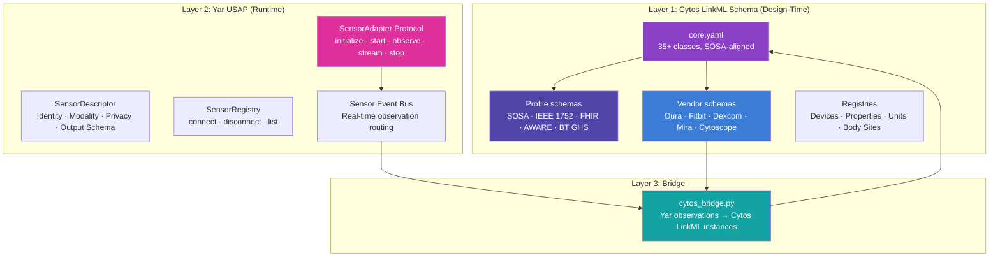

# Cytonome Universal Sensor Reference

> **Status**: v1.0 (Consolidated from unified-sensor-report, sensor-architecture, archive research)
> **Date**: 2026-05-31
> **Scope**: Single authoritative reference for Cytognosis sensor architecture, schema system, standards alignment, and implementation roadmap
> **Supersedes**: `unified-sensor-report.md` (archived), `archive/neuro-pheno/design_draft/schemas/research/sensors.md` (archived)

---

## 1. Architecture Overview

Cytonome collects **data** from the **human body** using **sensors**, and uses dedicated **models** to analyze and embed them. The sensor architecture operates across three layers: a design-time LinkML schema system (Cytos), a runtime Python protocol (Yar USAP), and a bridge layer that connects them.



### Design Principles

1. **Sensor Independence**: Each sensor is self-contained, producing structured observations. Sensors know nothing about each other.
2. **User Sovereignty**: Individuals connect and disconnect sensors at will. No sensor is mandatory. All data stays on-device unless explicitly exported.
3. **Universal Schema**: Every sensor describes itself and its outputs using the same schema language. Any organization can implement a sensor plugin.
4. **SOSA Grammar**: The W3C SOSA/SSN ontology provides the unifying observation grammar across all modalities: a `Sensor` makes an `Observation` of a `FeatureOfInterest` via a `Procedure`, producing a `Result`.

---

## 2. Cytos LinkML Schema System

The Cytos sensor schema is a LinkML-authored, SOSA-aligned family of schemas that generates JSON Schema, Pydantic models, OWL, SHACL, and SQL DDL from a single source.

### Schema Layout

```
cytos/schemas/domains/sensor/
├── sensor.yaml                  Umbrella import (all profiles + vendors)
├── core/
│   ├── core.yaml                Spine: 35+ classes (1,460 lines)
│   ├── selfreport.yaml          Survey instruments, ESM/EMA (199 lines)
│   └── context.yaml             Mobile context events (255 lines)
├── profiles/
│   ├── profile_sosa.yaml        W3C SOSA/SSN class/slot URI bindings
│   ├── profile_ieee1752.yaml    IEEE 1752.1 / Open mHealth body schemas
│   ├── profile_fhir.yaml        FHIR R5 Observation/Device/DeviceMetric
│   ├── profile_bt_ghs.yaml      Bluetooth GHS + IEEE 11073-10206
│   ├── profile_aware.yaml       AWARE smartphone sensors (25 classes)
│   └── profile_mcphases.yaml    PhysioNet mcPHASES validation dataset
├── vendors/
│   ├── vendor_cytoscope.yaml    Cytognosis Cytoscope (draft)
│   ├── vendor_fitbit.yaml       Fitbit (19 Observation subclasses)
│   ├── vendor_dexcom.yaml       Dexcom CGM
│   ├── vendor_mira.yaml         Mira fertility analyzer
│   └── vendor_oura.yaml         Oura Ring (8 Observation subclasses)
└── examples/
    └── mcphases_example.yaml    Synthetic mcPHASES, validates clean
```

Full schema: [sensor/](file:///home/mohammadi/repos/cytognosis/cytos/schemas/domains/sensor/) · [core.yaml](file:///home/mohammadi/repos/cytognosis/cytos/schemas/domains/sensor/core/core.yaml) · [README](file:///home/mohammadi/repos/cytognosis/cytos/schemas/domains/sensor/README.md)

### Core Entity Model

| Class | SOSA Alignment | Purpose |
|---|---|---|
| `SensorEntity` | (abstract root) | Base class for all sensor entities |
| `Subject` | `sosa:FeatureOfInterest` | Human participant with demographics, consent |
| `Device` | `fhir:Device` | Physical artifact hosting sensors |
| `Sensor` | `sosa:Sensor` | Procedure-and-device combo producing observations |
| `Channel` | `ssn:System` | Single logical data channel (ECG lead, accelerometer axis) |
| `Platform` | `sosa:Platform` | Host for sensors (body, bench-top, vehicle) |
| `Deployment` | `ssn:Deployment` | Act of deploying a sensor on a subject for a time period |
| `Session` | `prov:Activity` | Bounded multi-device co-recording session |
| `ObservableProperty` | `sosa:ObservableProperty` | The property being observed (heart rate, glucose, mood) |
| `Procedure` | `sosa:Procedure` | Protocol, algorithm, or method |
| `Observation` | `sosa:Observation` | Single measurement event with typed result |
| `ObservationCollection` | `sosa:ObservationCollection` | Time-series or multi-channel grouping |
| `Result` | `sosa:hasResult` | Polymorphic: scalar, coded, waveform, attachment |
| `Stream` | (Cytos extension) | Continuous data stream with blob reference |
| `SurveyInstrument` | `fhir:Questionnaire` | Named questionnaire (PHQ-9, GAD-7, ASRS) |
| `SurveyResponse` | `fhir:QuestionnaireResponse` | Completed survey with scores |
| `ESMPrompt` | (Cytos extension) | Context-triggered ecological momentary assessment |

### Prefix Namespace Registry

The schema declares 16 URI prefixes for lossless round-trip to RDF/OWL:

| Prefix | Namespace | Purpose |
|---|---|---|
| `sosa:` | `http://www.w3.org/ns/sosa/` | SOSA core |
| `ssn:` | `http://www.w3.org/ns/ssn/` | SSN extended |
| `ssn_system:` | `http://www.w3.org/ns/ssn/systems/` | SSN capabilities |
| `fhir:` | `http://hl7.org/fhir/` | FHIR R5 |
| `loinc:` | `http://loinc.org/` | Clinical observation codes |
| `sct:` | `http://snomed.info/sct/` | SNOMED CT |
| `ucum:` | `http://unitsofmeasure.org/` | Units of measure |
| `mdc:` | `urn:iso:std:iso:11073:10101:` | IEEE 11073 MDC codes |
| `omh:` | `https://w3id.org/openmhealth/schemas/` | Open mHealth |
| `prov:` | `http://www.w3.org/ns/prov#` | Provenance |
| `qudt:` | `http://qudt.org/schema/qudt/` | QUDT quantities |
| `OBI:` | `http://purl.obolibrary.org/obo/OBI_` | Investigation ontology |
| `UBERON:` | `http://purl.obolibrary.org/obo/UBERON_` | Anatomy |
| `HP:` | `http://purl.obolibrary.org/obo/HP_` | Human phenotype |
| `CHEBI:` | `http://purl.obolibrary.org/obo/CHEBI_` | Chemical entities |
| `DUO:` | `http://purl.obolibrary.org/obo/DUO_` | Data use ontology |

### Quick Validation

```bash
cd cytos/schemas/domains/sensor
linkml-lint core/core.yaml                                   # error-clean
gen-json-schema profiles/profile_mcphases.yaml > /tmp/x.json # ~17k lines
gen-pydantic profiles/profile_mcphases.yaml > /tmp/x.py      # 143 classes
linkml-validate -s profiles/profile_mcphases.yaml \
   -C SensorDataset examples/mcphases_example.yaml           # No issues found
```

---

## 3. Standards Coverage

The Cytos schema aligns with five major standards via profile schemas. Each profile subclasses core classes, narrows cardinalities, and binds `class_uri` / `slot_uri` values for lossless round-trip to the target standard's native format.

| Standard | Profile | Coverage | Key Classes |
|---|---|---|---|
| **W3C SOSA/SSN** (2017, ext-2023) | [profile_sosa.yaml](file:///home/mohammadi/repos/cytognosis/cytos/schemas/domains/sensor/profiles/profile_sosa.yaml) | Full | Sensor, Observation, FeatureOfInterest, ObservableProperty, Procedure, Platform, Sample, Result, ObservationCollection, Deployment, System, SystemCapability |
| **IEEE 1752.1 / Open mHealth** | [profile_ieee1752.yaml](file:///home/mohammadi/repos/cytognosis/cytos/schemas/domains/sensor/profiles/profile_ieee1752.yaml) | Full | Header, data-point envelope, data-series, heart-rate, BP, body-temp, BMI, BG, SpO2, RR, step-count, physical-activity, sleep-episode, calories, geoposition, ambient-light/sound/temp, pain, mood |
| **HL7 FHIR R5** | [profile_fhir.yaml](file:///home/mohammadi/repos/cytognosis/cytos/schemas/domains/sensor/profiles/profile_fhir.yaml) | Full | Observation, Device, DeviceMetric, DeviceUsage, Patient (Subject), Vital Signs profile family |
| **Bluetooth GHS / IEEE 11073** | [profile_bt_ghs.yaml](file:///home/mohammadi/repos/cytognosis/cytos/schemas/domains/sensor/profiles/profile_bt_ghs.yaml) | Full | GHSDevice, GHSObservation (all 9 observation classes), measurement-status bitfield, MDC codes |
| **AWARE Framework** | [profile_aware.yaml](file:///home/mohammadi/repos/cytognosis/cytos/schemas/domains/sensor/profiles/profile_aware.yaml) | Full | 25 smartphone sensors + ESM, privacy-preserving hashed contacts |
| **OMOP CDM** | Not yet | Gap | Needed for clinical data warehousing |
| **Apple HealthKit** | Proposed | Gap | Schema designed, not implemented |

For the detailed semantic crosswalk between these standards, see [Semantic Alignment Specification](semantic-alignment.md).

---

## 4. Sensor Taxonomy

Sensors span three scales with different standards and data characteristics at each:

### Micro Scale (Cellular/Molecular)
- Single-cell omics (scRNA-seq, CITE-seq, spatial transcriptomics)
- Flow cytometry, mass cytometry (CyTOF)
- Microscopy (confocal, electron, light sheet)
- **Standards**: AnnData/MuData, single-cell-curation 7.x, OME-NGFF
- **Sampling regime**: Snapshot

### Meso Scale (Organ/System)
- Neuroimaging (EEG, fMRI, MEG, NIRS)
- Clinical labs (BMP, CBC, lipid panel, HbA1c)
- Physiological monitoring (ECG, EMG, EDA)
- **Standards**: BIDS + HED, FHIR Observation, OMOP CDM, NWB
- **Sampling regime**: Bounded continuous (sessions) or periodic (labs)

### Macro Scale (Whole Person/Environment)
- Consumer wearables (Oura, Fitbit, Apple Watch)
- Continuous glucose monitors (Dexcom, Libre)
- Smartphone sensors (AWARE: accelerometer, location, screen, app usage)
- Self-report instruments (PHQ-9, GAD-7, ASRS, ESM)
- Environmental sensors (ambient light, noise, air quality)
- Voice biomarkers (paralinguistic features via HuBERT + openSMILE)
- **Standards**: Open mHealth / IEEE 1752, FHIR, AWARE, Bluetooth GHS
- **Sampling regime**: Ongoing continuous or event-triggered

### Sampling Regime Recommendations

| Regime | Primary Standard | Secondary |
|---|---|---|
| Snapshot omics | AnnData with single-cell-curation 7.x | ISA-Tab |
| Snapshot clinical | FHIR Observation | OMOP MEASUREMENT |
| Periodic | OMOP CDM v5.4 | FHIR ResearchStudy + Observation series |
| Bounded continuous neuro | BIDS 1.11+ with HED | NWB for electrophysiology |
| Bounded continuous imaging | OME-NGFF / OME-Zarr | DICOM for clinical |
| Ongoing continuous wearable | Open mHealth + FHIR | Apple HealthKit/HealthConnect raw |
| Ongoing continuous IoT | OGC SensorThings | SensorML for device, O&M for data |
| Continuous clinical waveform | DICOM Sup 30 | EDF+ for legacy ECG/EEG |

---

## 5. Yar USAP (Universal Sensor Adapter Protocol)

The runtime sensor protocol that Yar uses is defined in [product-implementation.md Phase 7](../../../00-Inbox/product-implementation.md). It is a Python `Protocol`-based interface that acts as the runtime facade over the full Cytos LinkML schema.

### Sensor Protocol

```python
from typing import AsyncIterator, Protocol

class Sensor(Protocol):
    """Universal sensor interface. All sensors implement this."""

    @property
    def descriptor(self) -> SensorDescriptor: ...

    async def initialize(self) -> None:
        """Load models, connect to hardware, validate dependencies."""
        ...

    async def start(self, session_id: str) -> None:
        """Begin producing observations for a session."""
        ...

    async def stop(self) -> None:
        """Stop producing observations. Release resources."""
        ...

    async def observe(self, raw_input: bytes | None = None) -> SensorObservation:
        """Produce a single observation."""
        ...

    def stream(self, raw_input_stream: AsyncIterator[bytes]) -> AsyncIterator[SensorObservation]:
        """Produce a stream of observations from a stream of inputs."""
        ...

    async def teardown(self) -> None:
        """Clean up. Release models from memory."""
        ...
```

### Bridge Mapping (Yar Runtime → Cytos Design-Time)

| Yar (Pydantic, Runtime) | Cytos (LinkML, Design-Time) | Bridge Action |
|---|---|---|
| `SensorDescriptor` | `Sensor` + `Device` + `ObservableProperty` | Split descriptor into SOSA-aligned entities |
| `ObservationField` | `Channel` + `ObservableProperty` | Separate channel metadata from property semantics |
| `SensorObservation` | `Observation` + typed `Result` | Wrap flat dict into SOSA-compliant observation |
| `session_id` (string) | `Session` + `Deployment` | Enrich with multi-device co-recording metadata |
| `confidence` (float) | `ObservationQuality` | Expand scalar to structured quality flags |

### USAP Components

1. **Sensor Descriptor**: declares type, schema, sampling rate, units, calibration
2. **Stream Adapter**: normalizes raw data into Yar's internal signal format
3. **Signal Router**: routes signals to Brain Weather, Pause Day detection, vocal biomarker correlation
4. **Privacy Gate**: CAP-enforced boundary for data retention control

### Plugin Directory Structure

```
~/.cytonome/plugins/<plugin-name>/
├── plugin.yaml           # Plugin metadata
├── sensor.py             # Sensor Protocol implementation
├── schema/
│   └── profile.yaml      # Cytos LinkML profile
└── registries/
    └── devices.yaml      # Device catalog entries
```

Full USAP specification: [product-implementation.md](../../../00-Inbox/product-implementation.md) Phase 7

---

## 6. Vendor Profiles

### Current Vendor Coverage

| Vendor | Profile | Observation Classes | Status |
|---|---|---|---|
| **Fitbit** | [vendor_fitbit.yaml](file:///home/mohammadi/repos/cytognosis/cytos/schemas/domains/sensor/vendors/vendor_fitbit.yaml) | 19 classes (HR, HRV, sleep, steps, activity, stress, SpO2, skin temp) | Complete |
| **Oura Ring** | [vendor_oura.yaml](file:///home/mohammadi/repos/cytognosis/cytos/schemas/domains/sensor/vendors/vendor_oura.yaml) | 8 classes (HR, HRV, skin temp, sleep, activity, readiness, cycle) | Complete |
| **Dexcom** | [vendor_dexcom.yaml](file:///home/mohammadi/repos/cytognosis/cytos/schemas/domains/sensor/vendors/vendor_dexcom.yaml) | CGM glucose readings | Complete |
| **Mira** | [vendor_mira.yaml](file:///home/mohammadi/repos/cytognosis/cytos/schemas/domains/sensor/vendors/vendor_mira.yaml) | Fertility hormone analysis | Complete |
| **Cytoscope** | [vendor_cytoscope.yaml](file:///home/mohammadi/repos/cytognosis/cytos/schemas/domains/sensor/vendors/vendor_cytoscope.yaml) | Cytognosis biosensor (placeholder) | Draft |

Implementation guides:
- [Implementing Wearables (Oura + Fitbit)](../../yar/sensors/implementing-wearables.md)
- [Implementing AWARE](../../yar/sensors/implementing-aware.md)
- [Implementing Health Instruments](../../yar/sensors/implementing-health-instruments.md)

---

## 7. Self-Report Instruments

Health questionnaires, scales, and ecological momentary assessment prompts are treated as sensors in the Cytos schema. The instrument is a `Procedure` (specifically `SurveyInstrument`), and each completed response is an `Observation` (specifically `SurveyResponse`).

Schema: [selfreport.yaml](file:///home/mohammadi/repos/cytognosis/cytos/schemas/domains/sensor/core/selfreport.yaml)

### Supported Instrument Types

| Category | Instruments | LOINC Panels |
|---|---|---|
| **Depression** | PHQ-9, PHQ-2 | 44249-1, 55757-9 |
| **Anxiety** | GAD-7, GAD-2 | 69737-5, 69725-0 |
| **ADHD** | ASRS v1.1, WFIRS | 73633-9 |
| **Sleep** | PSQI, ISI, ESS | 95653-4, 95647-6, 71942-6 |
| **Stress** | PSS-10 | 95654-2 |
| **Well-being** | WHO-5 | 70274-5 |
| **Custom EMA** | Daily mood, energy, focus micro-surveys | Cytos-authored |

Full catalog and implementation: [Implementing Health Instruments](../../yar/sensors/implementing-health-instruments.md)

---

## 8. Interoperability Stack

The interoperability architecture uses five layers, from foundational identifiers up to provenance packaging:

```
Layer 5: Provenance + reproducibility       → Workflow Run RO-Crate, PROV-O
Layer 4: Ecosystem-facing exchange          → Croissant (datasets), HF Model Card, DCAT
Layer 3: Cytognosis-internal manifests      → LinkML: ModelManifest, AssayManifest, DatasetManifest
Layer 2: Domain profile bindings            → single-cell-curation 7.x, BIDS+HED, FHIR/OMOP, OME-NGFF
Layer 1: Identifier and ontology backbone   → Bioregistry + OBO Foundry + EDAM + UCUM + LOINC
```

### Ontology Backbone (Layer 1)

| Ontology | Role |
|---|---|
| **NCBITaxon** | Species |
| **CL** (Cell Ontology) | Cell type |
| **UBERON** | Tissue, organ, anatomy |
| **EFO** | Experimental factor (assay class, sample condition) |
| **OBI** | Investigation, study, planned process, assay |
| **BAO** | Bioassay decomposition (perturbagen / format / detection / signal / target) |
| **MONDO** | Disease |
| **HP** | Phenotype |
| **ChEBI** | Chemical entity |
| **SO** | Sequence Ontology (genomic features, variants) |
| **HGNC, NCBIGene, Ensembl** | Gene identifiers |
| **EDAM** | Operation, Topic, Data, Format |
| **UCUM** | Units of measure |
| **LOINC** | Clinical observation codes |
| **PROV-O** | Provenance |
| **HED** | Hierarchical Event Descriptors |
| **Bioregistry** | CURIE prefix resolver and validator |

### SSSOM Cross-Ontology Mapping

The Cytognosis schema uses SSSOM (Simple Standard for Sharing Ontological Mappings) for formalizing crosswalks between standards. SSSOM mapping sets live alongside the LinkML schemas and are version-controlled.

Toolchain: `sssom-schema` → `sssom-py` → `oaklib` → `curies` + `prefixmaps`

Details: [sssom_tooling_for_cytognosis.md](file:///home/mohammadi/repos/cytognosis/archive/neuro-pheno/design_draft/schemas/research/sssom_tooling_for_cytognosis.md)

### Semantic Alignment

The detailed crosswalk between SOSA/SSN, IEEE 1752, FHIR, and AWARE is documented in the dedicated specification:

→ [Semantic Alignment Specification](semantic-alignment.md)

---

## 9. Known Gaps

| Gap | Severity | Mitigation |
|---|---|---|
| **OMOP CDM profile** | Medium | Needed for clinical data warehousing; design planned |
| **Apple HealthKit / Google Health Connect** | Medium | Schema designed, vendor profile not yet implemented |
| **CDISC ODM** | Low | Needed only for regulated clinical trials |
| **Distributional model outputs** | Medium | No standard for serializing parameterized distributions as model output types; Croissant ML WG tracking |
| **Mixed sampling regimes per subject** | Medium | A subject may contribute snapshot + periodic + continuous data; `SubjectManifest` LinkML class proposed |
| **Feature manifest as content-addressed object** | Low | Cytognosis-authored convention: JSON with SHA256 in model card |
| **Continuous-to-snapshot bridges** | Medium | Every bridge is itself a `ModelManifest` with accepted/output modality declarations |

---

## 10. Research Lineage

This document consolidates and supersedes the following research outputs:

| Original Document | Location | Status |
|---|---|---|
| [sensors.md](../../../05-Research/neuroverse/schema-survey/sensors.md) (226 lines) | archive/neuro-pheno | Superseded by this doc §4 |
| [interop.md](../../../05-Research/neuroverse/schema-survey/interop.md) (234 lines) | archive/neuro-pheno | Superseded by this doc §8 |
| [07_sosa_ssn_to_linkml.md](file:///home/mohammadi/repos/cytognosis/archive/neuro-pheno/design_draft/schemas/research/linkml_kg_playbook/07_sosa_ssn_to_linkml.md) (217 lines) | archive/neuro-pheno | Superseded by semantic-alignment.md |
| [sssom_tooling_for_cytognosis.md](file:///home/mohammadi/repos/cytognosis/archive/neuro-pheno/design_draft/schemas/research/sssom_tooling_for_cytognosis.md) (505 lines) | archive/neuro-pheno | Still current, referenced from §8 |
| [02_schema_landscape.md](file:///home/mohammadi/repos/cytognosis/archive/neuro-pheno/design_draft/schemas/research/linkml_kg_playbook/02_schema_landscape.md) | archive/neuro-pheno | Still current, foundational reference |

---

## 11. File Index

### Active Documentation (`docs/cytonome/yar/sensors/`)

| File | Content |
|---|---|
| **This document** | Master consolidated reference |
| [semantic-alignment.md](semantic-alignment.md) | SOSA/IEEE 1752/FHIR/AWARE crosswalk specification |
| [implementing-aware.md](../../yar/sensors/implementing-aware.md) | AWARE smartphone sensor data gathering guide |
| [implementing-wearables.md](../../yar/sensors/implementing-wearables.md) | Oura Ring and Fitbit integration guide |
| [implementing-health-instruments.md](../../yar/sensors/implementing-health-instruments.md) | PHQ-9, GAD-7, ASRS, and health scales guide |
| [sensor-architecture.md](file:///home/mohammadi/repos/cytognosis/docs/cytonome/yar/sensors/sensor-architecture.md) | Runtime sensor protocol and Voice Sensor 0 |
| [sensor-taxonomy.md](sensor-taxonomy.md) | Full sensor taxonomy with IEEE 1752 coverage |
| [interop-standards.md](interop-standards.md) | Cross-standard interop details |
| [data-formats.md](data-formats.md) | Data storage format recommendations |
| [human-body-systems.md](human-body-systems.md) | HRA and human body ontology integration |
| [ml-models.md](../../yar/sensors/ml-models.md) | ML model manifest and IO contracts |

### Cytos LinkML Schemas (`cytos/schemas/domains/sensor/`)

| File | Content |
|---|---|
| [core/core.yaml](file:///home/mohammadi/repos/cytognosis/cytos/schemas/domains/sensor/core/core.yaml) | Core spine (1,460 lines, 35+ classes) |
| [core/selfreport.yaml](file:///home/mohammadi/repos/cytognosis/cytos/schemas/domains/sensor/core/selfreport.yaml) | Survey instruments and ESM |
| [core/context.yaml](file:///home/mohammadi/repos/cytognosis/cytos/schemas/domains/sensor/core/context.yaml) | Mobile context events |
| [profiles/](file:///home/mohammadi/repos/cytognosis/cytos/schemas/domains/sensor/profiles/) | Standard alignment profiles |
| [vendors/](file:///home/mohammadi/repos/cytognosis/cytos/schemas/domains/sensor/vendors/) | Vendor-specific schemas |

### Yar Product Docs

| File | Sensor Content |
|---|---|
| [product-implementation.md](../../../00-Inbox/product-implementation.md) Phase 7 | USAP specification |
| [adhd-paper-synthesis.md](../../yar/research/adhd-paper-synthesis.md) §8.9 | Sensor integration features for ADHD |
| [yar-unified-feature-comparison-v3.md](file:///home/mohammadi/repos/cytognosis/docs/cytonome/yar/research/yar-unified-feature-comparison-v3.md) | USAP in competitive feature matrix |
