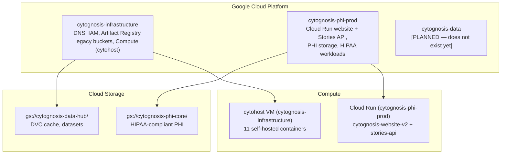
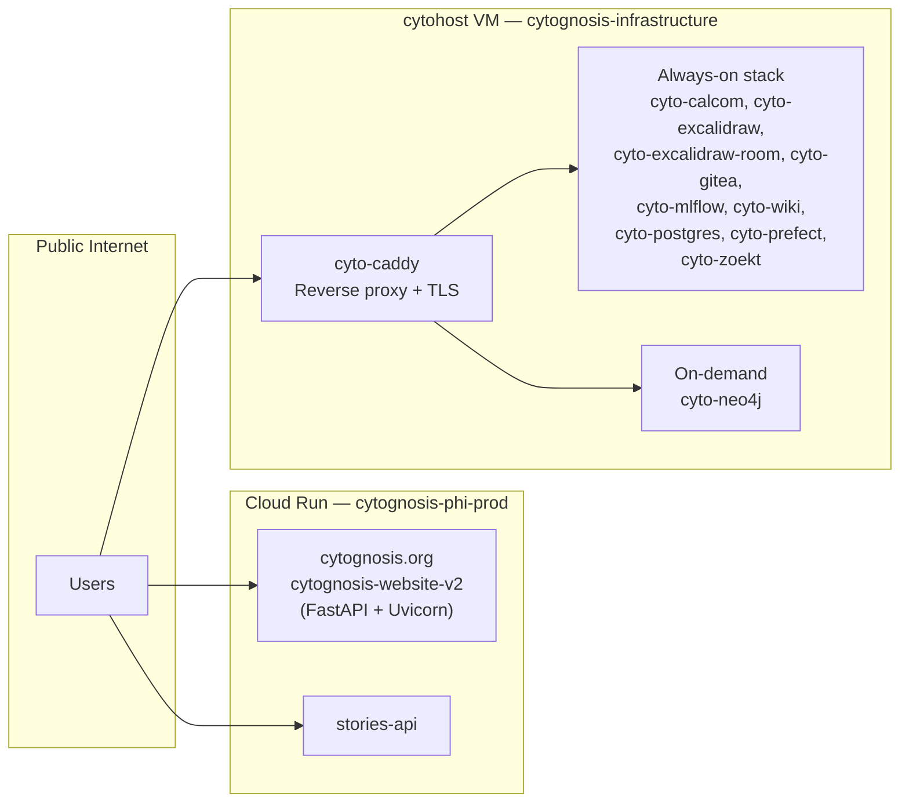

> **Status**: Approved
> **Date**: 2026-06-14
> **Author**: Cytognosis Engineering
> **Audience**: Engineering, DevOps, New Team Members
> **Tags**: `architecture`, `overview`, `gcp`, `infrastructure`
> **Variants**: Technical (this doc) - Readable (same filename in Obsidian vault: 04-Engineering/infrastructure/) - Agent (n/a)
> **Last verified**: 2026-06-19 against gcloud

# Infrastructure Architecture Overview

## BLUF

Cytognosis runs across two live GCP projects (`cytognosis-infrastructure` and `cytognosis-phi-prod`). The core self-hosted stack — 11 containers on a single `e2-highmem-2` VM (`cytohost`) — serves all internal tooling. The public website runs on Cloud Run in `cytognosis-phi-prod`. A third project (`cytognosis-data`) is planned but does not exist yet.

---

## GCP Project Topology



| Project ID | Purpose | Classification | Status |
|---|---|---|---|
| `cytognosis-infrastructure` | DNS zones, IAM root, Artifact Registry, GCS buckets, Compute Engine | Management | Live |
| `cytognosis-phi-prod` | Cloud Run website, Stories API, PHI storage, HIPAA workloads | **Sensitive (PHI)** | Live |
| `cytognosis-data` | Data platform, analytics, BigQuery | Regulated | **Planned — not provisioned** |

> [!NOTE]
> Cloud Run API is **disabled** in `cytognosis-infrastructure`. All Cloud Run services live in `cytognosis-phi-prod`. Similarly, Cloud Functions API and Cloud Scheduler API are disabled in both projects.

---

## Compute: cytohost VM

| Field | Value |
|---|---|
| Name | `cytohost` |
| Machine type | **`e2-highmem-2`** (x86\_64) |
| Zone | `us-central1-b` |
| vCPU | 2 |
| RAM | 16 GB |
| Current external IP | **34.171.23.255** (`cytohost-static`, static IP attached) |
| Status | RUNNING |

> [!NOTE]
> Static IP `cytohost-static` (34.171.23.255) is attached to the VM (promoted from ephemeral 2026-06-14). DNS is stable across VM restarts. Orphaned IPs (`cytohost-ip`, `core-services-ip`, `cytognosis-ip`) were deleted 2026-06-19.

> [!NOTE]
> The default Compute Engine service account on cytohost is **disabled**. It has been replaced by `cytohost-sa@cytognosis-infrastructure.iam.gserviceaccount.com`, attached with OS Login enabled (2026-06-19). CI/CD workflows authenticate via OIDC (Workload Identity Federation).

> [!NOTE]
> **Business-hours auto-start/stop is NOT implemented.** Cloud Scheduler API and Cloud Functions API are both disabled in `cytognosis-infrastructure`. The documented scheduler + wake function are roadmap items. cytohost currently runs 24/7.

---

## Service Architecture



### Self-Hosted Container Stack (11 services)

All containers run via `docker-compose.cytohost-v2.yml` on cytohost.

| Container | Image | Mode | Subdomain |
|---|---|---|---|
| `cyto-caddy` | `caddy:2-alpine` | Always-on | — |
| `cyto-postgres` | `postgres:16-alpine` | Always-on | — |
| `cyto-calcom` | `calcom/cal.com:latest` | Always-on | `cal.cytognosis.org` |
| `cyto-excalidraw` | `excalidraw/excalidraw:latest` | Always-on | `whiteboard.cytognosis.org` |
| `cyto-excalidraw-room` | `excalidraw/excalidraw-room:latest` | Always-on | — |
| `cyto-gitea` | `gitea/gitea:latest` | Always-on | `code.cytognosis.org` |
| `cyto-mlflow` | `ghcr.io/mlflow/mlflow:v2.21.0` | Always-on | `mlflow.cytognosis.org` |
| `cyto-wiki` | `requarks/wiki:2` | Always-on | `wiki.cytognosis.org` |
| `cyto-prefect` | `prefecthq/prefect:3-python3.12` | Always-on | `prefect.cytognosis.org` |
| `cyto-zoekt` | `ghcr.io/sourcegraph/zoekt:latest` | Always-on | `search.cytognosis.org` |
| `cyto-neo4j` | `neo4j:5.18.1-community` | **On-demand** | `kg.cytognosis.org` |

### Cloud Run Services

| Service | Project | URL | Last Deployed |
|---|---|---|---|
| `cytognosis-website-v2` | `cytognosis-phi-prod` | https://cytognosis-website-v2-tdmthpm4va-uc.a.run.app | 2026-06-09 |
| `stories-api` | `cytognosis-phi-prod` | https://stories-api-143911445857.us-central1.run.app | 2025-12-09 |

---

## Domain Architecture

Three apex domains, all registered at Squarespace:

| Domain | Purpose | Authoritative DNS Zone |
|---|---|---|
| `cytognosis.org` | Primary canonical | `cg-org` (ns-cloud-d) |
| `cytognosis.com` | Secondary canonical | `com-zone` (ns-cloud-c) |
| `cytognosis.ai` | Technology canonical | `cg-ai` (ns-cloud-d) |

Three Cloud DNS managed zones in `cytognosis-infrastructure`, one per domain. Duplicate zones (`org-zone`, `cg-com`, `ai-zone`) were deleted 2026-06-19 after migrating all unique records. See [DNS & GCP Architecture](DNS_AND_GCP_ARCHITECTURE.md) for full record details and remediation log.

---

## Data Layer

```
gs://cytognosis-data-hub/
├── dvc-cache/                 Content-addressed DVC cache (shared)
├── processed/cytos/dvc/       Cytos project DVC remote
├── purdue/                    Collaborator workspace
├── shared/
│   ├── soma/                  TileDB-SOMA exports
│   ├── gwas/                  GWAS summary statistics
│   ├── embeddings/            Feature vectors
│   └── reference/             GRCh38, GENCODE GTFs
├── public-mirror/             Public dataset mirrors
└── manifests/                 Dataset manifest JSONs
```

Full bucket inventory: see [GCP Setup](gcp-setup.md).

---

## Provenance Stack

```
L0: DVC + VFS         Content-addressed hashes, SWHID for code
L1: redun / Nextflow  Workflow DAG lineage
L2: Artifact Registry Queryable metadata
L3: MLflow            Experiment tracking
L4: RO-Crate          FAIR publication packages
```

---

## Cross-References

| Document | Relationship |
|---|---|
| [MASTER_INFRASTRUCTURE.md](MASTER_INFRASTRUCTURE.md) | Navigation index for all infra sections |
| [DNS & GCP Architecture](DNS_AND_GCP_ARCHITECTURE.md) | Full DNS zone records and dedup plan |
| [Hosting & Deployment](HOSTING_AND_DEPLOYMENT.md) | Cloud Run + CI/CD + OIDC detail |
| [GCP Setup](gcp-setup.md) | Buckets, IAM, Artifact Registry detail |
| [Self-Hosted Stack](self-hosted/deployment_walkthrough.md) | Container deployment walkthrough |
| [Container Framework](container-framework.md) | Framework reference |
| [DVC Strategy](dvc-strategy.md) | Data version control |
