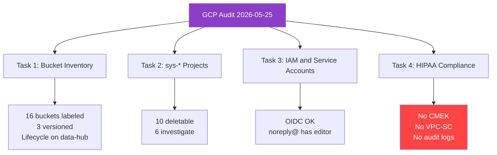

# GCP Infrastructure Audit — 2026-05-25

> **Status**: Active
> **Date**: 2026-06-14
> **Author**: @mohammadi
> **Audience**: engineers, compliance
> **Tags**: `audit`, `gcs`, `hipaa`, `iam`, `compliance`

**Origin**: Imported from `/home/mohammadi/Documents/ObsidianVault/06-Operations/infrastructure/gcp-infrastructure-audit-2026-05-25.md` (Obsidian ADHD-friendly reformatted version, created 2026-05-29).

**Last verified: 2026-05-25** (audit date). Updated ground-truth note: as of 2026-06-14 audit, cytognosis-infrastructure has 16 buckets (matching the audit count plus `cytognosis-phi-prod` in-project and `cytognosis-restricted-prod`); `cytognosis-mlflow-artifacts` NOW EXISTS (created 2026-06-14).

> [!NOTE]
> **TL;DR**: The 2026-05-25 GCP audit covered **16 buckets**, **16 sys-* projects**, **service accounts**, **IAM bindings**, and **HIPAA compliance**. Key actions taken: versioning enabled on 3 critical buckets, lifecycle rules added to data-hub, labels applied to all 16 buckets. **3 critical HIPAA gaps** found: no CMEK, no VPC-SC, no audit logging on PHI project.

---

## Quick summary

> [!TIP]
> **11 actions taken**, **3 critical gaps found**, **5 open decisions** pending.

---

## Task 1: Bucket inventory

> [!TIP]
> **14 buckets** in `cytognosis-infrastructure`, **2 buckets** in `cytognosis-phi-prod`. All labeled and UBLA-enabled.

### Changes applied

| Action | Target | Status |
|--------|--------|--------|
| Enable versioning | `gs://cytognosis-data-hub` | Done |
| Enable versioning | `gs://cytognosis-phi-core` | Done |
| Enable versioning | `gs://cytognosis-phi-collab-nih` | Done |
| Lifecycle rules (60d Nearline, 180d Coldline) | `gs://cytognosis-data-hub` | Done |
| Labels (`team`, `managed-by`) | All 16 buckets | Done |
| Verify UBLA | All 16 buckets | Already enabled |

> [!WARNING]
> **13 of 16 buckets** lack versioning. Consider enabling on `cytognosis-audit-7yr` (audit data should be immutable) and `cytognosis-internal` at minimum.

| Bucket | Versioning | Lifecycle | Labels |
|--------|-----------|-----------|--------|
| `cytoagent` | No | None | Yes |
| `cytoexplorer` | No | None | Yes |
| `cytognosis` | No | None | Yes |
| `cytognosis-audit-7yr` | No | None | Yes |
| `cytognosis-data-hub` | Yes | Yes (60d NL, 180d CL) | Yes |
| `cytognosis-internal` | No | None | Yes |
| `cytognosis-public-data` | No | None | Yes |
| `cytomark` | No | None | Yes |
| `cytonome` | No | None | Yes |
| `cytopilot` | No | None | Yes |
| `cytoscope` | No | None | Yes |
| `cytoskeleton` | No | None | Yes |
| `cytoverse` | No | None | Yes |
| `neuroverse` | No | None | Yes |

---

## Task 2: sys-* project audit

> [!TIP]
> **16 sys-* projects** found. All are Google-managed (auto-created by Apps Script). None are accessible via standard GCP console.

| Category | Count | Action |
|----------|-------|--------|
| Delete (untitled/empty) | 4 | Safe to delete from Resource Manager |
| Duplicate (redundant form handlers) | 6 | Identify active one, delete rest |
| Investigate (unique form handlers) | 6 | Check if still serving via Apps Script |

> [!IMPORTANT]
> To delete: GCP Console, IAM and Admin, Resource Manager, filter for `sys-*`. Or delete the associated Apps Script projects in Google Workspace.

---

## Task 3: IAM and service accounts

| Project | Account | Status |
|---------|---------|--------|
| infra | Compute Engine default | Disabled (intentional) |
| infra | Website Deployer | Active (needed for CI/CD) |
| phi-prod | Compute Engine default | Active (phi-prod SA is not disabled) |
| phi-prod | Stories API SA | Active (needed) |

### IAM findings

| Finding | Severity | Action |
|---------|----------|--------|
| `noreply@cytognosis.org` has `roles/editor` | Medium | Scope down from editor |
| `noreply@cytognosis.org` has `roles/datastore.user` | Low | Verify if needed for forms |
| Single owner (`mohammadi@cytognosis.org`) | Low | Add second owner for bus-factor |

### OIDC federation

| Pool | Provider | Condition |
|------|----------|-----------|
| `github-pool` | GitHub OIDC (`https://token.actions.githubusercontent.com`) | `repository_owner=="cytognosis"` |

---

## Task 4: HIPAA compliance gaps

> [!CAUTION]
> **3 critical gaps** must be fixed before storing any PHI data in production.

| Control | Status (2026-05-25) | Status (2026-06-14) | Details |
|---------|---------------------|---------------------|---------|
| **CMEK encryption** | Not configured | Partially done | PHI buckets now use CMEK (`phi-bucket-key`); non-PHI buckets still use Google-managed keys |
| **VPC Service Controls** | Not configured | Not configured | API not enabled in cytognosis-infrastructure |
| **Audit logging** | Not configured | Unknown | `auditConfigs` returned empty at audit time |
| Versioning on PHI buckets | Done | Done | Enabled during audit |
| UBLA | Done | Done | Already enabled |
| Labels | Done | Done | Applied |
| Default SA disabled | Done | Done | cytognosis-infrastructure default SA disabled |

### Remediation priority

| Priority | Action | Effort |
|----------|--------|--------|
| P0 | Enable Data Access Audit Logging on cytognosis-phi-prod | Low |
| P0 | Configure CMEK for all non-PHI buckets (currently Google-managed) | Medium |
| P1 | Create VPC-SC perimeter around cytognosis-phi-prod | High |
| P1 | Review org policy constraints | Medium |
| P2 | Lifecycle rules on PHI buckets | Low |
| P2 | Object Lock / retention policies on remaining buckets | Low |

---

## Open decisions

| # | Decision needed |
|---|----------------|
| 1 | sys-* cleanup: which form handler(s) are still active? |
| 2 | noreply@ editor access: scope down from `roles/editor`? |
| 3 | CMEK: which KMS keyring location and rotation schedule for non-PHI? |
| 4 | VPC-SC: which projects and services in the perimeter? |
| 5 | Versioning: enable on remaining 13 buckets? |

---

## Glossary

| Term | Definition |
|------|-----------|
| UBLA | Uniform Bucket-Level Access; simplifies permissions by removing per-object ACLs |
| CMEK | Customer-Managed Encryption Keys; you own and rotate the keys |
| VPC-SC | VPC Service Controls; creates a security perimeter to prevent data exfiltration |
| OIDC | OpenID Connect; federated authentication (GitHub Actions to GCP) |
| sys-* projects | Auto-created GCP projects from Apps Script or Cloud Functions |
| IAM | Identity and Access Management; controls who can do what on GCP |
| BAA | Business Associate Agreement; HIPAA contract with Google |
| NL/CL | Nearline / Coldline; cheaper storage classes for infrequently accessed data |

---

## Related docs

- [MASTER_INFRASTRUCTURE.md](../MASTER_INFRASTRUCTURE.md)
- [service-accounts.md](../service-accounts.md)
- [DNS_AND_GCP_ARCHITECTURE.md](../DNS_AND_GCP_ARCHITECTURE.md)
- [data-strategy/TECHNICAL_DATA_INFRASTRUCTURE.md](../data-strategy/TECHNICAL_DATA_INFRASTRUCTURE.md)
- 2026-06-14 ground-truth audit: `/home/mohammadi/.config/Claude/local-agent-mode-sessions/3750a277-0510-4821-96ac-e031664d2c06/.../outputs/infra/GCP_GROUND_TRUTH.md`
