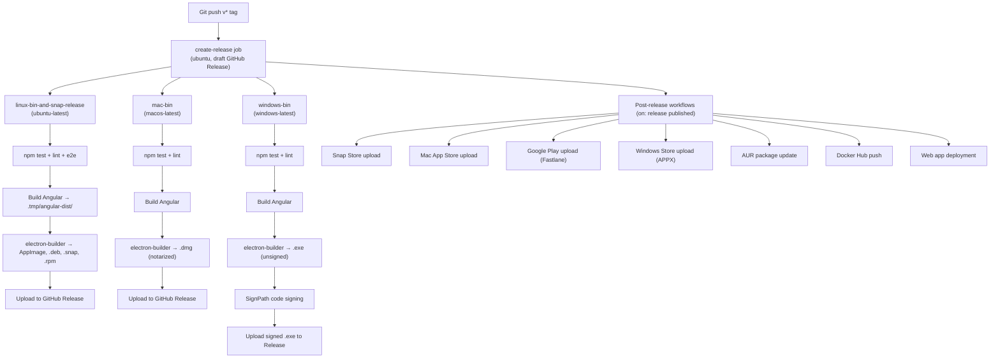

# Mono-Repo Best Practices for Multi-Platform Apps

> **Status**: Active
> **Date**: 2026-06-14
> **Author**: @mohammadi
> **Audience**: engineers
> **Tags**: `ci-cd`, `monorepo`, `github-actions`

## 1. How Super Productivity Does It

### Architecture: One App, Multiple Shells

Super Productivity uses the **single-codebase, platform-shell** pattern:

```
super-productivity/
├── src/                      # Angular app (THE one codebase)
│   └── app/
│       └── features/         # 42 feature modules
├── electron/                 # Desktop shell (Electron main process)
│   ├── main.ts
│   ├── ipc-handlers/
│   └── tsconfig.electron.json
├── android/                  # Mobile shell (Capacitor → Gradle)
│   └── app/
├── ios/                      # Mobile shell (Capacitor → Xcode)
├── packages/                 # Shared libraries (npm workspaces)
│   ├── sync-core/            # Framework-agnostic sync engine
│   ├── sync-providers/       # Sync backend implementations
│   ├── shared-schema/        # Shared types
│   ├── plugin-api/           # Plugin interface
│   └── vite-plugin/          # Plugin bundler
├── build/                    # Platform-specific build assets
│   ├── icon.png
│   ├── entitlements.mac.plist
│   └── electron-builder.mas.yaml
├── electron-builder.yaml     # Desktop packaging config
├── capacitor.config.ts       # Mobile packaging config
├── angular.json              # Frontend build config
└── .github/workflows/        # 26 CI/CD workflows
```

**Key insight**: The Angular app is built **once** into static HTML/JS/CSS, then:
- **Electron** wraps it for desktop (Windows, macOS, Linux)
- **Capacitor** wraps it for mobile (Android, iOS)
- **Nginx/CDN** serves it as a PWA for web
- **Docker** containerizes the nginx setup

### Build Pipeline: Tag-Triggered Multi-Platform



### Download Page Implementation

SP's download page links directly to GitHub Release assets:
```
https://github.com/johannesjo/super-productivity/releases/latest/download/<filename>
```

The `latest` redirector always points to the most recent non-draft, non-prerelease GitHub Release. This is zero-infrastructure: no custom download server needed.

**Platform matrix:**

| Platform | Format | Distribution |
|----------|--------|-------------|
| Windows x64 | NSIS Setup.exe | GitHub Release + Microsoft Store |
| Windows arm64 | NSIS Setup.exe | GitHub Release |
| Windows portable | .exe | GitHub Release |
| macOS universal | .dmg | GitHub Release + Mac App Store |
| Linux x64 | AppImage | GitHub Release |
| Linux x64 | .deb | GitHub Release |
| Linux x64 | .rpm | GitHub Release |
| Linux x64 | .snap | Snap Store + GitHub Release |
| Linux x64 | Flatpak | Flathub |
| Android | APK | Google Play |
| iOS | IPA | App Store |
| Web | PWA | app.super-productivity.com |
| Docker | Image | Docker Hub |

---

## 2. Best Practices for Yar's Mono-Repo

### Recommended Directory Structure

> [!IMPORTANT]
> Yar has a unique architecture: Python backend (FastAPI) + Flutter mobile + future Electron desktop + future browser extension. Unlike SP which is one Angular app wrapped in different shells, Yar has genuinely different frontends sharing a common backend.

```
Yar/
├── src/                          # Python packages (the brain)
│   ├── cap/                      # Standalone CAP module
│   └── yar/                      # Yar application
│       ├── api/                  # FastAPI routes
│       ├── core/                 # Business logic
│       ├── data/                 # Data files (prompts, schemas)
│       │   ├── prompts/
│       │   └── schemas/          # ← just moved here
│       ├── integrations/         # Anytype, LinkML, WADM
│       ├── models/               # Pydantic models
│       └── storage/              # Local persistence
├── apps/                         # ← NEW: all user-facing applications
│   ├── mobile/                   # Flutter app (phone + tablet)
│   │   ├── android/
│   │   ├── ios/
│   │   ├── lib/                  # Dart source
│   │   └── pubspec.yaml
│   ├── desktop/                  # Future: Electron/Tauri wrapper
│   │   ├── electron/             # or tauri/
│   │   └── package.json
│   └── extension/                # Future: Chrome/Firefox extension
│       ├── manifest.json
│       ├── popup/
│       └── content-scripts/
├── assets/                       # Shared brand assets
│   └── brand/                    # Logos, icons
├── build/                        # ← NEW: build configs & scripts
│   ├── docker/                   # Dockerfiles
│   ├── icons/                    # Generated platform icons
│   └── ci/                       # CI helper scripts
├── docs/                         # Documentation
├── tests/                        # Python test suite
├── .github/
│   └── workflows/                # ← NEW: CI/CD pipelines
│       ├── ci.yml                # Lint + test on PR/push
│       ├── release-backend.yml   # Python package release
│       ├── release-mobile.yml    # Flutter mobile builds
│       ├── release-desktop.yml   # Future: desktop builds
│       └── release-extension.yml # Future: extension builds
├── pyproject.toml                # Python project config
└── README.md
```

### Why `apps/` Instead of Top-Level Directories

| Pattern | Used by | Pros | Cons |
|---------|---------|------|------|
| **Top-level `mobile/`, `desktop/`, `extension/`** | Current Yar | Simple | Clutters root, unclear hierarchy |
| **`apps/` directory** | Turborepo, Nx, Lerna conventions | Clear separation, scalable | One extra directory level |
| **Separate branches** | Some projects | Total isolation | Nightmare to keep in sync |
| **Separate repos** | Microservices | Full independence | Duplicated CI, shared code is hard |

**Recommendation**: `apps/` directory pattern.

Separate branches for different platforms is an anti-pattern for our use case. The code for all platforms should live together because:
1. Shared models and schemas must stay in sync
2. CI should test everything together to catch integration issues
3. A single tag release can trigger all platform builds

### Mobile App Build Considerations (Flutter)

Current `mobile/` is a Flutter app. Flutter already handles multi-platform natively:
```bash
flutter build apk          # Android APK
flutter build appbundle    # Android App Bundle (Play Store)
flutter build ios          # iOS
flutter build macos        # macOS native
flutter build linux        # Linux native
flutter build windows      # Windows native
```

> [!TIP]
> Flutter can potentially serve as BOTH mobile AND desktop shell, eliminating the need for Electron entirely. This simplifies the build matrix significantly.

### Desktop Considerations: Electron vs Tauri vs Flutter Desktop

| Option | Pros | Cons |
|--------|------|------|
| **Electron** | Mature, huge ecosystem, SP proves it works | Heavy (100MB+), Chromium dependency |
| **Tauri** | Lightweight (10MB), Rust core, uses system WebView | Younger ecosystem, inconsistent WebView across OSes |
| **Flutter Desktop** | Same codebase as mobile, single build system | Web integration harder, less mature desktop plugins |

**Recommendation**: Start with **Flutter for everything** (mobile + desktop). The mobile app (`apps/mobile/`) already exists in Flutter. Flutter desktop adds macOS, Linux, and Windows from the same codebase. Only add Electron/Tauri if Flutter desktop proves insufficient for a specific feature (e.g., system tray, deep OS integration).

---

## 3. CI/CD Architecture for Yar

### Phase 1: Basic CI (Implement Now)

```yaml
# .github/workflows/ci.yml
name: CI
on:
  push:
    branches: [main]
  pull_request:
    branches: [main]

jobs:
  python-tests:
    runs-on: ubuntu-latest
    steps:
      - uses: actions/checkout@v4
      - uses: astral-sh/setup-uv@v6
      - run: uv sync --dev
      - run: uv run ruff check src/ tests/
      - run: uv run ruff format --check src/ tests/
      - run: uv run pytest tests/ -q --tb=short

  flutter-analyze:
    runs-on: ubuntu-latest
    steps:
      - uses: actions/checkout@v4
      - uses: subosito/flutter-action@v2
        with:
          channel: stable
      - working-directory: apps/mobile
        run: |
          flutter pub get
          flutter analyze
          flutter test
```

### Phase 2: Release Pipeline (After Phase 1 Stabilizes)

```yaml
# .github/workflows/release.yml
name: Release
on:
  push:
    tags: ['v*']

jobs:
  create-release:
    runs-on: ubuntu-latest
    steps:
      - uses: actions/checkout@v4
      - uses: softprops/action-gh-release@v2
        with:
          draft: true

  python-package:
    needs: create-release
    runs-on: ubuntu-latest
    steps:
      - uses: actions/checkout@v4
      - uses: astral-sh/setup-uv@v6
      - run: uv build
      - uses: softprops/action-gh-release@v2
        with:
          files: dist/*

  android-apk:
    needs: create-release
    runs-on: ubuntu-latest
    steps:
      - uses: actions/checkout@v4
      - uses: subosito/flutter-action@v2
      - uses: actions/setup-java@v4
        with:
          distribution: temurin
          java-version: 17
      - working-directory: apps/mobile
        run: flutter build apk --release
      - uses: softprops/action-gh-release@v2
        with:
          files: apps/mobile/build/app/outputs/flutter-apk/app-release.apk

  ios-build:
    needs: create-release
    runs-on: macos-latest
    steps:
      - uses: actions/checkout@v4
      - uses: subosito/flutter-action@v2
      - working-directory: apps/mobile
        run: flutter build ios --release --no-codesign
      # Code signing and TestFlight upload would go here

  linux-desktop:
    needs: create-release
    runs-on: ubuntu-latest
    steps:
      - uses: actions/checkout@v4
      - uses: subosito/flutter-action@v2
      - run: sudo apt-get install -y clang cmake ninja-build pkg-config libgtk-3-dev
      - working-directory: apps/mobile  # Same Flutter app, desktop target
        run: flutter build linux --release
      # Package as AppImage, .deb, etc.

  macos-desktop:
    needs: create-release
    runs-on: macos-latest
    steps:
      - uses: actions/checkout@v4
      - uses: subosito/flutter-action@v2
      - working-directory: apps/mobile
        run: flutter build macos --release
      # Package as .dmg

  windows-desktop:
    needs: create-release
    runs-on: windows-latest
    steps:
      - uses: actions/checkout@v4
      - uses: subosito/flutter-action@v2
      - working-directory: apps/mobile
        run: flutter build windows --release
      # Package as NSIS installer
```

### Phase 3: Store Distribution (After Beta)

Separate on-release workflows (SP pattern):
- `publish-google-play.yml` — Fastlane for Android
- `publish-app-store.yml` — Fastlane for iOS
- `publish-snap.yml` — snapcraft upload
- `publish-flathub.yml` — Flathub PR
- `publish-docker.yml` — Docker Hub push

---

## 4. Immediate Actions

### Step 1: Move `mobile/` → `apps/mobile/`
```bash
mkdir -p apps
mv mobile apps/mobile
```

### Step 2: Move `assets/brand/` → `assets/brand/` (already correct, keep as-is)

### Step 3: Create `build/` directory
```bash
mkdir -p build/{docker,icons,ci}
```

### Step 4: Create `.github/workflows/ci.yml`
Start with Python CI only. Add Flutter CI after the mobile app structure is confirmed.

### Step 5: Update `.gitignore` for new structure

### Step 6: Update `README.md` with new structure diagram

> [!WARNING]
> **Do NOT use separate branches** for different platforms. This is a common anti-pattern that creates merge nightmares. Use directory-based separation with tag-triggered CI jobs instead.

---

## 5. Download Page Strategy

For Yar's eventual download page, follow SP's zero-infrastructure approach:

1. **Host downloads on GitHub Releases** (free, reliable, CDN-backed)
2. **Use `latest` redirector URLs**: `https://github.com/cytognosis/yar/releases/latest/download/yar-<platform>.<ext>`
3. **Auto-detect platform** with JavaScript on the download page
4. **List all variants** with direct links for manual selection

This eliminates the need for a custom download server or S3 bucket.
