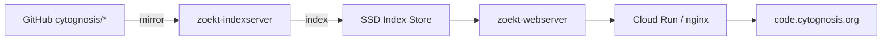

> **Status**: Active
> **Date**: 2026-06-14
> **Author**: @mohammadi
> **Audience**: engineers
> **Tags**: `code-search`, `zoekt`, `self-hosted`
> **Variants**: Technical (this doc) - Readable (same filename in Obsidian vault: 04-Engineering/infrastructure/) - Agent (n/a)

**Last verified: 2026-06-14** — `code.cytognosis.org` subdomain confirmed in `cg-org` DNS zone pointing to cytohost (`34.171.23.255`, ephemeral). Deployment target is cytohost (`e2-highmem-2`, `us-central1-b`).

# Code Search Infrastructure: Zoekt vs GitNexus

> For `code.cytognosis.org` deployment and agent-accessible cross-repo code intelligence

---

## 1. Executive Summary

| Feature | Zoekt (Sourcegraph) | GitNexus |
|---------|-------|----------|
| **Primary use** | Fast trigram-indexed code search | AST-based knowledge graph for code |
| **Index type** | Trigram (regex + substring) | AST + dependency graph |
| **Agent integration** | API/Web UI | MCP server (native) |
| **Multi-repo** | Yes (indexserver config) | Yes (global registry at `~/.gitnexus/`) |
| **Privacy** | Self-hosted | Zero-server (local/WASM) |
| **Search type** | Text/regex/symbol | Structural (impact analysis, blast radius, coordinated rename) |
| **Maintenance** | Sourcegraph-maintained Go | Community-maintained |
| **Deployment** | Docker/systemd | CLI + MCP |
| **License** | Apache-2.0 | MIT/Apache-2.0 |

**Recommendation: Deploy BOTH.**
- **Zoekt** at `code.cytognosis.org` for fast text/regex search across all repos
- **GitNexus** locally for agent-accessible structural code intelligence via MCP

---

## 2. Zoekt for `code.cytognosis.org`

### Deployment Plan

```yaml
# infrastructure/services/zoekt/config.json
{
  "GitHubOrg": "cytognosis",
  "GitHubToken": "${GITHUB_TOKEN}",
  "Name": "code.cytognosis.org",
  "Repos": [
    "cytognosis/cytoskeleton",
    "cytognosis/cytos",
    "cytognosis/cytoskills",
    "cytognosis/cytocast",
    "cytognosis/Yar",
    "cytognosis/CAP",
    "cytognosis/cytoexplorer",
    "cytognosis/infrastructure",
    "cytognosis/org"
  ]
}
```

### Infrastructure



- **Cloud Run service** with persistent SSD volume for index
- **Scheduled indexing** every 15 minutes
- **Universal Ctags** for symbol extraction
- **Estimated index size**: ~500MB for all repos

### Search Capabilities
- Full regex search across all repos
- Symbol search (functions, classes, types)
- File path filtering
- Language filtering
- Repository filtering
- Line-level results with context

---

## 3. GitNexus for Agent Intelligence

### Why GitNexus is Critical for Cytognosis

Our multi-repo architecture creates cross-repo dependencies that text search cannot resolve:
- cytoskeleton defines schemas → cytos imports them
- cytocast generates packages → that depend on cytoskeleton
- cytoskills wraps code → from cytos, cytoskeleton, Yar

GitNexus's AST-based knowledge graph can:
1. **Impact analysis**: "If I change `cytoskeleton.schemas.core.CytosEntity`, what breaks?"
2. **Coordinated rename**: Rename a symbol across all repos atomically
3. **Process-grouped search**: Find all code that participates in "KG building" workflow
4. **Change detection**: Map a git diff to affected processes across repos

### Integration

```yaml
# Agent MCP config for GitNexus
{
  "name": "gitnexus",
  "command": "gitnexus",
  "args": ["mcp-server"],
  "env": {
    "GITNEXUS_REPOS": "~/repos/cytognosis/cytoskeleton,~/repos/cytognosis/cytos,~/repos/cytognosis/Yar"
  }
}
```

### Local Installation

```bash
# Install GitNexus
cargo install gitnexus  # or npm install -g gitnexus

# Index all Cytognosis repos
gitnexus index ~/repos/cytognosis/cytoskeleton
gitnexus index ~/repos/cytognosis/cytos
gitnexus index ~/repos/cytognosis/Yar
gitnexus index ~/repos/cytognosis/cytoskills
gitnexus index ~/repos/cytognosis/cytocast

# Start MCP server
gitnexus mcp-server
```

---

## 4. Comparison with Alternatives

| Tool | Type | Self-Hosted | MCP | Cost | Verdict |
|------|------|------------|-----|------|---------|
| **Zoekt** | Trigram search | ✅ | ❌ (API only) | Free | **Deploy for web search** |
| **GitNexus** | AST graph | ✅ (local) | ✅ Native | Free | **Deploy for agent intelligence** |
| **Sourcegraph** | Full platform | ✅ | Via API | $49/user/mo (Enterprise) | Overkill for our size |
| **GitHub Code Search** | Trigram | ❌ (hosted) | ❌ | Free (public) | Already available, but no self-hosted |
| **Livegrep** | In-memory regex | ✅ | ❌ | Free | Less capable than Zoekt |
| **OpenGrok** | Text + ctags | ✅ | ❌ | Free | Heavier, Java-based |
| **Hound** | Trigram | ✅ | ❌ | Free | Simpler than Zoekt |

---

## 5. Implementation Priority

| Step | Priority | Effort |
|------|----------|--------|
| Install GitNexus locally for agent use | P0 | 1 hour |
| Add GitNexus MCP to Antigravity config | P0 | 15 min |
| Deploy Zoekt on Cloud Run | P1 | 1 day |
| Configure `code.cytognosis.org` DNS | P1 | 15 min |
| Add GitNexus skill to cytoskills | P2 | 2 hours |
| Create Zoekt admin dashboard | P2 | 4 hours |
