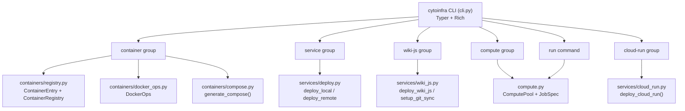

> **Status**: Active
> **Date**: 2026-06-14
> **Author**: Cytognosis Engineering
> **Audience**: engineers, DevOps
> **Tags**: `system-doc`, `cytoinfra`, `cli`, `infrastructure`, `python`
> **Last verified**: 2026-06-14 against source at `infrastructure/src/cytoinfra`

# cytoinfra — Package Documentation

## Purpose & Scope

`cytoinfra` is the internal Python CLI and library for managing Cytognosis infrastructure. It covers container registry management, docker-compose service deployment, Wiki.js operations, compute pool submission (Prefect + Cloud Batch), and Cloud Run deployments.

**Repository**: `cytognosis/infrastructure` — `src/cytoinfra/`
**Entry point**: `cytoinfra` (installed via `pip install -e .` from the `infrastructure` repo)

---

## Package Architecture



---

## Module Reference

### cli.py

Top-level Typer app. Registers all command groups. No business logic; delegates to submodules.

Entry point defined in `pyproject.toml` as `cytoinfra = "cytoinfra.cli:main"`.

### containers/registry.py

Manages a YAML-based container manifest (`assets/containers/manifest.yaml`).

**Key types:**

| Class / Field | Description |
|---|---|
| `ContainerEntry` | Dataclass for one container: name, version, image, source, ports, volumes, environment, description |
| `ContainerRegistry` | Loads/saves the manifest YAML; provides `add()`, `get()`, `remove()`, iteration |
| `GCP_ARTIFACT_REGISTRY` | `us-central1-docker.pkg.dev/cytognosis-infrastructure/cytognosis-compute` |
| `VALID_SOURCES` | `docker-hub`, `ghcr`, `quay`, `internal`, `custom` |

### containers/compose.py

Converts `ContainerEntry` list to a compose-spec dict and writes it to disk.

**Key function:** `generate_compose(services, network="cytognosis") -> dict`

### containers/docker_ops.py

Thin subprocess wrapper for docker/podman operations: `build`, `push`, `pull`, `compose_up`, `status`.

**Key class:** `DockerOps(runtime=None)` — auto-detects docker vs podman.

### services/deploy.py

Deploys services via docker-compose, locally or over SSH.

**Key functions:**

| Function | Description |
|---|---|
| `deploy_local(service_name, compose_file)` | Runs `compose up` for one service locally |
| `deploy_remote(service_name, host, compose_file)` | Rsync + SSH deploy to a remote host |
| `get_status(name) -> ServiceStatus` | Get status of a single service |
| `stop_service(name, compose_file)` | Stop a service |

### services/wiki_js.py

Deploys and configures Wiki.js on cytohost.

**Key functions:**

| Function | Description |
|---|---|
| `deploy_wiki_js(host, domain, db_password, port, compose_file)` | Full Wiki.js deploy |
| `setup_git_sync(repo_url, branch) -> dict` | Generate git sync config for Wiki.js Admin > Storage |

**Compose file resolution order** (first match wins):
1. `compose_file` argument
2. `CYTOINFRA_COMPOSE_FILE` env var
3. `container_framework/docker-compose.cytohost-v2.yml` relative to infrastructure repo root
4. `docker-compose.cytohost-v2.yml` in current working directory

### compute.py

Compute pool configuration and job submission via Prefect + GCP Cloud Batch.

**Key types:**

| Class / Field | Description |
|---|---|
| `ComputePool` | Dataclass: name, machine_type, accelerator, max_instances, spot, timeout_hours, labels |
| `JobSpec` | Dataclass: name, command, pool, env |
| `load_pools(config=None)` | Load pool config from YAML; falls back to built-in defaults |
| `save_pools(pools, output)` | Write pool config to YAML |
| `submit_job(spec, dry_run=False)` | Submit a job to Prefect + Cloud Batch |

**Default GCP region/project:** `us-central1` / `cytognosis-infrastructure`

### services/cloud_run.py

Manual/emergency Cloud Run deployment wrapper around `gcloud run deploy`.

**Primary use case:** The CI/CD path is GitHub Actions OIDC. This module is for emergency manual deploys.

**Key function:** `deploy_cloud_run(image, service, project, region, allow_unauthenticated, max_instances, memory, cpu, env_vars, dry_run) -> DeployResult`

**Default service/project:** `cytognosis-website-v2` / `cytognosis-phi-prod`

**`DeployResult` fields:** `service`, `project`, `region`, `image`, `url`, `dry_run`, `command`, `extra`

---

## CLI Command Reference

### `cytoinfra container`

Container registry and image operations.

| Sub-command | Required Args | Key Options | Effect |
|---|---|---|---|
| `list` | — | `--manifest` | Print all registered containers as a Rich table |
| `add <name>` | `--image` | `--version`, `--source`, `--ports`, `--manifest` | Add entry to manifest YAML |
| `remove <name>` | — | `--yes` / `-y`, `--manifest` | Remove entry; prompts for confirmation unless `--yes` |
| `build <name>` | — | `--context`, `--manifest` | Build image for registered entry |
| `push <name>` | — | `--manifest` | Push image to its registry |
| `pull <name>` | — | `--manifest` | Pull image from its registry |

### `cytoinfra service`

Service deployment and status.

| Sub-command | Required Args | Key Options | Effect |
|---|---|---|---|
| `deploy <name>` | — | `--compose-file`, `--host user@host` | Deploy via local compose, or SSH if `--host` given |
| `status [name]` | — | — | All containers if no name; single service detail if name given |
| `stop <name>` | — | `--compose-file` | Stop service |

### `cytoinfra wiki-js`

Wiki.js management.

| Sub-command | Required Args | Key Options | Effect |
|---|---|---|---|
| `setup` | — | `--host`, `--domain`, `--db-password` / env `WIKI_DB_PASSWORD`, `--port`, `--compose-file` / env `CYTOINFRA_COMPOSE_FILE` | Deploy Wiki.js; default domain `wiki.cytognosis.org` |
| `sync-config` | — | `--repo-url`, `--branch` | Print JSON git sync config for Wiki.js Admin |

### `cytoinfra compute`

Compute pool listing and initialization.

| Sub-command | Required Args | Key Options | Effect |
|---|---|---|---|
| `pools` | — | `--config` | Print all pools as a Rich table |
| `init` | — | `--output` | Write default pool config to YAML |

### `cytoinfra run`

Submit a compute job.

| Arg / Option | Default | Description |
|---|---|---|
| `COMMAND` (positional) | — | Command to run in the pool container |
| `--name` / `-n` | auto-generated | Job name |
| `--pool` / `-p` | `cpu-light` | Compute pool name |
| `--env` / `-e` | — | `KEY=VALUE` env vars; repeatable |
| `--dry-run` | False | Print config without submitting |

### `cytoinfra cloud-run`

Cloud Run deployment (manual/emergency path).

| Arg / Option | Default | Env var override | Description |
|---|---|---|---|
| `IMAGE` (positional) | — | — | Full container image reference |
| `--service` | `cytognosis-website-v2` | `CYTOINFRA_CLOUD_RUN_SERVICE` | Cloud Run service name |
| `--project` | `cytognosis-phi-prod` | `CYTOINFRA_CLOUD_RUN_PROJECT` | GCP project ID |
| `--region` | `us-central1` | `CYTOINFRA_CLOUD_RUN_REGION` | GCP region |
| `--max-instances` | `10` | — | Max concurrent instances |
| `--memory` | `512Mi` | — | Memory per instance |
| `--cpu` | `1` | — | CPU per instance |
| `--env-var` | — | — | Extra env vars (`KEY=VALUE`); repeatable |
| `--dry-run` | False | — | Print gcloud command; do not execute |

---

## Environment Variables

| Variable | Used By | Default | Required? |
|---|---|---|---|
| `CYTOINFRA_COMPOSE_FILE` | `wiki-js setup`, `service deploy` | auto-resolved | No — falls back to repo-relative path |
| `WIKI_DB_PASSWORD` | `wiki-js setup` | — | **Yes** when deploying Wiki.js |
| `CYTOINFRA_CLOUD_RUN_PROJECT` | `cloud-run deploy` | `cytognosis-phi-prod` | No |
| `CYTOINFRA_CLOUD_RUN_REGION` | `cloud-run deploy` | `us-central1` | No |
| `CYTOINFRA_CLOUD_RUN_SERVICE` | `cloud-run deploy` | `cytognosis-website-v2` | No |

---

## Common Patterns

```bash
# Deploy all services (local)
cytoinfra service deploy cyto-wiki
cytoinfra service deploy cyto-prefect

# Deploy Wiki.js with env-based password
WIKI_DB_PASSWORD=secret cytoinfra wiki-js setup --domain notes.cytognosis.org

# Submit a CPU job
cytoinfra run python process.py --pool cpu-medium

# Submit a GPU job (dry run first)
cytoinfra run python train.py --pool gpu-t4 --dry-run
cytoinfra run python train.py --pool gpu-t4

# Emergency manual Cloud Run deploy
cytoinfra cloud-run deploy \
  us-central1-docker.pkg.dev/cytognosis-phi-prod/cytognosis-website-v2/website:latest

# Cloud Run dry run (inspect gcloud command)
cytoinfra cloud-run deploy <image> --dry-run
```

---

## See Also

- [cytoinfra-quickref.md](cytoinfra-quickref.md) — scannable command cheat sheet
- [QUICK_REFERENCE.md](../QUICK_REFERENCE.md) — master infrastructure quick reference
- [MASTER_INFRASTRUCTURE.md](../MASTER_INFRASTRUCTURE.md) — full infrastructure narrative
- [container-framework.md](../container-framework.md) — docker-compose stack overview
- [HOSTING_AND_DEPLOYMENT.md](../HOSTING_AND_DEPLOYMENT.md) — Cloud Run + CDN detail
