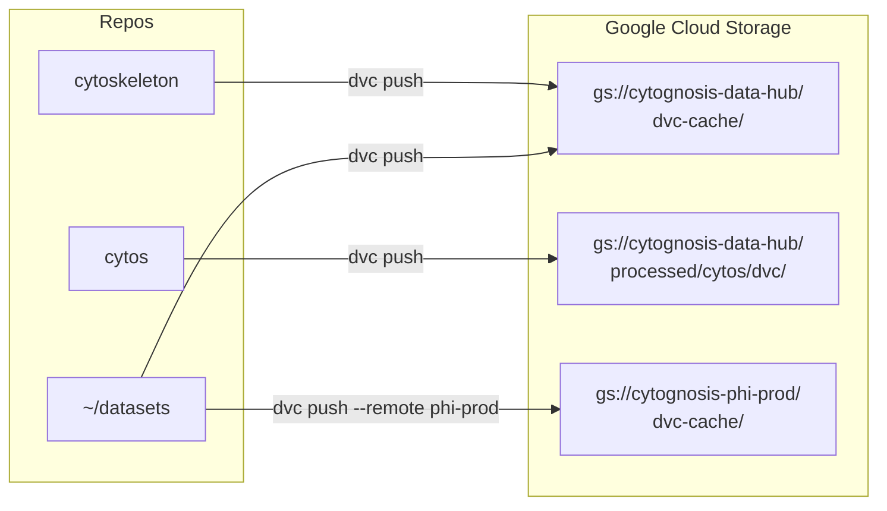

# DVC Dual-Remote Strategy

> **Status**: Active
> **Date**: 2026-06-14
> **Author**: @mohammadi
> **Audience**: engineers
> **Tags**: `dvc`, `gcs`, `data-versioning`

**Last verified: 2026-06-14** — `gs://cytognosis-data-hub` confirmed with versioning and lifecycle rules. `gs://cytognosis-mlflow-artifacts` bucket NOW EXISTS (created 2026-06-14, `us-central1`). `cytognosis-data` project does NOT exist; DVC remotes use `cytognosis-infrastructure` and `cytognosis-phi-prod` projects only.

> v1.1 | Last updated: 2026-06-14

## Remote Configuration

Cytognosis uses three DVC remotes across two GCS buckets to separate open and restricted data:

| Remote | Bucket | Access | Used By |
|--------|--------|--------|---------|
| **data-hub** (default) | `gs://cytognosis-data-hub/dvc-cache/` | Open | All repos |
| **phi-prod** | `gs://cytognosis-phi-prod/dvc-cache/` | Restricted (HIPAA) | datasets repo |
| **cytos-project** | `gs://cytognosis-data-hub/processed/cytos/dvc/` | Open | cytos repo |

## Per-Repo Configuration

### datasets repo (`~/datasets`)

```ini
[core]
    remote = data-hub
['remote "data-hub"']
    url = gs://cytognosis-data-hub/dvc-cache/
['remote "phi-prod"']
    url = gs://cytognosis-phi-prod/dvc-cache/
```

- Default pushes to `data-hub` (open data)
- PsychENCODE and clinical data pushes to `phi-prod`

### cytos repo (`~/repos/cytognosis/cytos`)

```ini
[core]
    remote = data-hub
['remote "data-hub"']
    url = gs://cytognosis-data-hub/processed/cytos/dvc/
```

- KG build outputs and pipeline artifacts

### cytoskeleton repo (`~/repos/cytognosis/cytoskeleton`)

```ini
[core]
    remote = data-hub
['remote "data-hub"']
    url = gs://cytognosis-data-hub/dvc-cache/
```

- Validation enum YAML files (~14 MB)

## Data Flow



## Common Commands

### Push/Pull

```bash
# Push open data (default remote)
cd ~/datasets && dvc push

# Push restricted data to HIPAA bucket
cd ~/datasets && dvc push 07-single-cell/PEC.dvc --remote phi-prod

# Pull all tracked data
cd ~/datasets && dvc pull

# Pull from restricted remote
cd ~/datasets && dvc pull 07-single-cell/PEC.dvc --remote phi-prod
```

### Pipeline Execution

```bash
# Run all DVC pipeline stages
cd ~/repos/cytognosis/cytos && dvc repro

# Run a single stage
dvc repro topic_areas

# Check status
dvc status
dvc diff
```

### New Dataset Tracking

```bash
cd ~/datasets
dvc add 01-ontologies/go/go-plus.owl
git add 01-ontologies/go/go-plus.owl.dvc .gitignore
git commit -m "feat: track GO-Plus ontology"
dvc push
git push
```

## Authentication

DVC uses gcloud Application Default Credentials (ADC):

```bash
# Interactive login
gcloud auth application-default login

# Service account (CI/CD)
gcloud auth activate-service-account --key-file=key.json
```

## Data Access Tiers

| Tier | Remote | Access Control | Examples |
|------|--------|----------------|----------|
| **Open** | data-hub | ADC, any team member | Ontologies, open KGs, GENCODE |
| **Restricted** | phi-prod | Named service accounts only | PsychENCODE, clinical data |
| **Public mirror** | data-hub/public-mirror | Read-only | Published benchmark datasets |

## Integration with Provenance

DVC md5 hashes are embedded in:
- W3C PROV-J provenance sidecars (`.provenance.yaml`)
- RO-Crate metadata (`ro-crate-metadata.json`)
- Dataset manifest files (`manifests/<dataset>.manifest.json`)

## Related Documentation

- [Architecture Overview](architecture.md)
- [GCP Setup](gcp-setup.md)
- [Infrastructure DVC Configuration](data-strategy/dvc-configuration.md)
