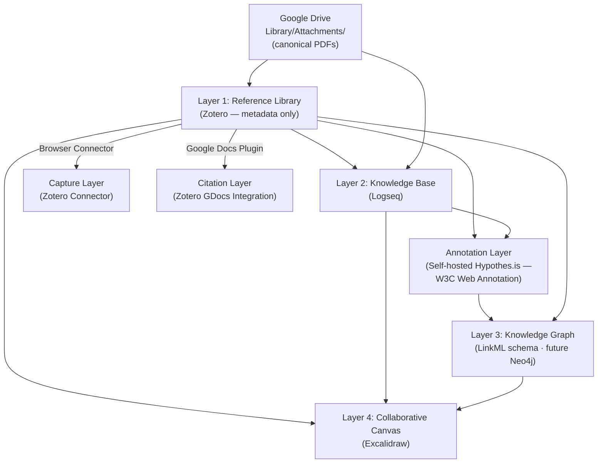

# Research Knowledge Management Platform

> **Status**: Active
> **Date**: 2026-06-14
> **Author**: @mohammadi
> **Audience**: engineers, researchers
> **Tags**: `self-hosted`, `logseq`, `zotero`, `knowledge-management`

**Last verified: 2026-06-14** — Logseq is deployed at `notes.cytognosis.org` on cytohost (`34.171.23.255`, ephemeral; `cg-org` DNS zone).

> Architecture for the open, sovereign stack for paper management, annotation, knowledge graphs, collaborative whiteboarding, and citation management — self-hosted on Cytognosis GCP infrastructure.

This document is the architecture for the *research workflow tier* — what researchers see and use day-to-day. The underlying data architecture (where PDFs live, how metadata syncs, how annotations are stored) is the [sovereign paper library architecture](../data-strategy/paper-library-architecture.md). Read that first if you're trying to understand the storage layout.

## Layered stack

Layer 0 — **Google Drive** — is the canonical PDF store. Every other layer references Drive object IDs rather than holding its own copy. See [`paper-library-architecture.md`](../data-strategy/paper-library-architecture.md) for full detail.

## Layer 1 — Reference Library: Zotero (metadata only)

**Replaces** ReadCube Papers, Mendeley, Paperpile.

| Capability | Status |
| --- | --- |
| Paper metadata | ✅ Zotero 7 (open source) — group library on `zotero.org` for free metadata sync |
| PDF storage | ✅ **Google Drive `Library/Attachments/`** — Zotero stores only a linked URL, never the file |
| In-PDF annotation | ✅ ISO 32000 (the standard PDF annotation format), Drive-synced for portability — **not** Zotero's built-in proprietary annotation engine |
| Browser capture | ✅ Zotero Connector (Chrome / Firefox) |
| Google Docs citations | ✅ Native Zotero plugin — 9,000+ citation styles |
| Shared org library | ✅ Zotero Group Library (free for metadata, unlimited) |
| Mobile access | ✅ Zotero iOS app; Android via Zoo for Zotero |

> **Architectural decision** — we **do not** self-host the Zotero data server. The previously evaluated `foxsen/zotero-selfhost` Docker image is no longer maintained on Docker Hub, and the active forks are not load-bearing enough to make sovereignty depend on them. Instead, Zotero metadata syncs via the free cloud (which never sees a PDF), and the canonical PDFs live on Drive. This is the path documented in [`paper-library-architecture.md`](../data-strategy/paper-library-architecture.md). The legacy `container_framework/configs/services/zotero.yaml` is retained for optional internal use but is not part of the deployed `core` stack.

## Annotation layer — Self-hosted Hypothes.is (W3C Web Annotation)

**New since v1 of this document.** Hypothes.is (BSD-licensed, self-hostable) is deployed in `cytognosis-infrastructure` against an own PostgreSQL database. Annotations follow the W3C Web Annotation Data Model and can target *any* URI-addressable knowledge graph object — papers, code repos, models, datasets, ontology terms.

This replaces the previous reliance on Zotero's proprietary annotation engine (which doesn't sync without paid storage and uses an undocumented SQLite format). Personal libraries become filtered annotation queries rather than copies of the corpus.

## Layer 2 — Knowledge Base: Logseq

**Replaces** loose notes, scattered Google Docs, manual paper summaries.

Why Logseq over the alternatives:

| Tool | Verdict |
| --- | --- |
| **Logseq** ✅ | Open source, local-first, plain-markdown files, native Zotero integration, knowledge-graph visualization, block references. Best fit for research workflows. |
| **Joplin** ❌ | Good Evernote replacement but lacks bidirectional linking and graph visualization. No Zotero integration. |
| **Anytype** ⚠️ | Innovative object model but younger / less mature; custom protocol (not plain files), harder to integrate. |
| **Reor** ⚠️ | Excellent for AI-powered note linking, but desktop-only, no mobile, no collaboration. Better as a supplement. |

Key Logseq capabilities:

- Native **Zotero integration** — pull references, link notes to papers (which resolve to Drive PDFs).
- **Knowledge-graph** visualization of how papers / concepts interconnect.
- **Block references** — cite specific paragraphs across notes.
- Stores everything as **plain markdown** — Git-syncable, portable.
- Plugins: Zotero, GPT, Mermaid, Kanban.

## Layer 3 — Knowledge Graph: LinkML schema → Neo4j

**Replaces** manual literature review mapping.

The objective layer is driven by the [scholarly knowledge graph schema](../data-strategy/scholarly-knowledge-graph.md) (LinkML v0.4.0): papers, authors, code, models, datasets, biological entities, workflows, protocols, instruments, with typed `Paper ↔ Code / Model / Dataset` relationship edges and RO-Crate alignment.

The personalization layer is W3C Web Annotation nodes harvested from Hypothes.is — personal and team libraries are queries over annotations, not copies.

Operational deployment:

- **Today** — Monday.com [Resources workspace](../data-strategy/monday-resource-boards.md) is the human-readable registry for the schema's entity types.
- **Soon** — Neo4j (already provisioned in the [`research` stack](../../container_framework/configs/stacks/research.yaml)) will hold the production KG. ETL pipelines feed it from the Zotero API, OpenAlex, the GitHub API, the HuggingFace Hub, and SSSOM-mapped ontology sources.

Cross-ontology mapping (UMLS, MONDO, HP, CL, CHEBI, NCBITaxon, SNOMED CT) flows through the [SSSOM stack](../data-strategy/sssom-cross-ontology-mapping.md).

## Layer 4 — Collaborative Canvas: Excalidraw

**Replaces** Lucid Spark, ClickUp whiteboards.

| Tool | Verdict |
| --- | --- |
| **Excalidraw** ✅ | Best overall: hand-drawn aesthetic, real-time collaboration via `excalidraw-room`, self-hostable, AI text-to-diagram, embeddable in Logseq. |
| **tldraw** ⚠️ | Powerful SDK if we want to build a custom research canvas with embedded data widgets. |
| **Whitebophir** ❌ | Too basic — no shapes library, no text-to-diagram. |
| **draw.io** ⚠️ | Excellent for formal diagrams, complementary rather than primary. |

Excalidraw deployment:

- Containers — `excalidraw/excalidraw` + `excalidraw/excalidraw-room` for the real-time backend.
- Configured in [`container_framework/configs/services/excalidraw.yaml`](../../container_framework/configs/services/excalidraw.yaml).
- Routed via Caddy to `whiteboard.cytognosis.org` (intended subdomain).

## Layer 5 (optional) — Project Management: Leantime

**Replaces** ClickUp task management.

- Open-source project management with Kanban, Gantt, time tracking.
- Self-hostable via Docker.
- Not a primary need if the Logseq Kanban plugin or Monday.com suffices.

## Gaps

| Gap | Solution |
| --- | --- |
| Unified search across papers, notes, and graph | Lightweight API querying Zotero (metadata), Logseq (markdown full-text), Neo4j (graph), Hypothes.is (annotations) |
| Mobile annotation | Zotero iOS for papers; Logseq mobile for notes |
| Live dataset embeds on canvas | tldraw SDK for custom widgets if Excalidraw's plain links are insufficient |
| Automated paper-to-graph pipeline | OntoGPT / Instructor structured extraction (chapter 20 of the [LinkML+KG playbook](../data-strategy/linkml-kg-playbook.md)) feeding Neo4j; tracked via MLflow |
| ReadCube → Zotero migration | Already underway — see the migration section of [`paper-library-architecture.md`](../data-strategy/paper-library-architecture.md) |

## Deployment placement

| Service | Stack | Instance class |
| --- | --- | --- |
| Caddy reverse proxy | `core` (always-on) | `e2-medium` |
| Excalidraw + Excalidraw Room | `core` (always-on) | `e2-medium` |
| Mermaid Live Editor | `core` (always-on) | `e2-medium` |
| Logseq Web | `core` (always-on) | `e2-medium` |
| MLflow | `core` (always-on) | `e2-medium` |
| Cal.com + Postgres | `core` (always-on) | `e2-medium` |
| Hypothes.is + Postgres | additional `core`-tier service (planned) | `e2-medium` (lightweight; PostgreSQL is the heavyweight) |
| Neo4j (knowledge graph) | `research` (on-demand) | `e2-standard-4` minimum |
| Jupyter (Data Science) | `research` (on-demand) | `e2-standard-4` minimum |
| Reor | local desktop | researcher's laptop |
| Zotero (desktop) | local desktop | researcher's laptop, syncs to Zotero cloud (metadata) and Drive (PDFs) |

## Recommended implementation order

1. **Zotero (metadata-only) + Drive PDFs** — install Zotero desktop + Connector, migrate from ReadCube, configure Drive paths, populate the Group Library. See the migration section of [`paper-library-architecture.md`](../data-strategy/paper-library-architecture.md).
2. **Logseq** — install desktop, configure the Zotero plugin, establish the org-wide markdown repo (Git-synced).
3. **Excalidraw** — already in the deployed `core` stack.
4. **Hypothes.is** — deploy self-hosted instance into `cytognosis-infrastructure` against own PostgreSQL.
5. **Neo4j knowledge graph** — already provisioned in the `research` stack; build the entity-extraction and ingest pipelines per the [LinkML+KG playbook](../data-strategy/linkml-kg-playbook.md).
6. **Reor** — install on individual workstations, connect to Ollama for local AI.
7. **Leantime** *(optional)* — only if Logseq Kanban + Monday.com don't suffice.
