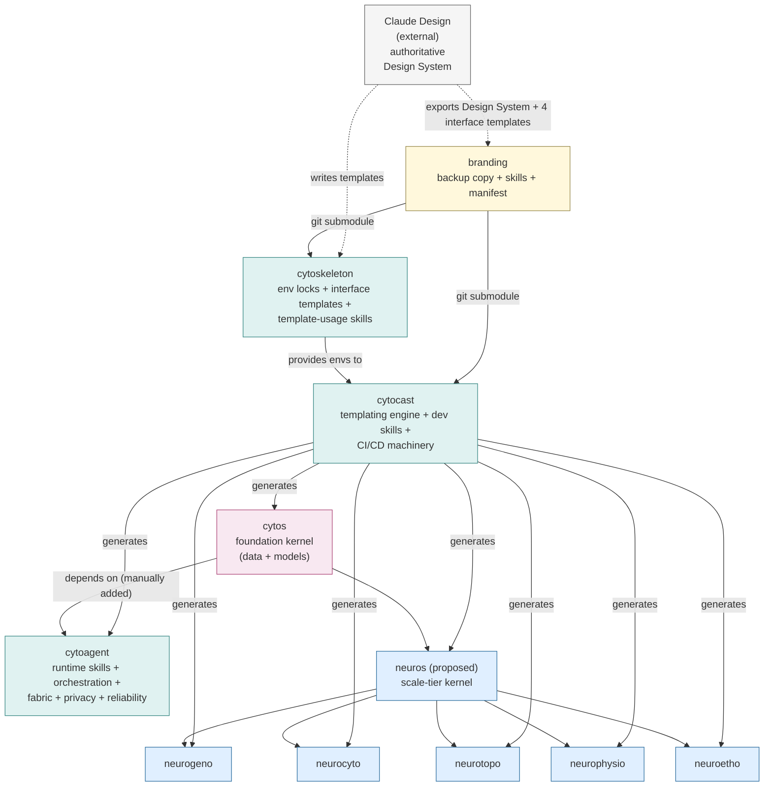
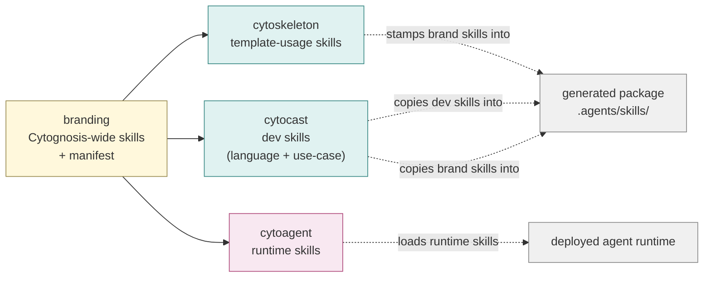
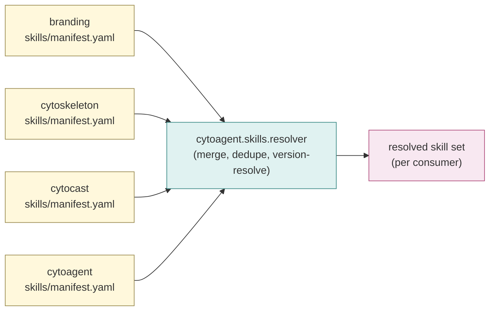
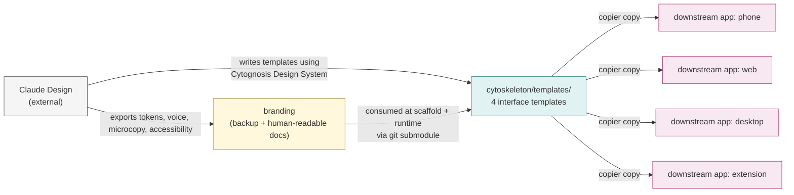
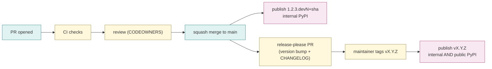
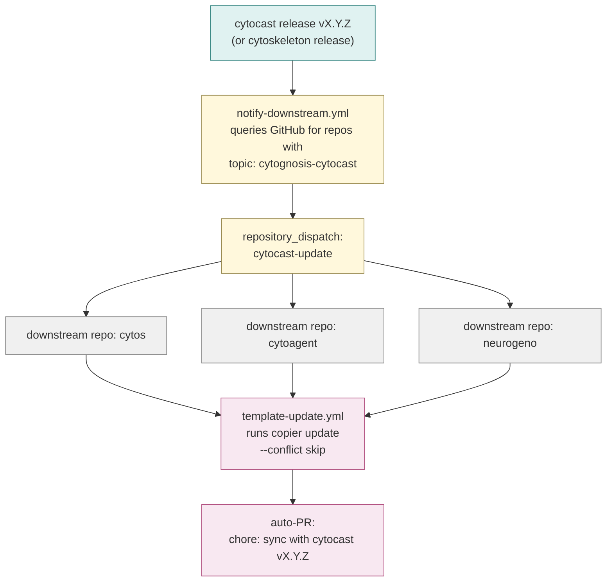
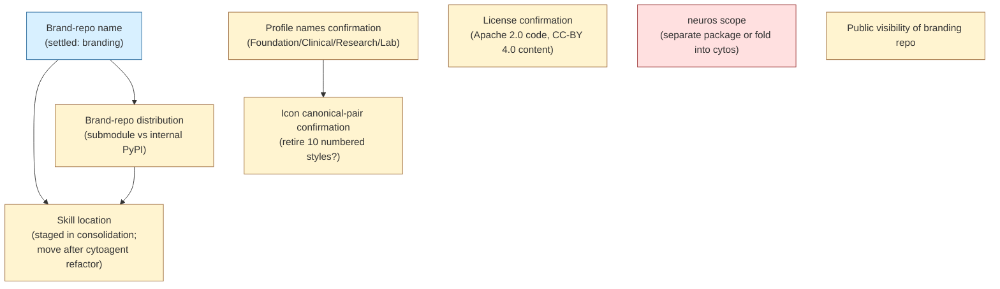

# Cytognosis Platform Architecture: Master Design

> Consolidated reference covering repos, naming, dependencies, scopes, skill model, CI/CD posture, change propagation, and roadmap.
> Supersedes `archive/01_cytoderma_design.md` and `archive/02_cytoplasma_design.md`.
> Status: design, 2026-05-13 (finalized).
> Author: Shahin Mohammadi (mohammadi@cytognosis.org), with synthesis assistance from Claude.

> **Finalization update, 2026-05-13**: this strategic doc has been paired with the operational consolidation at `../../design-system-consolidation-2026-05/`, which carries concrete branding and cytoskeleton layouts, two new master skills, five revised core skills, and three Claude Design iteration prompts. Concrete file paths, skill names, and per-repo structures are in the consolidation; this doc remains the strategic source of truth. See §13 for the cross-link map.

## 0. Scope and posture

This document is the single source of truth for the Cytognosis repo topology, the dependency graph between repos, where skills live and how they are discovered, the CI/CD machinery shared across all generated packages, and the mechanism by which template changes propagate from upstream tooling into downstream packages.

Posture: **template-first, schema-enforced, openly licensed, reproducibly built, propagation-aware**. Every Cytognosis code repo is either a tool (cytoskeleton, cytocast, branding) or a cytocast-generated package (cytos, cytoagent, the neuro family, future packages). The same CI/CD machinery ships into every generated package. Upstream changes propagate to downstream packages on a known schedule with explicit PR review.

---

## 1. Naming register (recap)

| Tier | Convention | Members | Status |
|---|---|---|---|
| Brand | full classical Greek suffixes | `cytognosis`, `cytoscope`, `cytoverse`, `cytonome` | fixed |
| Foundation | Greek root for the cell itself | `cytos` (the `cyto-` root, written `CytOS` in stylized contexts) | fixed |
| Infrastructure | cellular-biology metaphors mapped to function | `cytoskeleton`, `cytocast`, `cytoagent` (+ `cytoflux` / `cytopraxis` / `cytoassay` placeholders) | confirmed core 3 |
| Scale | `neuro` + Greek combining-form stem | `neurogeno`, `neurocyto`, `neurotopo`, `neurophysio`, `neuroetho`; reserved `neurodyno`, `neurochemo`, `neurodoxo` | confirmed 5 + 3 reserved |
| Brand assets | descriptive name | `branding` (or `cytognosis-brand` if a Greek name is preferred later) | placeholder |
| Intermediate scale kernel | TBD | `neuros` (proposed; scope pending) | placeholder |

The previously proposed `cytoderma` and `cytoplasma` repo names are **retired**. Their scope has been absorbed: interface templates live inside `cytoskeleton`; agent orchestration, fabric, privacy, and reliability primitives live inside `cytoagent`.

Display conventions: lowercase in code (`cytos`, `cytoagent`), capitalized in running text (`Cytos`, `Cytoagent`), stylized where the operating-system reading is the point (`CytOS` on slides, `Cytoagent` in narrative prose).

---

## 2. Repository inventory

| Repo | Tier | Role | Code-heavy? | Generated by | Internal deps |
|---|---|---|---|---|---|
| `branding` | brand-asset | backup copy of Cytognosis Design System (authored in Claude Design); Cytognosis-wide skills usable by all agents and people; skill manifest | no (nox sessions + content) | hand-authored / synced from Claude Design | none |
| `cytoskeleton` | infra | dep locks for all envs; the four interface templates (phone, web, desktop, extension); template-usage skills | no (nox sessions + lock manifests + template files) | hand-authored | `branding` (git submodule) |
| `cytocast` | infra | the templating engine; language- and use-case-specific dev skills; shared CI/CD workflows for every generated package; copier profiles for all generated packages | yes (Python + workflows) | hand-authored | `branding` (git submodule), `cytoskeleton` (consumed for envs) |
| `cytos` | foundation | data + models + schemas (LinkML, GA4GH, BIDS, NWB, etc.); the foundation kernel | yes (Python) | `cytocast` | `cytoskeleton` env, `branding` skills |
| `cytoagent` | infra | runtime agent skills + orchestration + fabric (mDNS, NATS, Tailscale, Iroh) + privacy + reliability + reference agents (interviewer, supervisor, crisis) | yes (Python + TS + Dart SDKs) | `cytocast` | `cytoskeleton` env, `branding` skills, `cytos` (manually added post-scaffold) |
| `neuros` | scale-kernel (proposed) | shared neuro-scale kernel that the five `neuro*` repos depend on | yes (Python) | `cytocast` | `cytos` |
| `neurogeno` | scale | RDoC Genes | yes | `cytocast` | `cytos`, `neuros` |
| `neurocyto` | scale | RDoC Cells | yes | `cytocast` | `cytos`, `neuros` |
| `neurotopo` | scale | RDoC Circuits | yes | `cytocast` | `cytos`, `neuros` |
| `neurophysio` | scale | RDoC Physiology | yes | `cytocast` | `cytos`, `neuros` |
| `neuroetho` | scale | RDoC Behavior | yes | `cytocast` | `cytos`, `neuros` |

---

## 3. Dependency graph

### 3.1 Repo-level



### 3.2 Skill data flow



---

## 4. Per-repo design

### 4.1 `branding`

**Role.** Backup copy of the Cytognosis Design System (authored, revised, and maintained authoritatively in Claude Design) plus the Cytognosis-wide skill manifest plus Cytognosis-wide skills usable by all agents and people working with Cytognosis (brand voice rules, design tokens in human-readable form, accessibility budget, microcopy patterns, content review checklists).

**Posture.** Light. No heavy code. Utility delivered through nox sessions (e.g., `nox -s render-guidelines`, `nox -s validate-tokens`, `nox -s install-skills`).

**Contents.**

```
branding/
├── README.md
├── noxfile.py
├── design-system/
│   ├── tokens/                  # exported from Claude Design (JSON)
│   ├── typography/
│   ├── color/
│   ├── motion/
│   ├── iconography/
│   ├── accessibility-budget.md
│   └── guidelines.html          # generated, human-readable
├── voice-and-tone/
│   ├── brand-voice.md
│   ├── microcopy-patterns.md
│   └── review-checklist.md
├── skills/
│   ├── manifest.yaml            # the master Cytognosis skill manifest
│   ├── brand-review/            # skill: review content against brand voice
│   ├── tone-check/              # skill: validate tone of a draft
│   └── ...
└── scripts/
    └── sync-from-claude-design.py
```

**Consumers.** Cytoskeleton (git submodule), cytocast (git submodule), every cytocast-generated package (skills copied in at scaffold time).

**Update flow.** Claude Design is the authoring tool. A periodic sync (manual today; could be automated via a webhook later) updates the branding from the latest Claude Design export. The branding's job is to render those exports into human-readable forms (Markdown / HTML) and to expose them as skills.

### 4.2 `cytoskeleton`

**Role.** Hosts the locked dependency environments (e.g., the `cytognosis` env on ROCm with PyTorch + Lightning + JAX); hosts the four interface templates (phone, web, desktop, browser extension) built using Claude Design; hosts template-usage skills (skills that help an agent or developer use the cytoskeleton templates correctly).

**Posture.** Tooling repo. Light. Utility delivered via nox sessions.

**Contents.**

```
cytoskeleton/
├── README.md
├── noxfile.py
├── envs/
│   ├── cytognosis.yaml          # full bio-ml + ROCm env (lock manifest)
│   ├── cytognosis-frontend.yaml # Node + Flutter + Tauri toolchains
│   ├── cytognosis-agent.yaml    # agent runtime deps (NATS, Tailscale, Iroh, ...)
│   └── ...
├── templates/
│   ├── app-phone/               # Flutter, written by Claude Design
│   ├── app-web/                 # React 19 + Vite + shadcn, written by Claude Design
│   ├── app-desktop/             # Tauri v2 wrapping app-web
│   ├── app-extension/           # MV3 + side panel
│   └── shared/
│       ├── design-system-package/   # consumes branding tokens
│       ├── api-client-package/
│       ├── fabric-client-package/   # consumes cytoagent client SDK
│       ├── voice-client-package/
│       ├── auth-shell-package/
│       ├── telemetry-package/
│       └── agent-presentation-package/
├── skills/
│   ├── manifest.yaml            # template-usage skills manifest
│   ├── pick-template/           # skill: choose the right interface template for a use case
│   ├── update-template/         # skill: apply a copier update to a downstream app
│   └── ...
├── branding/                  # git submodule
└── docs/
```

**Consumers.** Cytocast (consumes envs and templates), downstream interface apps (generated from cytoskeleton's templates via cytocast).

**Note on Claude Design.** The four interface templates and their shared packages are produced and revised by Claude Design using the Cytognosis Design System (which lives authoritatively in Claude Design and does not depend on Cytognosis repos). Cytoskeleton hosts the output. When Claude Design revises a template, cytoskeleton releases a new version, and the propagation mechanism in §8 fans the change out to downstream apps.

### 4.3 `cytocast`

**Role.** The templating engine (built on `copier`). Owns language- and use-case-specific dev skills (skills that coding agents like Antigravity or Claude Code use to write code in downstream packages). Owns the shared CI/CD workflows for every generated package (lint, test, publish, sign, attest). Provides copier profiles for every kind of generated package (`cytos`, `cytoagent`, `neuros`, neuro-scale repos, future packages).

**Posture.** Tool, Python-heavy (the templating engine). Houses the CI/CD machinery as workflow templates that ship into every generated package.

**Contents.**

```
cytocast/
├── README.md
├── pyproject.toml
├── noxfile.py
├── copier.yaml                  # answers schema for `copier copy`
├── profiles/
│   ├── cytos.yaml
│   ├── cytoagent.yaml
│   ├── neuros.yaml
│   ├── neuro-scale.yaml
│   ├── library.yaml             # generic Python library profile
│   └── tool.yaml                # generic nox-driven tool profile
├── templates/
│   ├── _shared/
│   │   ├── .github/workflows/   # ci.yml, publish-dev.yml, publish-release.yml,
│   │   │                        #   release-please.yml, security.yml, deps.yml,
│   │   │                        #   template-update.yml, notify-downstream.yml
│   │   ├── nox.toml + noxfile.py
│   │   ├── .pre-commit-config.yaml
│   │   ├── .gitignore + .gitattributes
│   │   ├── LICENSE + CITATION.cff + CONTRIBUTING.md + CODE_OF_CONDUCT.md +
│   │   │   SECURITY.md + ATTRIBUTION.md + CHANGELOG.md
│   │   ├── .agents/             # skill resolver + brand skills + dev skills
│   │   └── docs/
│   ├── library/                 # additions for library profile
│   ├── tool/                    # additions for tool profile
│   ├── cytos/                   # additions for cytos
│   ├── cytoagent/               # additions for cytoagent
│   ├── neuros/                  # additions for neuros
│   └── neuro-scale/             # additions for neuro* repos
├── skills/
│   ├── manifest.yaml
│   ├── python-3.13/             # skill: write idiomatic Python 3.13
│   ├── typescript-strict/       # skill: write strict TS with biome
│   ├── flutter-3/               # skill: write Flutter for our phone template
│   ├── tauri-2/                 # skill: native bridges in Tauri v2
│   ├── linkml-authoring/        # skill: write LinkML schemas the cytos way
│   └── ...
├── branding/                  # git submodule
├── hooks/                       # copier hooks (pre_gen, post_gen)
└── docs/
```

**Consumers.** Every generated package starts here. Every generated package inherits the `_shared/` workflows, nox config, and `.agents/` skill bundle.

**CI/CD machinery (the big shared payload).** Detailed in §7.

### 4.4 `cytos`

**Role.** Cytognosis foundation kernel. Data engineering + foundation-model training + inference. Authored in design folder `schema-survey-2026-05/cytos_design/` (already specified). Generated from `cytocast/profiles/cytos.yaml`.

**Internal deps.** None (cytos is at the root of the internal dependency graph).

**Status.** Design complete; ready to scaffold once cytocast is refactored.

### 4.5 `cytoagent`

**Role.** The home for everything agent-shaped: runtime skills, orchestration patterns (LangGraph supervisor / Google ADK / Dapr Agents), MCP and A2A protocol surfaces, the distributed fabric (mDNS discovery + NATS transport + Tailscale mesh + Iroh CRDT state), privacy primitives (schema-enforced envelopes, consent ledger, redaction, differential-privacy aggregators), reliability constructs (timeouts, retries, circuit breakers, hedged requests, fallback ladders), crisis-detection rails, and reference agents (interviewer, supervisor, crisis-detector v1).

**Internal deps.** `cytos` (manually added post-scaffold, since cytos is not in cytoskeleton's resolved env at the time cytoagent is generated). The cytoagent copier profile records `cytos = ">=X.Y, <X+1"` in its dependency stanza so the manual add becomes a one-line edit, not a full integration.

**Posture.** Python + TS + Dart SDKs. Subpackage layout designed for a future fabric split if needed (the `fabric/` and `privacy/` subpackages are the natural seams).

**Folder layout.**

```
cytoagent/
├── README.md
├── ARCHITECTURE.md              # the layering rules; mandatory reading for contributors
├── pyproject.toml
├── noxfile.py
├── schemas/
│   ├── envelope.linkml.yaml     # the on-the-wire envelope
│   ├── role-manifest.linkml.yaml
│   ├── events/...
│   └── state/...
├── policy/
│   ├── consent-classes.yaml
│   ├── privacy-rules.rego
│   └── reliability-budgets.yaml
├── src/cytoagent/
│   ├── skills/                  # runtime skills (loaded by deployed agents)
│   ├── tools/                   # MCP-exposed tools, A2A bindings
│   ├── roles/                   # role manifest + registry
│   ├── orchestration/           # LangGraph supervisor, Google ADK, Dapr Agents
│   ├── reference_agents/
│   │   ├── interviewer/
│   │   ├── supervisor/
│   │   └── crisis_detector/
│   ├── fabric/                  # discovery + transport + mesh + state
│   ├── reliability/             # timeouts, retries, circuit, hedge, fallback
│   ├── crisis/                  # rails + escalation
│   ├── consent/                 # ledger
│   ├── privacy/                 # gate + redactor + DP aggregators
│   ├── observability/           # trace + audit + OTEL bridge + LaminDB Run capture
│   ├── adapters/
│   │   ├── langgraph/
│   │   ├── google_adk/
│   │   ├── dapr/
│   │   ├── mcp/
│   │   └── a2a/
│   └── cli/
├── clients/
│   ├── typescript/              # SDK consumed by cytoskeleton's fabric-client-package
│   └── dart/                    # SDK consumed by the phone template
├── examples/
└── docs/
```

### 4.6 `neuros` (proposed)

**Role.** Intermediate scale-tier kernel that the five `neuro*` scale repos depend on. Houses cross-cutting concerns specific to neural scales that don't belong in `cytos` (e.g., shared neuro-data loaders, neural-scale evaluation harnesses, ontology bridges between neuroscience standards and `cytos.onto`).

**Status.** Placeholder. Scope to be confirmed before scaffolding. The `neuros` slot fits the four-tier register cleanly (Greek combining-form + the `-s` of `cytos`, signaling kernel role).

**Open question.** Could be folded into `cytos` if it stays small. Decision deferred until the first neuro-scale repo is being scaffolded and the duplication need is concrete.

### 4.7 `neuro*` scale-tier repos

Recap from the existing memory: `neurogeno`, `neurocyto`, `neurotopo`, `neurophysio`, `neuroetho` are confirmed. Reserved for full RDoC coverage: `neurodyno`, `neurochemo`, `neurodoxo`. All generated from `cytocast/profiles/neuro-scale.yaml`, all depend on `cytos` (and on `neuros` if it materializes).

---

## 5. Skill model

### 5.1 Four phases, four sources

| Phase | Source repo | Loaded when | Consumed by | Examples |
|---|---|---|---|---|
| **Brand** | `branding` | scaffold-time AND runtime | every package, every agent, every human | brand-review, tone-check, microcopy-validate, accessibility-audit |
| **Template-usage** | `cytoskeleton` | scaffold-time (helping pick) AND dev-time (helping update) | developers and coding agents working with cytoskeleton templates | pick-template, update-template, port-design-system-token |
| **Dev** | `cytocast` | scaffold-time (copied INTO the generated package) | coding agents writing code in the generated package | python-3.13, typescript-strict, flutter-3, tauri-2, linkml-authoring, write-pytest, write-ci-workflow |
| **Runtime** | `cytoagent` | runtime (loaded by deployed agents) | deployed agents (interviewer, supervisor, crisis detector, etc.) | retrieve-from-kg, summarize-session, paralinguistic-feature-extract, dispatch-tool |

### 5.2 Manifest schema (LinkML, authored in `cytos.schema`)

```yaml
# cytos.schema.skill_manifest
SkillManifest:
  attributes:
    skill_id:                    # globally unique, dot-namespaced (e.g., cytocast.dev.python-3.13)
    skill_version:               # semver
    phase:                       # enum: brand | template-usage | dev | runtime
    source_repo:                 # the repo that owns this skill
    source_repo_version:         # semver constraint
    entry_point:                 # how to load this skill (path inside source_repo)
    requires:                    # other skills this skill depends on
    conflicts:                   # skills that must not be loaded alongside this one
    consumed_by:                 # what loads this skill (developer | coding-agent | runtime-agent | nox-session)
    inputs:                      # schema for skill inputs
    outputs:                     # schema for skill outputs
    description:                 # human-readable
    documentation_uri:           # link to docs
```

### 5.3 Skill resolver

Lives in `cytoagent.skills.resolver` (since cytoagent already deals with skill discovery for runtime agents and the resolver is a natural fit there). Reads manifests from all four sources, applies the version constraints, and emits a flat list of resolved skills with their entry points.



### 5.4 What lives where (so we don't argue later)

- A skill that helps a coding agent write better Python code in `cytos` → `cytocast` (dev phase).
- A skill that helps a developer pick the right template for a new patient app → `cytoskeleton` (template-usage phase).
- A skill that reviews any Cytognosis output against brand voice → `branding` (brand phase).
- A skill that lets the deployed interviewer agent classify utterance intent at runtime → `cytoagent` (runtime phase).

### 5.5 The seven Cytognosis skills (finalized 2026-05-13)

In addition to the abstract four-phase model, Cytognosis ships a concrete set of seven skills. They live (eventually) under `branding/skills/`; currently five of them live under `cytoagent/skills/cytognosis/` and two new ones were drafted in the consolidation workspace at `../../design-system-consolidation-2026-05/04_skills_new/`.

| Skill | Phase | Role |
|---|---|---|
| `cytognosis-design-system-master` | brand | Master entry skill. Cheatsheets for tokens, voice, logo, profile picking, asset paths. Routes to deeper references. Ships canonical assets (logos, icon bundles, product marks). |
| `cytognosis-template-master` | brand + template-usage | Master entry skill for the four interface templates. Cross-template rules plus per-template deltas in `references/`. |
| `cytognosis-branding` | brand | Deep-reference home for the 12 v10 numbered references plus operational kits (deck template, email signature). Loaded when depth is needed. |
| `cytognosis-orchestrator` | meta | Routing across all seven skills plus reasoning protocols plus context-health guardrails. |
| `cytognosis-dev` | dev | Cytocast / cytoskeleton workflow, nox sessions, toolchain standards. |
| `cytognosis-org` | resource-routing | Where files live, Google Workspace ops, repo locations. |
| `cytognosis-writer` | brand + writing | Strategic writing patterns (grants, narrative, scientific communication). Consumes voice from design-system-master. |

The two master skills (design-system-master, template-master) are **routing entry points** that carry cheatsheets and route to deeper references. The branding skill is the **deep-reference home** that consumers reach when the master skill routes them there. The other four cover dev, org, writer, orchestrator concerns.

Concurrency rule (carried in every skill's body): never load two SKILL.md files in the same response. Sequence them across responses.

### 5.6 Per-skill draft locations (current state)

| Skill | Current location | Final location |
|---|---|---|
| `cytognosis-design-system-master` | `design-system-consolidation-2026-05/04_skills_new/cytognosis-design-system-master/` | `branding/skills/cytognosis-design-system-master/` |
| `cytognosis-template-master` | `design-system-consolidation-2026-05/04_skills_new/cytognosis-template-master/` | `branding/skills/cytognosis-template-master/` |
| `cytognosis-branding` | `cytoagent/skills/cytognosis/cytognosis-branding/` (v10 references in place) + `design-system-consolidation-2026-05/05_skills_revised/cytognosis-branding/SKILL.md` (revised body) | `branding/skills/cytognosis-branding/` |
| `cytognosis-orchestrator` | `cytoagent/skills/cytognosis/cytognosis-orchestrator/` + `design-system-consolidation-2026-05/05_skills_revised/cytognosis-orchestrator/SKILL.md` | `branding/skills/cytognosis-orchestrator/` |
| `cytognosis-dev` | `cytoagent/skills/cytognosis/cytognosis-dev/` + `design-system-consolidation-2026-05/05_skills_revised/cytognosis-dev/SKILL.md` | `branding/skills/cytognosis-dev/` |
| `cytognosis-org` | `cytoagent/skills/cytognosis/cytognosis-org/` + `design-system-consolidation-2026-05/05_skills_revised/cytognosis-org/SKILL.md` | `branding/skills/cytognosis-org/` |
| `cytognosis-writer` | `cytoagent/skills/cytognosis/cytognosis-writer/` + `design-system-consolidation-2026-05/05_skills_revised/cytognosis-writer/SKILL.md` | `branding/skills/cytognosis-writer/` |

The migration from `cytoagent/skills/cytognosis/` to `branding/skills/` happens after cytoagent re-scaffolds (per the refactor brief §3.3). Until then, the five existing skills keep their current path; the two new master skills stay in the consolidation workspace until the user decides to relocate.

---

## 6. Design system flow



Authoritative source: Claude Design.
Backup and human-readable docs: `branding`.
Template source: `cytoskeleton/templates/`.
End-user products: downstream apps generated via cytocast.

Cytognosis repos do not produce the design system; they archive it and consume it. The branding's nox sessions render the Claude Design exports into Markdown / HTML / PDF so designers, clinicians, and grant readers can review them without Claude Design access.

---

## 7. CI/CD posture

The complete CI/CD machinery lives in `cytocast/templates/_shared/` and is inherited by every generated package. Refactoring it once benefits every downstream repo on its next `copier update`.

### 7.1 Branch model

Trunk-based with PR-only merges and tag-driven releases.

| Branch pattern | Purpose | Protected? |
|---|---|---|
| `main` | always-deployable trunk | yes (required reviews, required CI, linear history, no force-push) |
| `feat/<TICKET-ID>-<topic>` | feature branches | no |
| `fix/<TICKET-ID>-<topic>` | bug fix branches | no |
| `docs/<TICKET-ID>-<topic>` | doc-only changes | no |
| `chore/<TICKET-ID>-<topic>` | tooling, CI, deps | no |
| `release/<x.y>` | maintained stable line | yes (only if multiple major-minor versions need parallel support; defer until needed) |
| `hotfix/<x.y.z>` | emergency patches branched off a release tag | yes |

The `<TICKET-ID>` prefix is what enables JIRA / Monday / Linear to auto-link branches to tickets and auto-update on merge. Tools matching `[A-Z]+-\d+` or `<project>/\d+` are picked up automatically by most trackers.

PRs must:

1. Reference a ticket in title (`feat(CYT-123): empathic backchannel widget`).
2. Pass all required CI checks (lint, type-check, test, coverage, schema currency, license check, security scan).
3. Receive at least one approving review from CODEOWNERS.
4. Be squash-merged so each main commit is a single Conventional Commit.

### 7.2 Commit and version conventions

[Conventional Commits](https://www.conventionalcommits.org/) drive [release-please](https://github.com/googleapis/release-please) (or equivalent). Mapping:

| Commit type | Bumps | Section in CHANGELOG |
|---|---|---|
| `feat:` | minor | Features |
| `fix:` | patch | Bug Fixes |
| `perf:` | patch | Performance |
| `refactor:` | none | Code Refactoring |
| `docs:` | none | Documentation |
| `chore:` | none | Chores |
| `feat!:` or `BREAKING CHANGE:` footer | major | Breaking Changes |

### 7.3 Tag-driven release flow

| Tag pattern | Build | Internal PyPI | Public PyPI |
|---|---|---|---|
| (no tag, push to `main`) | dev release `1.2.3.devN+sha` | ✓ | ✗ |
| `v1.2.3-rc.1` (any pre-release identifier) | pre-release | ✓ | ✗ |
| `v1.2.3` | stable release | ✓ | ✓ |
| `v1.2.3+internal` | internal-only stable (PEP 440 build metadata) | ✓ | ✗ |



### 7.4 Publishing mechanics

- **Public PyPI**: Trusted Publishing via GitHub OIDC. No long-lived tokens. First-time per package: add the GitHub repo as a trusted publisher in the PyPI project settings.
- **Internal PyPI on GCP**: Artifact Registry Python repository + Workload Identity Federation. Each generated repo gets a GCP service account scoped to a single Artifact Registry repo, federated to the GitHub repo's OIDC.
- Cytocast's copier profile asks for `gcp_project`, `gcp_region`, `artifact_repo` at scaffold and stamps them into the workflow.

### 7.5 Provenance and signing

Aligned with `tools_infra_stack.md` §6.1.

| Concern | Tool | Output |
|---|---|---|
| Code signing | `sigstore-python` | sigstore signature + Rekor log entry shipped with wheel |
| SBOM | `cyclonedx-bom` | CycloneDX SBOM attached as release asset |
| Provenance attestation | SLSA generator (level 2 minimum; level 3 target for foundation packages) | in-toto attestation |
| Archive | Software Heritage | SWHID captured in CITATION.cff |
| Citation | CITATION.cff | shipped in every repo |
| Persistent identifiers | DOI (Zenodo) + SWHID + ARK (FAIRSCAPE) | every release carries ≥2 of the three |

### 7.6 Pre-commit gates

Shipped into every generated package via `.pre-commit-config.yaml`:

- `ruff` (lint + format)
- `mypy --strict`
- `pytest` with coverage threshold (configurable; default 80%)
- `biome` for JS/TS
- `commitlint` (Conventional Commit enforcement on the commit message)
- `actionlint` (workflow syntax)
- license-check (no GPL-incompatible deps creeping in)
- `detect-secrets`
- `linkml-validate` (schemas conform)

### 7.7 Project-tracker integration

Cytognosis is likely to standardize on one of JIRA, Monday, or Linear for project / task management. Cytocast's branch-name convention (`<type>/<TICKET-ID>-<topic>`) plus the PR-title convention (`<type>(<TICKET-ID>): <summary>`) makes all three trackers Just Work:

- **Branch-from-ticket**: each tracker creates a branch on a Cytognosis repo when a ticket is moved to In Progress. The branch name carries the ticket ID.
- **Auto-update on merge**: when a PR referencing the ticket merges to main, the tracker moves the ticket to Done.
- **PR back-references**: the tracker links the PR to the ticket bidirectionally.

Cytocast's CI templates include a `tracker-sync.yml` workflow stub that posts merge events back to the tracker's webhook, in case the native integration is insufficient.

---

## 8. Template change propagation

This is the mechanism that makes the cytocast → cytos / cytoagent / neuros / neuro\* relationship live, not frozen. When a template or env changes upstream, downstream packages get a PR proposing the update; the PR runs CI; humans resolve conflicts; merge.

### 8.1 Problem statement

Without propagation, every generated package is frozen at the version of cytocast (and the version of cytoskeleton's locked env) at its scaffold time. Bug fixes, security patches, new template features, and env-lock revisions never reach downstream packages. Cytognosis would have to manually update every generated package every time cytocast or cytoskeleton releases.

### 8.2 Mechanism

Three pieces:

1. **`.copier-answers.yml`**: every generated package keeps the answers and the template ref it was generated from. Built into copier; no work needed.
2. **`copier update`**: re-runs the template at the new version, applies the diff, surfaces conflicts. Built into copier.
3. **Notification + auto-PR**: cytocast (and cytoskeleton, for env changes) fires a `repository_dispatch` event to all downstream repos on every release. Each downstream repo's `template-update.yml` workflow handles the dispatch, runs `copier update`, opens a PR.



### 8.3 Discovery (no manual registry)

Every cytocast-generated repo carries a GitHub topic: `cytognosis-cytocast`. Cytoskeleton-published-template consumers carry `cytognosis-cytoskeleton`. Brand-repo consumers carry `cytognosis-brand`. The `notify-downstream.yml` workflow queries GitHub's search API for repos with the relevant topic and fires dispatches. Adding a new downstream repo means adding the topic; no central registry to maintain.

### 8.4 Version pinning

Each generated package pins its template version in `.copier-answers.yml`:

```yaml
_src_path: https://github.com/cytognosis-foundation/cytocast
_commit: v2.3.1
profile: cytos
gcp_project: cytognosis-prod
artifact_repo: cytognosis-internal
brand_profile: cytognosis-primary
# ... other answers
```

Version constraints in copier:

- Patch updates (`v2.3.x`) auto-merge if CI passes (configurable per repo).
- Minor updates (`v2.x.0`) auto-open PR for review.
- Major updates (`v3.0.0`) auto-open PR with a migration checklist scaffolded from cytocast's release notes (cytocast ships a `MIGRATION.md` for every major).

### 8.5 Conflict resolution

`copier update --conflict skip` defers conflicts to the human reviewer. The auto-PR description includes a "Conflicts to resolve" section pulled from `copier`'s output. Repos with significant local divergence may set `_skip_files:` in `.copier-answers.yml` to exempt specific files from updates.

### 8.6 What flows where

| Upstream change | Downstream effect |
|---|---|
| cytocast workflow template updated | every generated package gets a PR updating the workflow |
| cytocast adds a new dev skill | every generated package gets a PR adding the skill to `.agents/skills/` |
| cytocast bumps CI Python version | every generated package gets a PR bumping its CI |
| cytoskeleton's `cytognosis` env lock updated | every generated package on that env gets a PR with the new lock |
| branding updates the design system | cytoskeleton templates rebuild; downstream apps get a PR with the new tokens |
| Claude Design rewrites the phone template | cytoskeleton releases a new template version; downstream phone apps get a PR |

---

## 9. Prioritized roadmap

### Phase 0 (week 1): foundations

1. Confirm names and scopes (`branding`, `cytoskeleton`, `cytocast`, `cytoagent`, `neuros`).
2. Lock the four-phase skill model and the SkillManifest LinkML schema in `cytos.schema`.
3. Stand up the `branding` repo with the design-system folder structure and the skill manifest stub.
4. Decide submodule vs internal-PyPI for branding distribution (recommendation: internal PyPI; see §10).

### Phase 1 (week 2-4): cytocast refactor

1. Move the dev skills currently coupled to cytoagent into `cytocast/skills/`.
2. Add the `_shared/` workflow templates (ci, publish-dev, publish-release, release-please, security, deps, template-update, notify-downstream).
3. Add the new copier profiles for `cytos`, `cytoagent`, `neuros`, `neuro-scale`, `library`, `tool`.
4. Add the GitHub topic plumbing (`cytognosis-cytocast`).
5. Cut cytocast v2.0.0 (major because the cytocast → cytoagent dependency is removed).

### Phase 2 (week 3-5): cytoskeleton refactor

1. Add `branding` as git submodule (or internal-PyPI dep, per Phase 0 decision).
2. Add the four interface templates under `cytoskeleton/templates/app-*/` (initial scaffolds; Claude Design fills in the implementation).
3. Add the shared packages under `cytoskeleton/templates/shared/` (design-system, api-client, fabric-client, voice-client, auth-shell, telemetry, agent-presentation).
4. Add template-usage skills.
5. Cut cytoskeleton v2.0.0.

### Phase 3 (week 4-6): cytoagent refactor

1. Generate the new cytoagent repo from cytocast.
2. Migrate the existing runtime skills from the old cytoagent.
3. Add the orchestration, fabric, privacy, reliability, crisis, observability subpackages.
4. Add the LinkML envelope and role-manifest schemas (authored in cytos.schema, consumed here).
5. Manually add `cytos` as a dependency.
6. Cut cytoagent v1.0.0 (new package; starts at 1.0.0 not 2.0.0).

### Phase 4 (week 5-8): cytos refactor

1. Re-scaffold cytos from cytocast's new cytos profile (already designed in `cytos_design/`).
2. Migrate content from `cyto-schemas` (predecessor scaffold) and absorb the cytotype concerns.
3. Land the LinkML schemas including SkillManifest, envelope, role-manifest.
4. Cut cytos v0.1.0.

### Phase 5 (week 6-10): downstream rollout and propagation

1. Generate the first downstream interface app from a cytoskeleton template.
2. Verify the `template-update.yml` workflow on a real downstream repo.
3. Fire a test `notify-downstream.yml` event from a cytocast pre-release.
4. Land the auto-PR cycle end to end.

### Phase 6 (week 8-12): neuro family

1. Decide whether `neuros` is needed; if yes, scaffold from cytocast.
2. Scaffold the first neuro-scale repo (likely `neurogeno`) and verify propagation works.
3. Roll out remaining neuro-scale repos as their development picks up.

---

## 10. Open questions

1. **`branding` distribution**: git submodule (simple, but stale-prone and PRs are awkward) vs internal-PyPI versioned dependency (cleaner update story, requires branding to be a Python package). **Recommendation**: internal PyPI as the primary, with the submodule pattern reserved for cases where someone needs to edit branding from inside cytoskeleton without a release cycle.
2. **`neuros` scope**: is this a real package or shorthand? Decision deferred until the second neuro-scale repo (after `neurogeno`) is being scaffolded.
3. **Claude Design sync cadence**: weekly cron job to pull from Claude Design into `branding`, or event-driven via webhook? **Recommendation**: weekly cron + manual trigger.
4. **Tracker choice**: JIRA, Monday, or Linear. Defer; the branch-name convention works for all three.
5. **Auto-merge of patch template updates**: yes for green-CI patch bumps, or always require review? **Recommendation**: green-CI auto-merge for patches, review for minors and majors.
6. **Internal Artifact Registry naming**: one shared `cytognosis-internal` repo for all packages, or per-package repos? **Recommendation**: one shared, since IAM scoping is per-service-account.
7. **License**: foundation-tier packages (`cytos`, `cytoagent`) recommended Apache 2.0; tooling (`cytocast`, `cytoskeleton`) Apache 2.0; branding content CC-BY-4.0 + Apache 2.0 for the code. Confirm.
8. **CITATION.cff authoring**: Cytocast scaffold sets a minimum CITATION.cff with Shahin as the primary author. Decide whether to auto-add other contributors via the GitHub API (Pulse-style) or maintain manually.
9. **SBOM scope**: minimal (Python deps only) or full (Python + Node + Flutter + Tauri + system)? **Recommendation**: full, for cytoagent and downstream apps; Python-only for tools.
10. **Branch protection on the four template repos themselves** (`cytocast`, `cytoskeleton`, `branding`): same posture as generated packages, or stricter? **Recommendation**: same, plus a CODEOWNERS file requiring template-team review on template changes.

---

## 11. Status as of 2026-05-13 (finalization snapshot)

What is settled, what is in motion, what is preliminary.

**Settled and ready to implement:**

- The repo topology (8 active code repos plus the placeholders): `branding`, `cytoskeleton`, `cytocast`, `cytos`, `cytoagent`, plus the `neuro*` family.
- The seven-skill family (5 existing in `cytoagent/skills/cytognosis/`, 2 new drafted in the consolidation workspace).
- The four interface templates and their stacks (Flutter / React+Vite+shadcn / Tauri v2 / MV3+side panel).
- The four use-case profile **names and CSS-overlay mechanism** (Foundation, Clinical, Research, Lab).
- The 48-icon set **categories and canonical line+solid variant scheme**.
- The CI/CD posture (trunk-based, Conventional Commits, OIDC publishing, signing, attestation).
- The template change-propagation mechanism (`notify-downstream.yml` + `template-update.yml` + GitHub topics).
- The brand voice rules (no em dashes, no "user", no hype words, etc.).

**In motion (drafted, awaiting implementation):**

- Cytocast `_shared/` workflow payload (designed; needs to land in the cytocast repo).
- Cytocast new profiles (cytoagent, neuros, neuro-scale, library, tool, interface-template).
- Cytoskeleton `templates/app-*/` and `templates/shared/` scaffolds.
- Cytoagent re-scaffold with expanded subpackages.
- Branding repo cleanup (per `branding_repo_plan.md` action table).

**Preliminary (need Claude Design iteration before production):**

- The detailed specifics of the four use-case profiles (audience paragraphs, requirements, vibes, worked examples). See `prompt_profiles.md`.
- The 48-icon set's voice/crisis/sensor icons (~10 placeholders need refinement, plus per-media renditions). See `prompt_icons.md`.
- The Claude Design output reorganization (current `/design/` tree needs to consolidate into `branding-export/` shape). See `prompt_reorg.md`.

**Done (verified):**

- The v10 brand documentation is in `cytoagent/skills/cytognosis/cytognosis-branding/references/` (12 numbered files; manually copied from Claude Design export).
- Logos (SVG + PNG, wordmark + mark + clean variants) are available in `org/design/branding/assets/logos/` and `org/branding/assets/logos/`.
- Product marks (Cytoverse, Cytoscope, Cytonome, Helix) are available in `org/design/branding/assets/products/`.
- Two canonical icon sprite bundles (line + solid) exist at `org/design/assets/icons/cytognosis-icons-{line,solid}.svg`.

## 12. Decision dependencies

Some decisions block others. Resolve in this order:



Decisions waiting on others:

- `D6 neuros scope`: defer until first neuro-scale repo (`neurogeno` likely) is being scaffolded; only then is the duplication need concrete.
- All others can be resolved standalone.

## 13. Finalization layer (operational counterpart to this doc)

This strategic doc has an operational counterpart at `../../design-system-consolidation-2026-05/`. The counterpart carries concrete file layouts, skill drafts, and Claude Design iteration prompts that turn the strategic picture in this doc into a ready-to-implement form.

| Section in this doc | Operational counterpart in `../../design-system-consolidation-2026-05/` |
|---|---|
| §1 Naming register (recap) | unchanged; carry from here |
| §2 Repository inventory | `02_repo_organization/branding_repo_plan.md` and `cytoskeleton_repo_plan.md` give the concrete file layout for each repo plus the action table for every current file |
| §3 Dependency graph | unchanged; carry from here |
| §4 Per-repo design | `02_repo_organization/branding_repo_plan.md` (the `branding/` repo) and `02_repo_organization/cytoskeleton_repo_plan.md` (the `cytoskeleton/` repo) give the concrete production layouts |
| §5 Skill model (four phases) | `04_skills_new/` (2 new master skills with SKILL.md + references + assets) and `05_skills_revised/` (5 revised core skills) implement the model |
| §6 Design system flow | `03_claude_design_prompts/prompt_reorg.md` carries the concrete file mapping from current Claude Design output to the production branding repo |
| §7 CI/CD posture | unchanged; carry from here |
| §8 Template change propagation | unchanged; carry from here |
| §9 Prioritized roadmap | unchanged; phases 0 and 1 are partially done (v10 manually copied to branding) |
| Profiles preliminary status | `03_claude_design_prompts/prompt_profiles.md` carries the Claude Design iteration brief |
| Icons preliminary status | `03_claude_design_prompts/prompt_icons.md` carries the Claude Design iteration brief |

For implementation, the typical sequence is: read this doc for strategy, then jump to the consolidation folder for the concrete steps in the relevant area.

---

## Appendix A: Conventional Commits cheat sheet

```
<type>(<TICKET-ID>): <subject>

[optional body]

[optional footer(s)]
```

- `feat(CYT-123): add empathic backchannel widget`
- `fix(CYT-145): clamp paralinguistic feature range to [0,1]`
- `feat(CYT-150)!: rename envelope.payload to envelope.body` (! = breaking)
- `chore(CYT-152): bump cytocast template to v2.4.0`
- Footer: `BREAKING CHANGE: envelope.payload renamed to envelope.body for clarity`

## Appendix B: example `.copier-answers.yml`

```yaml
# Changes here will be overwritten by Copier; do not edit by hand
_commit: v2.3.1
_src_path: https://github.com/cytognosis-foundation/cytocast
profile: cytoagent
package_name: cytoagent
python_min: "3.13"
gcp_project: cytognosis-prod
gcp_region: us-central1
artifact_repo: cytognosis-internal
brand_profile: cytognosis-primary
cytos_version: ">=0.1.0,<1.0.0"
enable_dapr: true
enable_tauri_sidecar: true
```

## Appendix C: glossary

- **Claude Design**: external tool where the Cytognosis Design System is authored and from which the four interface templates are produced. Not a Cytognosis repo.
- **Cytocast**: the Cytognosis templating engine; generates all internal code-heavy packages.
- **Cytoskeleton**: the Cytognosis env-and-template repo; hosts dep locks and the four interface templates.
- **Brand-repo**: backup of the Design System and home of Cytognosis-wide skills.
- **Cytos**: foundation kernel; data + models + schemas.
- **Cytoagent**: runtime agents + orchestration + fabric + privacy + reliability + reference agents.
- **Skill phase**: one of brand / template-usage / dev / runtime; determines which repo owns the skill and when it is consumed.
- **Copier update**: the mechanism by which downstream packages pull new template versions from upstream.
- **Dispatch fan-out**: the `repository_dispatch` mechanism by which an upstream release notifies every downstream repo (discovered via GitHub topics).
