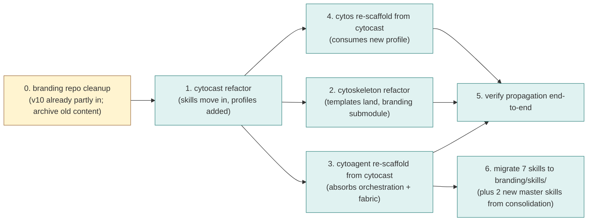

# Refactor Brief: cytoskeleton, cytocast, cytoagent (plus the branding repo)

> **Status**: Active
> **Date**: 2026-07-10
> **Author**: @shahin
> **Audience**: engineers
> **Tags**: `engineering`
> **Variants**: Technical (this doc) - Readable (Obsidian twin optional, same filename) - Agent (n/a)

> Self-contained brief for coding agents (Antigravity, Claude Code, or human contributors). Read this end-to-end before opening any PR.
> Companion to `00_master_architecture.md` (the full design rationale). This brief is operational: what to change, in what order, and how to keep downstream packages in sync afterwards.
> Status: brief, 2026-05-13 (updated to reflect finalization).

> **Finalization update**: this brief now covers four repos, not three. The `branding` repo (formerly proposed as `branding`) is the production source-of-truth for the Cytognosis Design System and the home for the seven Cytognosis skills. Concrete file layouts for `branding` and `cytoskeleton` live in `../../design-system-consolidation-2026-05/02_repo_organization/`. Cross-reference there for file-by-file action tables.

## 0. Why this refactor

Four repos in the Cytognosis stack need a coordinated change. The first (`branding`) is partially in place; the rest need to land in sequence.

1. **`branding`** is the production single source of truth for the Cytognosis Design System and the eventual home for the seven Cytognosis skills. It exists today as `org/branding/` with mixed v9-era and v10 content; the manually-copied v10 export from Claude Design sits alongside older content that needs archival. The concrete cleanup is in `../../design-system-consolidation-2026-05/02_repo_organization/branding_repo_plan.md`.
2. **`cytoskeleton`** today hosts deps and lock manifests only. After the refactor it also hosts the four user-facing interface templates (phone, web, desktop, browser extension) and a small set of template-usage skills. The `branding` repo becomes a submodule (or internal-PyPI dep) here. Concrete layout in `../../design-system-consolidation-2026-05/02_repo_organization/cytoskeleton_repo_plan.md`.
3. **`cytocast`** today hosts the copier templating engine and references skills inside cytoagent. After the refactor it owns its own dev skills (Python, TypeScript, Flutter, Tauri, LinkML, etc.), owns all shared CI/CD workflows (a `_shared/` template payload inherited by every generated package), publishes a `notify-downstream.yml` workflow, and adds new copier profiles for `cytos`, `cytoagent`, `neuros`, `neuro-scale`, `library`, `tool`, `interface-template`. The cytocast to cytoagent dependency is removed entirely.
4. **`cytoagent`** today is a small package of agent skills. After the refactor it becomes a full cytocast-generated package whose scope expands to: runtime skills + orchestration patterns (LangGraph, Google ADK, Dapr Agents) + MCP and A2A protocol surfaces + the distributed fabric (mDNS, NATS, Tailscale, Iroh CRDT) + privacy primitives (envelope schema, consent ledger, redaction) + reliability constructs (timeouts, retries, circuit breakers, hedging, fallback) + crisis rails + reference agents (interviewer, supervisor, crisis detector). `cytos` is manually added as a dependency post-scaffold.

After the refactor, an upstream change in cytocast or cytoskeleton automatically opens a PR in every downstream package via the propagation mechanism in §4 of this brief.

## 1. Pre / post state per repo

| Repo | Pre | Post | Status |
|---|---|---|---|
| `branding` | Mixed v9+v10 content; older `guidelines/` numbering conflicts; Claude Design v10 manually copied | Light, nox-driven. `design-system/` (12 v10 references, tokens.css, LOGO/WRITING/IMAGERY/ACCESSIBILITY/profiles/assets/templates/components/preview/data-viz), `skills/` (7 Cytognosis skills), `themes/`, `archive/`, `scripts/`. Single SoT. | v10 content already in repo; archival cleanup pending |
| `cytoskeleton` | dep locks + components only | dep locks + components + 4 interface templates + 7 shared packages + 4 template-usage skills + `branding/` submodule | not yet started |
| `cytocast` | templating engine + (depends on cytoagent for skills) | templating engine + own dev skills + shared CI/CD `_shared/` payload + 6 new profiles + notify-downstream workflow. **No dependency on cytoagent.** | not yet started |
| `cytoagent` | small package of agent skills (5 skills currently at `skills/cytognosis/`) | full package: runtime skills + orchestration + fabric + privacy + reliability + crisis rails + reference agents. Generated by cytocast. Depends on cytos. Skills migrate out to `branding/skills/`. | not yet started |

## 2. Execution sequence

The dependencies between the refactors:



Critical sequencing rules:

- Task 0 is partially complete: the v10 Design System has been manually copied to `org/branding/`. The remainder of Task 0 is archival cleanup per `../../design-system-consolidation-2026-05/02_repo_organization/branding_repo_plan.md` §2 (the file-by-file action table).
- Tasks 1 and 2 can run in parallel after Task 0, but cytocast must publish its first `_shared/` workflow payload before cytoskeleton's CI starts depending on it.
- Tasks 3 and 4 cannot start until Task 1 ships its new profiles (cytocast publishes v2.0.0).
- Task 5 cannot complete until at least one downstream repo has run a successful `template-update.yml` end-to-end.
- Task 6 (skill migration) happens after Task 3 (so the cytoagent re-scaffold doesn't leave skills behind). The 2 new master skills drafted in `../../design-system-consolidation-2026-05/04_skills_new/` land in `branding/skills/` as part of this task.

## 3. Per-repo refactor tasks

### 3.0 `branding` refactor (partially done; archival cleanup remaining)

The Cytognosis Design System v10 has been manually copied into `org/branding/` from Claude Design. The remaining work is to align with the target layout in `../../design-system-consolidation-2026-05/02_repo_organization/branding_repo_plan.md`.

**Step 1: Apply the file-by-file action table.**

The branding repo plan's §2 carries a row for every current file under `org/branding/` and `org/design/` with the action (keep, move, merge, archive, delete) and the target path. Walk that table top to bottom; the result is a clean tree matching §1 of the plan.

**Step 2: Land the seven skills under `branding/skills/`.**

After cytoagent re-scaffolds (Task 3), migrate the five existing skills from `cytoagent/skills/cytognosis/` to `branding/skills/`. Land the two new master skills (`cytognosis-design-system-master`, `cytognosis-template-master`) from `../../design-system-consolidation-2026-05/04_skills_new/` alongside them. Final shape:

```
branding/skills/
├── cytognosis-design-system-master/   (new)
├── cytognosis-template-master/        (new)
├── cytognosis-branding/               (existing; revised body from consolidation)
├── cytognosis-orchestrator/           (existing; revised body from consolidation)
├── cytognosis-dev/                    (existing; revised body from consolidation)
├── cytognosis-org/                    (existing; revised body from consolidation)
└── cytognosis-writer/                 (existing; revised body from consolidation)
```

The 12 v10 numbered references stay inside `branding/skills/cytognosis-branding/references/` (they are the deep content of that skill).

**Step 3: Stand up the nox sessions.**

- `nox -s sync-from-claude-design`: pulls the latest export from Claude Design, applies the consolidation prompt's mapping, opens a PR with the diff.
- `nox -s validate-tokens`: validates `design-system/tokens.css` against the DTCG-format JSON tokens.
- `nox -s render-guidelines`: renders the 12 references and the top-level governance docs into HTML for the human-readable site.
- `nox -s install-skills`: installs the 7 skills into a target repo (used by cytocast's `install_skills` hook).

**Step 4: Tag `branding` v10.0.0** after cleanup is complete.

### 3.1 `cytocast` refactor (most important; gates the others)

**Step 1: Add the shared workflow payload.**

Create `cytocast/templates/_shared/.github/workflows/` with the seven workflow files below. These are inherited (via copier) by every generated package. The exact YAML is in §6.

```
.github/workflows/
├── ci.yml                       lint, type-check, test, schema currency
├── publish-dev.yml              on push to main: dev release to internal PyPI
├── publish-release.yml          on tag: routes to internal or public PyPI
├── release-please.yml           automated version bump + CHANGELOG PR
├── security.yml                 sigstore sign + SBOM + SLSA attestation
├── deps.yml                     renovate / dependabot config
└── template-update.yml          on dispatch or weekly: pull cytocast updates
```

Also create `cytocast/.github/workflows/notify-downstream.yml` (lives in cytocast itself, not in `_shared/`; this is the upstream end of the dispatch).

**Step 2: Add the dev skills.**

```
cytocast/skills/
├── manifest.yaml
├── python-3.13/                 idiomatic Python 3.13, type-hints, structural pattern matching
├── typescript-strict/           strict TS + biome rules
├── flutter-3/                   Flutter for the phone template
├── tauri-2/                     Tauri v2 native bridges
├── linkml-authoring/            authoring LinkML schemas the cytos way
├── write-pytest/                pytest patterns + fixtures + parametrization
├── write-ci-workflow/           GitHub Actions patterns
├── write-mkdocs/                MkDocs Material conventions
└── write-pre-commit-hook/
```

Each skill is a directory with a `SKILL.md` + supporting files, the same shape as the existing `.claude/skills/` and rpm skill directories.

**Step 3: Add new copier profiles.**

```
cytocast/profiles/
├── cytos.yaml                   already designed
├── cytoagent.yaml               NEW
├── neuros.yaml                  NEW (scope TBD; placeholder)
├── neuro-scale.yaml             NEW
├── library.yaml                 NEW (generic Python library)
└── tool.yaml                    NEW (generic nox-driven tool, like cytoskeleton itself)
```

Each profile references `_shared/` and a profile-specific overlay (e.g., `templates/cytoagent/` adds the schemas, fabric subpackage skeleton, reference-agent stubs).

**Step 4: Remove the cytocast → cytoagent dependency.**

- Any code in cytocast that imports from `cytoagent.skills` (or similar) must move into cytocast itself, then the import is removed.
- The pyproject.toml dependency stanza loses `cytoagent`.
- The copier hooks that previously invoked cytoagent for skill installation now invoke the local cytocast skill resolver.

**Step 5: Add the branding submodule (or PyPI dep).**

If using submodule:
```bash
git submodule add https://github.com/cytognosis-foundation/branding branding
```

If using internal PyPI:
```toml
# in pyproject.toml
dependencies = [
  "branding>=0.1.0,<1.0.0",
]
```

**Step 6: Add GitHub topic plumbing.**

Cytocast's release workflow tags every generated repo with the GitHub topic `cytognosis-cytocast` via the GitHub API on first push. The notify-downstream workflow queries this topic to find all downstream repos.

**Step 7: Cut cytocast v2.0.0.**

Major because:

- The cytoagent dependency is removed (breaking for anyone who depended on cytocast pulling skills from cytoagent transitively).
- The `_shared/` payload is new (downstream packages need to opt in via `copier update`).

Provide `cytocast/MIGRATION.md` v1 → v2 with step-by-step instructions.

### 3.2 `cytoskeleton` refactor

**Step 1: Add the branding submodule (or PyPI dep).** Same pattern as cytocast.

**Step 2: Add the four interface template directories under `templates/`.**

```
cytoskeleton/templates/
├── app-phone/                   Flutter; will be filled by Claude Design
├── app-web/                     React 19 + Vite + Tailwind + shadcn
├── app-desktop/                 Tauri v2 wrapping app-web
├── app-extension/               MV3 + side panel
└── shared/
    ├── design-system-package/
    ├── api-client-package/
    ├── fabric-client-package/
    ├── voice-client-package/
    ├── auth-shell-package/
    ├── telemetry-package/
    └── agent-presentation-package/
```

The bodies of these templates come from Claude Design (the authoritative Design System tool). This refactor lands the directory structure and placeholder READMEs; Claude Design fills in the implementations as a follow-on.

**Step 3: Add template-usage skills.**

```
cytoskeleton/skills/
├── manifest.yaml
├── pick-template/               choose the right template for a use case
├── update-template/             apply a copier update to a downstream app
└── port-token/                  port a design-system token change across templates
```

**Step 4: Cut cytoskeleton v2.0.0.**

Major because the templates are new and the branding dep is new.

### 3.3 `cytoagent` refactor

This is the largest refactor because the scope expands significantly. Treat it as a re-scaffold rather than an in-place edit.

**Step 1: Re-scaffold from cytocast.**

```bash
# in a scratch directory
uvx copier copy /home/mohammadi/repos/cytognosis/cytocast \
                /tmp/cytoagent-new \
                --data profile=cytoagent
```

**Step 2: Diff against the old cytoagent and migrate.**

- Move the existing agent skills into `cytoagent/src/cytoagent/skills/`.
- Move (or reimplement) any MCP server / client code into `cytoagent/src/cytoagent/adapters/mcp/`.
- Update any imports in downstream callers.

**Step 3: Add the new subpackages.**

```
src/cytoagent/
├── skills/                      MIGRATED from old cytoagent
├── tools/                       MCP-exposed tools, A2A bindings
├── roles/                       role manifest + registry
├── orchestration/               LangGraph supervisor, Google ADK, Dapr Agents
├── reference_agents/
│   ├── interviewer/
│   ├── supervisor/
│   └── crisis_detector/
├── fabric/                      mDNS + NATS + Tailscale + Iroh
├── reliability/                 timeouts, retries, circuit, hedge, fallback
├── crisis/                      rails + escalation
├── consent/                     ledger
├── privacy/                     gate + redactor + DP aggregators
├── observability/               trace + audit + OTEL bridge + LaminDB Run capture
├── adapters/
│   ├── langgraph/
│   ├── google_adk/
│   ├── dapr/
│   ├── mcp/
│   └── a2a/
└── cli/
```

**Step 4: Add the schemas.**

Author in `cytos.schema` (LinkML), but vendor a generated copy under `cytoagent/schemas/` for offline operation:

- `envelope.linkml.yaml`
- `role-manifest.linkml.yaml`
- `events/*.linkml.yaml`
- `state/*.linkml.yaml`

**Step 5: Author `ARCHITECTURE.md`.**

This is mandatory. The expanded cytoagent has multiple layers (skills, orchestration, fabric, privacy, reliability). Without an architecture doc, contributors will blur the layers. Write it so a new contributor knows where to put new code.

**Step 6: Manually add cytos as a dependency.**

```toml
# pyproject.toml
dependencies = [
  "cytos>=0.1.0,<1.0.0",
  # ... other deps
]
```

The cytoagent profile in cytocast records this as the recommended add but does not include it automatically, because cytos is not in cytoskeleton's resolved env at scaffold time.

**Step 7: Cut cytoagent v1.0.0.**

Treat this as a new package (start at 1.0.0 rather than continuing the old version line). The old cytoagent gets a final 0.x release with a deprecation notice pointing at v1.0.0.

## 4. Change-propagation mechanism (the heart of this brief)

Without this, every downstream package freezes at scaffold time. With this, every downstream package gets a PR every time cytocast or cytoskeleton releases.

### 4.1 The dispatch fan-out

**Upstream (in `cytocast/.github/workflows/notify-downstream.yml`):**

```yaml
name: Notify downstream repos of new release
on:
  release:
    types: [published]
  workflow_dispatch:
    inputs:
      version:
        description: Version to broadcast (e.g., v2.3.1)
        required: true

permissions:
  contents: read

jobs:
  notify:
    runs-on: ubuntu-latest
    steps:
      - name: Resolve version
        id: ver
        run: |
          if [ "${{ github.event_name }}" = "release" ]; then
            echo "version=${{ github.event.release.tag_name }}" >> "$GITHUB_OUTPUT"
          else
            echo "version=${{ github.event.inputs.version }}" >> "$GITHUB_OUTPUT"
          fi
      - name: Find downstream repos by topic
        id: find
        uses: actions/github-script@v7
        env:
          GH_PAT_DISPATCH: ${{ secrets.GH_PAT_DISPATCH }}
        with:
          github-token: ${{ env.GH_PAT_DISPATCH }}
          script: |
            const q = 'org:cytognosis-foundation topic:cytognosis-cytocast';
            const res = await github.paginate(github.rest.search.repos, { q });
            core.setOutput('repos', JSON.stringify(res.map(r => r.full_name)));
      - name: Fan out repository_dispatch
        uses: actions/github-script@v7
        env:
          GH_PAT_DISPATCH: ${{ secrets.GH_PAT_DISPATCH }}
        with:
          github-token: ${{ env.GH_PAT_DISPATCH }}
          script: |
            const repos = JSON.parse(${{ toJSON(steps.find.outputs.repos) }});
            for (const full of repos) {
              const [owner, repo] = full.split('/');
              await github.rest.repos.createDispatchEvent({
                owner, repo,
                event_type: 'cytocast-update',
                client_payload: {
                  version: '${{ steps.ver.outputs.version }}',
                  source: 'cytocast',
                  fired_at: new Date().toISOString(),
                },
              });
              console.log(`Dispatched cytocast-update to ${full}`);
            }
```

Notes:

- The default `GITHUB_TOKEN` cannot fire dispatches across repos. Use a fine-scoped PAT (recommended: GitHub App installation token) with `metadata:read` and `contents:write` on the org, stored as `GH_PAT_DISPATCH` in cytocast's repo secrets.
- The topic-based discovery (`topic:cytognosis-cytocast`) means no central registry. Adding a downstream repo means adding the topic.

**Downstream (in `cytocast/templates/_shared/.github/workflows/template-update.yml`, inherited by every generated package):**

```yaml
name: Sync with cytocast template
on:
  schedule:
    - cron: '0 6 * * 1'   # weekly, Monday 06:00 UTC
  repository_dispatch:
    types: [cytocast-update]
  workflow_dispatch:
    inputs:
      version:
        description: Version to update to (default = latest tag)
        required: false

permissions:
  contents: write
  pull-requests: write

jobs:
  update:
    runs-on: ubuntu-latest
    steps:
      - uses: actions/checkout@v4
        with:
          token: ${{ secrets.GITHUB_TOKEN }}

      - uses: astral-sh/setup-uv@v3

      - name: Determine target version
        id: tgt
        run: |
          if [ -n "${{ github.event.client_payload.version }}" ]; then
            echo "version=${{ github.event.client_payload.version }}" >> "$GITHUB_OUTPUT"
          elif [ -n "${{ github.event.inputs.version }}" ]; then
            echo "version=${{ github.event.inputs.version }}" >> "$GITHUB_OUTPUT"
          else
            echo "version=" >> "$GITHUB_OUTPUT"  # let copier resolve latest
          fi

      - name: Run copier update
        id: update
        env:
          TGT_VERSION: ${{ steps.tgt.outputs.version }}
        run: |
          if [ -n "$TGT_VERSION" ]; then
            uvx copier update --vcs-ref "$TGT_VERSION" --conflict skip --skip-answered --defaults
          else
            uvx copier update --conflict skip --skip-answered --defaults
          fi

      - name: Detect changes
        id: diff
        run: |
          if [ -z "$(git status --porcelain)" ]; then
            echo "has_changes=false" >> "$GITHUB_OUTPUT"
          else
            echo "has_changes=true"  >> "$GITHUB_OUTPUT"
          fi

      - name: Create or update PR
        if: steps.diff.outputs.has_changes == 'true'
        uses: peter-evans/create-pull-request@v6
        with:
          token: ${{ secrets.GITHUB_TOKEN }}
          branch: chore/cytocast-update
          title: 'chore: sync with cytocast template ${{ steps.tgt.outputs.version }}'
          commit-message: 'chore: sync with cytocast template ${{ steps.tgt.outputs.version }}'
          body: |
            Automated PR from `template-update.yml`.

            Source: `cytocast` ${{ steps.tgt.outputs.version || 'latest' }}
            Triggered by: ${{ github.event_name }}

            **Reviewers**: please confirm CI passes and the diff matches the cytocast release notes. Any conflicts surfaced by `copier update --conflict skip` are listed below; resolve manually before merge.
          labels: |
            template-update
            automated
```

### 4.2 cytoskeleton change propagation (env locks and interface templates)

Cytoskeleton ships a parallel `notify-downstream.yml` with `event_type: cytoskeleton-update` and a corresponding `_shared/` workflow `template-update.yml` extended to handle both event types. Downstream packages running on a cytoskeleton env get a PR when the env changes; downstream interface apps get a PR when an interface template changes.

The two workflows can be merged into one downstream listener that accepts either dispatch type and runs the right `copier update` (cytocast template-update or a re-pull of the relevant cytoskeleton lock).

### 4.3 Version pinning conventions in `.copier-answers.yml`

```yaml
# Changes here will be overwritten by Copier; do not edit by hand
_src_path: https://github.com/cytognosis-foundation/cytocast
_commit: v2.3.1
_pinning_strategy: minor          # auto-merge patches, PR minors, PR + migration for majors
profile: cytoagent
package_name: cytoagent
python_min: "3.13"
gcp_project: cytognosis-prod
gcp_region: us-central1
artifact_repo: cytognosis-internal
brand_profile: cytognosis-primary
cytos_version: ">=0.1.0,<1.0.0"
enable_dapr: true
enable_tauri_sidecar: true

# files this repo has diverged on and does NOT want updated automatically
_skip_files:
  - src/cytoagent/reference_agents/interviewer/README.md
```

### 4.4 Conflict resolution playbook

Conflicts surface in two ways:

1. `copier update --conflict skip` writes upstream-modified-but-locally-also-modified files with a `.rej` extension. The auto-PR includes a comment listing the `.rej` files.
2. Tests fail in CI after the update applies.

Resolution:

1. Reviewer pulls the branch locally.
2. For each `.rej` file, manually reconcile and delete the `.rej`.
3. For failing tests, fix the test or the regression.
4. Commit, push, re-run CI, merge.

For repos with chronic conflicts on the same files, set `_skip_files:` in `.copier-answers.yml`.

### 4.5 Auto-merge policy

Recommended default (per repo, configurable):

| Bump | Default behavior |
|---|---|
| Dev release (`devN+sha`) | not propagated; downstream picks up next stable |
| Patch (`v2.3.x`) | green-CI auto-merge enabled |
| Minor (`v2.x.0`) | auto-PR; human review |
| Major (`v3.0.0`) | auto-PR with migration-checklist comment; human review; cytocast ships `MIGRATION.md` per major release |

Auto-merge is enabled via the `auto-merge` action on the PR; the policy is a `gh-actions` workflow that checks the diff between current and target version tags and applies the right behavior.

## 5. CI/CD scaffolds (the `_shared/` payload in detail)

### 5.1 `ci.yml`

```yaml
name: CI
on:
  pull_request:
  push:
    branches: [main]
permissions:
  contents: read
  pull-requests: read
jobs:
  lint:
    runs-on: ubuntu-latest
    steps:
      - uses: actions/checkout@v4
      - uses: astral-sh/setup-uv@v3
      - run: uvx nox -s lint
  type:
    runs-on: ubuntu-latest
    steps:
      - uses: actions/checkout@v4
      - uses: astral-sh/setup-uv@v3
      - run: uvx nox -s type
  test:
    runs-on: ubuntu-latest
    strategy:
      matrix:
        python: ["3.13"]
    steps:
      - uses: actions/checkout@v4
      - uses: astral-sh/setup-uv@v3
      - run: uvx nox -s "test-${{ matrix.python }}"
  schema:
    runs-on: ubuntu-latest
    if: hashFiles('schemas/**/*.yaml') != ''
    steps:
      - uses: actions/checkout@v4
      - uses: astral-sh/setup-uv@v3
      - run: uvx nox -s schema-validate
  license:
    runs-on: ubuntu-latest
    steps:
      - uses: actions/checkout@v4
      - uses: astral-sh/setup-uv@v3
      - run: uvx nox -s license-check
```

### 5.2 `publish-dev.yml`

```yaml
name: Publish dev release
on:
  push:
    branches: [main]
permissions:
  contents: read
  id-token: write
jobs:
  publish:
    runs-on: ubuntu-latest
    steps:
      - uses: actions/checkout@v4
      - uses: astral-sh/setup-uv@v3
      - name: Build with dev version
        run: |
          SHA=$(git rev-parse --short HEAD)
          uv build --build-arg "version_suffix=.dev${{ github.run_number }}+${SHA}"
      - name: Auth to GCP via OIDC
        uses: google-github-actions/auth@v2
        with:
          workload_identity_provider: ${{ vars.GCP_WIF_PROVIDER }}
          service_account: ${{ vars.GCP_PUBLISH_SA }}
      - name: Push to internal Artifact Registry
        run: |
          uvx twine upload \
            --repository-url https://${{ vars.GCP_REGION }}-python.pkg.dev/${{ vars.GCP_PROJECT }}/${{ vars.GCP_ARTIFACT_REPO }}/ \
            dist/*
```

### 5.3 `publish-release.yml`

```yaml
name: Publish release
on:
  push:
    tags:
      - 'v*'
permissions:
  contents: read
  id-token: write
jobs:
  build:
    runs-on: ubuntu-latest
    outputs:
      route: ${{ steps.route.outputs.route }}
    steps:
      - uses: actions/checkout@v4
      - uses: astral-sh/setup-uv@v3
      - name: Determine route
        id: route
        run: |
          TAG=${GITHUB_REF_NAME}
          if [[ "$TAG" =~ -(rc|alpha|beta) ]]; then
            echo "route=internal" >> "$GITHUB_OUTPUT"
          elif [[ "$TAG" =~ \+internal$ ]]; then
            echo "route=internal" >> "$GITHUB_OUTPUT"
          else
            echo "route=public-and-internal" >> "$GITHUB_OUTPUT"
          fi
      - run: uv build
      - uses: actions/upload-artifact@v4
        with:
          name: dist
          path: dist/

  publish-internal:
    needs: build
    runs-on: ubuntu-latest
    steps:
      - uses: actions/download-artifact@v4
        with:
          name: dist
          path: dist
      - uses: google-github-actions/auth@v2
        with:
          workload_identity_provider: ${{ vars.GCP_WIF_PROVIDER }}
          service_account: ${{ vars.GCP_PUBLISH_SA }}
      - run: |
          uvx twine upload \
            --repository-url https://${{ vars.GCP_REGION }}-python.pkg.dev/${{ vars.GCP_PROJECT }}/${{ vars.GCP_ARTIFACT_REPO }}/ \
            dist/*

  publish-public:
    needs: [build, publish-internal]
    if: needs.build.outputs.route == 'public-and-internal'
    runs-on: ubuntu-latest
    steps:
      - uses: actions/download-artifact@v4
        with:
          name: dist
          path: dist
      - uses: pypa/gh-action-pypi-publish@release/v1
        # OIDC trusted publishing; no token needed
```

### 5.4 `release-please.yml`

```yaml
name: release-please
on:
  push:
    branches: [main]
permissions:
  contents: write
  pull-requests: write
jobs:
  release-please:
    runs-on: ubuntu-latest
    steps:
      - uses: googleapis/release-please-action@v4
        with:
          release-type: python
          token: ${{ secrets.GITHUB_TOKEN }}
```

### 5.5 `security.yml`

```yaml
name: Security
on:
  push:
    tags: ['v*']
permissions:
  contents: write
  id-token: write
  attestations: write
jobs:
  sign-and-attest:
    runs-on: ubuntu-latest
    steps:
      - uses: actions/checkout@v4
      - uses: actions/download-artifact@v4
        with:
          name: dist
          path: dist
      - name: Sign with sigstore
        uses: sigstore/gh-action-sigstore-python@v3
        with:
          inputs: ./dist/*
      - name: Generate SBOM
        run: |
          pip install cyclonedx-bom
          cyclonedx-py environment > sbom.cdx.json
      - name: Attach SBOM to release
        uses: softprops/action-gh-release@v2
        with:
          files: sbom.cdx.json
      - name: SLSA attestation
        uses: actions/attest-build-provenance@v2
        with:
          subject-path: dist/*
```

### 5.6 `deps.yml`

Renovate config (`renovate.json` in the repo root rather than a workflow file; Renovate runs on its own infrastructure or via GitHub App):

```json
{
  "$schema": "https://docs.renovatebot.com/renovate-schema.json",
  "extends": ["config:recommended", ":semanticCommits"],
  "schedule": ["before 5am on monday"],
  "rangeStrategy": "bump",
  "lockFileMaintenance": { "enabled": true, "automerge": true, "schedule": ["before 5am on monday"] },
  "packageRules": [
    { "matchUpdateTypes": ["patch"], "automerge": true },
    { "matchUpdateTypes": ["minor"], "automerge": false }
  ],
  "customManagers": [
    {
      "customType": "regex",
      "fileMatch": ["^\\.copier-answers\\.yml$"],
      "matchStrings": ["_commit:\\s*(?<currentValue>v[\\d.]+)"],
      "depNameTemplate": "cytognosis-foundation/cytocast",
      "datasourceTemplate": "github-tags"
    }
  ]
}
```

The customManager block makes Renovate also bump the cytocast template version in `.copier-answers.yml`, which then triggers `template-update.yml` to apply the actual diff.

### 5.7 `template-update.yml`

See §4.1 above (the downstream listener).

## 6. Migration of existing downstream repos

For any repo previously generated by cytocast pre-refactor:

1. Run `uvx copier update --vcs-ref v2.0.0` once manually.
2. Resolve conflicts (the major bump means meaningful changes).
3. Add the `cytognosis-cytocast` GitHub topic via `gh repo edit --add-topic cytognosis-cytocast`.
4. Confirm `template-update.yml` exists and runs on cron.
5. Adopt the Conventional Commits convention from the next PR onward.

A one-shot script for this lives in `cytocast/scripts/migrate-existing-downstream.sh`.

## 7. Testing checkpoints / Definition of Done

The refactor is done when ALL of the following are true:

### 7.1 cytocast

- [ ] `cytocast` v2.0.0 is tagged and published to internal PyPI.
- [ ] `cytocast/templates/_shared/.github/workflows/` contains all seven workflow files; each passes lint (`actionlint`).
- [ ] `cytocast/skills/` contains the dev skills listed in §3.1 step 2; each has a SKILL.md.
- [ ] `cytocast/profiles/` contains the six profiles listed in §3.1 step 3.
- [ ] `cytocast`'s pyproject.toml does not depend on `cytoagent`.
- [ ] `cytocast/.github/workflows/notify-downstream.yml` is present and tested against at least one downstream repo.
- [ ] `cytocast/MIGRATION.md` covers v1 → v2.

### 7.2 cytoskeleton

- [ ] `cytoskeleton` v2.0.0 is tagged and published to internal PyPI.
- [ ] `cytoskeleton/templates/` contains the four interface template directories and the seven shared package directories (READMEs at minimum; Claude Design will populate the bodies).
- [ ] `branding` is consumed (submodule or PyPI dep, decision in §10 of the master doc).
- [ ] `cytoskeleton/skills/` contains the three template-usage skills.
- [ ] Cytoskeleton's parallel `notify-downstream.yml` works.

### 7.3 cytoagent

- [ ] `cytoagent` v1.0.0 is tagged and published to internal PyPI.
- [ ] `ARCHITECTURE.md` is written.
- [ ] All subpackages in §3.3 step 3 exist with at least placeholder modules and tests.
- [ ] Schemas in `cytoagent/schemas/` are present and valid LinkML.
- [ ] `cytos` is in the dependencies.
- [ ] The reference interviewer agent runs locally against a docker-compose dev stack (NATS + Tailscale + Iroh).

### 7.4 Propagation end-to-end

- [ ] A test cytocast pre-release (`v2.1.0-rc.1`) fires `notify-downstream.yml`.
- [ ] At least one downstream repo's `template-update.yml` receives the dispatch and opens a PR.
- [ ] That PR shows the expected diff (the new template files / workflow updates from the pre-release).
- [ ] Merging the PR succeeds with green CI.

### 7.5 Documentation

- [ ] `00_master_architecture.md` (this brief's sibling) is up to date.
- [ ] Each refactored repo has a current README, ARCHITECTURE (where applicable), CHANGELOG, and CITATION.cff.
- [ ] The Cytognosis platform documentation site (if maintained) reflects the new repo topology.

## 8. Risks and mitigations

| Risk | Likelihood | Impact | Mitigation |
|---|---|---|---|
| Topic-based discovery misses a downstream repo (topic not set) | medium | medium | bootstrap topic via cytocast post-gen hook so every new generated repo gets the topic; add a periodic audit script |
| Auto-PR fatigue (too many noisy PRs) | medium | low | bundle minor and patch updates into one PR per week per repo; configurable per repo |
| Conflict explosion on a major cytocast bump | medium | high | ship a `MIGRATION.md` per major; provide a `cytocast migrate` CLI subcommand that automates the common refactors |
| Missing GCP IAM perms for OIDC | low | high | document the GCP Workload Identity setup step-by-step in cytocast/docs/gcp-setup.md; provide a Terraform module |
| Brand-repo sync from Claude Design breaks | medium | medium | the branding sync script writes a `SYNC_STATUS.md`; CI alerts if last sync is stale |
| Cytoagent layer boundaries blur over time | medium | medium | ARCHITECTURE.md plus CODEOWNERS that requires cross-layer reviews for changes touching fabric/ or privacy/ |
| Public PyPI name conflicts | low | high | reserve `cytognosis-foundation` and `cytos` / `cytoagent` / `cytocast` / `cytoskeleton` names on PyPI before first publish |
| Coding-agent diverges from human-merged main during long-running PR | medium | medium | merge queue (GitHub merge queue) on main; agents must rebase before merge |

## 9. Open implementation questions for the coding agent

When the agent encounters any of the following, pause and surface to a human:

1. The branding submodule-vs-PyPI choice is unresolved at refactor time.
2. The cytocast profile asks for `gcp_project` and the value is not in the env.
3. Removing the cytoagent dependency from cytocast breaks any existing internal caller; surface the caller list for review rather than silently rewriting.
4. The cytoagent privacy gate refuses a payload schema during testing; do not weaken the gate, surface for review.
5. A migration script encounters a `.copier-answers.yml` not in the recognized format.

## 10. Sign-off

A coding agent claiming this refactor is complete must:

1. Provide a checklist of which tasks in §7 pass and which do not.
2. Open a PR per repo with the changes; tag a CODEOWNER for review.
3. Attach the `notify-downstream → template-update` end-to-end test log (the dispatch event JSON, the resulting PR URLs, and the merged CI run links).
4. Update the master doc (`00_master_architecture.md`) with any decisions that resolved open questions during the refactor.
