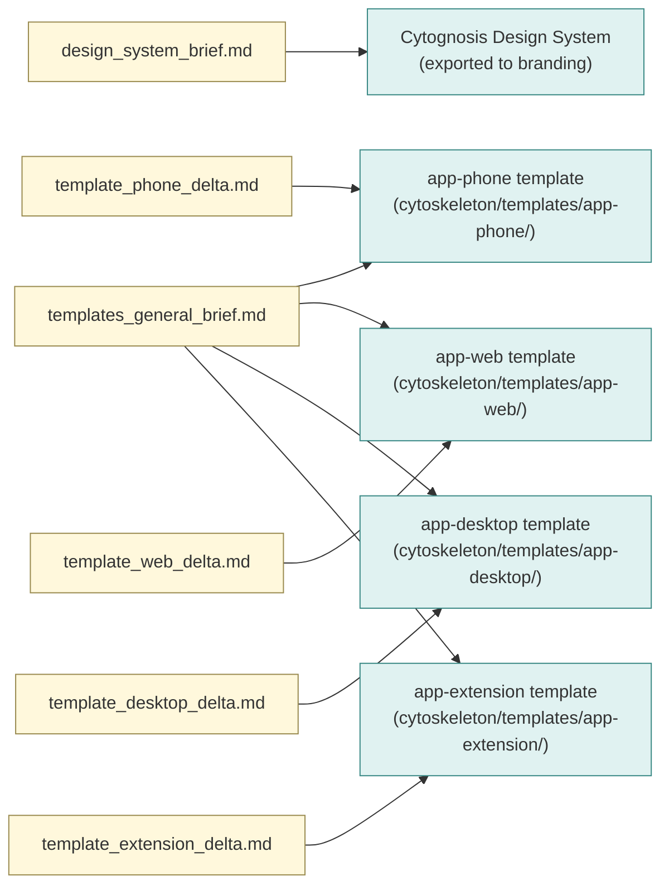

# Claude Design Briefs

Self-contained briefs to share with Claude Design. Each brief instructs Claude Design on what to produce for a particular Cytognosis deliverable: the Design System itself, or one of the four interface templates that consume it.

## Reading order

Claude Design should read these in order:

1. **`design_system_brief.md`** is read first when producing or revising the Cytognosis Design System.
2. **`templates_general_brief.md`** is read whenever Claude Design produces or revises any of the four interface templates. It defines everything shared across all four templates.
3. **`template_<name>_delta.md`** is read alongside the general brief when producing or revising that specific template. Each delta only carries what is unique to its template; the general brief carries the shared rules.

## Why general + deltas (not 4 standalone guides)

The four templates share roughly 70% of their rules: brand voice, design tokens, accessibility baseline, telemetry conventions, code style, testing posture, build/CI shape, documentation expectations, contracts for the shared packages (`design-system`, `api-client`, `fabric-client`, `voice-client`, `auth-shell`, `telemetry`, `agent-presentation`). Keeping that shared 70% in one file means a rule change is one edit, not four. The 30% that is genuinely different (Flutter idioms, Tauri native bridges, MV3 manifest, edge-model wiring) lives in the matching delta.

If a delta and the general brief ever conflict, the **delta wins** for that template. Conflicts should be rare; if a rule is conflicting often, it probably belongs in the delta rather than the general brief.

## Files

| File | Brief for |
|---|---|
| `design_system_brief.md` | producing the Cytognosis Design System (tokens, typography, color, motion, iconography, voice, microcopy, accessibility budget, human-readable docs) |
| `templates_general_brief.md` | shared rules for all four interface templates |
| `template_phone_delta.md` | Flutter + LiteRT-LM + paralinguistic stack |
| `template_web_delta.md` | React 19 + Vite + Tailwind + shadcn |
| `template_desktop_delta.md` | Tauri v2 wrapping the web template, native bridges, supervisor sidecar host |
| `template_extension_delta.md` | Manifest V3 + side panel, patient and internal build modes |

## How outputs reach Cytognosis repos

Each brief specifies an export location (relative to a working directory chosen by Claude Design). The Cytognosis sync process pulls those exports into:

| Brief | Cytognosis destination |
|---|---|
| Design System | `branding/design-system/` plus `branding/voice-and-tone/` plus `branding/skills/` (the human-readable forms) |
| All four templates | `cytoskeleton/templates/app-<name>/` plus `cytoskeleton/templates/shared/` |

The sync is automated where possible (a nox session in `branding` and `cytoskeleton`); manual where it requires judgment.

## Style conventions for the briefs themselves

So Claude Design knows what shape to expect:

- Plain Markdown.
- No em dashes. Use commas, semicolons, colons, parentheses, or sentence breaks.
- Mandatory artifacts marked clearly with `**Mandatory**`; optional with `**Optional**`.
- File-path examples in fenced code blocks.
- Naming conventions stated once with concrete examples.
- Reasons given inline ("because X") rather than as a separate rationale section, since these briefs are operational.

## See also: focused iteration prompts

This folder contains **production briefs** that tell Claude Design what to produce when building or revising a Design System or a template from scratch. For **focused iteration prompts** that address specific gaps in the current v10 output, see `../../../design-system-consolidation-2026-05/03_claude_design_prompts/`:

| Focused prompt | Use when |
|---|---|
| `prompt_icons.md` | iterating on the 48-icon set (specifically: voice + crisis + sensor families need refinement; ~10 placeholders to replace; canonical line + solid + light/dark + per-media renditions) |
| `prompt_profiles.md` | iterating on the four use-case profiles (Foundation, Clinical, Research, Lab) to move them from preliminary to settled (audience, requirements, vibe, worked examples per profile) |
| `prompt_reorg.md` | consolidating the current Claude Design `/design/` output into the production `branding/design-system/` layout (full file-by-file mapping; deduplication; JSX-to-LinkML component contracts) |

The production briefs in this folder + the focused prompts in the consolidation folder are complementary, not duplicative. Use this folder for clean-slate work; use the consolidation prompts when iterating on the current v10 output.
