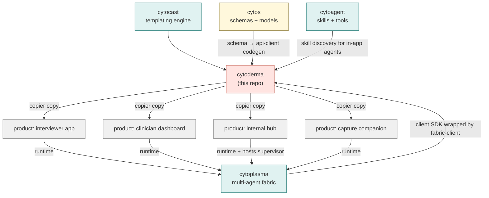

# Cytoderma Design

> Master Cytognosis copier template for all user-facing applications.
> Generates four root templates (phone, web, desktop, browser extension) that downstream products fork from.
> Plays for Cytonome the role that `cytos` plays for Cytoverse: the substrate every user-facing product inherits.
> Status: design, 2026-05-13.
> Author: Shahin Mohammadi (mohammadi@cytognosis.org), with synthesis assistance from Claude.

## 0. Naming

Working name: **`cytoderma`** (Greek `derma`, skin; the boundary where the cell meets its environment).

Alternatives ranked:

1. `cytoderma`: skin/dermis. Biological, parallel in shape to `cytoskeleton`, evokes "the surface a user touches".
2. `cytomembrane`: most biologically literal (the cell membrane IS the interface to the outside world). Slightly long.
3. `cytocortex`: outer layer / rind. Risks neuro-scale collision since "cortex" reads brain.
4. `cytoface`: most direct and accessible. Less Greek-biological than the others; breaks the cellular-metaphor register slightly.
5. `cytoshell`: software-shell metaphor (UI shell, app shell). Overloaded in software; collides with "shell" as in bash.

Recommendation: `cytoderma`. Reads as a layer (parallel to cytoskeleton in form), fits the infrastructure-tier cellular metaphor, and the noun "derma" maps cleanly onto "the user-facing surface of the platform".

Display: `cytoderma` in code, `Cytoderma` in running text, optional stylization `CytoDerma` reserved (analogous to `CytOS`).

## 1. Purpose and posture

Cytoderma is the canonical Cytognosis copier template engine for user-facing applications. It exists so every Cytognosis product (patient phone app, interviewer agent app, clinician dashboard, internal asset hub, public Cytognosis.org logged-in area, browser companion) starts from a working scaffold with a shared design system, shared API client, shared agent-fabric integration, shared accessibility baseline, and shared build/CI.

Posture: **template-first, design-system-second, downstream-fork-friendly**. Cytoderma itself is not an app. It is a copier template plus a small library of shared packages that templates pull in. Downstream repos `copier copy cytoderma <new-app> --data template=<one of four>` and get a buildable app from minute one.

Cytoderma is for **Cytonome** what `cytos` is for **Cytoverse**: the substrate downstream products inherit. Cytos is data + models; cytoderma is interface + interaction.

## 2. Naming and registry placement

Per the Cytognosis four-tier naming register, `cytoderma` is an **infrastructure-tier** package: cellular-biology metaphor (skin / boundary) mapped to function (user-facing surface of the platform). It depends on `cytocast` (templating engine) and on the shared design assets; it does not depend on `cytos` directly because design tokens and the runtime API client are versioned independently of data schemas.

Repo path: `/home/mohammadi/repos/cytognosis/cytoderma`.
Cytocast profile: `/home/mohammadi/repos/cytognosis/cytocast/profiles/cytoderma.yaml`.
Console entry from generated apps: per-template (`cytoderma-phone`, `cytoderma-web`, `cytoderma-desktop`, `cytoderma-ext`).

## 3. Scope

In scope:

1. Four root templates (phone, web, desktop, browser extension).
2. A shared design-system package (tokens, typography, color, motion, microcopy, voice/tone, accessibility budget).
3. A shared, typed API client package generated from the platform OpenAPI / tRPC schema (kept in sync with `cytos.schema`).
4. A shared agent-fabric client package that wraps `cytoplasma`'s discovery, transport, and state primitives so apps don't reimplement them.
5. A shared voice / paralinguistic client (capture, VAD, on-device feature extraction stubs that talk to the phone template's local model; web/desktop variants use Web Speech / native bridges).
6. A shared auth shell (login flow, token storage, refresh, signed-out states).
7. A shared telemetry adapter (schema-enforced events, redaction, opt-in by default).
8. Build / CI scaffolds (lint, type-check, test, accessibility audit, bundle size budget, release flow per platform).
9. Brand-aligned starter screens, components, and content per template.

Out of scope (delegated elsewhere):

- Backend / API definitions: live in the relevant Cytonome / Cytoverse service repos.
- Agent runtime, transport, supervisor logic: lives in `cytoplasma`. Cytoderma only provides the *client* wrapper.
- Data schemas / ontologies: live in `cytos`.
- Knowledge graph access: KG-RAG / Cypher generation lives downstream of `cytos.rag`; cytoderma apps consume it via the API client.
- Backend voice models (Whisper, Gemma 4, Kokoro): served by `cytoplasma` peers. Cytoderma apps drive turn-taking and present results.

## 4. The four templates

Each template is a complete, buildable app skeleton with the shared packages already wired. Downstream repos pick exactly one as their base.

### 4.1 Phone template (`templates/phone/`)

- **Framework**: Flutter (per Cytognosis tools_master selection: §10 row 1, "Flutter + Rive (mobile)").
- **Edge model runtime**: LiteRT-LM, Gemma 4 E2B (per §9.4 Tier 1).
- **Paralinguistic stack**: HuBERT + openSMILE feature extraction; turn-of-emotion classifier; rules-based crisis detector v1.
- **Voice loop**: continuous VAD, barge-in support, schema-enforced event emission (no raw audio leaves the phone).
- **Use cases (initial)**:
  1. Interviewer agent app (the empathic voice agent, the headline Cytonome surface).
  2. Asset / knowledge hub browse-and-interact client.
  3. Future products (patient longitudinal recorder, family caregiver companion).
  These may ship as one app with profile-switching or as separate apps; the template supports both via a profile flag.
- **Rationale for Flutter over React Native**: Single codebase, near-native performance, consistent rendering across iOS/Android, better suited to a voice-heavy app with custom paralinguistic visualization. The web template's React primitives are not the right unit to share with phone, so we share *design tokens* and *API/agent clients* across phone and web, not render-layer code.

### 4.2 Web template (`templates/web/`)

- **Framework**: React 19 + Vite + Tauri-compatible scaffold (per §10 row 1).
- **Component library**: shadcn/ui built on Radix primitives, customized to the Cytognosis brand.
- **Styling**: Tailwind CSS, design tokens injected from the shared design-system package.
- **Auth**: pluggable (Clerk / Supabase / self-hosted), wired through the shared auth-shell package.
- **Use cases (initial)**:
  1. User-facing dashboards for Cytonome (longitudinal summaries, agent interactions).
  2. Asset / knowledge-hub web client.
  3. Public Cytognosis.org logged-in area (eventually).
- **Render targets**: standard SPA via Vite; the same source tree builds the desktop template via Tauri.

### 4.3 Desktop template (`templates/desktop/`)

- **Framework**: Tauri v2 wrapping the web template (per §10 row 1 and our prior architectural decision to deprioritize Electron).
- **Native bridges**: filesystem, system tray, notifications, deep links, OS-level keyring for secrets, local-IPC channel to the laptop-tier supervisor agent (the Gemma 4 26B-A4B sidecar from §9.4 Tier 2).
- **Bundle target**: < 25 MB shipped, fast cold start, native window chrome.
- **Use cases (initial)**:
  1. Internal Cytognosis dashboard for researchers / clinicians.
  2. Local-first asset-hub editor with offline support via Iroh CRDT.
  3. Supervisor-agent control plane: the desktop app is where the laptop-tier "thinking" model runs as a Tauri sidecar.
- **Rationale**: shares ~90% of code with the web template (the frontend); the Tauri Rust layer is the additive native shell. Templates/desktop literally `depends on` templates/web rather than duplicates it.

### 4.4 Browser extension template (`templates/extension/`)

- **Manifest**: Manifest V3.
- **Surfaces**: side panel API, action popup, content scripts for asset capture and in-page annotation.
- **Build**: Vite + cross-browser build (Chrome, Edge; Firefox as a build target later).
- **Dual-use via build flag**:
  - `mode=patient`: lightweight asset/knowledge-hub companion, on-demand voice agent invocation.
  - `mode=internal`: knowledge-hub power tool for the Cytognosis team (annotations, clip-to-graph, citation capture).
- **Use cases (initial)**:
  1. Patient-facing asset companion for browsing approved content with the agent's help.
  2. Internal annotation / clipping tool feeding the asset hub.
- **Rationale**: keeping these as build modes of one template (rather than two repos) avoids drift and lets the design system live in one place.

## 5. Shared packages

Inside the cytoderma repo, four template directories sit alongside a `packages/` directory whose libraries are consumed by all templates and by downstream forks.

### 5.1 `packages/design-system/`

The single source of truth for "looks like Cytognosis":

- **Tokens**: color, typography, spacing, radius, motion, elevation, semantic aliases (e.g. `surface.empathic.calm`).
- **Iconography**: shared SVG icon set, organized by domain (voice, hub, agent state, data).
- **Voice / microcopy**: short-form copy patterns, voice/tone rules, empathic-response templates (the brand-voice skill plus Cytognosis-specific extensions).
- **Accessibility budget**: WCAG 2.1 AA minimum, plus app-specific constraints (e.g. voice-app touch targets larger than baseline; reduced-motion variants for every animation).
- **Component contract**: each component has a platform-agnostic *contract* (props, states, events, accessibility expectations); templates implement the contract in their own framework (Flutter widgets on phone, React components on web/desktop, side-panel components on extension).

### 5.2 `packages/api-client/`

Typed TypeScript client generated from the platform OpenAPI / tRPC schema. Kept in sync with `cytos.schema` via a generation step in CI. Provides:

- Typed endpoint calls.
- Auth interceptor (refresh, retry-on-401, signed-request envelope).
- Pluggable transport (HTTP, WebSocket, gRPC-web where applicable).
- Streaming primitives for agent-message streams.
- Mock layer for tests and local development.

The phone template (Flutter) consumes a Dart variant generated from the same schema, so the contract is shared even though the language is not.

### 5.3 `packages/fabric-client/`

Thin wrapper over the public `cytoplasma` client SDK. Hides the discovery / transport / state primitives behind app-friendly hooks and widgets:

- `useAgent(role)` to discover and bind to an agent matching a role (e.g. `interviewer`, `supervisor`, `asset-curator`).
- `useEvent(channel)` to subscribe to schema-enforced events.
- `useCrdtDocument(id)` to bind a UI to an Iroh CRDT document for live collaboration.
- `useCrisisRail()` to subscribe to crisis-detection escalations (drives in-app safety UI).
- Connection state visualization helpers.

### 5.4 `packages/voice-client/`

Voice + paralinguistic capture and turn-taking:

- VAD, barge-in, push-to-talk fallback.
- On-device feature extraction stubs that drive the phone template's edge model directly; web/desktop variants relay to a laptop-tier or cloud-tier agent through `fabric-client`.
- Privacy: raw audio never crosses the device boundary; only schema-enforced feature events do.
- Empathic-feedback widgets (turn-taking cues, listening states, repair signals).

### 5.5 `packages/auth-shell/`

Pluggable auth: login flow components, token storage abstraction (per-platform: iOS Keychain, Android Keystore, OS keyring on desktop, encrypted IndexedDB in extension, HTTP-only cookies on web), refresh logic, signed-out routing.

### 5.6 `packages/telemetry/`

Schema-enforced event telemetry with redaction defaults:

- All events validated against a LinkML-generated schema before send.
- Default redaction rules for any field tagged `pii` or `clinical` in the schema.
- Opt-in for any non-essential telemetry; opt-out is a one-tap action in every template.
- Local-first event spool; flushes when network and consent permit.

### 5.7 `packages/agent-presentation/`

Shared visual language for representing agents in the UI (avatar conventions, state indicators, turn-taking visuals, tool-use disclosure, crisis-state styling). One source of truth so the interviewer agent looks consistent across phone, web, and desktop.

## 6. Folder layout

```
cytoderma/
├── README.md
├── LICENSE
├── pyproject.toml          # cytocast lives in Python; the copier hooks are Python
├── copier.yaml             # answers schema for `copier copy`
├── nox.toml + noxfile.py   # template-validation, accessibility audit, design-system build
├── .github/workflows/      # ci, release, template-smoke-tests
├── docs/                   # mkdocs Material; per-template guides, design system docs
├── packages/
│   ├── design-system/      # TS + Tailwind + token JSON + Storybook
│   ├── api-client/         # TS + Dart (generated)
│   ├── fabric-client/      # TS + Dart (wraps cytoplasma)
│   ├── voice-client/       # TS + Dart
│   ├── auth-shell/         # TS + Dart
│   ├── telemetry/          # TS + Dart
│   └── agent-presentation/ # TS + Dart
├── templates/
│   ├── phone/              # Flutter scaffold, LiteRT-LM wiring, voice loop
│   ├── web/                # React 19 + Vite + Tailwind + shadcn
│   ├── desktop/            # Tauri v2 wrapping templates/web + sidecar agent host
│   └── extension/          # MV3 + side panel; patient/internal build modes
├── examples/               # one runnable instance per template, used in CI smoke tests
└── scripts/                # codegen (OpenAPI → TS + Dart), token build, doc build
```

Generation flow (downstream usage):

```bash
uvx copier copy /home/mohammadi/repos/cytognosis/cytoderma \
                /home/mohammadi/repos/cytognosis/<product> \
                --data template=phone \
                --data product_name=interviewer-agent \
                --data brand_profile=cytognosis
```

## 7. Tech stack summary

| Layer | Phone | Web | Desktop | Extension |
|---|---|---|---|---|
| UI framework | Flutter | React 19 + Vite | Tauri v2 + (React 19 + Vite) | React 19 + Vite (MV3) |
| Animation | Rive | Framer Motion | Framer Motion | Framer Motion |
| Styling | Material 3 + brand overlay | Tailwind + shadcn | Tailwind + shadcn | Tailwind + shadcn |
| Local model runtime | LiteRT-LM (Gemma 4 E2B) | n/a (proxy to laptop) | Tauri sidecar (Gemma 4 26B-A4B) | n/a |
| Voice | platform speech + on-device features | Web Speech API + WebRTC | native bridge | minimal (relay) |
| Auth | platform keychain | HTTP-only cookies | OS keyring | extension storage |
| Fabric transport | NATS over Tailscale | NATS over wss | NATS over Tailscale | NATS over wss |
| State sync | Iroh CRDT | Iroh CRDT (via fabric-client) | Iroh CRDT | Iroh CRDT |
| Build | flutter build | vite build | tauri build | vite build + extension package |
| Test | flutter test + integration | vitest + playwright | vitest + tauri e2e | vitest + playwright (ext context) |

## 8. Build / CI / quality gates

Every template inherits the same gates, enforced in CI:

1. Lint: ruff (Python hooks), biome (TS), `dart analyze` (Flutter), eslint where needed.
2. Type-check: tsc strict on TS packages; mypy on Python copier hooks; Flutter analyzer.
3. Unit tests: per-template test runner.
4. Integration tests: examples build and run a happy-path scenario.
5. Accessibility audit: axe-core for web/desktop/extension; Flutter accessibility scanner for phone.
6. Bundle size budget: per-template, fails PR if exceeded.
7. Schema currency: regenerates api-client from the live `cytos.schema` snapshot; fails if drift detected without an explicit version bump.
8. Privacy lint: telemetry events must declare every field's redaction class; build fails on undeclared fields.
9. Brand lint: design-system tokens may only be consumed via named tokens (no hex literals); microcopy passes a brand-voice check.

## 9. Relationship to other Cytognosis repos



Cytoderma is consumed at scaffold time; cytoplasma is consumed at runtime. Downstream apps absorb the design system and clients as versioned dependencies, so a token change in cytoderma propagates to every product on its next bump.

## 10. Prioritized roadmap

### Phase 0, scaffold (week 1-2)

- Land the repo, cytocast profile, copier.yaml.
- Stand up `packages/design-system/` with brand tokens, typography, color, motion, and a token build that emits CSS variables, Tailwind config, and Dart constants.
- Wire mkdocs Material site with a "Start here" page per template.

### Phase 1, web template (week 2-4)

- Scaffold the web template: React 19 + Vite + Tailwind + shadcn + auth-shell stub.
- Generate the first version of `packages/api-client` from `cytos.schema`.
- Build a runnable example app that signs in, fetches a profile, and renders a brand-aligned home screen.

### Phase 2, desktop template (week 4-5)

- Wrap the web template in Tauri v2.
- Add the native bridges (tray, notifications, deep links, keyring).
- Add the laptop-tier supervisor-agent sidecar host (skeleton; full integration lands with cytoplasma Phase 2).

### Phase 3, extension template (week 5-6)

- MV3 + side panel scaffold.
- Patient/internal build modes.
- Asset-clipping demo running against the local web app.

### Phase 4, phone template (week 6-10)

- Flutter scaffold with brand overlay over Material 3.
- LiteRT-LM integration (Gemma 4 E2B).
- Voice loop with VAD + barge-in.
- HuBERT + openSMILE feature extraction stubs.
- Rules-based crisis detector v1.
- Schema-enforced event emission (no raw audio).
- Reference interviewer-agent flow runnable against a local cytoplasma node.

### Phase 5, hardening and downstream rollout (week 10-14)

- Accessibility audit pass across all four templates.
- Bundle-size budgets enforced.
- Privacy-lint enforced in CI.
- First downstream app generated from cytoderma and merged into a separate repo.
- Migration guide for any existing Cytonome app code into a cytoderma-generated base.

## 11. Open questions

1. **Name confirmation**: `cytoderma` vs `cytomembrane` vs `cytoface`. Default to `cytoderma` unless overridden.
2. **Phone framework dual-track?** Flutter is the chosen primary. Do we maintain a React Native variant as a secondary template for products that explicitly need it, or punt that until a real need appears? (Recommendation: punt.)
3. **Monorepo vs polyrepo for the four templates**: monorepo (this design) is the default; revisit if any template's release cadence diverges sharply.
4. **Brand-profile slot**: should cytoderma support multiple brand profiles (Cytognosis primary, partner co-brands) via a `brand_profile` answer to copier? Likely yes long-term; out of scope for Phase 0.
5. **Storybook host**: per-template Storybooks or one cross-platform Storybook (with platform tabs)? Default: per-template, link from the shared docs site.
6. **Auth provider default**: Clerk (managed, fast) vs self-hosted (sovereignty-aligned). Recommendation: self-hosted using Keycloak or Authentik; Clerk available as a profile choice.
7. **Codegen direction**: OpenAPI vs tRPC vs both? Default: OpenAPI from `cytos.schema` as primary; tRPC for internal-only services.
8. **Design-system runtime for Flutter**: do we ship a Flutter package that consumes Dart token constants, or do we expose tokens via a build-time codegen only? Default: codegen-only for Phase 1, runtime package if customization needs grow.
9. **Voice consent UX**: where in each template does consent for paralinguistic capture get gathered and revoked? Needs design partner review.
10. **Browser-extension distribution**: Chrome Web Store + self-hosted for internal builds? Default: yes.

## 12. Cytocast profile sketch

```yaml
# /home/mohammadi/repos/cytognosis/cytocast/profiles/cytoderma.yaml
name: cytoderma
description: User-facing app template factory for Cytognosis products
kind: template
env_binding: cytognosis-frontend           # new env in cytoskeleton (Node + Flutter + Tauri toolchains)
project_directories:
  - packages
  - templates
  - examples
  - docs
  - scripts
source_modules:
  - design_system
  - api_client
  - fabric_client
  - voice_client
  - auth_shell
  - telemetry
  - agent_presentation
templates:
  - phone
  - web
  - desktop
  - extension
default_template: web
hooks:
  pre_gen:
    - validate_brand_profile
    - resolve_cytos_schema_version
  post_gen:
    - generate_api_client
    - build_tokens
    - install_skills
```
