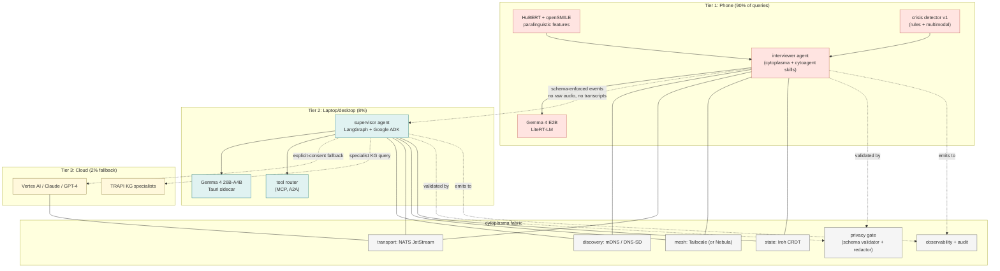
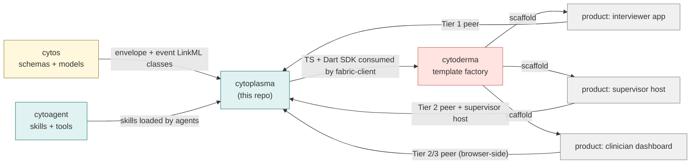

# Cytoplasma Design

> **Status**: Active
> **Date**: 2026-07-10
> **Author**: @shahin
> **Audience**: engineers
> **Tags**: `engineering`
> **Variants**: Technical (this doc) - Readable (Obsidian twin optional, same filename) - Agent (n/a)

> The distributed multi-agent fabric for Cytognosis. A library/SDK consumed by repos across Cytonome, Cytoverse, and Cytoscope.
> Provides agent discovery, role descriptors, schema-enforced events, mesh networking, CRDT state, tiered orchestration (phone / laptop / cloud), reliability constraints, and privacy-preserving primitives.
> The interviewer agent on phone and the supervisor agent on laptop both run on top of this fabric.
> Status: design, 2026-05-13.
> Author: Shahin Mohammadi (mohammadi@cytognosis.org), with synthesis assistance from Claude.

## 0. Naming

Working name: **`cytoplasma`** (cytoplasm, the medium where organelles live and communicate inside the cell).

Alternatives ranked:

1. `cytoplasma`: the intracellular medium; hosts organelles (agents), supports signaling, allows controlled diffusion. Strongest biological fit for "the fabric agents swim in".
2. `cytostroma`: supporting matrix / framework of an organ. Good for "the framework that hosts functional units". Less colloquial than cytoplasma.
3. `cytomesh`: literal mesh-networking metaphor. Modern and clear, but not biological; breaks the infrastructure-tier register.
4. `cytosynapse`: synaptic communication. Beautiful for multi-agent messaging, but "synapse" belongs at the neuro-scale tier (synapses are between neurons).
5. `cytonexus`: connection. Generic and a little corporate; weakest of the five.

Recommendation: `cytoplasma`. It hosts agents the way the cytoplasm hosts organelles, it is the medium of signaling, and it pairs aesthetically with `cytoskeleton` (both are core intracellular structures, both already infrastructure-tier).

Display: `cytoplasma` in code, `Cytoplasma` in running text.

## 1. Purpose and posture

Cytoplasma is the canonical Cytognosis runtime library for multi-agent operation across edge devices, local computers, and cloud. It exists so every Cytognosis product that participates in the agent system, the phone interviewer app, the laptop supervisor, web dashboards, internal tools, the browser extension, all speak the same protocols, discover the same peers, use the same schemas, enforce the same privacy rules, and inherit the same reliability constructs.

Posture: **distributed-by-default, on-device-first, schema-enforced, privacy-by-construction, tier-aware**. The fabric is not a server; it is a peer-to-peer mesh with discovery, message routing, and CRDT-based state. Tier identity (phone / laptop / cloud) is a first-class property of every peer and is used by the supervisor's routing policy.

The headline Cytonome workflow that motivates cytoplasma:

1. The phone runs an **interviewer agent**, an empathic, bidirectional, voice-enabled agent that understands nonverbal cues via paralinguistic features (HuBERT + openSMILE).
2. The phone hosts a **Tier 1 edge model** (Gemma 4 E2B via LiteRT-LM) for 90% of queries, plus a rules-based crisis detector.
3. When the query exceeds the edge model's competence, the phone delegates to a **Tier 2 supervisor agent** on the user's laptop or desktop (Gemma 4 26B-A4B running as a Tauri sidecar via LangGraph). This is the "thinking" tier.
4. The supervisor escalates to a **Tier 3 cloud specialist** (Vertex AI / Claude / GPT-4) for the ~2% of queries that require frontier capability, with explicit user consent for each escalation class.
5. All inter-tier traffic carries schema-enforced events only; raw audio and raw transcripts never leave the phone.
6. State that needs to be shared (preferences, longitudinal context, conversation summaries) syncs via Iroh CRDT documents over Tailscale mesh.

Cytoplasma provides the primitives that make this work and makes the same primitives reusable for any other multi-agent flow inside Cytognosis (data-pipeline supervision, knowledge-graph curation, asset-hub agents, neuro-scale analysis agents).

## 2. Naming and registry placement

Per the Cytognosis four-tier naming register, `cytoplasma` is an **infrastructure-tier** package: cellular-biology metaphor (cytoplasm, the medium of intracellular life) mapped to function (the distributed runtime medium for agents). Depends on `cytos` (schemas, types, contracts) and `cytoagent` (agent skill / tool registry, which cytoplasma loads into agents). Consumed by every Cytognosis app that participates in the agent system.

Repo path: `/home/mohammadi/repos/cytognosis/cytoplasma`.
Cytocast profile: `/home/mohammadi/repos/cytognosis/cytocast/profiles/cytoplasma.yaml`.

Note on cytoagent vs cytoplasma boundary: `cytoagent` owns **what** agents can do (skills, tools, MCP-exposed capabilities, role definitions). `cytoplasma` owns **how** agents reach each other and coordinate (discovery, transport, state, supervision, reliability, privacy). They are siblings at the infrastructure tier and version independently.

## 3. Scope

In scope:

1. **Discovery**: mDNS / DNS-SD for LAN peers, Tailscale-aware discovery for remote peers, manifest-based capability advertisement.
2. **Transport**: NATS JetStream for durable pub/sub messaging, with schema-enforced envelopes.
3. **State**: Iroh Documents (CRDT) for state shared across peers.
4. **Mesh**: Tailscale (or Nebula) for the encrypted overlay that the above runs on.
5. **Tiered orchestration**: Tier 1 / Tier 2 / Tier 3 routing policy, with deterministic fallback ladders.
6. **Agent role manifest**: each agent declares role, tier, capabilities (cytoagent skill set), reliability budgets, and consent surface.
7. **Supervisor patterns**: LangGraph supervisor / subagent topology, Google ADK integration, Dapr Agents primitives for actor model + state.
8. **Reliability constructs**: timeouts, retries with jittered backoff, circuit breakers, hedged requests, fallback policies, idempotency keys.
9. **Crisis-detection rails**: rules-based escalation paths invoked from any tier, with mandatory consent and resource hand-off to designated humans-in-the-loop.
10. **Voice plumbing**: turn-taking primitives, backchanneling channel, paralinguistic-feature event schema; does **not** include the models themselves.
11. **Privacy primitives**: no-raw-audio policy enforced at the message-schema layer, redaction defaults, on-device-first routing, explicit consent ledger per escalation class, differential-privacy aware aggregators for telemetry.
12. **Observability**: lineage-style event trace, redaction-aware audit log, OpenTelemetry export with privacy filters, MLflow-style run capture for agent sessions (link to `cytos`'s LaminDB lineage fabric where applicable).
13. **Reference agents**: a small set of reference implementations (interviewer agent core, supervisor core, crisis-detector core) that downstream products extend rather than build from scratch.

Out of scope (delegated elsewhere):

- The actual voice models (Whisper, Gemma 4, Kokoro): live in `cytos.models` and are served as Tier 1 / Tier 2 / Tier 3 endpoints from peers; cytoplasma routes to them.
- App UI: lives in `cytoderma`-generated apps; cytoplasma exposes a TS/Dart client SDK that those apps consume.
- Skill catalog: lives in `cytoagent`; cytoplasma loads it.
- Backend service definitions: live in Cytonome / Cytoverse service repos.
- Knowledge graph: lives in `cytos.kg`; agent queries against the KG go through `cytos.rag`.

## 4. Architecture overview



Three things are non-negotiable in this picture:

1. **No raw audio or raw transcripts cross peer boundaries.** Only schema-enforced events (intent, salient feature summaries, agent decisions, consent state) traverse the fabric. Enforced by the privacy gate at every send and receive.
2. **The phone is the default home for 90% of queries.** Tier 2 and Tier 3 are escalations, not the path of least resistance. Routing policy lives in the supervisor, but it is constrained by per-class consent.
3. **State sync is CRDT-based.** Conflicts resolve deterministically; offline-first works. Iroh Documents underpin shared session state.

## 5. Module layout

```
cytoplasma/
├── README.md
├── LICENSE
├── pyproject.toml
├── uv.lock
├── nox.toml + noxfile.py
├── mkdocs.yml
├── Dockerfile + docker-compose.yml   # NATS + Tailscale dev stack
├── .github/workflows/                # ci, release, fuzz, privacy-conformance
├── policy/
│   ├── consent_classes.yaml          # which escalation classes require which consent
│   ├── privacy_rules.rego            # OPA rules over message envelopes
│   └── reliability_budgets.yaml      # per-agent role timeout / retry / hedge budgets
├── schemas/
│   ├── envelope.linkml.yaml          # the on-the-wire envelope
│   ├── role_manifest.linkml.yaml     # agent self-description
│   ├── events/
│   │   ├── voice_features.linkml.yaml
│   │   ├── intent.linkml.yaml
│   │   ├── crisis.linkml.yaml
│   │   ├── consent.linkml.yaml
│   │   └── ...
│   └── state/
│       ├── session.linkml.yaml
│       └── longitudinal.linkml.yaml
├── src/
│   └── cytoplasma/
│       ├── __init__.py
│       ├── discovery/                # mDNS / DNS-SD client + Tailscale-aware augmentation
│       ├── transport/                # NATS JetStream client + envelope codec
│       ├── mesh/                     # Tailscale (and Nebula adapter) helpers
│       ├── state/                    # Iroh Documents client + CRDT helpers
│       ├── routing/                  # tier-aware routing policy + supervisor patterns
│       ├── roles/                    # role manifest + role registry
│       ├── reliability/              # timeouts, retries, circuit, hedge, fallback
│       ├── crisis/                   # crisis-detection rails + escalation
│       ├── voice/                    # turn-taking + paralinguistic event schema
│       ├── privacy/                  # gate, redactor, consent ledger
│       ├── observability/            # trace, audit, OTEL bridge, run capture
│       ├── adapters/
│       │   ├── langgraph/            # supervisor / subagent topology
│       │   ├── google_adk/           # ADK integration
│       │   ├── dapr/                 # Dapr Agents actor model + state
│       │   ├── mcp/                  # MCP server + client wrappers
│       │   └── a2a/                  # A2A protocol bindings
│       ├── reference_agents/
│       │   ├── interviewer/          # interviewer-core agent
│       │   ├── supervisor/           # supervisor-core agent
│       │   └── crisis_detector/      # crisis-core agent
│       ├── cli/                      # cytoplasma CLI (peer status, role list, audit)
│       └── utils/
├── clients/
│   ├── typescript/                   # TS SDK for cytoderma's fabric-client
│   └── dart/                         # Dart SDK for the phone template
├── examples/                         # runnable demos (LAN-only phone+laptop)
└── docs/                             # mkdocs Material site
```

## 6. Core abstractions

### 6.1 Envelope

Every message on the fabric is wrapped in a schema-enforced envelope (LinkML class `MessageEnvelope`):

```yaml
MessageEnvelope:
  attributes:
    id:                      # ULID
    from_peer:               # peer ID (mesh address + tier)
    to_peer_or_role:         # explicit peer OR symbolic role binding
    schema_uri:              # exact LinkML class URI for the payload
    schema_version:          # version pin
    payload:                 # validated against schema_uri
    consent_class:           # which consent class this envelope counts under
    redaction_classes:       # what was redacted before send
    crisis_state:            # if part of an escalation
    issued_at:               # RFC 3339
    expires_at:              # message expiry
    correlation_id:          # for tracing across agents
    signature:               # peer signs envelope; verified on receive
```

The privacy gate refuses any send/receive whose payload does not validate against `schema_uri`, or whose declared `consent_class` is missing from the consent ledger.

### 6.2 Role manifest

Each agent publishes a role manifest at start-up (LinkML class `RoleManifest`):

```yaml
RoleManifest:
  attributes:
    role_name:               # e.g. interviewer, supervisor, crisis-detector
    role_version:
    tier:                    # phone | laptop | cloud
    capabilities:            # list of cytoagent skill IDs
    consumes_events:         # schema_uris this role subscribes to
    emits_events:            # schema_uris this role produces
    reliability_budget:      # timeout, retry, hedge profile
    consent_required:        # consent classes this role may invoke
    crisis_role:             # detector | escalator | resolver | none
```

Discovery propagates role manifests over mDNS TXT records (LAN) and through a Tailscale-replicated registry (mesh).

### 6.3 Tiered routing policy

The supervisor consults a routing policy when deciding whether to handle locally, delegate to a peer, or escalate to cloud. Policy is data, not code: it is a YAML file under `policy/` that maps `(intent_class, urgency, consent_state)` → tier. The supervisor uses the policy to pick a peer matching the required role + tier; reliability constructs handle peer failures.

Default policy is the §9.4 split: phone-first 90%, laptop 8%, cloud 2%. Crisis routes have their own policy with shorter timeouts and mandatory human-in-the-loop escalation.

### 6.4 Reliability budgets

Each role declares a budget. The reliability layer enforces:

- **Timeouts**: per-tier defaults (phone: aggressive, ~250 ms for voice ack; laptop: ~2 s for thinking; cloud: ~10 s for specialist).
- **Retries**: jittered exponential backoff bounded by budget.
- **Hedged requests**: for read-only specialist queries, send to two peers and take the first.
- **Circuit breakers**: open on streak of failures; half-open with single-request probe.
- **Fallback ladder**: explicit per intent class (e.g. if Tier 2 unavailable, attempt Tier 1 with degraded answer + user-visible degradation notice; never silently fall up to Tier 3).

### 6.5 Privacy primitives

- **No-raw-audio rule**: enforced at the privacy gate. Schemas under `schemas/events/voice_features.linkml.yaml` accept feature vectors, prosody summaries, and intent labels; they do not accept raw audio bytes. The envelope schema rejects `application/octet-stream` payloads outright unless the role manifest explicitly declares the rare exception path.
- **Redaction defaults**: every field in every event schema is tagged with a redaction class (`none`, `pii`, `clinical`, `secret`). The gate applies the redaction policy on send and re-validates on receive.
- **Consent ledger**: each consent class (e.g. `share_with_cloud_specialist`, `record_session_summary`, `share_with_caregiver`) has an explicit grant in a CRDT-replicated ledger. Sends that require a consent class fail closed if the grant is missing or revoked.
- **On-device-first routing**: the supervisor's default policy favors lower tiers; escalation requires a positive policy match, not just a budget.
- **Differential-privacy-aware aggregators**: for any telemetry that aggregates across users, cytoplasma exposes DP primitives (laplace/gaussian noise, per-user epsilon budget). Apps that aggregate user data without DP are flagged by the privacy lint.

### 6.6 Crisis rails

A first-class subsystem because the cost of getting this wrong is high.

- The Tier 1 rules-based crisis detector emits a `CrisisDetected` event on the fabric.
- The escalation policy is deterministic: who is notified, in what order, with what consent class. Defaults to in-app safety surface; opt-in to caregiver / clinician notification per user.
- The supervisor is required to acknowledge `CrisisDetected` events and route to a `crisis-resolver` role if available locally; if not, surface in-app resources.
- Crisis events are exempt from the standard timeout budgets and run on a separate priority queue.

### 6.7 Observability

- **Trace**: every envelope has a correlation_id; the observability module emits OTEL spans per send / receive / handle.
- **Audit**: redaction-aware audit log persists locally on each peer; export gated by consent.
- **Run capture**: agent sessions captured as Run records compatible with `cytos`'s LaminDB lineage so a session can be replayed (within consent) for debugging or evaluation.

## 7. Reference agents

The repo ships three small reference agents so downstream products extend rather than rebuild:

### 7.1 `reference_agents/interviewer/`

The Cytonome headline agent. Lives at Tier 1 on the phone.

- Bidirectional voice loop with turn-taking, barge-in, repair signals.
- Paralinguistic features in (HuBERT + openSMILE), affect-aware backchanneling out.
- Schema-enforced event emission for every utterance summary, every intent classification, every consent decision.
- Delegates uncertain or out-of-scope queries to the supervisor.
- Hands off to the crisis detector when its detector hits a positive.

### 7.2 `reference_agents/supervisor/`

The "thinking" tier. Lives at Tier 2 on the laptop/desktop.

- LangGraph supervisor pattern with role-based subagent dispatch.
- Google ADK + Dapr Agents primitives for actor model and state.
- Tool router: invokes MCP-exposed tools and A2A-exposed peers.
- Consults routing policy and reliability budgets before any escalation.
- Reports back to the phone agent over schema-enforced events; never sends raw model outputs without the schema.

### 7.3 `reference_agents/crisis_detector/`

Tier 1 rules + multimodal classifier; designed to be conservative and high-recall by default.

- Inputs: text intent classifications + paralinguistic feature events.
- Output: `CrisisDetected` event with a severity grade and a recommended escalation class.
- The policy module decides what the escalation actually does.

## 8. Tech choices and rationale

| Concern | Choice | Why |
|---|---|---|
| Discovery | mDNS / DNS-SD | Zero-config LAN discovery; well-supported on iOS/Android/desktop. |
| Mesh | Tailscale (Nebula adapter) | Encrypted overlay; identity bound to user device; works through NAT. |
| Transport | NATS JetStream | Schema-friendly subjects, durable streams, low overhead, good Dart/TS clients. |
| State | Iroh Documents (CRDT) | Offline-first, deterministic merge, ergonomic API; better fit than Automerge for our scale. |
| Supervisor | LangGraph | Mature topology for supervisor/subagent flows; good observability hooks. |
| Actor model | Dapr Agents | First-class actor primitives + state stores; works alongside LangGraph rather than replacing it. |
| Agent SDKs | Google ADK | Provides the agent + tool abstraction; integrates cleanly with MCP. |
| Tool protocol | MCP | Already the de-facto agent-to-tool standard at Cytognosis. |
| Agent-to-agent | A2A | The complementary growing standard; cytoplasma exposes A2A-compatible peers. |
| Schemas | LinkML (authored), Pydantic + TS + Dart (generated) | Consistent with the rest of Cytognosis (cytos hub-and-spoke schema model). |
| Privacy enforcement | OPA + Rego over LinkML envelopes | Declarative policy; auditable; same engine other Cytognosis repos already use. |
| Observability | OpenTelemetry + LaminDB Run bridge | Standard OTEL; LaminDB integration ties agent sessions into the rest of the lineage fabric. |

## 9. Relationship to other Cytognosis repos



## 10. Prioritized roadmap

### Phase 0, scaffold (week 1-2)

- Repo, cytocast profile, copier.yaml, mkdocs site.
- Envelope and role-manifest LinkML schemas.
- TS and Dart SDK skeletons; codegen pipeline from LinkML.
- Reference NATS + Tailscale dev stack via docker-compose.

### Phase 1, fabric core (week 2-5)

- Discovery (mDNS / DNS-SD) working LAN-only.
- Transport (NATS JetStream) with schema-validated envelopes.
- Privacy gate (OPA + Rego over envelopes).
- State (Iroh Documents) with one shared session document and one longitudinal document.
- Reliability layer (timeouts, retries, circuit breaker).
- Observability bridge (OTEL spans, redaction-aware audit log).

### Phase 2, supervisor + reference agents (week 5-9)

- LangGraph supervisor pattern with Google ADK + Dapr Agents adapters.
- MCP server and client wrappers; A2A bindings.
- Reference interviewer agent runnable on a Flutter emulator; emits schema-enforced events; talks to a local supervisor.
- Reference supervisor agent runnable as a desktop sidecar; routes to local tools and to an optional cloud peer.
- Reference crisis detector v1 with rules + a small multimodal classifier.

### Phase 3, hardening (week 9-12)

- Fuzz tests on envelope decoder + privacy gate.
- Conformance test suite (any peer can be exercised by a generic test harness that asserts schema, reliability, and privacy properties).
- Differential-privacy primitives for telemetry aggregators.
- Mesh-with-cloud (Tailscale + a managed cloud peer in GCP Cloud Run) end-to-end demo.

### Phase 4, productization (week 12-16)

- First production phone app shipped on top of cytoplasma's Dart SDK (the Cytonome interviewer-agent app generated from cytoderma).
- First production desktop app shipped on top of cytoplasma's TS SDK (the supervisor host).
- Integrations: LaminDB Run capture for agent sessions; FAIRSCAPE ARK assignment for shared longitudinal documents on user request.

## 11. Open questions

1. **Name confirmation**: `cytoplasma` vs `cytostroma`. Default to `cytoplasma`.
2. **Tailscale vs Nebula**: default Tailscale (managed, mature, identity-bound); Nebula adapter as the sovereign alternative. Lock in default per release.
3. **NATS vs MQTT 5**: NATS chosen for JetStream durability + Dart/TS clients; revisit if a MQTT 5 + LinkML codec proves materially better for embedded targets.
4. **CRDT: Iroh Documents vs Automerge**: Iroh chosen; revisit if Automerge gains better Dart/TS ergonomics.
5. **Crisis-detector scope**: Phase 2 ships a rules + small multimodal classifier; future versions need a clinical validation track. Where does that live? Likely a separate `neuro*` repo or a `cytopraxis`-tier evaluation.
6. **Consent UX hand-off**: cytoplasma surfaces the consent ledger; the app (cytoderma-generated) renders the prompts. Need a strong shared component contract so each app does this identically.
7. **Cloud peer selection policy**: when Tier 3 is permitted, which provider does the supervisor pick by default? Recommendation: user-pinned at install time, overridable per consent class.
8. **A2A maturity**: A2A is on the growing list (per tools_infra_stack §8.4). If it stalls, what is the fallback? Recommendation: keep MCP-only as the floor; A2A is the preferred path but optional.
9. **Replay scope**: how much of an agent session can be replayed for debugging without violating the no-raw-audio rule? Recommendation: only schema-enforced events are stored; replay reconstructs decisions, not voice.
10. **Where does the supervisor live when the user has no laptop?** A small-instance cloud peer with stronger isolation is the answer, but it requires careful consent design. Phase 4 work.

## 12. Cytocast profile sketch

```yaml
# /home/mohammadi/repos/cytognosis/cytocast/profiles/cytoplasma.yaml
name: cytoplasma
description: Distributed multi-agent fabric SDK for Cytognosis
kind: library
env_binding: cytognosis-agent             # extends the cytoagent env with NATS + Tailscale + Iroh toolchains
project_directories:
  - schemas
  - policy
  - clients
  - examples
  - docs
source_modules:
  - discovery
  - transport
  - mesh
  - state
  - routing
  - roles
  - reliability
  - crisis
  - voice
  - privacy
  - observability
  - adapters
  - reference_agents
  - cli
  - utils
clients:
  - typescript
  - dart
hooks:
  pre_gen:
    - validate_cytos_schema_version
    - validate_cytoagent_skill_version
  post_gen:
    - generate_envelope_codecs    # LinkML → Pydantic + TS + Dart
    - install_skills
    - bootstrap_dev_stack         # NATS + Tailscale dev compose
```
