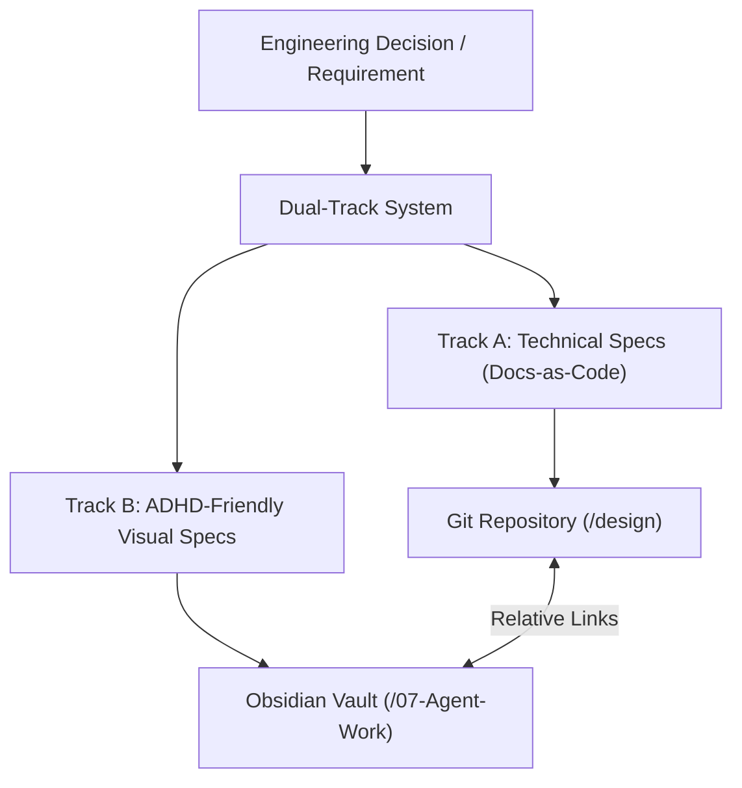

# Cytognosis Documentation Standards and Lifecycle Framework

> **Status**: Active
> **Date**: 2026-05-25
> **Author**: Antigravity
> **Tags**: `standards`, `documentation`, `lifecycle`, `obsidian-vault`

This document defines the technical documentation standards and lifecycle framework for the Cytognosis Foundation. We track two separate, parallel versions of our knowledge assets side-by-side to serve different cognitive styles and engineering needs. This framework ensures our codebase remains transparent, maintainable, and aligned with our scientific mission.

---

## 1. The Side-by-Side Dual-Track Strategy

We maintain two distinct representations for every major documentation asset. This approach bridges the gap between rigorous technical specifications and rapid conceptual comprehension.



### Track A: Technical Specifications (Docs-as-Code)
* **Format**: Standard Markdown files stored directly inside the code repository under the `design/` folder.
* **Target Audience**: Core developers, external technical reviewers, systems integrators, and automated agents.
* **Key Characteristics**:
  * Emphasizes formal accuracy, complete API tables, parameter types, explicit configuration keys, and performance complexity bounds.
  * Follows strict versioning in Git alongside the source code.
  * Captures every edge case and error state.

### Track B: ADHD-Friendly / Executive Visual Specifications
* **Format**: Highly styled Markdown files stored in the central Obsidian Vault.
* **Target Audience**: Shahin Mohammadi, multidisciplinary scientists, busy operators, and onboarding developers.
* **Key Characteristics**:
  * **Visual Primacy**: Integrates extensive Mermaid diagrams, flowcharts, data flows, and state machines to explain logic without heavy blocks of text.
  * **Color System**: Uses headings and accents styled with colors from the Cytognosis fluorescent dye palette. These colors include Violet (#8B3FC7), Azure (#3B7DD6), Magenta (#E0309E), Indigo (#5145A8), Coral #F26355, and Teal (#14A3A3).
  * **Structured Alerts**: Highlights important context, tips, and warnings using GitHub-style alerts.
  * **Scannability**: Features quick-reference lookup tables, bulleted checklists, bold key terms, and copy-pasteable terminal commands.
  * **Minimal Prose**: Avoids dense paragraphs. We limit prose explanation to 3 sentences max before introducing a visual element.

---

## 2. Core Technical Document Types

The Cytognosis documentation system consists of six standardized technical document types. Each type serves a specific purpose in the software development lifecycle.

### Architecture Decision Record (ADR)
* **Trigger**: You make a significant, hard-to-reverse technical choice.
* **What It Captures**: Context, constraints, the bold decision sentence, alternatives considered (at least two), and negative or positive consequences.
* **Rule**: Keep ADRs append-only and focused on one decision. Create a new ADR if a decision changes.

### Module Specification (Module Spec)
* **Trigger**: You build or refactor an importable software module.
* **What It Captures**: Public API parameters, return types, raises tables, environment configurations, and dependency lists.
* **Rule**: Write specs so a developer can integrate with the module by reading only the spec document.

### Request for Comments (RFC)
* **Trigger**: You propose a multi-module feature or breaking schema change requiring team consensus.
* **What It Captures**: Motivation, current state, detailed proposal design, migration strategy, trade-off matrix, and implementation timeline.
* **Rule**: Write and approve the RFC before writing a single line of code.

### Research Evaluation (EVAL)
* **Trigger**: You compare multiple libraries, tools, or third-party APIs.
* **What It Captures**: Scoring matrix with weighted criteria, reproducible setup steps, and real test outcomes.
* **Rule**: Base all scoring on hands-on testing. Document failure modes explicitly.

### Troubleshooting Guide (TROUBLESHOOT)
* **Trigger**: An error occurs more than once or requires non-obvious debugging.
* **What It Captures**: Exact error logs in code blocks, step-by-step diagnostic commands, root causes, and prevention strategies.
* **Rule**: Group and name issues by the symptom what the user actually sees, not the internal cause.

### Changelog (CHANGELOG)
* **Trigger**: You cut a release or hit a major project milestone.
* **What It Captures**: A clean list of user-facing changes grouped by semantic categories (Added, Changed, Deprecated, Removed, Fixed, Security).
* **Rule**: Maintain the Unreleased section as you code. Include migration guides for breaking changes.

---

## 3. Document Lifecycle and Complexity Matrix

The following table classifies our documentation assets by their development stage, complexity level, and target audience.

| Document Type | Development Stage | Primary Focus / Capture | Complexity Level | Primary Use Case | Primary Audience |
| :--- | :--- | :--- | :--- | :--- | :--- |
| **Research Evaluation (EVAL)** | Research & Ideation | Compares tools; records scoring matrices; documents setup failures | Moderate | Choosing a graph database or benchmarking an LLM API | Research Lead, Technical Architect |
| **Request for Comments (RFC)** | Planning & Design | Proposes system-wide features; defines migration paths; lists trade-offs | High | Pitching a new decentralized biosensing pipeline | Entire Engineering Team |
| **Architecture Decision Record (ADR)** | Architecture Setup | Documents hard-to-reverse choices; captures negative trade-offs | Moderate to High | Deciding to store genomic graphs using LinkML | Developers, Compliance Auditors |
| **Module Specification (Module Spec)** | Implementation | Details public classes/APIs; lists parameters; diagrams module relations | High | Implementing the semantic search client interface | Software Engineers, QA Engineers |
| **Changelog (CHANGELOG)** | Release | Grouped changes; version history; migration snippets | Low | Reviewing what changed between v0.5.0 and v0.6.0 | End Users, Project Managers |
| **Troubleshooting Guide (TROUBLESHOOT)** | Operations & Support | Exact error patterns; diagnostic checks; copy-pasteable resolutions | Moderate | Resolving GCP deployment permission errors | SRE, On-call Engineers |

---

## 4. Visual Callout System (ADHD-Friendly Track)

For our visual track, we use distinct callouts to break up prose and emphasize critical insights. We avoid stacking these boxes consecutively to keep the interface clean.

> [!NOTE]
> Use this callout for background context, structural explanations, and minor implementation details.

> [!TIP]
> Use this callout for performance optimizations, best practices, and CLI productivity shortcuts.

> [!IMPORTANT]
> Use this callout for critical design patterns, mandatory integration rules, and requirements that must be followed.

> [!WARNING]
> Use this callout for breaking changes, potential schema corruption risks, and API deprecations.

> [!CAUTION]
> Use this callout for actions that risk data loss, secure key exposures, or compliance violations.

---

## 5. Vault Organization and Connected Graph Standards

We store all ADHD-friendly documents in a structured hierarchy inside our central Obsidian Vault. Every document must act as a node in a connected graph to avoid orphaned assets.

```
ObsidianVault/
├── 00-Index.md                        ← The central entry point
├── 01-Strategy/                       ← Mission, platforms, blindspots
├── 02-Architecture/                   ← Master plans, system graphs
│   ├── adrs/                          ← ADHD-friendly ADR visual summaries
│   └── rfcs/                          ← Visual proposal flows
├── 03-Modules/                        ← Visual module interaction diagrams
├── 04-Evaluations/                    ← Visual technology matrix cards
├── 05-Troubleshooting/                ← Quick-reference symptom cards
├── 06-Changelogs/                     ← Version release timelines
└── 07-Agent-Work/                     ← Current execution notes and validation logs
```

### Reference Linking Standards
* **Bi-directional Links**: Every subdirectory has an index file linking to all child files. Each child file must link back to its parent index.
* **Docs-to-Code Links**: Track A files inside Git must contain a footer link pointing to the corresponding Track B file in the Obsidian vault (using `obsidian://` URLs).
* **Code-to-Docs Links**: Track B files must link to the Git repository folder or the exact source files using GitHub URLs (`https://github.com/cytognosis/<repo>/blob/main/...`). Never use `file:///` URLs or local absolute paths (`/home/...`, `~/...`) as document references; local paths are allowed only inside fenced code blocks as runnable commands. (Rule updated 2026-07-19.)
* **No Orphans**: Any new document must be immediately added to `00-Index.md` or a related parent index before completing the task.
