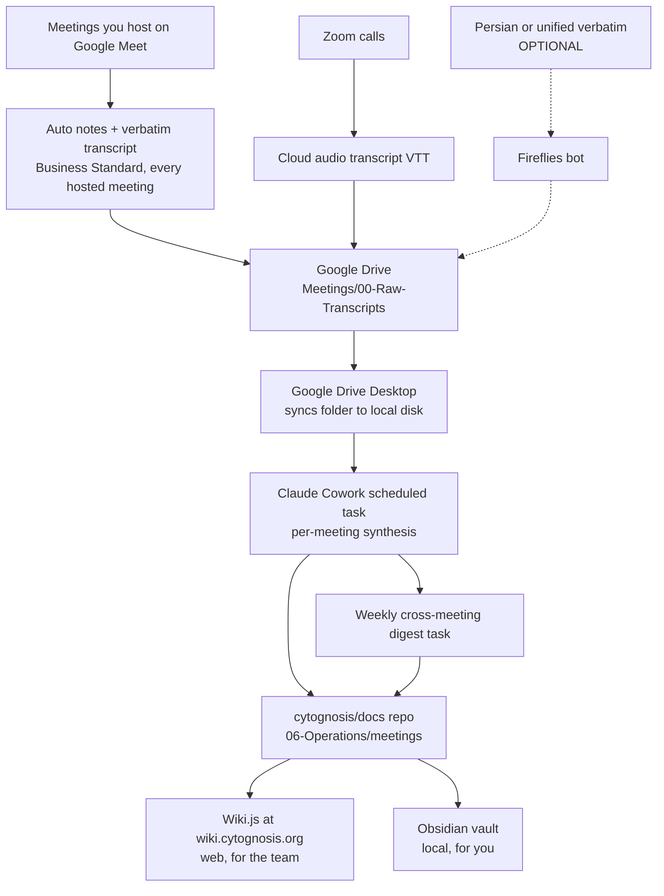

# Meeting Transcription, Storage, and Synthesis: Recommended System for Cytognosis

> **Status**: Active
> **Date**: 2026-07-10
> **Author**: @shahin
> **Audience**: engineers
> **Tags**: `engineering`
> **Variants**: Technical (this doc) - Readable (Meeting-Transcription-and-Synthesis-Plan.md in Obsidian vault: 04-Engineering/toolchain/) - Agent (n/a)

**Reading time:** about 7 minutes. **If you only read one thing:** the **Decisions** table, then "Part 1: Fix Google Meet."

## BLUF

The fix for "auto-notes on every meeting I host" is a **one-seat upgrade to Business Standard for Nonprofits** (Gemini now bundled, about **$3 to $4/user/month**) plus **one toggle** in Meet settings. Your personal Google AI Ultra license cannot do this, because Meet note-taking and transcription are **Workspace** features that do not exist on consumer accounts and cannot be attached to your org account; that is a licensing fact, not a misconfiguration. Once upgraded, Meet auto-saves notes and verbatim transcripts for every meeting you host to org Drive, Zoom adds its free cloud transcript, and **Claude Cowork** synthesizes everything into your **`cytognosis/docs` repo**, which already surfaces in both **Obsidian** and **Wiki.js**. Persian is the one thing native will not cover (8-language limit), so treat it as an optional add-on, not the deciding factor.

## Decisions (flagged; I will proceed on these unless you redirect)

| # | Decision | Why |
|---|----------|-----|
| **D1** | **Fix Meet by upgrading one seat to Business Standard for Nonprofits, then toggle auto note-taking for all hosted meetings** | Achieves your exact goal natively; output lands in org Drive |
| **D2** | **Stop routing this through the personal AI Ultra license** | Meet notes/transcripts are Workspace-only and account-scoped; keep Ultra for personal Gemini/NotebookLM use |
| **D3** | **Zoom**: turn on cloud "audio transcript" (verbatim VTT) | Free, already paid for; covers your Zoom calls |
| **D4** | **Central store** = `cytognosis/docs` repo at `06-Operations/meetings/` | One write appears in Obsidian + Wiki.js + GitHub automatically |
| **D5** | **Synthesis** = Claude Cowork scheduled tasks, not NotebookLM or Gemini | No source caps, handles any language, writes Markdown locally; identical regardless of capture tool |
| **D6** | **Persian is a bonus, not the decider**; add Fireflies only if you need guaranteed Persian or one unified verbatim format | Native covers English fully; Persian is the only native gap |

## Already in place (verified this session)

- [x] Docs repo taxonomy live on `main` (the `reorg/universal-taxonomy` work is already merged)
- [x] **Wiki.js** running at `wiki.cytognosis.org`, bidirectionally git-synced to `cytognosis/docs` every 5 minutes
- [x] Google Drive "Meet Recordings" folder already collecting Gemini summaries (no verbatim transcripts yet)
- [x] **Claude Team + Cowork** available as the automation engine
- [x] Verified: Meet note-taking/transcription require a paid Workspace edition; the personal AI Ultra license cannot supply them
- [x] Verified: native take-notes and transcripts cover 8 languages (no Persian); Zoom VTT covers 19 (no Persian)

---

## Part 1: Fix Google Meet (your goal: auto-notes on every meeting you host)

### The lever that actually works: upgrade one seat, flip one switch

Gemini Meet features ("take notes for me" and verbatim "Transcribe meetings") are **bundled into Business Standard** and every higher paid edition as of 2026, with no separate add-on. Upgrade only your `mohammadi@cytognosis.org` seat at the nonprofit rate, then set the auto-default once.

**Setup, end to end:**

1. **Admin, one-time:** at `admin.google.com` go to **Apps > Google Workspace > Google Meet > Gemini**, and confirm "Take notes for me" and "Transcripts" are on for your user.
2. **Auto-enable for all hosted meetings, one-time:** at `meet.google.com` open **Settings (gear) > Meeting records**, and under **Automatic note taking for all future meetings** choose **"For all scheduled meetings I host."** Enable the transcript option in the same panel.
3. **Result:** every meeting you create and host now auto-generates notes plus a verbatim transcript, saved to your org Drive and attached to the Calendar event. **Zero per-meeting clicks.**

### Why the personal Ultra license is not the path

It is reasonable to expect a paid AI plan to cover this, but two facts close it off. First, **"take notes for me" requires an eligible Workspace subscription** and is not available on personal Gmail accounts at any AI tier; the consumer Ultra benefit list does not include Meet note-taking at all. Second, **consumer subscriptions are scoped to the single account that buys them** and cannot be transferred or linked to a separate Workspace identity on another domain. So the Ultra license cannot light up Meet on your org account. Keep Ultra for what it is good at (personal Gemini app, NotebookLM, Flow, and similar), and drive Meet from the org edition.

### What we observed in your meetings (supporting evidence)

- Your **English** Ali meetings (Apr 21 to 28, May 27, May 29) produced clean Gemini summaries with real substance and action items. Native Meet works well for English.
- Your **Persian** Ali meeting on **May 2** failed: "a summary wasn't produced because there wasn't enough conversation in a supported language."
- The **May 24** meeting (some Persian) produced garbled output ("Battle six", "Chaz Jose").
- **No verbatim transcript existed for any meeting**, because the paid "Transcribe meetings" feature was never enabled. The upgrade above fixes that for English.

### Language reality (so expectations are set)

| Feature | Languages | Persian? | Saved to Drive |
|---------|-----------|----------|----------------|
| Meet "Take notes for me" (summary) | 8 | **No** | Yes |
| Meet "Transcribe meetings" (verbatim) | 8 | **No** | Yes |
| Meet live captions | broad | **Farsi (beta)** | **No** (on-screen only) |

After the upgrade, **English hosted meetings are fully covered** (auto notes + verbatim, to Drive). **Persian is still not covered natively**; see the optional path in Part 5.

---

## Part 2: Fix Zoom (verbatim transcript)

The exportable verbatim file is the cloud recording's **Audio Transcript** (`.vtt`), separate from the AI Companion summary.

- **One-time:** at `zoom.us` go to **Settings > Recording**, enable **Cloud recording**, check **Create audio transcript**, Save.
- **Per meeting:** click **Record > Record to the Cloud** (local recordings produce no transcript).
- **Export:** `zoom.us` > **Recordings** > open the meeting > download **Audio Transcript**.

Zoom AI Companion summaries are included free on Pro and support Persian; the raw VTT does not officially support Persian, and Pro gives 10 GB cloud storage, so export and clear periodically.

---

## Part 3: Central storage (one location for everything)

**The key insight: you do not choose between Obsidian, Wiki.js, and the repo. They are the same files.** The `cytognosis/docs` Git repo is the shared substrate: Obsidian edits it locally, Wiki.js edits it on the web, and Wiki.js syncs bidirectionally every 5 minutes. **Write once to the repo and it appears in all three** (plus GitHub history).

Two layers:

- **Raw intake (transient, verbatim):** a **Google Drive** folder. Meet transcripts already save to Drive; Zoom VTTs (and Fireflies, if used) drop here too. Your nonprofit Drive has 100 TB pooled, so space is a non-issue.
- **Synthesis (permanent, curated):** the **`cytognosis/docs` repo**. Claude Cowork writes clean Markdown here.



Proposed structure inside the docs repo:

```
06-Operations/meetings/
├── _index.md                              # dashboard: open action items, recent meetings
├── notes/2026/
│   └── Meeting-<Topic>-2026-06-21.md      # one synthesized note per meeting
├── digests/
│   └── Digest-Weekly-2026-W25.md          # cross-meeting rollup
└── _templates/
    ├── meeting-note.md
    └── weekly-digest.md
```

Keep **verbatim transcripts in Drive only** (not in Git) to keep the repo light; each synthesized note links back to its Drive source. This follows your existing `Meeting-[Topic]-[Date]` naming convention.

---

## Part 4: Automated analysis (within and across meetings)

Two **Claude Cowork scheduled tasks**, both unattended. This layer is **identical no matter how you capture** (native Meet transcripts, Zoom VTTs, and Fireflies all flow through it).

- **Within-meeting (daily, e.g. 6:00 PM):** scan the synced raw folder for new files. For each, write a standard note: summary, key decisions, action items with owners and due dates, technical/scientific notes, open questions, follow-ups. Translate any Persian to English while preserving the original. Save to `notes/2026/`.
- **Cross-meeting (weekly, e.g. Monday 8:00 AM):** read the week's notes and write a digest: recurring themes, all open action items grouped by owner, a decisions log, per-person threads, and anything slipping. Save to `digests/`.

**Why Claude rather than NotebookLM or Gemini:** NotebookLM caps at 50 sources per notebook and reads Persian poorly; Gemini in Meet does not do Persian. Claude Cowork reads and writes your local files directly, handles any language, has no source caps, and you already own it.

Ready-to-use task prompts (I can register these once the Drive folder and sync are live):

> **Task A, daily 6:00 PM:** "Scan `~/<DriveSync>/Meetings/00-Raw-Transcripts` for transcript files modified in the last 24 hours. For each new meeting, write a structured Markdown note (summary, decisions, action items with owners, technical notes, open questions, follow-ups; translate any Persian to English and keep the original). Save to `cytognosis/docs/06-Operations/meetings/notes/2026/` as `Meeting-<Topic>-<YYYY-MM-DD>.md`, link back to the source, and skip files already processed."

> **Task B, Mondays 8:00 AM:** "Read all notes in `.../meetings/notes/2026/` from the last 7 days. Write a cross-meeting digest: recurring themes, all open action items by owner, a decisions log, per-person threads, and items slipping. Save to `.../digests/Digest-Weekly-<YYYY-Www>.md` and update `_index.md`."

---

## Part 5: Optional add-on for Persian or one unified verbatim format

Native covers English. If you want **guaranteed Persian transcripts** or a **single verbatim format across both Meet and Zoom**, add one Fireflies seat. This is optional and independent of everything above.

| Requirement | Fireflies | Notes |
|-------------|-----------|-------|
| Persian / Farsi | **Yes** (`fa`, all plans) | Multi-Language mode handles English + Persian in one call |
| Works on Meet **and** Zoom | **Yes** | One tool for both |
| Auto-join, auto-export to Drive | **Yes (native)** | No per-meeting clicks, no Zapier |
| Nonprofit discount | **10%** | Email `support@fireflies.ai` from `@cytognosis.org` |
| Price | **~$10/mo Pro** | About **$9** after the discount |

Caveats: Persian ASR is Whisper-class, good but variable, so test one real bilingual call first. **Bot-free alternative:** Tactiq (Chrome extension) transcribes Meet captions, including Farsi beta, with no bot, but it has no native Drive export and you must be in the meeting on Chrome.

---

## Part 6: One caveat to hold onto

**Do not run a cloud notetaker bot (Fireflies, etc.) on patient or PHI calls.** Your "All Things - Tools" doc specifies PHI session transcripts go to phone-local storage plus a HIPAA-compliant DB only. Keep clinical/Yar calls entirely off this pipeline. Native Meet/Zoom recording of PHI also needs its own compliance review before use.

Minor: the Obsidian REST API plugin returned a schema error this session, so the automation writes to the repo **files** directly rather than through the Obsidian API. That is more robust anyway; fixing the plugin is optional.

---

## Part 7: Action checklist (do-now first)

**Do now (no outreach needed):**

1. **Upgrade your seat** to Business Standard for Nonprofits at the upgrade page, then set Meet **Meeting records > Automatic note taking > "For all scheduled meetings I host"** and enable transcripts.
2. **Zoom:** enable cloud **Create audio transcript** (5 minutes).
3. **Reframe the Ultra license:** keep it for personal Gemini/NotebookLM use; it is not part of the Meet pipeline.

**Optional (only if you want Persian or unified verbatim):**

4. Start one **Fireflies** seat; email `support@fireflies.ai` for the 10% nonprofit discount.

**I can do these for you (just say go):**

5. Scaffold `06-Operations/meetings/` with the two templates in the docs repo.
6. Create the Google Drive `Meetings/00-Raw-Transcripts` intake folder.
7. Register the two Claude Cowork scheduled tasks (A and B).

---

## Cost summary

| Item | Plan | Monthly |
|------|------|---------|
| Business Standard for Nonprofits (1 seat) — unlocks auto notes + verbatim transcripts + recording + NotebookLM Plus + Gemini in Docs/Gmail | nonprofit rate | **~$3 to $4** |
| Zoom Pro | existing nonprofit | $0 new |
| Claude Team / Cowork | existing nonprofit | $0 new |
| Optional: Fireflies (1 seat, after 10% discount) for Persian / unified verbatim | Pro | ~$9 |
| **Net new for the core fix** | | **~$3 to $4/month** |

Confirm the exact nonprofit price on Google's upgrade page; list Business Standard is about $14/user/month before the nonprofit discount.

---

## Sources

- Google, Take notes for me in Meet (requires Workspace; 8 languages; no Persian): https://support.google.com/meet/answer/14754931
- Google, Calendar and Meet settings, auto note-taking "for all meetings I host": https://support.google.com/meet/answer/16909639
- Google, Use transcripts with Meet (verbatim; edition-gated; 8 languages): https://support.google.com/meet/answer/12849897
- Google, Use live captions in Meet (Farsi beta; on-screen only): https://support.google.com/meet/answer/15077804
- Google, Compare Workspace features for nonprofits (free tier lacks record/transcribe; updated 2026-05-15): https://knowledge.workspace.google.com/admin/billing/compare-google-workspace-features-for-nonprofits
- Google, Upgrade from Google Workspace for Nonprofits (discounted editions): https://knowledge.workspace.google.com/admin/billing/upgrade-from-google-workspace-for-nonprofits
- Google, Admin: let Meet AI take notes for users: https://knowledge.workspace.google.com/admin/meet/let-google-meet-ai-take-notes-for-my-users
- Google AI Ultra benefits (consumer plan; no Meet note-taking listed): https://support.google.com/googleone/answer/16286513
- Zoom, Using audio transcription for cloud recordings (19 languages; no Persian): https://support.zoom.com/hc/en/article?id=zm_kb&sysparm_article=KB0064927
- Zoom, Cloud recording storage capacity (10 GB on Pro): https://support.zoom.com/hc/en/article?id=zm_kb&sysparm_article=KB0067670
- Fireflies, Supported languages (Persian `fa`, all plans): https://guide.fireflies.ai/articles/2973706448-learn-about-fireflies-supported-languages
- Fireflies, Nonprofit discount (10%): https://guide.fireflies.ai/articles/8062778578-learn-about-discounts-on-the-fireflies-pricing-plan

*Empirical findings (your Ali meetings: English summarized well, Persian failed or garbled; no verbatim transcripts in Drive) verified from your Google Drive this session. Internal infrastructure (docs repo taxonomy; Wiki.js on cytohost git-synced to `cytognosis/docs`) verified from the `cytognosis` repo.*
