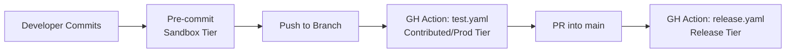

# CI/CD Features & Git Hooks

> **Status**: Active
> **Date**: 2026-07-10
> **Author**: @shahin
> **Audience**: engineers
> **Tags**: `engineering`
> **Variants**: Technical (this doc) - Readable (cicd-features.md in Obsidian vault: 04-Engineering/toolchain/cytocast/features/) - Agent (n/a)

Cytocast generates a complete CI/CD pipeline that enforces code quality at four escalating tiers, from permissive local development to strict release gating. Every generated project ships with GitHub Actions workflows, pre-commit hooks, and tiered ruff configurations.

## Architecture Overview



## GitHub Actions Workflows

Cytocast generates 5 independent workflows under `.github/workflows/`:

| Workflow | Trigger | Purpose | Tier |
|:---|:---|:---|:---|
| `test.yaml` | PR + push | Lint, type check, test across Python matrix | Contributed/Prod |
| `build.yaml` | push to main | Build and validate package artifacts | — |
| `release.yaml` | release event | Full quality gate + PyPI publish | Release |
| `docs.yml` | push to main | Deploy MkDocs to GitHub Pages | — |
| `quarto.yaml` | PR (notebooks) | Render Quarto notebooks, comment preview links | — |

### test.yaml: PR Quality Gate

```yaml
# Triggered on every pull request and push to main
on:
  pull_request:
  push:
    branches: [main]

steps:
  - name: Initialize project
    run: uvx nox -s init_project

  - name: Enforce Code Quality (Contributed/Prod tier)
    run: uvx nox -s lint_ci

  - name: Run tests
    run: uvx nox -s test
```

### release.yaml: Release Gate

The release workflow runs the **strictest** tier before publishing:

```yaml
steps:
  - name: Enforce Release Quality (strictest linting)
    run: uvx nox -s lint_release   # ruff.release.toml

  - name: Enforce Type Safety
    run: uvx nox -s type_ci

  - name: Run full test suite
    run: uvx nox -s test

  - name: Build and publish
    run: uv build
```

## Pre-commit Hooks

Pre-commit acts as the first line of defense, running Sandbox-tier checks on every commit. Higher tiers are enforced by CI, not pre-commit.

### Default Hooks (always run)

| Hook ID | Tool | Purpose |
|:---|:---|:---|
| `formatting-check` | Ruff | Auto-format code |
| `linting-check` | Ruff | Auto-fix lint violations (Sandbox rules) |

### Opt-in Hooks (manual stage)

These are available but not run by default. Developers can run them via `pre-commit run <id>`:

```bash
# Run type checking locally before committing
pre-commit run typing-check

# Run tests before committing
pre-commit run test-check
```

## Ruff Configuration Hierarchy

Every generated project ships 4 ruff config files, each building on the previous:

```
pyproject.toml [tool.ruff.lint]     # Sandbox: E, F, W — auto-fixable
.github/linters/ruff.dev.toml       # Dev: + I (imports), D (docstrings)
.github/linters/ruff.ci.toml        # CI: + UP, PT, B, SIM — unfixable
.github/linters/ruff.release.toml   # Release: + ARG, N, C90, S — unfixable
```

### Sandbox Tier (pyproject.toml)

```toml
[tool.ruff.lint]
select = ["E", "F", "W"]    # Essential: errors, pyflakes, warnings
ignore = ["D100", "D104", "E501"]
fixable = ["ALL"]            # Auto-fix everything
```

### Release Tier (ruff.release.toml)

```toml
[lint]
select = [
  "E", "F", "W", "I", "D", "UP", "N",
  "S",     # Security (bandit)
  "B",     # Bugbear
  "C4",    # Comprehensions
  "C90",   # McCabe complexity
  "ARG",   # Unused arguments
  "PT",    # Pytest style
  "RUF",   # Ruff-specific
]
unfixable = ["ALL"]  # No auto-fixing allowed in releases
```

### Hands-on: Running Each Tier

```bash
# Sandbox: local development, auto-fix everything
nox -s lint_local

# Local Dev: stricter, adds import sorting + docstrings
nox -s lint_dev

# CI/Prod: strict, no auto-fix, GitHub output format
nox -s lint_ci

# Release: strictest, fails on unused args, naming, complexity
nox -s lint_release
```

## Ty Type Checker

Cytocast uses [ty](https://github.com/astral-sh/ty) (from the Ruff/Astral ecosystem) as the default type checker, replacing mypy:

```bash
# Local: basic type checking
nox -s type_local

# CI: strict type checking (run in release workflow)
nox -s type_ci
```

## Security Scanning

The `security` nox session runs bandit rules via Ruff's `S` prefix:

```bash
nox -s security
```

This checks for common security issues: hardcoded passwords, SQL injection patterns, unsafe deserialization, and more.

[← Back to the Comparative Study](comparative_study.md)
