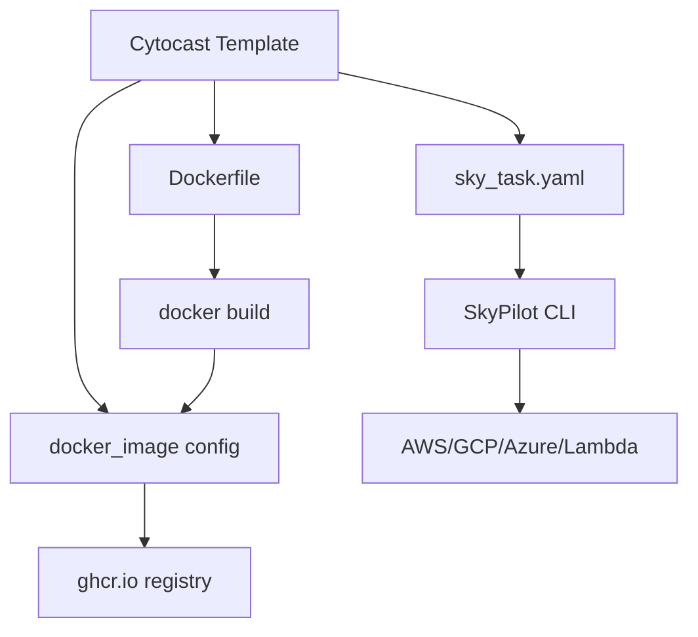

# Cloud & Deployment

> **Status**: Active
> **Date**: 2026-07-10
> **Author**: @shahin
> **Audience**: engineers
> **Tags**: `engineering`
> **Variants**: Technical (this doc) - Readable (Obsidian twin optional, same filename) - Agent (n/a)

Cytocast generates cloud deployment configurations for running ML workloads on remote infrastructure, including SkyPilot task definitions for multi-cloud GPU job orchestration and Docker image management for container registries.

## Architecture



## SkyPilot Task Definition (F80)

Every generated project includes `sky_task.yaml`, a declarative task file for [SkyPilot](https://skypilot.readthedocs.io/):

```yaml
name: my-project-training

resources:
  cloud: gcp
  instance_type: g5.xlarge  # Single GPU instance
  disk_size: 100

setup: |
  curl -LsSf https://astral.sh/uv/install.sh | sh
  export PATH="$HOME/.cargo/bin:$PATH"
  git clone . ~/my-project
  cd ~/my-project
  uv tool install nox
  nox -s init_project

run: |
  cd ~/my-project
  nox -s test
```

### Usage

```bash
# Launch a GPU job on the cheapest available cloud
sky launch sky_task.yaml

# Launch on a specific cloud
sky launch sky_task.yaml --cloud aws

# Launch with spot instances (up to 5x cheaper)
sky launch sky_task.yaml --use-spot
```

### Resource Override

The task file uses SkyPilot's template variables for flexible resource specification:

```bash
# Override instance type
sky launch sky_task.yaml --instance-type p4d.24xlarge

# Override disk size
sky launch sky_task.yaml --disk-size 500
```

## Docker Image Configuration (F82)

The `docker_image` parameter in `copier.yaml` sets the container registry path:

```bash
copier copy --trust gh:cytognosis/cytocast my-project \
  --data docker_image=ghcr.io/myorg/my-project
```

This value is used in the noxfile's `docker_build` and `docker_push` sessions:

```bash
# Build the image
nox -s docker_build  # → docker build -t ghcr.io/myorg/my-project .

# Push to registry
nox -s docker_push   # → docker push ghcr.io/myorg/my-project:latest
```

## Design Decisions

**Why SkyPilot over raw cloud CLIs?**
SkyPilot abstracts cloud provider differences, handles spot instance preemption, and automatically finds the cheapest GPU availability across all major clouds. This is critical for ML training workloads where GPU costs vary 3-10x across providers.

**Why GHCR as default registry?**
GitHub Container Registry (ghcr.io) is free for public packages, integrates with GitHub Actions for CI/CD, and supports OIDC-based trusted publishing (no static credentials needed).

[← Back to Feature Index](index.md)
