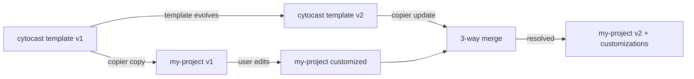

# Copier Workflow

> **Status**: Active
> **Date**: 2026-07-10
> **Author**: @shahin
> **Audience**: engineers
> **Tags**: `engineering`
> **Variants**: Technical (this doc) - Readable (Obsidian twin optional, same filename) - Agent (n/a)

Cytocast is built on [Copier](https://copier.readthedocs.io/), a project templating engine that supports native 3-way Git merges for template updates. This means you can keep your project synchronized with the latest Cytocast improvements without losing your customizations.

## Architecture



## copier copy: Creating Projects (F83)

```bash
# Generate a new project
copier copy --trust gh:cytognosis/cytocast my-project \
  --data profile=ml

# With explicit parameters
copier copy --trust gh:cytognosis/cytocast my-project \
  --data profile=ml \
  --data project_name="Cell Classifier" \
  --data compute_backend=cuda \
  --data use_pytorch=True

# Hybrid/full-stack example
copier copy --trust gh:cytognosis/cytocast my-project \
  --data profile=full-stack \
  --data js_framework_family=next

# LLM / agent service example
copier copy --trust gh:cytognosis/cytocast my-project \
  --data profile=ai-llm

# R-first analytics example
copier copy --trust gh:cytognosis/cytocast my-project \
  --data profile=r-analysis

# Use defaults (non-interactive)
copier copy --trust gh:cytognosis/cytocast my-project --defaults
```

### Available profile presets

| Preset | Emits (in addition to the base layout) |
|---|---|
| `custom` | No preset; all questions asked. |
| `ml` | `experiments/`, PyTorch/Lightning deps, ROCm env. |
| `data-science` | Notebooks, CPU `datascience` env, no experiments. |
| `full-stack` | `apps/web/` package.json + README, `js_framework_family` metadata. |
| `django-api` | Django REST API/service layout with Django agent defaults. |
| `fastapi-api` | FastAPI API/service layout with FastAPI agent defaults. |
| `django-estimation` | Django estimation service with workers/pricing/profiling defaults. |
| `fastapi-estimation` | FastAPI estimation service with workers/pricing/profiling defaults. |
| `library` | Lean package layout, docs + testing defaults. |
| `bio-modeling` | `schemas/` with LinkML stub, DVC, Cytognosis env. |
| `ai-llm` | `llm` env, `prompts/` folder, Pydantic AI, LangChain/LangGraph, LlamaIndex, prompt-engineer / rag-architect / mcp-developer skills. |
| `etl` | Data pipeline layout with ETL and data IO skill defaults. |
| `cytos` | Master Cytognosis substrate (data + models): `schemas/`, `configs/sources/`, `pipelines/`, `kg/`, `models/`, `checkpoints/`, `benchmarks/` layout; `cognosis` env on ROCm with PyTorch/Lightning/JAX; ontology-tools, bioinformatics, data-io, ml-pipeline defaults. |
| `r-analysis` | R package skeleton (`DESCRIPTION`, `NAMESPACE`, `R/`, `man/`), Pixi. |

Each preset is defined in `profiles/<id>.yaml` and validated against the
LinkML schema at `profiles/schema/profile_schema.linkml.yaml`. The
`agents.defaults` / `agents.optional` sections are matched against the
synced `profiles/contracts/agents_skills.yaml` catalog; unresolved entries
are preserved in `.agents/registry.yaml` but not vendored.

### Post-generation skill vendoring

After Copier runs the scaffolding hook, a second task invokes
`scripts/hooks/install_skills.py`, which reads `.agents/registry.yaml` and
copies each matched skill directory into `.agents/skills/<id>/`. The agents
repo is located via (in order):

1. `--agents-root` flag.
2. `CYTOGNOSIS_AGENTS_ROOT` environment variable.
3. Sibling checkout at `<project>/../agents` or `<project>/../../agents`.

If none resolve, `SKIP.md` stubs plus an `INDEX.md` are written so you can
retry with:

```bash
CYTOGNOSIS_AGENTS_ROOT=/path/to/agents \
  nox -s install_skills -- --target my-project
```

## copier update: Syncing with Template (F83)

When the Cytocast template releases a new version (new Nox sessions, updated CI workflows, improved configs), update your project:

```bash
cd my-project
copier update --trust
```

This performs a **3-way merge**:
1. Compares your current files against the **old template version**
2. Compares the old template version against the **new template version**
3. Merges the template changes into your files, preserving your customizations

If there are conflicts, they appear as standard Git merge conflicts that you resolve manually.

## _skip_if_exists: Protected Files (F84)

These files are only created on `copier copy` and never overwritten by `copier update`:

```yaml
# copier.yaml
_skip_if_exists:
  - LICENSE
  - README.md
  - docs/api.md
  - docs/index.md
  - docs/references.bib
  - docs/references.md
  - CHANGELOG.md
```

This protects user-authored content from being clobbered by template updates.

## _exclude: Conditional File Generation (F85)

Files are conditionally excluded based on user parameters:

```yaml
# copier.yaml
_exclude:
  - "pixi.toml"
  - ".readthedocs.yaml"
  - ".github/workflows/docs.yml"
```

| Parameter | Excluded File | Reason |
|:---|:---|:---|
| `dependency_manager=uv` | `pixi.toml` | Only pixi needs pixi.toml |
| `docs_hosting=gh-pages` | `.readthedocs.yaml` | Only RTD needs this config |
| `docs_hosting=readthedocs` | `docs.yml` workflow | Only GH Pages needs this workflow |

## _tasks: Post-Copy Hooks (F86)

After file generation, Copier runs the scaffold hook to create dynamic directories:

```yaml
# copier.yaml
_tasks:
  - "python3 scripts/hooks/setup_scaffold.py '{{ package_name }}' \
     '{{ project_directories }}' '{{ experiment_directories }}' \
     '{{ source_modules }}' '{{ use_experiments }}' '{{ dependency_manager }}'"
```

The hook creates:
1. Source modules under `src/<package>/` (from `source_modules`)
2. Top-level project directories (from `project_directories`)
3. Per-experiment directories (from `experiment_directories`, if `use_experiments=True`)

## .copier-answers.yml (F07)

Every generated project tracks its template version and parameter values:

```yaml
# .copier-answers.yml
_commit: v1.0.1
_src_path: gh:cytognosis/cytocast
project_name: cell-classifier
dependency_manager: uv
compute_backend: cuda
use_pytorch: true
use_lightning: true
use_docker: true
preferred_ide: vscode
# ... all parameters
```

This file is version-controlled and enables `copier update` to work correctly.

## Jinja2 Extensions

Cytocast uses the `jinja2_time.TimeExtension` for dynamic timestamps:

```yaml
_jinja_extensions:
  - jinja2_time.TimeExtension
```

This enables `` in templates for auto-dating LICENSE files.

## Vendored Contracts

Copier runs only against data committed inside `cytocast`. To keep `copier copy gh:cytognosis/cytocast ...` reproducible, the template vendors:

- Cytoskeleton environment compatibility under `profiles/contracts/cytoskeleton_environments.yaml`
- Agents skill metadata under `profiles/contracts/agents_skills.yaml`

Refresh those snapshots in development with:

```bash
nox -s sync_profile_contracts
```

## Minimum Copier Version

```yaml
_min_copier_version: "9.4.0"
```

Cytocast requires Copier 9.4+ for full 3-way merge support and `_exclude` with Jinja conditionals.

## Design Decisions

**Why Copier over Cookiecutter?**
Copier's 3-way merge is the decisive advantage. When Cytocast adds new features (e.g., new Nox sessions, updated CI workflows), every project can pull those changes via `copier update` without recreating from scratch. Cookiecutter offers no update mechanism.

**Why profiles?**
Profiles let Cytocast expose a small high-level selector first, then resolve the detailed defaults for environments, scaffolding, and agent configuration without removing expert override paths.

**Why `_tasks` instead of Jinja conditionals for directories?**
Jinja can only create files, not empty directories. The `setup_scaffold.py` hook creates the directory tree dynamically based on comma-separated parameters, which is more flexible than encoding every possible directory combination in the template tree.

[← Back to Feature Index](index.md)
