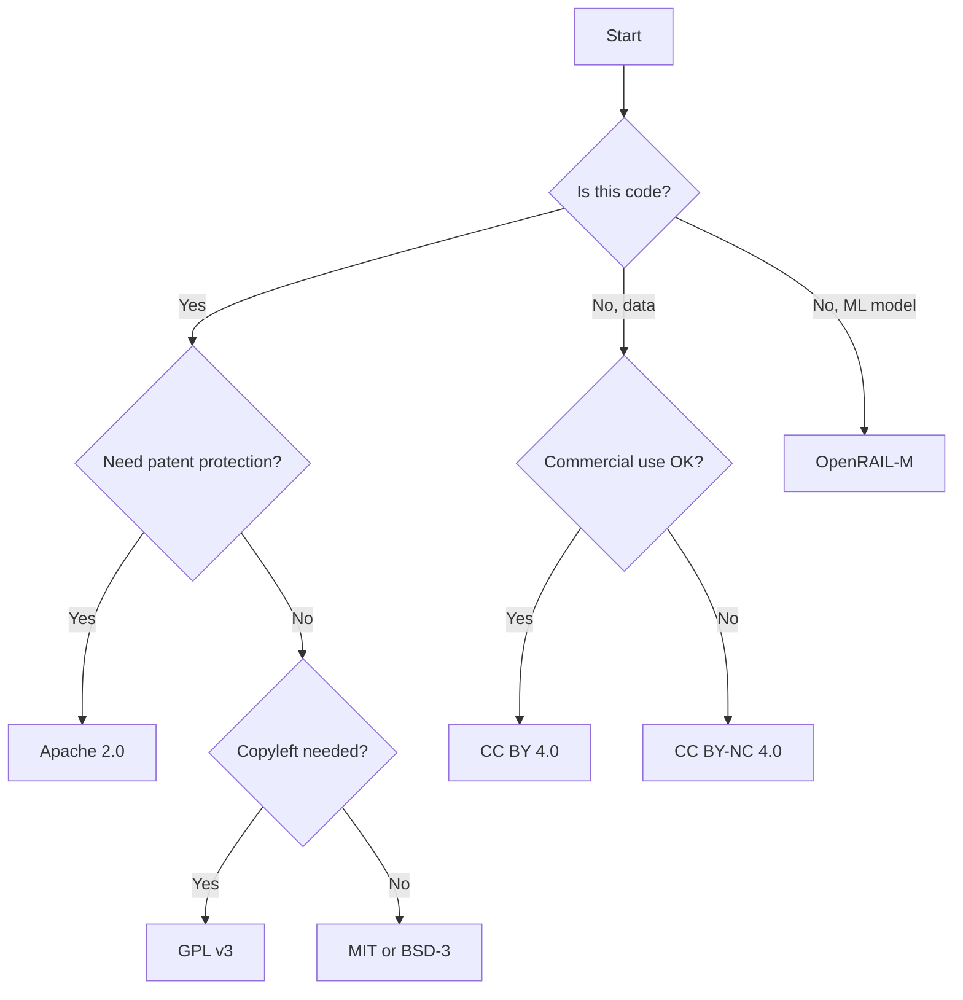

# Licensing

> **Status**: Active
> **Date**: 2026-07-10
> **Author**: @shahin
> **Audience**: engineers
> **Tags**: `engineering`
> **Variants**: Technical (this doc) - Readable (licensing.md in Obsidian vault: 04-Engineering/toolchain/cytocast/features/) - Agent (n/a)

Cytocast offers 16 license options spanning permissive open source, copyleft, Creative Commons, responsible AI (OpenRAIL), and proprietary licenses. Each selection automatically generates the correct LICENSE file and injects the proper classifier into `pyproject.toml`.

## License Options (F08)

| # | License | SPDX ID | Profile |
|:---|:---|:---|:---|
| 1 | Apache License Version 2.0 | `Apache-2.0` | Permissive, patent grant (default) |
| 2 | MIT License | `MIT` | Simplest permissive license |
| 3 | BSD 3-Clause License | `BSD-3-Clause` | Permissive, no endorsement clause |
| 4 | BSD 2-Clause License | `BSD-2-Clause` | Minimal permissive |
| 5 | GNU General Public License v3 | `GPL-3.0-only` | Strong copyleft |
| 6 | GNU Lesser GPL v3 | `LGPL-3.0-only` | Weak copyleft (libraries) |
| 7 | Mozilla Public License 2.0 | `MPL-2.0` | File-level copyleft |
| 8 | CC BY 4.0 | `CC-BY-4.0` | Content/data, attribution |
| 9 | CC BY-SA 4.0 | `CC-BY-SA-4.0` | Content/data, share-alike |
| 10 | CC BY-NC 4.0 | `CC-BY-NC-4.0` | Content/data, non-commercial |
| 11 | CC BY-NC-SA 4.0 | `CC-BY-NC-SA-4.0` | Content/data, non-commercial share-alike |
| 12 | CC0 1.0 (Public Domain) | `CC0-1.0` | Full public domain dedication |
| 13 | OpenRAIL-M (Models) | `OpenRAIL-M` | Responsible AI model licensing |
| 14 | OpenRAIL-D (Data) | `OpenRAIL-D` | Responsible AI data licensing |
| 15 | OpenRAIL-S (Source Code) | `OpenRAIL-S` | Responsible AI source licensing |
| 16 | Proprietary License | — | All rights reserved |
| 17 | No License | — | No license file generated |

## OpenRAIL Family

The **Open Responsible AI Licenses** (OpenRAIL) are a family of licenses designed for AI artifacts. They combine open access with behavioral use restrictions:

- **OpenRAIL-M**: For trained ML models. Allows redistribution and modification, with restrictions on harmful uses.
- **OpenRAIL-D**: For datasets. Permits data sharing with responsible use clauses.
- **OpenRAIL-S**: For source code. Similar to Apache 2.0 but with responsible AI provisions.

For a detailed explanation, see the OpenRAIL documentation (target archived/removed).

## License Classifier Injection (F09)

The selected license automatically populates the `pyproject.toml` classifier:

```toml
[project]
license = "Apache-2.0"
classifiers = [
    "License :: OSI Approved :: Apache Software License",
    # ... other classifiers
]
```

## Choosing a License



## Hands-on

```bash
# Generate with MIT license
copier copy --trust gh:cytognosis/cytocast my-project \
  --data 'license=MIT License'

# Generate with OpenRAIL-M for model projects
copier copy --trust gh:cytognosis/cytocast my-model \
  --data 'license=OpenRAIL-M License (Models)' \
  --data project_type=ml-model
```

[← Back to Feature Index](index.md)
