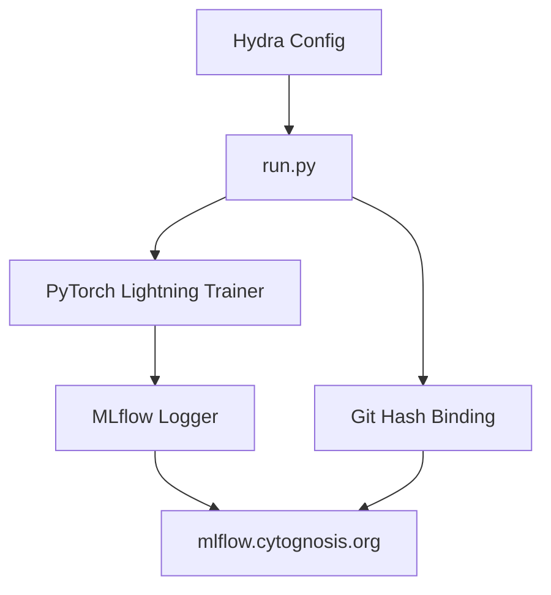

# ML Functionalities & Experiment Tracking

> **Status**: Active
> **Date**: 2026-07-10
> **Author**: @shahin
> **Audience**: engineers
> **Tags**: `engineering`
> **Variants**: Technical (this doc) - Readable (Obsidian twin optional, same filename) - Agent (n/a)

Cytocast integrates MLflow, PyTorch Lightning, and Hydra into a cohesive experiment tracking system. Every experiment run is bound to a Git commit hash, ensuring full provenance from code to results.

## Architecture



## Self-Hosted MLflow

Cytocast projects default to the Cytognosis Foundation's self-hosted MLflow instance:

```python
# Default tracking URI (set in experiment scaffolding)
MLFLOW_TRACKING_URI = "https://mlflow.cytognosis.org"
```

To use a local MLflow server instead:

```bash
# Start local MLflow UI
mlflow ui --port 5000

# Override the tracking URI
MLFLOW_TRACKING_URI=http://localhost:5000 nox -s test
```

## Experiment Scaffolding

When `use_experiments=True`, Cytocast generates:

```
experiments/
└── example_experiment/
    ├── configs/           # Hydra YAML configurations
    │   └── config.yaml
    ├── run.py             # Entry point with MLflow + Lightning
    ├── data/              # Dataset storage
    ├── models/            # Saved model checkpoints
    ├── results/           # Experiment outputs
    └── logs/              # Training logs
```

### run.py Entry Point

```python
import mlflow
import subprocess

# Bind every run to a Git commit hash
git_hash = subprocess.check_output(
    ["git", "rev-parse", "HEAD"]
).decode().strip()

mlflow.set_tracking_uri("https://mlflow.cytognosis.org")

with mlflow.start_run():
    mlflow.set_tag("git_hash", git_hash)
    mlflow.log_params(config)

    # PyTorch Lightning with MLflow Logger
    from lightning.pytorch.loggers import MLFlowLogger
    logger = MLFlowLogger(
        experiment_name="example_experiment",
        tracking_uri="https://mlflow.cytognosis.org",
    )
    trainer = Trainer(logger=logger)
    trainer.fit(model, datamodule)
```

## Hands-on: Running an Experiment

```bash
# 1. Generate a project with experiments
copier copy --trust gh:cytognosis/cytocast my-project \
  --data use_experiments=True \
  --data use_pytorch=True

# 2. Initialize the project
cd my-project && nox -s init_project

# 3. Run the example experiment
cd experiments/example_experiment
python run.py

# 4. View results in MLflow UI
# Navigate to https://mlflow.cytognosis.org
```

## Resource-Limited Training

Use the resource orchestrator to constrain GPU/CPU usage during experiments:

```bash
# Train on a single GPU with limited CPU cores
CYTO_LIMIT_GPUS=1 CYTO_LIMIT_CPUS=4 python run.py

# APU override for AMD integrated graphics
CYTO_APU_GFX_OVERRIDE=10.3.0 python run.py
```

## Compute Backend Selection

The `compute_backend` parameter configures PyTorch's index URL:

| Backend | Index URL | Profile |
|:---|:---|:---|
| `cuda` | `pytorch.org/whl/cu121` | NVIDIA GPUs |
| `rocm` | `pytorch.org/whl/rocm6.1` | AMD GPUs |
| `cpu` | `pytorch.org/whl/cpu` | CPU-only (default) |

```bash
# Generate with CUDA support
copier copy --trust gh:cytognosis/cytocast my-project \
  --data compute_backend=cuda \
  --data use_pytorch=True
```

## Optional Dependencies

MLOps tools are installed via the `mlops` optional dependency group:

```toml
[project.optional-dependencies]
mlops = [
    "mlflow>=2.0",
    "lightning>=2.0",
    "hydra-core>=1.3",
    "wandb",
]
```

```bash
# Install MLOps dependencies
uv sync --extra mlops
```

[← Back to the Comparative Study](comparative_study.md)
