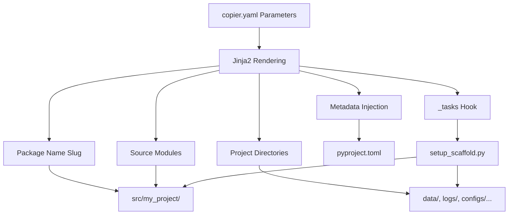

# Project Scaffolding

> **Status**: Active
> **Date**: 2026-07-10
> **Author**: @shahin
> **Audience**: engineers
> **Tags**: `engineering`
> **Variants**: Technical (this doc) - Readable (project-scaffolding.md in Obsidian vault: 04-Engineering/toolchain/cytocast/features/) - Agent (n/a)

Cytocast dynamically generates project structures based on user-provided parameters, creating consistent, well-organized codebases with configurable source modules, project directories, and metadata injection.

## Profiles

Generation now starts with a first-class `profile` selector. A profile is a governed preset stored as YAML under `profiles/` that pre-populates downstream Copier answers while still allowing explicit overrides.

Current presets:

- `full-stack`
- `ml`
- `data-science`
- `library`
- `bio-modeling`

Use `custom` to keep manual control over the low-level settings.

The `full-stack` preset also exposes `js_framework_family`, currently metadata-only, with supported values mirrored from Cytoskeleton's JS contract catalog.

## Architecture



## Dynamic Package Name Generation (F01)

Project names are automatically converted to valid Python package names:

| Input | Output |
|:---|:---|
| `My-Awesome AI Project` | `my_awesome_ai_project` |
| `Cell Classifier v2` | `cell_classifier_v2` |
| `cytognosis-project` | `cytognosis_project` |

The slug is generated via Jinja2: `{{ project_name|lower|replace(' ', '_')|replace('-', '_') }}`

## Project Type Selection (F02)

Choose from 7 project types, each optimizing the generated pyproject.toml classifiers:

| Type | Description | Classifier |
|:---|:---|:---|
| `research` | Research and exploration | `Development Status :: 3 - Alpha` |
| `clinical` | Clinical-grade software | `Intended Audience :: Healthcare Industry` |
| `infrastructure` | Internal tooling | `Intended Audience :: System Administrators` |
| `data-pipeline` | ETL/data processing | `Topic :: Scientific/Engineering` |
| `ml-model` | ML model packages | `Topic :: Scientific/Engineering :: Artificial Intelligence` |
| `web-service` | API/web applications | `Framework :: FastAPI` |
| `library` | Reusable library | `Intended Audience :: Developers` |

```bash
copier copy --trust gh:cytognosis/cytocast my-project \
  --data profile=ml \
  --data project_type=clinical
```

## Language Selection (F03)

| Language | Effect |
|:---|:---|
| `python` | Standard Python project (default) |
| `r` | R project with renv support |
| `hybrid` | Python + R interop, pixi recommended |

## Source Module Scaffolding (F05)

The `source_modules` parameter creates subdirectories inside `src/<package>/`:

```bash
# Default modules
source_modules: "data,features,models,modules,executors,app,utils"

# Generates:
src/my_project/
├── __init__.py
├── data/
├── features/
├── models/
├── modules/
├── executors/
├── app/
└── utils/
```

Custom modules:

```bash
copier copy --trust gh:cytognosis/cytocast my-project \
  --data profile=data-science \
  --data 'source_modules=preprocessing,training,inference,visualization'
```

Hybrid/full-stack example:

```bash
copier copy --trust gh:cytognosis/cytocast my-project \
  --data profile=full-stack \
  --data js_framework_family=next
```

## Project Directory Scaffolding (F06)

The `project_directories` parameter creates top-level directories:

```bash
# Default directories
project_directories: "data,logs,configs,scripts,models,results"

# Generates:
my-project/
├── data/
├── logs/
├── configs/
├── scripts/
├── models/
├── results/
├── src/
└── tests/
```

## Experiment Directory Scaffolding

When `use_experiments=True`, the `experiment_directories` parameter controls per-experiment layout:

```bash
experiment_directories: "logs,configs,scripts,models,results,data"

# Generates:
experiments/
└── example_experiment/
    ├── configs/
    ├── data/
    ├── logs/
    ├── models/
    ├── results/
    ├── scripts/
    └── run.py
```

## Post-Copy Scaffold Hook

The `setup_scaffold.py` task runs automatically after `copier copy`, creating all dynamically-specified directories:

```python
# scripts/hooks/setup_scaffold.py
# Called via _tasks in copier.yaml:
# python3 scripts/hooks/setup_scaffold.py \
#   '{{ package_name }}' '{{ project_directories }}' \
#   '{{ experiment_directories }}' '{{ source_modules }}' \
#   '{{ use_experiments }}' '{{ dependency_manager }}'
```

## Version Tracking (F07)

Every generated project includes `.copier-answers.yml` that records all parameter values, enabling `copier update` to apply template changes while preserving your customizations.

```yaml
# .copier-answers.yml (auto-generated)
_commit: v1.0.0
_src_path: gh:cytognosis/cytocast
profile: ml
project_name: my-project
dependency_manager: uv
compute_backend: rocm
# ... all other parameters
```

[← Back to Feature Index](index.md)
