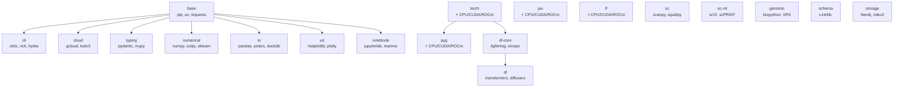
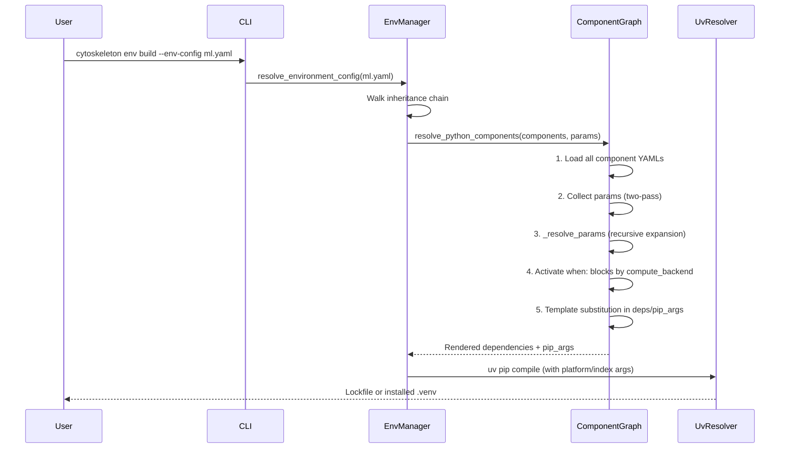

# Architecture

> **Status**: Active
> **Date**: 2026-07-10
> **Author**: @shahin
> **Audience**: engineers
> **Tags**: `engineering`
> **Variants**: Technical (this doc) - Readable (architecture.md in Obsidian vault: 04-Engineering/toolchain/cytoskeleton/) - Agent (n/a)

## Design Principles

1. **Declarative composition**: Environments are built from reusable YAML components
2. **Backend-conditional resolution**: `when:` blocks select dependencies based on hardware
3. **Hierarchical organization**: Components are organized by domain (core, datascience, ml, bio, interactome, scholarly)
4. **Recursive parameter resolution**: Template variables can reference other variables
5. **Lockfile-first**: Pre-resolved locks for reproducibility; fresh resolution for flexibility

## Component Graph

The component graph is a DAG where each component can:

- **Extend** other components (inheritance)
- **Contribute** dependencies, pip_args, and parameters
- **Conditionally activate** `when:` blocks based on tags (cpu/cuda/rocm)



## Resolution Flow



### Recursive Parameter Resolution

Parameters can reference other parameters:

```yaml
parameters:
  rocm_version: "7.2.0"
  rocm_short_version: "7.2"
  rocm_amd_index: "https://repo.radeon.com/rocm/manylinux/rocm-rel-{rocm_short_version}/"
```

The `_resolve_params()` function in `component_graph.py` recursively expands `{rocm_short_version}` inside `{rocm_amd_index}` before any dependency template substitution occurs.

### Two-Pass Parameter Collection

Parameters are collected from ALL components before template substitution. This ensures that a parameter defined in `torch.yaml` (like `cuda_version_nodot`) is available when rendering `pyg.yaml`'s pip_args.

## Environment Inheritance

```yaml
# configs/environments/bio-ml.yaml
name: bio-ml
inherits:
  - ml    # brings in torch, jax, dl, tracking, etc.
  - bio   # brings in scanpy, genomepy, etc.
parameters:
  compute_backend: cpu
components:
  - sc-ml
  - genomic-ml
```

The `resolve_environment_config()` function walks the inheritance DAG with cycle detection and merges parameters/components.

## Backend Resolution

The `compute_backend` parameter selects which `when:` block is active in each component:

| Backend | Platform Tag | Index URLs | Notes |
|---------|-------------|------------|-------|
| **cpu** | `linux` | PyTorch CPU index | Default |
| **cuda** | `linux` | `download.pytorch.org/whl/cu128` | CUDA 12.8 |
| **rocm** | `manylinux_2_35_x86_64` | `download.pytorch.org/whl/rocm7.2` + `repo.radeon.com` | ROCm 7.2, Strix Halo |

## Lock Integrity

Lock files are stored in `locked/` with a `LOCK_MANIFEST.json` that records:

- Resolution status for all 66 environment × Python × backend combinations
- Package counts per cell
- Timestamp and Python versions used
- The `publish_locks.py` tool adds SHA-256 hashes for integrity verification
