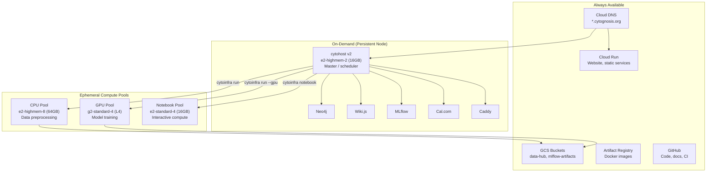
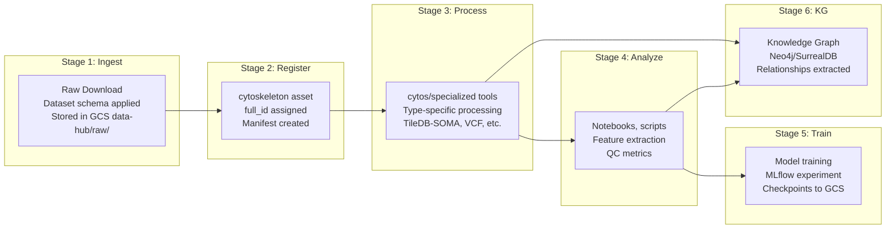

# Cytognosis Platform: Unified Design & Requirements

> **Status**: Active
> **Date**: 2026-07-10
> **Author**: @shahin
> **Audience**: engineers
> **Tags**: `engineering`
> **Variants**: Technical (this doc) - Readable (platform-design.md in Obsidian vault: 04-Engineering/toolchain/cytoskeleton/) - Agent (n/a)

> Comprehensive architecture for infrastructure, compute orchestration,
> specialized storage, and data lifecycle management.

---

## Table of Contents

1. [Design Principles](#1-design-principles)
2. [Current State Audit](#2-current-state-audit)
3. [Infrastructure Architecture](#3-infrastructure-architecture)
4. [Compute Orchestration (cytoinfra run)](#4-compute-orchestration)
5. [Specialized Storage Systems](#5-specialized-storage-systems)
6. [Data Provenance Lifecycle](#6-data-provenance-lifecycle)
7. [Tool Evaluations](#7-tool-evaluations)
8. [Implementation Plan](#8-implementation-plan)
9. [Verification Metrics](#9-verification-metrics)

---

## 1. Design Principles

### Single Source of Truth

Every asset type has ONE canonical storage. All other views are derived or synced:

| Asset Type | Canonical Storage | Derived Views |
|-----------|------------------|---------------|
| **Code** | GitHub repos | Local clones, zoekt index, GitNexus digest |
| **Papers** | GCS bucket + metadata DB | Zotero/alternative UI, agent embeddings |
| **Models** | MLflow registry + GCS | HuggingFace mirrors, model cards |
| **Documents** | GitHub repo (markdown) | Wiki.js UI, Obsidian vault |
| **Datasets** | Asset manifest (cytoskeleton) | Processed data in TileDB/GCS/etc |
| **KGs** | Neo4j/SurrealDB | GCS dumps, local instances |
| **Skills** | `~/.cytognosis/assets/skills/` | Agent symlinks (Claude, Gemini, Kiro) |
| **Containers** | Artifact Registry | Local images, compose files |
| **Environments** | `env.yaml` manifests | Conda/pip/uv envs |

### Asset-as-Record

Every tracked item is an **asset** in cytoskeleton's index with:
- Unique `full_id`: `<package>/<type>/<name>@<version>`
- Manifest YAML with schema-validated metadata
- Provenance chain linking to upstream/downstream assets
- Storage backend reference (GCS URI, DB connection, file path)

### Dockerized Everything

All services run as Docker containers. `cytoinfra` manages them uniformly whether deployed on:
- Cytohost (persistent VM)
- Cloud Run (stateless services)
- Cloud Batch (ephemeral compute jobs)
- Local dev machine

### Compute Abstraction

Users never think about VMs. They express intent:
```bash
cytoinfra run --pool cpu-highmem "cytos preprocess ds005237"
cytoinfra notebook --pool gpu-training --gpu L4
cytoinfra service up wiki-js
```

The system allocates appropriate compute, tracks provenance, and tears down when done.

---

## 2. Current State Audit

### 2.1 Cytoskeleton Asset System

**7 Asset Types** defined in `core.yaml` (LinkML schema at `w3id.org/cytognosis/cytoskeleton/core`):

| Asset Kind | Description | Status |
|-----------|-------------|--------|
| `Component` | Named set of dependencies (pixi component YAML) | ✅ Implemented |
| `Environment` | Composition of components into runnable env | ✅ Implemented |
| `Docker` | Docker image asset description | ✅ Implemented |
| `ExecutionEnvironment` | Locked Environment + Docker image (WRROC SoftwareApplication) | ✅ Implemented |
| `Schema` | LinkML, JSON Schema, or OWL schema file | ✅ Implemented |
| `Skill` | AI agent skill package (SKILL.md + resources) | ✅ Implemented |
| `StoreManifest` | Root store.yaml describing a Cytoskeleton store | ✅ Implemented |

> [!WARNING]
> **Missing asset types for new requirements**: No `Code`, `Model`, `Paper`, or `Dataset` in cytoskeleton's
> core schema, despite the URI scheme (`cytognosis://`) supporting 10 entity types including `data`, `model`,
> `paper`, `code`. These are defined in Cytos separately but not unified.

**Lifecycle stages**: `draft → described → built → tested → published → archived`

**Index system**: Dual-scope (Global `~/.cytognosis/index.yaml` + Local `./.cytognosis-index.yaml`)
- Full ID format: `<package>/<type>/<name>@<version>`
- Resolver: LOCAL → GLOBAL priority, `list_remote()` scans manifest YAMLs from known repos

**VFS (7 backends)**: LocalVFS, GCSVFS, LocalGitVFS, GitHubVFS, S3VFS, HFHubDriver, ZenodoDriver
- Every `put()` carries `ProvenanceRecord` (author, message, git_sha, parent_uris, schema_version)
- `AssetStat` includes `swhid` (Software Heritage ID, ISO 18670:2025) + `prov_uri`

**Registry/Catalog**: `AssetCatalog` with `push()`, `pull()`, `search()`, `list()`. Uses `BackendRouter` to route entity types to VFS backends. Persisted as JSON.

**RO-Crate**: Store manifests auto-generate W3C RO-Crate 1.2 metadata.

### 2.2 Cytos Data System

**3 Registries** (parallel YAML-manifest pattern, CRUD, search, validate):

| Registry | Key Fields | Remote Bucket |
|----------|-----------|---------------|
| **DatasetRegistry** | name, version, source_url, format (h5ad/parquet/csv/zarr/nifti/bids), modality (transcriptomics/proteomics/imaging/genomics/neuroimaging/multi-omics), organism, tissue, cell_count, checksum, provenance | `gs://cytognosis-data-hub/assets/datasets/` |
| **OntologyRegistry** | name, version, prefix (CL/GO/UBERON), format (owl/obo/json-ld/skos/linkml), term_count, cross_references | `gs://cytognosis-data-hub/assets/ontologies/` |
| **SchemaRegistry** | name, version, format (linkml/json-schema/avro/protobuf), namespace, classes, imports | `gs://cytognosis-data-hub/assets/schemas/` |

**36 domain LinkML schemas** in `schemas/domains/`: anatomy, annotation, agent, behavior, biothings, cellline, clinical, dataset, device, disease, drug, environment, evidence, exposure, expression, ga4gh, gene, genomics, geography, hra, information, measurement, nwb, pathway, person, phenotype, population, publication, relationships, scholarly, semantic_network, sensor, taxonomy, topic, variant

**KG**: 10.7M nodes × 118.5M edges, 52 node labels, 200+ edge types. Builder is 44K bytes (DuckDB-based). Sources: UMLS, SNOMED, 37 OBO ontologies, UniProt, Monarch, PrimeKG, Open Targets, HRA, PKG2.0

**Genomics module**: 23 submodules (VCF, GWAS, eQTL, LD, pangenome, PRS, graphLD)

**Scholarly module**: 30 submodules (PDF parsing, NER, author ID, citation graph)

### 2.3 Cytoinfra

**Container Registry**: 8 containers in [manifest.yaml](file:///home/mohammadi/repos/cytognosis/infrastructure/assets/containers/manifest.yaml):

| Container | Image | Min RAM |
|-----------|-------|---------|
| neo4j | neo4j:5.18.1-community | 8 GB |
| surrealdb | surrealdb/surrealdb:v2 | 1 GB |
| mlflow | ghcr.io/mlflow/mlflow:v2.21.0 | 1 GB |
| caddy | caddy:2-alpine | 128 MB |
| hedgedoc | quay.io/hedgedoc/hedgedoc:latest | 512 MB |
| grobid | grobid/grobid:0.8.1 | 4 GB |
| cytognosis-compute | cyto-compute:0.6.0 | 2 GB |
| cytognosis-gpu | cyto-gpu:0.6.0 | 16 GB |

**14 service definitions**: caddy, calcom, excalidraw, hedgedoc, jupyter, logseq, mermaid, mlflow, neo4j, seek, solr, surrealdb, zoekt, zotero

**4 stacks**:

| Stack | Target | Services |
|-------|--------|----------|
| **core** | t2a-standard-2 (ARM64) | caddy, calcom, excalidraw, mermaid, logseq, mlflow |
| **research** | e2-standard-4 | neo4j, jupyter, mlflow |
| **data-services** | — | zoekt, seek, solr |
| **neo4j-only** | local | neo4j |

**Stack Manager**: 649 LOC, Docker + Podman support, pushes to GCP Artifact Registry.

**CLI**: `cytoinfra container {list,add,build,push,pull}`, `cytoinfra service {deploy,status,stop}`, `cytoinfra hedgedoc setup`

> [!IMPORTANT]
> **No job scheduling, no compute pool management, no `cytoinfra run`.** Current cytoinfra
> is limited to container/service lifecycle. The compute orchestration layer is entirely new.

### 2.4 External Repos (`/home/mohammadi/repos/external/`)

**Total**: ~300+ repos, **179 GB** on disk, **28 organizations**, 6 domain categories

| Category | Path | Repos | Examples |
|----------|------|-------|----------|
| **bio** | `bio/` | ~50 | `perturbation/` (18 repos: CPA, GEARS, CellFlow, pertpy...), `scFMs/` (6: scvi-tools, scPRINT-2, transcriptformer...), `core_biostats/` (6: PyDESeq2, glmpca...) |
| **genomics** | `genomics/` | ~10 | `models/` (alphagenome, variantformer, gemma), `tools/` (graphld, megadepth), `datasets/` (gencode) |
| **ml** | `ml/` | ~15 | `flows/` (6: conditional-flow-matching, zuko...), `contrastive/` (4), `generative/` (2), `interactome/` (KGs, ontologies, pyg), `meta/` (learn2learn) |
| **neuro** | `neuro/` | 7 | BrainDyn, neuromaps, netneurotools, hansen_receptors, PET2BIDS, petprep |
| **orgs** | `orgs/` | ~250 | 28 organizations with 2-32 repos each (see below) |
| **sorted_old** | `sorted_old/` | ~5 | BiomedicalKGs, AI_scientist |

**Organizations tracked** (by repo count):
- **allenai** (32): OLMo, dolma, codescientist, molmo2, autodiscovery...
- **theislab** (17): scverse ecosystem, perturbation tools
- **scverse** (16): scanpy, anndata, muon, squidpy
- **GA4GH** (15): standards, VRS, schemas
- **biohub** (14): CZI Biohub tools
- **LinkML** (14): schema language, tools
- **mims-harvard** (13): Harvard ML/bio tools
- **snap-stanford** (11), **laminlabs** (11), **TileDB** (11), **Genentech** (11), **obophenotype** (11)
- **langchain-ai** (12), **Monarch** (12)
- **Others**: NCATSTranslator (10), biocontext-ai (9), biopragmatics (9), cantinilab (9), solid (9), KGHub (8), OpenAlex (8), BioLink (7), grobidOrg (6), opentargets (6), anyproto (5), BioCypher_ecosystem (4), awslabs (2), FutureHuman (2)

> [!WARNING]
> No manifests, no tags, no metadata, no grouping by project/team. Pure filesystem hierarchy
> is the only organization. 179 GB of cloned repos with no provenance tracking.

### 2.5 Deployed Skills

**65 skills across 12 categories** in cytoskills pnpm monorepo:

| Category | Count | Key Skills |
|----------|-------|------------|
| **cytognosis** | 8 | branding, design-system, dev, doc, orchestrator, org, template, writer |
| **science** | 5 | bioinformatics, fhir, graph, healthcare-ai, visualization |
| **engineering** | 6 | debugging, devops, documentation, requirements, resource-detection, testing |
| **ai-ml** | 4 | data-io, deep-learning, machine-learning, orchestration |
| **meta** | 8 | agent-md-refactor, command-creator, cytognosis-agents, plugin-forge, skill-creator |
| **documents** | 6 | diagramming, docx, markdown-conversion, pdf, pptx, xlsx |
| **research** | 4 | communication, literature, thinking, writing |
| **operations** | 6 | branding, communication, download-manager, legal, marketing, regulatory |
| **languages** | 8 | cpp, golang, java, javascript, php, python, rust, typescript |
| **frontend** | 8 | component-scaffolding, css-coder, css-tokens, semantic-html, webdev |
| **infrastructure** | 1 | cytoskeleton |
| **community** | 1 | jeffallan |

> [!NOTE]
> Cytoskills is TypeScript + Python hybrid (pnpm monorepo with biome/vitest tooling).
> Distinct from the Python ecosystem in cytoskeleton/cytos/cytoinfra.

### 2.6 Critical Architecture Gaps

| Gap | Description | Impact |
|-----|------------|--------|
| **No Code/Model/Paper asset types** | URI scheme supports `code`, `model`, `paper` but no registries exist | Cannot track external repos, papers, or HF models as assets |
| **Three parallel registry patterns** | Cytoskeleton AssetCatalog, Cytos DatasetRegistry, Cytoinfra ContainerRegistry | Inconsistent manifest formats, no unified interface |
| **No compute orchestration** | cytoinfra has no `run`, `job submit`, or pool management | Cannot schedule workloads on Cloud Batch or ephemeral VMs |
| **No external repo management** | 300+ repos, 179 GB, zero metadata | Lost knowledge, no searchability, no team/project grouping |
| **Two-VM bug** | Core stack on ARM64 t2a-standard-2 + research on separate x86 VM | Wasted resources, QEMU emulation overhead |

---

## 3. Infrastructure Architecture

### 3.1 Node Topology



### 3.2 Service Deployment Matrix

| Service | Deployment Target | Lifecycle | Fixed URL |
|---------|------------------|-----------|-----------|
| Neo4j | Cytohost | On-demand (with cytohost) | `kg.cytognosis.org` |
| Wiki.js | Cytohost | On-demand (with cytohost) | `docs.cytognosis.org` |
| MLflow | Cytohost | On-demand (with cytohost) | `mlflow.cytognosis.org` |
| Cal.com | Cytohost or Cloud Run | On-demand | `cal.cytognosis.org` |
| Jupyter | Notebook Pool VM | On-demand (state-persistent) | `notebook.cytognosis.org` |
| Mermaid | Cytohost | On-demand (with cytohost) | `mermaid.cytognosis.org` |
| Excalidraw | Cytohost | On-demand (with cytohost) | `whiteboard.cytognosis.org` |
| Logseq | Cytohost | On-demand (with cytohost) | `notes.cytognosis.org` |
| Zoekt | Cytohost | On-demand (with cytohost) | `code.cytognosis.org` |
| Website | Cloud Run | Always-on | `cytognosis.org` |

### 3.3 Cytohost v2 Specification

| Component | Specification |
|-----------|--------------|
| **Machine type** | e2-highmem-2 (2 vCPU, 16 GB RAM) |
| **OS** | Ubuntu 24.04 LTS (x86_64) |
| **Boot disk** | Balanced PD, 50 GB |
| **Data disk** | Balanced PD, 200 GB (survives VM stop) |
| **Static IP** | Reserved, always attached |
| **DNS** | Cloud DNS A records for *.cytognosis.org |
| **Docker** | Docker Engine + Compose v2 |
| **Lifecycle** | Idle-stop (30 min no activity), wake on HTTP/SSH |
| **SSH** | IAP tunnel (no public SSH port) |
| **Role** | Master node: service host + job scheduler + registry |

---

## 4. Compute Orchestration (cytoinfra run)

### 4.1 Requirements

| ID | Requirement | Priority |
|----|-------------|----------|
| CO-1 | Python-native CLI: `cytoinfra run`, `cytoinfra job submit` | Critical |
| CO-2 | Full provenance tracking (every run produces a lineage record) | Critical |
| CO-3 | Heterogeneous compute pools (CPU, GPU, different sizes) | Critical |
| CO-4 | Spot VM support with checkpoint/resume | Critical |
| CO-5 | Job dependency graphs (DAGs) | High |
| CO-6 | Cost tracking per job | High |
| CO-7 | Interactive sessions (notebook, SSH) with state persistence | High |
| CO-8 | No Kubernetes dependency | High |
| CO-9 | GPU-aware scheduling (L4, A100, etc.) | High |
| CO-10 | Automatic scale-down when job completes | Critical |
| CO-11 | Integration with MLflow for experiment tracking | High |
| CO-12 | Direct-to-GCS data streaming (skip local disk) | Medium |

### 4.2 Compute Pools

| Pool ID | Machine Type | Use Case | Lifecycle | Spot? |
|---------|-------------|----------|-----------|-------|
| `persistent` | e2-highmem-2 | Cytohost services | On-demand, idle-stop | No |
| `cpu-standard` | e2-standard-4 | Light processing, CI | Batch: auto-terminate | Yes |
| `cpu-highmem` | e2-highmem-8 | Data preprocessing, single-cell | Batch: auto-terminate | Yes |
| `gpu-training` | g2-standard-4 (L4) | Model training | Batch: checkpoint + auto-terminate | Yes |
| `gpu-inference` | g2-standard-4 (L4) | Inference, evaluation | On-demand | Optional |
| `notebook` | e2-standard-4 to custom | Interactive compute | State-persistent, idle-hibernate | No |

### 4.3 State-Persistent Interactive Compute

> [!IMPORTANT]
> Key requirement: when a user's interactive session (notebook, SSH) goes idle,
> the system must **hibernate** the full memory state and **restore** it seamlessly
> when the user reconnects. No loss of variables, open files, or running kernels.

**Implementation options** (research complete):

| Approach | How | Pros | Cons | Recommendation |
|----------|-----|------|------|----------------|
| **GCP VM Suspend/Resume** | Native GCE suspend (ACPI S3, RAM → PD) | Zero-effort, full state, **no vCPU/RAM charges while suspended** | Max 208 GB RAM, **GPUs NOT supported**, max 60 days suspended | ✅ **Primary for CPU sessions** |
| **CRIU + CRIUgpu** | Linux process checkpoint + NVIDIA CUDA Checkpoint API | Container-level, **GPU state preserved** (VRAM → host memory) | Complex setup, no cross-GPU-arch restore (A100↛H100) | ✅ **Primary for GPU sessions** |
| **Jupyter `dill.dump_session()`** | Serialize Python namespace to pickle | Application-level, portable | Fails with file handles, DB connections, generators | ⚠️ Fallback only |
| **Docker checkpoint** | `docker checkpoint create/start` (CRIU-based) | Container-level, composable | Experimental in Docker; Podman has mature CRIU support | ⚠️ Use Podman instead |

**Recommended strategy by pool type:**

| Pool | Hibernate Method | Resume Time | Cost While Hibernated |
|------|-----------------|-------------|----------------------|
| `notebook` (CPU) | GCP VM Suspend/Resume | ~30-60s | Storage only (~$0.10/day) |
| `notebook` (GPU) | CRIU + CRIUgpu container checkpoint | ~60-120s | Storage only |
| `gpu-training` | Application checkpoint (PyTorch Lightning) + VM terminate | ~3-5 min (cold start) | $0 (VM deleted) |

### 4.4 Job Scheduler Engine

**10 tools evaluated** across 12 criteria. Key findings:

#### Disqualified (Kubernetes-dependent)

| Tool | Why Disqualified |
|------|------------------|
| **Flyte** (Union.ai) | Requires GKE cluster + Helm charts. ML-focused but K8s-native. |
| **Ray** (Anyscale) | KubeRay on GKE for production. Compute framework, not orchestrator. |
| **Argo Workflows** | 100% K8s CRDs. CNCF-graduated but wrong fit. |

#### Disqualified (Wrong domain or language)

| Tool | Why Disqualified |
|------|------------------|
| **Nextflow** | Groovy DSL, not Python-native. Strong bio-specific but wrong language. |
| **Snakemake** | Python-ish but weaker cloud support than Nextflow. HPC-focused. |
| **Hatchet** | Web-scale job queuing (v1 just shipped). Wrong problem domain. |

#### Viable Candidates

| Feature | redun | Prefect | Dagster | GCP Cloud Batch |
|---------|-------|---------|---------|----------------|
| **Python-native** | ✅ Pure Python | ✅ Decorators | ✅ Asset-centric | ✅ API |
| **No K8s required** | ✅ | ✅ | ✅ | ✅ |
| **GCP Cloud Batch** | ❌ (AWS only) | ❌ (Cloud Run) | ❌ | ✅ (IS Cloud Batch) |
| **GCP Compute Engine** | ❌ | Partial | Partial | ✅ |
| **Provenance/lineage** | ✅✅✅ Best-in-class | ❌ Manual | ✅✅ Asset lineage | ❌ None |
| **GPU-aware scheduling** | ❌ | Manual | ❌ | ✅ (up to 8 GPUs, DWS) |
| **Spot + checkpoint** | ❌ | ✅ Retries | ❌ | ✅ `maxRetryCount` |
| **Job DAGs** | ✅ | ✅ | ✅ | ❌ |
| **Interactive compute** | ❌ | ❌ | ❌ | ❌ |
| **Self-hosted free** | ✅ Apache 2.0 | ✅ | ✅ | ✅ (GCP costs only) |

#### Recommended: Layered Architecture

No single tool satisfies all requirements. The optimal design is a **three-layer stack**:

```
┌─────────────────────────────────────────────────────┐
│  Layer 1: ORCHESTRATION — Prefect (self-hosted)      │
│  • @flow / @task decorators                          │
│  • Dynamic DAGs, retries, scheduling                 │
│  • cytoinfra run → Prefect flow submission            │
│  • Free, no vendor lock-in                           │
├─────────────────────────────────────────────────────┤
│  Layer 2: COMPUTE — GCP Cloud Batch + Compute Engine │
│  • Custom Prefect Infrastructure Block → Cloud Batch  │
│  • GPU support (L4, A100), Spot VMs, auto-terminate   │
│  • DWS for GPU capacity scheduling                    │
│  • Compute Engine for persistent/interactive           │
├─────────────────────────────────────────────────────┤
│  Layer 3: PROVENANCE — redun (as library, not scheduler)│
│  • Merkle tree hashing of code + data                 │
│  • Integrated into Prefect tasks as provenance hooks   │
│  • Call Graph DB for full lineage audit                │
│  • Alternative: build lightweight provenance directly  │
└─────────────────────────────────────────────────────┘
```

**Cost**: Prefect self-hosted = free. Cloud Batch = no service fee (GCP compute only). redun = free (Apache 2.0).

---

## 5. Specialized Storage Systems

### 5.1 Code Repository Management

#### Requirements

| ID | Requirement | Priority |
|----|-------------|----------|
| CR-1 | Ingest external repos (clone, index) | Critical |
| CR-2 | Tag/group repos by team, project, use case | Critical |
| CR-3 | Track related repos from same org | High |
| CR-4 | Bookmark repos for future evaluation | High |
| CR-5 | Cross-repo agentic search (AI can query) | Critical |
| CR-6 | Batch clone by tag/group to local machine | High |
| CR-7 | Code "asset" in cytoskeleton registry | High |
| CR-8 | Parse/digest repos for AI consumption (GitNexus-like) | Medium |

#### Current State

See §2.4 — 300+ repos, 179 GB, 28 orgs, zero metadata.

#### Tool Evaluation (Research Complete)

| Tool | Type | Self-Hosted | Key Features | Cost |
|------|------|-------------|-------------|------|
| **Gitea/Forgejo** | Git hosting | ✅ Docker | Org/team mgmt, repo mirroring, labels, topics, wiki, CI, migration tools | Free OSS |
| **Sourcegraph** | Code search | ✅ K8s/Docker | Cross-repo search, AI assistant (Cody), code nav | $50-75K+/yr ❌ |
| **Zoekt** | Search engine | ✅ Standalone | Trigram-indexed regex, sub-second, multi-repo | Free OSS |
| **GitNexus** | Code intelligence | ✅ Docker/CLI | Knowledge graph, MCP server (16+ tools), blast radius, auto-wiki | Free tier |
| **Mani** | CLI multi-repo | Local | Central config, bulk ops, tag/group repos, parallel commands | Free OSS |

**Recommendation**: **Gitea + Zoekt + Mani + GitNexus MCP**

1. **Gitea** as the central code asset registry — mirror all external repos, organize with Orgs/Teams/Topics
2. **Zoekt** for sub-second cross-repo regex search (what Sourcegraph uses internally, free)
3. **Mani** for CLI batch operations — `mani.yaml` manifest with repos grouped by team/project
4. **GitNexus** as MCP server for AI agent code intelligence

> [!TIP]
> Sourcegraph removed its OSS version and deprecated single-container deployment in 2026.
> Zoekt provides the core search capability for free. Gitea fills the organization gap.

### 5.2 Paper/Literature Management

#### Requirements

| ID | Requirement | Priority |
|----|-------------|----------|
| PM-1 | Collaborative library (multi-user) | Critical |
| PM-2 | PDF storage with highlighting/annotation | Critical |
| PM-3 | Google Docs citation integration | High |
| PM-4 | AI-searchable (semantic search over papers) | High |
| PM-5 | GCS-backed storage (single source of truth) | High |
| PM-6 | Group/tag by project, topic, team | High |
| PM-7 | BibTeX/citation export | Medium |
| PM-8 | Full-text indexing | Medium |

#### Tool Evaluation (Research Complete)

| Tool | Self-Hosted | Collaborative | PDF Annotation | Citation Gen | API | Storage Control |
|------|------------|---------------|---------------|-------------|-----|----------------|
| **Zotero** | Partial (client + WebDAV) | ✅ Group Libraries | ✅ | ✅ Excellent | ✅ Web API v3, pyzotero | WebDAV for files |
| **Paperpile** | ❌ (Google Drive) | ✅ | ✅ | ✅ Excellent (native Docs) | Limited | Google Drive |
| **PdfDing** | ✅ Docker | ✅ | ✅ Browser-based | ❌ | ✅ API | Full control |
| **Paperless-ngx** | ✅ Docker | ❌ | ❌ | ❌ | ✅ REST | Full control |

**Recommendation**: **Zotero + WebDAV (Nextcloud or GCS-mounted) + pyzotero for AI**

1. **Zotero** as reference manager — Group Libraries for collaborative org, tags/collections by project
2. **Nextcloud WebDAV** (or GCS via rclone) for PDF storage — single source of truth
3. **pyzotero** + embeddings for AI agent semantic search over papers
4. **Paperpile** optional for Google Docs-heavy users (native Docs citation plugin)

> [!NOTE]
> Zotero's citation ecosystem (browser connector, Word/Docs plugins, Better BibTeX) is irreplaceable.
> Self-hosted alternatives (PdfDing, Paperless-ngx) lack citation generation.

### 5.3 Model Registry/Zoo

#### Requirements

| ID | Requirement | Priority |
|----|-------------|----------|
| MR-1 | Track internally trained models | Critical |
| MR-2 | Bookmark/track external models (HuggingFace) | High |
| MR-3 | Group/tag by team, project, use case | High |
| MR-4 | Link to training runs (MLflow) | Critical |
| MR-5 | Version models with provenance | Critical |
| MR-6 | Model cards / documentation | Medium |
| MR-7 | Relate models from same family/org | Medium |

#### Tool Evaluation (Research Complete)

| Tool | Self-Hosted | Registry | Experiment Tracking | External Bookmarking | Cost |
|------|------------|---------|--------------------|--------------------|------|
| **MLflow** | ✅ Lightweight | ✅ Lifecycle stages | ✅ | ❌ Internal only | Free OSS |
| **W&B** | ✅ (Server) | ✅ | ✅ Best UI | ❌ | $50/user/mo |
| **DVC** | ✅ No server | ✅ Git-compatible | Via DVCLive | ❌ | Free OSS |
| **HuggingFace Hub** | ❌ SaaS | ✅ Full hosting | ❌ | ✅ Collections | Free/$9/mo |

**Recommendation**: **MLflow (internal) + HuggingFace Hub Collections (external)**

1. **MLflow** (already deployed on cytohost) for internal model registry
2. **HF Hub Organization** for external model bookmarking via Collections
3. **W&B** optional for rich experiment visualization during active research

> [!TIP]
> MLflow has no "bookmark external model" concept. HF Collections fill that gap.
> MLflow for what we train, HF for what we track externally. lakeFS acquired DVC in Nov 2025.

### 5.4 Documentation/Knowledge Base

#### Requirements

| ID | Requirement | Priority |
|----|-------------|----------|
| KB-1 | Git repo as single source of truth | Critical |
| KB-2 | Collaborative real-time editing | Critical |
| KB-3 | Obsidian vault compatibility | High |
| KB-4 | Agent-pushable (git push auto-syncs) | Critical |
| KB-5 | API for programmatic access | High |
| KB-6 | Mermaid, code blocks, LaTeX | High |
| KB-7 | WYSIWYG + Markdown modes | Medium |

#### Tool Evaluation (Research Complete)

| Tool | Git Sync | Real-time Collab | Obsidian Compatible | Mermaid/LaTeX/Code | Self-Hosted |
|------|---------|-----------------|--------------------|--------------------|-------------|
| **Wiki.js** | ✅ Native bidirectional | Basic | Partial (markdown) | ✅ All three | ✅ Docker, ~150MB RAM |
| **Outline** | ❌ API only | ✅ Real-time | ❌ Custom markdown | Mermaid + Code | ✅ Complex (Redis+PG+OAuth) |
| **Obsidian + Git** | ✅ Native (IS git) | ❌ (async) | ✅ (IS Obsidian) | ✅ All three | ✅ Zero infra |
| **MkDocs Material** | ✅ Inherently git | ❌ Static site | ✅ Plain markdown | ✅ All three | ✅ Static build |
| **Gitea Wiki** | ✅ Native (git) | ❌ | ✅ Markdown files | Basic | ✅ Part of Gitea |

**Two viable architectures:**

| | **Wiki.js** | **Obsidian + Git + MkDocs** |
|-|------------|----------------------------|
| **Git sync** | Bidirectional | Native (IS git) |
| **Web editor** | ✅ WYSIWYG + Markdown + HTML | ❌ Obsidian desktop only |
| **Agent push** | `git push` → auto-sync | `git push` → CI builds site |
| **Obsidian vault** | Same git repo | Same git repo |
| **Conflict risk** | Two-master problem (UI + git) | Single-master (git only) |
| **Non-Obsidian users** | ✅ Web UI for anyone | ❌ Must install Obsidian |
| **Infra cost** | ~150 MB RAM on cytohost | Zero (static site on Cloud Run) |

**Recommendation**: **Wiki.js** for now (web editor for non-Obsidian users is critical for a growing team), with `cytognosis/docs` GitHub repo as the single source of truth. Both Obsidian and Wiki.js read/write the same repo.

> [!NOTE]
> Wiki.js's "two-master" risk is manageable: configure 5-minute sync interval,
> use branch protection on main, and establish convention that agents push to
> a `drafts/` directory that humans review.

### 5.5 Dataset & KG Lifecycle

#### Requirements

| ID | Requirement | Priority |
|----|-------------|----------|
| DL-1 | Raw dataset ingestion (download + Dataset schema) | Critical |
| DL-2 | Each stage adds provenance to manifest | Critical |
| DL-3 | Link to storage backends (TileDB-SOMA, TileDB-VCF, GCS) | Critical |
| DL-4 | Unique identifiers across all stages | Critical |
| DL-5 | KG versions: raw downloads → constructed graphs | High |
| DL-6 | Full log from download → preprocessing → model training | Critical |

---

## 6. Data Provenance Lifecycle

### 6.1 Asset Lifecycle Stages



### 6.2 Manifest Evolution

Each stage appends to the dataset's manifest:

```yaml
# cytos/datasets/allen-brain-atlas@1.0.0/manifest.yaml
asset:
  name: allen-brain-atlas
  version: 1.0.0
  type: dataset
  managing_package: cytos

stages:
  ingest:
    timestamp: "2026-05-29T00:00:00Z"
    source_url: "https://portal.brain-map.org/..."
    checksum: sha256:abc123...
    storage: gs://cytognosis-data-hub/raw/allen-brain-atlas/
    schema: Dataset
    job_id: "cytoinfra-run-00142"

  process:
    timestamp: "2026-06-01T00:00:00Z"
    tool: cytos.processors.neuroimaging
    output_format: TileDB-SOMA
    storage: gs://cytognosis-data-hub/processed/allen-brain-atlas/
    job_id: "cytoinfra-run-00156"
    parent_stage: ingest

  analyze:
    timestamp: "2026-06-05T00:00:00Z"
    notebook: notebooks/allen_brain_qc.ipynb
    qc_metrics:
      n_cells: 1200000
      n_genes: 32000
      median_genes_per_cell: 2100
    job_id: "cytoinfra-run-00189"
    parent_stage: process

  kg_extract:
    timestamp: "2026-06-10T00:00:00Z"
    graph: neo4j
    n_nodes_added: 45000
    n_relationships_added: 120000
    job_id: "cytoinfra-run-00201"
    parent_stage: analyze

  train:
    - experiment_id: "mlflow-exp-042"
      model: cytos/models/brain-cell-classifier@0.1.0
      job_id: "cytoinfra-run-00215"
      parent_stage: analyze
```

---

## 7. Tool Evaluations — Summary

All research complete. Detailed evaluations inline in §4.4 and §5.1-5.5.

### Recommended Stack

| Category | Primary Tool | Complement | Source of Truth | Cost |
|----------|-------------|-----------|----------------|------|
| **Job Orchestration** | Prefect (self-hosted) | — | Prefect API DB | Free |
| **Compute Backend** | GCP Cloud Batch | Compute Engine (persistent) | GCP | Pay-per-use |
| **Provenance** | redun (as library) | — | redun Call Graph DB | Free |
| **Code Repos** | Gitea + Zoekt | GitNexus MCP, Mani | Gitea instance | Free |
| **Literature** | Zotero + WebDAV | pyzotero for AI | Zotero Group Libraries | ~$120/yr |
| **Model Registry** | MLflow | HF Hub Collections | MLflow registry | Free |
| **Documentation** | Wiki.js | Obsidian vault | GitHub `cytognosis/docs` | Free |
| **Dataset Provenance** | Cytoskeleton VFS + manifests | OpenMetadata (future) | Git repo + GCS | Free |
| **Interactive Compute** | GCP VM Suspend/Resume | CRIU+CRIUgpu (GPU) | GCP | Storage only |

### Cross-Cutting Architecture Themes

1. **Git as universal backbone**: Code, docs, dataset manifests, asset entries, skill definitions — all in git
2. **GCS as storage layer**: Zotero PDFs (via WebDAV/rclone), MLflow artifacts, cytoskeleton data remotes, KG dumps
3. **API-first for AI agents**: Zotero API, MLflow API, Zoekt API, Gitea API, GitNexus MCP
4. **Docker-everything**: All services containerized, managed uniformly by cytoinfra
5. **No Kubernetes**: Prefect + Cloud Batch + Compute Engine provide full orchestration without K8s complexity

### 7.5 Documentation

**Recommendation**: Wiki.js (see §5.4)

---

## 8. Implementation Plan

### Phase 0: Immediate Fixes (This Week)

| ID | Task | Status | Owner |
|----|------|--------|-------|
| P0-1 | Delete research VM at 34.61.134.177 | `[ ]` | cytoinfra |
| P0-2 | Migrate cytohost to e2-highmem-2 (x86) | `[ ]` | cytoinfra |
| P0-3 | Add Instance Schedule + idle-stop | `[ ]` | cytoinfra |
| P0-4 | Reserve static IP + Cloud DNS update | `[ ]` | cytoinfra |
| P0-5 | Deploy Wiki.js (replace HedgeDoc) | `[ ]` | cytoinfra |
| P0-6 | Create `cytognosis/docs` GitHub repo | `[ ]` | github |
| P0-7 | Set up Wiki.js ↔ GitHub bidirectional sync | `[ ]` | cytoinfra |

### Phase 1: Compute Orchestration (This Month)

| ID | Task | Status | Owner |
|----|------|--------|-------|
| P1-1 | Implement `cytoinfra run` CLI with pool selection | `[ ]` | cytoinfra |
| P1-2 | Integrate chosen job scheduler (redun/Prefect/etc) | `[ ]` | cytoinfra |
| P1-3 | Implement Cloud Batch integration for ephemeral VMs | `[ ]` | cytoinfra |
| P1-4 | Add Spot VM checkpoint/resume support | `[ ]` | cytoinfra |
| P1-5 | Implement state-persistent interactive compute | `[ ]` | cytoinfra |
| P1-6 | Add Jupyter container with Caddy route | `[ ]` | cytoinfra |
| P1-7 | Implement KG dump pipeline (weekly to GCS) | `[ ]` | cytos |
| P1-8 | Add `cytoinfra ingest stream` for direct-to-GCS | `[ ]` | cytoinfra |

### Phase 2: Specialized Storage (Next Month)

| ID | Task | Status | Owner |
|----|------|--------|-------|
| P2-1 | Implement code repo registry (ingest, tag, group) | `[ ]` | cytos |
| P2-2 | Deploy chosen paper management system | `[ ]` | cytoinfra |
| P2-3 | Extend MLflow for external model bookmarking | `[ ]` | cytos |
| P2-4 | Implement dataset provenance chain in manifests | `[ ]` | cytos |
| P2-5 | Build cross-repo agentic search index | `[ ]` | cytoskeleton |
| P2-6 | Organize `/home/mohammadi/repos/external/` | `[ ]` | manual |

### Phase 3: Integration & Verification (Month 3)

| ID | Task | Status | Owner |
|----|------|--------|-------|
| P3-1 | End-to-end test: raw dataset → KG → model | `[ ]` | all |
| P3-2 | Pressure test: ingest 1TB+ dataset | `[ ]` | cytoinfra |
| P3-3 | Multi-user interactive compute test | `[ ]` | cytoinfra |
| P3-4 | Cross-repo search validation | `[ ]` | cytos |
| P3-5 | Full provenance audit (trace any artifact to source) | `[ ]` | all |

---

## 9. Verification Metrics

### Infrastructure

| Metric | Target | How to Verify |
|--------|--------|---------------|
| VM cold start | < 90 seconds | Time from wake trigger to SSH available |
| Service availability | All services up within 2 min of VM start | `cytoinfra service status --all` |
| Idle detection | Auto-stop after 30 min inactivity | Monitor with Cloud Logging |
| Static URL resolution | All *.cytognosis.org URLs resolve correctly | `curl -I https://kg.cytognosis.org` |

### Compute Orchestration

| Metric | Target | How to Verify |
|--------|--------|---------------|
| Job submission | < 5 sec from `cytoinfra run` to job queued | CLI timing |
| VM provisioning | < 3 min from job queued to running | Cloud Batch logs |
| Spot preemption recovery | Resume within 5 min | Checkpoint test |
| Provenance completeness | 100% of runs have lineage records | Query provenance DB |
| Interactive hibernate | < 30 sec to hibernate, < 90 sec to restore | Timed test |

### Specialized Storage

| Metric | Target | How to Verify |
|--------|--------|---------------|
| Wiki.js git sync | < 60 sec from git push to UI update | Push + refresh test |
| Code repo ingest | Register + index repo in < 2 min | `cytos code ingest <url>` |
| Paper search | Semantic search returns relevant papers | Query test set |
| Model linkage | Training run → model → dataset fully linked | Traverse provenance |

### Data Lifecycle

| Metric | Target | How to Verify |
|--------|--------|---------------|
| Raw ingest | Dataset schema applied on download | Validate manifest |
| Stage transitions | Each stage appends to manifest | Manifest audit |
| Unique IDs | Every artifact has a UUID | Index scan |
| End-to-end trace | Any model traceable to raw data source | Provenance query |
