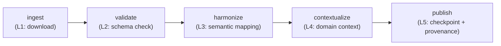

# Cytoskeleton Structural Refactor: Requirements & Architecture

> **Status**: Active
> **Date**: 2026-07-10
> **Author**: @shahin
> **Audience**: engineers
> **Tags**: `engineering`
> **Variants**: Technical (this doc) - Readable (refactor-requirements.md in Obsidian vault: 04-Engineering/toolchain/cytoskeleton/) - Agent (n/a)

## Executive Summary

This document captures the full requirements, assumptions, and architectural design for restructuring `cytoskeleton` from its current state (ad-hoc mix of generated assets, Python scripts, and cross-cutting concerns) into a clean, principled foundation for the Cytognosis ecosystem's data and asset management layer.

> [!IMPORTANT]
> This refactor must be completed **before** the End-to-End Platform Validation (see [e2e_platform_validation.md](file:///home/mohammadi/.gemini/antigravity/brain/d1a6495e-95b8-421a-9d8d-df4f604f5de3/e2e_platform_validation.md)).

---

## Part 1: Repository Cleanup

### 1.1 Files to Move

| Current Location | Target Location | Rationale |
|---|---|---|
| `configs/activation_hooks/rocm-strix-halo.sh` | `scripts/rocm-strix-halo.sh` | Shell scripts belong under `scripts/` |
| `scripts/check_rocm.py` | `src/cytoskeleton/hardware/check_rocm.py` | Python code belongs in `src/`; exposed via `nox -s hardware_check` |
| `scripts/resolve_matrix.py` | `src/cytoskeleton/resolve_matrix.py` | Already imports from `cytoskeleton`; move into the package proper |
| `test_js_resolution.py` (root) | `tests/test_js_resolution.py` | Tests must be in `tests/` and run via `pytest` |

### 1.2 Directories to Remove from Root

| Directory | Disposition |
|---|---|
| `locked/` | **DELETE** — Generated output. Will be replaced by `assets/environments/` and `assets/components/` tracked via DVC |
| `schemas/` | **DELETE** — Schemas are managed by `cytos`, not cytoskeleton. The `src/cytoskeleton/schemas/` module (bundled `core.yaml`, `docker.yaml`) stays as internal asset-type schemas |
| `skills/` | **DELETE** — Skills are managed by `cytoskills`, pushed/pulled via the asset system |
| `templates/` | **DELETE** — Templates are managed by `branding`, pushed/pulled via the asset system |

### 1.3 Policy Directory

**Move** `policy/` → `.github/policy/`

- The Rego rules (`gate.rego`, `backend_policy.rego`, `banned_packages.rego`, etc.) and conftest rules are used exclusively during PR merge gates via GitHub Actions.
- Moving them to `.github/policy/` keeps them co-located with the workflow files that invoke them.
- The `src/cytoskeleton/pr_verify/` Python module (which calls OPA) will be updated to look for rules in `.github/policy/` instead of `policy/`.

### 1.4 Noxfile Cleanup

The following nox sessions reference deleted directories and must be updated:

| Session | Action |
|---|---|
| `skills_validate` | Remove or make conditional on assets/skills existing |
| `templates_smoke` | Remove or make conditional on assets/templates existing |
| `build_cso` | Remove — CSO build belongs in `cytos` |
| `validate_sssom` | Remove — SSSOM validation belongs in `cytos` |
| `publish_cso` | Remove — CSO publishing belongs in `cytos` |

---

## Part 2: The `assets/` Folder Architecture

### 2.1 Structure

Every Cytognosis repo will have an `assets/` folder at its root:

```
assets/
├── components/        # Managed by: cytoskeleton
│   └── manifest.yaml
├── environments/      # Managed by: cytoskeleton
│   └── manifest.yaml
├── containers/        # Managed by: cytoskeleton
│   └── manifest.yaml
├── designs/           # Managed by: branding
│   └── manifest.yaml
├── templates/         # Managed by: branding
│   └── manifest.yaml
├── schemas/           # Managed by: cytos
│   └── manifest.yaml
├── ontologies/        # Managed by: cytos
│   └── manifest.yaml
└── skills/            # Managed by: cytoskills
    └── manifest.yaml
```

### 2.2 Tracking Model

- The `assets/` folder is **DVC-tracked** as a whole (via `dvc add assets/` or per-subfolder `.dvc` files).
- Actual payload files reside in remote storage organized by **asset type**: `gs://cytognosis-data-hub/assets/<asset-type>/` (e.g., `gs://cytognosis-data-hub/assets/components/`, `gs://cytognosis-data-hub/assets/environments/`). Asset types are the organizing principle, NOT repos.
- Only lightweight **manifest files** and **`.dvc` pointer files** are committed to git.
- `cytoskeleton` provides the tooling (Python API + nox sessions + CLI) for `push`, `pull`, `query`, `validate` operations per asset type.
- **Manifest sync protocol**: Before ANY interaction (read or write) with the asset store, the local manifest is auto-fetched from the remote to ensure all latest changes are pulled first. The fetch is a read-only operation. Write operations (append, update, delete) happen inside the function that performs the actual mutation, which itself updates the remote manifest atomically.

### 2.3 Asset Type Registry

Each asset type has:
1. A **dedicated schema** (small, internal to cytoskeleton since it defines the asset type) in `src/cytoskeleton/schemas/`
2. A **manifest format** (see Part 4)
3. A **managing package** that has authority to produce and publish that asset type
4. An **adapter** in the VFS adapter system for reading/writing (see Part 3)

---

## Part 3: Deep Analysis — DVC vs. Our VFS & Adapter System

### 3.1 What DVC Actually Provides

DVC is fundamentally a **content-addressed blob transport layer**:

| Capability | How DVC Does It | Limitation |
|---|---|---|
| **Hashing** | MD5 by default (configurable to SHA256). Stores hash in `.dvc` files | No semantic identifiers (no SWHID, no DOI) |
| **Local cache** | `~/.dvc/cache/` with 2-char prefix fan-out, hardlinks to working dir | URI-keyed, not content-aware |
| **Remote push/pull** | Bulk blob upload/download to GCS/S3/Azure/SSH | No partial reads, no byte-range requests, no streaming |
| **Pipelines** | `dvc.yaml` defines stages with `cmd`, `deps`, `outs`, `params` | Tracks file-level dependencies only; no semantic types |
| **API** | `dvc.api.open()`, `dvc.api.read()` for remote file access | Always downloads full file; no lazy loading, no FUSE |
| **Metadata** | `.dvc` files contain `md5`, `size`, `nfiles` — nothing else | No custom metadata, no schema validation, no provenance |
| **Dedup** | Content-addressed cache naturally deduplicates identical files | Only exact-match dedup; no block-level dedup |

### 3.2 What Our VFS Already Provides (That DVC Does Not)

Our existing VFS implementation in [src/cytoskeleton/vfs/](file:///home/mohammadi/repos/cytognosis/cytoskeleton/src/cytoskeleton/vfs) already surpasses DVC:

| Feature | Our VFS | DVC |
|---|---|---|
| **Multi-backend abstraction** | 7 backends (Local, GCS, S3, GitHub, Git, HuggingFace, Zenodo) via `AbstractVFS` | Limited to configured remotes |
| **Byte-range reads** | `open_range(uri, offset, length)` with cloud-native HTTP Range fallback | Not supported |
| **Disk cache** | Content-addressed XDG cache with SHA-256 fan-out (`DiskCachedVFS`) | Yes, similar |
| **Memory cache** | Thread-safe LRU with configurable size (`MemoryCachedVFS`) | Not supported |
| **Monkeypatching** | `builtins.open`, `os.path.exists`, `os.stat` hooks (inspired by Dagster) | Not supported |
| **Provenance** | W3C PROV-J sidecars with git SHA, author, lineage | Not supported |
| **Identity** | SWHID (ISO 18670:2025) computed on every `put()` | MD5 only |
| **Parallel downloads** | `get_many()` with thread pool | Yes, `dvc push/pull` also parallel |
| **Catalog/Registry** | `AssetCatalog` with `push`, `pull`, `search`, `list` | Not supported |

### 3.3 Critical DVC Limitations (Confirmed via Deep Research)

| Limitation | Impact on Us |
|---|---|
| **File-level CAS only** — No chunk-level dedup. A 1-byte change in a 100GB file = full re-hash, re-store, re-upload | Devastating for TileDB arrays, Zarr stores, HDF5, model checkpoints |
| **MD5 hashing** — Not cryptographically strong, no SWHID/DOI support | We already use SWHID (ISO 18670:2025) |
| **`fsspec`-delegated transport** — DVC does NOT implement transfer logic; delegates to `s3fs`/`gcsfs`. No delta/differential sync, no rsync-like behavior | Our VFS already uses cloud-native HTTP Range requests |
| **Read-only VFS** — `DVCFileSystem` is read-only; no write-through, no mount, no modify-in-place | Our VFS is fully read/write |
| **Format-agnostic = format-ignorant** — Treats TileDB, Zarr, Parquet as opaque blobs. Any chunk change in a Zarr store triggers full directory rehash. Multiple stages cannot write to the same directory | We need array-aware adapters (TileDB-SOMA, TileDB-VCF) |
| **No concurrent writes** — No support for multiple processes writing to the same tracked output | Required for distributed scientific computing |
| **No FUSE mount** — Theoretically possible via fsspec but unstable in practice | Not needed; our monkeypatching hooks are more targeted |
| **Acquired by lakeFS (Nov 2025)** — Strategic direction unclear; lakeFS is the enterprise play | Low risk since we use DVC minimally |

### 3.4 Conclusion: What We Take from Each Tool

| Tool | What We Use | What We Do NOT Use |
|---|---|---|
| **DVC** | `dvc add`/`push`/`pull` as a thin blob transport + `.dvc` git pointers for large files | Pipelines (`dvc.yaml`), metrics, experiments, VFS (`dvc.api`), metadata |
| **TileDB VFS** | Design patterns: tile-level byte-range reads, request batching, config-driven backend selection | Direct dependency (we implement the same patterns in our own VFS) |
| **Dagster** | Design patterns: monkeypatching `builtins.open` for transparent I/O interception | Direct dependency (our `vfs.hooks` already implements this) |
| **BioCypher** | Adapter pattern: `get_nodes()`/`get_edges()` generators, schema-backed entity type validation, preferred/acceptable identifier mapping, ontology-hybridization pattern | Direct dependency in cytoskeleton (BioCypher will be a cytos dependency for KG building) |
| **LaminDB** | Mental model: Transform→Run→Artifact provenance chain, `.backed()` lazy access pattern | Direct dependency (we use Redun+VFS instead; LaminDB's Django ORM is heavier than needed) |
| **Redun** | Full dependency: content-hashed task DAGs, memoization, call graph provenance, `File` type tracking | N/A — we use redun as the orchestration engine |
| **OpenLineage** | Full dependency: standardized lineage events (START/COMPLETE/FAIL), cross-system dataset namespace+name correlation | Marquez server (use JSON file output initially) |
| **SWHID** | Full dependency: ISO 18670:2025 content-addressed identifiers, qualification with origin/path/lines | Already implemented in `src/cytoskeleton/identity/swhid.py` |

> [!IMPORTANT]
> **Bottom line:** DVC is a convenience wrapper for bulk GCS push/pull. Our VFS is the actual abstraction layer (problem **a** from your framing). Our identity/adapter/manifest system handles hashing/tracking/harmonization (problem **b** from your framing). DVC is optional and replaceable; our VFS is not.

---

## Part 3B: Layered Adapter Architecture

### 3B.1 The Unified Layered Protocol

Your sensor protocol sketch maps beautifully onto our data/asset adapter stack. The key insight is that **the same layered architecture applies to all data ingestion** — from wearable sensors to genomic datasets to knowledge graphs. Here is the unified 5-layer protocol:

```
┌──────────────────────────────────────────────────┐
│ Layer 5: EXPERIMENT — Study Design & Provenance  │
│   redun DAG, OpenLineage events, WRROC crates    │
├──────────────────────────────────────────────────┤
│ Layer 4: CONTEXTUAL — Domain-Specific Context    │
│   HRA/CCF, tissue ontologies, asset provenance   │
├──────────────────────────────────────────────────┤
│ Layer 3: SEMANTIC — Units, Measures, Ontologies  │
│   QUDT, UO, OBI, OPB, Cell Ontology             │
├──────────────────────────────────────────────────┤
│ Layer 2: VALIDATION — Schema & Type Enforcement  │
│   LinkML, Pydantic, range/statistics validation  │
├──────────────────────────────────────────────────┤
│ Layer 1: INGESTION — Source Abstraction ("Port") │
│   VFS backends, Bluetooth, REST/FHIR, file I/O  │
└──────────────────────────────────────────────────┘
```

### 3B.2 Mapping to Concrete Implementations

| Layer | Sensor Domain | Genomic/Bio Domain | KG Domain | Asset Domain | Tabular Domain |
|---|---|---|---|---|---|
| **L1 Ingestion** | BLE radio, AWARE, mic, camera | VCF file, FASTQ, BAM | Neo4j dump, OWL file | GCS blob, DVC pull | Parquet, CSV, obs/var |
| **L2 Validation** | Pydantic models, range checks | VCF spec compliance | Node/edge type check | LinkML schema validation | Column schema enforcement |
| **L3 Semantic** | QUDT (°C, bpm), UO, OBI | SO (sequence ontology) | MONDO, HP, GO terms | Asset type enum | Unit/ontology column mapping |
| **L4 Contextual** | HRA body site mapping | Genome assembly (GRCh38) | Disease-gene associations | Git provenance, authorship | Study/cohort context |
| **L5 Experiment** | Study protocol, interventions | redun pipeline, DVC tracking | Provenance graph | Manifest + SWHID | Transformation lineage |

### 3B.3 Adapter Interface (BioCypher-inspired)

Drawing from BioCypher's adapter pattern (confirmed via deep research), each data type gets an **InputAdapter** and an **OutputAdapter**:

```python
class InputAdapter(Protocol):
    """Layer 1: Reads raw data from any source via generators."""
    def get_nodes(self) -> Iterator[tuple[str, str, dict]]:
        """Yield (id, type, properties) 3-tuples.
        
        id: unique identifier (ideally a CURIE, e.g. 'MONDO:0005351')
        type: entity label mapped via schema_config.yaml
        properties: dict of attributes
        """
        ...

    def get_edges(self) -> Iterator[tuple[str | None, str, str, str, dict]]:
        """Yield (id, source_id, target_id, type, properties) 5-tuples.
        
        id: unique edge identifier (can be None for auto-generation)
        source_id: identifier of source node
        target_id: identifier of target node
        type: relationship label
        properties: dict of attributes
        """
        ...

class OutputAdapter(Protocol):
    """Writes harmonized data to a target (Neo4j, CSV, TileDB, etc.)."""
    def write_nodes(self, nodes: Iterator, *, batch_size: int = 1_000_000) -> None: ...
    def write_edges(self, edges: Iterator, *, batch_size: int = 1_000_000) -> None: ...
    def write_import_call(self) -> str | None:
        """Generate import script (e.g., neo4j-admin-import-call.sh). Returns path."""
        ...
```

**Adapter families, each with format dispatch:**

| Adapter Type | Domain | Format Codecs | Notes |
|---|---|---|---|
| `ContentAdapter` | Schemas, YAML/JSON assets | YAML, JSON, TOML | DVC-like content hashing; VFS `read_text()`/`write_text()` |
| `TabularAdapter` | DataFrames, obs/var, results | Parquet, CSV, TSV, Arrow IPC | Column schema enforcement + transformation; also used for TileDB SOMA obs/var |
| `ArrayAdapter` | Single-cell, genomic arrays | TileDB-SOMA, TileDB-VCF, Zarr, HDF5 | Chunked/streaming reads via `open_range()` |
| `GraphAdapter` | Knowledge graphs | Neo4j Bolt, CSV export, RDF | BioCypher-style node/edge iterators; ontology-backed validation |
| `NeuroAdapter` | Neuroimaging (TileDB-NWB) | NWB, BIDS, BED, EDF, NIFTI | See §3B.5 for format dispatch |
| `SensorAdapter` | Wearable/continuous (stub) | BLE, FHIR, AWARE | Future: Cytoscope integration |

### 3B.4 Tabular Data as a First-Class Citizen

Tabular data (Parquet, CSV, obs/var DataFrames from TileDB-SOMA) requires its own adapter type with dedicated column-level schema enforcement:

```python
class TabularAdapter(Protocol):
    """Read/write/transform tabular data with column schema validation."""
    def read(self, uri: str, *, columns: list[str] | None = None) -> pl.DataFrame: ...
    def write(self, df: pl.DataFrame, uri: str) -> str: ...
    def validate_schema(self, df: pl.DataFrame, schema: ColumnSchema) -> list[str]: ...
    def transform(self, df: pl.DataFrame, transforms: list[ColumnTransform]) -> pl.DataFrame: ...

@dataclass
class ColumnSchema:
    """Schema for validating tabular data columns."""
    columns: dict[str, ColumnDef]  # name → definition
    required_columns: list[str]
    index_columns: list[str] | None = None

@dataclass
class ColumnDef:
    """Definition for a single column."""
    dtype: str  # "float64", "string", "category", etc.
    nullable: bool = True
    ontology: str | None = None  # e.g., "CL" for cell type columns
    valid_values: list[str] | None = None  # enum constraint
    range: tuple[float, float] | None = None  # numeric range constraint
```

This `TabularAdapter` is used when:
- Reading/writing Parquet files directly
- Extracting `obs` and `var` DataFrames from TileDB-SOMA experiments
- Validating column types and ontology term membership
- Applying column-level transformations (unit conversion, ontology mapping, renaming)

### 3B.5 TileDB-NWB and the Format Dispatch Pattern

The current [NeuroStore](file:///home/mohammadi/repos/cytognosis/cytos/src/cytos/db/neuro_store/store.py) (aliased as `TileDBNWB`) manages NWB, BIDS, and TileDB-backed neuroimaging datasets. The key design question is: **how do we handle multiple formats (NWB, BED, EDF, NIFTI, BIDS) without creating separate adapters for each?**

**Solution: Adapter per domain, FormatCodec per file type.**

The `NeuroAdapter` is a single adapter for the neuroimaging domain. It dispatches to format-specific **codecs** based on file extension or explicit format parameter:

```python
class FormatCodec(Protocol):
    """Handles serialization/deserialization for a specific file format."""
    format_name: str
    extensions: tuple[str, ...]
    
    def read(self, uri: str, **kwargs) -> Any: ...
    def write(self, data: Any, uri: str, **kwargs) -> None: ...
    def validate(self, uri: str) -> list[str]: ...

# Concrete codecs
class NWBCodec:     # .nwb files → pynwb
    format_name = "nwb"
    extensions = (".nwb",)

class BIDSCodec:    # BIDS directory → dataset_description.json
    format_name = "bids"
    extensions = ()  # directory-based

class BEDCodec:     # .bed files → polars/pyranges
    format_name = "bed"
    extensions = (".bed", ".bed.gz")

class EDFCodec:     # .edf files → mne-python
    format_name = "edf"
    extensions = (".edf",)

class NeuroAdapter:
    """Domain adapter for neuroimaging data."""
    codecs: dict[str, FormatCodec] = {
        "nwb": NWBCodec(), "bids": BIDSCodec(),
        "bed": BEDCodec(), "edf": EDFCodec(),
    }
    
    def read(self, uri: str, *, format: str | None = None) -> Any:
        codec = self._resolve_codec(uri, format)
        return codec.read(uri)
    
    def _resolve_codec(self, uri: str, format: str | None) -> FormatCodec:
        if format:
            return self.codecs[format]
        # Auto-detect from extension
        for codec in self.codecs.values():
            if any(uri.endswith(ext) for ext in codec.extensions):
                return codec
        raise ValueError(f"Cannot determine format for: {uri}")
```

This pattern generalizes: `GenomicAdapter` dispatches to VCF, FASTQ, BAM codecs. `TabularAdapter` dispatches to Parquet, CSV, Arrow codecs. The **adapter** owns the domain-level harmonization logic (brain region mapping, cell type ontology, etc.); the **codec** owns the I/O serialization.

### 3B.6 Central KG as the Unified Harmonization Authority

> [!IMPORTANT]
> Our central Knowledge Graph (hosted on cytohost Neo4j) already contains **everything that LaminDB's bionty provides, and 100x more**: Cell Ontology, MONDO, HPO, GO, UBERON, HRA/CCF coordinates, gene-disease associations, drug-target interactions, tissue expression profiles, brain region hierarchies, modality mappings, and more.

**All adapters use the central KG as their single harmonization backend.** This means:

- **Cell type mapping** (L3 Semantic): Query the KG for Cell Ontology terms, not a local bionty cache
- **Brain region mapping** (L4 Contextual): Query the KG for HRA/CCF coordinates and UBERON hierarchies
- **Disease-gene associations** (L4 Contextual): Query the KG for MONDO→gene edges
- **Ontology term validation** (L2 Validation): Validate CURIEs against the KG's node set

This is exposed via `cytos.kg` as the canonical interface, and every adapter that does harmonization calls through it:

```python
from cytos.kg import KGClient

kg = KGClient(uri="bolt://cytohost:7687")
kg.map_cell_types(["T cell", "neuron", "astrocyte"])  # → CURIEs
kg.map_brain_regions(["hippocampus", "V1"])           # → HRA coordinates
kg.validate_curies(["MONDO:0005351", "CL:0000540"])   # → bool
```

---

## Part 4: Manifest Format Specification

### 4.1 Structure

Each asset type subfolder (e.g., `assets/components/`) contains a `manifest.yaml`:

```yaml
# manifest.yaml — Components Manifest
manifest_version: "1.0.0"
asset_type: component
managing_package: cytoskeleton
remote_bucket: gs://cytognosis-data-hub/assets/components/

# Embedded schema for this asset type (avoids external lookup)
schema:
  id: https://w3id.org/cytognosis/schemas/component/v1
  name: ComponentAsset
  attributes:
    name: {required: true, range: string}
    version: {required: true, range: string}
    domain: {required: true, range: ComponentDomain}
    dependencies: {range: string, multivalued: true}

# Asset entries
entries:
  - name: core
    version: "0.5.0"
    swhid: "swh:1:cnt:a1b2c3d4..."
    dvc_hash: "md5:abc123..."
    created_at: "2026-05-26T22:00:00Z"
    created_by: "mohammadi@cytognosis.org"
    provenance:
      git_sha: "3e1878ef..."
      git_repo: "https://github.com/cytognosis/cytoskeleton"
      parent_uris: []
    dependencies: []
```

### 4.2 What the Manifest Includes

1. **`manifest_version`** — Semantic version of the manifest format itself
2. **`asset_type`** — One of: `component`, `environment`, `container`, `design`, `template`, `schema`, `ontology`, `skill`
3. **`managing_package`** — Which repo has authority to produce this asset type
4. **`remote_bucket`** — GCS URI for the DVC remote, organized by asset type: `gs://cytognosis-data-hub/assets/<asset-type>/`
5. **`schema`** — Embedded LinkML schema defining validation rules for entries of this type
6. **`entries[]`** — List of assets with:
   - `swhid` — Content identity (ISO 18670:2025)
   - `dvc_hash` — Transport-layer pointer for DVC push/pull
   - `provenance` — Git SHA, author, lineage
   - Type-specific fields defined by the embedded schema

### 4.3 Tooling

```bash
# List available assets of a type
nox -s assets -- list components

# Pull a specific asset
nox -s assets -- pull components/core

# Push a new asset (validates schema, computes SWHID, updates manifest)
nox -s assets -- push components ./configs/components/python/core.yaml

# Query across all asset types
nox -s assets -- search "genomics"
```

---

## Part 5: Stages, Experiments & Orchestration

### 5.1 The Problem

We need reproducible, provenance-tracked multi-stage workflows for:
- **Asset curation** (e.g., building a new environment lockfile) — managed by `cytoskeleton`
- **Dataset ingestion** (e.g., Brain Cell Atlas → TileDB-SOMA) — managed by `cytos`
- **Model training** (e.g., scVI on harmonized data) — managed by `cytos`

Each workflow has defined **stages** that produce checkpointed artifacts. We need:
- Unique identifiers per checkpoint
- Exact reproducibility (code hash + data hash = same result)
- Modular, reusable stage definitions
- **Sequence compatibility** — stages must be orderable; not all orderings are valid

### 5.2 Stage Ownership Model

| Package | Stage Types | Orchestrator | Rationale |
|---|---|---|---|
| **cytoskeleton** | Asset stages (lock, push, pull, validate, publish) | Dagster assets model | Text-heavy, DVC-compatible assets match Dagster's declarative asset-based paradigm; good for environments, containers, components |
| **cytos** | Data stages (ingest, harmonize, transform, publish) | Redun tasks | Data-heavy, dynamic scientific workflows need content-hashing, memoization, and call graph provenance; good for single-cell, neuro, genomic pipelines |
| **cytos** | Model stages (train, evaluate, publish) | Redun tasks | Same rationale as data; models are large artifacts with complex dependency chains |

> [!NOTE]
> Dagster for assets: Dagster's `@asset` decorator maps naturally to our asset types (each environment lockfile is an "asset" in Dagster terms). Its built-in observability UI, asset checks, and materializations are well-suited for the text-heavy, CI-triggered asset curation workflow.
>
> Redun for data/model: Redun's content-hashing, lazy evaluation, and native File tracking are essential for large scientific data workflows where memoization and reproducibility matter more than observability UI.

### 5.3 Comparison with LaminDB

| Feature | LaminDB | Our System (Redun + Dagster + VFS) |
|---|---|---|
| **Artifact tracking** | `ln.Artifact` with S3/GCS backing | VFS `put()` + SWHID + manifest |
| **Transforms** | `ln.Transform` (notebook, pipeline, or function) | Redun `@task` (data) / Dagster `@asset` (assets) |
| **Runs** | `ln.Run` auto-tracked per transform | Redun execution graph (auto-hashed) / Dagster materializations |
| **Provenance** | SQL database (Postgres/SQLite) | W3C PROV-J sidecars + OpenLineage events |
| **Schema** | `ln.Feature`, `ln.ULabel` with ontology backing (via bionty) | LinkML schemas + **our central KG** (contains everything bionty has, x100) |
| **Collections** | `ln.Collection` grouping artifacts | Manifest `entries[]` grouping |
| **Key advantage** | Tight AnnData/DataFrame integration, `.backed()` lazy access | Full VFS abstraction, multi-backend, central KG for harmonization, graph DB integration |

**Key takeaway from LaminDB:** Their `Transform` → `Run` → `Artifact` chain is elegant. We adopt the same mental model but implement it using Redun tasks + Dagster assets (which are already content-hashed) and our VFS/manifest/KG system (which is more flexible and does not require a Django ORM).

### 5.3 Redun Stage Architecture

```python
from redun import task, File
from cytoskeleton.stages import stage, checkpoint

@stage("ingest")
@task()
def ingest_brain_atlas(dataset_name: str = "ADULT_BRAIN") -> File:
    """L1: Download raw data from Brain Cell Atlas."""
    raw_path = download_from_bca(dataset_name)
    return File(str(raw_path))

@stage("harmonize")
@task()
def harmonize(raw: File) -> File:
    """L2-L4: Validate, annotate, map to HRA/CCF."""
    adata = sc.read_h5ad(raw.path)
    adata = run_qc(adata)
    adata = map_cell_types(adata)    # L3: Semantic
    adata = map_hra_coords(adata)    # L4: Biological
    out = Path("harmonized.h5ad")
    adata.write(out)
    return File(str(out))

@stage("publish")
@task()
def publish_soma(harmonized: File) -> str:
    """L5: Convert to TileDB-SOMA and push to remote."""
    soma_uri = convert_to_soma(harmonized.path)
    manifest_entry = push_to_assets(soma_uri, asset_type="dataset")
    return manifest_entry.swhid
```

### 5.4 The `@stage` Decorator

The `@stage("name")` decorator wraps a Redun `@task` to add pre/post hooks:

**Pre-hook (before task execution):**
- Log an OpenLineage `START` event with input dataset facets
- Record the current git SHA and task code hash

**Post-hook (after task returns):**
- Compute the SWHID of the output artifact
- `dvc add` the output and push to the remote bucket
- Update the manifest YAML with the new entry
- Log an OpenLineage `COMPLETE` event with output dataset facets
- Serialize the full redun call graph as provenance into the manifest

### 5.5 Stage DAG Definition & Sequence Compatibility

Stages form a **DAG** (which is just the redun task graph). But not all orderings are valid — stages have **sequence compatibility constraints**:



Sequence constraints are encoded per stage via a `requires` and `produces` annotation:

```python
@stage("harmonize", requires={"validated_data"}, produces={"harmonized_data"})
@task()
def harmonize(validated: File) -> File:
    ...
```

The stage registry validates DAG connectivity at experiment definition time: if stage B requires `validated_data` but stage A only produces `raw_data`, the DAG is rejected before execution.

### 5.6 Experiments as Instantiated Stage DAGs

An **Experiment** is a reusable template defining:
1. An ordered DAG of stages (with sequence compatibility verified)
2. Parameters/arguments per stage
3. Input dataset identifiers
4. Output artifact expectations
5. Provenance metadata (author, purpose, protocol)

```python
@dataclass
class Experiment:
    """A composable, instantiable experiment template."""
    name: str
    description: str
    stages: list[StageSpec]  # Ordered DAG nodes
    dag: dict[str, list[str]]  # adjacency list: stage_name → [dependency_names]
    parameters: dict[str, dict[str, Any]]  # stage_name → {param: value}
    input_datasets: list[str]  # URIs or manifest entry SWHIDs
    output_expectations: dict[str, str]  # stage_name → expected asset_type
    
    def validate_dag(self) -> list[str]:
        """Verify sequence compatibility of all stages."""
        ...
    
    def instantiate(self, **overrides) -> ExperimentRun:
        """Create a concrete run from this template with parameter overrides."""
        ...
```

An `ExperimentRun` is an instantiation of an Experiment template with concrete parameters, data, and execution context. It maps to:
- A **Redun execution** (for data/model experiments in cytos)
- A **Dagster run** (for asset experiments in cytoskeleton)
- An **RO-Crate** package (for archival and sharing — see §5.7)

### 5.7 RO-Crate for Experiment Representation

> [!NOTE]
> **RO-Crate (Research Object Crate)** is a community standard (v1.2, June 2025) for packaging research data with JSON-LD metadata using Schema.org vocabulary. Research confirmed it as the right serialization format for our Experiment definition.

**Why RO-Crate fits:**
- JSON-LD metadata (`ro-crate-metadata.json`) using schema.org vocabulary
- **Workflow Run RO-Crate (WRROC)** has 3 tiered profiles: Process Run (simple), Workflow Run (prospective + retrospective provenance), Provenance Run (step-level DAG with intermediate outputs)
- Compatible with W3C PROV-O: `CreateAction` → `prov:Activity`, `File` → `prov:Entity`
- **ISA RO-Crate** extends for wet-lab experiments (Investigation/Study/Assay model)
- Adopted by Galaxy, WorkflowHub (400+ workflows), nf-core (auto-publish), ELIXIR
- Python library: `pip install rocrate` (`ro-crate-py`, supports 1.0-1.2)

**Key finding:** RO-Crate does **not** have a native "experiment-as-DAG" entity type. The DAG emerges from cross-references: each `CreateAction`'s `result` entities become the next `CreateAction`'s `object` entities. We adopt **Approach C** (custom profile) to layer our Experiment/Stage DAG model:

**Proposed mapping (Cytognosis RO-Crate Profile):**

| Our Concept | RO-Crate Entity | Notes |
|---|---|---|
| Experiment template | `ComputationalWorkflow` | Prospective provenance |
| ExperimentRun | `CreateAction` (WRROC) | `instrument` → workflow, `agent` → user |
| Stage | `HowToStep` + `SoftwareApplication` | `ControlAction` orchestrates the step |
| Input dataset | `Dataset` with `@id` = SWHID | `exampleOfWork` → `FormalParameter` |
| Output artifact | `Dataset` or `CreativeWork` | `exampleOfWork` → `FormalParameter` |
| Parameters | `FormalParameter` (def) + `PropertyValue` (value) | Per-stage parameter binding |
| Stage DAG | Implicit via `object`/`result` chains | Validated by our `Experiment.validate_dag()` |
| Provenance | OpenLineage events (runtime) → PROV-J sidecars | Exported into the crate |

**Concrete RO-Crate output for a completed experiment run:**

```
experiment-run-2026-05-26/
├── ro-crate-metadata.json   # JSON-LD: workflow, run, inputs, outputs, params
├── inputs/                  # Symlinks or refs to input data SWHIDs
├── outputs/                 # Actual or referenced output artifacts
├── logs/                    # Execution logs, OpenLineage events
└── provenance/              # W3C PROV-J sidecars, redun call graph
```

**Python usage (via `rocrate` library):**
```python
from rocrate.rocrate import ROCrate

crate = ROCrate()
crate.name = "scRNA-seq Brain Cell Atlas Ingestion"
crate.add_file("inputs/brain_atlas.h5ad", properties={
    "name": "Brain Cell Atlas Adult",
    "encodingFormat": "application/x-hdf5",
    "identifier": "swh:1:cnt:abc123...",
})
crate.write("experiment-run-2026-05-26")
```

 **Validation:** We define a **Cytognosis RO-Crate Profile** constraining the base spec (required entities, mandatory properties per stage) and validate using `roc-validator` (SHACL shapes + Python checks).

> [!IMPORTANT]
> **RO-Crate is canonical from day 1.** When an `Experiment` is defined, a `ro-crate-metadata.json` is created immediately with the prospective provenance (`ComputationalWorkflow`, `FormalParameter` definitions, stage DAG). As each stage executes, `CreateAction` entities are appended with actual inputs/outputs/parameters. The crate grows with the experiment, not bolted on after. This means `Experiment.__init__()` creates the crate, `ExperimentRun.execute_stage()` updates it, and `ExperimentRun.finalize()` writes the complete package.

**Lifecycle:**
```
Experiment.define()  → creates ro-crate-metadata.json (prospective: workflow + params)
    ↓
ExperimentRun.start()  → adds CreateAction with startTime, agent, object refs
    ↓
stage.complete()  → appends result refs, PropertyValues, OpenLineage events
    ↓
ExperimentRun.finalize()  → writes provenance sidecars, sets actionStatus=Completed
```

### 5.8 Redun Hook Implementation

Redun does not have built-in pre/post task hooks, but we implement them via the `@stage` decorator:

```python
import functools
from redun import task

def stage(name: str, *, requires: set[str] | None = None, produces: set[str] | None = None):
    """Decorator that wraps a redun @task with checkpoint hooks and DAG metadata."""
    def decorator(func):
        func._stage_name = name
        func._stage_requires = requires or set()
        func._stage_produces = produces or set()
        
        @functools.wraps(func)
        def wrapper(*args, **kwargs):
            emit_openlineage_event("START", name, args, kwargs)
            result = func(*args, **kwargs)
            swhid = compute_swhid(result)
            push_checkpoint(name, result, swhid)
            emit_openlineage_event("COMPLETE", name, result, swhid)
            return result
        wrapper._stage_name = name
        wrapper._stage_requires = func._stage_requires
        wrapper._stage_produces = func._stage_produces
        return wrapper
    return decorator
```

---

## Part 6: Datasets (cytos)

Datasets follow a parallel structure to assets but are managed by `cytos`:

```
datasets/                # In cytos and downstream packages
├── kg/                  # Knowledge graphs
│   └── manifest.yaml
├── single-cell/         # scRNA-seq, spatial
│   └── manifest.yaml
├── genomic/             # VCF, FASTQ
│   └── manifest.yaml
└── sensor/              # Wearable, AWARE
    └── manifest.yaml
```

- `cytos` provides the ingestion, harmonization, and publishing tooling
- All downstream packages (`cytocast`-generated projects, etc.) that depend on `cytos` get the `datasets/` folder
- Same manifest format, same DVC tracking, same SWHID identity

---

## Assumptions

1. **GCS is the primary remote storage** — `gs://cytognosis-data-hub/` is already configured.
2. **DVC is already initialized** — `.dvc/config` points to `gs://cytognosis-data-hub/dvc-cache/`.
3. **LinkML is a core dependency** — Already in `cytoskeleton`'s requirements.
4. **Redun will be added as a dependency** — For workflow orchestration and content-hashing.
5. **OpenLineage is additive** — We can start emitting events without requiring a Marquez server; JSON files are sufficient initially.
6. **RO-Crate is canonical from day 1** — Experiments are defined, executed, and archived as RO-Crate packages. RO-Crate (with our custom Cytognosis profile extending WRROC) is the experiment definition format, not just an afterthought export. If Schema.org/WRROC entities are insufficient, we extend them in our profile.
7. **Sensor schema consolidation is high priority** — All LinkML sensor schemas (IEEE 1752/Open mHealth, FHIR, AWARE, SOSA/SSN) must be semantically mapped via SSSOM, with preferred vocabulary chosen for exact matches and union taken for genuinely unique fields.

---

## Resolved Decisions

| # | Question | Decision |
|---|---|---|
| 1 | Docker naming | **containers** |
| 2 | Orchestrator split | **Dagster** for asset stages (cytoskeleton); **Redun** for data/model stages (cytos) |
| 3 | Layer 4 naming | **Contextual** (covers biological, medical, asset provenance, study context) |
| 4 | Central KG role | Our KG is the **single harmonization authority** — all adapters query it, not bionty |
| 5 | Neuro store naming | **TileDB-NWB** — alias for NeuroStore |
| 6 | Format dispatch | **FormatCodec** pattern — adapter per domain, codec per file type |
| 7 | Asset store topology | Single GCS prefix organized by **asset type**: `gs://cytognosis-data-hub/assets/<type>/`. NOT per-repo. |
| 8 | Manifest authority | **Auto-fetch** before any read or write operation. Fetch = read-only. Writes happen atomically inside the mutating function. |
| 9 | Sensor schemas | **Full consolidation** — SSSOM mappings across IEEE 1752, FHIR, AWARE, SOSA/SSN; preferred vocabulary for exact matches; union for unique fields; optional markers for low-relevance fields |
| 10 | RO-Crate scope | **Canonical from day 1** — Experiments are RO-Crate packages from definition through execution to archival. Custom Cytognosis RO-Crate profile extends WRROC. |

> **All open questions resolved. Document is approved for execution.**
