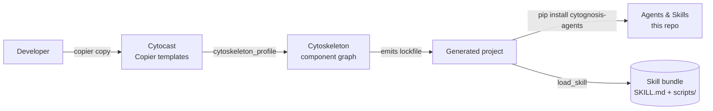
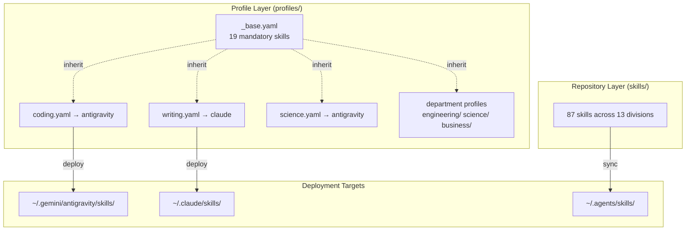
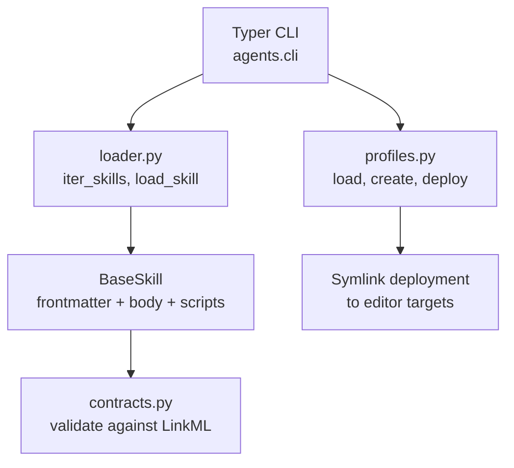

# Agents Repo Architecture

> **Status**: Active
> **Date**: 2026-07-10
> **Author**: @shahin
> **Audience**: engineers
> **Tags**: `engineering`
> **Variants**: Technical (this doc) - Readable (architecture.md in Obsidian vault: 04-Engineering/toolchain/cytoskills/) - Agent (n/a)

This repo holds the runtime skills catalog, profile-based deployment system,
and the typed Python overlay that turns SKILL.md bundles into validated
`BaseSkill` instances. It does not scaffold projects (that's
[Cytocast](https://github.com/cytognosis/cytocast)) and does not resolve
dependencies (that's [Cytoskeleton](https://github.com/cytognosis/cytoskeleton)).

## Cross-Repo Composition



## Two-Entity Architecture



## Division Taxonomy

Skills are organized into 13 top-level divisions:

| Division | Count | Purpose |
|----------|-------|---------|
| `cytognosis/` | 9 | Organizational: brand, science, grants, workspace |
| `meta/` | 7 | Agent meta-skills: orchestrator, personality, thinking |
| `engineering/` | 6 | Software engineering: debugging, testing, docs, design |
| `languages/` | 8 | Language-specific: Python, TypeScript, Go, Rust, etc. |
| `ai-ml/` | 11 | ML/DL: pipelines, fine-tuning, RAG, embeddings |
| `backend/` | 7 | Backend: FastAPI, Django, APIs, microservices |
| `frontend/` | 11 | Frontend: React, CSS, HTML, testing, components |
| `devops/` | 4 | DevOps: cloud, containers, CI/CD |
| `documents/` | 6 | Document processing: PDF, DOCX, PPTX, conversion |
| `research/` | 5 | Research: writing, literature, communication |
| `science/` | 8 | Science: bioinformatics, healthcare, ontologies |
| `operations/` | 6 | Operations: legal, marketing, regulatory |
| `infrastructure/` | varies | Infrastructure skills |

## Profiles

Profiles are declarative YAML files that define which skills to deploy.
They support multi-level inheritance:

```yaml
# profiles/science/ai-scientist.yaml
name: ai-scientist
target: agents
inherit:
  - _base
  - science/research-scientist
  - engineering/ai-ml-architect
skills:
  - prompt-engineer
  - rag-architect
```

See `agents profile tree` for the full inheritance DAG.

## Internal Layers



## The `BaseSkill` Object

A skill is a directory shipped under `skills/{division}/{name}/`:

```
skills/documents/pdf/
├── SKILL.md           # YAML frontmatter (contract) + Markdown body
├── scripts/           # optional executable code
├── references/        # optional supporting docs
├── assets/            # optional static files
└── LICENSE.txt        # optional per-skill license
```

| Attribute | Source |
|-----------|--------|
| `name` | frontmatter `name` |
| `language` | first segment after `skills/` (division) |
| `application` | second segment after `skills/` (subdirectory) |
| `frontmatter` | parsed `SkillFrontmatter` (Pydantic v2) |
| `body` | Markdown after the `---` separator |
| `inputs` / `outputs` | typed `SkillIO` objects with `schema:` aliases |
| `validate()` | enforces invariants (name match, qualified schema refs) |

## Org Tooling Standards

| Tool | Choice |
|------|--------|
| Task runner | Nox: `lint`, `typecheck`, `test`, `build`, `docs` (+ skill-management sessions) |
| Linter | Ruff (config in `pyproject.toml`) |
| CLI framework | Typer (`agents` console-script) |
| Env manager | uv (`.venv`) |
| Python | 3.11 / 3.12 / 3.13 |

## What Lives Elsewhere

- **Project scaffolding** → [Cytocast](https://github.com/cytognosis/cytocast)
- **Component lock + ML-framework profiles** → [Cytoskeleton](https://github.com/cytognosis/cytoskeleton)
