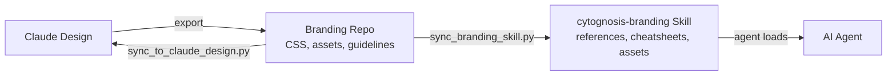

# cytognosis-branding Skill Specification

> **Status**: Active
> **Date**: 2026-07-10
> **Author**: @shahin
> **Audience**: engineers
> **Tags**: `engineering`
> **Variants**: Technical (this doc) - Readable (Obsidian twin optional, same filename) - Agent (n/a)

**Version:** 5.0.0 | **Status:** Production | **Last Revised:** 2026-05-31

## Overview

The `cytognosis-branding` skill is the unified brand, design system, and template master for the Cytognosis Foundation. It carries operational cheatsheets at the surface for routine work, routes to deep reference files when detail is needed, and covers all five interface templates plus six visual profiles (including the neurodivergent-first Companion and urgent-state Crisis profiles).

### When to Load

Load this skill whenever you design, style, color, format, write, or visually present anything for Cytognosis. This includes web pages, product UI, slide decks, social cards, email signatures, CSS, brand voice, microcopy, accessibility audits, data visualization, icons, logos, and any Cytognosis-branded artifact. Also load it when scaffolding, revising, porting, or building a Cytognosis product surface from one of the five interface templates (`app-website`, `app-phone`, `app-web`, `app-desktop`, `app-extension`).

Key trigger phrases include: "Cytognosis design", "brand colors", "signature gradient", "design system", "ADHD", "neurodiversity", "Companion profile", "Crisis profile", "interface template", and "scaffold a new product".

### What It Does

1. **Provides operational cheatsheets** for tokens, voice rules, visual rules, and profile selection that agents memorize for routine work.
2. **Routes to 26 deep reference files** when a task requires detail beyond the cheatsheets.
3. **Ships canonical assets** (logos, icons, product marks, CSS tokens) inline under `assets/`.
4. **Covers six visual profiles** with selection decision trees and per-template defaults.
5. **Documents five interface templates** with shared packages and scaffold workflows.
6. **Defines the sync protocol** between Claude Design, the branding repo, and this skill.

## The 26 References

The skill contains 26 reference files organized into three tiers: operational, deep, and template. Agents load one reference at a time to conserve context.

### Operational References (8 files)

These cover day-to-day design and writing tasks.

| Reference | Load When |
|---|---|
| `references/tokens.md` | Applying or changing colors, type, spacing, shadows, radii, motion durations |
| `references/voice.md` | Writing copy, microcopy, error messages, headlines, taglines |
| `references/logo-and-marks.md` | Placing or adapting any Cytognosis mark (favicon, social avatar, app icon) |
| `references/iconography.md` | Picking, sourcing, or revising icons; deciding line vs solid; gap-filling rules |
| `references/profiles.md` | Choosing among Foundation / Clinical / Research / Lab / Companion / Crisis; mixing profiles |
| `references/accessibility.md` | Contrast audit, screen-reader, keyboard, reduced motion, a11y typography |
| `references/motion.md` | Choosing duration / easing; what to animate, what not to |
| `references/governance.md` | Versioning, changelog, contribution, sync with Claude Design |

### Deep v10 Brand References (12 files)

These form the complete brand book. Load them for full-depth design work.

| Reference | Content |
|---|---|
| `references/01_brand_foundation.md` | Mission, identity, narrative architecture, brand pillars, platform architecture |
| `references/02_voice_and_tone.md` | Voice rules, audience messaging, terminology, do/don't |
| `references/03_logo.md` | Logo placement, lockups, clear space, minimum size, approved backgrounds, don'ts |
| `references/04_color_system.md` | Full fluorophore-derived palette, per-color shade scales, named gradients, CVD safety |
| `references/05_typography.md` | Type families with alternates, scale (Major Third), weights, hard rules |
| `references/06_iconography.md` | 48-icon set spec, color semantics, usage rules, gap-filling rules |
| `references/07_imagery.md` | Photography + illustration tone, treatment, palette grading, sourcing checklist |
| `references/08_motion.md` | Durations, easings, what to animate, motion patterns, reduced-motion |
| `references/09_layout.md` | 12-column grid, spacing scale, radii, shadows, glassmorphism rules |
| `references/10_templates.md` | Deck (12 layouts), one-pager, email signature, social cards, print |
| `references/11_accessibility.md` | WCAG 2.2 AA + AAA, contrast audit, hit targets, focus, neurodiversity |
| `references/12_dataviz.md` | Chart palettes, sequential, diverging, multi-series, pattern fills |

### Template References (6 files)

These cover the five interface templates plus a shared cross-template baseline.

| Reference | Scope |
|---|---|
| `references/general.md` | Cross-template rules (the shared 70%); load before any per-template delta |
| `references/website.md` | cytognosis.org, Astro, MDX, blog, SEO, FastAPI admin |
| `references/phone.md` | Flutter, LiteRT-LM, voice loop, crisis detector, iOS/Android |
| `references/web.md` | React 19 + Vite + shadcn, logged-in SPA, dashboards, PWA |
| `references/desktop.md` | Tauri v2, system tray, sidecar, supervisor agent, OS keychain |
| `references/extension.md` | Manifest V3, side panel, patient/internal mode, clip-to-graph |

## The 3 Neurodivergent (ND) References

Version 5.0.0 introduced three dedicated ND references that define the Companion and Crisis profiles. These implement evidence-based ND design principles from Chen, Meng & Nie (2026) and Blue Lin (CHI 2024).

### `references/nd-design-guide.md`

The comprehensive guide to ADHD/neurodiversity design principles. Covers cognitive load reduction, generous spacing, calm color palettes, typography choice (Lexend, Atkinson Hyperlegible), motion-off defaults, gamification tokens, and testing checklists. This is the entry point for all ND design work.

### `references/companion-profile.md`

The full Companion profile specification. Companion is the ND-first daily-use profile designed for Yar, mood/med tracking, and neurodivergent individuals managing daily health. Key features:

- **Typography**: Lexend (default) with toggle to Atkinson Hyperlegible, Inter, or OpenDyslexic
- **Spacing**: 1.7 line-height, 1.5em paragraph gap, 48px touch targets
- **Colors**: Muted 300-shade pastels with cognitive-signal colors (Focus=Azure, Mood=Violet, Sleep=Teal, Stress=Coral, Energy=Magenta)
- **Motion**: Off by default; user opts in, not out
- **Gamification**: Streak glow, achievement background, progress fill/track, reward accent; never punitive
- **Density control**: `[data-density="compact|comfortable|spacious"]` attribute

### `references/crisis-profile.md`

The full Crisis profile specification. Crisis is the urgent-state profile designed for health alerts requiring immediate action. Key features:

- **Typography**: Inter at 18px+ minimum; JetBrains Mono for data
- **Layout**: Single-action focus; no distractions; 56px touch targets
- **Colors**: High contrast with coral urgency
- **Voice**: Clear, direct, no ambiguity
- **Scope**: Activated by crisis detector or explicit escalation; deactivated when resolved

## Profile System Overview

The skill defines six visual profiles, each scoped via `[data-profile="<name>"]` in CSS.

| Profile | Surface | Default Type | Palette Emphasis | Voice |
|---|---|---|---|---|
| **Foundation** | cytognosis.org, decks, social, press | Inter / Newsreader / JetBrains Mono | Signature triad gradient | Visionary, hopeful |
| **Clinical** | Patient + consumer app | Inter / Source Serif Pro / JetBrains Mono | Muted 300-shade pastels | Calm, reassuring |
| **Research** | Cytoverse workbench, dashboards | IBM Plex Sans + Plex Mono | Indigo + magenta alert | Precise, neutral |
| **Lab** | CLI, editor, dev docs, terminal | Recursive (variable axes) | Violet-300 on ink | Technical, playful |
| **Companion** | ND daily use, Yar, mood/med tracking | Lexend / Atkinson Hyperlegible Mono | Muted pastels, cognitive signals | Gentle, supportive |
| **Crisis** | Health alerts, urgent states | Inter (18px+) / JetBrains Mono | High contrast, coral urgency | Clear, direct |

### Profile Decision Tree

- Prospective audience (investors, press, partners): **Foundation**
- Someone who just learned something worrying about their body: **Clinical**
- Neurodivergent individual managing daily health: **Companion**
- Health alert requiring immediate action: **Crisis**
- Scientists with a hypothesis: **Research**
- Developers shipping code: **Lab**
- Public-facing default: **Foundation**; internal default: **Research**; ND-facing default: **Companion**

## Sync Protocol Summary

The cytognosis-branding skill is one of three canonical locations for the design system. All three stay in sync through automated scripts.

### The Three Locations

| Location | Role |
|---|---|
| Claude Design project `db29365a-...` | Authoring environment; visual design iteration |
| Branding repo `cytognosis/branding` | Production source of truth; CSS, assets, guidelines |
| This skill `cytoskills/skills/cytognosis/cytognosis-branding` | Agent-consumable references; operational cheatsheets |

### Sync Scripts

| Script | Location | Purpose |
|---|---|---|
| `sync_from_claude_design.py` | `branding/scripts/` | Pull from Claude Design export into branding repo |
| `sync_to_claude_design.py` | `branding/scripts/` | Push branding repo changes to Claude Design |
| `claude_design_diff.py` | `branding/scripts/` | Detect drift between Claude Design and branding repo |
| `sync_branding_skill.py` | `cytoskills/scripts/` | Sync branding repo references into this skill |

### Sync Workflow

1. After any Claude Design session: export, run `sync_from_claude_design.py`, then `sync_branding_skill.py`.
2. After any branding repo PR: run `sync_to_claude_design.py` and `sync_branding_skill.py`.
3. Weekly: run `claude_design_diff.py` to detect drift.

The full protocol lives at `docs/design/claude-design-sync-protocol.md`.

## Relationship to Branding Repo

The branding repo (`~/repos/cytognosis/branding`) is the production source of truth for all design system artifacts. This skill consumes and re-packages the branding repo content for agent consumption.

The branding repo contains the full design system (CSS custom properties, logo files, icon sprites, accessibility docs, and the complete v10 brand book). The skill re-packages this into 26 reference files and inline assets that agents can load one at a time without exceeding context limits.

Key differences:

- The **branding repo** stores production CSS (`cytognosis-tokens.css`), exportable SVG/PNG assets, and CI/CD pipelines for publishing the `cytognosis-branding` PyPI package.
- The **skill** stores agent-optimized markdown references with operational cheatsheets, decision trees, and hard-rule lists designed for fast context loading.
- Changes always flow from Claude Design or branding repo into the skill, never the reverse.

## Sibling Skills

| Task | Skill |
|---|---|
| Building or configuring Cytognosis software | `cytognosis-dev` |
| Where files live, Google Workspace ops | `cytognosis-org` |
| Grants, proposals, narratives | `cytognosis-writer` |
| Don't know which skill to load | `cytognosis-orchestrator` |
