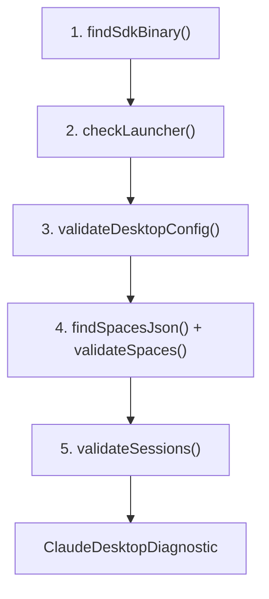

# Module Spec: claude-desktop-doctor

> **Status**: Active
> **Date**: 2026-07-10
> **Author**: @shahin
> **Audience**: engineers
> **Tags**: `engineering`
> **Variants**: Technical (this doc) - Readable (module-spec-claude-desktop-doctor.md in Obsidian vault: 04-Engineering/toolchain/cytoskills/) - Agent (n/a)

**Source**: `packages/core/src/claude-desktop-doctor.ts`
**Package**: `@cytognosis/cyto-skills`
**CLI**: `cyto-skills agent doctor-desktop`, `cyto-skills agent fix-launcher`,
`cyto-skills agent fix-paths`, `cyto-skills agent purge-cache`

## Purpose

The **claude-desktop-doctor** module diagnoses and repairs common
issues with Claude Desktop / Cowork installations on Linux. It was
created from lessons learned during a production migration
(`~/Documents/Claude` → `~/Claude`) that broke project visibility,
session configs, and SDK symlinks.

The module handles five categories of health checks:

| Category | What It Checks |
|----------|---------------|
| SDK binary | Finds the latest ELF binary across versioned dirs |
| Launcher | Verifies version-agnostic launcher script |
| Desktop config | Validates `claude_desktop_config.json` |
| Spaces | Checks that all space folder paths exist on disk |
| Sessions | Detects stale path references in session configs |

## API Surface

### Types

```typescript
interface ClaudeDesktopDiagnostic {
  sdkVersion: string | null;
  sdkBinaryPath: string | null;
  launcherInstalled: boolean;
  launcherVersionAgnostic: boolean;
  spacesCount: number;
  sessionsCount: number;
  staleSpaces: string[];
  staleSessions: string[];
  configValid: boolean;
  diagnostic: DiagnosticResult;
}
```

### Main Diagnostic Function

```typescript
async function doctorClaudeDesktop():
  Promise<ClaudeDesktopDiagnostic>
```

Runs a full diagnostic across all five categories. Returns a
structured result with a `DiagnosticResult` (from `doctor.ts`)
containing accumulated error/warning/info entries.

**Diagnostic flow**:



### SDK Binary Resolution

```typescript
function findSdkBinary():
  { version: string; path: string } | null
```

Finds the latest Claude Code SDK ELF binary across versioned
directories. Claude Desktop downloads SDK binaries into
`~/.config/Claude/claude-code/X.Y.Z/claude`. When apt updates
replace these directories, hardcoded symlinks break.

**Search strategy**:
1. Scan `~/.config/Claude/claude-code/` and
   `~/.config/Claude/claude-code-vm/`
2. Sort entries by semantic version (descending)
3. Check each candidate for ELF magic bytes (`0x7f 'E' 'L' 'F'`)
4. Return the first valid binary found

### Launcher Script Management

```typescript
function checkLauncher():
  { installed: boolean; versionAgnostic: boolean }

async function fixClaudeDesktopLauncher(): Promise<string>

function launcherScriptContent(): string
```

**`checkLauncher()`** inspects `~/.local/bin/claude` to determine
if it exists and whether it uses dynamic resolution (find + sort)
vs. hardcoded version paths.

**`fixClaudeDesktopLauncher()`** installs or updates the
version-agnostic launcher script at `~/.local/bin/claude`. The
script uses `find` + `sort -V` to dynamically resolve the latest
SDK binary at invocation time, surviving apt updates. Returns the
path to the installed script.

**`launcherScriptContent()`** returns the canonical bash launcher
script content. The script:
- Uses `set -euo pipefail` for safety
- Searches `claude-code/` then `claude-code-vm/` directories
- Validates candidates with `file -b` for ELF format
- Executes the resolved binary via `exec`

### Spaces Validation

```typescript
function findSpacesJson(): string | null

function validateSpaces(spacesJsonPath: string):
  { total: number; stale: string[] }

async function fixStaleSpacePaths(
  oldPathPrefix: string,
  newPathPrefix: string,
): Promise<number>
```

**`findSpacesJson()`** walks the
`~/.config/Claude/local-agent-mode-sessions/` directory tree
(account → org → `spaces.json`) to find the spaces configuration.

**`validateSpaces()`** parses `spaces.json` and checks that every
`folder` path exists on disk. Returns the total count and a list of
stale (nonexistent) paths.

**`fixStaleSpacePaths()`** performs a global string replacement of
`oldPathPrefix` with `newPathPrefix` in `spaces.json`. Returns the
number of replacements made.

### Session Config Validation

```typescript
function validateSessions(stalePrefix?: string):
  { total: number; stale: string[] }

async function fixSessionConfigs(
  oldPathPrefix: string,
  newPathPrefix: string,
): Promise<number>
```

**`validateSessions()`** recursively walks the sessions directory,
counting files matching `local_*.json`. If `stalePrefix` is
provided, reads each file and checks for the stale path string.

**`fixSessionConfigs()`** performs the same global string
replacement across all `local_*.json` session config files. Returns
the count of files modified.

### Desktop Config Validation

```typescript
function validateDesktopConfig(): {
  valid: boolean;
  coworkPath: string | null;
  coworkPathExists: boolean;
}
```

Reads `~/.config/Claude/claude_desktop_config.json` and validates:
- File exists and is valid JSON
- `coworkUserFilesPath` (if set) points to an existing directory

### Electron Cache Purging

```typescript
async function purgeElectronCache(): Promise<string[]>
```

Removes Electron renderer caches that become stale when folder paths
change. Purging forces a clean re-sync from the backend
(`spaces.json`). Returns the names of successfully purged caches.

**Targeted directories**:

| Cache Directory | Purpose |
|----------------|---------|
| `IndexedDB` | Structured client-side data |
| `Local Storage` | Key-value client data |
| `Session Storage` | Session-scoped client data |
| `Cache` | HTTP cache |
| `Code Cache` | V8 compiled code cache |
| `GPUCache` | GPU shader/rendering cache |

## Error Handling

All functions use defensive error handling:

- Filesystem operations wrap `try/catch` blocks and return `null`,
  empty arrays, or safe defaults on failure
- The main `doctorClaudeDesktop()` accumulates issues in
  `DiagnosticResult` rather than throwing
- Fix functions are idempotent and safe to re-run
- Cache purging silently skips locked directories (running app)

## Configuration Points

| Configuration | Source | Default |
|--------------|--------|---------|
| Home directory | `process.env.HOME` | `/home/mohammadi` |
| Claude config dir | Derived from HOME | `~/.config/Claude/` |
| Launcher path | Hardcoded | `~/.local/bin/claude` |
| SDK search dirs | Hardcoded | `claude-code/`, `claude-code-vm/` |
| Cache dirs | Hardcoded | 6 Electron cache subdirectories |

## Usage Examples

```typescript
import {
  doctorClaudeDesktop,
  fixClaudeDesktopLauncher,
  fixStaleSpacePaths,
  fixSessionConfigs,
  purgeElectronCache,
} from "@cytognosis/cyto-skills";

// Full diagnostic
const diag = await doctorClaudeDesktop();
console.log(diag.diagnostic.formatReport());

// Fix version-agnostic launcher
await fixClaudeDesktopLauncher();

// Fix paths after directory move
await fixStaleSpacePaths(
  "/home/user/Documents/Claude",
  "/home/user/Claude"
);
await fixSessionConfigs(
  "/home/user/Documents/Claude",
  "/home/user/Claude"
);

// Purge caches before restart
const purged = await purgeElectronCache();
```

## CLI Commands

| Command | Module Function |
|---------|----------------|
| `cyto-skills agent doctor-desktop` | `doctorClaudeDesktop()` |
| `cyto-skills agent fix-launcher` | `fixClaudeDesktopLauncher()` |
| `cyto-skills agent fix-paths <old> <new>` | `fixStaleSpacePaths()` + `fixSessionConfigs()` |
| `cyto-skills agent purge-cache` | `purgeElectronCache()` |
