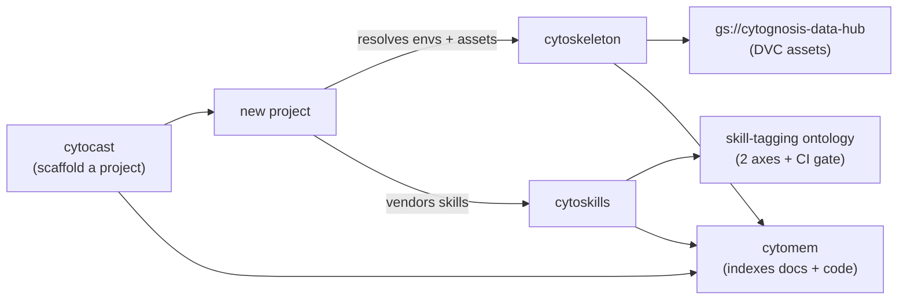

# Toolchain Platform Overview (readable)

> **Status:** Active · **Date:** 2026-07-01 · **Audience:** ADHD-friendly quick read

> [!NOTE]
> **TL;DR:** Toolchain is four repos that make Cytognosis engineering reproducible: **cytoskeleton** (environments + assets), **cytocast** (project scaffolder), **cytoskills** (agent skills), **cytomem** (memory/index). They chain together: scaffold a project, resolve its environment, vendor its skills, index everything.

## The four repos

| Repo | One-liner | You touch it when |
|---|---|---|
| **cytoskeleton** | Environments and assets as code (uv + DVC) | Building an env, tracking a dataset |
| **cytocast** | Copier scaffolder, 85 features baked in | Starting a new project |
| **cytoskills** | Discover, judge, deploy agent skills | Adding or tagging a skill |
| **cytomem** | Cross-repo memory + dedup oracle | Asking "where does this live?" |

## How they fit together

## Skill tags: two axes

> [!TIP]
> Every skill gets tagged on **what it does** (Axis A) and/or **which org function it serves** (Axis B). A CI gate fails any skill that has neither.

| Axis | File | Example |
|---|---|---|
| **A: use-case** | `cyto-se-usecase.ttl` | `cyto:se/quality` (linting, CI) |
| **B: org-function** | `cyto-org-function.ttl` | `apqc:pcf:11.2.3` (compliance) |

## Data rule

> [!IMPORTANT]
> Big files never go in git. Blobs live in the Data Hub via DVC; git keeps only the pointer (`*.dvc`), `manifest.yaml`, and `*.provenance.json`. Generated folders (`.venv`, `dist`, `site`, `node_modules`) are gitignored and rebuilt on demand.

## Watch-outs

> [!CAUTION]
> - **cytomem is hands-off** until the gated Wave 3 rebuild.
> - **Do not edit the main `docs`, `Yar`, or `cytoplex` working trees** while other agents hold them; use the `reorg/toolchain-2026-07-01` worktrees.
> - One open doc conflict: **mypy vs ty** as the type checker (standards says mypy, cytocast says ty). Verify before changing.

## Go deeper
Technical detail: `toolchain-overview.technical.md`. Fresh-agent brief: `toolchain-overview.agent.md`. Layer index: `README.md`.
