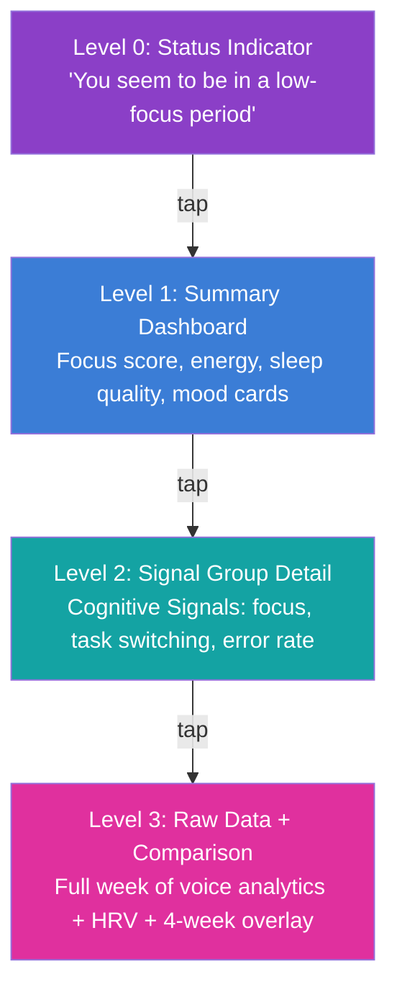
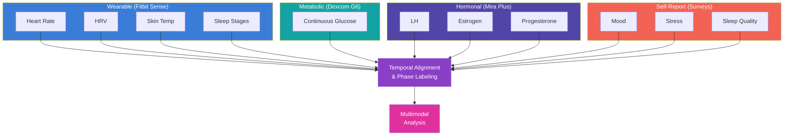
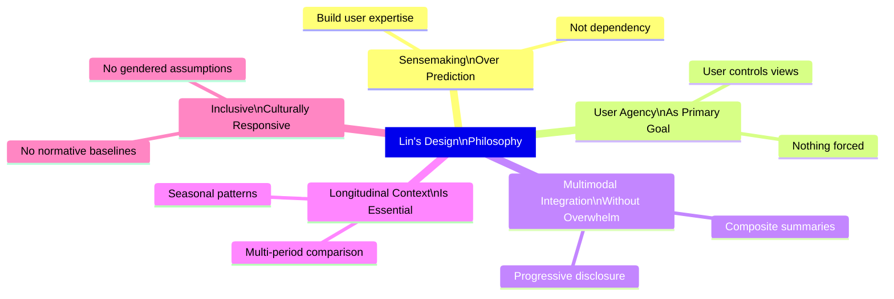
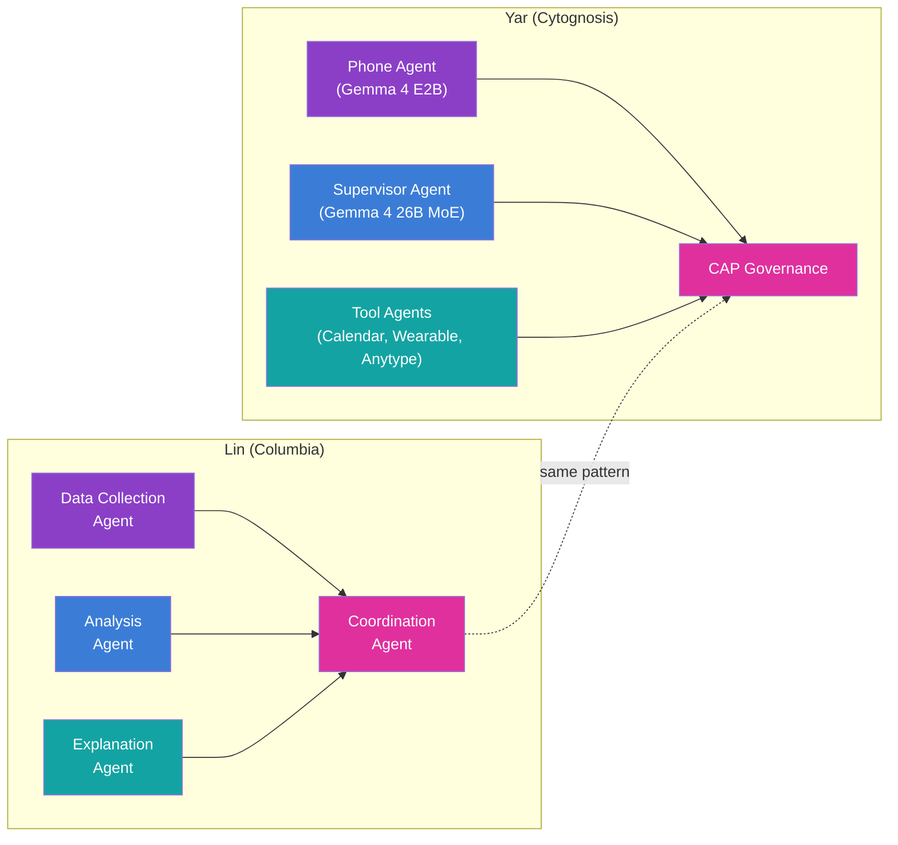

> **Status**: Active
> **Date**: 2026-05-29
> **Author**: \@mohammadi
> **Audience**: engineers
> **Tags**: `research`, `evaluation`

> [!NOTE]
> **TL;DR**: Blue (Georgianna) Lin is a Columbia postdoc whose menstrual health tracking research offers the single best design blueprint for Yar's cognitive state visualizations. Her 5 validated design requirements (CHI 2024) transfer directly: communicate predicted phases with variance, support multiple interaction patterns, personalize viewable signals, integrate educational content, and enable side-by-side comparison with context. Her progressive disclosure pattern (status → summary → detail → raw data) solves Yar's core UX challenge of presenting multimodal cognitive data without overwhelm.
> **Source**: [blue-lin-projects-deep-dive.md](blue-lin-projects-deep-dive.md)

---

## ⚡ Quick Start: Why Blue Lin Matters for Yar

> [!TIP]
> **Section summary**: Lin's menstrual health sensemaking research solves the same design problem Yar faces: helping users interpret complex, multimodal, longitudinal biological signals without overwhelm. Her work is the most rigorous, user-centered health data visualization research in HCI.

### Top 5 Takeaways for Yar

| Priority | Lin's Contribution | Yar Application |
|---|---|---|
| **P0** | Progressive disclosure pattern | Cognitive state views: status → summary → detail → raw |
| **P0** | 5 functional design requirements (CHI 2024) | Direct transfer to cognitive state tracking UX |
| **P0** | Phase-coded visualizations | Color-code focus/transition/rest/recovery states |
| **P1** | Longitudinal multi-cycle comparison | Multi-week focus score overlays |
| **P1** | Cognitive strategies framework (IMWUT 2025) | AI agent supports user sensemaking, not replacing it |

> [!IMPORTANT]
> This is NOT a competitor analysis. Lin's work is academic research, not a commercial product. This document studies her design patterns, visualization techniques, and methodological approaches as inspiration for Yar's health-aware cognitive companion features.

---

## 🧑‍🔬 Researcher Profile

> [!TIP]
> **Section summary**: Blue Lin is a postdoc at Columbia Biomedical Informatics, with a PhD from UofT. Google PhD Fellow. Her dissertation focused on multimodal menstrual health sensemaking. Now building multi-agent health systems, the closest academic research to Yar's architecture.

### Academic Background

| Attribute | Detail |
|---|---|
| **Name** | Georgianna "Blue" Lin |
| **Current Role** | Postdoctoral Research Fellow, Columbia University |
| **Co-Advisors** | Xuhai "Orson" Xu, Noémie Elhadad |
| **PhD** | Computer Science, University of Toronto (2024) |
| **PhD Advisors** | Khai N. Truong, Alex Mariakakis |
| **Prior Education** | B.S. and M.S. in Computer Science, Georgia Tech |
| **Research Areas** | HCI, health informatics, AI/ML, ubiquitous computing |
| **Awards** | Google PhD Fellowship (2023), Bill Buxton Outstanding Dissertation Award |

### Research Identity

Lin describes her work as "augmenting health and wellbeing, particularly for marginalized communities, through multimodal ubiquitous technologies." This directly parallels Cytognosis's mission. Her consistent focus on user agency over automated decision-making, on sensemaking over prediction, and on inclusivity over convenience makes her a natural reference point.

---

## 📚 Publication Timeline

> [!TIP]
> **Section summary**: 7 publications forming a coherent research arc from user studies → design requirements → prototypes → dataset release → AI agents. Each paper builds on the previous.

### Research Arc


### Publication Table

| Year | Venue | Topic | Yar Relevance |
|---|---|---|---|
| 2023 | npj Digital Medicine | CGM-menstrual cycle glucose correlation | Consumer wearable data contains meaningful bio signals |
| 2024 | npj Women's Health | Wrist skin temp ↔ hormone variations | Wearable proxies for internal states |
| 2024 | CHI | **5 Functional Design Requirements** for health data exploration | **Direct transfer to Yar UX** |
| 2024 | IMWUT/UbiComp | User perspectives on multimodal tracking | Longitudinal study validation |
| 2025 | IMWUT | **Cognitive Strategies** behind health sensemaking | Framework for Yar's AI agent behavior |
| 2026 | Scientific Data | mcPHASES dataset release (PhysioNet) | Open-science model for Cytognosis |
| Ongoing | Columbia | Multi-agent systems for longitudinal health | Architecture mirror of Yar |

---

## 🎯 The 3 Design Failures Lin Identified

> [!TIP]
> **Section summary**: Lin argues existing health trackers fail in 3 ways. Replace "menstrual health" with "cognitive/emotional state" and these describe Yar's exact challenge space.

| Failure | In Menstrual Trackers | In Cognitive/Mood Trackers (Yar's Domain) |
|---|---|---|
| **Reductionism** | Reduce cycle to a single date prediction | Reduce mood to happy/sad, productivity to high/low |
| **Passive collection** | Collect data, provide no interpretation support | Log but don't help users understand patterns |
| **One-size-fits-all** | Assume 28-day cycle, ignore variation | Assume neurotypical baseline, ignore ND diversity |

---

## 🏗️ The 5 Functional Design Requirements (CHI 2024)

> [!TIP]
> **Section summary**: The most directly actionable output for Yar. 5 validated requirements from 30 participant interviews + 2 design probes. Each one maps cleanly to Yar's cognitive state tracking.

| # | Requirement | What Lin Means | Yar Parallel |
|---|---|---|---|
| DR1 | **Predicted phases + variance** | Show "what to expect" with expected variability, not just "when" | "Your focus typically dips in the afternoon, ±1 hour" |
| DR2 | **Multiple interaction patterns** | Daily check-ins, weekly trends, deep-dive episodes | Daily check-ins, weekly reflections, crisis-only mode |
| DR3 | **Personalized signals** | Users choose which signals matter and arrange dashboards | ADHD user tracks focus/impulsivity; autistic user tracks sensory load |
| DR4 | **Educational resources** | Explain biological connections between tracked signals | "Why does sleep affect focus?" "How does exercise change mood?" |
| DR5 | **Side-by-side comparison** | Compare cycles with contextual annotations | "Your focus was better this week vs. last; you slept more consistently" |

### Design Probes: Two Mental Models

Lin built two proof-of-concept interfaces to validate the requirements:

| Probe | Primary Axis | Who Preferred It | Yar Equivalent |
|---|---|---|---|
| **Probe A: Phase-Centric** | Cycle phases as main organizer, signals nested within | Users wanting biological context | Cognitive state phases (focus/transition/rest/recovery) as primary view |
| **Probe B: Signal-Centric** | Individual signals as main organizer, phases overlaid | Power users doing hypothesis testing | Individual signal timelines (sleep, HRV, mood) with state phases as background color |

> [!IMPORTANT]
> Neither probe was universally preferred. The effective design supports **both** mental models and lets users switch between them. This mirrors Tana's multi-view rendering and Capacities' view composability.

---

## 📊 Visualization Techniques Catalog

> [!TIP]
> **Section summary**: 9 specific visualization techniques from Lin's work, each mapped to Yar. The progressive disclosure pattern is the most transferable.

### Technique Matrix

| Technique | Cognitive Load | Yar Application |
|---|---|---|
| **Phase-coded timeline** | Low | Color-code daily timeline by cognitive state |
| **Multi-cycle overlay** | Medium | Overlay weekly focus scores by day-of-week |
| **Circular timeline** | Medium | Radial view of circadian cognitive patterns (24h clock) |
| **Signal heatmap** | Medium-High | Week-by-hour heatmap of focus/energy levels |
| **Correlation sparklines** | Low | Inline charts showing sleep ↔ focus correlation |
| **Anomaly markers** | Low | Badges when today deviates from personal norm |
| **Contextual annotation overlay** | Low | Life event markers visible across all views |
| **Progressive disclosure dashboard** | Low initially | Default: state card → Tap: signal groups → Tap: raw data |
| **Empathetic data framing** | N/A | "Your focus was lower today" NOT "You had a bad day" |

### 🔑 Progressive Disclosure Pattern (Most Important)



### Cytognosis Color System for Cognitive Signals

| Signal Domain | Color | Hex | Source Dye |
|---|---|---|---|
| Focus/Cognition | Azure | #3B7DD6 | Alexa Fluor |
| Energy/Vitality | Magenta | #E0309E | Rhodamine |
| Mood/Emotional | Violet | #8B3FC7 | DAPI |
| Sleep/Recovery | Teal | #14A3A3 | GFP |
| Stress/Load | Coral | #F26355 | MitoTracker |

### Data-Dense Yet Digestible Micro-Patterns

| Pattern | What It Does | Why It Works |
|---|---|---|
| Semantic color coding | Consistent color per signal across all views | Users learn the color language, scan faster |
| Sparklines over full charts | Tiny inline charts instead of full-size | Trend info without screen real estate cost |
| Trend arrows (↑ → ↓) | Directional indicators next to current values | Instant trend context |
| Confidence indicators | Shaded uncertainty bands on predictions | Honest about what the system knows |

---

## 📦 The mcPHASES Dataset

> [!TIP]
> **Section summary**: First comprehensive public multimodal menstrual health dataset. 42 participants, 3-6 months, 4 modalities, 23 tables. Released on PhysioNet. The data schema design is a direct model for Yar's SQLite schema.

### Dataset Overview

| Attribute | Detail |
|---|---|
| **Participants** | 42 young adult menstruators (Canada) |
| **Duration** | 3 months initial; 20 extended to 6 months |
| **Modalities** | 4 (wearable, metabolic, hormonal, self-reported) |
| **Tables** | 23 organized by signal category |
| **Wearable** | Fitbit Sense (HR, HRV, skin temp, sleep, SpO2, steps) |
| **Metabolic** | Dexcom G6 CGM (every 5 min) |
| **Hormonal** | Mira Plus urinalysis (LH, E3G, PdG) |
| **Self-Report** | Daily surveys: lifestyle, stress, sleep quality, mood |

### Data Architecture



### Key Findings

| Study | Finding | Yar Relevance |
|---|---|---|
| Blood Glucose (2023) | Glucose follows biphasic pattern across cycle; peaks in luteal phase | Consumer wearable data has real biological signal when analyzed longitudinally |
| Wrist Skin Temp (2024) | Nightly wrist temp correlates with hormone levels | Wearable proxies can detect internal state changes |

> [!IMPORTANT]
> These findings prove that consumer wearable data contains meaningful biological signals when analyzed longitudinally and correlated with self-report. Yar's planned wearable integration (Fitbit, Apple Watch, Oura via HealthKit/Health Connect) can extract cognitive-relevant signals: HRV as stress proxy, sleep architecture as cognitive readiness predictor, step patterns as circadian regularity indicator.

<details>
<summary>📋 mcPHASES schema structure (23 tables)</summary>

```
mcPHASES/
├── participant_metadata/
│   ├── demographics.csv
│   └── study_timeline.csv
├── wearable/
│   ├── heart_rate.csv
│   ├── hrv.csv
│   ├── skin_temperature.csv
│   ├── sleep_stages.csv
│   ├── spo2.csv
│   └── steps.csv
├── metabolic/
│   └── glucose.csv
├── hormonal/
│   ├── lh.csv
│   ├── e3g.csv
│   └── pdg.csv
├── self_report/
│   ├── daily_survey.csv
│   ├── symptoms.csv
│   ├── lifestyle.csv
│   └── mood.csv
└── derived/
    ├── cycle_phases.csv
    ├── phase_labels.csv
    └── signal_summaries.csv
```

**Design principles**: Separate tables per signal (modular), derived tables for computed values, temporal alignment in integration layer (not storage), consistent temporal keys for joining. Yar's SQLite schema should follow the same pattern.

</details>

---

## 🧠 Design Philosophy: 5 Core Principles

> [!TIP]
> **Section summary**: Lin's work reveals 5 consistent design principles. "Sensemaking over prediction" is the most important. Each principle maps directly to Yar's persona schema and feature design.

### Principles at a Glance



### Detailed Principle Mapping

| # | Principle | Lin's Evidence | Yar Adoption |
|---|---|---|---|
| 1 | **Sensemaking > Prediction** | CHI 2024: prediction-focused trackers create dependency | Help users understand patterns, not automate scheduling |
| 2 | **User Agency First** | Probes offer multiple views, optional education, no forcing | `shame_avoidance: true`, `authority_level: "companion"`, never dictate |
| 3 | **Multimodal Without Overwhelm** | 23 tables, never shown simultaneously; progressive disclosure | Default: composite state card → drill into signal groups → raw data |
| 4 | **Longitudinal Context** | 3-6 month datasets; multi-cycle superposition; IMWUT 2025 | Weekly reflections compare to prior weeks; seasonal patterns auto-surfaced |
| 5 | **Inclusive, Culturally Responsive** | Gender diversity in recruitment; no normative assumptions | Don't pathologize ND; each user's baseline is their own |

---

## 🚫 Design Anti-Patterns (What to Avoid)

> [!TIP]
> **Section summary**: 5 common health app anti-patterns that Lin's work critiques. Yar must avoid all of them.

| Anti-Pattern | What It Looks Like | Lin's Alternative | Yar Rule |
|---|---|---|---|
| **Streak gamification** | Daily login streaks, badges, guilt on missing | No gamification; data is intrinsically motivating | `shame_avoidance: true` |
| **Normative comparison** | "Your cycle is X vs. average 28 days" | Compare to your own history | Compare focus to user's own baseline, never NT ideal |
| **Prediction overconfidence** | "Your period starts [date]" without uncertainty | Communicate variance ranges | "Focus typically dips 2-4pm, with moderate variability" |
| **Data hoarding** | Collect everything, show little | Collect purposefully, show meaningfully | Every data point must have visible, user-facing purpose |
| **Pink-washing** | Gendered aesthetic excluding non-binary users | Neutral, customizable design | Cytognosis brand: scientific, dark, fluorescence-inspired |

---

## 🧩 Cognitive Strategies Framework (IMWUT 2025)

> [!TIP]
> **Section summary**: Lin identified 6 cognitive strategies users employ when interpreting health data. Yar's AI agent should SUPPORT these strategies, not replace them.

| Strategy | User Behavior | AI Support Opportunity |
|---|---|---|
| **Hypothesis formation** | "I think sleep affects my cramps" | Suggest hypotheses from detected correlations |
| **Signal triangulation** | Compare sleep + mood + activity together | Present correlated signals together; highlight agreement/disagreement |
| **Temporal anchoring** | "During that stressful week, everything was off" | Auto-detect event anchors, offer as interpretation frames |
| **Pattern recognition** | "Every third week, my energy drops" | Surface recurring patterns with statistical confidence |
| **Anomaly detection** | "My glucose was unusually high this week" | Flag anomalies relative to personal baselines, not population norms |
| **Causal reasoning** | "When I exercise more, I sleep better" | Provide correlation data; explicitly note correlation ≠ causation |

> [!WARNING]
> Lin's work explicitly cautions that users sometimes form **incorrect causal hypotheses** from correlational data. Yar's agent must support hypothesis testing without reinforcing unfounded causal claims. Yar can say "These signals often move together in your data" but NOT "X causes Y." This aligns with CAP's non-diagnostic constraint.

---

## ♿ Accessibility and Inclusivity Patterns

> [!TIP]
> **Section summary**: 4 inclusivity patterns from Lin's work. Gender-inclusive tracking, health literacy scaffolding, cultural responsiveness, and capture burden reduction. All transfer directly to Yar's neurodivergent user base.

### Pattern Summary

| Pattern | Lin's Implementation | Yar Adoption |
|---|---|---|
| **Gender-inclusive tracking** | "People who menstruate" not "women"; gender-diverse recruitment | Never assume neurotype from behavior; neutral pattern labels |
| **Health literacy scaffolding** | Contextual explainers, connection explainers, progressive depth | "What is working memory?" "Why does sleep affect focus?" at varying literacy levels |
| **Culturally responsive design** | No assumed prior knowledge; respect cultural sensitivities | ND is perceived differently across cultures; adaptable persona and content |
| **Reducing capture burden** | Minimize required inputs; leverage passive sensing; contextual prompting | Voice-first capture (lower friction than typed); HuBERT infers state from prosody |

### Capture Burden Comparison

| Approach | Friction Level | Lin Uses | Yar Uses |
|---|---|---|---|
| Typed self-report surveys | High | ✅ (daily surveys) | ❌ (avoid as primary) |
| Wearable passive sensing | Very Low | ✅ (Fitbit, Dexcom, Mira) | ✅ (HealthKit/Health Connect) |
| Voice-first capture | Low | ❌ | ✅ (primary modality) |
| Voice prosody inference | Zero (passive) | ❌ | ✅ (HuBERT pipeline) |
| Contextual prompting | Low | ✅ (morning, bedtime) | ✅ (end of focus session, before bed) |

---

## 🔗 Cross-Reference: Lin's Concepts → Yar's Layers

> [!TIP]
> **Section summary**: Every Lin concept mapped to a specific Yar architecture layer with implementation path. This is the bridge from "inspiration" to "engineering."

| Lin Concept | Yar Layer | Implementation Path |
|---|---|---|
| Multimodal data collection | Layer 1 (Edge AI) + Layer 6 (Voice) | Voice prosody (HuBERT) + wearable data + self-report |
| Sensemaking support | Layer 5 (UI Framework) | Progressive disclosure dashboards (Flutter mobile, React desktop) |
| Cognitive strategies framework | Layer 7 (Persona) + AI Agent | Agent supports hypothesis formation, signal triangulation |
| Phase-coded visualizations | Layer 5 (UI Framework) | Cognitive state phases → Cytognosis color system |
| Longitudinal comparison | Layer 4 (Storage & KG) | SQLite with temporal alignment; queries as first-class objects |
| Educational resources | Knowledge Base | Neuroscience explainers; voice-first delivery option |
| Dataset release (mcPHASES) | Open-science mission | Anonymized cognitive state datasets on PhysioNet (future, with IRB) |
| Multi-agent health systems | Layer 2 (Runtime) + Layer 3 (CAP) | Phone agent + supervisor agent + tool agents |
| Inclusive design | Layer 7 (Persona) + UI | Culturally responsive persona; neurotype-neutral language |

---

## 📊 Gap Analysis: What Lin Does That Yar Doesn't (Yet)

> [!TIP]
> **Section summary**: 8 capabilities from Lin's work that Yar has not yet implemented, prioritized by phase. Multi-week comparison views and contextual annotation are the highest priority gaps.

| Capability | Lin's Status | Yar Status | Priority |
|---|---|---|---|
| Multi-week comparison views | Validated design probes | Not implemented | **HIGH — Phase 2** |
| Contextual annotation system | Life events across signal views | Not designed | **HIGH — Phase 2** |
| Uncertainty communication | Confidence bands on predictions | Not designed | **HIGH — Phase 2** |
| Signal group customization | User-defined groupings | Not designed | MEDIUM — Phase 3 |
| Educational content integration | Contextual explainers | Not planned | MEDIUM — Phase 3 |
| Correlation highlighting | AI-surfaced cross-modal correlations | Planned (paralinguistic sensor) | HIGH — Phase 3 |
| Circular/radial time visualization | Design probes | Not explored | LOW — Phase 4 |
| Public dataset release | mcPHASES on PhysioNet | Not planned | LOW — Future |

### What Yar Does That Lin Doesn't

| Capability | Yar | Lin's Work |
|---|---|---|
| Voice-first interaction | HuBERT emotion sensing + Gemma reasoning | Survey-based self-report |
| Real-time emotional detection | Paralinguistic sensor pipeline | Retrospective survey data |
| On-device AI agent | Gemma 4 on-device with CAP safety | Cloud-based analysis |
| Safety boundaries (CAP) | Clinical-adjacent safety protocol | No safety framework |
| ND-specific accommodations | Shame avoidance, focus modes, communication translation | General population design |
| Cognitive companion persona | Persistent, personality-consistent agent | Research tools, not companions |
| Distributed multi-device runtime | Phone + laptop + cloud with HA failover | Single-device collection |

---

## 🔄 Transferable Tracking Patterns

> [!TIP]
> **Section summary**: 5 tracking patterns from menstrual health that transfer directly to cognitive state tracking, plus 5 novel patterns inspired by (but not in) Lin's work.

### Direct Transfers

| Pattern | Menstrual Health | Cognitive Health (Yar) |
|---|---|---|
| **Phase-based organization** | Organize by cycle phase | Organize by cognitive phase: peak focus, transition, low energy, recovery |
| **Personal baseline** | Intrapersonal variability, not population norm | Each user's "normal" is their own; never compare to NT norm |
| **Contextual correlation** | Glucose makes sense only with cycle phase + exercise + diet | Focus makes sense only with sleep + time of day + medication + environment |
| **User-initiated hypothesis testing** | "My cramps are worse when I don't exercise" | "I focus better after morning exercise" → structured comparison |
| **Temporal alignment** | Align cycles by phase onset, not calendar date | Align weeks by wake time, not clock time |

### Novel Patterns for Yar (Inspired by Lin)

| Pattern | Inspiration | Yar Application |
|---|---|---|
| **Voice-as-passive-sensor** | Lin uses wearables as passive sensors | Voice prosody during sessions as passive cognitive state sensor |
| **Emotional aftercare tracking** | Lin's post-study reflections | Track state before, during, and after difficult tasks |
| **Communication difficulty index** | Lin's multimodal sensemaking | Track effort per context (text vs. voice, familiar vs. unfamiliar) |
| **Sensory load budget** | Metabolic tracking (glucose as energy proxy) | Cumulative sensory input as a "budget" depleting over the day |
| **Masking fatigue detector** | Symptom-phase correlation | Detect masking (high social performance + rising stress) → suggest breaks |

---

## 🤖 Multi-Agent Health Systems (Columbia)

> [!TIP]
> **Section summary**: Lin's current Columbia postdoc research on multi-agent health systems is the closest academic mirror to Yar's architecture. Monitor this closely.

### Architecture Parallel



> [!IMPORTANT]
> Lin's Columbia work on multi-agent health systems is the closest academic research to Yar's architecture. Consider reaching out for potential collaboration or advisory relationship, given alignment between Cytognosis's open-science mission and her research infrastructure contributions (mcPHASES).

---

## ✅ Actionable Recommendations for Yar

> [!TIP]
> **Section summary**: 14 recommendations organized by phase. 6 immediate (Phase 1-2), 4 near-term (Phase 3), 4 strategic (Phase 4+). Progressive disclosure and cognitive state phases are highest impact.

### Phase 1-2: Immediate

| # | Recommendation | Effort | Impact |
|---|---|---|---|
| 1 | Implement progressive disclosure for cognitive state views | Medium | **HIGH** |
| 2 | Define cognitive state "phases" with Cytognosis color coding | Low | **HIGH** |
| 3 | Add uncertainty communication to all predictions | Low | MEDIUM |
| 4 | Support daily check-in AND weekly reflection interaction patterns | Medium | **HIGH** |
| 5 | Implement longitudinal comparison views (this week vs. last) | Medium | **HIGH** |
| 6 | Add contextual annotation system (life events, medication changes) | Medium | **HIGH** |

### Phase 3: Near-Term

| # | Recommendation | Effort | Impact |
|---|---|---|---|
| 7 | Build signal group customization | Medium | MEDIUM |
| 8 | Integrate educational content (neuroscience explainers) | High | MEDIUM |
| 9 | Implement AI-powered correlation highlighting | High | **HIGH** |
| 10 | Support hypothesis testing workflow | High | **HIGH** |

### Phase 4+: Strategic

| # | Recommendation | Effort | Impact |
|---|---|---|---|
| 11 | Explore circular/radial time visualizations | Medium | LOW |
| 12 | Release anonymized cognitive state datasets | Very High | STRATEGIC |
| 13 | Monitor Lin's Columbia multi-agent publications | Ongoing | STRATEGIC |
| 14 | Evaluate cultural adaptation framework for Yar's persona | High | MEDIUM |

---

## 💡 6 Key Lessons for Yar

> [!TIP]
> **Section summary**: The 6 core lessons distilled from Lin's entire body of work. "Sensemaking is the product" is the headline.

| # | Lesson | One-Liner |
|---|---|---|
| 1 | **Sensemaking is the product** | Data collection is table stakes; helping users understand is the real value |
| 2 | **The 5 DRs transfer directly** | Communicate phases, support interaction patterns, personalize signals, educate, compare |
| 3 | **Progressive disclosure is essential** | Multimodal data needs status → summary → detail → raw layering |
| 4 | **Longitudinal patterns > real-time data** | Single-day scores are noise; months reveal the user's cognitive signature |
| 5 | **Context transforms data into insight** | A focus dip means nothing without knowing the user was traveling/stressed/sick |
| 6 | **Inclusive design is foundational** | Don't pathologize ND; personal baselines, not population norms; respect cultural context |

---

## 🔗 The Fundamental Parallel

> [!TIP]
> **Section summary**: Menstrual health tracking and cognitive state tracking share deep structural parallels across 8 dimensions. This is why Lin's work transfers so cleanly.

| Dimension | Menstrual Health | Cognitive/Emotional State |
|---|---|---|
| **Temporal pattern** | Cyclical (~28 days, variable) | Circadian, ultradian (90-min), weekly, seasonal |
| **Data modalities** | Wearable + hormonal + metabolic + self-report | Voice prosody + behavioral + wearable + self-report |
| **User goal** | Understand body, predict states, manage symptoms | Understand cognition, predict states, manage executive function |
| **Key challenge** | Multimodal integration without overwhelm | Multimodal integration without overwhelm |
| **Design failure** | Reductionism (period = one date) | Reductionism (mood = happy/sad) |
| **Individual variation** | Enormous (21-35 day cycles) | Enormous (ADHD, autism, dyslexia, combined) |
| **Cultural sensitivity** | Gender, stigma, health literacy | ND stigma, cultural attitudes, disability politics |
| **Sensemaking question** | "Why do I feel this way during this phase?" | "Why can I focus some days and not others?" |

---

## 📖 Glossary

<details>
<summary>Expand terminology table</summary>

| Term | Definition |
|---|---|
| **Blue Lin** | Georgianna "Blue" Lin, postdoctoral researcher at Columbia University studying health data sensemaking. |
| **mcPHASES** | Menstrual cycle Physiological, Hormonal, and Self-Reported Events and Symptoms. Public dataset on PhysioNet. |
| **Design Probe** | A proof-of-concept interface built to validate design hypotheses with real users. |
| **Sensemaking** | The process of constructing meaning from complex data; distinct from prediction or automation. |
| **Progressive Disclosure** | UI pattern that reveals complexity in layers: summary first, detail on demand. |
| **Phase-Coded Visualization** | Color-coding background regions by biological/cognitive phase while plotting data on top. |
| **Multi-Cycle Superposition** | Overlaying multiple time periods on the same axes, aligned by phase rather than calendar date. |
| **DR1-DR5** | Lin's 5 Functional Design Requirements from CHI 2024. |
| **HuBERT** | Hidden-Unit BERT. Self-supervised speech representation model used for emotion detection from voice. |
| **CAP** | Control Authority Protocol. Yar's safety boundary framework for agent actions. |
| **Paralinguistic Sensor** | Yar's voice analysis pipeline extracting cognitive/emotional state from prosody, jitter, shimmer. |
| **HRV** | Heart Rate Variability. Proxy for autonomic nervous system state; correlates with stress and recovery. |
| **CGM** | Continuous Glucose Monitor. Wearable device measuring blood glucose every 5 minutes. |
| **PhysioNet** | Open-access repository for physiological and clinical research data. |
| **IMWUT** | Proceedings of the ACM on Interactive, Mobile, Wearable and Ubiquitous Technologies. |
| **CHI** | ACM Conference on Human Factors in Computing Systems. Premier HCI venue. |
| **Cognitive State Phases** | Yar's proposed classification: peak focus, transition, low energy, recovery. |
| **Signal Triangulation** | Comparing multiple data signals to validate or invalidate a hypothesis. |
| **Temporal Anchoring** | Using specific events as reference points for interpreting data patterns. |

</details>

---

## 🔜 What's Next?

- [[blue-lin-projects-deep-dive]] — Full source document reference stub
- capacities-deep-dive_adhd (target archived/removed) — Capacities deep dive (related design inspiration)
- yar-unified-feature-comparison_adhd (target archived/removed) — Unified feature comparison for Yar (if available)

➡️ **Priority actions**: Implement progressive disclosure for cognitive state views (Rec #1), define cognitive state phases with Cytognosis color coding (Rec #2), and build the longitudinal comparison view (Rec #5).