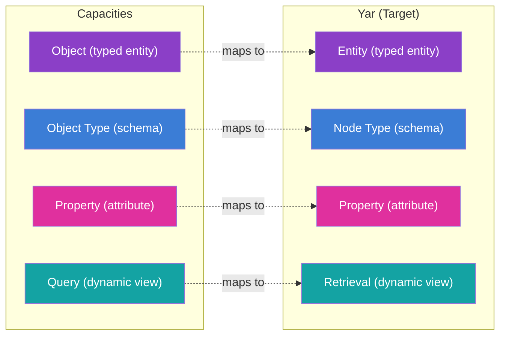
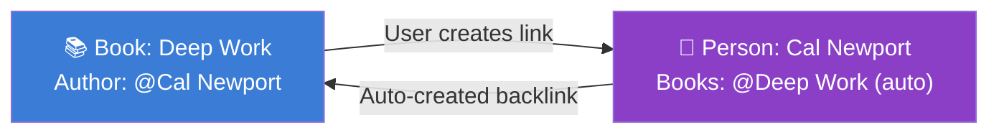
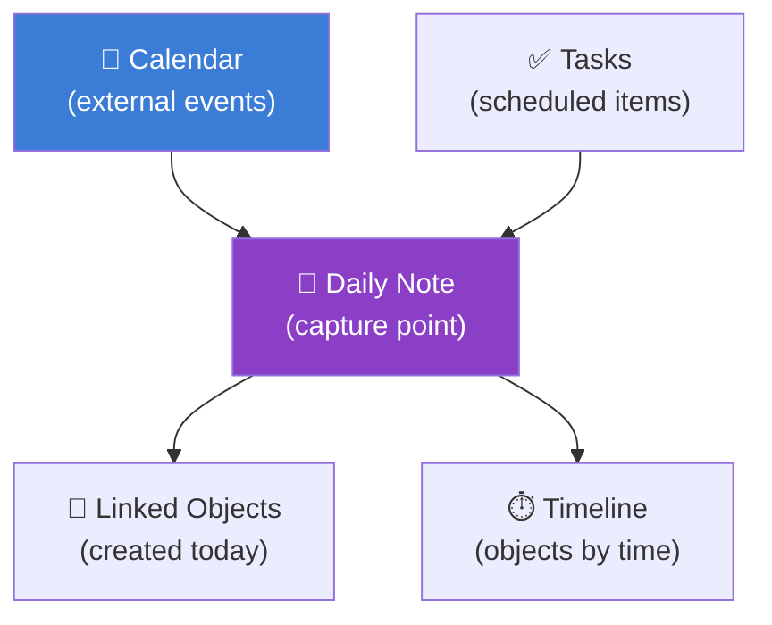

> **Status**: Active
> **Date**: 2026-05-29
> **Author**: \@mohammadi
> **Audience**: engineers, stakeholders
> **Tags**: `yar`, `competitive`, `capacities`, `evaluation`

> [!NOTE]
> **TL;DR**: Capacities.io is an object-oriented PKM tool where "everything is a typed thing." Its Object Studio, multi-view data visualization, and two-way linking are the top 3 features for Yar to adopt. Key design lesson: "thinking in things" is more intuitive than "everything is a node." Yar should adopt a **hybrid** approach: Capacities' upfront types + Tana's schema inheritance. The full 80-item feature mapping identifies 8 P0 must-haves for Yar MVP.
> **Source**: [capacities-deep-dive.md](capacities-deep-dive.md)

---

## ⚡ Quick Start: Why Capacities Matters for Yar

> [!TIP]
> **Section summary**: Capacities is the most intuitive implementation of "object-oriented knowledge management" available. Its core philosophy, "thinking in things," gives Yar a better UX model for health data than flat nodes or generic notes.

### Top 5 Features for Yar

| Priority | Capacities Feature | Yar Application | Effort |
|---|---|---|---|
| **P0** | Object Studio (typed entities) | Entity type creation UX | Medium |
| **P0** | Multi-view data visualization | Entity collection rendering | High |
| **P0** | Two-way linked properties | Bidirectional relationship management | Medium |
| **P1** | Daily notes as capture funnel | Health journal entry point | Low |
| **P1** | Contextualized task management | Health action tracking | Medium |

### Architecture Mapping

---

## 🔬 Product Overview

> [!TIP]
> **Section summary**: Capacities is a "Studio for Your Mind." It is independently funded (not VC-backed). The free tier is generous: unlimited spaces, objects, and custom types. Pro adds AI and smart queries.

### Pricing

| Plan | Monthly | Key Features | Limits |
|---|---|---|---|
| **Basic (Free)** | $0 | Unlimited spaces, objects, types, sync, offline | 5GB storage, no AI |
| **Pro** | ~$9.99 | AI assistant, unlimited storage, smart queries, API | Fair-use |
| **Believer** | ~$12.49 | Everything in Pro + beta access | Supports indie dev |

### Platforms

| Platform | Status |
|---|---|
| Desktop (macOS, Windows, Linux) | ✅ Full |
| Mobile (iOS, Android) | ✅ Full |
| Web | ✅ Full |

> [!IMPORTANT]
> Capacities migrated from a **dedicated graph database** to **Postgres** in early 2026. They maintained the "graph feel" while gaining reliability. This mirrors what Yar may need to consider (Postgres with graph-like queries vs. native graph DB like SurrealDB).

---

## 🏗️ Object System

> [!TIP]
> **Section summary**: Everything is a typed object. There are 11 built-in types (Page, Tag, Image, etc.) and unlimited custom types via **Object Studio**. Properties are schema-consistent: adding a property to a type applies it to ALL instances.

### Built-in Object Types (11)

| Type | Purpose |
|---|---|
| **Page** | Simple note-taking |
| **Tag** | Cross-object categorization |
| **Image** | Image files with AI analysis |
| **Weblink** | URLs with auto-metadata |
| **PDF** | In-app reading and annotation |
| **Audio** | Audio files |
| **AI Chat** | Persisted AI interaction sessions |
| **Query** | Saved dynamic views |
| **Table** | Spreadsheet-style data |
| **Tweet** | Social media posts (legacy) |
| **Files** | Generic file uploads |

### Custom Object Types (Object Studio)

**Schema Consistency Rule**: When you add a property to a type, it applies to **every** object of that type. No per-instance variations (unlike Tana).

### Property Types

| Property Type | Description | Best For |
|---|---|---|
| **Text** | Formatted text, AI auto-fill | Notes, descriptions |
| **Number** | Decimal, integer, currency, % | Metrics, dosages |
| **Checkbox** | Boolean toggle | Status flags |
| **Date** | Date/datetime | Scheduling, tracking |
| **Object Select** | Reference to other objects | **Relationships** (most powerful) |
| **Labels** | Dropdown/multi-select | Status, priority, category |

### ⭐ Object Select & Two-Way Linking

**Object Select** is the most powerful property type. It creates typed, managed relationships between objects.

When you add "Cal Newport" as the Author of "Deep Work," the Person object for Cal Newport **automatically** shows "Deep Work" in its Books property.

💡 101: Two-way linking vs regular linking

In most note apps, if you link Note A to Note B, Note B does not know about Note A unless you manually add a backlink. **Two-way linking** means the system automatically creates and maintains links in both directions. Change one side, the other updates. Delete one side, the reference is cleaned up.

| Labels vs Object Select | Labels | Object Select |
|---|---|---|
| Data source | Fixed set in type settings | Dynamic: all objects of target type |
| Two-way linking | No | Yes (custom types only) |
| Graph impact | No edges created | Creates edges in graph view |
| Best for | Status, priority | Authors, related projects |

---

## 🏗️ Views and Data Visualization

> [!TIP]
> **Section summary**: Capacities has 4 view types (Table, Wall/Gallery, List, Board/Kanban). Kanban boards are not a dedicated feature; they emerge from combining Board view + Group By on a Status label. This composable approach is the key design insight.

### View Types

| View | Best For | Key Feature |
|---|---|---|
| **Table** | Detailed comparison, bulk editing | Full property visibility |
| **Wall/Gallery** | Visual content, images | Customizable cards |
| **List** | Quick scanning | Clean, fast |
| **Board/Kanban** | Workflow management | Drag-and-drop updates property |

### Queries (Dynamic Views)

Queries are the core mechanism for auto-updating views. They filter by type, property values, tags, collections, and date.

**Queries are objects themselves**, meaning they can be linked, embedded, tagged, and searched.

📋 Query configuration options

| Parameter | Options |
|---|---|
| Object types | Filter to specific types |
| Property filters | Match on property values |
| Tag filters | Include/exclude by tags |
| Collection filters | Include/exclude by collections |
| Sort | By any property, ascending/descending |
| Group by | Any property (date granularity: day/month/year) |
| Layout | Table, Wall, List, Board |

> [!TIP]
> **Kanban boards in Capacities** are not a built-in feature. They emerge from: Board view + Group By Status label. Any object type can become a Kanban board by adding a Status label and switching to Board view.

---

## 🔬 Graph Visualization

> [!TIP]
> **Section summary**: Built-in force-directed graph view with filtering by type, hub-node removal, and a simplified "colored dots" mode. A separate **Tag Network Graph** shows topic-to-topic connections.

| Feature | Description |
|---|---|
| Force-directed layout | Nodes cluster by connection density |
| Type filtering | Hide specific types (e.g., daily notes, images) |
| Hub filtering | Remove highly-connected noise nodes |
| Simplified view | Colored dots instead of full labels |
| Local/ego graph | View connections of a single object |
| Tag network graph | Topic-to-topic connections |

---

## 📅 Daily Notes & Temporal Organization

> [!TIP]
> **Section summary**: Daily notes are a fundamental capture point. They auto-create each day, integrate with Google/Microsoft calendars, and include a timeline showing objects by creation time. This maps directly to Yar's health journal concept.

> [!IMPORTANT]
> **Yar Relevance**: Daily notes as the default capture point aligns perfectly with Yar's health journal concept. A daily health note that auto-captures sensor readings, medication logs, mood entries, and voice memos provides the temporal backbone.

---

## 🔬 AI Features

> [!TIP]
> **Section summary**: AI is context-aware (references your notes and backlinks), supports multi-model providers (OpenAI, Anthropic, Google, Mistral, xAI), and can auto-fill properties and suggest tags. AI can be enabled/disabled per space.

| Feature | Description |
|---|---|
| **Context-aware chat** | References notes, documents, backlinks |
| **Multi-object context** | Select multiple objects as AI context |
| **In-editor AI** | Select text, then explain/improve/expand |
| **Property autofill** | AI fills properties from content |
| **AI tagging** | Suggests tags for new content |
| **Media analysis** | OCR, categorization of images |
| **Model providers** | OpenAI, Anthropic, Google, Mistral, xAI |
| **Space-level control** | Enable/disable AI per space |

---

## ✅ Task Management

> [!TIP]
> **Section summary**: Tasks live where you work (in notes, projects, daily notes), not in a separate app. 4 statuses (Not Started, Next Up, In Progress, Done), plus a dashboard with Inbox, Today, Scheduled, and Context views.

**Core philosophy**: Tasks are embedded where work happens, not in a separate task app.

| Dashboard View | Content |
|---|---|
| **Inbox** | Tasks without a scheduled date |
| **Today** | Tasks for current day, grouped by status |
| **Scheduled** | Tasks grouped by date (overdue at top) |
| **Context** | Tasks grouped by related objects |

### Task Actions (External Integration)

| Integration | Description |
|---|---|
| Todoist | Create task, link back to Capacities |
| Things | Create task, link back |
| Jira | Create ticket, link back |
| Custom | Send to any webhook-compatible tool |

---

## 🔬 Media, Content & Collaboration

> [!TIP]
> **Section summary**: Media files are first-class objects (not attachments). True transclusion: editing an embedded block updates it everywhere. Collaboration is minimal (single-user PKM focus), which actually aligns with Yar's privacy-first model.

### Media as Objects

| Media Type | Special Features |
|---|---|
| Images | AI analysis (OCR, categorization), tagging, linking |
| PDFs | In-app reading, annotation, tagging |
| Audio | Upload, WhatsApp/Telegram capture |
| Weblinks | Auto-metadata extraction, preview cards |

### Transclusion

| Feature | Behavior |
|---|---|
| Block embedding (`((`) | Edit syncs everywhere (true transclusion) |
| Object embedding (`@`) | Inline, small card, wide card, or full embed |
| Block reference | Reference individual blocks and children |

### Collaboration Status

> [!WARNING]
> Capacities is a **Personal Knowledge Management** tool. No shared workspaces, no real-time co-editing, no team permissions. This is fine for Yar: health data should not be in shared workspaces by default.

---

## 🏗️ Import, Export & Platform

> [!TIP]
> **Section summary**: Export to Markdown (with YAML frontmatter), CSV, Word, HTML, LaTeX. REST API in beta. Automated backups available. Full offline-first architecture. Unlimited spaces.

### Export Formats

| Format | Metadata |
|---|---|
| Markdown | Properties as YAML frontmatter |
| CSV | Properties as columns |
| Word | Basic metadata |
| HTML | Links preserved |
| LaTeX | Basic structure |

### Offline Support

| Feature | Status |
|---|---|
| Offline-first architecture | ✅ Full |
| Media download settings | Configurable |
| AI features offline | ❌ Requires internet |

---

## 🔬 Comparative Analysis

> [!TIP]
> **Section summary**: Capacities vs Tana vs Notion vs Obsidian vs Logseq in one table. Capacities wins on offline-first, free tier generosity, and media-as-objects. Tana wins on AI depth and programmability. Notion wins on collaboration.

| Feature | Capacities | Tana | Notion | Obsidian | Logseq |
|---|---|---|---|---|---|
| **Data model** | Object types | Node graph | Block database | File markdown | Block graph |
| **Type system** | Object Studio | Supertags | Database schemas | Tags + frontmatter | Properties |
| **Inheritance** | None | Extend (OOP) | None | None | None |
| **Two-way links** | Object Select | @-mentions | Relations | `[[links]]` | `[[links]]` |
| **AI** | Multi-model, growing | Deep native | Bolt-on | Plugin | None |
| **Collaboration** | None (PKM) | Basic | Full team | Obsidian Publish | None |
| **Offline** | Full (offline-first) | Desktop only | Partial | Full | Full |
| **Free tier** | Unlimited types/objects | 5 supertags | Generous | Free (local) | Free |
| **Backend** | Postgres | Custom graph | Custom | Local files | Local files |

---

## ⭐ Yar Feature Mapping (80+ Features)

> [!TIP]
> **Section summary**: Every Capacities feature mapped to Yar with priority levels. 8 features are P0 (must-have for MVP). The mapping covers object system, views, graph, daily notes, AI, tasks, media, and platform features.

### P0 Must-Haves for Yar MVP

| # | Feature | What to Build |
|---|---|---|
| 1 | Object Studio | Entity type creation UX for health types |
| 2 | Object Select + Two-way linking | Typed references that auto-sync both directions |
| 3 | Labels (dropdown/multi-select) | Status, severity, adherence tracking |
| 4 | Schema consistency | Property applies to ALL objects of type |
| 5 | Queries (dynamic views) | Rule-based, auto-updating views |
| 6 | Daily health notes | Auto-created daily capture entity |
| 7 | Offline-first architecture | Critical for health data privacy |
| 8 | AI property autofill + tagging | Extract structure from unstructured health notes |

📋 Full P0/P1 feature mapping tables (object system, views, graph, AI, tasks, media, platform)

### Object System

| Capacities Feature | Yar Implementation | Priority |
|---|---|---|
| Custom object types (Object Studio) | Build health entity type creation UX | **P0** |
| Object Select property | Typed, validated reference with target constraint | **P0** |
| Two-way linking | Auto-reciprocal linking | **P0** |
| Labels (dropdown/multi-select) | Configurable options per type | **P0** |
| Schema consistency | Enforce schema-level property definitions | **P0** |
| Date property | Date-only picker + calendar integration | **P0** |
| Number property | Format options (decimal, integer, unit) | P1 |
| Checkbox property | Boolean property type | P1 |

### Views

| Capacities Feature | Yar Implementation | Priority |
|---|---|---|
| Object dashboards | Per-type dashboard with sections | **P0** |
| Queries (dynamic views) | Saved, embeddable queries with filter/sort/group | **P0** |
| Filtering | Typed property value filters | **P0** |
| Table view | Spreadsheet with column reordering | P1 |
| Board/Kanban view | Drag-and-drop status updates | P1 |
| Group By | Organize by any property value | P1 |

### Graph

| Capacities Feature | Yar Implementation | Priority |
|---|---|---|
| Backlink panel | Grouped incoming references | **P0** |
| Knowledge graph view | Force-directed visualization | P1 |
| Local graph (ego graph) | Per-entity connections | P1 |
| Backlink context | Surrounding text snippets | P1 |

### Daily Notes & Temporal

| Capacities Feature | Yar Implementation | Priority |
|---|---|---|
| Daily notes | Daily health journal auto-creation | **P0** |
| Quick capture | Rapid capture (mobile-first) | **P0** |
| Calendar integration | Health appointments, medication schedules | P1 |
| Timeline view | Daily health events by time | P1 |

### AI

| Capacities Feature | Yar Implementation | Priority |
|---|---|---|
| Context-aware assistant | Entity-context grounding + backlink awareness | **P0** |
| Property autofill | AI-powered property extraction | **P0** |
| AI tagging | Auto-tagging for health content | **P0** |
| Model provider flexibility | User-configurable provider keys | P1 |

### Tasks

| Capacities Feature | Yar Implementation | Priority |
|---|---|---|
| Contextualized tasks | Health action items within context | **P0** |
| Task statuses | Configurable status labels | **P0** |
| Task dashboard | Inbox, Today, Scheduled, Context | P1 |

### Platform

| Capacities Feature | Yar Implementation | Priority |
|---|---|---|
| Offline-first architecture | Local-first data layer | **P0** |
| Media as objects | Lab results, scans as typed entities | **P0** |
| REST API | FHIR-compatible health data API | P1 |
| Automated backups | Backup to local/Solid pods | P1 |

---

## 💡 Key Design Lessons

> [!TIP]
> **Section summary**: 8 design lessons from Capacities, plus the critical Capacities-vs-Tana pattern decision matrix. Bottom line: adopt Capacities' type-first approach and view system, but take Tana's inheritance and AI depth.

| Lesson | Application to Yar |
|---|---|
| "Thinking in things" > "everything is a node" | Present health data as typed objects (Medication, Symptom, Lab Result) |
| Schema consistency matters | Adding "Dosage" to Medication type gives it to every medication |
| Two-way linking should be automatic | Medication → Condition auto-links Condition → Medication |
| Views should be composable | Kanban = Board + Group By Status (don't build rigid views) |
| Offline-first is non-negotiable for health data | Local ownership first, sync is secondary |
| Daily notes as temporal backbone | Every health system needs a "today" entry point |
| Media analysis unlocks value | OCR on medical documents, auto-categorization |
| Postgres can do graphs | Consider Postgres over dedicated graph DB for reliability |

### Capacities vs Tana: Which Pattern for Yar?

| Decision | Capacities | Tana | **Yar Recommendation** |
|---|---|---|---|
| Data model | Typed objects | Nodes | **Capacities** (health needs types) |
| Schema flexibility | Upfront types | Retroactive typing | **Hybrid** (types + ad-hoc properties) |
| Type inheritance | None | Extend (OOP) | **Tana** (Symptom → Neurological Symptom) |
| AI depth | Growing | Deep native | **Tana** (deeper health AI) |
| Voice features | None | Native voice-to-structure | **Tana** (critical for health capture) |
| View system | Dashboards + queries | Live search + views | **Capacities** (cleaner UX) |
| Task management | Native with dashboard | Via supertags | **Capacities** (health actions need dedicated UI) |
| Offline | Full offline-first | Desktop only | **Capacities** (health data must work offline) |
| Collaboration | None | Basic | **Neither** (use CAP + Solid pods) |

➡️ **What's Next?** Build the Object Studio UX for health entity types, implement two-way Object Select linking, and set up the daily health note auto-creation.

---

## 📖 Glossary

Expand terminology table

| Term | Definition |
|---|---|
| **Object Studio** | Capacities' UI for creating custom object types with properties. |
| **Object Select** | A property type that creates typed references to other objects. |
| **Two-way linking** | Auto-synced bidirectional relationships between objects. |
| **Labels** | Dropdown/multi-select properties with fixed values (like Status, Priority). |
| **Query** | A saved, auto-updating view that filters objects by rules. |
| **Collection** | A manually curated group of objects within a type. |
| **Supertag** | Tana's equivalent of a typed schema applied to a node. |
| **Extend** | Tana's schema inheritance system (like OOP class inheritance). |
| **PKM** | Personal Knowledge Management. Tools for organizing individual knowledge. |
| **Transclusion** | Embedding content from one location that stays synced when the original changes. |
| **Force-directed layout** | A graph visualization where connected nodes attract and unconnected nodes repel. |
| **Ego graph** | A graph view showing only the connections of a single node. |
| **FHIR** | Fast Healthcare Interoperability Resources. Standard for health data exchange. |
| **CAP** | Control Authority Protocol. Safety boundary for agent actions. |
| **Solid pod** | Personal Online Data Store. User-controlled decentralized storage. |

