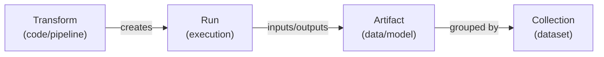
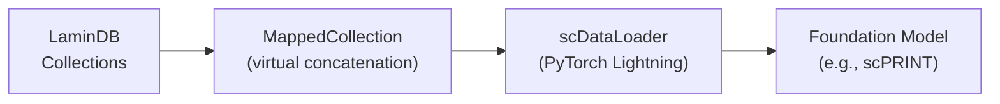
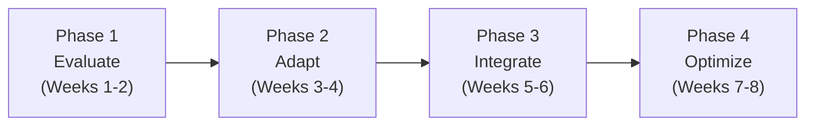
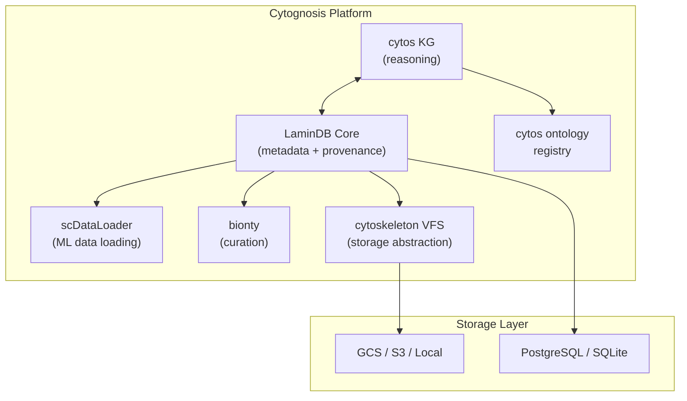

> **Status**: Active
> **Date**: 2026-05-29
> **Author**: \@mohammadi
> **Audience**: engineers
> **Tags**: `research`, `evaluation`

> [!NOTE]
> **TL;DR**: LaminDB is a lineage-native data lakehouse for biological R&D. **Adopt it** for metadata/provenance tracking alongside our existing cytos KG (for deep ontology reasoning) and cytoskeleton VFS (for low-level storage). Evaluate scDataLoader for ML training data loading. Skip LaminHub SaaS dependency.
> **Source**: [lamindb-deep-analysis.md](lamindb-deep-analysis.md)

---

# ⚡ LaminDB, LaminHub & scDataLoader: Deep Analysis

📍 **Breadcrumbs**: Cytonome > Yar > Research > LaminDB Analysis

---

## ⚡ The Decision at a Glance

> [!TIP]
> **Section Summary**: What to adopt, keep, and skip in one table.

| Component | Decision | Rationale |
|---|---|---|
| **LaminDB Core** (metadata/provenance) | ✅ **Adopt** | More mature than building our own; biology-native; open-source |
| **cytoskeleton VFS** | 🟢 **Keep** (adapt) | Keep as low-level primitive; build LaminDB adapter on top |
| **cytos KG** | 🟢 **Keep** | Different purpose: bionty for curation, cytos KG for reasoning |
| **scDataLoader** | ✅ **Evaluate** | Directly addresses our data loading needs for foundation model training |
| **LaminHub** (SaaS UI) | ⏸️ **Defer** | Evaluate free tier first; avoid SaaS dependency |
| **RO-Crate export** | 🟢 **Keep ours** | Standards compliance matters (W3C PROV, SWHID, RO-Crate) |

➡️ **What's Next?** Start with the 8-week integration plan at the bottom of this document.

---

## 🔬 1. What is LaminDB?

> [!TIP]
> **Section Summary**: LaminDB is "git for R&D data" with built-in biology knowledge. Created by the Scanpy team.

**LaminDB** is a **lineage-native data lakehouse** built specifically for biological R&D. Created by **Alex Wolf** (creator of Scanpy) and **Sunny Sun** (both formerly of Cellarity). The company went through **Y Combinator S22**.

It provides a **metadata registry layer** (Django ORM on Postgres/SQLite) over cloud/local storage, with first-class support for:
- **Biological ontologies** (via bionty)
- **Data provenance tracking** (Transform, Run, Artifact)
- **Biological data formats** (AnnData, zarr, TileDBSOMA, SpatialData, MuData)

💡 **101 Sidebar: What is a "data lakehouse"?**

> A system that combines the flexibility of a data lake (store any file type) with the query power of a data warehouse (structured metadata). LaminDB stores your files in cloud/local storage but tracks rich metadata in a SQL database.

---

## 🏗️ 2. Core Architecture

> [!TIP]
> **Section Summary**: Four central entities form the data model. Transform (code) creates Runs (executions) which produce Artifacts (data) grouped into Collections.



| Entity | What It Is | Example |
|---|---|---|
| **Artifact** | A file, folder, or array with content hash, metadata, and lineage | An `.h5ad` single-cell dataset |
| **Collection** | A versioned grouping of multiple artifacts | "Training data v2.3" |
| **Transform** | Code that creates or manipulates data (versioned) | A preprocessing notebook |
| **Run** | One execution of a Transform with context (time, user, I/O) | "Tuesday's preprocessing run" |

<details>
<summary>🔬 Deep Dive: The Registry Pattern</summary>

Registries are Django models that serve as database tables for metadata entities:

```python
import lamindb as ln

# All registries use Django-like ORM syntax
artifact = ln.Artifact.get(key="my-dataset.h5ad")
results = ln.Artifact.filter(suffix=".h5ad", size__gt=1e9)
df = results.to_dataframe()
```

Benefits: type-safe queries, relational joins, migration support, works with both PostgreSQL and SQLite.

</details>

<details>
<summary>🔬 Deep Dive: Automatic Provenance Tracking</summary>

```python
import lamindb as ln

# Start tracking: creates Transform + Run
ln.track()

# Any artifacts saved during this session are
# automatically linked to the current Run
artifact = ln.Artifact("output.h5ad", key="processed/my-data.h5ad")
artifact.save()

# artifact.run -> the Run that created it
# artifact.run.transform -> the code that was executed
# artifact.run.input_artifacts -> what was consumed
```

Also supports: automatic Git sync, parameter capture via `@ln.flow()`/`@ln.step()` decorators, environment tracking.

</details>

---

## 🔬 3. Key Capabilities Compared

> [!TIP]
> **Section Summary**: LaminDB's provenance tracking is more mature than our current approach. Bionty is simpler but less deep than our cytos KG.

### Provenance Tracking: LaminDB vs. Cytognosis

| Aspect | LaminDB | Our cytoskeleton VFS |
|---|---|---|
| **Storage** | Queryable SQL database | Individual `.prov.json` sidecar files |
| **Input/output tracking** | ✅ Automatic | ❌ Manual |
| **Git integration** | ✅ Auto-sync with Transform versioning | ⚠️ Manual git_sha in ProvenanceRecord |
| **Cross-artifact queries** | ✅ "Which code produced this dataset?" | ❌ Not possible across sidecars |
| **Standards compliance** | Proprietary Django ORM | ✅ W3C PROV, SWHID (ISO 18670), RO-Crate 1.2 |

### Ontology Systems: Bionty vs. Cytos KG

| Aspect | Bionty (LaminDB) | Cytos KG |
|---|---|---|
| **Data model** | Flat registries (SQL tables per entity) | KGX-format graph (nodes.tsv + edges.tsv) |
| **Storage** | Django ORM (Postgres/SQLite) | DuckDB + Polars DataFrames |
| **Ontologies covered** | 20+ biological | 16+ ontologies |
| **Cross-ontology** | Limited (per-entity lookups) | ✅ SSSOM mappings, UMLS integration |
| **Graph reasoning** | ❌ No traversal | ✅ BioLink model, hierarchical relationships |
| **Best for** | "Is this cell type name valid?" | "What diseases are associated with this cell type through which pathways?" |

**Verdict**: Use **bionty for data curation** (simple validation). Keep **cytos KG for deep reasoning** (knowledge graph queries).

---

## 🔬 4. Biological Ontology Coverage (Bionty)

> [!TIP]
> **Section Summary**: Bionty provides programmatic access to 20+ ontologies with synonym mapping and validation.

| Entity | Sources |
|---|---|
| Gene | Ensembl, NCBI Gene |
| Protein | UniProt |
| CellType | Cell Ontology |
| Tissue | Uberon |
| Disease | Mondo, Human Disease, ICD |
| Organism | NCBI Taxonomy |
| CellMarker | CellMarker |
| Phenotype | HPO, PATO |
| Pathway | GO, Pathway Ontology |
| DevelopmentalStage | HsapDv, MmusDv |

<details>
<summary>🔬 Deep Dive: Curation Workflow</summary>

LaminDB provides a structured data curation pipeline:

1. **Define schemas**: Specify expected features, data types, constraints
2. **Initialize Curator**: `AnnDataCurator` or `DataFrameCurator`
3. **Validate**: `curator.validate()` checks dataset against schema
4. **Standardize**: `curator.standardize()` fixes typos, maps synonyms
5. **Inspect**: `curator.inspect()` returns report with fixes
6. **Save**: `curator.save_artifact()` registers validated artifact

This is a high-value capability for Cytognosis. Our current data standardization approach is ad-hoc.

</details>

---

## 🔬 5. scDataLoader for ML Training

> [!TIP]
> **Section Summary**: scDataLoader enables streaming millions of cells for model training without loading everything into memory. Built on LaminDB's MappedCollection.



**Key features**:
- **Scalable**: Stream thousands of datasets, millions of cells, without full memory load
- **MappedCollection**: Virtual concatenation with lazy loading and PyTorch-compatible `__getitem__`
- **Preprocessing**: Per-dataset normalization, gene selection, train/test splitting
- **Ontology-aware**: Hierarchical loss support using ontology graphs (aligns with our cytos KG)

<details>
<summary>🔬 Deep Dive: MappedCollection Code Example</summary>

```python
import lamindb as ln

collection = ln.Collection.get(key="my-sc-collection")

# Virtually concatenates without loading into memory
with collection.mapped(obs_keys=["cell_type"], join="inner") as dataset:
    print(f"#observations: {dataset.shape[0]}")
    sample = dataset[5]  # Lazily fetches from the right file

    from torch.utils.data import DataLoader
    loader = DataLoader(dataset, batch_size=32, num_workers=4)
```

</details>

**scPRINT connection**: scDataLoader is the data infrastructure behind scPRINT (pre-trained on 50M+ cells from CZ CELLxGENE Census, scaled to 350M cells across 16 species in v2).

---

## 🏗️ 6. Full Component Comparison

> [!TIP]
> **Section Summary**: What to adopt, keep, skip, or evaluate across all components.

| LaminDB Component | Our Equivalent | Decision |
|---|---|---|
| **Artifact** (file registry) | cytoskeleton VFS `AssetStat` | ✅ **Adopt**: More queryable metadata |
| **Collection** (dataset grouping) | None | ✅ **Adopt**: We lack structured collection management |
| **Transform** (code tracking) | VFS `ProvenanceRecord.git_sha` | ✅ **Adopt**: More granular versioning |
| **Run** (execution record) | VFS `ProvenanceRecord` | ✅ **Adopt**: Queryable execution history |
| **Feature** (metadata dimensions) | None | ✅ **Adopt**: Enables structured data catalog |
| **Schema** (validation rules) | None | ✅ **Adopt**: We need data validation |
| **Bionty** (bio ontologies) | cytos `OntologyRegistry` | 🤝 **Use alongside** cytos KG |
| **Curator** (data curation) | None | ✅ **Adopt**: High-value for data quality |
| **MappedCollection** | None | ✅ **Adopt**: Critical for ML training |
| **`ln.track()`** | Manual `ProvenanceRecord` | ✅ **Adopt**: Reduces boilerplate |
| **`@ln.flow`/`@ln.step`** | None | ✅ **Adopt**: Pipeline provenance |
| **LaminHub** (SaaS UI) | None | ⏸️ **Evaluate**: Cost vs. build tradeoff |
| **Store manifest** (RO-Crate) | `StoreManifest` + RO-Crate | 🟢 **Keep ours**: Standards compliance |
| **SWHID addressing** | cytoskeleton VFS | 🟢 **Keep ours**: ISO 18670 compliance |
| **KGX knowledge graph** | cytos KG builder | 🟢 **Keep ours**: Unique capability |
| **UMLS/SNOMED** | cytos KG builder | 🟢 **Keep ours**: Deep medical terminology |

---

## ⚠️ 7. Risk Analysis

> [!TIP]
> **Section Summary**: Adoption risks are manageable. NOT adopting LaminDB carries higher risk (building equivalent ourselves).

### Adoption Risks

| Risk | Severity | Mitigation |
|---|---|---|
| Vendor dependency on Lamin Labs | Medium | Use only open-source core; avoid LaminHub lock-in |
| Schema migration complexity | Medium | Start fresh for new data; migrate existing incrementally |
| Bionty/cytos KG conflicts | Low | Use bionty for curation, cytos KG for reasoning; build bridge |
| API breaking changes | Medium | Pin versions; LaminDB follows semver |

### Non-Adoption Risks

| Risk | Severity | Why It Matters |
|---|---|---|
| **Building equivalent ourselves** | **High** | Significant engineering for provenance, curation, ML data loading |
| Missed ecosystem integration | Medium | LaminDB is becoming standard in single-cell community |
| Data quality without curation tools | Medium | Ad-hoc validation is error-prone |
| ML training pipeline complexity | Medium | MappedCollection solves a real problem we will face |

---

## 🏗️ 8. Integration Roadmap (8 Weeks)

> [!TIP]
> **Section Summary**: Four two-week phases from evaluation to optimization.



| Phase | Duration | Key Actions |
|---|---|---|
| **Evaluate** | Weeks 1-2 | Install LaminDB, create test instance with our single-cell datasets, validate bionty ontology coverage, test MappedCollection |
| **Adapt** | Weeks 3-4 | Build `cytoskeleton.lamindb` adapter, create bionty/cytos KG bridge, implement RO-Crate export from LaminDB |
| **Integrate** | Weeks 5-6 | Migrate single-cell catalog to LaminDB, set up curation workflows, integrate scDataLoader, configure GCS storage |
| **Optimize** | Weeks 7-8 | Evaluate LaminHub vs. build own UI, performance testing, document architecture, decide on dependency vs. fork |

---

## 🏗️ 9. Architecture Vision

> [!TIP]
> **Section Summary**: LaminDB sits above our VFS. Cytos KG operates independently for reasoning. Both share ontology data through a bridge.



### Key Principles

| # | Principle |
|---|---|
| 1 | **Adopt, do not fork**: Use LaminDB as a dependency, contribute improvements upstream |
| 2 | **Layer, do not replace**: LaminDB sits above our VFS; cytos KG operates independently |
| 3 | **Standards first**: Maintain W3C PROV, SWHID, RO-Crate as export formats |
| 4 | **Open-source only**: Use LaminDB core (Apache-2.0); evaluate but do not depend on LaminHub |
| 5 | **Incremental migration**: New data goes through LaminDB; existing data migrated over time |

---

## 📖 Glossary

<details>
<summary>Expand terminology table</summary>

| Term | Definition |
|---|---|
| **LaminDB** | A lineage-native data lakehouse for biological R&D built on Django ORM. |
| **LaminHub** | The proprietary SaaS layer providing UI, collaboration, and access control for LaminDB. |
| **scDataLoader** | A PyTorch Lightning DataModule for streaming single-cell data from LaminDB collections. |
| **Artifact** | LaminDB's core object representing datasets and models with content hash, metadata, and lineage. |
| **Transform** | LaminDB's representation of code or process that creates/manipulates data. |
| **Run** | An execution of a Transform, capturing time, user, inputs, and outputs. |
| **MappedCollection** | LaminDB's interface for virtual concatenation of AnnData files with lazy loading. |
| **Bionty** | LaminDB's biological ontology module providing access to 20+ public ontologies. |
| **AnnData** | A Python data structure for annotated data matrices, standard in single-cell genomics. |
| **h5ad** | The file format for AnnData objects (HDF5-based). |
| **zarr** | A format for chunked, compressed, N-dimensional arrays, used for large biological datasets. |
| **TileDBSOMA** | A format and API for scalable single-cell data, used by CZ CELLxGENE Census. |
| **SpatialData** | A format for spatial omics data (Xenium, Visium, MERFISH). |
| **MuData** | A format for multimodal data (RNA + ATAC + protein). |
| **KGX** | Knowledge Graph Exchange format (nodes.tsv + edges.tsv). |
| **SWHID** | Software Heritage Identifier. An ISO 18670 standard for content-addressing. |
| **RO-Crate** | Research Object Crate. A standard for packaging research data with metadata. |
| **W3C PROV** | W3C Provenance standard for tracking data lineage. |
| **SSSOM** | Simple Standard for Sharing Ontology Mappings. |
| **UMLS** | Unified Medical Language System. A comprehensive medical terminology database. |
| **DuckDB** | An in-process SQL database engine optimized for analytical queries. |
| **Django ORM** | Django's Object-Relational Mapping layer for database access. |
| **fsspec** | Python's filesystem specification library for abstracting storage backends. |
| **scPRINT** | A large cell model pre-trained on 50M+ cells for gene network inference. |
| **CELLxGENE** | Chan Zuckerberg's single-cell data portal (Census). |

</details>