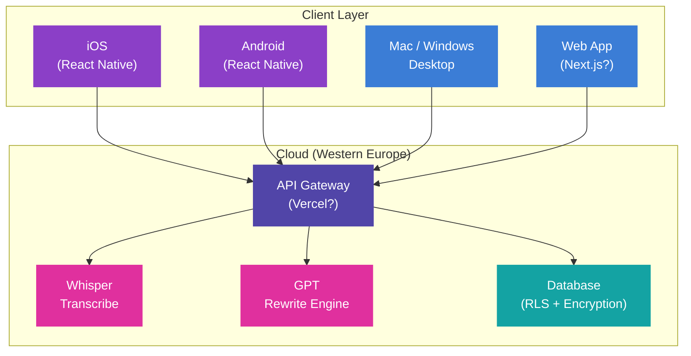
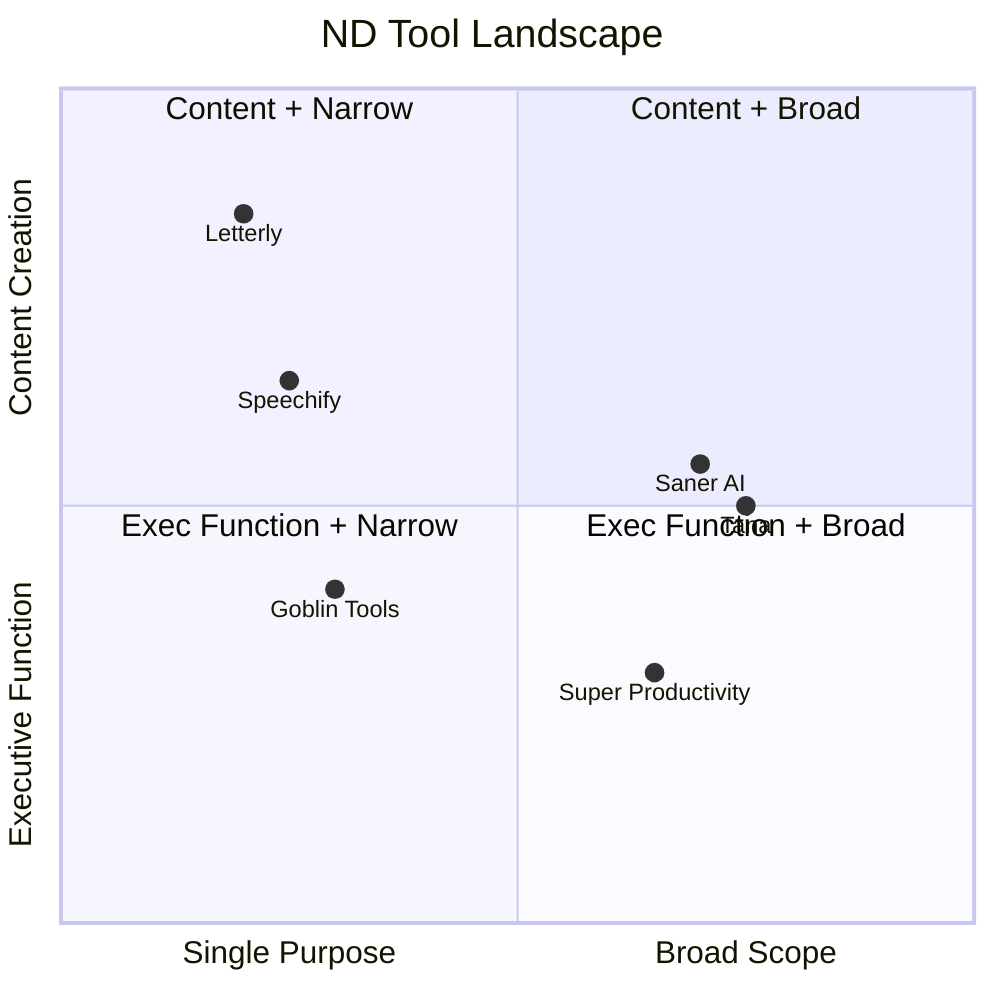
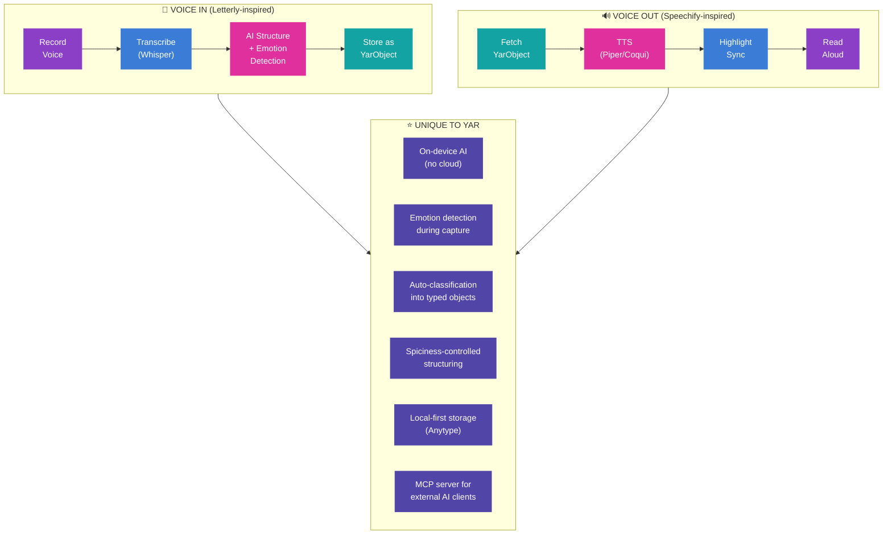

> **Status**: Active
> **Date**: 2026-05-29
> **Author**: \@mohammadi
> **Audience**: engineers, stakeholders
> **Tags**: `yar`, `competitive`, `letterly`, `evaluation`

> [!NOTE]
> **TL;DR**: Letterly is an AI voice-to-text app that turns rambling spoken thoughts into polished written content using 25+ rewrite styles. Scores **41/120** on the Yar unified comparison (narrow scope, not quality). Yar should adopt its voice capture pipeline (P1), one-tap recording widget (P1), and offline recording (P1) while avoiding its cloud-only, closed-source, single-purpose architecture.
> **Source**: [letterly-deep-dive.md](letterly-deep-dive.md)

---

# 🎙️ Letterly Deep Dive: AI Voice-to-Text for ND Writers

📍 **Breadcrumbs**: Cytonome > Yar > Research > Letterly Deep Dive

---

## 🔬 1. Product Overview

> [!TIP]
> **Section Summary**: Letterly captures spoken audio, transcribes it, AI-rewrites it into polished content, and exports it. It is a voice-first content creation tool, not a reading assistant, task manager, or knowledge system.

### What Letterly Does

The core value proposition: **speak messy, get clean**. Users talk naturally, including stumbles, tangents, filler words, and stream-of-consciousness rambling. The AI produces formatted, polished output ready for use.

### What Letterly is NOT

| ❌ Not This | Why It Matters |
|---|---|
| Reading assistant | No TTS, no read-aloud |
| OCR / document scanner | No image-to-text |
| Task manager | No persistent tasks, no due dates |
| Knowledge system | No wiki, no backlinks, no graph |
| Meeting transcription tool | No calendar integration, no real-time collab |
| Open-source | Proprietary, closed-source, cloud-dependent |

### Platform Availability

| Platform | Status | Notes |
|---|---|---|
| **iOS** | ✅ Native app | Primary development platform |
| **Android** | ✅ Native app | Historically lags iOS |
| **macOS** | ✅ Desktop app | Hotkey dictation support |
| **Windows** | ✅ Desktop app | Some feature lag |
| **Web** | ✅ Web app | Full browser access |

---

## 🏢 2. Company Background

> [!TIP]
> **Section Summary**: Founded in 2023 by Anton Lebedev (5-7 failed startups before this one). Bootstrapped to $200K+ MRR. Philosophy: "radical simplicity" — do one thing exceptionally well.

| Metric | Value |
|---|---|
| **Founder** | Anton Lebedev (ex-CPO, 15+ years startups) |
| **Founded** | 2023 |
| **Revenue** | $200K+ MRR |
| **Funding** | Bootstrapped (no VC) |
| **Team** | Small (exact size undisclosed) |
| **HQ** | Spain / Israel (varies by source) |
| **Growth** | Organic word-of-mouth + AppSumo deals |

### Origin Story

The team was building a different product when they spotted a wave of apps using OpenAI's Whisper + ChatGPT for voice-to-text. Existing solutions felt "rough around the edges," so they pivoted to build a polished version. The founder's core lesson from 5-7 failed startups: **"Every point of friction kills your revenue."**

### Business Philosophy: Radical Simplicity

- Market-validated idea (voice-to-text was already proven)
- Obsessive stripping of unnecessary features
- Prioritizing UX over feature count
- Single-purpose tool that does one thing exceptionally well

---

## ⚙️ 3. Feature Inventory

> [!TIP]
> **Section Summary**: Three capability layers: (1) Recording + transcription with offline/background support, (2) AI rewrite engine with 25+ styles + custom prompts, (3) Desktop dictation for system-wide voice input.

### Core: Recording & Transcription

| Feature | Details |
|---|---|
| **Voice Recording** | Up to 90 min per session |
| **Offline Recording** | Record without internet; sync later |
| **Background Recording** | Continue while using other apps |
| **Screen-Off Recording** | Record with screen off |
| **Home Screen Widget** | One-tap recording start |
| **Audio File Upload** | Import existing audio/video files |
| **Language Support** | 90+ languages, auto-detection |
| **Filler Word Removal** | Auto-strips "um," "uh," "like" |
| **Speaker Separation** | Multi-speaker diarization |

### AI Rewrite Engine (Primary Differentiator)

After transcription, users pick from 25+ styles or create custom ones:

| Category | Available Styles |
|---|---|
| **Professional** | Formal email, business letter, memo, executive summary |
| **Social Media** | Twitter/X, Instagram caption, LinkedIn update |
| **Content Creation** | Blog post, article, newsletter, press release |
| **Organization** | To-do list, bulleted summary, structured notes, outline |
| **Personal** | Journal entry, personal email, casual message |
| **Academic** | Study notes, essay draft, research summary |

**Custom rewrite options**: Tone (formal/casual/assertive/empathetic), length (brief/moderate/detailed), format (bullets/paragraphs/numbered), and free-text custom instructions.

### Desktop Dictation Mode

| Feature | Details |
|---|---|
| **Hotkey Activation** | Customizable (default F5) triggers dictation anywhere |
| **Universal Input** | Dictate into any app (Notion, Slack, Gmail, Word) |
| **AI Processing** | Speech transcribed, cleaned, formatted before insertion |
| **Floating Bar** | Visual start/stop without hotkey |
| **Real-time Insertion** | Processed text inserted at cursor position |

### Content Processing Extras

| Feature | Details |
|---|---|
| **Podcast Summarization** | Summaries, outlines, key takeaways from long audio |
| **Meeting Notes** | Meeting recordings → structured action items |
| **Brainstorm Compiler** | Chaotic brain dumps → organized lists |
| **Translation** | Transcribe in one language, rewrite in another |
| **Grammar Correction** | Automatic grammar + punctuation cleanup |
| **Tone Adjustment** | Shift tone without changing content |

### Organization & Workflow

| Feature | Details |
|---|---|
| **Tagging** | Custom tags for categorizing notes |
| **Search** | Basic keyword search (reported as weak) |
| **Cross-Device Sync** | Syncs across iOS, Android, Mac, Web |
| **Zapier** | Connect to 8,000+ apps |
| **Webhooks** | Custom endpoint integration |
| **Export** | Copy text, share sheet, push to integrations |

---

## 🏗️ 4. Technology Stack

> [!TIP]
> **Section Summary**: React Native mobile, OpenAI Whisper + GPT under the hood, GCP/Vercel cloud, encrypted data in Western Europe. Closed-source, cloud-dependent.

| Layer | Technology | Confidence |
|---|---|---|
| **Mobile** | React Native | Confirmed |
| **Speech Recognition** | OpenAI Whisper (or similar) | High |
| **AI Processing** | OpenAI GPT models | High |
| **Cloud** | GCP / Vercel | Confirmed |
| **Database** | Row Level Security (RLS) | Confirmed |
| **Data Location** | Western Europe cloud servers | Confirmed |
| **Encryption** | At rest; keys in separate repository | Confirmed |
| **Web** | Likely Next.js (Vercel hosting) | Inferred |
| **Desktop** | Likely Electron or Tauri | Inferred |

### Privacy & Data Handling

| Aspect | Details |
|---|---|
| **Data Location** | Western Europe |
| **Encryption** | At rest; keys stored separately |
| **Developer Access** | Multi-step validation for encryption keys |
| **AI Training** | ✅ User data NOT used to train models |
| **Data Sharing** | ✅ No selling or renting personal info |
| **User Control** | Access, edit, delete all data |
| **Deletion** | Removes from both device and cloud |
| **Auth** | ⚠️ Email-only (no MFA) |

---

## 🧠 5. Neurodivergent Evaluation

> [!TIP]
> **Section Summary**: Letterly excels at one ND pain point: writing friction. Excellent for ADHD brain dumps and dyslexia spelling bypass. Missing everything else: time management, focus, emotion tracking, reading assistance, routine support.

### ADHD: Strengths

| ADHD Challenge | How Letterly Helps | Rating |
|---|---|---|
| **Blank page syndrome** | Bypass keyboard; speak to write | ⭐⭐⭐⭐⭐ |
| **Working memory overload** | Capture thoughts before they vanish | ⭐⭐⭐⭐⭐ |
| **Brain dump organization** | AI structures chaotic brain dumps | ⭐⭐⭐⭐⭐ |
| **Task initiation** | One-tap widget reduces activation energy | ⭐⭐⭐⭐ |
| **Filler word anxiety** | Auto-removal of ums/uhs/likes | ⭐⭐⭐⭐ |
| **Perfectionism paralysis** | "Speak messy, get clean" workflow | ⭐⭐⭐⭐ |
| **Context switching** | Desktop dictation in any app | ⭐⭐⭐⭐ |
| **Idea capture on-the-go** | Offline + background + screen-off recording | ⭐⭐⭐⭐ |

### ADHD: Gaps

| ADHD Challenge | What's Missing |
|---|---|
| **Time blindness** | No timers, no time tracking, no estimation |
| **Task prioritization** | No urgency/importance matrix |
| **Focus maintenance** | No Pomodoro, no distraction blocking |
| **Emotional dysregulation** | No emotion tracking or sentiment analysis |
| **Follow-through** | No reminders, no accountability features |
| **Routine building** | No habit tracking, no daily planning |

### Dyslexia: Strengths

| Challenge | How Letterly Helps | Rating |
|---|---|---|
| **Writing difficulty** | Complete keyboard bypass | ⭐⭐⭐⭐⭐ |
| **Spelling anxiety** | AI handles all spelling | ⭐⭐⭐⭐⭐ |
| **Grammar struggles** | AI corrects grammar in rewrite | ⭐⭐⭐⭐⭐ |
| **Composition** | AI structures content logically | ⭐⭐⭐⭐ |
| **Self-expression gap** | Ideas flow without mechanical barriers | ⭐⭐⭐⭐⭐ |

### Dyslexia: Gaps

| Challenge | What's Missing |
|---|---|
| **Reading difficulty** | No TTS, no read-aloud, no highlighting |
| **Visual processing** | No dyslexia-friendly fonts, no reading rulers |
| **Document comprehension** | No AI summaries of external documents |
| **Review burden** | Output requires reading to verify accuracy |

> [!WARNING]
> **The Review Burden Paradox**: Letterly creates text that requires *reading* to verify. For dyslexic users, this creates a new barrier at the exact point where the tool should deliver its value. Yar must add TTS playback of AI-generated output so users verify by *listening*, not reading.

### Autism: Strengths & Gaps

| Autism Challenge | Letterly | Rating |
|---|---|---|
| Communication formatting | Rewrite styles handle social conventions | ⭐⭐⭐ |
| Email anxiety | Formal email rewrite reduces uncertainty | ⭐⭐⭐ |
| Sensory overwhelm | Minimal, clean interface | ⭐⭐⭐ |
| Tone interpretation | ❌ No tone analysis (cf. Goblin Tools Judge) | — |
| Social scripting | ❌ No context-aware templates | — |
| Routine support | ❌ No structured routines | — |
| Sensory customization | ❌ No themes, fonts, or sensory settings | — |

### Overall ND Assessment

> [!IMPORTANT]
> **ND Coverage Rating: 4/10** — Deep but extremely narrow. Excellent for writing-specific challenges. Absent for broader executive function support (time, focus, emotion, routines, reading).

---

## 💰 6. Pricing Model

> [!TIP]
> **Section Summary**: ~$9/month or ~$70/year. No permanent free tier. AppSumo lifetime deals ($49-79) offer excellent value when available. Device-based licensing on AppSumo is a major pain point.

| Plan | Price | Features |
|---|---|---|
| **Free Trial** | $0 (limited) | Core features for evaluation |
| **Monthly** | ~$9/mo | Full access |
| **Annual** | ~$70-80/yr (~$6-7/mo) | Annual billing discount |
| **AppSumo Lifetime** | ~$49-79 (intermittent) | One-time, lifetime Pro |

### Pricing Analysis

| Aspect | Assessment |
|---|---|
| **Value** | Good for heavy users; expensive for occasional use |
| **Free tier** | Trial only, no permanent free option |
| **Lifetime deals** | Excellent value via AppSumo when available |
| **Licensing** | ⚠️ Device-based on AppSumo (phone + computer = 2 licenses) |
| **Hidden costs** | None |
| **vs. Speechify** | Cheaper ($70/yr vs $139/yr) |
| **vs. Goblin Tools** | More expensive ($9/mo vs free) |

> [!WARNING]
> **Device-Based Licensing Controversy**: AppSumo licenses are per-device, not per-user. Using Letterly on phone + computer requires two separate licenses. This has generated significant user frustration. The standard subscription (monthly/annual) includes cross-device access.

---

## ⚠️ 7. Limitations & Gaps

> [!TIP]
> **Section Summary**: Critical issue with recording interruptions from phone calls. Moderate issues with sync, AI reliability, and platform disparity. Major feature gaps in search, collaboration, TTS, and data portability.

### Technical Limitations

| Limitation | Severity | Impact |
|---|---|---|
| **Recording interruptions** | 🔴 Critical | Incoming calls kill active recordings; data loss |
| **Sync reliability** | 🟡 Moderate | Inconsistent cross-device sync |
| **AI rewrite failures** | 🟡 Moderate | Engine occasionally stalls or errors |
| **Web interface bugs** | 🟡 Moderate | Lag and UI issues in browser |
| **No continuous editing** | 🟡 Moderate | Cannot append voice to existing notes |
| **Platform disparity** | 🟡 Moderate | iOS/macOS prioritized over Android/Windows |
| **90-min recording limit** | 🟢 Minor | Long meetings may exceed limit |

### Feature Gaps

| Missing | Category | Impact on ND Users |
|---|---|---|
| **TTS** | Accessibility | Dyslexic users can't verify output without reading |
| **OCR** | Input | Can't capture text from physical docs |
| **Task management** | Executive function | To-do lists are static text, not actionable |
| **Knowledge graph** | Organization | No linking, backlinks, or graph view |
| **Semantic search** | Retrieval | Basic keyword only; no fuzzy matching |
| **Focus mode** | Attention | No Pomodoro, no distraction blocking |
| **Time tracking** | Time awareness | No timers or estimation |
| **Emotion tracking** | Self-awareness | No sentiment analysis or mood logging |
| **Collaboration** | Teamwork | Single-user only |
| **Public API** | Extensibility | Zapier/webhooks only |
| **Bulk export** | Portability | No standard format, no backup |
| **MFA** | Security | Email-only authentication |

### Architectural Concerns

| Concern | Details |
|---|---|
| **Cloud dependency** | All data in cloud; no local-first option |
| **Vendor lock-in** | No standard export; hard to migrate |
| **AI dependency** | Core features require internet |
| **Closed source** | Cannot audit, extend, or self-host |
| **Single provider** | Likely dependent on OpenAI for everything |

---

## 🏆 8. Competitive Comparison

> [!TIP]
> **Section Summary**: Letterly is the voice→text direction. Speechify is text→voice. Goblin Tools has broader ND features for free. Otter.ai targets meetings. Together, they show the complete pipeline Yar must unify.

### Head-to-Head Comparisons

| Dimension | Letterly | Speechify | Goblin Tools | Otter.ai |
|---|---|---|---|---|
| **Direction** | Voice → Text | Text → Voice | Text → Structured Text | Voice → Meeting Notes |
| **Core use** | Content creation | Listen to content | ND micro-utilities | Meeting transcription |
| **ND strength** | Writing friction | Reading difficulty | Task decomposition + tone | Group meetings |
| **AI capability** | 25+ rewrite styles | TTS + voice cloning | Compiler + Judge + Magic ToDo | Action items + summary |
| **Offline** | ✅ Recording | ✅ TTS (iOS) | ❌ | ❌ |
| **Cost** | ~$9/mo | ~$139/yr | Free (web) | Freemium |
| **ND intentionality** | Incidental | Incidental | Intentional | Incidental |
| **Persistence** | ✅ Cloud notes | N/A | ❌ Stateless | ✅ Cloud |

> [!IMPORTANT]
> **Key Insight**: Letterly + Speechify are complementary opposites forming a complete voice pipeline. Letterly handles "voice in, text out." Speechify handles "text in, voice out." Neither does both. Yar must do both.

### ND Tool Landscape Positioning

Letterly occupies the **upper-left**: single-purpose, content-creation-focused. Narrowest tool in the comparison set but deepest in its niche.

---

## 📊 9. Yar Scoring Matrix (0–10 Scale)

> [!TIP]
> **Section Summary**: Total score 41/120. Lowest in the comparison set, reflecting narrow scope, not poor quality. Strong in AI Integration (7) and Mobile Support (8). Zeros in Time Management, Collaboration, and Open Source.

### Score Card

| Category | Score | Rationale |
|---|---|---|
| **Task Management** | 1 | Can generate to-do lists as text, but no persistent system |
| **Time Management** | 0 | No timers, no Pomodoro, no estimation, no calendar |
| **Knowledge Management** | 3 | Basic tagging and search; no graph or backlinks |
| **AI Integration** | 7 | 25+ rewrite styles, custom prompts, auto filler removal |
| **ND-Specific Features** | 4 | Excellent for writing friction; absent for everything else |
| **Collaboration** | 0 | Single-user only |
| **Integration Ecosystem** | 5 | Zapier + webhooks; no public API |
| **Open Source** | 0 | Proprietary, closed-source, cloud-only |
| **Accessibility** | 5 | Voice-first is great; no TTS or reading support |
| **Mobile Support** | 8 | Excellent mobile-first with offline/background/widget |
| **Cost** | 5 | ~$9/mo, no free tier, device licensing issues |
| **Data Portability** | 3 | Zapier/webhooks out, but no bulk export or standard formats |
| **TOTAL** | **41/120** | |

### Comparison with Evaluated Tools

📊 Full 12-category comparison across all 10 tools

| Category | Letterly | Leantime | Super Prod. | Tana | Capacities | Goblin Tools | Saner AI | Speechify | ND Visual | Anytype |
|---|---|---|---|---|---|---|---|---|---|---|
| Task Mgmt | 1 | 8 | 9 | 6 | 5 | 5 | 7 | 0 | 2 | 4 |
| Time Mgmt | 0 | 5 | 10 | 2 | 3 | 4 | 3 | 0 | 0 | 1 |
| Knowledge | 3 | 6 | 3 | 10 | 8 | 2 | 8 | 3 | 8 | 8 |
| AI | 7 | 7 | 2 | 8 | 6 | 9 | 9 | 7 | 6 | 2 |
| ND-Specific | 4 | 7 | 8 | 5 | 5 | 10 | 6 | 7 | 4 | 3 |
| Collab | 0 | 7 | 2 | 7 | 3 | 0 | 3 | 2 | 0 | 4 |
| Integration | 5 | 6 | 9 | 5 | 5 | 1 | 7 | 4 | 8 | 3 |
| Open Source | 0 | 9 | 10 | 0 | 0 | 0 | 0 | 0 | 10 | 9 |
| Accessibility | 5 | 6 | 7 | 5 | 6 | 8 | 5 | 9 | 3 | 4 |
| Mobile | 8 | 6 | 8 | 5 | 7 | 7 | 6 | 9 | 0 | 6 |
| Cost | 5 | 8 | 10 | 5 | 6 | 10 | 5 | 3 | 10 | 9 |
| Portability | 3 | 6 | 8 | 3 | 4 | 1 | 4 | 2 | 7 | 8 |
| **TOTAL** | **41** | **81** | **86** | **61** | **58** | **57** | **63** | **46** | **58** | **61** |

### Score Context

Letterly's 41/120 is the lowest score in the set. This reflects scope, not quality:
- **Speechify** (46) has similarly narrow scope but scores higher on Accessibility (9 vs 5) and Mobile (9 vs 8)
- **Goblin Tools** (57) covers more ND territory despite being free micro-utilities
- **Super Productivity** (86) demonstrates what breadth looks like in this framework
- Letterly's **AI Integration (7)** matches Leantime and Speechify, reflecting a genuinely sophisticated rewrite engine

---

## 🎯 10. Features Yar Should Adopt

> [!TIP]
> **Section Summary**: Four P1 Critical items (voice pipeline, one-tap widget, offline recording, filler removal). Several P2/P3 enhancements. Seven anti-patterns to actively avoid.

### ✅ Direct Adoption Candidates

| Letterly Feature | Yar Implementation | Priority |
|---|---|---|
| **Voice-to-structured-text pipeline** | Convert voice memos into typed YarObjects, not raw transcripts | **P1 Critical** |
| **One-tap recording widget** | Flutter home screen widget for instant capture | **P1 Critical** |
| **Offline voice recording** | Record locally, queue for AI when connectivity returns | **P1 Critical** |
| **Filler word removal** | Strip ums/uhs before storage in speech pipeline | **P1 Critical** |
| **25+ rewrite style concept** | Implement as "output templates" in Yar's AI agent | P2 Next Phase |
| **Custom rewrite prompts** | Persist as YarObject templates | P2 Next Phase |
| **Background/screen-off recording** | Continue recording across app switches | P2 Next Phase |
| **Desktop dictation hotkey** | System-wide hotkey with AI processing | P3 Strategic |

### 🚀 Enhanced Adoption (Letterly + Improvements)

| Concept from Letterly | Yar Enhancement | Rationale |
|---|---|---|
| **Brain dump → structure** | Add Goblin Tools' spiciness slider for user-controlled granularity | Letterly auto-structures; Goblin Tools gives control. Yar combines both. |
| **Rewrite styles** | Add ND-specific styles: "ADHD-friendly summary," "step-by-step," "minimal cognitive load" | Letterly targets content creators; Yar targets cognitive accessibility |
| **Voice recording** | Add emotion detection (HuBERT); tag captures with emotional state | Letterly captures words; Yar captures words + emotional context |
| **Tagging** | Replace manual tags with AI auto-tagging + Supertag type inference | Letterly requires manual tagging; Yar auto-classifies |
| **Zapier integration** | Replace with local MCP server exposing Yar's capture pipeline | Cloud intermediary → local-first MCP protocol |

### ❌ Anti-Patterns to Avoid

| Letterly Approach | Why Yar Should Differ |
|---|---|
| **Cloud-only architecture** | Yar's local-first architecture is a core differentiator |
| **Device-based licensing** | Yar should be user-based or open-source; device licensing creates friction |
| **Email-only auth** | Yar must implement MFA for data protection |
| **Weak search** | Yar's knowledge graph + semantic search must be first-class |
| **Static text output** | AI-generated task lists must be actionable YarObjects with due dates and subtasks |
| **No reading direction** | Yar must implement TTS alongside STT for complete accessibility |
| **Single AI provider** | Yar's on-device AI (Gemma) eliminates single-provider dependency |

### Complete Voice Pipeline Vision

> [!IMPORTANT]
> Letterly validates one direction of the voice pipeline. Yar implements the complete bidirectional pipeline, combining Letterly's voice-in with Speechify's voice-out, plus unique capabilities.

---

## 🏁 11. Conclusion

> [!TIP]
> **Section Summary**: Letterly validates voice-first capture with AI structuring. Yar should adopt the pipeline natively while avoiding Letterly's closed, cloud-only, single-purpose limitations. Letterly is not a competitor; it's a feature Yar subsumes.

### Final Ratings

| Dimension | Rating |
|---|---|
| **Product quality** | 7/10 — Well-designed core with stability issues |
| **ND relevance** | 4/10 — Deep for writing friction, absent elsewhere |
| **Yar adoption value** | 8/10 — Strong patterns for the capture layer |
| **Competitive threat** | 2/10 — Too narrow to compete with Yar's vision |
| **Overall score** | 41/120 on unified comparison |

### Key Takeaways for Yar

1. **Voice-first capture is validated** — Letterly's $200K+ MRR proves "speak messy, get clean" is a workflow people pay for
2. **AI rewriting is the core value** — Raw transcription is a commodity (Whisper is open-source); intelligent restructuring is the differentiator
3. **One-tap activation matters** — For ADHD users, this is the difference between capturing an idea and losing it forever
4. **Offline recording is essential** — Thoughts don't wait for WiFi; Yar's local-first architecture has a natural advantage
5. **The review burden is a design flaw** — Yar must add TTS playback so users verify by listening, not reading
6. **Static output is a missed opportunity** — Yar should generate actionable YarObjects, not plain text lists
7. **Tagging is not organization** — AI auto-classification with Supertags is the correct approach

### Where Letterly Fits

Letterly is **not a direct competitor** to Yar. It occupies a specific niche (voice-to-text content creation) that Yar subsumes as one feature. Yar's advantage is unification: voice capture (Letterly) + reading aloud (Speechify) + task decomposition (Goblin Tools) + proactive AI (Saner AI) + time management (Super Productivity) + knowledge graph (Tana) + local-first storage (Anytype) — all in one adaptive, ND-aware, open-source companion.

---

## 🔗 What's Next?

| Document | Link |
|---|---|
| Unified Feature Comparison | yar-unified-feature-comparison (target archived/removed) |
| ElevenLabs Evaluation | elevenlabs_evaluation_adhd (target archived/removed) |
| Speechify Deep Dive | speechify-deep-dive_adhd (target archived/removed) |
| Goblin Tools Deep Dive | goblin-tools-deep-dive_adhd (target archived/removed) |

---

## 📖 Glossary

Expand terminology table

| Term | Definition |
|---|---|
| **STT** | Speech-to-Text. Converting spoken audio into written text. |
| **TTS** | Text-to-Speech. Converting written text into spoken audio. |
| **Diarization** | Identifying which speaker said what in a multi-speaker recording. |
| **Whisper** | OpenAI's open-source speech recognition model. |
| **GPT** | Generative Pre-trained Transformer. OpenAI's large language model family. |
| **Brain dump** | Unstructured verbal capture of all thoughts on a topic, without filtering. |
| **Filler words** | Non-meaningful speech sounds like "um," "uh," "like" that pad natural speech. |
| **Rewrite style** | A predefined AI template that transforms raw transcript into a specific format. |
| **YarObject** | Yar's typed data unit (task, note, event, etc.) with metadata and relationships. |
| **Supertag** | Tana-inspired type system that auto-classifies objects and inherits properties. |
| **MCP** | Model Context Protocol. A standard for AI tool invocation. |
| **RLS** | Row Level Security. Database access control that restricts rows per user. |
| **Zapier** | Cloud automation platform connecting 8,000+ apps via triggers and actions. |
| **Webhook** | HTTP callback that sends data to a URL when an event occurs. |
| **HuBERT** | Hidden-Unit BERT. A self-supervised speech model used for emotion detection. |
| **Gemma** | Google's open-weight language model family used in Cytonome for on-device AI. |
| **Piper / Coqui** | Open-source TTS engines suitable for on-device deployment. |
| **Spiciness slider** | Goblin Tools' UI control for adjusting task decomposition granularity. |
| **Local-first** | Architecture where data and processing live on-device by default; cloud is optional. |
| **MFA** | Multi-Factor Authentication. Requiring 2+ verification methods for login. |
| **OCR** | Optical Character Recognition. Extracting text from images or scanned documents. |
| **AppSumo** | Marketplace for software lifetime deals, popular with indie developers. |
| **Activation energy** | The effort required to start a task; reducing it is critical for ADHD users. |

