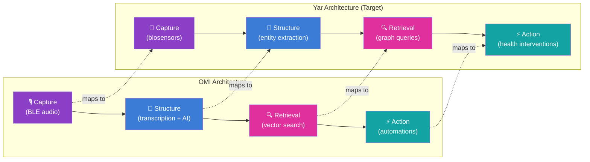
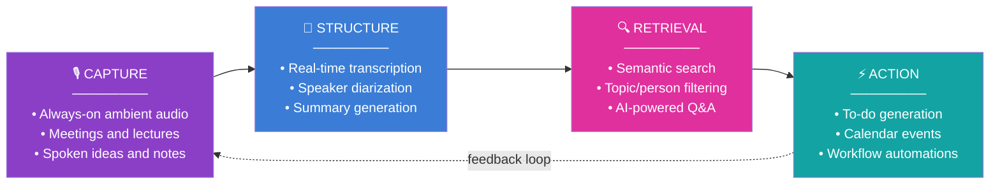
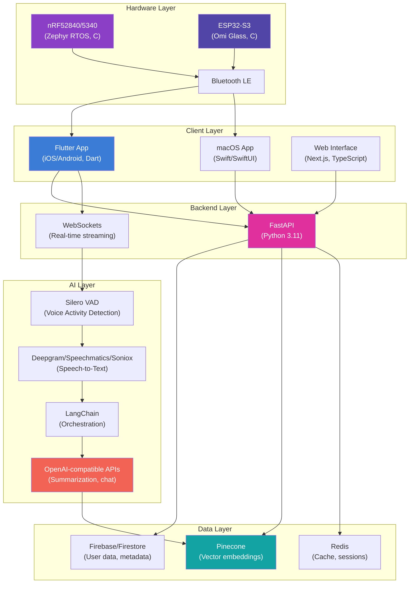
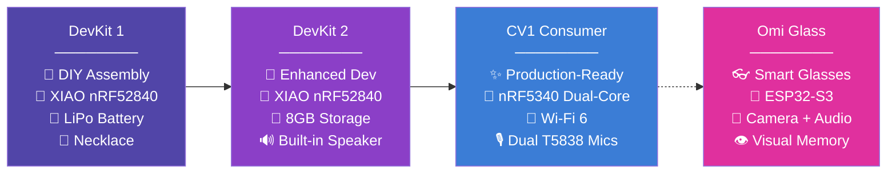
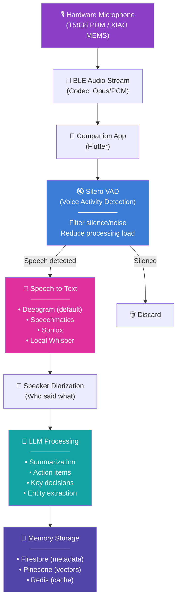
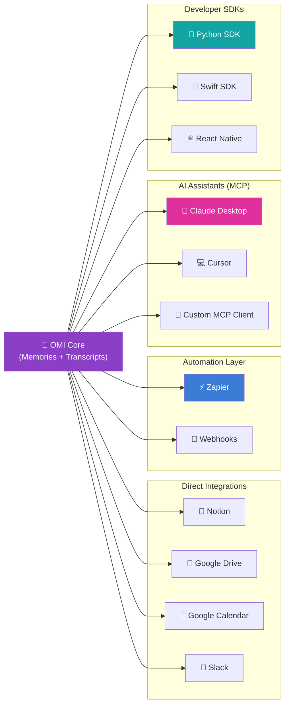
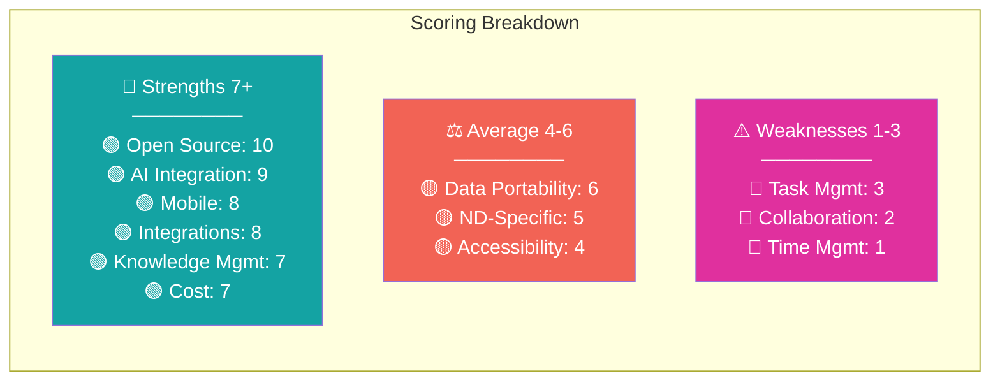
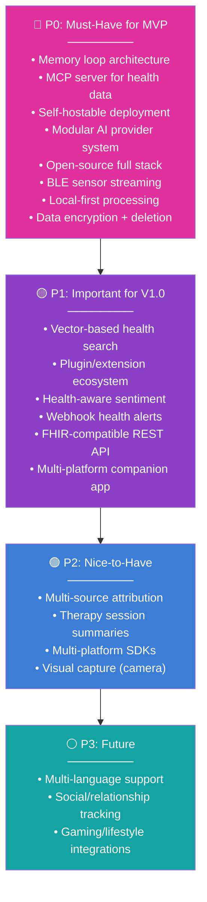

> **Status**: Active
> **Date**: 2026-05-29
> **Author**: \@mohammadi
> **Audience**: engineers, stakeholders
> **Tags**: `yar`, `competitive`, `omi`, `evaluation`

> [!NOTE]
> **TL;DR**: OMI is the most fully open-source AI wearable platform (MIT-licensed hardware, firmware, app, and backend). Its four-stage Memory Loop (Capture → Structure → Retrieval → Action) maps directly to Yar's health intelligence pipeline, and its MCP server, plugin ecosystem, and self-hosting capability provide reference implementations for Cytonome. OMI scores **70/120** on the Yar scale, excelling in open source (10/10) and AI integration (9/10) but failing at time management (1/10) and task structure (3/10). The top 5 P0 features for Yar adoption are: memory loop architecture, full-stack open-source model, MCP server, BLE sensor streaming, and self-hostable deployment.
> **Source**: [[omi-ai-deep-dive]]

---

## ⚡ Executive Summary

> [!TIP]
> **Section summary**: OMI is an open-source "second brain" wearable. Its Capture → Structure → Retrieval → Action pipeline mirrors Yar's health data flow. The top adoption targets are the memory loop architecture, MCP server, and self-hosting model.

### Top 5 Features for Yar Adoption

| Priority | OMI Feature | Yar Application | Effort |
|---|---|---|---|
| **P0** | Memory loop (Capture → Structure → Retrieval → Action) | Health data capture pipeline architecture | Medium |
| **P0** | Open-source full-stack wearable platform (MIT) | Cytonome hardware/software reference architecture | Low |
| **P0** | MCP server for AI assistant integration | Yar MCP server for health data access | Medium |
| **P1** | Plugin/app marketplace ecosystem | Health app ecosystem for Yar extensions | High |
| **P1** | Ambient continuous capture with VAD | Continuous biosensor data capture with event detection | High |

### Architecture Comparison: OMI → Yar

---

## 🔬 Product Overview

> [!TIP]
> **Section summary**: OMI (formerly "Friend") is a coin-sized pendant (~2.5cm) that captures ambient audio, streams via BLE to a companion app, and uses AI to create searchable "memories." It targets knowledge workers, students, and developers. Available on iOS, Android, macOS, and web.

### What is OMI?

OMI is an open-source AI wearable developed by Based Hardware Inc. The pendant continuously captures audio, streams it to a companion app via Bluetooth, and uses AI to transcribe, summarize, extract action items, and create searchable "memories." It positions itself as the open-source alternative to proprietary wearable AI devices like Limitless and Plaud.

### Memory Loop (Core Philosophy)

### Target Users

| User Segment | Use Case | Fit Level |
|---|---|---|
| **Knowledge workers** | Meeting notes, action items, context retention | High |
| **Students** | Lecture capture, study note generation | High |
| **Developers/tinkerers** | Custom AI agent dev, hardware hacking | Very High |
| **ADHD/neurodivergent** | Memory offloading, cognitive load reduction | Medium-High |
| **Journalists** | Interview recording, quote extraction | Medium |
| **Healthcare professionals** | Patient encounter documentation | Low |

### Platform Availability

| Platform | Status | Notes |
|---|---|---|
| **iOS** | ✅ Full | Primary companion app (Flutter) |
| **Android** | ✅ Full | Feature parity with iOS |
| **macOS** | ✅ Full | Native Swift/SwiftUI desktop app |
| **Web** | ⚠️ Partial | Next.js interface for AI personas |
| **Linux/Windows** | 🔧 Community | Via self-hosted backend |

---

## 🏗️ Open-Source Architecture

> [!TIP]
> **Section summary**: OMI is the most fully open-source AI wearable. Every layer is MIT-licensed: hardware schematics, firmware, mobile app, and cloud backend. ~12,600 GitHub stars, ~2,000 forks, 440+ open issues, and a paid bounty system for contributors.

> [!IMPORTANT]
> OMI proves that a privacy-respecting, community-driven wearable AI platform is viable without vendor lock-in. This is architecturally significant for Yar: Cytonome can study and adapt every component without licensing concerns.

### GitHub Metrics

| Metric | Value |
|---|---|
| **Repository** | `BasedHardware/omi` (monorepo) |
| **Stars** | ~12,600 |
| **Forks** | ~2,000 |
| **Open Issues** | 440+ |
| **Open PRs** | 70-76 |
| **License** | MIT (maximum permissive) |
| **Contribution Model** | Community + paid bounties |

### Tech Stack by Language

| Language | % | Component |
|---|---|---|
| **Dart** | 40.7% | Flutter mobile/desktop app |
| **C** | 19.5% | nRF/ESP32 firmware |
| **Python** | 14.8% | FastAPI backend |
| **Swift** | 11.5% | macOS native app |
| **TypeScript** | 6.8% | Next.js web, integrations |
| **Other** | 6.7% | Build scripts, configs, docs |

### Full-Stack Architecture

### Repository Structure

| Directory | Contents | Technology |
|---|---|---|
| `firmware/` | nRF52840/5340 and ESP32-S3 device firmware | C/C++, Zephyr RTOS |
| `app/` | Cross-platform mobile application | Flutter (Dart) |
| `backend/` | API server, AI pipeline, memory processing | Python, FastAPI |
| `plugins/` | Community-built apps and integrations | Various |
| `sdks/` | Client SDKs for custom development | React Native, Swift, Python |
| `docs/` | Developer documentation | Markdown |

### Key Architectural Decisions

| Decision | Implementation | Rationale |
|---|---|---|
| **Monorepo** | All components in single repo | Simplified versioning |
| **BLE streaming** | Audio streamed to phone, not cloud | Privacy-first |
| **Modular STT** | Pluggable transcription providers | No vendor lock-in |
| **Vector-first memory** | Pinecone for semantic storage | Natural language retrieval |
| **Docker deployment** | Containerized backend | Reproducible self-hosting |
| **MIT license** | Maximum permissive licensing | Encourage adoption and forking |

---

## 🔩 Hardware Specifications

> [!TIP]
> **Section summary**: OMI has 4 hardware variants: DevKit 1 (DIY, ~$30-50), DevKit 2 (enhanced, ~$50-70), CV1 (consumer, $89), and Omi Glass (smart glasses, TBA). The CV1 is the production device with dual microphones, Wi-Fi 6, and magnetic USB-C charging.

### Device Evolution

### Full Specification Comparison

| Spec | DevKit 1 | DevKit 2 | CV1 (Consumer) | Omi Glass |
|---|---|---|---|---|
| **Processor** | XIAO nRF52840 Sense | XIAO nRF52840 | nRF5340 dual-core BLE SoC | ESP32-S3 |
| **Wireless** | BLE | BLE | BLE + Wi-Fi 6 | BLE + Wi-Fi |
| **Microphone** | Built-in (XIAO) | Built-in | Dual T5838 top-port PDM | Integrated array |
| **Storage** | None (streaming only) | 8GB onboard | Onboard flash | Onboard flash |
| **Speaker** | None | Built-in | Yes | Yes |
| **Camera** | None | None | None | Yes (photo + video) |
| **Controls** | On/off switch | Programmable button | Button (3s hold) | Touch/button |
| **Form Factor** | Necklace pendant | Necklace pendant | Consumer pendant (~2.5cm) | Smart glasses |
| **Battery** | LiPo rechargeable | LiPo rechargeable | ~10-24 hours | Variable |
| **Charging** | USB | USB | Magnetic USB-C | USB-C |
| **Assembly** | DIY | Pre-assembled | Factory-built | Factory-built |
| **Target** | Makers/developers | Developers | General consumers | Early adopters |

> [!IMPORTANT]
> The DevKit 1 → DevKit 2 → CV1 evolution mirrors the maturation path Cytonome will follow: start with a developer-focused prototyping platform, iterate with enhanced capabilities (8GB storage, speaker feedback), then ship a consumer-grade product with dual microphones and Wi-Fi connectivity.

### Omi Glass: Visual Capture Extension

| Feature | Description |
|---|---|
| **Photo capture** | Photos for visual memory |
| **Video recording** | Video clips alongside audio |
| **Simultaneous capture** | Audio + video in the same memory |
| **Lifelogging** | Continuous visual recording |
| **Visual search** | AI-powered search across captured images |

> [!WARNING]
> Omi Glass raises significant privacy concerns in healthcare settings. Visual capture in clinical environments requires explicit consent frameworks and HIPAA-aware processing pipelines, neither of which OMI currently provides. Yar should study this as a cautionary example of feature expansion without adequate privacy infrastructure.

---

## 📦 Feature Inventory

> [!TIP]
> **Section summary**: 20+ features across 4 categories (Capture, Processing, Retrieval, Action) plus platform features. Most core features are Stable. Speaker diarization, contextual awareness, task lists, and offline processing are still in Beta.

### Core Features by Category

| Category | Feature | Description | Maturity |
|---|---|---|---|
| **🎙️ Capture** | Always-on ambient recording | Continuous audio via pendant | Stable |
| **🎙️ Capture** | 25+ language support | Multi-language transcription | Stable |
| **🎙️ Capture** | Speaker diarization | Identify different speakers | Beta |
| **🎙️ Capture** | Online meeting capture | Virtual + in-person | Stable |
| **📝 Processing** | Real-time transcription | Live STT via Deepgram/Speechmatics/Soniox | Stable |
| **📝 Processing** | AI summarization | Condensed conversation summaries | Stable |
| **📝 Processing** | Action item extraction | Auto to-do list from conversations | Stable |
| **📝 Processing** | Memory creation | Structured "memory" objects | Stable |
| **📝 Processing** | Contextual awareness | Remember Wi-Fi passwords, phone numbers | Beta |
| **🔍 Retrieval** | Semantic search | Natural language search across memories | Stable |
| **🔍 Retrieval** | Person-based filtering | Find memories by who was present | Stable |
| **🔍 Retrieval** | Topic-based filtering | Search by subject | Stable |
| **🔍 Retrieval** | AI-powered Q&A | Ask questions about past conversations | Stable |
| **⚡ Action** | Calendar event creation | Auto-generate calendar entries | Stable |
| **⚡ Action** | Task list generation | Spoken commitments → structured tasks | Beta |
| **⚡ Action** | Workflow automation | Trigger external tools via webhooks | Stable |

### Platform Features

| Feature | Description | Status |
|---|---|---|
| Cross-platform app | iOS, Android, macOS, web | Stable |
| Offline local processing | On-phone transcription without cloud | Beta |
| Data encryption | Encrypted storage with user control | Stable |
| Data deletion | Delete all data on demand | Stable |

📋 Platform-specific feature breakdown

| Platform | Features |
|---|---|
| **Mobile (iOS/Android)** | BLE pairing, real-time transcription view, memory browser, AI chat, quick capture, plugin marketplace, settings/developer mode |
| **macOS Desktop** | Native Swift app, BLE connection, conversation view, memory search |
| **Web** | AI persona configuration, memory browsing, basic chat interface |

---

## 🎤 Audio and Voice Pipeline

> [!TIP]
> **Section summary**: Audio flows from hardware mic → BLE stream → companion app → Silero VAD (filters silence) → STT (Deepgram/Speechmatics/Soniox/Whisper) → speaker diarization → LLM processing → memory storage. VAD reduces processing costs by 60-80%.

### End-to-End Audio Flow

### Voice Activity Detection (VAD)

| Aspect | Implementation |
|---|---|
| **Engine** | Silero VAD (neural network-based) |
| **Purpose** | Distinguish speech from silence/background noise |
| **Benefit** | Reduces processing costs by 60-80% |
| **Latency** | Minimal (runs on-device or locally) |
| **Accuracy** | High for conversation, lower for whispered/distant speech |

### Transcription Provider Comparison

| Provider | Strength | Weakness | Cost Model |
|---|---|---|---|
| **Deepgram** | Speed, real-time streaming | Less accurate for accents | Per-minute |
| **Speechmatics** | Multi-language accuracy | Higher latency | Per-minute |
| **Soniox** | Low-latency streaming | Smaller language coverage | Per-minute |
| **Local Whisper** | Privacy (no cloud) | Slower, requires GPU | Free (compute cost) |

> [!IMPORTANT]
> **Yar Relevance**: OMI's modular STT provider architecture is the correct pattern for Yar's audio processing. Health conversations (doctor appointments, therapy sessions) require high accuracy and privacy. Yar should default to local Whisper for sensitive health content and cloud providers for non-sensitive use cases.

---

## 🔌 Plugin Ecosystem and Integrations

> [!TIP]
> **Section summary**: OMI has 2,000+ integrations via an open marketplace, REST API with developer keys, SDKs for Python/Swift/React Native, a webhook system, and a Model Context Protocol (MCP) server that connects to Claude Desktop, Cursor, and other AI assistants.

### App Marketplace Categories

| Category | Examples | Description |
|---|---|---|
| **Productivity** | Google Drive, Notion, Zapier | Sync memories to external knowledge bases |
| **Utilities** | Audio Backup, General Summary | Enhance core capture |
| **Specialized** | ADHD Assistant, Therapy Session Insight | Niche AI analysis tools |
| **Social** | Omi Social AI | Relationship tracking |
| **Gaming** | League of Legends Assist | Domain-specific AI |
| **Communication** | Slack, Email integration | Distribute memories to teams |

### Developer SDK and APIs

| Resource | Description | Auth |
|---|---|---|
| **REST API** | Memories, conversations, action items | Bearer token (`omi_dev_` prefix) |
| **API Base URL** | `https://api.omi.me/v1/dev` | Settings → Developer → Create Key |
| **Python SDK** | BLE connection, audio decoding, Deepgram | SDK import |
| **Swift SDK** | iOS/macOS native integration | SDK import |
| **React Native SDK** | Cross-platform mobile dev | SDK import |
| **Webhooks** | Real-time notifications on memory creation | URL registration in app |

### MCP Server

> [!IMPORTANT]
> OMI provides a Model Context Protocol (MCP) server, enabling AI assistants to directly access memories and conversations. This is a reference implementation for Yar's own MCP server that would expose health data to AI assistants.

| MCP Detail | Value |
|---|---|
| **SSE URL** | `https://api.omi.me/v1/mcp/sse` |
| **Authentication** | Bearer token (`omi_mcp_` prefix) |
| **Capabilities** | Semantic search, CRUD for memories, browse transcripts |
| **Compatible clients** | Claude Desktop, Cursor, custom MCP clients |

### Integration Architecture

---

## 🧠 AI and Memory System

> [!TIP]
> **Section summary**: OMI's AI is built around persistent, searchable conversational memory with RAG. The stack is Firebase (metadata) + Pinecone (vectors) + Redis (cache) + LangChain (orchestration) + OpenAI-compatible LLMs. The memory processing pipeline has 6 stages from raw audio to searchable memory object.

### Second Brain Stack

| Component | Technology | Purpose |
|---|---|---|
| **Memory storage** | Firebase/Firestore | Timestamps, participants, topics, summaries |
| **Vector embeddings** | Pinecone | Semantic similarity search |
| **Session cache** | Redis | Low-latency access to active sessions |
| **Orchestration** | LangChain | Multi-step LLM processing chains |
| **LLM backend** | OpenAI-compatible APIs | Flexible model selection (GPT-4o, Claude, local) |

### Memory Processing Pipeline (6 Stages)

| Stage | Input | Output | AI Model |
|---|---|---|---|
| **1. Transcription** | Raw audio stream | Timestamped text + speaker labels | Deepgram/Speechmatics |
| **2. Summarization** | Full transcript | 3-5 sentence summary | GPT-4o / Claude |
| **3. Action extraction** | Full transcript | Structured to-do items with assignees | GPT-4o / Claude |
| **4. Entity extraction** | Full transcript | People, places, dates, decisions | GPT-4o / Claude |
| **5. Embedding** | Summary + key phrases | 1536-dim vector | text-embedding-3-small |
| **6. Storage** | All outputs | Searchable memory object | N/A (database writes) |

### Contextual Intelligence Capabilities

| Capability | Description | Example |
|---|---|---|
| **Intent recognition** | Identify promises and decisions | "I'll send the report by Friday" → task created |
| **Detail retention** | Remember specific facts | Wi-Fi passwords, phone numbers, addresses |
| **Cross-conversation** | Connect topics across conversations | "You discussed budget concerns in 3 meetings" |
| **Proactive recall** | Surface relevant past context | Show notes from last meeting before next one |

---

## 💜 Emotional Intelligence Features

> [!TIP]
> **Section summary**: OMI offers sentiment analysis, mood tracking, and therapeutic plugins through its marketplace. These are community-built, not clinically validated. The key insight for Yar is that ambient audio capture can yield health-relevant emotional insights beyond literal content.

### Sentiment and Mood Analysis

| Feature | Description | Availability |
|---|---|---|
| **Sentiment analysis** | Emotional tone of conversations | Plugin (marketplace) |
| **Tone identification** | Speaker's emotional state | Plugin |
| **Mood tracking** | Behavioral patterns over time | Plugin |
| **Emotional health checks** | Flag stressful conversation patterns | Plugin |
| **Proactive nudges** | Notifications on emotional patterns | Plugin |

### Therapeutic and Social Plugins

| Plugin | Purpose | Use Case |
|---|---|---|
| **Therapy Session Insight** | Review counseling sessions, highlight themes | Mental health self-awareness |
| **Omi Social AI** | Track social trends using behavioral psychology | Relationship building |
| **ADHD Assistant** | Break down tasks, provide structure | Executive function support |

> [!IMPORTANT]
> **Yar Relevance**: OMI's emotional features demonstrate that ambient audio can yield health-relevant insights beyond literal content. Yar's voice capture pipeline should implement similar sentiment analysis, but with clinical-grade emotion detection calibrated to health contexts (anxiety markers, pain indicators, medication side effect reports, mood disorder tracking).

---

## 🧩 ND-Specific Evaluation

> [!TIP]
> **Section summary**: OMI scores well for passive memory capture (memory offloading: High impact, always-on design: High impact) but poorly for active executive function support (time management: 1/10, executive function: 4/10). Seven benefits, six risks, and seven dimension scores are assessed.

### ADHD/Neurodivergent Benefits (7)

| Benefit | Description | ADHD Impact |
|---|---|---|
| **Memory offloading** | Device remembers what you forget | 🟢 High |
| **Cognitive load reduction** | No need to manually take notes | 🟢 High |
| **Presence enablement** | Stay engaged without note anxiety | 🟢 High |
| **Automatic organization** | AI structures unstructured conversations | 🟡 Medium |
| **Searchable memory** | Find past decisions and commitments | 🟢 High |
| **Action item extraction** | Spoken commitments → tasks | 🟡 Medium |
| **Always-on design** | No need to remember to start recording | 🟢 High |

### ADHD/Neurodivergent Risks (6)

| Risk | Description | Mitigation |
|---|---|---|
| **Information overload** | Too many memories to review | Needs priority filtering |
| **Notification fatigue** | Proactive nudges may overwhelm | ND-aware notification design |
| **Executive function demands** | Still requires reviewing captured data | Simplified review workflows |
| **Battery/connectivity anxiety** | Disconnections create data-loss anxiety | 8GB onboard storage helps |
| **Privacy social friction** | Wearing a recording device socially | Clear consent indicators |
| **Dependency risk** | Over-reliance on device for memory | Complement, not replace, strategies |

> [!WARNING]
> Two critical gaps for ADHD users: **no time management** (zero time-blocking, scheduling, or time awareness features) and **no task structure** (action items lack priority, deadlines, or recurring schedules). These address none of ADHD time blindness or task management challenges.

### ND Dimension Scoring

| Dimension | Score | Rationale |
|---|---|---|
| **Memory support** | 9/10 | Core strength: ambient capture eliminates manual memory burden |
| **Attention support** | 7/10 | Enables presence but doesn't manage attention switching |
| **Executive function** | 4/10 | Captures but doesn't structure, prioritize, or schedule |
| **Emotional regulation** | 5/10 | Sentiment plugins exist but not clinically validated |
| **Time awareness** | 1/10 | No time management, time-blocking, or schedule awareness |
| **Sensory considerations** | 6/10 | Small, unobtrusive device; no haptic feedback |
| **Customization for ND** | 5/10 | ADHD plugin exists but is generic, not evidence-based |

---

## 💰 Pricing and Business Model

> [!TIP]
> **Section summary**: $89 one-time for the CV1 pendant, freemium subscription ($0 free with 1,200 cloud min/month, $19/month unlimited), and full self-hosting option via Docker. OMI is the cheapest wearable AI with the most generous free tier and the only one that is fully self-hostable.

### Hardware Pricing

| Device | Price | Availability |
|---|---|---|
| **OMI Pendant (CV1)** | $89 (one-time) | Available now |
| **DevKit 1** | ~$30-50 (DIY parts) | Open-source build guide |
| **DevKit 2** | ~$50-70 (DIY parts) | Open-source build guide |
| **Omi Glass** | TBA | Limited early access |

### Subscription Model

| Plan | Monthly | Annual | Key Features |
|---|---|---|---|
| **Free** | $0 | $0 | Unlimited on-phone transcription, 1,200 cloud min/month |
| **Unlimited** | $19/mo | $199/yr (~$16/mo) | Unlimited cloud, advanced insights, expanded storage |

> [!IMPORTANT]
> Because the entire stack is MIT open-source, advanced users can bypass subscription costs entirely by self-hosting the backend with their own LLM/STT API keys. The subscription is optional, not mandatory. This is unique among wearable AI platforms.

### Self-Hosting Components

| Component | What You Need |
|---|---|
| **Backend** | Docker + server (home server or cloud VM) |
| **Transcription** | Own Deepgram API key or local Whisper |
| **LLM** | Own OpenAI/Anthropic key or local LLM (Ollama, vLLM) |
| **Vector DB** | Milvus, Weaviate, or Chroma |
| **Storage** | Firestore-compatible or Postgres |

### Competitive Cost Comparison

| Device | Hardware | Monthly | Self-Host? |
|---|---|---|---|
| **OMI** | $89 | $0-19 | ✅ Yes (full stack) |
| **Limitless** | $99 | $0-19 | ❌ No |
| **Plaud NotePin** | $169 | $0-7.99 | ❌ No |
| **Rewind/Screenpi.pe** | N/A (software) | $19-29 | ❌ No |

---

## ⚠️ Limitations and Known Issues

> [!TIP]
> **Section summary**: 10 user-reported issues (Bluetooth disconnections and phone battery drain are the most severe) and 8 technical limitations (audio-only capture, no health data standards, no offline-first architecture). Product maturity varies from Stable (app, backend, AI pipeline) to Beta (MCP server) to Early (plugin ecosystem).

### User-Reported Issues (10)

| Issue | Severity | Status (2026) |
|---|---|---|
| Bluetooth disconnections | 🔴 High | Improved but persistent |
| Phone battery drain | 🔴 High | Ongoing (inherent to BLE) |
| Accidental button presses | 🟡 Medium | Fixed (3s hold firmware) |
| Not waterproof | 🟡 Medium | Hardware limitation |
| Noisy environment transcription | 🟡 Medium | Improved with dual mics |
| Speaker diarization errors | 🟡 Medium | Improving each release |
| Subscription controversy | 🟡 Medium | Frustrated early adopters |
| Cloud dependency | 🟡 Medium | Mitigated by self-hosting |
| Transcript editing limitations | 🟢 Low | Now available |
| Privacy/social concerns | ⚪ Variable | Inherent to always-on devices |

### Technical Limitations (8)

| Limitation | Impact on Yar |
|---|---|
| **Audio-only capture** (pendant) | Yar needs multi-modal biosensor data |
| **No structured health data** | Memories are unstructured text, not typed entities |
| **No offline-first architecture** | Requires phone + cloud for full function |
| **No local graph database** | Vector search only, no relationship queries |
| **No temporal health tracking** | No longitudinal health data visualization |
| **No FHIR/health data standards** | No medical data interoperability |
| **No consent management** | No framework for healthcare recording |
| **No clinical validation** | Emotional/mood features not evidence-based |

📋 Product maturity assessment by dimension

| Dimension | Maturity | Notes |
|---|---|---|
| **Hardware** | Beta-Stable | CV1 production-ready; DevKits are prototypes |
| **Mobile app** | Stable | Flutter functional across iOS/Android |
| **Backend** | Stable | FastAPI + Firebase + Pinecone proven at scale |
| **AI pipeline** | Stable | Transcription + summarization reliable |
| **Plugin ecosystem** | Early | Community-quality, not enterprise-grade |
| **MCP server** | Beta | Functional but limited scope |
| **Documentation** | Good | Comprehensive at docs.omi.me |
| **Community** | Active | Discord + GitHub Issues + paid bounties |

---

## 🏆 Competitive Comparison

> [!TIP]
> **Section summary**: OMI vs Limitless vs Plaud vs Saner vs Speechify vs Goblin Tools across 15 dimensions. OMI wins on openness, price, customization, privacy (self-host), and plugin ecosystem. It loses on hardware polish, ND-specific design, and enterprise readiness.

### Full Competitive Matrix

| Feature | OMI | Limitless | Plaud NotePin | Saner.ai | Speechify | Goblin Tools |
|---|---|---|---|---|---|---|
| **Category** | Open-source second brain | Meeting assistant | Professional recorder | Mental wellness AI | Text-to-speech | ND task tools |
| **Philosophy** | Open bazaar | Fire-and-forget | High-fidelity capture | Emotional awareness | Reading assistance | ADHD decomposition |
| **Hardware** | $89 pendant | $99 pendant | $169 pin/clip | No hardware | No hardware | No hardware |
| **Open source** | ✅ MIT, full stack | ❌ | ❌ | ❌ | ❌ | ❌ |
| **Self-hostable** | ✅ | ❌ | ❌ | ❌ | ❌ | ❌ |
| **Always-on** | ✅ | ✅ | ❌ (tap to start) | ❌ | ❌ | ❌ |
| **Transcription** | Good (multi-provider) | Good | Excellent | N/A | N/A | N/A |
| **AI summarization** | ✅ | ✅ | ✅ (mind maps) | Partial | ❌ | ❌ |
| **ND-specific** | ADHD plugin (basic) | ❌ | ❌ | ✅ (mood/journaling) | ✅ (reading) | ✅ (task breakdown) |
| **Plugin ecosystem** | Large (2000+) | Limited | Limited | ❌ | Extensions | ❌ |
| **MCP support** | ✅ | ❌ | ❌ | ❌ | ❌ | ❌ |
| **Privacy model** | Local + self-host | Cloud only | Cloud (Pro) | Cloud | Cloud | Cloud |
| **Best for** | Tinkerers, devs | Meeting-heavy pros | Students, lawyers | Mental health | Reading difficulties | ADHD tasks |

### Competitive Positioning

| Dimension | OMI Advantage | OMI Disadvantage |
|---|---|---|
| **Openness** | Most open wearable AI ever built | Open source can mean less polish |
| **Price** | Lowest hardware + free tier + self-host | Cheapness can signal lower quality |
| **Customization** | Plugin marketplace + full API + MCP | Requires technical literacy |
| **Privacy** | Self-hostable, local processing | Cloud features are still the default |
| **Hardware quality** | Adequate for the price | Not as polished as Limitless or Plaud |
| **Ecosystem** | 2000+ integrations | Most integrations are shallow/webhook-based |
| **ND support** | ADHD Assistant plugin exists | Not designed for ND; bolt-on, not core |

### Key Differentiators for Yar

| Differentiator | Yar Relevance |
|---|---|
| **Full-stack open source** | Study and adapt without licensing concerns |
| **Community-driven dev** | Model for Yar's open-source health ecosystem |
| **Self-hosting capability** | Critical pattern for health data sovereignty |
| **MCP server** | Direct reference for Yar's health data MCP server |
| **Plugin/webhook architecture** | Pattern for Yar's health app extension system |

---

## 📊 Yar Scoring (0-10 Scale)

> [!TIP]
> **Section summary**: OMI scores 70/120 across 12 dimensions. Strengths: Open Source (10), AI Integration (9), Mobile (8), Integrations (8). Weaknesses: Time Management (1), Collaboration (2), Task Management (3). Compared to previously scored tools: Tana ~82, Capacities ~78, OMI 70.

### Score Breakdown

| Dimension | Score | Rationale |
|---|---|---|
| **Open Source** | 🟢 10 | Full stack MIT-licensed, self-hostable |
| **AI Integration** | 🟢 9 | Pluggable LLMs, MCP, LangChain, multi-provider STT |
| **Mobile Experience** | 🟢 8 | Excellent Flutter app with BLE, real-time view, search |
| **Integration Ecosystem** | 🟢 8 | 2000+ via Zapier/webhooks, MCP, REST API, SDKs |
| **Knowledge Management** | 🟢 7 | Strong memory system with RAG; weak on structured knowledge |
| **Cost** | 🟢 7 | $89 hardware + free tier + self-host |
| **Data Portability** | 🟡 6 | API access, self-host for control; no FHIR or structured export |
| **ND-Specific Features** | 🟡 5 | ADHD plugin exists; strong memory, no executive function |
| **Accessibility** | 🟡 4 | Audio-only output, no WCAG compliance documented |
| **Task Management** | 🔴 3 | Basic action items only; no priorities, deadlines, Kanban |
| **Collaboration** | 🔴 2 | Minimal; can share memories but no real-time collab |
| **Time Management** | 🔴 1 | Zero: no scheduling, time-blocking, pomodoro, time awareness |
| **TOTAL** | **70/120** | |

### Visual Score Distribution

### Cross-Tool Comparison

| Tool | Total (out of 120) | Top Strength | Biggest Gap |
|---|---|---|---|
| **Tana** | ~82 | AI depth, voice features | Offline (limited) |
| **Capacities** | ~78 | Object system, views | Collaboration (0) |
| **OMI** | **70** | **Open source (10), AI (9)** | **Time management (1)** |

---

## 🗺️ Yar Feature Mapping

> [!TIP]
> **Section summary**: Every significant OMI feature mapped to its Yar equivalent across 5 tables: Capture Pipeline, AI and Memory, Platform and Integration, Privacy and Data, and Emotional/Health-Adjacent. Priority levels: P0 (must-have MVP), P1 (important v1.0), P2 (nice-to-have), P3 (future).

> [!IMPORTANT]
> This mapping identifies every OMI feature with its Yar equivalent (existing or required). The P0 items form the minimum viable architecture for Yar's health intelligence pipeline.

### 15.1 Capture Pipeline Features

| OMI Feature | Yar Equivalent | Yar Implementation Required | Priority |
|---|---|---|---|
| Always-on ambient capture | Not implemented | Continuous biosensor data capture pipeline | **P0** |
| Voice Activity Detection | Not implemented | Event detection for biosensor data (anomaly triggers) | **P0** |
| BLE streaming | Cytonome BLE concept | BLE data streaming from Cytonome to companion app | **P0** |
| Multi-provider STT | Not implemented | Modular provider architecture for all AI services | **P1** |
| Speaker diarization | Not implemented | Multi-source data attribution (which sensor, which context) | **P2** |
| 25+ language support | Not applicable | Health data is language-agnostic (numeric, categorical) | **P3** |

### 15.2 AI and Memory Features

| OMI Feature | Yar Equivalent | Yar Implementation Required | Priority |
|---|---|---|---|
| Memory loop (4-stage pipeline) | Partial (entity system) | Complete health data pipeline: sensor → entity → query → action | **P0** |
| Contextual awareness | Partial (entity refs) | Cross-session context linking | **P0** |
| Action item extraction | Not implemented | Health action extraction (medication reminders, follow-ups) | **P0** |
| Vector embeddings (Pinecone) | Not implemented | Vector storage for health data semantic search | **P1** |
| RAG-powered Q&A | Not implemented | Health-aware Q&A over patient history | **P1** |
| LangChain orchestration | Not implemented | Health-specific AI orchestration pipeline | **P1** |
| AI summarization | Not implemented | Health journey summarization (daily/weekly/monthly) | **P1** |

### 15.3 Platform and Integration Features

| OMI Feature | Yar Equivalent | Yar Implementation Required | Priority |
|---|---|---|---|
| MCP server | Not implemented | Yar MCP server exposing health data to AI assistants | **P0** |
| Cross-platform app | Planned (mobile-first) | Flutter-based companion app for Cytonome | **P0** |
| Self-hosting | Not implemented | Self-hosted deployment for health data sovereignty | **P0** |
| Plugin marketplace | Not implemented | Health app extension system with review/approval | **P1** |
| REST API | Not implemented | FHIR-compatible REST API for health data | **P1** |
| Webhook system | Not implemented | Health event webhooks (anomaly alerts, medication due) | **P1** |
| Multi-platform SDKs | Not implemented | Yar SDK for health app developers | **P2** |

### 15.4 Privacy and Data Features

| OMI Feature | Yar Equivalent | Yar Implementation Required | Priority |
|---|---|---|---|
| Local on-device processing | Not implemented | On-device health data processing (critical for privacy) | **P0** |
| Data encryption | Planned (Solid pods) | End-to-end encryption for health data | **P0** |
| User data deletion | Not implemented | GDPR/HIPAA-compliant data deletion | **P0** |
| Open-source full stack | Planned | Maintain open-source commitment for all Yar components | **P0** |

### 15.5 Emotional and Health-Adjacent Features

| OMI Feature | Yar Equivalent | Yar Implementation Required | Priority |
|---|---|---|---|
| Sentiment analysis | Not implemented | Clinical-grade emotion detection for health contexts | **P1** |
| Mood tracking | Not implemented | Mood tracking with clinical scales (PHQ-9, GAD-7) | **P1** |
| Proactive nudges | Not implemented | Health-aware proactive alerts (medication, symptoms) | **P1** |
| Therapy Session Insight | Not implemented | Therapy/appointment summary with clinical note generation | **P2** |

---

## 🎯 Recommendations

> [!TIP]
> **Section summary**: 5 immediate P0 adoptions, 5 v1.0 features, 8 design lessons, and 8 anti-patterns to avoid. The core takeaway: adopt OMI's open-source pipeline architecture and MCP server pattern, but build health-specific structuring, FHIR compatibility, and clinical validation from day one.

### Immediate Adoption (P0 for Yar)

| # | Recommendation | Details |
|---|---|---|
| 1 | **Memory loop architecture** | Adopt 4-stage pipeline (Capture → Structure → Retrieval → Action), replacing "capture" with "sense" and "memory" with "health entity" |
| 2 | **MCP server for health data** | Follow OMI's pattern, expose health entities, trends, and queries to AI assistants via MCP |
| 3 | **Self-hostable architecture** | Docker-based self-hosting for complete health data sovereignty, critical for HIPAA |
| 4 | **Modular provider architecture** | Pluggable STT/LLM pattern for all AI services, user-selectable cloud vs local |
| 5 | **Open-source full stack** | Maintain MIT licensing across hardware, firmware, app, and backend |

### V1.0 Features (P1)

| # | Feature | Details |
|---|---|---|
| 1 | **Vector-based health search** | Semantic search: "When did my headaches start getting worse?" |
| 2 | **Plugin/extension ecosystem** | Health app marketplace with medical review/approval + clinical safety gates |
| 3 | **Health-aware sentiment** | Emotion detection for health: anxiety markers, pain indicators, cognitive load |
| 4 | **Webhook health alerts** | Real-time notifications: medication due, anomaly detected, trend change |
| 5 | **FHIR-compatible REST API** | Developer API outputting FHIR resources for healthcare interoperability |

### Key Design Lessons (8)

| Lesson | Yar Application |
|---|---|
| **Full-stack open source builds trust** | Health data requires even more transparency than productivity data |
| **Self-hosting is a feature, not a compromise** | For health data, self-hosting is a premium feature |
| **MCP is the integration future** | Yar's MCP server connects health data to any AI assistant |
| **Pluggable providers prevent lock-in** | Support multiple biosensor, AI, and storage providers |
| **Community plugins need guardrails** | Yar's health extensions need clinical review |
| **VAD pattern generalizes to all sensors** | Use anomaly detection to filter routine sensor data |
| **Ambient capture enables presence** | Continuous monitoring should be invisible |
| **Hardware iteration matters** | Ship early and iterate (DevKit 1 → DevKit 2 → CV1) |

### Anti-Patterns to Avoid (8)

| OMI Anti-Pattern | Why Problematic | Yar Approach |
|---|---|---|
| **Audio-only capture** | Health requires multi-modal data | Multi-modal from day one |
| **Unstructured memory** | Vector-only loses structured relationships | Graph DB + vector search (hybrid) |
| **No health data standards** | Cannot interoperate with healthcare | FHIR-compatible from the start |
| **No consent framework** | Always-on recording without consent | Granular consent for health contexts |
| **Cloud-first with local fallback** | Health data should be local-first | Local-first (Solid pods, CRDTs) |
| **Generic ND support** | ADHD plugin not evidence-based | Partner with clinical researchers |
| **No temporal visualization** | Memories are isolated, not longitudinal | Time-series visualization as core |
| **No offline-first** | Requires phone + internet | Core health tracking works offline |

### Adoption Priority Roadmap

---

## 🔗 What's Next?

| Action | Link |
|---|---|
| Compare with Capacities analysis | capacities-deep-dive_adhd (target archived/removed) |
| Review Yar architecture planning | yar-architecture (target archived/removed) |
| Explore Tana deep-dive | tana-deep-dive_adhd (target archived/removed) |
| Start MCP server design | yar-mcp-server (target archived/removed) |

---

## 📖 Glossary

Expand terminology table

| Term | Definition |
|---|---|
| **BLE** | Bluetooth Low Energy. A wireless protocol optimized for low power consumption, used for streaming data from wearables to companion apps. |
| **VAD** | Voice Activity Detection. A neural network that distinguishes speech from silence/noise, reducing processing costs by 60-80%. |
| **STT** | Speech-to-Text. Converts audio speech into written text. OMI supports Deepgram, Speechmatics, Soniox, and local Whisper. |
| **RAG** | Retrieval-Augmented Generation. An AI pattern that retrieves relevant documents from a database before generating a response, grounding the output in real data. |
| **MCP** | Model Context Protocol. A standard for connecting AI assistants to external data sources. OMI's MCP server lets Claude/Cursor access memories. |
| **LangChain** | A framework for orchestrating multi-step LLM processing chains (e.g., summarize → extract → store). |
| **Pinecone** | A managed vector database for storing and searching high-dimensional embeddings (semantic similarity search). |
| **FHIR** | Fast Healthcare Interoperability Resources. The standard for exchanging health data between systems. |
| **Silero VAD** | A specific neural network model for voice activity detection, used by OMI on-device or locally. |
| **Zephyr RTOS** | A real-time operating system used in OMI's nRF firmware for managing BLE audio streaming. |
| **nRF52840/5340** | Nordic Semiconductor BLE System-on-Chip processors used in OMI's DevKit and CV1 hardware. |
| **ESP32-S3** | Espressif microcontroller with Wi-Fi and BLE used in the Omi Glass smart glasses variant. |
| **Solid pods** | Personal Online Data Stores. User-controlled, decentralized storage for health data sovereignty. |
| **CRDTs** | Conflict-free Replicated Data Types. Data structures that enable offline-first sync without conflicts. |
| **PHQ-9** | Patient Health Questionnaire-9. A validated clinical scale for depression screening. |
| **GAD-7** | Generalized Anxiety Disorder 7-item scale. A validated clinical scale for anxiety screening. |
| **Speaker diarization** | The process of identifying "who said what" in a multi-speaker audio recording. |
| **Webhook** | An HTTP callback that sends real-time notifications when an event occurs. |
| **Flutter** | Google's cross-platform UI framework (Dart) used for OMI's iOS/Android/macOS apps. |
| **FastAPI** | A modern Python web framework used for OMI's backend API server. |

