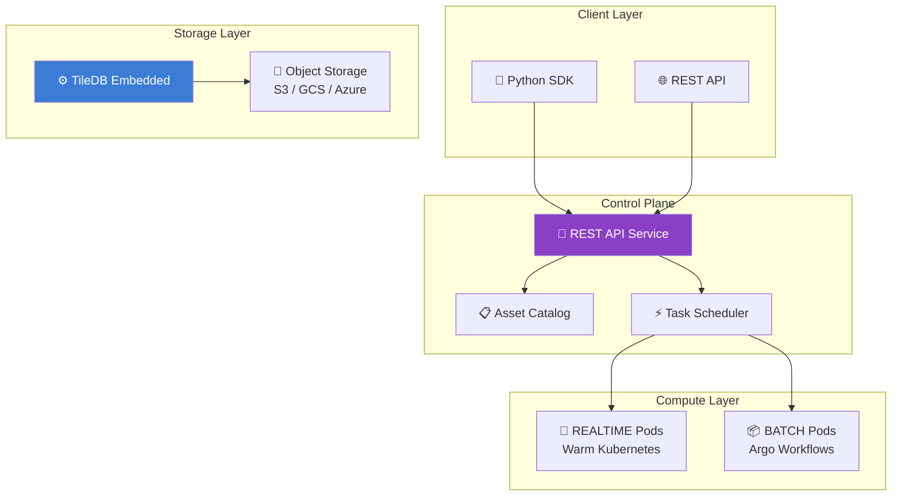

> **Status**: Active
> **Date**: 2026-05-29
> **Author**: \@mohammadi
> **Audience**: engineers
> **Tags**: `research`, `evaluation`

> [!NOTE]
> **TL;DR**: **TileDB Cloud** is a managed data platform built on the TileDB Embedded engine. It provides **unified array-based storage** for multi-modal biomedical data (single-cell, genomics, imaging) plus **serverless compute** (Dask-like DAG tasks on Kubernetes). Three specialized ingestion modules: **SOMA** (single-cell), **VCF** (genomics), **BioImaging** (microscopy). Key question: use TileDB Cloud as infrastructure, or adopt patterns into our self-hosted stack.
> **Source**: [tiledb-cloud-analysis.md](tiledb-cloud-analysis.md)

---

## ⚡ Quick Start

> [!TIP]
> TileDB Cloud = **storage engine** (arrays) + **compute engine** (serverless tasks) + **catalog** (asset registry). All biomedical data types share one engine.



---

## 🔬 Three Ingestion Modules

| Module | Domain | Input Formats | TileDB Output |
|--------|--------|---------------|--------------|
| **SOMA** | Single-cell | AnnData, H5AD | SOMASparseNDArray, SOMADataFrame |
| **VCF** | Genomics | VCF, BCF | TileDB-VCF arrays |
| **BioImaging** | Microscopy | OME-TIFF, OME-Zarr | TileDB dense arrays |

---

## ⚡ Compute Infrastructure

> [!TIP]
> Two execution modes: **REALTIME** (warm pods, low-latency) and **BATCH** (Argo, heavy workloads). Tasks compose into DAGs.

| Feature | REALTIME | BATCH |
|---------|----------|-------|
| **Latency** | Low (warm pods) | Higher (cold start) |
| **Use case** | Interactive queries | ETL, training |
| **Infrastructure** | Warm Kubernetes | Argo Workflows |
| **Cost** | Higher (always on) | Lower (on-demand) |

### Delayed API (Dask-like)

```python
import tiledb.cloud

@tiledb.cloud.udf.exec
def process(data):
    return heavy_computation(data)

# Build a DAG
graph = tiledb.cloud.dag.DAG()
node_a = graph.submit(process, data_a)
node_b = graph.submit(process, data_b)
node_c = graph.submit(merge, node_a, node_b)
graph.compute()
```

---

## 🏗️ Relevance to Cytognosis

> [!TIP]
> TileDB Cloud validates our multi-modal strategy. Specific patterns directly inform Cytolens and experiment execution.

| Component | What TileDB Cloud Informs |
|-----------|--------------------------|
| **SOMA data model** | Already used in cytos (TileDB-SOMA for single-cell) |
| **Task graph patterns** | Inform experiment execution engine design |
| **Array-based storage** | Validates our choice of TileDB for genomic + imaging data |
| **Asset catalog** | Patterns for `cytognosis://` URI registry |
| **Multi-tenancy** | Informs access control for Wave 2/3 controlled data |

### Adopt vs. Build Decision

| Decision | Rationale |
|----------|-----------|
| **Adopt patterns** (SOMA, VCF ingestion) | ✅ Already using TileDB Embedded |
| **Skip TileDB Cloud SaaS** | ❌ Vendor lock-in; nonprofit data sovereignty |
| **Build own compute** | ✅ Cloud Run + redun for our scale |
| **Adopt task graph patterns** | ✅ DAG patterns apply to experiment orchestration |

---

## ➡️ What's Next?

- **Already using TileDB?** You're on the right track; the embedded engine is the core
- **Need serverless compute?** Use Cloud Run + redun instead of TileDB Cloud
- **Building data catalog?** Adopt TileDB Cloud's REST API patterns for `cytognosis://` registry

---

## 📖 Glossary

<details>
<summary>Expand terminology table</summary>

| Term | Plain-Language Definition |
|------|--------------------------|
| **TileDB** | A universal data engine for multi-dimensional arrays |
| **TileDB Cloud** | Managed SaaS platform built on TileDB Embedded |
| **SOMA** | Stack of Matrices, Annotated; data model for single-cell data |
| **VCF** | Variant Call Format; standard for genomic variant data |
| **UDF** | User-Defined Function; custom code running on cloud compute |
| **DAG** | Directed Acyclic Graph; a workflow of tasks with dependencies |
| **Argo** | Kubernetes workflow engine for batch processing |
| **Array-based storage** | Storing data in multi-dimensional arrays instead of files |
| **Multi-tenancy** | Multiple users sharing infrastructure with isolated access |

</details>