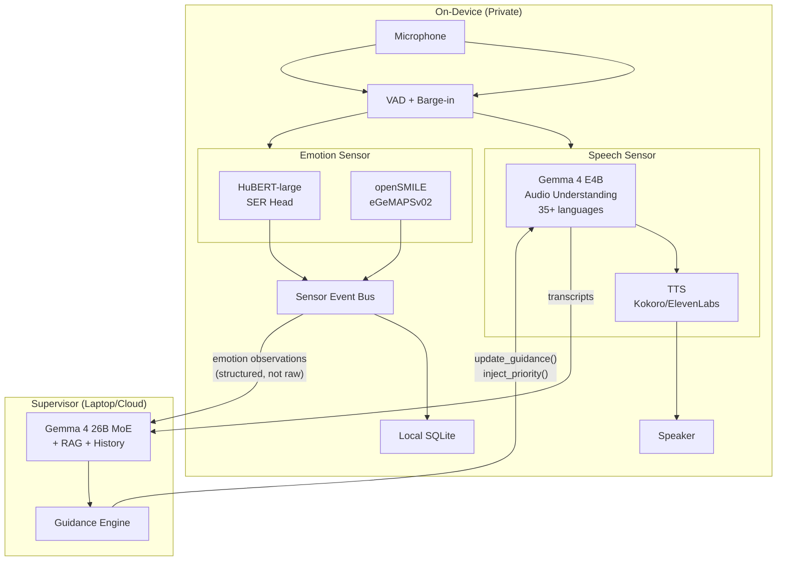
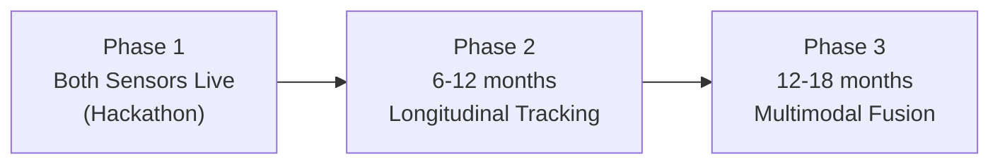

> **Status**: Active
> **Date**: 2026-05-29
> **Author**: \@mohammadi
> **Audience**: engineers
> **Tags**: `yar`, `voice`, `evaluation`, `asr`, `tts`

> [!NOTE]
> **TL;DR**: No single voice model handles everything Yar needs. Use **Gemma 4 E4B** for speech understanding + **HuBERT/openSMILE** as a parallel emotion sensor. The emotion sensor is non-negotiable because no voice model produces the quantified, clinically-comparable features needed for longitudinal ND tracking. All biometric data stays on-device, always.
> **Source**: [voice_model_deep_evaluation.md](voice_model_deep_evaluation.md)

---

# ⚡ Voice Model Deep Evaluation

📍 **Breadcrumbs**: Cytonome > Yar > Research > Voice Model Evaluation

---

## ⚡ The Final Architecture (Read This First)

> [!TIP]
> **Section Summary**: Two independent sensors running in parallel. Speech sensor for conversation, Emotion sensor for clinical tracking.



| Component | Model | Role |
|---|---|---|
| **Speech Sensor** | Gemma 4 E4B | Audio understanding + response generation |
| **Emotion Sensor** | HuBERT + openSMILE | Paralinguistic analysis + emotion recognition |
| **TTS** | Kokoro 82M (v1.0), ElevenLabs on-device (v1.1+) | Voice output |
| **Supervisor** | Gemma 4 26B MoE | Strategic guidance + RAG |

---

## 🔬 1. Three Evaluation Criteria

> [!TIP]
> **Section Summary**: We evaluated voice models on three specific capabilities critical to the neuropsych companion use case.

| # | Capability | Why It Matters |
|---|---|---|
| **A** | Supervisor can interrupt and redirect the conversation | Steer toward productive territory, inject missed context, escalate when safety is at risk |
| **B** | Model understands nonverbal communication (prosody, hesitation, breathing) | ND individuals often communicate more through **how** they speak than **what** they say |
| **C** | Nonverbal cues can be stored for longitudinal tracking | Yar's long-term value is tracking cognitive and emotional patterns over weeks and months |

---

## 🔬 2. Capability A: Supervisor Control

> [!TIP]
> **Section Summary**: Moshi has the best native supervisor channel (9/10) but only supports English. Gemma 4 cascade is second (7/10) with 35+ languages.

### Scorecard

| Architecture | Score | Key Strength | Key Weakness |
|---|---|---|---|
| **Moshi + MoshiRAG** | **9/10** | Native full-duplex supervisor channel | English only, CC-BY license |
| **Gemma 4 cascade** | **7/10** | Clean function-call interface, 35+ languages | Requires VAD + cancel engineering |
| **Qwen3.5-Omni** | **6/10** | Good omni-modal reasoning | Inject between segments only |
| **LFM2.5-Audio** | **5/10** | Some interleaved overlap | No clean supervisor channel |
| **Whisper cascade** | **4/10** | Well-understood pipeline | Three-component coordination is complex |

<details>
<summary>🔬 Deep Dive: How Moshi's Supervisor Channel Works</summary>

Moshi runs in full-duplex mode with three simultaneous streams:
1. **Stream 1**: User audio in, converted to Moshi audio tokens
2. **Stream 2**: Moshi audio tokens out to speaker
3. **Stream 3**: Supervisor text/audio tokens injected as "other speaker" input

When the supervisor sends guidance, Moshi naturally integrates it into its next utterance. No pipeline break, no visible interruption to the user.

**MoshiRAG** (April 2026) adds: when Moshi needs external knowledge, it generates a `<ret>` token, background retrieval fetches context, and Moshi incorporates it while continuing to generate filler. The user hears no gap.

</details>

<details>
<summary>🔬 Deep Dive: How Gemma 4 Supervisor Control Works</summary>

```
1. User speaks -> Gemma 4 transcribes + understands
2. Supervisor sends: function_call: update_guidance(
     focus="sleep patterns",
     tone_shift="gentle",
     probe_topic="insomnia mentioned earlier",
     urgency="normal"
   )
3. Gemma 4 integrates guidance into next response
4. Kokoro speaks the response

For URGENT interrupt:
1. Supervisor sends: inject_priority_message(interrupt=true)
2. VAD controller cancels current TTS output
3. Gemma 4 generates safety response
4. Kokoro speaks the new response
```

Gemma 4's native function calling makes supervisor instructions first-class structured inputs.

</details>

---

## 🔬 3. Capability B: Nonverbal Understanding

> [!TIP]
> **Section Summary**: No voice model produces quantified clinical features. The HuBERT + openSMILE sensor pipeline is non-negotiable.

### What "Nonverbal" Means in Voice AI

| Cue Category | Examples | ND Clinical Relevance |
|---|---|---|
| **Prosodic** | Pitch variation, speech rate, rhythm | Flat prosody in autism; rapid rate in ADHD |
| **Disfluency** | "um", "uh", false starts, repetitions | Cognitive load indicator |
| **Temporal** | Response latency, pause duration | Processing speed, executive function |
| **Vocal quality** | Breathiness, tremor, vocal fry | Fatigue, stress, medication effects |
| **Non-speech sounds** | Sighs, laughter, crying | Emotional state, frustration, relief |
| **Engagement** | Turn length changes, topic coherence | Attention drift, hyperfocus patterns |

### Scorecard

| Architecture | Score | Notes |
|---|---|---|
| **HuBERT + openSMILE** (sensor) | **9/10** | Purpose-built; quantified, benchmarked, clinically-validated |
| **Qwen3.5-Omni** (supervisor) | **7/10** | Best native audio reasoning; can interpret meaning contextually |
| **Moshi 7B** (edge) | **6/10** | Preserves nonverbal in token stream; no quantification |
| **Gemma 4 E4B** | **4/10** | Audio encoder processes but focuses on ASR |
| **LFM2.5-Audio** | **3/10** | Sparse documentation on paralinguistic features |
| **Whisper** | **2/10** | Strips nonverbal by design |

> [!IMPORTANT]
> **No voice model produces quantified, clinically-comparable nonverbal features.** The parallel sensor pipeline (HuBERT + openSMILE) is non-negotiable for the neuropsych use case.

<details>
<summary>🔬 Deep Dive: Feature Detection Comparison Matrix</summary>

| Cue | Moshi | Gemma 4 | Qwen3.5 | HuBERT + openSMILE |
|---|---|---|---|---|
| Pitch variation | ✅ In tokens | ⚠️ Via encoder | ✅ Native | ✅ **Quantified** (F0) |
| Speech rate | ⚠️ Implicit | ⚠️ Via timing | ✅ Can measure | ✅ **Quantified** (syl/sec) |
| Hesitations | ✅ Non-speech tokens | ⚠️ May transcribe | ⚠️ Can detect | ✅ **Quantified** (count, duration) |
| Breathing | ⚠️ Partial | ❌ | ⚠️ Possible | ✅ **Quantified** (respiratory) |
| Jitter/shimmer | ❌ | ❌ | ❌ | ✅ **Quantified** (Hz, dB) |
| Valence/arousal | ❌ | ❌ | ⚠️ Can infer | ✅ **Continuous dimensional** |

</details>

---

## 🔬 4. Capability C: Longitudinal Storage

> [!TIP]
> **Section Summary**: Vocal biomarkers are biometric data that NEVER leave the device. The schema captures prosodic, temporal, vocal quality, emotion, and ND-specific derived metrics.

> [!CAUTION]
> Vocal biomarkers are biometric data. They **NEVER** leave the device.

### Privacy Architecture

| Data | Storage | Crosses Wire? | Retention |
|---|---|---|---|
| Raw audio | Local only, ephemeral | ❌ NEVER | Deleted after feature extraction |
| VocalBiomarkerFrame | Local SQLite | ❌ NEVER | User-controlled |
| SessionVocalProfile | Local SQLite | ❌ NEVER | User-controlled |
| ADHD/ASD markers | Local SQLite | ❌ NEVER | User-controlled |
| Aggregated trends (no raw) | Local + optionally Anytype | ⚠️ Only if user explicitly exports | User-controlled |

### What This Enables

| Use Case | How It Works |
|---|---|
| **"How am I doing over time?"** | Visualize emotional arc, cognitive load, engagement patterns across weeks |
| **Medication tracking** | Objective before/after comparison of speech features |
| **Burnout early warning** | Detect vocal quality degradation before conscious awareness |
| **Social interaction prep** | Review vocal patterns before important conversations |
| **Therapist collaboration** | Optionally share summarized patterns (never raw audio) |

<details>
<summary>🔬 Deep Dive: VocalBiomarkerFrame Schema</summary>

Per-utterance extraction (~250ms analysis windows):

| Category | Features |
|---|---|
| **Prosodic** (openSMILE) | pitch_mean_hz, pitch_std_hz, pitch_range_hz, pitch_contour, speech_rate_syl_sec, articulation_rate |
| **Temporal** | pre_utterance_pause_ms, within_utterance_pauses, response_latency_ms |
| **Disfluency** | filled_pause_count, false_start_count, repetition_count |
| **Vocal quality** | jitter_percent, shimmer_db, hnr_db, spectral_centroid_hz, formant_frequencies |
| **Emotion** (HuBERT SER) | emotion_categorical, emotion_confidence, valence, arousal, dominance |
| **Non-speech events** | event_type (sigh, laugh, cry, breath), duration_ms, intensity |

</details>

<details>
<summary>🔬 Deep Dive: ND-Specific Derived Markers</summary>

**ADHD Vocal Markers**:
- Speech rate variability z-score (compared to baseline)
- Topic coherence score (semantic similarity between turns)
- Impulsive response count (responses <200ms after Yar finishes)
- Tangential shift count (abrupt topic changes mid-thought)
- Hyperfocus episodes (sustained engagement >5 min)
- Energy trajectory (ascending/plateau/descending/variable)

**ASD Vocal Markers**:
- Prosodic range score (pitch range normalized to baseline)
- Emotional expression range (variety of detected emotions)
- Turn-taking regularity (response timing consistency)
- Sensory overload indicators (speech degradation + disengagement spikes)

</details>

---

## 🔬 5. Feature Source Mapping

> [!TIP]
> **Section Summary**: Which tool produces which feature, and how fast.

| Feature Category | Primary Source | Latency |
|---|---|---|
| **Prosodic** (pitch, rate, rhythm) | openSMILE eGeMAPSv02 | ~10ms (real-time) |
| **Vocal quality** (jitter, shimmer) | openSMILE | Real-time |
| **Emotion categorical** | HuBERT-large fine-tuned SER | ~50ms |
| **Valence/arousal/dominance** | Dimensional SER model | ~50ms |
| **Non-speech events** | VAD + classifier | Real-time |
| **Disfluency** | ASR + post-processing | ~200ms |
| **ADHD/ASD markers** | **Derived** from above | Post-session batch |

---

## ⚡ 6. Model Selection Decision Matrix

> [!TIP]
> **Section Summary**: Five configurations depending on what you optimize for.

| Optimize For | Edge Model | Emotion Sensor | TTS | Supervisor |
|---|---|---|---|---|
| **Fastest to v1** | Gemma 4 E4B | HuBERT + openSMILE | Kokoro 82M | Gemma 4 26B MoE |
| **Best TTS quality** | Gemma 4 E4B | HuBERT + openSMILE | ElevenLabs on-device | Gemma 4 26B MoE |
| **Best supervisor control** | Moshi 7B | HuBERT + openSMILE | Moshi native | Qwen3.5-Omni |
| **Best multimodal emotion** | Any | HuBERT + openSMILE + DeiT + BERT | Any | Fusion layer |
| **Full open-source** | Gemma 4 E4B + Kokoro | HuBERT + openSMILE | Kokoro 82M | Gemma 4 26B MoE |

---

## 🏗️ 7. Multi-Language Support

> [!IMPORTANT]
> Multi-language support is a **day-one requirement**, not a future feature. Cytonome targets global users, including communities where neurodivergent individuals have even fewer resources.

| Component | Language Support | Mechanism |
|---|---|---|
| **Speech Sensor** (Gemma 4) | 35+ languages | Native multilingual audio understanding |
| **Emotion Sensor** (HuBERT + openSMILE) | **All languages** | Paralinguistic features are acoustic, not linguistic |
| **TTS** (Kokoro) | ~20 languages | Expanding |
| **TTS** (ElevenLabs on-device) | 70+ languages | Evaluation target for v1.1+ |

💡 **101 Sidebar: Why is the Emotion Sensor language-independent?**

> Features like pitch, speech rate, jitter, and shimmer are acoustic properties of the voice signal. They do not depend on what language you speak. A sigh sounds like a sigh in every language.

---

## 🏗️ 8. Phased Rollout



| Phase | Key Additions |
|---|---|
| **Phase 1** | Gemma 4 E4B + HuBERT + openSMILE + Kokoro TTS + local SQLite storage |
| **Phase 2** | Text emotion sensor (XLM-R), SessionVocalProfile aggregation, ADHD/ASD marker derivation, ElevenLabs on-device TTS |
| **Phase 3** | Intermediate fusion layer (Voice + Facial + Text), 91.89% accuracy (MindMed benchmarks), HIPAA VPC for clinical research |

---

## 📖 Glossary

<details>
<summary>Expand terminology table</summary>

| Term | Definition |
|---|---|
| **VAD** | Voice Activity Detection. Determines when someone is speaking vs. silence. |
| **Barge-in** | When a user starts speaking while the AI is still talking, interrupting it. |
| **Full-duplex** | Both sides can speak simultaneously (like a phone call), as opposed to walkie-talkie style. |
| **Prosody** | The patterns of stress, rhythm, and intonation in speech. |
| **Disfluency** | Interruptions in the flow of speech: "um", "uh", false starts, repetitions. |
| **F0 contour** | Fundamental frequency over time. The pitch pattern of speech. |
| **Jitter** | Cycle-to-cycle variation in vocal pitch. Higher jitter can indicate stress or vocal fatigue. |
| **Shimmer** | Amplitude variation in the voice signal. Similar to jitter but for loudness. |
| **HNR** | Harmonic-to-Noise Ratio. Measures voice clarity. Lower HNR can indicate breathiness or hoarseness. |
| **SER** | Speech Emotion Recognition. Classifying emotions from audio features. |
| **HuBERT** | Hidden-Unit BERT. A self-supervised speech representation model. |
| **openSMILE** | Open-source Speech and Music Interpretation by Large-space Extraction. A toolkit for extracting acoustic features. |
| **eGeMAPSv02** | Extended Geneva Minimalistic Acoustic Parameter Set v02. A standardized feature set for voice research. |
| **Valence** | How positive or negative an emotion is (-1 to +1). |
| **Arousal** | How calm or activated an emotional state is (0 to 1). |
| **IEMOCAP** | Interactive Emotional Dyadic Motion Capture. A benchmark dataset for emotion recognition. |
| **MoshiRAG** | Moshi's retrieval-augmented generation system for injecting knowledge during conversation. |
| **LiteRT** | Google's on-device ML runtime (formerly TensorFlow Lite). |
| **Gemma** | Google's open-weight language model family. |
| **Kokoro** | An open-source TTS model (82M parameters, Apache 2.0). |
| **DeiT** | Data-efficient Image Transformer. Used for facial emotion recognition. |
| **XLM-R** | Cross-lingual Language Model. A multilingual text understanding model. |
| **ND** | Neurodivergent. Refers to ADHD, autism, dyslexia, and other neurological variations. |
| **MindMed AI** | A multimodal emotion recognition architecture combining voice, face, and text modalities. |

</details>