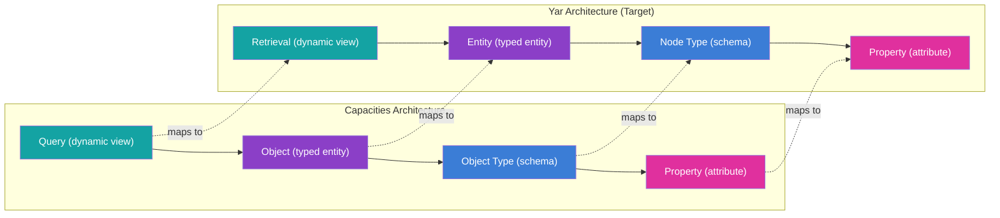
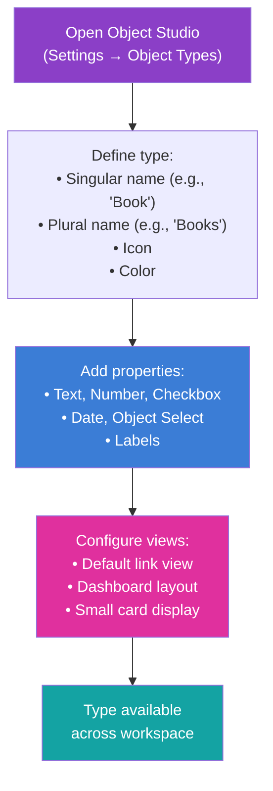
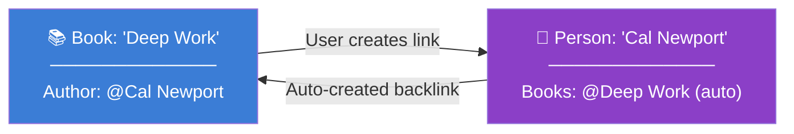
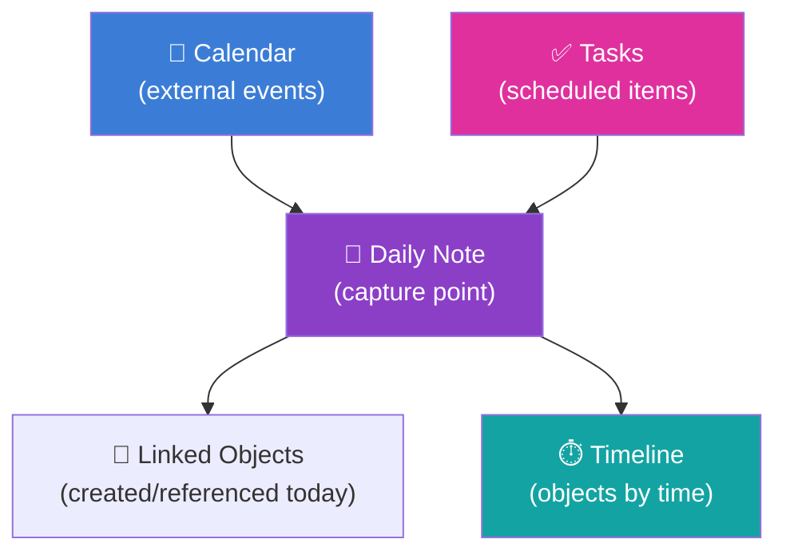
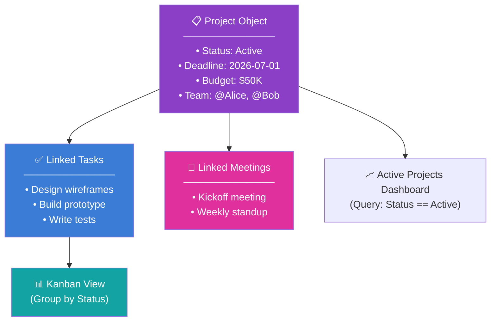

---

# Capacities.io Deep Dive: Feature Analysis and Yar Mapping

> **Status**: Active
> **Date**: 2026-07-10
> **Author**: @shahin
> **Audience**: engineers
> **Tags**: `engineering`
> **Variants**: Technical (this doc) - Readable (Obsidian twin optional, same filename) - Agent (n/a)

> **Owner**: Shahin Mohammadi · **Created**: 2026-05-24 · **Status**: DRAFT
> **Canonical location**: `~/repos/cytognosis/org/plans/research/capacities-deep-dive.md`
> **Purpose**: Exhaustive feature analysis of Capacities.io for Cytonome/Yar feature prioritization

---

## Section Map

| # | Section | Purpose |
|---|---------|---------|
| 1 | [Executive Summary](#1-executive-summary) | Key takeaways for Yar |
| 2 | [Product Overview](#2-product-overview) | What Capacities is, pricing, platforms |
| 3 | [Object System](#3-object-system) | Built-in types, custom types, properties |
| 4 | [Views and Data Visualization](#4-views-and-data-visualization) | All view types, configuration, queries |
| 5 | [Graph Visualization](#5-graph-visualization) | Graph view, filtering, tag networks |
| 6 | [Daily Notes and Temporal Organization](#6-daily-notes-and-temporal-organization) | Daily notes, calendar, timeline |
| 7 | [AI Features](#7-ai-features) | Assistant, content generation, automation |
| 8 | [Task Management](#8-task-management) | Tasks, Kanban, statuses, project tracking |
| 9 | [Media and Content](#9-media-and-content) | Images, files, web clips, transclusion |
| 10 | [Collaboration](#10-collaboration) | Sharing, permissions, limitations |
| 11 | [Import Export and API](#11-import-export-and-api) | Data portability, API, integrations |
| 12 | [Platform and Navigation](#12-platform-and-navigation) | Desktop, mobile, offline, sidebar |
| 13 | [Comparative Analysis](#13-comparative-analysis) | Capacities vs other tools |
| 14 | [Yar Feature Mapping](#14-yar-feature-mapping) | Every feature mapped to Yar equivalent |
| 15 | [Recommendations](#15-recommendations) | Priority features for Yar adoption |

---

## 1. Executive Summary

### Key Finding

Capacities represents the most intuitive implementation of "object-oriented knowledge management" available today. Its philosophy of "thinking in things" provides a cleaner, more accessible model for non-technical users than Tana's power-user-oriented supertags. While less programmable than Tana, Capacities excels in three areas critical to Yar: the Object Studio for type creation, the multi-view data visualization system, and the contextualized task management that embeds tasks where work happens.

### Top 5 Features for Yar Adoption

| Priority | Capacities Feature | Yar Application | Effort |
|----------|-------------------|-----------------|--------|
| **P0** | Object Studio (typed entities with properties) | Entity type creation UX | Medium (UI/schema design) |
| **P0** | Multi-view data visualization (table, board, calendar, gallery) | Entity collection rendering | High (view engine) |
| **P0** | Two-way linked properties | Bidirectional relationship management | Medium (graph layer) |
| **P1** | Daily notes as capture funnel | Health journal entry point | Low (pattern implementation) |
| **P1** | Contextualized task management | Health action tracking within context | Medium (task system) |

### Architecture Comparison

---

## 2. Product Overview

### What is Capacities?

Capacities is an object-oriented personal knowledge management platform branded as a "Studio for Your Mind." Its core philosophy is "thinking in things": every piece of information is a typed object (a Book, Person, Meeting, Project) rather than a page or file. The platform is independently funded (not venture-backed), relying entirely on user subscriptions for sustainability.

### Pricing

| Plan | Monthly | Annual (per month) | Key Features | Key Limits |
|------|---------|-------------------|--------------|------------|
| **Basic (Free)** | $0 | $0 | Unlimited spaces, objects, blocks, custom types, sync, offline, import/export | 5GB storage, no AI, no smart queries |
| **Pro** | ~$9.99 | ~$7.99 | AI assistant, unlimited storage, smart queries, calendar integration, API, task actions | Fair-use storage limits |
| **Believer** | ~$12.49 | ~$12.49 | Everything in Pro + beta access to new features | Supports independent development |

> [!NOTE]
> Capacities' free tier is significantly more generous than Tana's. Unlimited objects, unlimited custom types, unlimited spaces vs Tana's 5-supertag limit. The primary gating on the free tier is storage (5GB) and the absence of AI features.

**Discounts**: Student 40% off annual plans.

### Platform Availability

| Platform | Status | Key Notes |
|----------|--------|-----------|
| **Desktop** (macOS, Windows, Linux) | Full | Most powerful version, best offline support |
| **Mobile** (iOS, Android) | Full | Bottom nav: Space, Calendar, Quick Action, Search, AI Chat |
| **Web** | Full | Chrome recommended for optimal performance |

### Technical Infrastructure (2025-2026)

> [!IMPORTANT]
> Capacities migrated from a **dedicated graph database** to **Postgres** in early 2026. This is architecturally significant: they maintained the "graph feel" and relationship-based linking while gaining reliability, scalability, and cost efficiency. This mirrors what Yar may need to consider when choosing between a native graph DB (SurrealDB) and a relational DB with graph-like capabilities.

---

## 3. Object System

> [!IMPORTANT]
> The Object System is the foundation of Capacities. Unlike Tana's "everything is a node" approach, Capacities starts from "everything is a typed thing." This provides more immediate structure but less flexibility for retroactive typing.

### 3.1 Basic (Built-in) Object Types

These are system-defined types with specialized functionality. They **cannot** have custom properties added and **cannot** be converted to other types.

| Object Type | Purpose | Special Functionality |
|------------|---------|----------------------|
| **Page** | Simple note-taking | Minimal structure, write-first |
| **Tag** | Organizing via keywords | Cross-object categorization, tag network graph |
| **Image** | Image files | Auto-created on upload, media viewer, AI analysis |
| **Weblink** | URLs and web content | Auto-metadata extraction, preview cards |
| **PDF** | Document management | In-app reading, annotation, tagging |
| **Audio** | Audio files | Upload, WhatsApp/Telegram capture |
| **Tweet** | Social media posts | Legacy type, may evolve to broader social type |
| **Files** | Generic file uploads | Download, basic metadata |
| **AI Chat** | AI interaction sessions | Built-in chat interface persisted as objects |
| **Query** | Saved dynamic views | Rule-based, auto-updating filtered views |
| **Table** | Structured data | Spreadsheet-style data storage |

### 3.2 Custom Object Types (Object Studio)

The **Object Studio** is the UI for creating user-defined object types. This is Capacities' equivalent of Tana's supertag creation.

**Creating a Custom Object Type**:

**Schema Consistency Rule**: When you add a property to a custom object type, that property is applied to **every** object of that type. This ensures data predictability but means you cannot have per-instance property variations (unlike Tana where individual nodes can have ad-hoc fields).

### 3.3 Property Types

| Property Type | Data Format | Key Features |
|--------------|-------------|--------------|
| **Text** | Formatted text | Supports rich formatting, AI auto-fill toggle |
| **Number** | Numeric values | Multiple format options (decimal, integer, currency, percentage) |
| **Checkbox** | Boolean | Simple true/false toggle |
| **Date** | Date/datetime | Integrated with calendar views, date grouping |
| **Object Select** | Reference to other objects | Primary relationship mechanism (see 3.4) |
| **Labels** | Dropdown/multi-select | Fixed category values within a type (e.g., Status labels) |

### 3.4 Object Select and Two-Way Linking

**Object Select** is the most powerful property type. It creates typed, managed relationships between objects.

**Configuration Options**:

| Setting | Options | Description |
|---------|---------|-------------|
| **Target type** | Any custom or basic object type | Which type of object can be selected |
| **Cardinality** | Single-select or Multi-select | One vs many relationships |
| **Fixed Set** | Enable/disable | Restrict selections to a specific subset |
| **Two-Way Linking** | Enable/disable | Auto-sync relationship in both directions |

**Two-Way Linking Deep Dive**:

**Behavior**: When you add "Cal Newport" as the Author of "Deep Work," the Person object for "Cal Newport" automatically shows "Deep Work" in its Books property, with no manual action required.

**Limitations**:

| Limitation | Impact |
|-----------|--------|
| Two-way linking only works between **custom** object types | Cannot auto-link to basic types (Image, PDF, Weblink, etc.) |
| Must configure on both sides | Requires setting up the corresponding property in the target type |
| No cascading deletes | Deleting one side does not remove the other side's reference |

### 3.5 Labels vs Object Select

| Aspect | Labels | Object Select |
|--------|--------|---------------|
| **Data source** | Fixed set defined in type settings | Dynamic, all objects of target type |
| **Relationship** | Categorization within one type | Cross-type linking |
| **Two-way** | No | Yes (custom types only) |
| **Best for** | Status, priority, category | Attendees, authors, related projects |
| **Graph impact** | No edges created | Creates edges in graph view |

---

## 4. Views and Data Visualization

### 4.1 Object Dashboards

Every object type has a dedicated **dashboard** that serves as the type-level overview. Dashboards are customizable with sections.

**Dashboard Sections**:

| Section | Description |
|---------|-------------|
| **Recently Opened** | Objects of this type you recently viewed |
| **Untagged** | Objects without any tags (helps find orphans) |
| **Custom Queries** | Embedded query views for filtered subsets |
| **Collections** | Manually curated groups |

### 4.2 Data View Types

| View | Display Style | Best For | Key Feature |
|------|--------------|----------|-------------|
| **Table** | Spreadsheet with property columns | Detailed comparison, bulk editing | Full property visibility, column reordering |
| **Wall/Gallery** | Visual cards in grid | Visual content, images, design projects | Customizable small card display properties |
| **List** | Simplified vertical list | Quick scanning, minimal UI | Clean, fast rendering |
| **Board/Kanban** | Columns grouped by property | Workflow management, task tracking | Drag-and-drop between columns updates property |

### 4.3 Queries (Dynamic Views)

Queries are the core mechanism for creating dynamic, self-updating views.

**Query Configuration**:

| Parameter | Options |
|-----------|---------|
| **Object types** | Filter to specific types |
| **Property filters** | Match on property values |
| **Tag filters** | Include/exclude by tags |
| **Collection filters** | Include/exclude by collections |
| **Sort** | By any property, ascending/descending |
| **Group by** | Any property (with date granularity: day/month/year) |
| **Layout** | Table, Wall, List, Board |

**Variable Queries** (2025 addition): Dynamic queries that adapt based on the context where they are embedded. For example, a query placed inside a Project object can automatically filter for tasks related to that specific project.

**Queries as Objects**: Saved queries are objects themselves, meaning they can be:
- Linked to other objects via @-references
- Embedded inside other pages
- Found via search
- Tagged and categorized

### 4.4 Collections (Manual Groups)

Collections are curated, manual groups within a single object type.

| Aspect | Queries | Collections |
|--------|---------|-------------|
| **Population** | Automatic (rule-based) | Manual (curated) |
| **Updates** | Self-updating as data changes | User manually adds/removes items |
| **Scope** | Can span all instances of a type | Same: within one object type |
| **Best for** | "All meetings in Q1 2026" | "My favorite articles" |

### 4.5 Group By

The **Group By** feature transforms any view into organized sections.

**Grouping Options**:

| Property Type | Grouping Behavior |
|--------------|-------------------|
| **Labels** | One column per label value (Kanban-ready) |
| **Object Select** | One section per linked object |
| **Date** | Configurable granularity: day, month, or year |
| **Number** | Configurable ranges |
| **Checkbox** | Two groups: checked vs unchecked |

> [!TIP]
> **Kanban boards in Capacities** are not a dedicated feature. They emerge naturally from combining a Board view with Group By on a Status label. This composable approach means any object type can become a Kanban board by adding a Status label and switching to Board view.

---

## 5. Graph Visualization

### 5.1 Knowledge Graph View

Capacities provides a built-in graph view that visualizes the entire knowledge network.

**Graph Features**:

| Feature | Description |
|---------|-------------|
| **Force-directed layout** | Nodes naturally cluster based on connection density |
| **Node rendering** | Objects displayed with type icon and name |
| **Edge rendering** | Lines between connected objects (via links, Object Select, tags) |
| **Zoom and pan** | Standard navigation controls |
| **Click to open** | Click any node to navigate to the object |

### 5.2 Graph Customization

| Customization | Description |
|--------------|-------------|
| **Hide object types** | Remove specific types (e.g., daily notes, images) to reduce clutter |
| **Filter highly-connected nodes** | Remove hub nodes that create visual noise |
| **Simplified view** | Nodes appear as colored dots instead of full labels |
| **Local graph** | View connections of a single object (ego graph) |

### 5.3 Tag Network Graph

A specialized graph view dedicated to tags, showing how topics connect to each other independently of the underlying notes.

**Use Cases**:
- Identify topic clusters in your knowledge base
- Discover unexpected connections between research areas
- Map the conceptual landscape of your thinking

### 5.4 Backlinks and Context

| Feature | Description |
|---------|-------------|
| **Explicit backlinks** | Created via `@` mentions or Object Select properties |
| **Backlink grouping** | Shown at bottom of object pages, grouped by source type |
| **Context display** | Each backlink shows surrounding content for context |
| **Automatic** | No manual maintenance required, fully managed by the system |

---

## 6. Daily Notes and Temporal Organization

### 6.1 Daily Notes

Daily notes are a fundamental pillar of Capacities, serving as the primary capture and entry point.

**Key Behaviors**:

| Behavior | Description |
|----------|-------------|
| **Auto-creation** | A daily note is created for each day, accessible from sidebar |
| **Quick capture** | Write anything without organizing first |
| **Object linking** | Reference any object type directly from daily notes via `@` |
| **Calendar integration** | Daily notes surface alongside calendar events |
| **Timeline view** | Day view includes a timeline section showing objects by creation/reference time |

### 6.2 Calendar Integration

| Integration | Description |
|-------------|-------------|
| **Google Calendar** | See external events alongside Capacities tasks and notes |
| **Microsoft 365** | Outlook calendar events surfaced |
| **Central calendar view** | Unified view: tasks + daily notes + external events |
| **Week and month views** | Planning horizons beyond single day |

### 6.3 Temporal Organization

> [!IMPORTANT]
> **Yar Relevance**: Daily notes as the default capture point aligns perfectly with Yar's health journal concept. A daily health note that auto-captures sensor readings, medication logs, mood entries, and voice memos provides the temporal backbone for health tracking.

---

## 7. AI Features

### 7.1 AI Assistant (Pro+)

**Context-Aware Chat**:

| Capability | Description |
|-----------|-------------|
| **Personal knowledge grounding** | References your notes, documents, and linked objects for answers |
| **Multi-object context** | Select multiple objects as context for a single conversation |
| **Backlink awareness** | AI can read into linked notes and backlinks for deeper context |
| **Cross-synthesis** | Synthesize across meeting notes, project documents, and research |

### 7.2 Content Generation and Writing Support

| Feature | Description |
|---------|-------------|
| **In-editor AI** | Select blocks → explain, improve, expand without separate chat |
| **Drafting** | Generate initial drafts from prompts |
| **Outlining** | Create outlines from topics |
| **Rephrasing** | Improve tone, clarity, or conciseness |
| **Summarization** | Condense long content |
| **Translation** | Multi-language support |

### 7.3 Smart Automation

| Feature | Description | Plan Required |
|---------|-------------|---------------|
| **Property Autofill** | AI fills object properties based on content | Pro |
| **AI Tagging** | Suggests tags to connect new content to existing knowledge | Pro |
| **Media Analysis** | OCR, categorization of images and media files | Pro |

### 7.4 Model Provider Flexibility

| Provider | Support |
|----------|---------|
| OpenAI (GPT series) | Via API key |
| Anthropic (Claude) | Via API key |
| Google (Gemini) | Via API key |
| Mistral | Via API key |
| xAI (Grok) | Via API key |

**Space-Level Control**: AI can be enabled or disabled for individual spaces, providing granular privacy control.

### 7.5 AI Help Assistant

A dedicated assistant trained on Capacities' own documentation and feedback boards, answering platform usage questions. This is separate from the general-purpose AI assistant.

---

## 8. Task Management

### 8.1 Contextualized Tasks

Capacities' task philosophy: **tasks live where you are already working**. Tasks are embedded in notes, projects, and daily notes rather than existing in a separate task application.

### 8.2 Task Statuses

| Status | Color | Description |
|--------|-------|-------------|
| **Not Started** | (Customizable) | Default state for new tasks |
| **Next Up** | (Customizable) | Prioritized for attention |
| **In Progress** | (Customizable) | Currently being worked on |
| **Done** | (Customizable) | Completed |

**Customization**: Statuses can be reordered, renamed, colored, and given icons in Settings → Task Management → Status Customization.

### 8.3 Task Dashboard

| View | Content |
|------|---------|
| **Inbox** | Tasks without a scheduled date |
| **Today** | Tasks scheduled for current day, grouped by status |
| **Scheduled** | Tasks grouped by date (overdue at top) |
| **Context** | Tasks grouped by related objects (projects, meetings) |

### 8.4 Task Creation

| Method | Description |
|--------|-------------|
| **Inline** | Create tasks within any note or object |
| **Command palette** | Quick-create from anywhere |
| **Mobile quick action** | Dedicated quick action button |
| **Daily note** | Add tasks directly to today's note |

**Task Properties**:

| Property | Type | Description |
|----------|------|-------------|
| **Status** | Label | Not Started, Next Up, In Progress, Done |
| **Priority** | Label | User-defined priority levels |
| **Date** | Date | Scheduled/due date |
| **Context** | Object Select | Link to project, meeting, or person |

### 8.5 Task Actions (External Integration)

Task Actions allow delegating tasks to external tools while maintaining context in Capacities.

| Integration | Description |
|-------------|-------------|
| **Todoist** | Create Todoist task, link back to Capacities |
| **Things** | Create Things task, link back to Capacities |
| **Jira** | Create Jira ticket, link back to Capacities |
| **Custom** | Send task to any webhook-compatible tool |

### 8.6 Project Tracking

---

## 9. Media and Content

### 9.1 Media as First-Class Citizens

In Capacities, media files are not attachments. They are objects with full metadata, tagging, and linking capabilities.

| Media Type | Object Type | Special Features |
|-----------|------------|-----------------|
| **Images** | Image | AI analysis (OCR, categorization), tagging, linking |
| **PDFs** | PDF | In-app reading, annotation, tagging |
| **Audio** | Audio | Upload, WhatsApp/Telegram capture, future transcription |
| **Files** | Files | Generic upload with metadata |
| **Weblinks** | Weblink | Auto-metadata extraction, preview cards |

### 9.2 AI Media Analysis

| Feature | Description |
|---------|-------------|
| **OCR** | Extract text from images |
| **Categorization** | AI-suggested categories and tags |
| **Description** | Auto-generated descriptions |
| **Search integration** | Extracted text becomes searchable |

### 9.3 Transclusion and Content Reuse

| Feature | Syntax | Behavior |
|---------|--------|----------|
| **Block embedding** | `((` to search | Embedded block is identical to original; edits sync everywhere |
| **Object embedding** | `@` command | Insert objects as inline, small card, wide card, or full embed |
| **Block reference** | Paste block link | Reference individual blocks and their children |

**Transclusion Behavior**: Any edit to an embedded block is reflected in ALL locations where it appears. This is true transclusion, not copy-paste.

### 9.4 Web Clipper

| Feature | Description |
|---------|-------------|
| **URL pasting** | Creates Weblink object with auto-metadata |
| **Content extraction** | Pulls title, description, image from URLs |
| **Browser extension** | Direct clip from browser to Capacities |
| **WhatsApp/Telegram** | Share links from messaging apps to create Weblinks |

---

## 10. Collaboration

### 10.1 Current State (2026)

> [!WARNING]
> Capacities is primarily a **Personal Knowledge Management** tool. It is **not** designed for multi-user real-time collaboration. There are no shared workspaces, no real-time co-editing, and no team permissions model.

| Feature | Status |
|---------|--------|
| **Real-time co-editing** | Not available |
| **Shared workspaces** | Not available |
| **Team permissions** | Not available |
| **Shared objects** | Not available |
| **Publishing** | Limited (no public sharing feature like Tana Publish) |

### 10.2 Workarounds

| Approach | Description |
|----------|-------------|
| **Task Actions** | Delegate to team tools (Todoist, Jira, Things) |
| **Export and share** | Export objects as Markdown/Word and share externally |
| **API integration** | Build custom sharing via REST API |

> [!NOTE]
> **Yar Relevance**: Capacities' single-user focus actually aligns well with Yar's privacy-first, personal health companion model. Health data should not be in shared workspaces by default. Yar's sharing model (via CAP protocol, Solid pods) is more appropriate than Capacities' approach.

---

## 11. Import Export and API

### 11.1 Import Capabilities

| Method | Formats | Availability |
|--------|---------|-------------|
| **Bulk Import** (Beta) | Markdown, CSV, media directories | Believers only |
| **Single file import** | Markdown, Text, LaTeX, Word, CSV | All plans |
| **Migration guides** | From Notion, Obsidian, other tools | All plans |

### 11.2 Export Capabilities

| Format | Content | Metadata |
|--------|---------|----------|
| **Markdown** | Full content with formatting | Properties → YAML frontmatter |
| **CSV** | Tabular data, collections | Properties as columns |
| **Word** | Rich formatted document | Basic metadata |
| **HTML** | Web-ready content | Links preserved |
| **LaTeX** | Academic formatting | Basic structure |

**Automated Backups**: Schedule full space backups (daily, weekly, or monthly) for local storage. Data ownership is a core Capacities value.

### 11.3 REST API

| Aspect | Detail |
|--------|--------|
| **Status** | Beta (current), API 2.0 under development |
| **Capabilities** | Read, create, manipulate content |
| **Authentication** | API token |
| **Plan required** | Pro |
| **Future (API 2.0)** | More extensive routes, third-party connectors |

### 11.4 Integrations

| Integration | Type | Description |
|-------------|------|-------------|
| **Readwise** | Native | Sync highlights from books, articles, podcasts |
| **Google Calendar** | Native | Surface events alongside daily notes |
| **Microsoft 365** | Native | Outlook calendar integration |
| **Raycast** | Extension | Quick capture from macOS |
| **Webhighlights** | Extension | Browser highlighting integration |
| **WhatsApp** | Capture | Forward messages to create objects |
| **Telegram** | Capture | Forward messages to create objects |
| **Email** | Capture | Forward emails to create objects |

---

## 12. Platform and Navigation

### 12.1 Spaces

Spaces are independent containers for organizing content.

| Feature | Description |
|---------|-------------|
| **Independence** | Each space has own object types, tags, settings |
| **Switching** | Space switcher in top-left (desktop) or top of sidebar (mobile) |
| **Unlimited** | All plans include unlimited spaces |

### 12.2 Sidebar Navigation

**Desktop Sidebar Sections**:

| Section | Content |
|---------|---------|
| **Space switcher** | Switch between spaces |
| **Custom sections** | User-created groups (e.g., "Work", "Personal") |
| **Pinned objects** | Frequently accessed items |
| **Object types** | Access dashboards for each type |
| **Recent** | Recently viewed objects |
| **Settings** | Space and account configuration |

### 12.3 Side Panel (Multitasking)

| Feature | Description |
|---------|-------------|
| **Purpose** | View multiple objects simultaneously |
| **Position** | Right side of main workspace |
| **Stacking** | Open and stack multiple objects |
| **Independence** | Side panel scrolls independently of main panel |

### 12.4 Mobile Navigation

| Element | Position | Content |
|---------|----------|---------|
| **Space overview** | Bottom nav, left | Home view |
| **Calendar/Daily Note** | Bottom nav | Today's note and calendar |
| **Quick Action** | Bottom nav, center | Rapid capture palette |
| **Search** | Bottom nav | Full-text search |
| **AI Chat** | Bottom nav, right | AI assistant |
| **Left sidebar** | Swipe right | Space switcher, settings, pinned, recent |

### 12.5 Offline Support

| Feature | Description |
|---------|-------------|
| **Offline-first architecture** | Work offline, auto-sync when reconnected |
| **Media download settings** | Download all media or required-only (storage management) |
| **Limitations offline** | AI features, full-text search, and search queries require internet |

---

## 13. Comparative Analysis

### Capacities vs Other Tools

| Feature | Capacities | Tana | Notion | Obsidian | Logseq |
|---------|-----------|------|--------|----------|--------|
| **Data model** | Object types | Node graph | Block database | File markdown | Block graph |
| **Type system** | Object Studio | Supertags | Database schemas | Tags + frontmatter | Properties |
| **Inheritance** | None | Extend (OOP) | None | None | None |
| **Two-way links** | Object Select | @-mentions | Relations | links (target archived/removed) | links (target archived/removed) |
| **Views** | Table, Board, Wall, List | Table, Cards, Calendar, List, Tabs | 6+ views | Community plugins | Queries |
| **AI** | Multi-model, growing | Deep native | Bolt-on | Plugin | None |
| **Task management** | Native + Kanban | Via supertags + views | Native | Plugin | Native (TODO) |
| **Collaboration** | None (PKM focus) | Basic workspace sharing | Full team | Obsidian Publish | None |
| **Offline** | Full (offline-first) | Desktop only | Partial | Full | Full |
| **API** | REST (beta) | Write-only Input API | Full REST | Local REST | None |
| **Pricing (free)** | Unlimited types/objects | 5 supertags, 2 workspaces | Generous | Free (local) | Free (local) |
| **Backend** | Postgres (migrated from graph DB) | Custom graph | Custom | Local files | Local files |

### Key Differentiators

| Differentiator | Advantage |
|----------------|-----------|
| **Object-first thinking** | More intuitive than node-first for most users |
| **Offline-first** | Works everywhere, syncs automatically |
| **Free tier generosity** | Unlimited core features without payment |
| **Media as objects** | Images, PDFs, audio are first-class citizens with metadata |
| **Postgres backend** | Proven reliability and scalability |
| **Independent/non-VC** | Long-term sustainability, user-aligned incentives |

---

## 14. Yar Feature Mapping

> [!IMPORTANT]
> This table maps every significant Capacities feature to its Yar equivalent (existing or required). Priority levels: **P0** = must-have for MVP, **P1** = important for v1.0, **P2** = nice-to-have, **P3** = future consideration.

### 14.1 Object System Features

| Capacities Feature | Description | Yar Equivalent (Existing) | Yar Implementation Required | Priority |
|-------------------|-------------|--------------------------|---------------------------|----------|
| Object types (built-in) | 11 system-defined types with fixed schemas | Entity system (154 implemented) | Map to Yar base entity types (Health Entry, Person, Medication, etc.) | **P0** |
| Custom object types (Object Studio) | User-defined types with custom properties | Node type concept exists | Build Object Studio UX for users to define health entity types | **P0** |
| Text property | Formatted text with AI auto-fill | Entity text fields | Already implemented | ✅ Done |
| Number property | Numeric with format options | Entity numeric fields | Ensure format options (decimal, integer, unit display) | **P1** |
| Checkbox property | Boolean toggle | Not implemented | Add boolean property type | **P1** |
| Date property | Date picker with calendar integration | Timestamp fields exist | Extend with date-only picker and calendar view integration | **P0** |
| Object Select property | Typed reference to other objects | Entity references (partial) | Build typed, validated Object Select with target type constraint | **P0** |
| Two-way linking | Auto-synced bidirectional relationships | Not implemented | Implement auto-reciprocal linking on Object Select | **P0** |
| Labels (dropdown/multi-select) | Fixed category values per type | Not implemented | Add label property type with configurable options | **P0** |
| Fixed Sets | Restrict Object Select to subset | Not implemented | Add subset constraints to Object Select | **P2** |
| Schema consistency | Property applies to ALL objects of type | Partial | Enforce schema-level property definitions | **P0** |

### 14.2 View Features

| Capacities Feature | Description | Yar Equivalent (Existing) | Yar Implementation Required | Priority |
|-------------------|-------------|--------------------------|---------------------------|----------|
| Object dashboards | Type-level overview with sections | Not implemented | Build per-type dashboard with configurable sections | **P0** |
| Table view | Spreadsheet-style property display | Not implemented | Build table renderer with column reordering | **P1** |
| Wall/Gallery view | Visual card grid | Not implemented | Build gallery renderer with configurable card display | **P2** |
| List view | Simplified vertical list | Exists (default) | Already implemented | ✅ Done |
| Board/Kanban view | Columns grouped by property | Not implemented | Build Kanban renderer with drag-and-drop status updates | **P1** |
| Queries (dynamic views) | Rule-based, auto-updating filtered views | Retrieval system (partial) | Extend with saved, embeddable queries with filter/sort/group | **P0** |
| Variable queries | Context-adaptive dynamic queries | Not implemented | Implement context-aware query variables | **P2** |
| Collections (manual groups) | Curated groups within a type | Not implemented | Build manual collection system | **P2** |
| Group By | Organize by any property value | Not implemented | Add group-by to all view types | **P1** |
| Filtering | Property-value based filtering | Partial (search) | Extend filter system to typed property values | **P0** |
| Sorting | Order by any property | Partial | Extend sort to custom properties | **P1** |

### 14.3 Graph Features

| Capacities Feature | Description | Yar Equivalent (Existing) | Yar Implementation Required | Priority |
|-------------------|-------------|--------------------------|---------------------------|----------|
| Knowledge graph view | Force-directed visualization of all objects | Not implemented | Build graph visualization (consider D3.js or Cytoscape.js) | **P1** |
| Graph filtering | Hide types, filter hub nodes | Not implemented | Add type and degree filtering to graph view | **P2** |
| Simplified graph | Colored dots mode | Not implemented | Implement minimal graph rendering mode | **P3** |
| Tag network graph | Topic-to-topic connections | Not implemented | Build tag co-occurrence visualization | **P2** |
| Local graph (ego graph) | Single object's connections | Not implemented | Build per-entity ego graph view | **P1** |
| Backlink panel | Grouped incoming references | Not implemented | Build backlink aggregation at bottom of entity views | **P0** |
| Backlink context | Surrounding text shown for each backlink | Not implemented | Include context snippets in backlink display | **P1** |

### 14.4 Daily Notes and Temporal Features

| Capacities Feature | Description | Yar Equivalent (Existing) | Yar Implementation Required | Priority |
|-------------------|-------------|--------------------------|---------------------------|----------|
| Daily notes | Auto-created daily capture entity | Not implemented | Implement daily health journal auto-creation | **P0** |
| Calendar integration | Google/Microsoft calendar sync | Not implemented | Integrate calendar APIs for health appointments, medication schedules | **P1** |
| Timeline view | Objects by creation time through the day | Not implemented | Build timeline renderer for daily health events | **P1** |
| Quick capture | Fast entry without organization | Not implemented | Build rapid capture interface (mobile-first) | **P0** |

### 14.5 AI Features

| Capacities Feature | Description | Yar Equivalent (Existing) | Yar Implementation Required | Priority |
|-------------------|-------------|--------------------------|---------------------------|----------|
| Context-aware AI assistant | References notes and backlinks | AI agent capabilities | Extend with entity-context grounding and backlink awareness | **P0** |
| Multi-object context | Select multiple objects for AI synthesis | Not implemented | Enable multi-entity context selection for AI conversations | **P1** |
| In-editor AI | Select text → explain, improve, expand | Not implemented | Build inline AI actions on selected content | **P1** |
| Property autofill | AI populates properties from content | Not implemented | Implement AI-powered property extraction from unstructured text | **P0** |
| AI tagging | Suggests tags for new content | Not implemented | Build auto-tagging pipeline for health content | **P0** |
| Media analysis (OCR) | Extract text from images | Not implemented | Integrate OCR for medical document images | **P1** |
| Model provider flexibility | BYO API keys for multiple providers | Not implemented | Build model router with user-configurable provider keys | **P1** |
| Space-level AI control | Enable/disable AI per space | Not implemented | Implement per-workspace AI privacy controls | **P1** |

### 14.6 Task Management Features

| Capacities Feature | Description | Yar Equivalent (Existing) | Yar Implementation Required | Priority |
|-------------------|-------------|--------------------------|---------------------------|----------|
| Contextualized tasks | Tasks embedded where work happens | Not implemented | Build health action items within context (medication, exercise, etc.) | **P0** |
| Task statuses | Not Started, Next Up, In Progress, Done | Not implemented | Implement configurable status labels for health actions | **P0** |
| Task dashboard | Inbox, Today, Scheduled, Context views | Not implemented | Build health action dashboard with temporal and context grouping | **P1** |
| Task Actions (external) | Delegate to Todoist, Jira, Things | Not implemented | Build action delegation to health apps (Apple Health, etc.) | **P2** |
| Priority levels | User-defined priority | Not implemented | Add priority property to health actions | **P1** |

### 14.7 Media and Content Features

| Capacities Feature | Description | Yar Equivalent (Existing) | Yar Implementation Required | Priority |
|-------------------|-------------|--------------------------|---------------------------|----------|
| Media as objects | Files with full metadata and linking | Not implemented | Treat health documents (lab results, scans) as first-class entities | **P0** |
| Transclusion | Edit-in-place embedded blocks | Not implemented | Implement true transclusion for content reuse | **P2** |
| Block embedding | `((` for block references | Not implemented | Build block reference system | **P2** |
| Object embedding | `@` for object cards | Entity references (partial) | Extend with visual embedding modes (inline, card, full) | **P1** |
| Web clipper | URL → structured object | Not implemented | Build health article/resource clipper | **P2** |

### 14.8 Platform Features

| Capacities Feature | Description | Yar Equivalent (Existing) | Yar Implementation Required | Priority |
|-------------------|-------------|--------------------------|---------------------------|----------|
| Offline-first architecture | Full offline with auto-sync | Not implemented | Implement local-first data layer (critical for health data privacy) | **P0** |
| Spaces | Independent content containers | Workspace concept | Ensure workspace isolation for different health domains | **P1** |
| Side panel | Multi-object viewing | Not implemented | Build split-view for reference browsing | **P1** |
| Mobile app | Full-featured iOS/Android | Planned | Build mobile companion with health capture focus | **P1** |
| Automated backups | Scheduled full space exports | Not implemented | Implement automated health data backup to local/Solid pods | **P1** |
| REST API | Programmatic access | Not implemented | Build REST API for health data integration (FHIR-compatible) | **P1** |
| Markdown export | Human-readable data portability | Not implemented | Implement markdown export preserving properties as frontmatter | **P1** |
| Custom sidebar sections | User-organized navigation groups | Not implemented | Build customizable sidebar with pinned entities and sections | **P1** |

---

## 15. Recommendations

### 15.1 Immediate Adoption (P0 for Yar MVP)

1. **Object Studio-inspired type creation**: Let users define health entity types (Symptom, Medication, Lab Result, Appointment) with typed properties
2. **Object Select with two-way linking**: Typed, validated references that auto-sync both directions (e.g., Medication → Condition auto-links Condition → Medication)
3. **Labels for status/category properties**: Dropdown/multi-select for tracking states (symptom severity, medication adherence, task status)
4. **Query system with saved views**: Rule-based, auto-updating views embeddable in entity pages
5. **Daily health notes**: Auto-created daily capture entity as the temporal backbone
6. **Media as first-class entities**: Lab results, scans, prescriptions as typed objects with metadata
7. **Offline-first architecture**: Critical for health data privacy, ensure all data works locally
8. **AI-powered property autofill and tagging**: Extract structured data from unstructured health notes

### 15.2 V1.0 Features (P1)

1. **Multi-view system**: Table, Kanban, Calendar renderers for entity collections
2. **Health action dashboard**: Inbox, Today, Scheduled views for health tasks
3. **Graph visualization**: Knowledge graph of health entities and their relationships
4. **Calendar integration**: Sync with health appointment calendars
5. **Model provider flexibility**: Let users choose their AI model for privacy
6. **REST API with FHIR compatibility**: Programmatic health data access

### 15.3 Key Design Lessons from Capacities

| Lesson | Application to Yar |
|--------|-------------------|
| **"Thinking in things" is more intuitive than "everything is a node"** | Present health data as typed objects (Medication, Symptom, Lab Result), not generic entries |
| **Schema consistency matters** | When a user adds a "Dosage" property to Medication type, every medication gets it |
| **Two-way linking should be automatic** | Linking a Medication to a Condition should auto-link the Condition to the Medication |
| **Views should be composable** | Kanban = Board view + Group By Status. Don't build rigid view types |
| **Offline-first is non-negotiable for health data** | Users must own their health data locally, sync is secondary |
| **Daily notes as temporal backbone** | Every health tracking system needs a "today" entry point |
| **Media analysis unlocks value** | OCR on medical documents, auto-categorization of lab images |
| **Postgres can do graphs** | Consider Postgres with graph-like queries over dedicated graph DB (SurrealDB) for reliability |

### 15.4 Capacities vs Tana: Which Patterns to Adopt?

| Design Decision | Adopt Tana's Pattern | Adopt Capacities' Pattern | Recommendation |
|----------------|---------------------|--------------------------|----------------|
| **Data model** | Everything is a node | Everything is a typed object | **Capacities** (health data needs types) |
| **Schema flexibility** | Retroactive, opt-in typing | Upfront type definition | **Hybrid**: define types upfront, allow ad-hoc properties |
| **Type inheritance** | Supertag Extend (OOP) | None | **Tana** (Symptom → Neurological Symptom hierarchy) |
| **AI depth** | Deep native integration | Growing but less mature | **Tana** (deeper AI for health intelligence) |
| **Voice features** | Native voice-to-structure | Not available | **Tana** (critical for health capture) |
| **View system** | Live search + views | Object dashboards + queries | **Capacities** (cleaner UX for non-technical users) |
| **Task management** | Via supertags (flexible) | Native with dashboard | **Capacities** (health actions need dedicated UI) |
| **Offline** | Desktop only | Full offline-first | **Capacities** (health data must work offline) |
| **Graph visualization** | Reference panel only | Full graph view | **Capacities** (health relationship visualization) |
| **Collaboration** | Basic workspace sharing | None (PKM focus) | **Neither** (use CAP protocol + Solid pods) |

---

**Document Version**: 1.0
**Last Updated**: 2026-05-24
**Next Review**: After Yar architecture planning session
**Owner**: Shahin Mohammadi, Cytognosis Foundation
