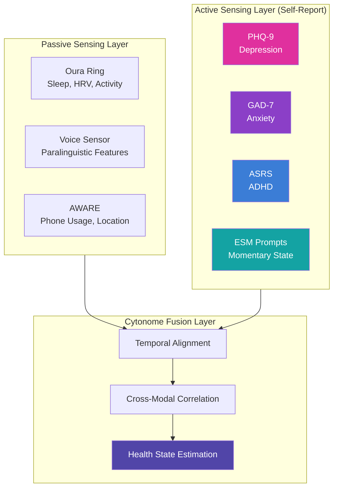
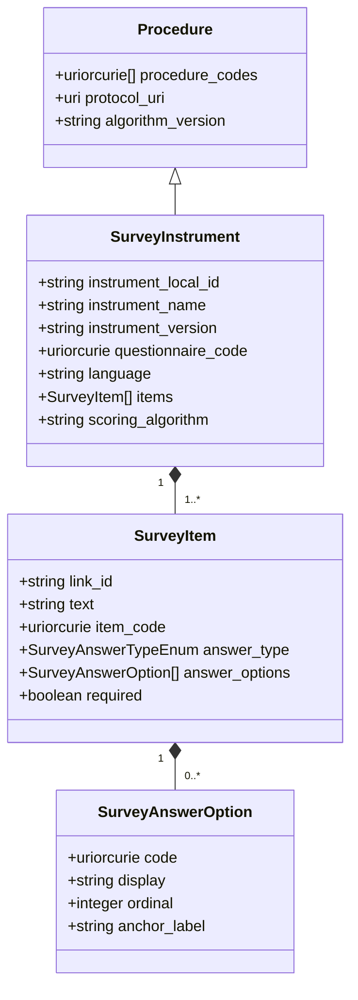
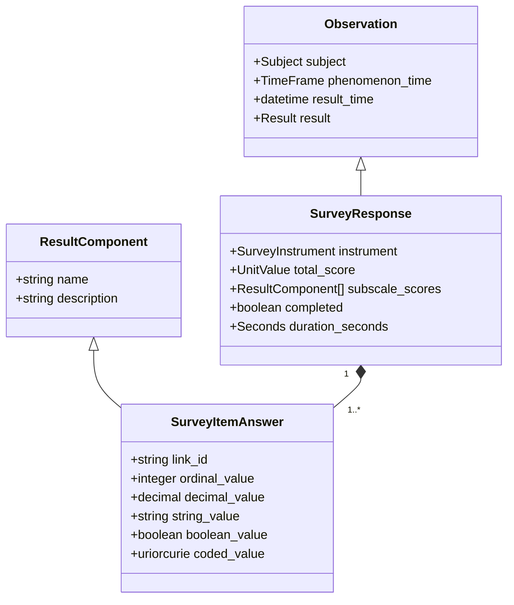
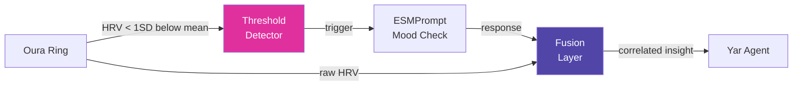
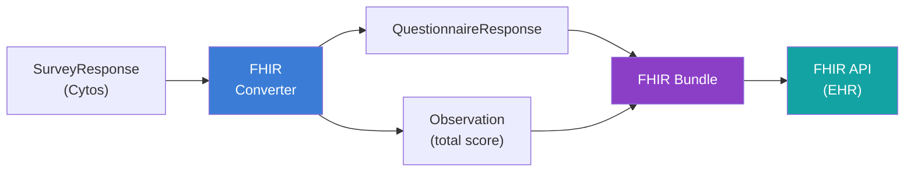

# Implementing Health Instruments in Cytonome

> **Status**: v0.1 (Design Specification)
> **Date**: 2026-05-30
> **Schema**: [selfreport.yaml](file:///home/mohammadi/repos/cytognosis/cytos/schemas/domains/sensor/core/selfreport.yaml) · [core.yaml](file:///home/mohammadi/repos/cytognosis/cytos/schemas/domains/sensor/core/core.yaml)
> **Scope**: Standardized health questionnaires, clinical scales, and ecological momentary assessment (EMA) instruments as first-class sensors in the Cytonome platform

---

## 1. Overview

### 1.1 Why Standardized Health Instruments Matter

Precision health depends on structured, reproducible measurement. A physician asking "How are you feeling?" produces unstructured, unanalyzable data. A PHQ-9 questionnaire, administered consistently over time, produces a numerical trajectory that reveals trends invisible to subjective recall.

Standardized health instruments bring three critical properties to Cytonome:

1. **Psychometric validation**: Every instrument in this catalog has published reliability (Cronbach's α, test-retest) and validity (sensitivity, specificity, convergent) data from peer-reviewed studies
2. **Clinical interoperability**: LOINC-coded instruments map directly to FHIR Questionnaire resources, enabling seamless data exchange with electronic health records (EHRs)
3. **Temporal resolution**: Repeated administration creates time-series data that correlates with passive sensor streams (HRV, sleep architecture, activity) for multi-modal health state estimation

### 1.2 The "Instrument as Sensor" Philosophy

In the Cytos schema, a PHQ-9 questionnaire is a measurement device, the same way an Oura Ring is a measurement device. Both produce structured `Observation` instances from a defined `Procedure`. The only difference is the transducer: one converts photoplethysmography into heart rate values, the other converts human self-reflection into ordinal Likert scores.

This is not a metaphor. The [Cytos sensor core schema](file:///home/mohammadi/repos/cytognosis/cytos/schemas/domains/sensor/core/core.yaml) defines `Procedure` (line 504) as "workflow, protocol, algorithm, or instrument-specific method used to obtain an Observation." A validated questionnaire is exactly that.

| Concept | Wearable Sensor | Self-Report Instrument |
|---|---|---|
| **Procedure** | PPG algorithm v2.1 | PHQ-9 questionnaire |
| **Sensor** | Optical heart rate sensor | Survey engine |
| **Observation** | Heart rate: 72 bpm | PHQ-9 total score: 14 |
| **Result** | `UnitValue` (72, /min) | `CompoundResult` (9 item answers + total) |
| **Feature of Interest** | Cardiovascular system | Mental health state |
| **LOINC Code** | 8867-4 (Heart rate) | 44249-1 (PHQ-9 panel) |

### 1.3 Self-Report Data in the Cytonome Ecosystem

Self-report instruments occupy a unique position in the Cytonome sensor architecture. They capture the subjective dimension of health that passive sensors cannot access: the felt experience of depression, the cognitive fog of executive dysfunction, the anxiety that produces no detectable physiological signature.



The Cytos [selfreport.yaml](file:///home/mohammadi/repos/cytognosis/cytos/schemas/domains/sensor/core/selfreport.yaml) schema maps these instruments to the sensor core:

- `SurveyInstrument` extends `Procedure` (the measurement protocol)
- `SurveyResponse` extends `Observation` (the measurement result)
- `SurveyItemAnswer` extends `ResultComponent` (individual data points)
- `ESMPrompt` extends `SurveyInstrument` (context-triggered micro-surveys)

---

## 2. Instrument Catalog

This section catalogs every health instrument supported by Cytonome v0.1. Each entry provides the clinical specification, LOINC codes, full item text, scoring algorithm, and Cytos schema mapping.

### 2.1 Depression

#### 2.1.1 PHQ-9 (Patient Health Questionnaire-9)

The PHQ-9 is the gold standard for depression screening and severity monitoring. It maps directly to the nine DSM-5 criteria for major depressive disorder.

| Property | Value |
|---|---|
| **LOINC Panel** | 44249-1 |
| **LOINC Total Score** | 44261-6 |
| **Items** | 9 |
| **Answer Type** | Likert (0-3) |
| **Score Range** | 0-27 |
| **Administration** | 2-3 minutes |
| **Recall Period** | Past 2 weeks |
| **Languages** | 80+ validated translations |

**Scoring Thresholds:**

| Score | Severity | Clinical Action |
|---|---|---|
| 0-4 | Minimal | No action needed |
| 5-9 | Mild | Watchful waiting, repeat in 2-4 weeks |
| 10-14 | Moderate | Treatment plan consideration |
| 15-19 | Moderately Severe | Active treatment recommended |
| 20-27 | Severe | Immediate treatment, consider referral |

**Full Item Text and LOINC Codes:**

| # | Link ID | LOINC | Text | Answer Options (0-3) |
|---|---|---|---|---|
| 1 | `phq9-01` | 44250-9 | Little interest or pleasure in doing things | Not at all (0), Several days (1), More than half the days (2), Nearly every day (3) |
| 2 | `phq9-02` | 44255-8 | Feeling down, depressed, or hopeless | Same as above |
| 3 | `phq9-03` | 44259-0 | Trouble falling or staying asleep, or sleeping too much | Same as above |
| 4 | `phq9-04` | 44254-1 | Feeling tired or having little energy | Same as above |
| 5 | `phq9-05` | 44251-7 | Poor appetite or overeating | Same as above |
| 6 | `phq9-06` | 44258-2 | Feeling bad about yourself, or that you are a failure, or have let yourself or your family down | Same as above |
| 7 | `phq9-07` | 44252-5 | Trouble concentrating on things, such as reading the newspaper or watching television | Same as above |
| 8 | `phq9-08` | 44253-3 | Moving or speaking so slowly that other people could have noticed. Or the opposite, being so fidgety or restless that you have been moving around a lot more than usual | Same as above |
| 9 | `phq9-09` | 44260-8 | Thoughts that you would be better off dead, or of hurting yourself in some way | Same as above |

> [!CAUTION]
> **Item 9 (suicidal ideation)**: Any response > 0 on item 9 triggers a safety protocol. Cytonome displays an immediate support message with crisis resources (988 Suicide and Crisis Lifeline) and flags the response for clinical review if the individual has a connected care team.

**Cytos SurveyInstrument Definition:**

```yaml
# PHQ-9 Instrument Definition
# Schema: cytos-sensor-selfreport
# Reference: Kroenke, Spitzer, & Williams (2001). J Gen Intern Med, 16(9), 606-613.

SurveyInstrument:
  id: sensor:instrument/phq-9
  name: "Patient Health Questionnaire-9"
  description: >-
    Nine-item depression severity measure corresponding to the nine DSM-5
    criteria for major depressive disorder. Validated in primary care and
    community settings with sensitivity 88% and specificity 88% at cutoff ≥10.
  instrument_local_id: "phq-9"
  instrument_name: "PHQ-9"
  instrument_version: "1.0"
  questionnaire_code: loinc:44249-1
  language: "en"
  scoring_algorithm: "sum_ordinal"
  scoring_algorithm_version: "1.0"
  items:
    - link_id: "phq9-01"
      text: "Little interest or pleasure in doing things"
      item_code: loinc:44250-9
      answer_type: likert
      required: true
      repeats: false
      answer_options:
        - code: loinc:LA6568-5
          display: "Not at all"
          ordinal: 0
          anchor_label: "Not at all"
        - code: loinc:LA6569-3
          display: "Several days"
          ordinal: 1
          anchor_label: "Several days"
        - code: loinc:LA6570-1
          display: "More than half the days"
          ordinal: 2
          anchor_label: "More than half the days"
        - code: loinc:LA6571-9
          display: "Nearly every day"
          ordinal: 3
          anchor_label: "Nearly every day"

    - link_id: "phq9-02"
      text: "Feeling down, depressed, or hopeless"
      item_code: loinc:44255-8
      answer_type: likert
      required: true
      repeats: false
      answer_options:
        - code: loinc:LA6568-5
          display: "Not at all"
          ordinal: 0
        - code: loinc:LA6569-3
          display: "Several days"
          ordinal: 1
        - code: loinc:LA6570-1
          display: "More than half the days"
          ordinal: 2
        - code: loinc:LA6571-9
          display: "Nearly every day"
          ordinal: 3

    - link_id: "phq9-03"
      text: "Trouble falling or staying asleep, or sleeping too much"
      item_code: loinc:44259-0
      answer_type: likert
      required: true
      repeats: false
      answer_options:
        - code: loinc:LA6568-5
          display: "Not at all"
          ordinal: 0
        - code: loinc:LA6569-3
          display: "Several days"
          ordinal: 1
        - code: loinc:LA6570-1
          display: "More than half the days"
          ordinal: 2
        - code: loinc:LA6571-9
          display: "Nearly every day"
          ordinal: 3

    - link_id: "phq9-04"
      text: "Feeling tired or having little energy"
      item_code: loinc:44254-1
      answer_type: likert
      required: true
      repeats: false
      answer_options:
        - code: loinc:LA6568-5
          display: "Not at all"
          ordinal: 0
        - code: loinc:LA6569-3
          display: "Several days"
          ordinal: 1
        - code: loinc:LA6570-1
          display: "More than half the days"
          ordinal: 2
        - code: loinc:LA6571-9
          display: "Nearly every day"
          ordinal: 3

    - link_id: "phq9-05"
      text: "Poor appetite or overeating"
      item_code: loinc:44251-7
      answer_type: likert
      required: true
      repeats: false
      answer_options:
        - code: loinc:LA6568-5
          display: "Not at all"
          ordinal: 0
        - code: loinc:LA6569-3
          display: "Several days"
          ordinal: 1
        - code: loinc:LA6570-1
          display: "More than half the days"
          ordinal: 2
        - code: loinc:LA6571-9
          display: "Nearly every day"
          ordinal: 3

    - link_id: "phq9-06"
      text: >-
        Feeling bad about yourself, or that you are a failure, or have let
        yourself or your family down
      item_code: loinc:44258-2
      answer_type: likert
      required: true
      repeats: false
      answer_options:
        - code: loinc:LA6568-5
          display: "Not at all"
          ordinal: 0
        - code: loinc:LA6569-3
          display: "Several days"
          ordinal: 1
        - code: loinc:LA6570-1
          display: "More than half the days"
          ordinal: 2
        - code: loinc:LA6571-9
          display: "Nearly every day"
          ordinal: 3

    - link_id: "phq9-07"
      text: >-
        Trouble concentrating on things, such as reading the newspaper or
        watching television
      item_code: loinc:44252-5
      answer_type: likert
      required: true
      repeats: false
      answer_options:
        - code: loinc:LA6568-5
          display: "Not at all"
          ordinal: 0
        - code: loinc:LA6569-3
          display: "Several days"
          ordinal: 1
        - code: loinc:LA6570-1
          display: "More than half the days"
          ordinal: 2
        - code: loinc:LA6571-9
          display: "Nearly every day"
          ordinal: 3

    - link_id: "phq9-08"
      text: >-
        Moving or speaking so slowly that other people could have noticed.
        Or the opposite, being so fidgety or restless that you have been
        moving around a lot more than usual
      item_code: loinc:44253-3
      answer_type: likert
      required: true
      repeats: false
      answer_options:
        - code: loinc:LA6568-5
          display: "Not at all"
          ordinal: 0
        - code: loinc:LA6569-3
          display: "Several days"
          ordinal: 1
        - code: loinc:LA6570-1
          display: "More than half the days"
          ordinal: 2
        - code: loinc:LA6571-9
          display: "Nearly every day"
          ordinal: 3

    - link_id: "phq9-09"
      text: >-
        Thoughts that you would be better off dead, or of hurting yourself
        in some way
      item_code: loinc:44260-8
      answer_type: likert
      required: true
      repeats: false
      answer_options:
        - code: loinc:LA6568-5
          display: "Not at all"
          ordinal: 0
        - code: loinc:LA6569-3
          display: "Several days"
          ordinal: 1
        - code: loinc:LA6570-1
          display: "More than half the days"
          ordinal: 2
        - code: loinc:LA6571-9
          display: "Nearly every day"
          ordinal: 3
```

**Cytos SurveyResponse Example:**

```yaml
# PHQ-9 Completed Response
# Individual scored 14 (Moderate depression)

SurveyResponse:
  id: sensor:response/phq9/2026-05-30T09-15-00Z
  name: "PHQ-9 Response 2026-05-30"
  instrument:
    id: sensor:instrument/phq-9
  observation_local_id: "phq9-resp-20260530"
  subject:
    id: sensor:subject/participant-001
  phenomenon_time:
    date_time: "2026-05-30T09:15:00-07:00"
  result_time: "2026-05-30T09:17:32-07:00"
  completed: true
  duration_seconds: 152

  total_score:
    value: 14
    unit: "{score}"
    unit_code: loinc:44261-6

  subscale_scores:
    - name: "Somatic"
      description: "Items 3, 4, 5, 8 (sleep, energy, appetite, psychomotor)"
      result:
        value: 7
        unit: "{score}"
    - name: "Cognitive-Affective"
      description: "Items 1, 2, 6, 7, 9 (interest, mood, self-worth, concentration, suicidality)"
      result:
        value: 7
        unit: "{score}"

  result:
    components:
      - link_id: "phq9-01"
        ordinal_value: 2
        coded_value: loinc:LA6570-1
      - link_id: "phq9-02"
        ordinal_value: 2
        coded_value: loinc:LA6570-1
      - link_id: "phq9-03"
        ordinal_value: 2
        coded_value: loinc:LA6570-1
      - link_id: "phq9-04"
        ordinal_value: 2
        coded_value: loinc:LA6570-1
      - link_id: "phq9-05"
        ordinal_value: 1
        coded_value: loinc:LA6569-3
      - link_id: "phq9-06"
        ordinal_value: 2
        coded_value: loinc:LA6570-1
      - link_id: "phq9-07"
        ordinal_value: 1
        coded_value: loinc:LA6569-3
      - link_id: "phq9-08"
        ordinal_value: 1
        coded_value: loinc:LA6569-3
      - link_id: "phq9-09"
        ordinal_value: 1
        coded_value: loinc:LA6569-3
```

**PHQ-9 Scoring Algorithm:**

```python
def score_phq9(answers: list[SurveyItemAnswer]) -> dict:
    """Score a completed PHQ-9 response.

    Args:
        answers: List of 9 SurveyItemAnswer instances with ordinal_value set.

    Returns:
        Dictionary with total_score, severity, somatic_subscale,
        cognitive_affective_subscale, and safety_flag.
    """
    ordinals = {a.link_id: a.ordinal_value for a in answers}

    total = sum(ordinals.values())

    # Somatic subscale: items 3, 4, 5, 8
    somatic = sum(ordinals[f"phq9-0{i}"] for i in [3, 4, 5, 8])

    # Cognitive-Affective subscale: items 1, 2, 6, 7, 9
    cognitive = sum(ordinals[f"phq9-0{i}"] for i in [1, 2, 6, 7, 9])

    # Severity classification
    if total <= 4:
        severity = "minimal"
    elif total <= 9:
        severity = "mild"
    elif total <= 14:
        severity = "moderate"
    elif total <= 19:
        severity = "moderately_severe"
    else:
        severity = "severe"

    # Safety flag: item 9 (suicidal ideation) > 0
    safety_flag = ordinals.get("phq9-09", 0) > 0

    return {
        "total_score": total,
        "severity": severity,
        "somatic_subscale": somatic,
        "cognitive_affective_subscale": cognitive,
        "safety_flag": safety_flag,
    }
```

#### 2.1.2 PHQ-2 (Abbreviated Depression Screen)

The PHQ-2 uses the first two items of the PHQ-9 as an ultra-brief depression screen. A score ≥3 triggers administration of the full PHQ-9.

| Property | Value |
|---|---|
| **LOINC Panel** | 55757-9 |
| **LOINC Total Score** | 55758-7 |
| **Items** | 2 (PHQ-9 items 1 and 2) |
| **Score Range** | 0-6 |
| **Threshold** | ≥3 triggers full PHQ-9 |
| **Sensitivity** | 83% for major depression |
| **Specificity** | 90% for major depression |

```yaml
# PHQ-2 Instrument Definition (abbreviated screen)
SurveyInstrument:
  id: sensor:instrument/phq-2
  name: "Patient Health Questionnaire-2"
  instrument_local_id: "phq-2"
  instrument_name: "PHQ-2"
  instrument_version: "1.0"
  questionnaire_code: loinc:55757-9
  language: "en"
  scoring_algorithm: "sum_ordinal_with_threshold"
  scoring_algorithm_version: "1.0"
  items:
    - link_id: "phq2-01"
      text: "Little interest or pleasure in doing things"
      item_code: loinc:44250-9
      answer_type: likert
      required: true
      answer_options:
        - { code: loinc:LA6568-5, display: "Not at all", ordinal: 0 }
        - { code: loinc:LA6569-3, display: "Several days", ordinal: 1 }
        - { code: loinc:LA6570-1, display: "More than half the days", ordinal: 2 }
        - { code: loinc:LA6571-9, display: "Nearly every day", ordinal: 3 }
    - link_id: "phq2-02"
      text: "Feeling down, depressed, or hopeless"
      item_code: loinc:44255-8
      answer_type: likert
      required: true
      answer_options:
        - { code: loinc:LA6568-5, display: "Not at all", ordinal: 0 }
        - { code: loinc:LA6569-3, display: "Several days", ordinal: 1 }
        - { code: loinc:LA6570-1, display: "More than half the days", ordinal: 2 }
        - { code: loinc:LA6571-9, display: "Nearly every day", ordinal: 3 }
```

**Adaptive Logic:**

```python
def should_administer_phq9(phq2_total: int) -> bool:
    """Determine if full PHQ-9 is needed based on PHQ-2 screen."""
    return phq2_total >= 3
```

---

### 2.2 Anxiety

#### 2.2.1 GAD-7 (Generalized Anxiety Disorder-7)

The GAD-7 measures generalized anxiety severity. It also has good sensitivity for panic disorder, social anxiety disorder, and PTSD.

| Property | Value |
|---|---|
| **LOINC Panel** | 69737-5 |
| **LOINC Total Score** | 70274-6 |
| **Items** | 7 |
| **Answer Type** | Likert (0-3) |
| **Score Range** | 0-21 |
| **Administration** | 1-2 minutes |
| **Recall Period** | Past 2 weeks |

**Scoring Thresholds:**

| Score | Severity | Clinical Action |
|---|---|---|
| 0-4 | Minimal | No action needed |
| 5-9 | Mild | Monitor, consider watchful waiting |
| 10-14 | Moderate | Treatment plan consideration |
| 15-21 | Severe | Active treatment recommended |

**Full Item Text and LOINC Codes:**

| # | Link ID | LOINC | Text |
|---|---|---|---|
| 1 | `gad7-01` | 69725-0 | Feeling nervous, anxious, or on edge |
| 2 | `gad7-02` | 68509-9 | Not being able to stop or control worrying |
| 3 | `gad7-03` | 69733-4 | Worrying too much about different things |
| 4 | `gad7-04` | 69734-2 | Trouble relaxing |
| 5 | `gad7-05` | 69735-9 | Being so restless that it is hard to sit still |
| 6 | `gad7-06` | 69689-8 | Becoming easily annoyed or irritable |
| 7 | `gad7-07` | 69736-7 | Feeling afraid, as if something awful might happen |

All items use the same Likert scale: Not at all (0), Several days (1), More than half the days (2), Nearly every day (3).

```yaml
# GAD-7 Instrument Definition
SurveyInstrument:
  id: sensor:instrument/gad-7
  name: "Generalized Anxiety Disorder-7"
  instrument_local_id: "gad-7"
  instrument_name: "GAD-7"
  instrument_version: "1.0"
  questionnaire_code: loinc:69737-5
  language: "en"
  scoring_algorithm: "sum_ordinal"
  scoring_algorithm_version: "1.0"
  items:
    - link_id: "gad7-01"
      text: "Feeling nervous, anxious, or on edge"
      item_code: loinc:69725-0
      answer_type: likert
      required: true
      answer_options:
        - { code: loinc:LA6568-5, display: "Not at all", ordinal: 0 }
        - { code: loinc:LA6569-3, display: "Several days", ordinal: 1 }
        - { code: loinc:LA6570-1, display: "More than half the days", ordinal: 2 }
        - { code: loinc:LA6571-9, display: "Nearly every day", ordinal: 3 }

    - link_id: "gad7-02"
      text: "Not being able to stop or control worrying"
      item_code: loinc:68509-9
      answer_type: likert
      required: true
      answer_options:
        - { code: loinc:LA6568-5, display: "Not at all", ordinal: 0 }
        - { code: loinc:LA6569-3, display: "Several days", ordinal: 1 }
        - { code: loinc:LA6570-1, display: "More than half the days", ordinal: 2 }
        - { code: loinc:LA6571-9, display: "Nearly every day", ordinal: 3 }

    - link_id: "gad7-03"
      text: "Worrying too much about different things"
      item_code: loinc:69733-4
      answer_type: likert
      required: true
      answer_options:
        - { code: loinc:LA6568-5, display: "Not at all", ordinal: 0 }
        - { code: loinc:LA6569-3, display: "Several days", ordinal: 1 }
        - { code: loinc:LA6570-1, display: "More than half the days", ordinal: 2 }
        - { code: loinc:LA6571-9, display: "Nearly every day", ordinal: 3 }

    - link_id: "gad7-04"
      text: "Trouble relaxing"
      item_code: loinc:69734-2
      answer_type: likert
      required: true
      answer_options:
        - { code: loinc:LA6568-5, display: "Not at all", ordinal: 0 }
        - { code: loinc:LA6569-3, display: "Several days", ordinal: 1 }
        - { code: loinc:LA6570-1, display: "More than half the days", ordinal: 2 }
        - { code: loinc:LA6571-9, display: "Nearly every day", ordinal: 3 }

    - link_id: "gad7-05"
      text: "Being so restless that it is hard to sit still"
      item_code: loinc:69735-9
      answer_type: likert
      required: true
      answer_options:
        - { code: loinc:LA6568-5, display: "Not at all", ordinal: 0 }
        - { code: loinc:LA6569-3, display: "Several days", ordinal: 1 }
        - { code: loinc:LA6570-1, display: "More than half the days", ordinal: 2 }
        - { code: loinc:LA6571-9, display: "Nearly every day", ordinal: 3 }

    - link_id: "gad7-06"
      text: "Becoming easily annoyed or irritable"
      item_code: loinc:69689-8
      answer_type: likert
      required: true
      answer_options:
        - { code: loinc:LA6568-5, display: "Not at all", ordinal: 0 }
        - { code: loinc:LA6569-3, display: "Several days", ordinal: 1 }
        - { code: loinc:LA6570-1, display: "More than half the days", ordinal: 2 }
        - { code: loinc:LA6571-9, display: "Nearly every day", ordinal: 3 }

    - link_id: "gad7-07"
      text: "Feeling afraid, as if something awful might happen"
      item_code: loinc:69736-7
      answer_type: likert
      required: true
      answer_options:
        - { code: loinc:LA6568-5, display: "Not at all", ordinal: 0 }
        - { code: loinc:LA6569-3, display: "Several days", ordinal: 1 }
        - { code: loinc:LA6570-1, display: "More than half the days", ordinal: 2 }
        - { code: loinc:LA6571-9, display: "Nearly every day", ordinal: 3 }
```

**Scoring Algorithm:**

```python
def score_gad7(answers: list[SurveyItemAnswer]) -> dict:
    """Score a completed GAD-7 response."""
    total = sum(a.ordinal_value for a in answers)

    if total <= 4:
        severity = "minimal"
    elif total <= 9:
        severity = "mild"
    elif total <= 14:
        severity = "moderate"
    else:
        severity = "severe"

    return {"total_score": total, "severity": severity}
```

#### 2.2.2 GAD-2 (Abbreviated Anxiety Screen)

| Property | Value |
|---|---|
| **LOINC Panel** | 69725-0 |
| **Items** | 2 (GAD-7 items 1 and 2) |
| **Score Range** | 0-6 |
| **Threshold** | ≥3 triggers full GAD-7 |
| **Sensitivity** | 86% for GAD |
| **Specificity** | 83% for GAD |

The GAD-2 follows the same adaptive pattern as the PHQ-2: a score ≥3 triggers the full GAD-7.

---

### 2.3 ADHD

#### 2.3.1 ASRS v1.1 (Adult ADHD Self-Report Scale)

The ASRS v1.1 is a WHO-developed 18-item scale for adult ADHD screening and symptom monitoring. It consists of Part A (6-item screener) and Part B (12 additional items for clinical characterization).

| Property | Value |
|---|---|
| **LOINC Panel** | 73633-9 |
| **Items** | 18 (6 Part A + 12 Part B) |
| **Answer Type** | Frequency-based (0-4) |
| **Score Range** | Part A: 0-24, Total: 0-72 |
| **Administration** | 5-7 minutes |
| **Recall Period** | Past 6 months |

**Answer Scale:**

| Code | Display | Ordinal |
|---|---|---|
| LA6568-5 | Never | 0 |
| LA6569-3 | Rarely | 1 |
| LA18938-3 | Sometimes | 2 |
| LA6570-1 | Often | 3 |
| LA6571-9 | Very Often | 4 |

**Part A (Screener) Items:**

| # | Link ID | Text | Shaded Threshold |
|---|---|---|---|
| 1 | `asrs-01` | How often do you have trouble wrapping up the final details of a project, once the challenging parts have been done? | ≥ Sometimes (2) |
| 2 | `asrs-02` | How often do you have difficulty getting things in order when you have to do a task that requires organization? | ≥ Sometimes (2) |
| 3 | `asrs-03` | How often do you have problems remembering appointments or obligations? | ≥ Sometimes (2) |
| 4 | `asrs-04` | When you have a task that requires a lot of thought, how often do you avoid or delay getting started? | ≥ Sometimes (2) |
| 5 | `asrs-05` | How often do you fidget or squirm with your hands or feet when you have to sit down for a long time? | ≥ Often (3) |
| 6 | `asrs-06` | How often do you feel overly active and compelled to do things, like you were driven by a motor? | ≥ Often (3) |

**Part A Screening Logic:** If 4 or more of the 6 items fall in the shaded zone (meet their individual threshold), the screen is positive for ADHD.

**Part B Items:**

| # | Link ID | Text |
|---|---|---|
| 7 | `asrs-07` | How often do you make careless mistakes when you have to work on a boring or difficult project? |
| 8 | `asrs-08` | How often do you have difficulty keeping your attention when you are doing boring or repetitive work? |
| 9 | `asrs-09` | How often do you have difficulty concentrating on what people say to you, even when they are speaking to you directly? |
| 10 | `asrs-10` | How often do you misplace or have difficulty finding things at home or at work? |
| 11 | `asrs-11` | How often are you distracted by activity or noise around you? |
| 12 | `asrs-12` | How often do you leave your seat in meetings or other situations in which you are expected to remain seated? |
| 13 | `asrs-13` | How often do you feel restless or fidgety? |
| 14 | `asrs-14` | How often do you have difficulty unwinding and relaxing when you have time to yourself? |
| 15 | `asrs-15` | How often do you find yourself talking too much when you are in social situations? |
| 16 | `asrs-16` | When you are in a conversation, how often do you find yourself finishing the sentences of the people you are talking to before they can finish them themselves? |
| 17 | `asrs-17` | How often do you have difficulty waiting your turn in situations when turn taking is required? |
| 18 | `asrs-18` | How often do you interrupt others when they are busy? |

**Cytos SurveyInstrument Definition:**

```yaml
# ASRS v1.1 Instrument Definition
SurveyInstrument:
  id: sensor:instrument/asrs-v1.1
  name: "Adult ADHD Self-Report Scale v1.1"
  description: >-
    WHO 18-item scale for adult ADHD screening and symptom monitoring.
    Part A (items 1-6) serves as a validated screener. Part B (items 7-18)
    provides additional clinical characterization. Frequency-based responses
    from Never (0) to Very Often (4).
  instrument_local_id: "asrs-v1.1"
  instrument_name: "ASRS v1.1"
  instrument_version: "1.1"
  questionnaire_code: loinc:73633-9
  language: "en"
  scoring_algorithm: "asrs_shaded_screener_plus_sum"
  scoring_algorithm_version: "1.1"
  items:
    # Part A (Screener)
    - link_id: "asrs-01"
      text: >-
        How often do you have trouble wrapping up the final details of a
        project, once the challenging parts have been done?
      item_code: loinc:73634-7
      answer_type: likert
      required: true
      answer_options:
        - { code: loinc:LA6568-5, display: "Never", ordinal: 0 }
        - { code: loinc:LA6569-3, display: "Rarely", ordinal: 1 }
        - { code: loinc:LA18938-3, display: "Sometimes", ordinal: 2 }
        - { code: loinc:LA6570-1, display: "Often", ordinal: 3 }
        - { code: loinc:LA6571-9, display: "Very Often", ordinal: 4 }

    - link_id: "asrs-02"
      text: >-
        How often do you have difficulty getting things in order when you
        have to do a task that requires organization?
      item_code: loinc:73635-4
      answer_type: likert
      required: true
      answer_options:
        - { code: loinc:LA6568-5, display: "Never", ordinal: 0 }
        - { code: loinc:LA6569-3, display: "Rarely", ordinal: 1 }
        - { code: loinc:LA18938-3, display: "Sometimes", ordinal: 2 }
        - { code: loinc:LA6570-1, display: "Often", ordinal: 3 }
        - { code: loinc:LA6571-9, display: "Very Often", ordinal: 4 }

    - link_id: "asrs-03"
      text: "How often do you have problems remembering appointments or obligations?"
      item_code: loinc:73636-2
      answer_type: likert
      required: true
      answer_options:
        - { code: loinc:LA6568-5, display: "Never", ordinal: 0 }
        - { code: loinc:LA6569-3, display: "Rarely", ordinal: 1 }
        - { code: loinc:LA18938-3, display: "Sometimes", ordinal: 2 }
        - { code: loinc:LA6570-1, display: "Often", ordinal: 3 }
        - { code: loinc:LA6571-9, display: "Very Often", ordinal: 4 }

    - link_id: "asrs-04"
      text: >-
        When you have a task that requires a lot of thought, how often do
        you avoid or delay getting started?
      item_code: loinc:73637-0
      answer_type: likert
      required: true
      answer_options:
        - { code: loinc:LA6568-5, display: "Never", ordinal: 0 }
        - { code: loinc:LA6569-3, display: "Rarely", ordinal: 1 }
        - { code: loinc:LA18938-3, display: "Sometimes", ordinal: 2 }
        - { code: loinc:LA6570-1, display: "Often", ordinal: 3 }
        - { code: loinc:LA6571-9, display: "Very Often", ordinal: 4 }

    - link_id: "asrs-05"
      text: >-
        How often do you fidget or squirm with your hands or feet when you
        have to sit down for a long time?
      item_code: loinc:73638-8
      answer_type: likert
      required: true
      answer_options:
        - { code: loinc:LA6568-5, display: "Never", ordinal: 0 }
        - { code: loinc:LA6569-3, display: "Rarely", ordinal: 1 }
        - { code: loinc:LA18938-3, display: "Sometimes", ordinal: 2 }
        - { code: loinc:LA6570-1, display: "Often", ordinal: 3 }
        - { code: loinc:LA6571-9, display: "Very Often", ordinal: 4 }

    - link_id: "asrs-06"
      text: >-
        How often do you feel overly active and compelled to do things,
        like you were driven by a motor?
      item_code: loinc:73639-6
      answer_type: likert
      required: true
      answer_options:
        - { code: loinc:LA6568-5, display: "Never", ordinal: 0 }
        - { code: loinc:LA6569-3, display: "Rarely", ordinal: 1 }
        - { code: loinc:LA18938-3, display: "Sometimes", ordinal: 2 }
        - { code: loinc:LA6570-1, display: "Often", ordinal: 3 }
        - { code: loinc:LA6571-9, display: "Very Often", ordinal: 4 }

    # Part B (items 7-18, same answer scale)
    - link_id: "asrs-07"
      text: >-
        How often do you make careless mistakes when you have to work on a
        boring or difficult project?
      item_code: loinc:73640-4
      answer_type: likert
      required: true
      answer_options:
        - { code: loinc:LA6568-5, display: "Never", ordinal: 0 }
        - { code: loinc:LA6569-3, display: "Rarely", ordinal: 1 }
        - { code: loinc:LA18938-3, display: "Sometimes", ordinal: 2 }
        - { code: loinc:LA6570-1, display: "Often", ordinal: 3 }
        - { code: loinc:LA6571-9, display: "Very Often", ordinal: 4 }

    - link_id: "asrs-08"
      text: >-
        How often do you have difficulty keeping your attention when you are
        doing boring or repetitive work?
      item_code: loinc:73641-2
      answer_type: likert
      required: true
      answer_options:
        - { code: loinc:LA6568-5, display: "Never", ordinal: 0 }
        - { code: loinc:LA6569-3, display: "Rarely", ordinal: 1 }
        - { code: loinc:LA18938-3, display: "Sometimes", ordinal: 2 }
        - { code: loinc:LA6570-1, display: "Often", ordinal: 3 }
        - { code: loinc:LA6571-9, display: "Very Often", ordinal: 4 }

    - link_id: "asrs-09"
      text: >-
        How often do you have difficulty concentrating on what people say to
        you, even when they are speaking to you directly?
      item_code: loinc:73642-0
      answer_type: likert
      required: true
      answer_options:
        - { code: loinc:LA6568-5, display: "Never", ordinal: 0 }
        - { code: loinc:LA6569-3, display: "Rarely", ordinal: 1 }
        - { code: loinc:LA18938-3, display: "Sometimes", ordinal: 2 }
        - { code: loinc:LA6570-1, display: "Often", ordinal: 3 }
        - { code: loinc:LA6571-9, display: "Very Often", ordinal: 4 }

    - link_id: "asrs-10"
      text: "How often do you misplace or have difficulty finding things at home or at work?"
      item_code: loinc:73643-8
      answer_type: likert
      required: true
      answer_options:
        - { code: loinc:LA6568-5, display: "Never", ordinal: 0 }
        - { code: loinc:LA6569-3, display: "Rarely", ordinal: 1 }
        - { code: loinc:LA18938-3, display: "Sometimes", ordinal: 2 }
        - { code: loinc:LA6570-1, display: "Often", ordinal: 3 }
        - { code: loinc:LA6571-9, display: "Very Often", ordinal: 4 }

    - link_id: "asrs-11"
      text: "How often are you distracted by activity or noise around you?"
      item_code: loinc:73644-6
      answer_type: likert
      required: true
      answer_options:
        - { code: loinc:LA6568-5, display: "Never", ordinal: 0 }
        - { code: loinc:LA6569-3, display: "Rarely", ordinal: 1 }
        - { code: loinc:LA18938-3, display: "Sometimes", ordinal: 2 }
        - { code: loinc:LA6570-1, display: "Often", ordinal: 3 }
        - { code: loinc:LA6571-9, display: "Very Often", ordinal: 4 }

    - link_id: "asrs-12"
      text: >-
        How often do you leave your seat in meetings or other situations in
        which you are expected to remain seated?
      item_code: loinc:73645-3
      answer_type: likert
      required: true
      answer_options:
        - { code: loinc:LA6568-5, display: "Never", ordinal: 0 }
        - { code: loinc:LA6569-3, display: "Rarely", ordinal: 1 }
        - { code: loinc:LA18938-3, display: "Sometimes", ordinal: 2 }
        - { code: loinc:LA6570-1, display: "Often", ordinal: 3 }
        - { code: loinc:LA6571-9, display: "Very Often", ordinal: 4 }

    - link_id: "asrs-13"
      text: "How often do you feel restless or fidgety?"
      item_code: loinc:73646-1
      answer_type: likert
      required: true
      answer_options:
        - { code: loinc:LA6568-5, display: "Never", ordinal: 0 }
        - { code: loinc:LA6569-3, display: "Rarely", ordinal: 1 }
        - { code: loinc:LA18938-3, display: "Sometimes", ordinal: 2 }
        - { code: loinc:LA6570-1, display: "Often", ordinal: 3 }
        - { code: loinc:LA6571-9, display: "Very Often", ordinal: 4 }

    - link_id: "asrs-14"
      text: >-
        How often do you have difficulty unwinding and relaxing when you
        have time to yourself?
      item_code: loinc:73647-9
      answer_type: likert
      required: true
      answer_options:
        - { code: loinc:LA6568-5, display: "Never", ordinal: 0 }
        - { code: loinc:LA6569-3, display: "Rarely", ordinal: 1 }
        - { code: loinc:LA18938-3, display: "Sometimes", ordinal: 2 }
        - { code: loinc:LA6570-1, display: "Often", ordinal: 3 }
        - { code: loinc:LA6571-9, display: "Very Often", ordinal: 4 }

    - link_id: "asrs-15"
      text: "How often do you find yourself talking too much when you are in social situations?"
      item_code: loinc:73648-7
      answer_type: likert
      required: true
      answer_options:
        - { code: loinc:LA6568-5, display: "Never", ordinal: 0 }
        - { code: loinc:LA6569-3, display: "Rarely", ordinal: 1 }
        - { code: loinc:LA18938-3, display: "Sometimes", ordinal: 2 }
        - { code: loinc:LA6570-1, display: "Often", ordinal: 3 }
        - { code: loinc:LA6571-9, display: "Very Often", ordinal: 4 }

    - link_id: "asrs-16"
      text: >-
        When you are in a conversation, how often do you find yourself
        finishing the sentences of the people you are talking to before
        they can finish them themselves?
      item_code: loinc:73649-5
      answer_type: likert
      required: true
      answer_options:
        - { code: loinc:LA6568-5, display: "Never", ordinal: 0 }
        - { code: loinc:LA6569-3, display: "Rarely", ordinal: 1 }
        - { code: loinc:LA18938-3, display: "Sometimes", ordinal: 2 }
        - { code: loinc:LA6570-1, display: "Often", ordinal: 3 }
        - { code: loinc:LA6571-9, display: "Very Often", ordinal: 4 }

    - link_id: "asrs-17"
      text: >-
        How often do you have difficulty waiting your turn in situations
        when turn taking is required?
      item_code: loinc:73650-3
      answer_type: likert
      required: true
      answer_options:
        - { code: loinc:LA6568-5, display: "Never", ordinal: 0 }
        - { code: loinc:LA6569-3, display: "Rarely", ordinal: 1 }
        - { code: loinc:LA18938-3, display: "Sometimes", ordinal: 2 }
        - { code: loinc:LA6570-1, display: "Often", ordinal: 3 }
        - { code: loinc:LA6571-9, display: "Very Often", ordinal: 4 }

    - link_id: "asrs-18"
      text: "How often do you interrupt others when they are busy?"
      item_code: loinc:73651-1
      answer_type: likert
      required: true
      answer_options:
        - { code: loinc:LA6568-5, display: "Never", ordinal: 0 }
        - { code: loinc:LA6569-3, display: "Rarely", ordinal: 1 }
        - { code: loinc:LA18938-3, display: "Sometimes", ordinal: 2 }
        - { code: loinc:LA6570-1, display: "Often", ordinal: 3 }
        - { code: loinc:LA6571-9, display: "Very Often", ordinal: 4 }
```

**ASRS v1.1 Scoring Algorithm:**

```python
def score_asrs(answers: list[SurveyItemAnswer]) -> dict:
    """Score a completed ASRS v1.1 response.

    The ASRS uses a "shaded box" screener for Part A, where different items
    have different thresholds. Items 1-4 trigger at "Sometimes" (≥2), while
    items 5-6 trigger at "Often" (≥3).

    Args:
        answers: List of 18 SurveyItemAnswer instances.

    Returns:
        Dictionary with part_a_score, part_b_score, total_score,
        screener_positive, shaded_count, inattention_subscale,
        and hyperactivity_subscale.
    """
    ordinals = {a.link_id: a.ordinal_value for a in answers}

    # Part A screener: shaded-box thresholds
    shaded_thresholds = {
        "asrs-01": 2,  # Sometimes
        "asrs-02": 2,
        "asrs-03": 2,
        "asrs-04": 2,
        "asrs-05": 3,  # Often
        "asrs-06": 3,
    }

    shaded_count = sum(
        1 for item_id, threshold in shaded_thresholds.items()
        if ordinals.get(item_id, 0) >= threshold
    )
    screener_positive = shaded_count >= 4

    # Subscale scores
    part_a_ids = [f"asrs-{i:02d}" for i in range(1, 7)]
    part_b_ids = [f"asrs-{i:02d}" for i in range(7, 19)]

    part_a_score = sum(ordinals.get(k, 0) for k in part_a_ids)
    part_b_score = sum(ordinals.get(k, 0) for k in part_b_ids)
    total_score = part_a_score + part_b_score

    # DSM-5 aligned subscales
    inattention_ids = [f"asrs-{i:02d}" for i in [1, 2, 3, 4, 7, 8, 9, 10, 11]]
    hyperactivity_ids = [f"asrs-{i:02d}" for i in [5, 6, 12, 13, 14, 15, 16, 17, 18]]

    inattention = sum(ordinals.get(k, 0) for k in inattention_ids)
    hyperactivity = sum(ordinals.get(k, 0) for k in hyperactivity_ids)

    return {
        "part_a_score": part_a_score,
        "part_b_score": part_b_score,
        "total_score": total_score,
        "screener_positive": screener_positive,
        "shaded_count": shaded_count,
        "inattention_subscale": inattention,
        "hyperactivity_subscale": hyperactivity,
    }
```

**ASRS SurveyResponse Example:**

```yaml
# ASRS v1.1 Completed Response
# Part A screener positive (5/6 shaded), total score 42

SurveyResponse:
  id: sensor:response/asrs/2026-05-30T14-00-00Z
  name: "ASRS v1.1 Response 2026-05-30"
  instrument:
    id: sensor:instrument/asrs-v1.1
  observation_local_id: "asrs-resp-20260530"
  subject:
    id: sensor:subject/participant-001
  phenomenon_time:
    date_time: "2026-05-30T14:00:00-07:00"
  result_time: "2026-05-30T14:06:18-07:00"
  completed: true
  duration_seconds: 378

  total_score:
    value: 42
    unit: "{score}"
    unit_code: loinc:73633-9

  subscale_scores:
    - name: "Part A (Screener)"
      result:
        value: 16
        unit: "{score}"
    - name: "Part B"
      result:
        value: 26
        unit: "{score}"
    - name: "Inattention"
      description: "DSM-5 inattention criterion items"
      result:
        value: 24
        unit: "{score}"
    - name: "Hyperactivity-Impulsivity"
      description: "DSM-5 hyperactivity/impulsivity criterion items"
      result:
        value: 18
        unit: "{score}"

  result:
    components:
      - { link_id: "asrs-01", ordinal_value: 3 }
      - { link_id: "asrs-02", ordinal_value: 3 }
      - { link_id: "asrs-03", ordinal_value: 2 }
      - { link_id: "asrs-04", ordinal_value: 4 }
      - { link_id: "asrs-05", ordinal_value: 3 }
      - { link_id: "asrs-06", ordinal_value: 1 }
      - { link_id: "asrs-07", ordinal_value: 3 }
      - { link_id: "asrs-08", ordinal_value: 4 }
      - { link_id: "asrs-09", ordinal_value: 2 }
      - { link_id: "asrs-10", ordinal_value: 3 }
      - { link_id: "asrs-11", ordinal_value: 3 }
      - { link_id: "asrs-12", ordinal_value: 1 }
      - { link_id: "asrs-13", ordinal_value: 2 }
      - { link_id: "asrs-14", ordinal_value: 2 }
      - { link_id: "asrs-15", ordinal_value: 2 }
      - { link_id: "asrs-16", ordinal_value: 2 }
      - { link_id: "asrs-17", ordinal_value: 1 }
      - { link_id: "asrs-18", ordinal_value: 2 }
```

#### 2.3.2 CAARS (Conners' Adult ADHD Rating Scales)

> [!NOTE]
> The CAARS is a proprietary instrument published by Multi-Health Systems (MHS). Cytonome supports CAARS through licensed integration only. This section provides the structural specification without reproducing copyrighted item text.

| Property | Value |
|---|---|
| **Publisher** | Multi-Health Systems (MHS) |
| **Versions** | CAARS-S:L (Self, Long, 66 items), CAARS-S:S (Self, Short, 26 items) |
| **Subscales** | Inattention/Memory, Hyperactivity/Restlessness, Impulsivity/Emotional Lability, Problems with Self-Concept |
| **Answer Type** | Likert (0-3): Not at all (0), Just a little (1), Pretty much (2), Very much (3) |
| **T-Scores** | Normed by age and gender, ≥65 clinically significant |
| **License** | Commercial, per-use licensing required |

Implementation follows the same `SurveyInstrument` pattern with `questionnaire_code` pointing to the publisher's code system rather than LOINC.

#### 2.3.3 WFIRS (Weiss Functional Impairment Rating Scale)

The WFIRS measures functional impairment across six life domains. Unlike the ASRS (which measures symptoms), the WFIRS captures the real-world impact of ADHD on daily functioning.

| Property | Value |
|---|---|
| **Items** | 69 |
| **Domains** | 6 (Family, Work, School, Life Skills, Self-Concept, Social/Leisure) |
| **Answer Type** | Likert (0-3): Never/Not at all (0), Sometimes/Somewhat (1), Often/Much (2), Very often/Very much (3) |
| **Score Range** | 0-207 (total), domain scores vary by item count |
| **Special Code** | N/A option for non-applicable items (e.g., School for non-students) |
| **Impairment Threshold** | ≥2 on any two items within a domain indicates significant impairment |

**Domain Structure:**

| Domain | Items | Focus |
|---|---|---|
| Family | 1-8 | Family relationships, home responsibilities |
| Work | 9-19 | Occupational functioning, workplace behavior |
| School | 20-29 | Academic performance, classroom behavior |
| Life Skills | 30-39 | Daily routines, self-care, money management |
| Self-Concept | 40-51 | Self-esteem, emotional regulation, self-image |
| Social/Leisure | 52-69 | Social relationships, leisure activities |

```yaml
# WFIRS Instrument Definition (structure, abbreviated for space)
SurveyInstrument:
  id: sensor:instrument/wfirs
  name: "Weiss Functional Impairment Rating Scale"
  instrument_local_id: "wfirs"
  instrument_name: "WFIRS"
  instrument_version: "1.0"
  language: "en"
  scoring_algorithm: "domain_mean_with_na"
  scoring_algorithm_version: "1.0"
  # 69 items across 6 domains, each with the same answer scale:
  # Never/Not at all (0), Sometimes/Somewhat (1), Often/Much (2),
  # Very often/Very much (3), N/A (null)
```

---

### 2.4 Executive Function

#### 2.4.1 BRIEF-A (Behavior Rating Inventory of Executive Function, Adult)

> [!NOTE]
> The BRIEF-A is a proprietary instrument published by Psychological Assessment Resources (PAR). Cytonome supports BRIEF-A through licensed integration only.

| Property | Value |
|---|---|
| **Publisher** | PAR (Psychological Assessment Resources) |
| **Items** | 75 |
| **Clinical Scales** | 9: Inhibit, Shift, Emotional Control, Self-Monitor, Initiate, Working Memory, Plan/Organize, Task Monitor, Organization of Materials |
| **Index Scores** | BRI (Behavioral Regulation Index), MI (Metacognition Index), GEC (Global Executive Composite) |
| **Answer Type** | Likert (1-3): Never (1), Sometimes (2), Often (3) |
| **T-Scores** | Normed by age and gender, ≥65 clinically significant |
| **Administration** | 10-15 minutes |
| **License** | Commercial, per-use licensing required |

**Scale-to-Index Mapping:**

| Index | Component Scales |
|---|---|
| **BRI** (Behavioral Regulation) | Inhibit, Shift, Emotional Control, Self-Monitor |
| **MI** (Metacognition) | Initiate, Working Memory, Plan/Organize, Task Monitor, Organization of Materials |
| **GEC** (Global Executive Composite) | All 9 scales |

---

### 2.5 Sleep

#### 2.5.1 PSQI (Pittsburgh Sleep Quality Index)

The PSQI assesses sleep quality over the past month. Its seven component scores provide a multi-dimensional view of sleep disturbance.

| Property | Value |
|---|---|
| **LOINC Panel** | 95653-4 |
| **Items** | 19 self-rated (items 1-19) + 5 bed partner items (not scored) |
| **Components** | 7 |
| **Score Range** | Global: 0-21 (each component 0-3) |
| **Threshold** | >5 = poor sleep quality |
| **Administration** | 5-10 minutes |
| **Recall Period** | Past month |

**Seven Component Scores:**

| Component | Items | Scoring |
|---|---|---|
| C1: Subjective Sleep Quality | 9 | Direct rating (0-3) |
| C2: Sleep Latency | 2, 5a | Minutes to fall asleep + frequency |
| C3: Sleep Duration | 4 | Hours of actual sleep |
| C4: Habitual Sleep Efficiency | 1, 3, 4 | (Hours slept / Hours in bed) × 100 |
| C5: Sleep Disturbances | 5b-5j | Sum of 9 disturbance items |
| C6: Use of Sleeping Medication | 6 | Frequency of medication use |
| C7: Daytime Dysfunction | 7, 8 | Trouble staying awake + enthusiasm problems |

```yaml
# PSQI Instrument Definition (key items shown)
SurveyInstrument:
  id: sensor:instrument/psqi
  name: "Pittsburgh Sleep Quality Index"
  instrument_local_id: "psqi"
  instrument_name: "PSQI"
  instrument_version: "1.0"
  questionnaire_code: loinc:95653-4
  language: "en"
  scoring_algorithm: "psqi_component"
  scoring_algorithm_version: "1.0"
  items:
    - link_id: "psqi-01"
      text: "During the past month, what time have you usually gone to bed at night?"
      answer_type: time
      required: true

    - link_id: "psqi-02"
      text: >-
        During the past month, how long (in minutes) has it usually taken
        you to fall asleep each night?
      answer_type: numeric
      required: true

    - link_id: "psqi-03"
      text: "During the past month, what time have you usually gotten up in the morning?"
      answer_type: time
      required: true

    - link_id: "psqi-04"
      text: >-
        During the past month, how many hours of actual sleep did you get
        at night? (This may be different from the number of hours you
        spent in bed.)
      answer_type: numeric
      required: true

    - link_id: "psqi-05a"
      text: "Cannot get to sleep within 30 minutes"
      answer_type: likert
      required: true
      answer_options:
        - { display: "Not during the past month", ordinal: 0 }
        - { display: "Less than once a week", ordinal: 1 }
        - { display: "Once or twice a week", ordinal: 2 }
        - { display: "Three or more times a week", ordinal: 3 }

    # Items 5b through 5j follow the same frequency scale
    # for various sleep disturbances (wake up at night, bathroom,
    # breathing difficulty, coughing/snoring, too cold, too hot,
    # bad dreams, pain, other reasons)

    - link_id: "psqi-06"
      text: >-
        During the past month, how often have you taken medicine
        (prescribed or over the counter) to help you sleep?
      answer_type: likert
      required: true
      answer_options:
        - { display: "Not during the past month", ordinal: 0 }
        - { display: "Less than once a week", ordinal: 1 }
        - { display: "Once or twice a week", ordinal: 2 }
        - { display: "Three or more times a week", ordinal: 3 }

    - link_id: "psqi-07"
      text: >-
        During the past month, how often have you had trouble staying
        awake while driving, eating meals, or engaging in social activity?
      answer_type: likert
      required: true
      answer_options:
        - { display: "Not during the past month", ordinal: 0 }
        - { display: "Less than once a week", ordinal: 1 }
        - { display: "Once or twice a week", ordinal: 2 }
        - { display: "Three or more times a week", ordinal: 3 }

    - link_id: "psqi-08"
      text: >-
        During the past month, how much of a problem has it been for
        you to keep up enough enthusiasm to get things done?
      answer_type: likert
      required: true
      answer_options:
        - { display: "No problem at all", ordinal: 0 }
        - { display: "Only a very slight problem", ordinal: 1 }
        - { display: "Somewhat of a problem", ordinal: 2 }
        - { display: "A very big problem", ordinal: 3 }

    - link_id: "psqi-09"
      text: >-
        During the past month, how would you rate your sleep quality
        overall?
      answer_type: likert
      required: true
      answer_options:
        - { display: "Very good", ordinal: 0 }
        - { display: "Fairly good", ordinal: 1 }
        - { display: "Fairly bad", ordinal: 2 }
        - { display: "Very bad", ordinal: 3 }
```

**PSQI Scoring Algorithm:**

```python
def score_psqi(answers: dict[str, SurveyItemAnswer]) -> dict:
    """Score a completed PSQI response.

    Returns global PSQI score (0-21) and seven component scores (0-3 each).
    Global score >5 indicates poor sleep quality.
    """
    # C1: Subjective Sleep Quality (item 9 direct)
    c1 = answers["psqi-09"].ordinal_value

    # C2: Sleep Latency (items 2 and 5a)
    latency_min = answers["psqi-02"].decimal_value or 0
    if latency_min <= 15:
        latency_score = 0
    elif latency_min <= 30:
        latency_score = 1
    elif latency_min <= 60:
        latency_score = 2
    else:
        latency_score = 3
    c2_raw = latency_score + answers["psqi-05a"].ordinal_value
    c2 = min(c2_raw // 2 if c2_raw <= 2 else (2 if c2_raw <= 4 else 3), 3)

    # C3: Sleep Duration (item 4)
    hours = answers["psqi-04"].decimal_value or 0
    if hours > 7:
        c3 = 0
    elif hours >= 6:
        c3 = 1
    elif hours >= 5:
        c3 = 2
    else:
        c3 = 3

    # C4: Habitual Sleep Efficiency
    bedtime = answers["psqi-01"].time_value      # time gone to bed
    waketime = answers["psqi-03"].time_value      # time gotten up
    hours_slept = answers["psqi-04"].decimal_value or 0
    # Calculate hours in bed from bedtime to waketime
    # (implementation handles midnight crossing)
    hours_in_bed = _calculate_hours_in_bed(bedtime, waketime)
    efficiency = (hours_slept / hours_in_bed * 100) if hours_in_bed > 0 else 0
    if efficiency >= 85:
        c4 = 0
    elif efficiency >= 75:
        c4 = 1
    elif efficiency >= 65:
        c4 = 2
    else:
        c4 = 3

    # C5: Sleep Disturbances (items 5b-5j, sum then categorize)
    disturbance_items = [f"psqi-05{c}" for c in "bcdefghij"]
    disturbance_sum = sum(answers[k].ordinal_value for k in disturbance_items)
    if disturbance_sum == 0:
        c5 = 0
    elif disturbance_sum <= 9:
        c5 = 1
    elif disturbance_sum <= 18:
        c5 = 2
    else:
        c5 = 3

    # C6: Use of Sleeping Medication (item 6 direct)
    c6 = answers["psqi-06"].ordinal_value

    # C7: Daytime Dysfunction (items 7 + 8, sum then categorize)
    c7_raw = answers["psqi-07"].ordinal_value + answers["psqi-08"].ordinal_value
    if c7_raw == 0:
        c7 = 0
    elif c7_raw <= 2:
        c7 = 1
    elif c7_raw <= 4:
        c7 = 2
    else:
        c7 = 3

    global_score = c1 + c2 + c3 + c4 + c5 + c6 + c7

    return {
        "global_score": global_score,
        "poor_sleep_quality": global_score > 5,
        "components": {
            "subjective_quality": c1,
            "sleep_latency": c2,
            "sleep_duration": c3,
            "sleep_efficiency": c4,
            "sleep_disturbances": c5,
            "sleep_medication": c6,
            "daytime_dysfunction": c7,
        },
    }
```

#### 2.5.2 ISI (Insomnia Severity Index)

| Property | Value |
|---|---|
| **LOINC Panel** | 95647-6 |
| **Items** | 7 |
| **Answer Type** | Likert (0-4) |
| **Score Range** | 0-28 |
| **Recall Period** | Past 2 weeks |

**Scoring Thresholds:**

| Score | Severity |
|---|---|
| 0-7 | No clinically significant insomnia |
| 8-14 | Subthreshold insomnia |
| 15-21 | Clinical insomnia (moderate) |
| 22-28 | Clinical insomnia (severe) |

**Items:**

| # | Link ID | Text |
|---|---|---|
| 1 | `isi-01` | Difficulty falling asleep |
| 2 | `isi-02` | Difficulty staying asleep |
| 3 | `isi-03` | Problems waking up too early |
| 4 | `isi-04` | How satisfied/dissatisfied are you with your current sleep pattern? |
| 5 | `isi-05` | How noticeable to others do you think your sleep problem is in terms of impairing the quality of your life? |
| 6 | `isi-06` | How worried/distressed are you about your current sleep problem? |
| 7 | `isi-07` | To what extent do you consider your sleep problem to interfere with your daily functioning? |

Items 1-3: None (0), Mild (1), Moderate (2), Severe (3), Very Severe (4)
Item 4: Very Satisfied (0) to Very Dissatisfied (4)
Items 5-7: Not at all (0) to Very Much (4)

#### 2.5.3 ESS (Epworth Sleepiness Scale)

| Property | Value |
|---|---|
| **LOINC Panel** | 71942-6 |
| **Items** | 8 |
| **Answer Type** | Likert (0-3) |
| **Score Range** | 0-24 |
| **Threshold** | >10 = excessive daytime sleepiness |

Each item asks: "How likely are you to doze off or fall asleep in the following situations?" with responses: Would never doze (0), Slight chance (1), Moderate chance (2), High chance (3).

**Situations assessed:** sitting and reading, watching TV, sitting inactive in a public place, as a passenger in a car for an hour, lying down to rest in the afternoon, sitting and talking to someone, sitting quietly after lunch without alcohol, in a car stopped in traffic.

---

### 2.6 Stress and Burnout

#### 2.6.1 PSS-10 (Perceived Stress Scale)

| Property | Value |
|---|---|
| **LOINC Panel** | 95654-2 |
| **Items** | 10 |
| **Answer Type** | Likert (0-4) |
| **Score Range** | 0-40 |
| **Recall Period** | Past month |

**Answer Scale:** Never (0), Almost never (1), Sometimes (2), Fairly often (3), Very often (4)

**Items (with reverse-scored items noted):**

| # | Link ID | Text | Scoring |
|---|---|---|---|
| 1 | `pss-01` | How often have you been upset because of something that happened unexpectedly? | Forward |
| 2 | `pss-02` | How often have you felt that you were unable to control the important things in your life? | Forward |
| 3 | `pss-03` | How often have you felt nervous and "stressed"? | Forward |
| 4 | `pss-04` | How often have you felt confident about your ability to handle your personal problems? | **Reverse** |
| 5 | `pss-05` | How often have you felt that things were going your way? | **Reverse** |
| 6 | `pss-06` | How often have you found that you could not cope with all the things that you had to do? | Forward |
| 7 | `pss-07` | How often have you been able to control irritations in your life? | **Reverse** |
| 8 | `pss-08` | How often have you felt that you were on top of things? | **Reverse** |
| 9 | `pss-09` | How often have you been angered because of things that were outside of your control? | Forward |
| 10 | `pss-10` | How often have you felt difficulties were piling up so high that you could not overcome them? | Forward |

**Scoring Thresholds:**

| Score | Stress Level |
|---|---|
| 0-13 | Low |
| 14-26 | Moderate |
| 27-40 | High |

```python
def score_pss10(answers: list[SurveyItemAnswer]) -> dict:
    """Score PSS-10 with reverse scoring for items 4, 5, 7, 8."""
    reverse_items = {"pss-04", "pss-05", "pss-07", "pss-08"}
    total = 0
    for a in answers:
        if a.link_id in reverse_items:
            total += 4 - a.ordinal_value  # Reverse: 0→4, 1→3, 2→2, 3→1, 4→0
        else:
            total += a.ordinal_value

    if total <= 13:
        level = "low"
    elif total <= 26:
        level = "moderate"
    else:
        level = "high"

    return {"total_score": total, "stress_level": level}
```

#### 2.6.2 MBI (Maslach Burnout Inventory)

> [!NOTE]
> The MBI is a proprietary instrument published by Mind Garden, Inc. Cytonome supports MBI through licensed integration only.

| Property | Value |
|---|---|
| **Publisher** | Mind Garden, Inc. |
| **Versions** | MBI-GS (General Survey, 16 items), MBI-HSS (Human Services, 22 items) |
| **Subscales** | Emotional Exhaustion (EE), Depersonalization/Cynicism (DP), Personal Accomplishment/Professional Efficacy (PA) |
| **Answer Type** | Frequency (0-6): Never to Every day |
| **License** | Commercial, per-use licensing required |

---

### 2.7 Quality of Life

#### 2.7.1 WHO-5 (WHO Well-Being Index)

The WHO-5 is the most widely used brief measure of subjective well-being. It is free, publicly available, and validated in 30+ languages.

| Property | Value |
|---|---|
| **LOINC Panel** | 70274-5 |
| **Items** | 5 |
| **Answer Type** | Likert (0-5) |
| **Score Range** | Raw 0-25 (×4 = percentage 0-100) |
| **Recall Period** | Past 2 weeks |
| **Threshold** | Raw ≤12 (≤50%) suggests further assessment for depression |

**Answer Scale:** At no time (0), Some of the time (1), Less than half the time (2), More than half the time (3), Most of the time (4), All of the time (5)

**Items:**

| # | Link ID | LOINC | Text |
|---|---|---|---|
| 1 | `who5-01` | 70275-2 | I have felt cheerful and in good spirits |
| 2 | `who5-02` | 70276-0 | I have felt calm and relaxed |
| 3 | `who5-03` | 70277-8 | I have felt active and vigorous |
| 4 | `who5-04` | 70278-6 | I woke up feeling fresh and rested |
| 5 | `who5-05` | 70279-4 | My daily life has been filled with things that interest me |

```yaml
# WHO-5 Instrument Definition
SurveyInstrument:
  id: sensor:instrument/who-5
  name: "WHO-5 Well-Being Index"
  instrument_local_id: "who-5"
  instrument_name: "WHO-5"
  instrument_version: "1998"
  questionnaire_code: loinc:70274-5
  language: "en"
  scoring_algorithm: "sum_ordinal_multiply_4"
  scoring_algorithm_version: "1.0"
  items:
    - link_id: "who5-01"
      text: "I have felt cheerful and in good spirits"
      item_code: loinc:70275-2
      answer_type: likert
      required: true
      answer_options:
        - { display: "At no time", ordinal: 0 }
        - { display: "Some of the time", ordinal: 1 }
        - { display: "Less than half the time", ordinal: 2 }
        - { display: "More than half the time", ordinal: 3 }
        - { display: "Most of the time", ordinal: 4 }
        - { display: "All of the time", ordinal: 5 }
    - link_id: "who5-02"
      text: "I have felt calm and relaxed"
      item_code: loinc:70276-0
      answer_type: likert
      required: true
      answer_options:
        - { display: "At no time", ordinal: 0 }
        - { display: "Some of the time", ordinal: 1 }
        - { display: "Less than half the time", ordinal: 2 }
        - { display: "More than half the time", ordinal: 3 }
        - { display: "Most of the time", ordinal: 4 }
        - { display: "All of the time", ordinal: 5 }
    - link_id: "who5-03"
      text: "I have felt active and vigorous"
      item_code: loinc:70277-8
      answer_type: likert
      required: true
      answer_options:
        - { display: "At no time", ordinal: 0 }
        - { display: "Some of the time", ordinal: 1 }
        - { display: "Less than half the time", ordinal: 2 }
        - { display: "More than half the time", ordinal: 3 }
        - { display: "Most of the time", ordinal: 4 }
        - { display: "All of the time", ordinal: 5 }
    - link_id: "who5-04"
      text: "I woke up feeling fresh and rested"
      item_code: loinc:70278-6
      answer_type: likert
      required: true
      answer_options:
        - { display: "At no time", ordinal: 0 }
        - { display: "Some of the time", ordinal: 1 }
        - { display: "Less than half the time", ordinal: 2 }
        - { display: "More than half the time", ordinal: 3 }
        - { display: "Most of the time", ordinal: 4 }
        - { display: "All of the time", ordinal: 5 }
    - link_id: "who5-05"
      text: "My daily life has been filled with things that interest me"
      item_code: loinc:70279-4
      answer_type: likert
      required: true
      answer_options:
        - { display: "At no time", ordinal: 0 }
        - { display: "Some of the time", ordinal: 1 }
        - { display: "Less than half the time", ordinal: 2 }
        - { display: "More than half the time", ordinal: 3 }
        - { display: "Most of the time", ordinal: 4 }
        - { display: "All of the time", ordinal: 5 }
```

#### 2.7.2 WHOQOL-BREF

| Property | Value |
|---|---|
| **Items** | 26 (2 general + 24 across 4 domains) |
| **Domains** | Physical Health (7), Psychological (6), Social Relationships (3), Environment (8) |
| **Answer Type** | Likert (1-5), various anchors per question |
| **Score Range** | Domain scores transformed to 0-100 |
| **Recall Period** | Past 2 weeks |

---

### 2.8 Ecological Momentary Assessment (Custom)

Custom EMA/ESM instruments leverage the `ESMPrompt` class from the [selfreport schema](file:///home/mohammadi/repos/cytognosis/cytos/schemas/domains/sensor/core/selfreport.yaml#L151-L166), which extends `SurveyInstrument` with trigger logic.

#### 2.8.1 Daily Mood Check-in

```yaml
# Daily Mood Check-in (scheduled ESM prompt)
ESMPrompt:
  id: sensor:instrument/esm/daily-mood
  name: "Daily Mood Check-in"
  instrument_local_id: "daily-mood-v1"
  instrument_name: "Daily Mood"
  instrument_version: "1.0"
  language: "en"
  scoring_algorithm: "none"
  trigger: scheduled
  trigger_definition: "cron:0 20 * * *"   # 8 PM daily
  expiration_seconds: 7200                   # Expires after 2 hours
  notification_timeout_seconds: 300          # Remind after 5 minutes
  can_branch: false
  items:
    - link_id: "mood-01"
      text: "How are you feeling right now?"
      answer_type: visual_analog
      required: true
      answer_options:
        - { display: "Very low", ordinal: 0 }
        - { display: "Low", ordinal: 25 }
        - { display: "Neutral", ordinal: 50 }
        - { display: "Good", ordinal: 75 }
        - { display: "Great", ordinal: 100 }
    - link_id: "mood-02"
      text: "How would you describe your energy level?"
      answer_type: likert
      required: true
      answer_options:
        - { display: "Exhausted", ordinal: 0 }
        - { display: "Low energy", ordinal: 1 }
        - { display: "Moderate", ordinal: 2 }
        - { display: "High energy", ordinal: 3 }
        - { display: "Very energized", ordinal: 4 }
    - link_id: "mood-03"
      text: "How well can you focus right now?"
      answer_type: likert
      required: true
      answer_options:
        - { display: "Cannot focus at all", ordinal: 0 }
        - { display: "Very scattered", ordinal: 1 }
        - { display: "Somewhat focused", ordinal: 2 }
        - { display: "Focused", ordinal: 3 }
        - { display: "Deeply focused", ordinal: 4 }
    - link_id: "mood-04"
      text: "What is your motivation level for tomorrow?"
      answer_type: likert
      required: true
      answer_options:
        - { display: "Dreading it", ordinal: 0 }
        - { display: "Low", ordinal: 1 }
        - { display: "Neutral", ordinal: 2 }
        - { display: "Looking forward to it", ordinal: 3 }
        - { display: "Very motivated", ordinal: 4 }
```

#### 2.8.2 Sensor-Triggered Mood Check-in

```yaml
# Sensor-triggered ESM prompt (low HRV triggers mood check)
ESMPrompt:
  id: sensor:instrument/esm/hrv-mood-check
  name: "HRV-Triggered Mood Check"
  instrument_local_id: "hrv-mood-v1"
  instrument_name: "HRV Mood Check"
  instrument_version: "1.0"
  language: "en"
  trigger: sensor_threshold
  trigger_definition: >-
    sensor_id=oura.ring.vitals.v1;
    field=hrv_ms;
    condition=below_1sd_personal_mean;
    cooldown_hours=4
  expiration_seconds: 3600
  notification_timeout_seconds: 600
  can_branch: true
  items:
    - link_id: "hrv-mood-01"
      text: "Your body signals suggest you might be stressed. How are you feeling?"
      answer_type: likert
      required: true
      answer_options:
        - { display: "Calm, no stress", ordinal: 0 }
        - { display: "Slightly tense", ordinal: 1 }
        - { display: "Moderately stressed", ordinal: 2 }
        - { display: "Very stressed", ordinal: 3 }
        - { display: "Overwhelmed", ordinal: 4 }
    - link_id: "hrv-mood-02"
      text: "What are you doing right now?"
      answer_type: categorical_single
      required: false
      answer_options:
        - { display: "Working", code: "activity:work" }
        - { display: "Commuting", code: "activity:commute" }
        - { display: "Exercising", code: "activity:exercise" }
        - { display: "Socializing", code: "activity:social" }
        - { display: "Resting", code: "activity:rest" }
        - { display: "Other", code: "activity:other" }
```

#### 2.8.3 Medication Adherence Check

```yaml
# Medication adherence check (daily scheduled)
ESMPrompt:
  id: sensor:instrument/esm/med-adherence
  name: "Medication Adherence Check"
  instrument_local_id: "med-adherence-v1"
  instrument_name: "Med Check"
  instrument_version: "1.0"
  language: "en"
  trigger: scheduled
  trigger_definition: "cron:0 9 * * *"   # 9 AM daily
  expiration_seconds: 14400                # 4-hour window
  can_branch: false
  items:
    - link_id: "med-01"
      text: "Did you take your medication this morning?"
      answer_type: boolean
      required: true
    - link_id: "med-02"
      text: "If you skipped, what was the reason?"
      answer_type: categorical_single
      required: false
      answer_options:
        - { display: "Forgot" }
        - { display: "Side effects" }
        - { display: "Ran out" }
        - { display: "Chose not to" }
        - { display: "Other" }
```

---

## 3. Cytos Schema Implementation Patterns

This section describes the general patterns for implementing any health instrument in the Cytos schema.

### 3.1 Instrument Definition Pattern

Every instrument follows this pattern in [selfreport.yaml](file:///home/mohammadi/repos/cytognosis/cytos/schemas/domains/sensor/core/selfreport.yaml):



### 3.2 Response Pattern



### 3.3 Scoring Algorithm Registry

All scoring algorithms are registered by name and implement a common interface:

```python
from abc import ABC, abstractmethod
from dataclasses import dataclass


@dataclass
class ScoreResult:
    """Standardized scoring output."""
    total_score: float
    severity: str | None = None
    subscales: dict[str, float] | None = None
    flags: dict[str, bool] | None = None
    interpretation: str | None = None


class ScoringAlgorithm(ABC):
    """Base class for all instrument scoring algorithms."""

    @property
    @abstractmethod
    def algorithm_name(self) -> str: ...

    @property
    @abstractmethod
    def version(self) -> str: ...

    @abstractmethod
    def score(self, answers: list[SurveyItemAnswer]) -> ScoreResult: ...

    @abstractmethod
    def validate(self, answers: list[SurveyItemAnswer]) -> list[str]:
        """Return list of validation errors, empty if valid."""
        ...


# Registry
SCORING_REGISTRY: dict[str, type[ScoringAlgorithm]] = {}


def register_scorer(cls: type[ScoringAlgorithm]) -> type[ScoringAlgorithm]:
    """Decorator to register a scoring algorithm."""
    SCORING_REGISTRY[cls().algorithm_name] = cls
    return cls


@register_scorer
class PHQ9Scorer(ScoringAlgorithm):
    @property
    def algorithm_name(self) -> str:
        return "sum_ordinal"

    @property
    def version(self) -> str:
        return "1.0"

    def score(self, answers: list[SurveyItemAnswer]) -> ScoreResult:
        total = sum(a.ordinal_value for a in answers)
        severity = (
            "minimal" if total <= 4
            else "mild" if total <= 9
            else "moderate" if total <= 14
            else "moderately_severe" if total <= 19
            else "severe"
        )
        return ScoreResult(
            total_score=total,
            severity=severity,
            flags={"suicidal_ideation": any(
                a.ordinal_value > 0 for a in answers if a.link_id == "phq9-09"
            )},
        )

    def validate(self, answers: list[SurveyItemAnswer]) -> list[str]:
        errors = []
        if len(answers) != 9:
            errors.append(f"Expected 9 answers, got {len(answers)}")
        for a in answers:
            if a.ordinal_value is None or not (0 <= a.ordinal_value <= 3):
                errors.append(f"Item {a.link_id}: ordinal must be 0-3")
        return errors
```

---

## 4. Integration with Passive Sensing

### 4.1 Cross-Modal Correlations

Self-report instruments gain enormous value when correlated with passive sensor streams. The Cytonome fusion layer aligns these data temporally to build a multi-dimensional health state model.

| Self-Report | Passive Sensor | Correlation | Clinical Value |
|---|---|---|---|
| PHQ-9 total score | Oura HRV (RMSSD) | PHQ-9 ↑ correlates with HRV ↓ | Autonomic dysregulation in depression |
| PHQ-9 item 3 (sleep) | Oura sleep stages | PHQ-9 sleep item ↑ correlates with ↓ deep sleep % | Objective sleep disruption vs. subjective report |
| GAD-7 total score | Oura resting HR | GAD-7 ↑ correlates with resting HR ↑ | Sympathetic activation in anxiety |
| ASRS inattention | AWARE screen time | Inattention ↑ correlates with ↑ app switching frequency | Behavioral correlate of attention deficit |
| PSQI global score | Oura sleep score | PSQI ↑ correlates with Oura sleep score ↓ | Cross-validation of subjective and objective sleep |
| PSS-10 total | Voice emotion sensor (HNR) | Stress ↑ correlates with HNR ↓ | Vocal biomarker of stress |
| WHO-5 well-being | Oura readiness score | WHO-5 ↓ correlates with readiness ↓ | Convergent validity of well-being measures |

### 4.2 Sensor-Triggered Assessments

The `ESMPrompt` class supports `sensor_threshold` triggers that activate self-report instruments when passive sensor data crosses a threshold:



**Trigger conditions supported:**

| Trigger Type | Example | ESMPrompt Configuration |
|---|---|---|
| **Absolute threshold** | HRV < 20ms | `field=hrv_ms; condition=lt; value=20` |
| **Personal deviation** | HRV below 1σ of personal 30-day mean | `field=hrv_ms; condition=below_1sd_personal_mean` |
| **Trend detection** | 3-day declining sleep score | `field=sleep_score; condition=declining; window_days=3` |
| **Time-of-day** | Unusually high HR at bedtime | `field=heart_rate; condition=gt_percentile_90; time_window=22:00-06:00` |

### 4.3 Adaptive Assessment Scheduling

Cytonome adjusts instrument frequency based on clinical state and response burden:

```python
def determine_assessment_schedule(
    recent_scores: list[tuple[str, float]],
    instrument_id: str,
) -> str:
    """Determine next assessment timing based on trajectory.

    Rules:
    1. Stable low scores (3+ consistent): extend interval (weekly → biweekly)
    2. Stable moderate scores: maintain interval
    3. Rising scores or high scores: shorten interval (biweekly → weekly)
    4. Critical flags (e.g., PHQ-9 item 9 > 0): immediate re-assessment
    5. Never exceed clinical guideline maximum intervals
    """
    if not recent_scores:
        return "weekly"

    last_score = recent_scores[-1][1]
    trend = _calculate_trend(recent_scores)

    if instrument_id == "phq-9":
        if last_score >= 20 or trend == "rising":
            return "weekly"
        elif last_score >= 10:
            return "biweekly"
        elif last_score < 5 and trend == "stable" and len(recent_scores) >= 3:
            return "monthly"
        else:
            return "biweekly"

    return "biweekly"  # default
```

### 4.4 Multi-Modal Validation

Self-reported states are cross-validated against objective measures to detect discrepancies that may indicate:

- **Alexithymia**: Individual reports "fine" but physiological markers indicate stress
- **Symptom amplification**: Reported symptoms exceed objective indicators
- **Response bias**: Consistent mid-scale responses (satisficing)
- **Genuine improvement**: Both subjective and objective measures improving together

```python
def cross_validate_mood_hrv(
    phq9_score: int,
    mean_hrv_ms: float,
    personal_hrv_baseline_ms: float,
) -> str:
    """Cross-validate PHQ-9 against HRV data.

    Returns an interpretation flag for the fusion layer.
    """
    hrv_deviation = (mean_hrv_ms - personal_hrv_baseline_ms) / personal_hrv_baseline_ms

    if phq9_score >= 10 and hrv_deviation < -0.15:
        return "concordant_depression"  # Both signals agree
    elif phq9_score < 5 and hrv_deviation < -0.20:
        return "possible_alexithymia"   # Physiological stress without subjective report
    elif phq9_score >= 15 and hrv_deviation > 0:
        return "check_response_validity"  # High self-report but normal physiology
    else:
        return "no_flag"
```

---

## 5. FHIR Clinical Interoperability

### 5.1 FHIR Questionnaire from Cytos SurveyInstrument

The Cytos `SurveyInstrument` maps directly to a FHIR R5 [Questionnaire](http://hl7.org/fhir/questionnaire.html) resource:

| Cytos Field | FHIR Questionnaire Field |
|---|---|
| `id` | `Questionnaire.url` |
| `instrument_name` | `Questionnaire.title` |
| `instrument_version` | `Questionnaire.version` |
| `questionnaire_code` | `Questionnaire.code` (LOINC) |
| `language` | `Questionnaire.language` |
| `items[].link_id` | `Questionnaire.item[].linkId` |
| `items[].text` | `Questionnaire.item[].text` |
| `items[].item_code` | `Questionnaire.item[].code` |
| `items[].answer_type` | `Questionnaire.item[].type` |
| `items[].answer_options` | `Questionnaire.item[].answerOption` |
| `items[].required` | `Questionnaire.item[].required` |
| `items[].repeats` | `Questionnaire.item[].repeats` |

**FHIR Questionnaire Example (PHQ-9):**

```json
{
  "resourceType": "Questionnaire",
  "url": "https://w3id.org/cytognosis/cytos/domains/sensor/instrument/phq-9",
  "version": "1.0",
  "name": "PHQ9",
  "title": "Patient Health Questionnaire-9",
  "status": "active",
  "code": [
    {
      "system": "http://loinc.org",
      "code": "44249-1",
      "display": "PHQ-9 quick depression assessment panel"
    }
  ],
  "item": [
    {
      "linkId": "phq9-01",
      "code": [
        {
          "system": "http://loinc.org",
          "code": "44250-9"
        }
      ],
      "text": "Little interest or pleasure in doing things",
      "type": "choice",
      "required": true,
      "answerOption": [
        {
          "valueCoding": {
            "system": "http://loinc.org",
            "code": "LA6568-5",
            "display": "Not at all"
          },
          "extension": [
            {
              "url": "http://hl7.org/fhir/StructureDefinition/ordinalValue",
              "valueDecimal": 0
            }
          ]
        },
        {
          "valueCoding": {
            "system": "http://loinc.org",
            "code": "LA6569-3",
            "display": "Several days"
          },
          "extension": [
            {
              "url": "http://hl7.org/fhir/StructureDefinition/ordinalValue",
              "valueDecimal": 1
            }
          ]
        },
        {
          "valueCoding": {
            "system": "http://loinc.org",
            "code": "LA6570-1",
            "display": "More than half the days"
          },
          "extension": [
            {
              "url": "http://hl7.org/fhir/StructureDefinition/ordinalValue",
              "valueDecimal": 2
            }
          ]
        },
        {
          "valueCoding": {
            "system": "http://loinc.org",
            "code": "LA6571-9",
            "display": "Nearly every day"
          },
          "extension": [
            {
              "url": "http://hl7.org/fhir/StructureDefinition/ordinalValue",
              "valueDecimal": 3
            }
          ]
        }
      ]
    }
  ]
}
```

### 5.2 FHIR QuestionnaireResponse from Cytos SurveyResponse

| Cytos Field | FHIR QuestionnaireResponse Field |
|---|---|
| `id` | `QuestionnaireResponse.id` |
| `instrument.id` | `QuestionnaireResponse.questionnaire` |
| `subject.id` | `QuestionnaireResponse.subject` |
| `phenomenon_time` | `QuestionnaireResponse.authored` |
| `completed` | `QuestionnaireResponse.status` (completed/in-progress) |
| `result.components[].link_id` | `QuestionnaireResponse.item[].linkId` |
| `result.components[].ordinal_value` | `QuestionnaireResponse.item[].answer[].valueCoding` |

**FHIR QuestionnaireResponse Example:**

```json
{
  "resourceType": "QuestionnaireResponse",
  "questionnaire": "https://w3id.org/cytognosis/cytos/domains/sensor/instrument/phq-9",
  "status": "completed",
  "subject": {
    "reference": "Patient/participant-001"
  },
  "authored": "2026-05-30T09:17:32-07:00",
  "item": [
    {
      "linkId": "phq9-01",
      "answer": [
        {
          "valueCoding": {
            "system": "http://loinc.org",
            "code": "LA6570-1",
            "display": "More than half the days"
          }
        }
      ]
    },
    {
      "linkId": "phq9-02",
      "answer": [
        {
          "valueCoding": {
            "system": "http://loinc.org",
            "code": "LA6570-1",
            "display": "More than half the days"
          }
        }
      ]
    }
  ]
}
```

### 5.3 FHIR Observation for Total Scores

Total and subscale scores are represented as FHIR Observation resources with LOINC codes, enabling integration with clinical decision support systems:

```json
{
  "resourceType": "Observation",
  "status": "final",
  "code": {
    "coding": [
      {
        "system": "http://loinc.org",
        "code": "44261-6",
        "display": "Patient Health Questionnaire 9 item (PHQ-9) total score"
      }
    ]
  },
  "subject": {
    "reference": "Patient/participant-001"
  },
  "effectiveDateTime": "2026-05-30T09:17:32-07:00",
  "valueQuantity": {
    "value": 14,
    "unit": "{score}",
    "system": "http://unitsofmeasure.org",
    "code": "{score}"
  },
  "interpretation": [
    {
      "coding": [
        {
          "system": "http://terminology.hl7.org/CodeSystem/v3-ObservationInterpretation",
          "code": "H",
          "display": "High"
        }
      ],
      "text": "Moderate depression (score 10-14)"
    }
  ],
  "derivedFrom": [
    {
      "reference": "QuestionnaireResponse/phq9-resp-20260530"
    }
  ]
}
```

### 5.4 Sharing with Clinicians via FHIR API

Cytonome generates a FHIR Bundle containing the Questionnaire, QuestionnaireResponse, and derived Observation for each completed instrument. Individuals control data sharing through the Cytonome privacy settings.

**Export flow:**



---

## 6. Privacy and Ethical Considerations

### 6.1 Informed Consent

Self-report data captures intimate details of mental health, cognitive function, and daily life. Cytonome implements a layered consent model:

| Layer | Scope | Revocability |
|---|---|---|
| **Instrument activation** | Enabling a specific instrument (e.g., PHQ-9) | Instant, deletes scheduled prompts |
| **Data retention** | How long responses are stored on-device | Configurable: 30 days to indefinite |
| **Clinician sharing** | Sharing instrument results via FHIR API | Per-instrument, per-clinician toggle |
| **Research contribution** | De-identified data for Cytognosis research | Opt-in, requires explicit re-consent annually |

All consent events are logged as `prov:Activity` instances in the Cytos provenance chain.

### 6.2 Clinical vs. Research Use

Cytonome instruments serve two distinct purposes, and the platform communicates this distinction clearly:

| Dimension | Personal Tracking | Clinical/Research |
|---|---|---|
| **Purpose** | Self-awareness, trend monitoring | Clinical assessment, study data |
| **Interpretation** | "Your PHQ-9 score is 14. Here is what this means for you." | "PHQ-9 score 14 indicates moderate depression per DSM-5 criteria." |
| **Disclaimer** | Always displayed: "This is not a diagnosis." | Administered under protocol with validated procedures |
| **Data handling** | On-device only by default | May be shared per consent agreement |
| **Frequency** | Adaptive, user-controlled | Protocol-defined intervals |

> [!IMPORTANT]
> Cytonome always displays a clear disclaimer: "These questionnaires help you understand your patterns over time. They are not diagnostic tools. Only a qualified healthcare provider can make a clinical diagnosis."

### 6.3 When to Recommend Professional Assessment

Cytonome suggests professional consultation when:

1. **Scores exceed clinical thresholds**: PHQ-9 ≥ 15, GAD-7 ≥ 15, ISI ≥ 15
2. **Persistent elevation**: Moderate scores (PHQ-9 10-14) sustained for 4+ weeks
3. **Rapid deterioration**: Score increase ≥ 5 points between consecutive assessments
4. **Critical items endorsed**: PHQ-9 item 9 > 0 (suicidal ideation)
5. **Cross-modal discordance**: Significant mismatch between self-report and passive sensing for 2+ weeks

The recommendation is always framed supportively: "Your scores suggest you might benefit from talking with a professional. Would you like help finding resources?"

### 6.4 Safety Protocols for Critical Scores

> [!CAUTION]
> **PHQ-9 Item 9 Safety Protocol**: This is the single most important safety feature in the self-report system. Any non-zero response to item 9 ("Thoughts that you would be better off dead, or of hurting yourself in some way") activates the following protocol.

**Immediate actions (on-device, no network required):**

1. Display an empathetic acknowledgment: "Thank you for sharing this. You are not alone."
2. Show crisis resources prominently:
   - **988 Suicide and Crisis Lifeline**: Call or text 988 (US)
   - **Crisis Text Line**: Text HOME to 741741 (US)
   - **International Association for Suicide Prevention**: https://www.iasp.info/resources/Crisis_Centres/
3. Offer to connect to a saved emergency contact (if configured)
4. Flag the response in the local database with `safety_flag: true`

**Conditional actions (if clinician sharing is enabled):**

5. Generate an urgent notification to the connected care team
6. Include the specific item 9 response value and context in the clinical alert

**Design principles for safety:**

- Safety information is displayed regardless of completion status
- The individual can dismiss the safety screen but it is logged
- No automated calls or messages without explicit prior consent
- All safety interactions are stored with full provenance for clinical review

---

## 7. Next Steps

This implementation guide provides the foundation for self-report sensing in Cytonome. The following resources extend this work:

| Resource | Path | Description |
|---|---|---|
| **Cytos Self-Report Schema** | [selfreport.yaml](file:///home/mohammadi/repos/cytognosis/cytos/schemas/domains/sensor/core/selfreport.yaml) | LinkML schema defining SurveyInstrument, SurveyResponse, ESMPrompt |
| **Cytos Sensor Core Schema** | [core.yaml](file:///home/mohammadi/repos/cytognosis/cytos/schemas/domains/sensor/core/core.yaml) | Base classes (Observation, Procedure, Device, Subject) |
| **Sensor Architecture** | [sensor-architecture.md](file:///home/mohammadi/repos/cytognosis/docs/cytonome/yar/sensors/sensor-architecture.md) | Universal sensor protocol and plugin system |
| **Interoperability Standards** | [interop-standards.md](../../cytos/sensing-schema/interop-standards.md) | FHIR, IEEE 1752, SOSA/SSN alignment details |
| **Sensor Taxonomy** | [sensor-taxonomy.md](../../cytos/sensing-schema/sensor-taxonomy.md) | Classification of all sensor types in Cytonome |

### 7.1 Implementation Priorities

1. **Phase 0 (Current)**: PHQ-9 and ASRS instrument definitions in Cytos YAML, scoring algorithms, FHIR export
2. **Phase 1**: GAD-7, PSS-10, WHO-5, daily mood ESM prompt
3. **Phase 2**: PSQI, ISI, ESS with Oura sleep data cross-validation
4. **Phase 3**: WFIRS, adaptive scheduling, sensor-triggered ESM
5. **Phase 4**: FHIR API integration for clinician sharing, CAARS/BRIEF-A/MBI licensed integrations

### 7.2 Open Questions

- **Instrument licensing**: Establish agreements with MHS (CAARS), PAR (BRIEF-A), and Mind Garden (MBI) for licensed instrument integration
- **Cultural adaptation**: Validate translated instruments for non-English Cytonome users
- **Psychometric re-validation**: Assess whether digital administration (on-phone, with ESM triggers) affects psychometric properties compared to paper-based validation studies
- **Minimum viable instrument set**: Determine the core battery for the Cytonome onboarding flow based on user population (neurodivergent adults)
