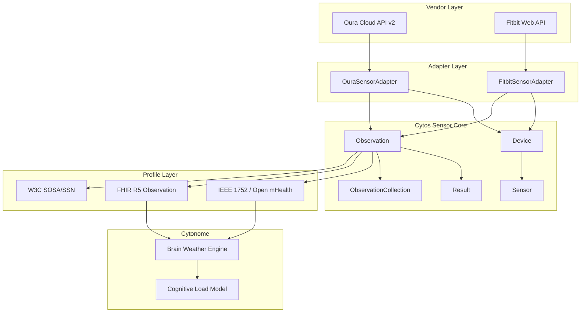
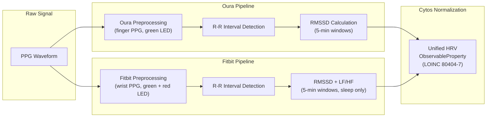
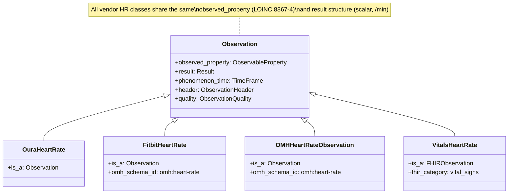
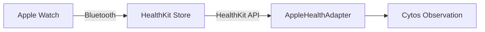
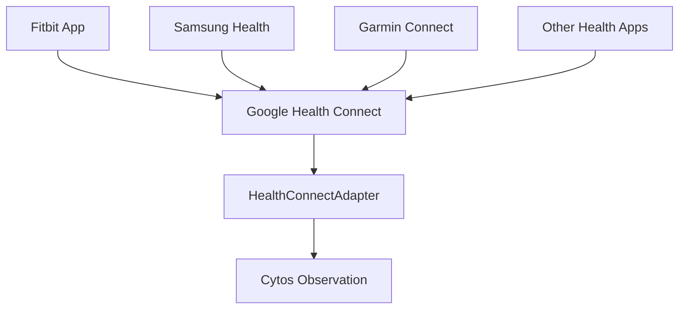

# Implementing Wearable Sensor Integration: Oura Ring and Fitbit

> **Status**: Active
> **Date**: 2026-07-10
> **Author**: @shahin
> **Audience**: engineers
> **Tags**: `engineering`
> **Variants**: Technical (this doc) - Readable (Obsidian twin optional, same filename) - Agent (n/a)

> **Cytonome Sensor Docs** · Version 0.1.0 · Last updated 2026-05-30
>
> This guide covers end-to-end integration of Oura Ring and Fitbit wearable data into the Cytos universal sensor schema, with complete API-to-FHIR mapping, Python adapters, and neurodivergent-specific feature analysis.

## Table of Contents

1. [Overview](#1-overview)
2. [Oura Ring Integration](#2-oura-ring-integration)
3. [Fitbit Integration](#3-fitbit-integration)
4. [Cross-Vendor Normalization](#4-cross-vendor-normalization)
5. [Apple Watch and Google Health Connect](#5-apple-watch-and-google-health-connect)
6. [ADHD/ND-Specific Wearable Features](#6-adhdnd-specific-wearable-features)
7. [Next Steps](#7-next-steps)

---

## 1. Overview

### Why Wearable Data Matters for Neurodivergent Individuals

Neurodivergent individuals, particularly those with ADHD, autism, and anxiety disorders, experience physiological patterns that standard clinical assessments miss entirely. Continuous wearable data captures what episodic clinic visits cannot: the real-time, day-to-day fluctuations in autonomic regulation, sleep architecture, and circadian rhythm stability that directly influence executive function, emotional regulation, and daily capacity.

Three physiological signals carry outsized importance for this population:

| Signal | ND Relevance | Wearable Source |
|--------|-------------|-----------------|
| **Heart Rate Variability (HRV)** | Proxy for vagal tone, executive function readiness, and emotional regulation capacity | Oura (RMSSD), Fitbit (RMSSD + LF/HF) |
| **Sleep Architecture** | ADHD circadian phase delays, fragmented sleep, reduced deep sleep | Oura (sleep stages), Fitbit (sleep score + stages) |
| **Activity Patterns** | Hyperfocus detection, task-switching frequency, movement variability | Oura (daily activity), Fitbit (intraday steps + active zone minutes) |
| **Skin Temperature** | Stress response correlation, circadian rhythm regularity | Oura (deviation from baseline), Fitbit (nightly + wrist delta) |
| **Readiness/Stress** | Daily capacity indicator for executive function load management | Oura (readiness score), Fitbit (stress management score) |

### How Oura and Fitbit Fit into Cytonome's Sensor Architecture

The Cytos universal sensor schema provides the device-agnostic spine that normalizes data from any health-tracking sensor. Oura and Fitbit integrate as **vendor profiles**, each shipping a LinkML schema that subclasses the core `Device` and `Observation` classes, plus registry entries for their specific device models and observable properties.



### The Brain Weather Connection

Brain Weather is Cytonome's predictive model that synthesizes physiological signals into a forecast of cognitive and emotional state. Wearable sensor data provides the continuous physiological context layer:

- **HRV trends** feed the autonomic regulation index (vagal tone trajectory)
- **Sleep quality and consistency** drive the circadian stability score
- **Activity patterns** inform the movement regularity and hyperfocus detection models
- **Temperature deviations** contribute to the stress response predictor
- **Readiness scores** calibrate the daily capacity estimate

Each wearable observation flows through the Cytos schema, gets normalized to common LOINC codes and UCUM units, and lands in the Brain Weather feature store as a time-indexed signal.

### Schema File References

| Schema | Path | Purpose |
|--------|------|---------|
| Core | [core.yaml](file:///home/mohammadi/repos/cytognosis/cytos/schemas/domains/sensor/core/core.yaml) | Device, Sensor, Observation, Result, UnitValue, TimeFrame |
| Oura vendor | [vendor_oura.yaml](file:///home/mohammadi/repos/cytognosis/cytos/schemas/domains/sensor/vendors/vendor_oura.yaml) | OuraDevice, OuraHeartRate, OuraHRV, OuraSleepSession, etc. |
| Fitbit vendor | [vendor_fitbit.yaml](file:///home/mohammadi/repos/cytognosis/cytos/schemas/domains/sensor/vendors/vendor_fitbit.yaml) | FitbitDevice, FitbitHeartRate, FitbitHRVDetails, FitbitSleepSession, etc. |
| IEEE 1752 profile | [profile_ieee1752.yaml](file:///home/mohammadi/repos/cytognosis/cytos/schemas/domains/sensor/profiles/profile_ieee1752.yaml) | OMH body schemas (heart-rate, sleep-episode, step-count, etc.) |
| FHIR R5 profile | [profile_fhir.yaml](file:///home/mohammadi/repos/cytognosis/cytos/schemas/domains/sensor/profiles/profile_fhir.yaml) | FHIRObservation, VitalsHeartRate, VitalsOxygenSaturation |
| Umbrella | [sensor.yaml](file:///home/mohammadi/repos/cytognosis/cytos/schemas/domains/sensor/sensor.yaml) | Imports all core, profiles, and vendor schemas |

---

## 2. Oura Ring Integration

### 2.1 Oura Cloud API v2

#### Authentication

Oura uses OAuth2 with Personal Access Tokens (PAT) for individual developer use and full OAuth2 Authorization Code flow for multi-user applications.

```python
# Personal Access Token (single user, development)
OURA_PAT = "your_personal_access_token"
headers = {"Authorization": f"Bearer {OURA_PAT}"}

# OAuth2 Authorization Code (multi-user, production)
# Authorization URL: https://cloud.ouraring.com/oauth/authorize
# Token URL: https://api.ouraring.com/oauth/token
# Scopes: daily, heartrate, workout, tag, session, personal
```

**Token management considerations:**

- PATs do not expire but can be revoked
- OAuth2 tokens expire after 24 hours; refresh tokens are long-lived
- Store tokens encrypted at rest using the Cytonome secrets manager
- Implement proactive refresh (refresh when <1 hour remains)

#### Available Endpoints

| Endpoint | Path | Granularity | Key Fields |
|----------|------|-------------|------------|
| Heart Rate | `/v2/usercollection/heartrate` | 5-min intervals | `bpm`, `source` (awake/rest/sleep) |
| Daily Activity | `/v2/usercollection/daily_activity` | Daily summary | `score`, `active_calories`, `steps`, `equivalent_walking_distance` |
| Daily Readiness | `/v2/usercollection/daily_readiness` | Daily summary | `score`, `temperature_deviation`, `hrv_balance`, `body_temperature` |
| Daily Sleep | `/v2/usercollection/daily_sleep` | Daily summary | `score`, `contributors` (deep_sleep, efficiency, latency, etc.) |
| Sleep (detailed) | `/v2/usercollection/sleep` | Per-session | `type`, `hr`, `hrv`, `movement_30_sec`, `sleep_phase_5_min` |
| Daily SpO2 | `/v2/usercollection/daily_spo2` | Daily summary | `spo2_percentage` (average, min, max) |
| Daily Stress | `/v2/usercollection/daily_stress` | Daily summary | `stress_high`, `recovery_high`, `day_summary` |
| Sessions | `/v2/usercollection/session` | Per-session | `type`, `hr`, `hrv`, `mood`, `motion_count` |
| Workouts | `/v2/usercollection/workout` | Per-workout | `activity`, `calories`, `distance`, `intensity` |
| Tags | `/v2/usercollection/tag` | Per-event | `tag_type_code`, `comment`, `timestamp` |
| Ring Config | `/v2/usercollection/ring_configuration` | Per-change | `color`, `design`, `firmware_version`, `hardware_type`, `set_up_at` |
| Rest Mode | `/v2/usercollection/rest_mode_period` | Per-period | `start_day`, `end_day`, `end_date` |

#### Rate Limits and Pagination

- **Rate limit:** 5,000 requests per 5-minute window per user
- **Pagination:** All collection endpoints use `next_token` cursor-based pagination
- **Date filtering:** `start_date` and `end_date` query parameters (YYYY-MM-DD)
- **Response size:** Limit 1,000 records per page by default

```python
async def paginate_oura(
    session: aiohttp.ClientSession,
    endpoint: str,
    start_date: str,
    end_date: str,
    headers: dict[str, str],
) -> list[dict]:
    """Paginate through an Oura API collection endpoint."""
    url = f"https://api.ouraring.com{endpoint}"
    params = {"start_date": start_date, "end_date": end_date}
    all_data: list[dict] = []

    while url:
        async with session.get(url, headers=headers, params=params) as resp:
            resp.raise_for_status()
            body = await resp.json()
            all_data.extend(body.get("data", []))
            next_token = body.get("next_token")
            if next_token:
                params = {"next_token": next_token}
            else:
                url = None

    return all_data
```

#### Webhook Support

Oura provides webhook subscriptions for near-real-time updates:

```python
# Subscribe to data updates
# POST https://api.ouraring.com/v2/webhook/subscription
{
    "callback_url": "https://api.cytognosis.org/webhooks/oura",
    "verification_token": "your_verification_token",
    "event_type": "create",  # create | update | delete
    "data_type": "tag"       # tag | workout | session | sleep | daily_activity
                             # daily_readiness | daily_sleep | daily_spo2
}
```

Webhook payloads contain the event metadata (not the full data), so the adapter fetches the complete record on notification.

### 2.2 Data Model Mapping

#### Heart Rate

| Layer | Mapping |
|-------|---------|
| **Oura API** | `GET /v2/usercollection/heartrate` → `{"bpm": 72, "source": "rest", "timestamp": "2026-05-30T08:15:00+00:00"}` |
| **Cytos class** | `OuraHeartRate` (is_a: `Observation`) |
| **SOSA alignment** | `Sensor` (PPG) → `ObservableProperty` (heart-rate) → `Result` (scalar, /min) |
| **IEEE 1752 / OMH** | `omh:heart-rate` → `OMHHeartRateObservation` |
| **FHIR** | `Observation` with `code: LOINC 8867-4`, `valueQuantity: {value: 72, unit: "/min", system: "http://unitsofmeasure.org"}`, `effectiveDateTime` |
| **LOINC** | `8867-4` (Heart rate) |

```yaml
# Example Cytos observation: Oura Heart Rate
- id: sensor:obs/oura-hr-20260530-081500
  observation_local_id: oura-hr-20260530-081500
  header:
    uuid: "a1b2c3d4-e5f6-4a7b-8c9d-0e1f2a3b4c5d"
    schema_id:
      namespace: omh
      name: heart-rate
      version: "2.0"
    source_creation_date_time: "2026-05-30T08:15:00+00:00"
    modality: sensed
  made_by_sensor: sensor:oura-ppg-ring4
  device: sensor:device/oura-ring-gen4-abc123
  subject: sensor:subject/participant-001
  observed_property:
    id: sensor:prop/heart-rate
    property_codes:
      - loinc:8867-4
    preferred_unit: "/min"
    property_class: vital_sign
  phenomenon_time:
    date_time: "2026-05-30T08:15:00+00:00"
  result:
    result_type: scalar
    value:
      value: 72
      unit: "/min"
      unit_code: ucum:/min
  quality:
    flag: pass
    confidence: 0.95
```

#### HRV (RMSSD)

| Layer | Mapping |
|-------|---------|
| **Oura API** | Sleep detail `hrv` field → `{"hrv": {"items": [45.2, 48.1, ...], "interval": 300, "timestamp": "..."}}` |
| **Cytos class** | `OuraHRV` (is_a: `Observation`) |
| **SOSA alignment** | `Sensor` (PPG-derived) → `ObservableProperty` (hrv-rmssd) → `Result` (scalar, ms) |
| **IEEE 1752 / OMH** | No direct OMH schema; map via `OMHHeartRateObservation` with `descriptive_statistic: rmssd` |
| **FHIR** | `Observation` with `code: LOINC 80404-7`, `valueQuantity: {value: 45.2, unit: "ms"}` |
| **LOINC** | `80404-7` (R-R interval.standard deviation, SDNN equivalent family); `8867-4` with RMSSD qualifier |

```yaml
# Example: Oura HRV (5-minute RMSSD during sleep)
- id: sensor:obs/oura-hrv-20260530-023000
  observation_local_id: oura-hrv-20260530-023000
  header:
    source_creation_date_time: "2026-05-30T02:30:00+00:00"
    modality: sensed_derived
  made_by_sensor: sensor:oura-ppg-ring4
  device: sensor:device/oura-ring-gen4-abc123
  subject: sensor:subject/participant-001
  observed_property:
    id: sensor:prop/hrv-rmssd
    property_codes:
      - loinc:80404-7
    preferred_unit: ms
    property_class: vital_sign
  phenomenon_time:
    time_interval:
      start_date_time: "2026-05-30T02:30:00+00:00"
      duration_seconds: 300
  result:
    result_type: scalar
    value:
      value: 45.2
      unit: ms
      unit_code: ucum:ms
  descriptive_statistic:
    statistic: rmssd
    denominator: minute
```

#### Skin Temperature Deviation

| Layer | Mapping |
|-------|---------|
| **Oura API** | Readiness → `temperature_deviation` (°C deviation from personal baseline) |
| **Cytos class** | `OuraSkinTemperature` (is_a: `Observation`) |
| **SOSA** | `Sensor` (thermistor) → `ObservableProperty` (skin-temp-deviation) → `Result` (scalar, Cel) |
| **IEEE 1752 / OMH** | `omh:body-temperature` → `OMHBodyTemperatureObservation` (measurement_location: `finger`) |
| **FHIR** | `Observation` with `code: LOINC 61008-9` (body surface temperature), `valueQuantity: {value: 0.3, unit: "Cel"}` |
| **LOINC** | `61008-9` (Body surface temperature); `8310-5` (Body temperature) with skin qualifier |

```yaml
- id: sensor:obs/oura-temp-20260530
  observed_property:
    id: sensor:prop/skin-temp-deviation
    property_codes:
      - loinc:61008-9
    preferred_unit: Cel
    property_class: vital_sign
  result:
    result_type: scalar
    value:
      value: 0.3
      unit: Cel
      unit_code: ucum:Cel
  notes: "Deviation from personal baseline; positive = warmer than usual"
```

#### Sleep Sessions and Stages

| Layer | Mapping |
|-------|---------|
| **Oura API** | `GET /v2/usercollection/sleep` → `{"type": "long_sleep", "sleep_phase_5_min": "4433322211...", "total_sleep_duration": 27480}` |
| **Cytos class** | `OuraSleepSession` + `OuraSleepStages` (both is_a: `Observation`) |
| **IEEE 1752** | `ieee1752:sleep-episode` → `OMHSleepEpisode` |
| **FHIR** | `Observation` with `code: LOINC 93832-4` (Sleep duration), members for each stage |
| **LOINC** | `93832-4` (Sleep duration), `93831-6` (Deep sleep duration), `93830-8` (Light sleep), `93829-0` (REM sleep), `93828-2` (Awake time) |

Oura encodes sleep stages as a string of single digits (5-minute intervals):
- `1` = deep (N3), `2` = light (N1/N2), `3` = REM, `4` = awake

```yaml
- id: sensor:obs/oura-sleep-20260530
  observation_local_id: oura-sleep-20260530
  header:
    schema_id:
      namespace: ieee1752
      name: sleep-episode
      version: "1.0"
    modality: sensed_derived
  observed_property:
    id: sensor:prop/sleep-episode
    property_codes:
      - loinc:93832-4
  phenomenon_time:
    time_interval:
      start_date_time: "2026-05-29T23:15:00-07:00"
      end_date_time: "2026-05-30T06:53:00-07:00"
  result:
    result_type: compound
    components:
      - code: loinc:93832-4   # Total sleep
        value: {value: 27480, unit: s, unit_code: ucum:s}
      - code: loinc:93831-6   # Deep sleep
        value: {value: 5400, unit: s, unit_code: ucum:s}
      - code: loinc:93830-8   # Light sleep
        value: {value: 14400, unit: s, unit_code: ucum:s}
      - code: loinc:93829-0   # REM sleep
        value: {value: 5880, unit: s, unit_code: ucum:s}
      - code: loinc:93828-2   # Awake time
        value: {value: 1800, unit: s, unit_code: ucum:s}
  # Sub-observations for per-stage detail
  members:
    - sensor:obs/oura-sleep-stages-20260530
```

#### Activity Summary

| Layer | Mapping |
|-------|---------|
| **Oura API** | `GET /v2/usercollection/daily_activity` → `{"score": 85, "steps": 8432, "active_calories": 380, ...}` |
| **Cytos class** | `OuraActivityDay` (is_a: `Observation`) |
| **IEEE 1752** | `ieee1752:physical-activity` → `OMHPhysicalActivity` + `omh:step-count` → `OMHStepCountObservation` |
| **FHIR** | `Observation` with `code: LOINC 55423-8` (steps) |
| **LOINC** | `55423-8` (Number of steps in 24 hour measured), `41981-2` (Calories burned) |

```yaml
- id: sensor:obs/oura-activity-20260530
  observed_property:
    id: sensor:prop/daily-step-count
    property_codes:
      - loinc:55423-8
    preferred_unit: "{steps}"
    dimension: count
  phenomenon_time:
    time_interval:
      start_date_time: "2026-05-30T00:00:00-07:00"
      duration_seconds: 86400
  result:
    result_type: scalar
    value:
      value: 8432
      unit: "{steps}"
      unit_code: "ucum:{steps}"
  descriptive_statistic:
    statistic: sum
    denominator: day
```

#### Readiness Score

| Layer | Mapping |
|-------|---------|
| **Oura API** | `GET /v2/usercollection/daily_readiness` → `{"score": 82, "contributors": {"hrv_balance": 85, "body_temperature": 90, ...}}` |
| **Cytos class** | `OuraReadinessScore` (is_a: `Observation`) |
| **IEEE 1752** | No direct equivalent; maps as a derived composite score |
| **FHIR** | `Observation` with vendor-specific code, `valueInteger: 82`, category: `activity` |
| **LOINC** | No standard LOINC; use local code `sensor:oura-readiness-score` |

```yaml
- id: sensor:obs/oura-readiness-20260530
  observed_property:
    id: sensor:prop/readiness-score
    property_codes:
      - "sensor:oura-readiness-score"
    preferred_unit: "{score}"
    property_class: derived_biomarker
  result:
    result_type: compound
    components:
      - code: "sensor:oura-readiness-overall"
        value: {value: 82, unit: "{score}"}
      - code: "sensor:oura-readiness-hrv-balance"
        value: {value: 85, unit: "{score}"}
      - code: "sensor:oura-readiness-body-temp"
        value: {value: 90, unit: "{score}"}
      - code: "sensor:oura-readiness-recovery-index"
        value: {value: 78, unit: "{score}"}
      - code: "sensor:oura-readiness-resting-hr"
        value: {value: 88, unit: "{score}"}
```

#### SpO2

| Layer | Mapping |
|-------|---------|
| **Oura API** | `GET /v2/usercollection/daily_spo2` → `{"spo2_percentage": {"average": 97.5}}` |
| **Cytos class** | Observation (generic; no dedicated Oura SpO2 subclass yet) |
| **IEEE 1752** | `omh:oxygen-saturation` → `OMHOxygenSaturationObservation` |
| **FHIR** | `Observation` with `code: LOINC 59408-5`, `valueQuantity: {value: 97.5, unit: "%"}` |
| **LOINC** | `59408-5` (Oxygen saturation in arterial blood by pulse oximetry) |

### 2.3 Python Adapter

```python
"""Oura Ring Sensor Adapter for Cytos.

Implements the Sensor Protocol for pulling data from the Oura Cloud API v2
and mapping it to Cytos Observation instances.
"""

from __future__ import annotations

import asyncio
import logging
from datetime import date, datetime, timedelta, timezone
from enum import Enum
from typing import Any, Protocol
from uuid import uuid4

import aiohttp
from tenacity import (
    retry,
    stop_after_attempt,
    wait_exponential,
    retry_if_exception_type,
)

logger = logging.getLogger(__name__)

OURA_API_BASE = "https://api.ouraring.com/v2/usercollection"


class SensorProtocol(Protocol):
    """Cytos sensor adapter protocol."""

    async def connect(self) -> None: ...
    async def disconnect(self) -> None: ...
    async def fetch_observations(
        self, start: date, end: date
    ) -> list[dict[str, Any]]: ...
    async def get_device_info(self) -> dict[str, Any]: ...


class OuraDataType(str, Enum):
    """Available Oura data endpoints."""

    HEART_RATE = "heartrate"
    DAILY_ACTIVITY = "daily_activity"
    DAILY_READINESS = "daily_readiness"
    DAILY_SLEEP = "daily_sleep"
    SLEEP = "sleep"
    DAILY_SPO2 = "daily_spo2"
    DAILY_STRESS = "daily_stress"
    SESSIONS = "session"
    WORKOUTS = "workout"
    TAGS = "tag"
    RING_CONFIG = "ring_configuration"


# LOINC and UCUM mappings for Oura data types
OURA_LOINC_MAP: dict[str, dict[str, str]] = {
    "heartrate": {
        "loinc": "8867-4",
        "unit": "/min",
        "property": "heart-rate",
    },
    "hrv": {
        "loinc": "80404-7",
        "unit": "ms",
        "property": "hrv-rmssd",
    },
    "skin_temperature": {
        "loinc": "61008-9",
        "unit": "Cel",
        "property": "skin-temp-deviation",
    },
    "sleep": {
        "loinc": "93832-4",
        "unit": "s",
        "property": "sleep-episode",
    },
    "steps": {
        "loinc": "55423-8",
        "unit": "{steps}",
        "property": "daily-step-count",
    },
    "spo2": {
        "loinc": "59408-5",
        "unit": "%",
        "property": "oxygen-saturation",
    },
}


class OuraSensorAdapter:
    """Adapter for Oura Ring Cloud API v2.

    Implements the Cytos SensorProtocol, providing methods to authenticate,
    fetch data, and convert Oura API responses into Cytos Observations.
    """

    def __init__(
        self,
        access_token: str,
        subject_id: str,
        device_id: str | None = None,
        poll_interval_seconds: int = 300,
    ) -> None:
        self._token = access_token
        self._subject_id = subject_id
        self._device_id = device_id or f"oura-ring-{subject_id}"
        self._poll_interval = poll_interval_seconds
        self._session: aiohttp.ClientSession | None = None
        self._headers = {
            "Authorization": f"Bearer {self._token}",
            "Content-Type": "application/json",
        }

    async def connect(self) -> None:
        """Initialize the HTTP session."""
        timeout = aiohttp.ClientTimeout(total=30)
        self._session = aiohttp.ClientSession(
            headers=self._headers, timeout=timeout
        )
        logger.info("Oura adapter connected for subject %s", self._subject_id)

    async def disconnect(self) -> None:
        """Close the HTTP session."""
        if self._session:
            await self._session.close()
            self._session = None
        logger.info("Oura adapter disconnected")

    @retry(
        stop=stop_after_attempt(3),
        wait=wait_exponential(multiplier=1, min=2, max=30),
        retry=retry_if_exception_type(aiohttp.ClientError),
    )
    async def _fetch_endpoint(
        self,
        data_type: OuraDataType,
        start_date: date,
        end_date: date,
    ) -> list[dict[str, Any]]:
        """Fetch and paginate a single Oura endpoint with retry logic."""
        if not self._session:
            raise RuntimeError("Adapter not connected. Call connect() first.")

        url = f"{OURA_API_BASE}/{data_type.value}"
        params: dict[str, str] = {
            "start_date": start_date.isoformat(),
            "end_date": end_date.isoformat(),
        }
        all_records: list[dict[str, Any]] = []

        while url:
            async with self._session.get(url, params=params) as resp:
                if resp.status == 429:
                    retry_after = int(resp.headers.get("Retry-After", "60"))
                    logger.warning(
                        "Rate limited by Oura. Waiting %d seconds.", retry_after
                    )
                    await asyncio.sleep(retry_after)
                    continue

                resp.raise_for_status()
                body = await resp.json()
                all_records.extend(body.get("data", []))

                next_token = body.get("next_token")
                if next_token:
                    params = {"next_token": next_token}
                else:
                    url = ""  # Exit loop

        return all_records

    async def fetch_observations(
        self, start: date, end: date
    ) -> list[dict[str, Any]]:
        """Fetch all observation types and map to Cytos format.

        Polling strategy:
        - Heart rate: 5-minute interval samples (highest frequency)
        - Sleep, activity, readiness, SpO2, stress: daily summaries
        - Sessions and workouts: per-event
        """
        observations: list[dict[str, Any]] = []

        # Daily summaries (one request per type)
        daily_types = [
            OuraDataType.DAILY_ACTIVITY,
            OuraDataType.DAILY_READINESS,
            OuraDataType.DAILY_SLEEP,
            OuraDataType.DAILY_SPO2,
            OuraDataType.DAILY_STRESS,
        ]

        # High-frequency and event-based
        detail_types = [
            OuraDataType.HEART_RATE,
            OuraDataType.SLEEP,
            OuraDataType.SESSIONS,
            OuraDataType.WORKOUTS,
        ]

        for dtype in daily_types + detail_types:
            try:
                records = await self._fetch_endpoint(dtype, start, end)
                for record in records:
                    obs = self._map_to_cytos(dtype, record)
                    if obs:
                        observations.append(obs)
            except aiohttp.ClientResponseError as e:
                logger.error(
                    "Failed to fetch %s: HTTP %d", dtype.value, e.status
                )
            except Exception:
                logger.exception("Unexpected error fetching %s", dtype.value)

        return observations

    def _map_to_cytos(
        self, data_type: OuraDataType, record: dict[str, Any]
    ) -> dict[str, Any] | None:
        """Map an Oura API record to a Cytos Observation dict."""
        timestamp = record.get("timestamp") or record.get("day")
        if not timestamp:
            return None

        obs_id = f"oura-{data_type.value}-{timestamp}"
        base: dict[str, Any] = {
            "id": f"sensor:obs/{obs_id}",
            "observation_local_id": obs_id,
            "header": {
                "uuid": str(uuid4()),
                "source_creation_date_time": timestamp,
                "modality": "sensed",
            },
            "device": f"sensor:device/{self._device_id}",
            "subject": f"sensor:subject/{self._subject_id}",
            "phenomenon_time": {"date_time": timestamp},
        }

        match data_type:
            case OuraDataType.HEART_RATE:
                mapping = OURA_LOINC_MAP["heartrate"]
                base["observed_property"] = {
                    "property_codes": [f"loinc:{mapping['loinc']}"],
                    "preferred_unit": mapping["unit"],
                }
                base["result"] = {
                    "result_type": "scalar",
                    "value": {
                        "value": record.get("bpm"),
                        "unit": mapping["unit"],
                    },
                }

            case OuraDataType.DAILY_SLEEP:
                mapping = OURA_LOINC_MAP["sleep"]
                base["header"]["modality"] = "sensed_derived"
                base["observed_property"] = {
                    "property_codes": [f"loinc:{mapping['loinc']}"],
                }
                score = record.get("score")
                base["result"] = {
                    "result_type": "compound",
                    "components": [
                        {
                            "code": "sensor:oura-sleep-score",
                            "value": {"value": score, "unit": "{score}"},
                        }
                    ],
                }

            case OuraDataType.DAILY_READINESS:
                base["header"]["modality"] = "sensed_derived"
                base["observed_property"] = {
                    "property_codes": ["sensor:oura-readiness-score"],
                    "property_class": "derived_biomarker",
                }
                base["result"] = {
                    "result_type": "scalar",
                    "value": {
                        "value": record.get("score"),
                        "unit": "{score}",
                    },
                }

            case OuraDataType.DAILY_ACTIVITY:
                mapping = OURA_LOINC_MAP["steps"]
                base["observed_property"] = {
                    "property_codes": [f"loinc:{mapping['loinc']}"],
                    "preferred_unit": mapping["unit"],
                }
                base["result"] = {
                    "result_type": "scalar",
                    "value": {
                        "value": record.get("steps"),
                        "unit": mapping["unit"],
                    },
                }
                base["descriptive_statistic"] = {
                    "statistic": "sum",
                    "denominator": "day",
                }

            case _:
                # Generic passthrough for other types
                base["result"] = {
                    "result_type": "string",
                    "string_value": str(record),
                }

        return base

    async def get_device_info(self) -> dict[str, Any]:
        """Fetch ring configuration and return as Cytos Device."""
        configs = await self._fetch_endpoint(
            OuraDataType.RING_CONFIG,
            date.today() - timedelta(days=365),
            date.today(),
        )

        latest = configs[-1] if configs else {}
        return {
            "id": f"sensor:device/{self._device_id}",
            "device_type": "consumer_wearable",
            "device_category": ["ring"],
            "vendor": {
                "vendor_name": "Oura",
                "website": "https://ouraring.com",
            },
            "model": latest.get("hardware_type", "unknown"),
            "firmware_version": latest.get("firmware_version"),
            "serial_number": latest.get("set_up_at"),
        }

    async def start_polling(self) -> None:
        """Start continuous polling loop for real-time heart rate."""
        logger.info(
            "Starting Oura polling every %d seconds", self._poll_interval
        )
        while True:
            try:
                today = date.today()
                observations = await self._fetch_endpoint(
                    OuraDataType.HEART_RATE, today, today
                )
                for record in observations:
                    obs = self._map_to_cytos(OuraDataType.HEART_RATE, record)
                    if obs:
                        # Emit to observation pipeline
                        logger.debug("Emitted HR observation: %s", obs["id"])
            except Exception:
                logger.exception("Polling cycle failed")

            await asyncio.sleep(self._poll_interval)
```

---

## 3. Fitbit Integration

### 3.1 Fitbit Web API

#### Authentication

Fitbit uses OAuth2 Authorization Code Grant with PKCE (required for all new applications since 2023):

```python
# Authorization URL: https://www.fitbit.com/oauth2/authorize
# Token URL: https://api.fitbit.com/oauth2/token
# Required flow: Authorization Code with PKCE

FITBIT_CLIENT_ID = "your_client_id"
FITBIT_CLIENT_SECRET = "your_client_secret"

# Scopes determine which endpoints are accessible
FITBIT_SCOPES = [
    "activity",       # Steps, distance, calories, activity minutes
    "heartrate",      # Heart rate, HRV
    "sleep",          # Sleep sessions, sleep score
    "temperature",    # Skin temperature
    "respiratory_rate",
    "oxygen_saturation",
    "profile",        # User profile
    "settings",       # Device settings
]
```

**Token refresh flow:**

- Access tokens expire after 8 hours
- Refresh tokens expire after 1 year (or on next refresh)
- Each refresh returns a new access token AND a new refresh token
- The old refresh token is immediately invalidated

#### Available Endpoints and Scopes

| Endpoint | Path Pattern | Scope | Granularity |
|----------|-------------|-------|-------------|
| Heart Rate Intraday | `/1/user/-/activities/heart/date/{date}/1d/1sec.json` | `heartrate` | 1-second (requires approval) |
| Heart Rate Summary | `/1/user/-/activities/heart/date/{date}/1d.json` | `heartrate` | Daily zones |
| Resting Heart Rate | included in HR summary | `heartrate` | Daily |
| HRV | `/1/user/-/hrv/date/{date}.json` | `heartrate` | 5-min sleep intervals |
| Sleep Log | `/1.2/user/-/sleep/date/{date}.json` | `sleep` | Per-session + 30s stages |
| Sleep Score (Beta) | included in sleep log | `sleep` | Daily |
| Steps Intraday | `/1/user/-/activities/steps/date/{date}/1d/1min.json` | `activity` | 1-minute |
| Steps Summary | `/1/user/-/activities/date/{date}.json` | `activity` | Daily |
| Distance | `/1/user/-/activities/distance/date/{date}/1d.json` | `activity` | Daily/intraday |
| Active Zone Minutes | `/1/user/-/activities/active-zone-minutes/date/{date}/1d.json` | `activity` | Daily |
| Activity Log | `/1/user/-/activities/list.json` | `activity` | Per-exercise |
| Skin Temperature | `/1/user/-/temp/skin/date/{date}.json` | `temperature` | Nightly |
| Wrist Temperature | `/1/user/-/temp/core/date/{date}.json` | `temperature` | Per-sample |
| Respiratory Rate | `/1/user/-/br/date/{date}.json` | `respiratory_rate` | Per-sleep-stage |
| SpO2 | `/1/user/-/spo2/date/{date}.json` | `oxygen_saturation` | Nightly summary |
| Stress Score | `/1/user/-/cardioscore/date/{date}.json` | `heartrate` | Daily |
| VO2 Max | included in cardioscore | `heartrate` | Daily |

#### Intraday Time-Series Access

Fitbit restricts intraday (sub-daily) data to applications that have received special approval:

- **Personal applications:** Automatic intraday access for the developer's own account
- **Server applications:** Must apply for intraday access; requires review
- **Resolutions available:** 1sec, 1min, 5min, 15min (heart rate); 1min, 5min, 15min (steps)

For Cytonome, request intraday access for heart rate (1-second) and steps (1-minute) to capture the physiological granularity required for Brain Weather.

#### Rate Limits

- **150 requests per hour** per user (OAuth2 token)
- Rate limit resets on the hour
- Response headers: `Fitbit-Rate-Limit-Limit`, `Fitbit-Rate-Limit-Remaining`, `Fitbit-Rate-Limit-Reset`
- Strategy: batch daily summaries first, then fill intraday data within remaining quota

### 3.2 Data Model Mapping

The Fitbit vendor schema defines 19 `Observation` subclasses. Below are the priority mappings for Brain Weather.

#### Heart Rate (FitbitHeartRate)

| Layer | Mapping |
|-------|---------|
| **Fitbit API** | Intraday: `{"time": "08:15:00", "value": 74}`, Summary: `{"restingHeartRate": 62, "heartRateZones": [...]}` |
| **Cytos class** | `FitbitHeartRate` (is_a: `Observation`, annotation: `omh:heart-rate`) |
| **SOSA** | `Sensor` (PPG) → `ObservableProperty` (heart-rate) → `Result` (scalar, /min) |
| **IEEE 1752** | `omh:heart-rate` → `OMHHeartRateObservation` |
| **FHIR** | `Observation` with `code: LOINC 8867-4`, category: `vital_signs` |
| **LOINC** | `8867-4` (Heart rate), `40443-4` (Heart rate resting) |

```yaml
- id: sensor:obs/fitbit-hr-20260530-081500
  observation_local_id: fitbit-hr-20260530-081500
  header:
    schema_id:
      namespace: omh
      name: heart-rate
      version: "2.0"
    modality: sensed
  made_by_sensor: sensor:fitbit-ppg-charge6
  device: sensor:device/fitbit-charge6-xyz789
  observed_property:
    id: sensor:prop/heart-rate
    property_codes:
      - loinc:8867-4
    preferred_unit: "/min"
    property_class: vital_sign
  phenomenon_time:
    date_time: "2026-05-30T08:15:00-07:00"
  result:
    result_type: scalar
    value:
      value: 74
      unit: "/min"
      unit_code: ucum:/min
  quality:
    confidence: 0.92
```

#### HRV (FitbitHRVDetails)

| Layer | Mapping |
|-------|---------|
| **Fitbit API** | `GET /1/user/-/hrv/date/{date}.json` → `{"hrv": [{"dateTime": "...", "minutes": [{"minute": "...", "value": {"rmssd": 42.1, "coverage": 0.98, "hf": 285.4, "lf": 312.7}}]}]}` |
| **Cytos class** | `FitbitHRVDetails` (is_a: `Observation`) |
| **SOSA** | `Sensor` (PPG-derived) → `ObservableProperty` (hrv-details) → `Result` (compound: RMSSD + LF + HF) |
| **IEEE 1752** | No direct OMH equivalent; compound observation |
| **FHIR** | `Observation` with `code: LOINC 80404-7`, components for RMSSD/LF/HF |
| **LOINC** | `80404-7` (R-R interval), plus LF/HF as components |

Fitbit provides significantly richer HRV data than Oura: RMSSD, low-frequency power (LF), high-frequency power (HF), and coverage fraction, all at 5-minute intervals during sleep.

```yaml
- id: sensor:obs/fitbit-hrv-20260530-023000
  observation_local_id: fitbit-hrv-20260530-023000
  header:
    modality: sensed_derived
  made_by_sensor: sensor:fitbit-ppg-charge6
  device: sensor:device/fitbit-charge6-xyz789
  observed_property:
    id: sensor:prop/hrv-details
    property_codes:
      - loinc:80404-7
    property_class: vital_sign
  phenomenon_time:
    time_interval:
      start_date_time: "2026-05-30T02:30:00-07:00"
      duration_seconds: 300
  result:
    result_type: compound
    components:
      - code: loinc:80404-7
        value: {value: 42.1, unit: ms, unit_code: ucum:ms}
        interpretation: []
      - code: sensor:hrv-lf-power
        value: {value: 312.7, unit: "ms2", unit_code: "ucum:ms2"}
      - code: sensor:hrv-hf-power
        value: {value: 285.4, unit: "ms2", unit_code: "ucum:ms2"}
  quality:
    flag: pass
    coverage_fraction: 0.98
```

#### Sleep (FitbitSleepSession + FitbitSleepScore)

| Layer | Mapping |
|-------|---------|
| **Fitbit API** | `GET /1.2/user/-/sleep/date/{date}.json` → `{"sleep": [{"dateOfSleep": "...", "levels": {"summary": {"deep": {"minutes": 90}, "light": {"minutes": 240}, "rem": {"minutes": 98}, "wake": {"minutes": 30}}}}]}` |
| **Cytos classes** | `FitbitSleepSession` + `FitbitSleepScore` (both is_a: `Observation`) |
| **IEEE 1752** | `ieee1752:sleep-episode` → `OMHSleepEpisode` |
| **FHIR** | `Observation` with `code: LOINC 93832-4`, members for stages |
| **LOINC** | `93832-4` (Sleep duration), `93831-6` (Deep), `93830-8` (Light), `93829-0` (REM), `93828-2` (Wake) |

Fitbit uses 30-second epoch staging (wake/light/deep/REM for stages model; awake/restless/asleep for classic model).

```yaml
- id: sensor:obs/fitbit-sleep-20260530
  header:
    schema_id:
      namespace: ieee1752
      name: sleep-episode
      version: "1.0"
    modality: sensed_derived
  observed_property:
    property_codes:
      - loinc:93832-4
  phenomenon_time:
    time_interval:
      start_date_time: "2026-05-29T23:30:00-07:00"
      end_date_time: "2026-05-30T07:00:00-07:00"
  result:
    result_type: compound
    components:
      - code: loinc:93832-4
        value: {value: 27000, unit: s}
      - code: loinc:93831-6   # Deep
        value: {value: 5400, unit: s}
      - code: loinc:93830-8   # Light
        value: {value: 14400, unit: s}
      - code: loinc:93829-0   # REM
        value: {value: 5880, unit: s}
      - code: loinc:93828-2   # Wake
        value: {value: 1800, unit: s}
  members:
    - sensor:obs/fitbit-sleep-score-20260530
```

#### Steps (FitbitSteps)

| Layer | Mapping |
|-------|---------|
| **Fitbit API** | Summary: `{"summary": {"steps": 9243}}`, Intraday: `{"activities-steps-intraday": {"dataset": [{"time": "08:15:00", "value": 42}]}}` |
| **Cytos class** | `FitbitSteps` (is_a: `Observation`) |
| **IEEE 1752** | `omh:step-count` → `OMHStepCountObservation` |
| **FHIR** | `Observation` with `code: LOINC 55423-8` |
| **LOINC** | `55423-8` (Number of steps in 24 hour measured) |

#### Activity Minutes (FitbitActivityMinutes + FitbitActiveZoneMinutes)

| Layer | Mapping |
|-------|---------|
| **Fitbit API** | `{"summary": {"fairlyActiveMinutes": 22, "veryActiveMinutes": 14, "sedentaryMinutes": 720, "lightlyActiveMinutes": 184}}` |
| **Cytos classes** | `FitbitActivityMinutes` + `FitbitActiveZoneMinutes` (both is_a: `Observation`) |
| **IEEE 1752** | `ieee1752:physical-activity` → `OMHPhysicalActivity` (duration_light, duration_moderate, duration_vigorous) |
| **FHIR** | `Observation` with code `LOINC 68516-4` (Duration of moderate physical activity) |
| **LOINC** | `68516-4` (moderate activity), `68515-6` (vigorous activity), `LA11836-5` (sedentary) |

#### Stress Score (FitbitStressScore)

| Layer | Mapping |
|-------|---------|
| **Fitbit API** | `GET /1/user/-/cardioscore/date/{date}.json` → `{"stressManagementScoreTimeline": [{"date": "...", "stressManagementScore": 78}]}` |
| **Cytos class** | `FitbitStressScore` (is_a: `Observation`) |
| **IEEE 1752** | No direct equivalent; derived biomarker |
| **FHIR** | `Observation` with vendor-specific code, category: `activity` |
| **LOINC** | No standard code; use `sensor:fitbit-stress-management-score` |

#### Skin Temperature (FitbitNightlySkinTemperature + FitbitWristTemperatureSample)

| Layer | Mapping |
|-------|---------|
| **Fitbit API** | Nightly: `{"tempSkin": [{"dateTime": "...", "value": {"nightlyRelative": 0.4}}]}`, Wrist: `{"tempCore": [{"dateTime": "...", "value": {"value": -0.2}}]}` |
| **Cytos classes** | `FitbitNightlySkinTemperature` + `FitbitWristTemperatureSample` (both is_a: `Observation`) |
| **IEEE 1752** | `omh:body-temperature` → `OMHBodyTemperatureObservation` (measurement_location: `wrist` or `skin`) |
| **FHIR** | `Observation` with `code: LOINC 61008-9` |
| **LOINC** | `61008-9` (Body surface temperature) |

#### SpO2 (FitbitEstimatedOxygenVariation)

| Layer | Mapping |
|-------|---------|
| **Fitbit API** | `GET /1/user/-/spo2/date/{date}.json` → `{"dateTime": "...", "value": {"avg": 96.5, "min": 93.2, "max": 98.1}}` |
| **Cytos class** | `FitbitEstimatedOxygenVariation` (is_a: `Observation`) |
| **IEEE 1752** | `omh:oxygen-saturation` → `OMHOxygenSaturationObservation` |
| **FHIR** | `Observation` with `code: LOINC 59408-5`, category: `vital_signs` |
| **LOINC** | `59408-5` (Oxygen saturation by pulse oximetry) |

#### Respiratory Rate (FitbitRespiratoryRateSummary)

| Layer | Mapping |
|-------|---------|
| **Fitbit API** | `GET /1/user/-/br/date/{date}.json` → `{"br": [{"dateTime": "...", "value": {"breathingRate": 15.2}}]}` |
| **Cytos class** | `FitbitRespiratoryRateSummary` (is_a: `Observation`) |
| **IEEE 1752** | `omh:respiratory-rate` → `OMHRespiratoryRateObservation` |
| **FHIR** | `Observation` with `code: LOINC 9279-1`, category: `vital_signs` |
| **LOINC** | `9279-1` (Respiratory rate) |

#### VO2 Max (FitbitVO2Max)

| Layer | Mapping |
|-------|---------|
| **Fitbit API** | Included in cardioscore response → `{"vo2Max": "44-48"}` |
| **Cytos class** | `FitbitVO2Max` (is_a: `Observation`) |
| **FHIR** | `Observation` with `code: LOINC 60842-2` |
| **LOINC** | `60842-2` (VO2 max) |

### 3.3 Python Adapter

```python
"""Fitbit Sensor Adapter for Cytos.

Implements the Sensor Protocol for pulling data from the Fitbit Web API
and mapping it to Cytos Observation instances. Handles OAuth2 token
refresh, intraday vs. summary strategies, and rate limit compliance.
"""

from __future__ import annotations

import asyncio
import logging
import time
from base64 import b64encode
from datetime import date, datetime, timedelta
from enum import Enum
from typing import Any
from uuid import uuid4

import aiohttp
from tenacity import (
    retry,
    stop_after_attempt,
    wait_exponential,
    retry_if_exception_type,
)

logger = logging.getLogger(__name__)

FITBIT_API_BASE = "https://api.fitbit.com"
FITBIT_TOKEN_URL = "https://api.fitbit.com/oauth2/token"
FITBIT_RATE_LIMIT = 150  # requests per hour


class FitbitEndpoint(str, Enum):
    """Fitbit API endpoint definitions."""

    HR_SUMMARY = "/1/user/-/activities/heart/date/{date}/1d.json"
    HR_INTRADAY = "/1/user/-/activities/heart/date/{date}/1d/1sec.json"
    HRV = "/1/user/-/hrv/date/{date}.json"
    SLEEP = "/1.2/user/-/sleep/date/{date}.json"
    STEPS_SUMMARY = "/1/user/-/activities/date/{date}.json"
    STEPS_INTRADAY = "/1/user/-/activities/steps/date/{date}/1d/1min.json"
    ACTIVE_ZONE = "/1/user/-/activities/active-zone-minutes/date/{date}/1d.json"
    SKIN_TEMP = "/1/user/-/temp/skin/date/{date}.json"
    WRIST_TEMP = "/1/user/-/temp/core/date/{date}.json"
    RESPIRATORY = "/1/user/-/br/date/{date}.json"
    SPO2 = "/1/user/-/spo2/date/{date}.json"
    STRESS = "/1/user/-/cardioscore/date/{date}.json"
    PROFILE = "/1/user/-/profile.json"
    DEVICES = "/1/user/-/devices.json"


# LOINC and UCUM mappings
FITBIT_LOINC_MAP: dict[str, dict[str, str]] = {
    "heart_rate": {"loinc": "8867-4", "unit": "/min"},
    "resting_heart_rate": {"loinc": "40443-4", "unit": "/min"},
    "hrv_rmssd": {"loinc": "80404-7", "unit": "ms"},
    "sleep": {"loinc": "93832-4", "unit": "s"},
    "steps": {"loinc": "55423-8", "unit": "{steps}"},
    "spo2": {"loinc": "59408-5", "unit": "%"},
    "respiratory_rate": {"loinc": "9279-1", "unit": "/min"},
    "skin_temperature": {"loinc": "61008-9", "unit": "Cel"},
    "vo2_max": {"loinc": "60842-2", "unit": "mL/kg/min"},
    "activity_moderate": {"loinc": "68516-4", "unit": "min"},
    "activity_vigorous": {"loinc": "68515-6", "unit": "min"},
}


class FitbitTokenManager:
    """Manages Fitbit OAuth2 token lifecycle with automatic refresh."""

    def __init__(
        self,
        client_id: str,
        client_secret: str,
        access_token: str,
        refresh_token: str,
    ) -> None:
        self.client_id = client_id
        self.client_secret = client_secret
        self.access_token = access_token
        self.refresh_token = refresh_token
        self._expires_at: float = 0.0

    @property
    def is_expired(self) -> bool:
        """Check if access token is expired or within 5-minute buffer."""
        return time.time() >= (self._expires_at - 300)

    async def ensure_valid_token(
        self, session: aiohttp.ClientSession
    ) -> str:
        """Return a valid access token, refreshing if necessary."""
        if not self.is_expired:
            return self.access_token

        credentials = b64encode(
            f"{self.client_id}:{self.client_secret}".encode()
        ).decode()

        async with session.post(
            FITBIT_TOKEN_URL,
            headers={
                "Authorization": f"Basic {credentials}",
                "Content-Type": "application/x-www-form-urlencoded",
            },
            data={
                "grant_type": "refresh_token",
                "refresh_token": self.refresh_token,
            },
        ) as resp:
            resp.raise_for_status()
            token_data = await resp.json()

        self.access_token = token_data["access_token"]
        self.refresh_token = token_data["refresh_token"]
        self._expires_at = time.time() + token_data.get("expires_in", 28800)

        logger.info("Fitbit token refreshed successfully")
        return self.access_token

    def set_expiry(self, expires_in: int) -> None:
        """Set token expiry from initial auth response."""
        self._expires_at = time.time() + expires_in


class FitbitSensorAdapter:
    """Adapter for Fitbit Web API.

    Implements the Cytos SensorProtocol. Handles token refresh,
    rate limiting, and the distinction between intraday and summary data.
    """

    def __init__(
        self,
        token_manager: FitbitTokenManager,
        subject_id: str,
        device_id: str | None = None,
        enable_intraday: bool = False,
    ) -> None:
        self._token_mgr = token_manager
        self._subject_id = subject_id
        self._device_id = device_id or f"fitbit-device-{subject_id}"
        self._enable_intraday = enable_intraday
        self._session: aiohttp.ClientSession | None = None
        self._requests_this_hour = 0
        self._hour_reset_at: float = 0.0

    async def connect(self) -> None:
        """Initialize the HTTP session."""
        timeout = aiohttp.ClientTimeout(total=30)
        self._session = aiohttp.ClientSession(timeout=timeout)
        logger.info(
            "Fitbit adapter connected for subject %s (intraday=%s)",
            self._subject_id,
            self._enable_intraday,
        )

    async def disconnect(self) -> None:
        """Close the HTTP session."""
        if self._session:
            await self._session.close()
            self._session = None

    async def _check_rate_limit(self) -> None:
        """Enforce rate limit compliance (150 requests/hour)."""
        now = time.time()
        if now >= self._hour_reset_at:
            self._requests_this_hour = 0
            self._hour_reset_at = now + 3600

        if self._requests_this_hour >= FITBIT_RATE_LIMIT - 5:
            wait_seconds = self._hour_reset_at - now
            logger.warning(
                "Approaching Fitbit rate limit. Waiting %.0f seconds.",
                wait_seconds,
            )
            await asyncio.sleep(wait_seconds)
            self._requests_this_hour = 0
            self._hour_reset_at = time.time() + 3600

    @retry(
        stop=stop_after_attempt(3),
        wait=wait_exponential(multiplier=2, min=4, max=60),
        retry=retry_if_exception_type(aiohttp.ClientError),
    )
    async def _fetch(
        self, endpoint: str, target_date: date
    ) -> dict[str, Any]:
        """Fetch a single Fitbit endpoint with retry and rate limit."""
        if not self._session:
            raise RuntimeError("Adapter not connected.")

        await self._check_rate_limit()
        token = await self._token_mgr.ensure_valid_token(self._session)

        url = f"{FITBIT_API_BASE}{endpoint.format(date=target_date.isoformat())}"
        headers = {"Authorization": f"Bearer {token}"}

        async with self._session.get(url, headers=headers) as resp:
            self._requests_this_hour += 1

            # Update rate limit tracking from response headers
            remaining = resp.headers.get("Fitbit-Rate-Limit-Remaining")
            if remaining:
                self._requests_this_hour = FITBIT_RATE_LIMIT - int(remaining)

            if resp.status == 429:
                reset = int(resp.headers.get("Fitbit-Rate-Limit-Reset", "3600"))
                logger.warning("Fitbit rate limit hit. Reset in %d seconds.", reset)
                await asyncio.sleep(reset)
                raise aiohttp.ClientError("Rate limited, retrying")

            resp.raise_for_status()
            return await resp.json()

    async def fetch_observations(
        self, start: date, end: date
    ) -> list[dict[str, Any]]:
        """Fetch all observation types for a date range.

        Strategy:
        - Summary endpoints: 1 request per type per day
        - Intraday endpoints: 1 request per type per day (if enabled)
        - Budget: ~12 summary types * N days = 12N requests
        - With intraday: ~15 types * N days = 15N requests
        """
        observations: list[dict[str, Any]] = []
        current = start

        while current <= end:
            day_obs = await self._fetch_day(current)
            observations.extend(day_obs)
            current += timedelta(days=1)

        return observations

    async def _fetch_day(self, target_date: date) -> list[dict[str, Any]]:
        """Fetch all available data for a single day."""
        observations: list[dict[str, Any]] = []

        # Summary endpoints (always fetched)
        summary_endpoints = [
            (FitbitEndpoint.HR_SUMMARY, self._map_heart_rate_summary),
            (FitbitEndpoint.HRV, self._map_hrv),
            (FitbitEndpoint.SLEEP, self._map_sleep),
            (FitbitEndpoint.STEPS_SUMMARY, self._map_steps_summary),
            (FitbitEndpoint.SKIN_TEMP, self._map_skin_temp),
            (FitbitEndpoint.RESPIRATORY, self._map_respiratory),
            (FitbitEndpoint.SPO2, self._map_spo2),
            (FitbitEndpoint.STRESS, self._map_stress),
        ]

        # Intraday endpoints (only if approved)
        if self._enable_intraday:
            summary_endpoints.extend([
                (FitbitEndpoint.HR_INTRADAY, self._map_heart_rate_intraday),
                (FitbitEndpoint.STEPS_INTRADAY, self._map_steps_intraday),
            ])

        for endpoint, mapper in summary_endpoints:
            try:
                data = await self._fetch(endpoint.value, target_date)
                mapped = mapper(data, target_date)
                observations.extend(mapped)
            except aiohttp.ClientResponseError as e:
                if e.status == 404:
                    logger.debug(
                        "No data for %s on %s", endpoint.name, target_date
                    )
                else:
                    logger.error(
                        "Error fetching %s: HTTP %d", endpoint.name, e.status
                    )
            except Exception:
                logger.exception("Failed to process %s", endpoint.name)

        return observations

    def _make_base_obs(
        self, obs_type: str, target_date: date, timestamp: str | None = None
    ) -> dict[str, Any]:
        """Create a base Cytos Observation dict."""
        ts = timestamp or f"{target_date.isoformat()}T00:00:00"
        obs_id = f"fitbit-{obs_type}-{target_date.isoformat()}"
        return {
            "id": f"sensor:obs/{obs_id}",
            "observation_local_id": obs_id,
            "header": {
                "uuid": str(uuid4()),
                "source_creation_date_time": ts,
                "modality": "sensed",
            },
            "device": f"sensor:device/{self._device_id}",
            "subject": f"sensor:subject/{self._subject_id}",
        }

    def _map_heart_rate_summary(
        self, data: dict[str, Any], target_date: date
    ) -> list[dict[str, Any]]:
        """Map Fitbit heart rate summary to Cytos observations."""
        observations: list[dict[str, Any]] = []
        hr_data = data.get("activities-heart", [{}])[0].get("value", {})

        # Resting heart rate
        resting_hr = hr_data.get("restingHeartRate")
        if resting_hr:
            obs = self._make_base_obs("resting-hr", target_date)
            obs["observed_property"] = {
                "property_codes": ["loinc:40443-4"],
                "preferred_unit": "/min",
            }
            obs["result"] = {
                "result_type": "scalar",
                "value": {"value": resting_hr, "unit": "/min"},
            }
            obs["descriptive_statistic"] = {
                "statistic": "minimum",
                "denominator": "day",
            }
            observations.append(obs)

        return observations

    def _map_heart_rate_intraday(
        self, data: dict[str, Any], target_date: date
    ) -> list[dict[str, Any]]:
        """Map Fitbit intraday heart rate to Cytos ObservationCollection."""
        dataset = (
            data.get("activities-heart-intraday", {}).get("dataset", [])
        )
        if not dataset:
            return []

        # Bundle as ObservationCollection rather than individual observations
        obs = self._make_base_obs("hr-intraday", target_date)
        obs["observed_property"] = {
            "property_codes": ["loinc:8867-4"],
            "preferred_unit": "/min",
        }
        # Store as waveform for efficiency (1-second samples)
        values = [point["value"] for point in dataset]
        obs["result"] = {
            "result_type": "waveform",
            "waveform": {
                "origin": {"value": 0, "unit": "/min"},
                "interval_seconds": 1.0,
                "sample_count": len(values),
                "data_inline": " ".join(str(v) for v in values[:1000]),
            },
        }
        return [obs]

    def _map_hrv(
        self, data: dict[str, Any], target_date: date
    ) -> list[dict[str, Any]]:
        """Map Fitbit HRV details to Cytos observations."""
        observations: list[dict[str, Any]] = []
        hrv_entries = data.get("hrv", [])

        for entry in hrv_entries:
            for minute_data in entry.get("minutes", []):
                vals = minute_data.get("value", {})
                timestamp = minute_data.get("minute")

                obs = self._make_base_obs("hrv", target_date, timestamp)
                obs["header"]["modality"] = "sensed_derived"
                obs["observed_property"] = {
                    "property_codes": ["loinc:80404-7"],
                    "property_class": "vital_sign",
                }
                obs["phenomenon_time"] = {
                    "time_interval": {
                        "start_date_time": timestamp,
                        "duration_seconds": 300,
                    }
                }
                obs["result"] = {
                    "result_type": "compound",
                    "components": [
                        {
                            "code": "loinc:80404-7",
                            "value": {"value": vals.get("rmssd"), "unit": "ms"},
                        },
                        {
                            "code": "sensor:hrv-lf-power",
                            "value": {"value": vals.get("lf"), "unit": "ms2"},
                        },
                        {
                            "code": "sensor:hrv-hf-power",
                            "value": {"value": vals.get("hf"), "unit": "ms2"},
                        },
                    ],
                }
                obs["quality"] = {
                    "coverage_fraction": vals.get("coverage", 0.0),
                }
                observations.append(obs)

        return observations

    def _map_sleep(
        self, data: dict[str, Any], target_date: date
    ) -> list[dict[str, Any]]:
        """Map Fitbit sleep session to Cytos observation."""
        observations: list[dict[str, Any]] = []
        for session in data.get("sleep", []):
            obs = self._make_base_obs("sleep", target_date)
            obs["header"]["modality"] = "sensed_derived"
            obs["header"]["schema_id"] = {
                "namespace": "ieee1752",
                "name": "sleep-episode",
                "version": "1.0",
            }
            obs["observed_property"] = {
                "property_codes": ["loinc:93832-4"],
            }
            obs["phenomenon_time"] = {
                "time_interval": {
                    "start_date_time": session.get("startTime"),
                    "end_date_time": session.get("endTime"),
                }
            }

            summary = session.get("levels", {}).get("summary", {})
            obs["result"] = {
                "result_type": "compound",
                "components": [
                    {
                        "code": "loinc:93832-4",
                        "value": {
                            "value": session.get("duration", 0) // 1000,
                            "unit": "s",
                        },
                    },
                    {
                        "code": "loinc:93831-6",
                        "value": {
                            "value": summary.get("deep", {}).get("minutes", 0) * 60,
                            "unit": "s",
                        },
                    },
                    {
                        "code": "loinc:93830-8",
                        "value": {
                            "value": summary.get("light", {}).get("minutes", 0) * 60,
                            "unit": "s",
                        },
                    },
                    {
                        "code": "loinc:93829-0",
                        "value": {
                            "value": summary.get("rem", {}).get("minutes", 0) * 60,
                            "unit": "s",
                        },
                    },
                    {
                        "code": "loinc:93828-2",
                        "value": {
                            "value": summary.get("wake", {}).get("minutes", 0) * 60,
                            "unit": "s",
                        },
                    },
                ],
            }
            observations.append(obs)

        return observations

    def _map_steps_summary(
        self, data: dict[str, Any], target_date: date
    ) -> list[dict[str, Any]]:
        """Map Fitbit daily steps to Cytos observation."""
        summary = data.get("summary", {})
        steps = summary.get("steps")
        if steps is None:
            return []

        obs = self._make_base_obs("steps", target_date)
        obs["observed_property"] = {
            "property_codes": ["loinc:55423-8"],
            "preferred_unit": "{steps}",
        }
        obs["phenomenon_time"] = {
            "time_interval": {
                "start_date_time": f"{target_date.isoformat()}T00:00:00",
                "duration_seconds": 86400,
            }
        }
        obs["result"] = {
            "result_type": "scalar",
            "value": {"value": steps, "unit": "{steps}"},
        }
        obs["descriptive_statistic"] = {
            "statistic": "sum",
            "denominator": "day",
        }
        return [obs]

    def _map_steps_intraday(
        self, data: dict[str, Any], target_date: date
    ) -> list[dict[str, Any]]:
        """Map Fitbit intraday steps to Cytos waveform observation."""
        dataset = (
            data.get("activities-steps-intraday", {}).get("dataset", [])
        )
        if not dataset:
            return []

        obs = self._make_base_obs("steps-intraday", target_date)
        obs["observed_property"] = {
            "property_codes": ["loinc:55423-8"],
        }
        values = [p["value"] for p in dataset]
        obs["result"] = {
            "result_type": "waveform",
            "waveform": {
                "origin": {"value": 0, "unit": "{steps}"},
                "interval_seconds": 60.0,
                "sample_count": len(values),
                "data_inline": " ".join(str(v) for v in values),
            },
        }
        return [obs]

    def _map_skin_temp(
        self, data: dict[str, Any], target_date: date
    ) -> list[dict[str, Any]]:
        """Map Fitbit skin temperature to Cytos observation."""
        entries = data.get("tempSkin", [])
        if not entries:
            return []

        obs = self._make_base_obs("skin-temp", target_date)
        obs["observed_property"] = {
            "property_codes": ["loinc:61008-9"],
            "preferred_unit": "Cel",
        }
        nightly = entries[0].get("value", {}).get("nightlyRelative")
        obs["result"] = {
            "result_type": "scalar",
            "value": {"value": nightly, "unit": "Cel"},
        }
        obs["notes"] = "Nightly relative deviation from personal baseline"
        return [obs]

    def _map_respiratory(
        self, data: dict[str, Any], target_date: date
    ) -> list[dict[str, Any]]:
        """Map Fitbit respiratory rate to Cytos observation."""
        entries = data.get("br", [])
        if not entries:
            return []

        br_value = entries[0].get("value", {}).get("breathingRate")
        obs = self._make_base_obs("respiratory", target_date)
        obs["observed_property"] = {
            "property_codes": ["loinc:9279-1"],
            "preferred_unit": "/min",
        }
        obs["result"] = {
            "result_type": "scalar",
            "value": {"value": br_value, "unit": "/min"},
        }
        return [obs]

    def _map_spo2(
        self, data: dict[str, Any], target_date: date
    ) -> list[dict[str, Any]]:
        """Map Fitbit SpO2 to Cytos observation."""
        spo2_val = data.get("value", {})
        if not spo2_val:
            return []

        obs = self._make_base_obs("spo2", target_date)
        obs["observed_property"] = {
            "property_codes": ["loinc:59408-5"],
            "preferred_unit": "%",
        }
        obs["result"] = {
            "result_type": "compound",
            "components": [
                {"code": "sensor:spo2-avg", "value": {"value": spo2_val.get("avg"), "unit": "%"}},
                {"code": "sensor:spo2-min", "value": {"value": spo2_val.get("min"), "unit": "%"}},
                {"code": "sensor:spo2-max", "value": {"value": spo2_val.get("max"), "unit": "%"}},
            ],
        }
        return [obs]

    def _map_stress(
        self, data: dict[str, Any], target_date: date
    ) -> list[dict[str, Any]]:
        """Map Fitbit stress management score to Cytos observation."""
        timeline = data.get("stressManagementScoreTimeline", [])
        if not timeline:
            return []

        score = timeline[0].get("stressManagementScore")
        obs = self._make_base_obs("stress", target_date)
        obs["observed_property"] = {
            "property_codes": ["sensor:fitbit-stress-management-score"],
            "property_class": "derived_biomarker",
        }
        obs["result"] = {
            "result_type": "scalar",
            "value": {"value": score, "unit": "{score}"},
        }
        return [obs]

    async def get_device_info(self) -> dict[str, Any]:
        """Fetch Fitbit device info and return as Cytos Device."""
        data = await self._fetch(FitbitEndpoint.DEVICES.value, date.today())

        device = data[0] if data else {}
        return {
            "id": f"sensor:device/{self._device_id}",
            "device_type": "consumer_wearable",
            "device_category": ["wrist_worn"],
            "vendor": {
                "vendor_name": "Fitbit",
                "website": "https://www.fitbit.com",
            },
            "model": device.get("deviceVersion", "unknown"),
            "firmware_version": device.get("lastSyncTime"),
            "serial_number": device.get("id"),
        }
```

---

## 4. Cross-Vendor Normalization

### How Oura and Fitbit Measure the Same Things Differently

Despite measuring overlapping physiological signals, Oura and Fitbit use fundamentally different algorithms, hardware, and reporting conventions. Understanding these differences is essential for building a unified Brain Weather model.



| Metric | Oura Ring | Fitbit | Normalization Strategy |
|--------|-----------|--------|----------------------|
| **HRV Algorithm** | RMSSD only; finger PPG (higher SNR due to location); available during sleep and rest | RMSSD + LF + HF; wrist PPG (more motion artifact); sleep-only for detailed HRV | Normalize to RMSSD as common denominator; flag LF/HF as Fitbit-only components |
| **HRV Temporal Resolution** | 5-minute intervals, sleep + rest periods | 5-minute intervals, sleep periods only | Align to 5-minute epochs; Oura provides broader coverage |
| **Sleep Staging** | 4-stage (deep/light/REM/awake), 5-min epochs, PPG + accelerometer | 4-stage (deep/light/REM/wake), 30-sec epochs, PPG + accelerometer + SpO2 | Map to common IEEE 1752 sleep-episode stages; Fitbit has finer temporal resolution |
| **Sleep Scoring** | 0-100 composite (efficiency, latency, disturbances, REM, deep) | 0-100 composite (composition, revitalization, duration) | Treat as vendor-specific derived scores; do not cross-compare directly |
| **Activity Classification** | Daily summary only (steps, calories, distance); no intraday breakdown | Intraday 1-min steps, 4 intensity buckets, active zone minutes | Use Fitbit for intraday patterns; Oura for daily totals |
| **Skin Temperature** | Deviation from personal baseline (finger, °C) | Nightly relative deviation (wrist, °C) + absolute wrist samples | Both report deviations; different body sites affect absolute values |
| **SpO2** | Nightly average, min, max | Nightly average, min, max + intraday variation estimate | Both use reflective pulse oximetry; align on LOINC 59408-5 |
| **Readiness / Stress** | Readiness Score (0-100, composite of HRV balance, temperature, recovery) | Stress Management Score (1-100, inverse of stress) | Not directly comparable; maintain as separate vendor-specific biomarkers |

### Normalization to Common ObservableProperty Codes

All vendor-specific observations normalize to shared LOINC codes via the Cytos `ObservableProperty` registry:

```yaml
# Observable Property Registry entries (in schemas/registries/)
- id: sensor:prop/heart-rate
  name: Heart Rate
  property_codes:
    - loinc:8867-4
    - sct:364075005     # SNOMED CT: Heart rate
    - mdc:MDC_PULS_RATE # IEEE 11073
  preferred_unit: "/min"
  property_class: vital_sign
  dimension: frequency

- id: sensor:prop/hrv-rmssd
  name: Heart Rate Variability (RMSSD)
  property_codes:
    - loinc:80404-7
  preferred_unit: ms
  property_class: vital_sign
  dimension: time

- id: sensor:prop/sleep-episode
  name: Sleep Episode
  property_codes:
    - loinc:93832-4
  preferred_unit: s
  property_class: physiological
  dimension: time

- id: sensor:prop/daily-step-count
  name: Daily Step Count
  property_codes:
    - loinc:55423-8
  preferred_unit: "{steps}"
  property_class: behavioral
  dimension: count
```

### Unit Alignment

Both Oura and Fitbit generally use standard units, but some edge cases require conversion:

| Metric | Oura Unit | Fitbit Unit | Cytos UCUM | Conversion |
|--------|-----------|-------------|------------|------------|
| Heart rate | bpm (int) | bpm (int) | `/min` | None |
| HRV RMSSD | ms (float) | ms (float) | `ms` | None |
| Sleep duration | seconds (int) | milliseconds (int) | `s` | Fitbit: ÷ 1000 |
| Temperature | °C deviation (float) | °C deviation (float) | `Cel` | None |
| Steps | count (int) | count (int) | `{steps}` | None |
| Calories | kcal (float) | kcal (float) | `kcal` | None |
| Distance | meters (int) | km (float) | `m` | Fitbit: × 1000 |

### Temporal Alignment

Aligning observations from different devices requires handling varying sample rates and coverage windows:

```mermaid
gantt
    title Temporal Resolution Comparison
    dateFormat HH:mm
    axisFormat %H:%M

    section Oura HR
    5-min samples (sleep + rest)     :active, 22:00, 08:00
    5-min samples (daytime rest)     :active, 12:00, 12:30

    section Fitbit HR
    1-sec intraday (24h)             :crit, 00:00, 24:00

    section Oura HRV
    5-min RMSSD (sleep + rest)       :active, 22:00, 08:00

    section Fitbit HRV
    5-min RMSSD+LF+HF (sleep only)  :active, 23:00, 07:00

    section Oura Sleep
    5-min epoch staging              :active, 22:00, 08:00

    section Fitbit Sleep
    30-sec epoch staging             :active, 23:00, 07:30
```



**Alignment strategy:**

1. **Resample to common epochs:** Align all time-series to 5-minute windows (the lowest common denominator for HRV data)
2. **Interpolation policy:** Use nearest-neighbor for sparse signals (Oura daytime HR); linear interpolation for dense signals (Fitbit intraday HR)
3. **Coverage flags:** Mark each epoch with a `quality.coverage_fraction` indicating what percentage of the window has raw data
4. **Clock synchronization:** Both devices sync to phone time (UTC-aligned); store all timestamps in UTC with original timezone in the `header.time_zone` field

### The Cytos Core Schema as the Unifying Layer

The core schema's class hierarchy provides the normalization backbone:



Any downstream consumer (Brain Weather, FHIR export, research dataset) queries by `ObservableProperty` code, not by vendor class. The vendor subclass carries provenance; the shared property code carries semantics.

---

## 5. Apple Watch and Google Health Connect

### Apple Watch via HealthKit

Apple Watch integration follows the same USAP (Universal Sensor Adapter Protocol) pattern. HealthKit acts as the on-device aggregator, and the adapter reads from the HealthKit store rather than a cloud API.



**Key implementation differences:**

| Aspect | Cloud APIs (Oura/Fitbit) | HealthKit (Apple Watch) |
|--------|--------------------------|------------------------|
| Data access | REST API over HTTPS | On-device Swift/ObjC API |
| Authentication | OAuth2 tokens | HealthKit authorization prompts |
| Data freshness | Polling or webhook | Observer queries (real-time) |
| Historical data | Paginated API calls | `HKSampleQuery` with date predicates |
| Background sync | Server-side | `HKObserverQuery` + background delivery |

**HealthKit → Cytos mapping (priority types):**

| HealthKit Type | Cytos ObservableProperty | LOINC |
|----------------|-------------------------|-------|
| `HKQuantityTypeIdentifierHeartRate` | `sensor:prop/heart-rate` | 8867-4 |
| `HKQuantityTypeIdentifierHeartRateVariabilitySDNN` | `sensor:prop/hrv-sdnn` | 80404-7 |
| `HKCategoryTypeIdentifierSleepAnalysis` | `sensor:prop/sleep-episode` | 93832-4 |
| `HKQuantityTypeIdentifierStepCount` | `sensor:prop/daily-step-count` | 55423-8 |
| `HKQuantityTypeIdentifierAppleWalkingSteadiness` | vendor-specific | N/A |
| `HKQuantityTypeIdentifierOxygenSaturation` | `sensor:prop/oxygen-saturation` | 59408-5 |

A vendor profile schema (`vendor_apple.yaml`) would subclass `Device` with `device_type: consumer_wearable` and `device_category: wrist_worn`, following the same pattern as [vendor_fitbit.yaml](file:///home/mohammadi/repos/cytognosis/cytos/schemas/domains/sensor/vendors/vendor_fitbit.yaml).

### Google Health Connect (Android)

Google Health Connect serves as the unified health data API on Android, aggregating data from multiple wearable apps (Fitbit, Samsung Health, Garmin Connect, etc.):



Health Connect uses standardized data types that map cleanly to Cytos:

| Health Connect Type | Cytos Property | Notes |
|--------------------|----------------|-------|
| `HeartRateRecord` | `sensor:prop/heart-rate` | BPM samples with timestamps |
| `SleepSessionRecord` | `sensor:prop/sleep-episode` | Stages: awake, sleeping, out_of_bed, light, deep, REM |
| `StepsRecord` | `sensor:prop/daily-step-count` | Count over interval |
| `OxygenSaturationRecord` | `sensor:prop/oxygen-saturation` | Percentage |
| `RespiratoryRateRecord` | `sensor:prop/respiratory-rate` | Breaths per minute |
| `RestingHeartRateRecord` | `sensor:prop/resting-heart-rate` | Daily resting HR |

### Extending the Vendor Profile Pattern

Adding a new wearable to Cytos requires two files:

1. **Vendor profile schema** (LinkML YAML): Subclass `Device` and `Observation` for vendor-specific metadata

```yaml
# Example: vendor_garmin.yaml
classes:
  GarminDevice:
    is_a: Device
    slot_usage:
      device_type:
        equals_string: consumer_wearable

  GarminBodyBattery:
    is_a: Observation
    description: Garmin Body Battery energy score (0-100).

  GarminStressLevel:
    is_a: Observation
    description: Garmin all-day stress level (0-100).
```

2. **Registry entries** (YAML instances): Add device models and observable properties to the registries

The umbrella [sensor.yaml](file:///home/mohammadi/repos/cytognosis/cytos/schemas/domains/sensor/sensor.yaml) imports the new vendor file, and the adapter class implements the same `SensorProtocol` interface.

---

## 6. ADHD/ND-Specific Wearable Features

This section describes how the physiological signals captured by Oura and Fitbit translate into actionable insights for neurodivergent individuals through the Brain Weather system.

### HRV as Executive Function and Emotional Regulation Proxy

Heart rate variability, specifically the RMSSD metric, reflects parasympathetic (vagal) tone. Research consistently links lower resting HRV to reduced executive function capacity and poorer emotional regulation, both core challenges in ADHD.

**Brain Weather integration:**

| HRV Pattern | ND Interpretation | Brain Weather Signal |
|-------------|-------------------|---------------------|
| RMSSD trending below personal baseline | Autonomic stress accumulation, reduced vagal brake capacity | Cognitive capacity forecast: **reduced** |
| RMSSD morning recovery spike absent | Poor overnight recovery, dysregulated stress response | Readiness indicator: **caution** |
| High RMSSD variability across days | Inconsistent autonomic regulation (common in ADHD) | Stability index: **variable** |
| RMSSD dropping during specific activities | Stress response triggered by task demands | Real-time executive load: **elevated** |

**Implementation in Cytos:**

```yaml
# Derived observation: HRV-based executive function readiness
- id: sensor:obs/bw-exec-readiness-20260530
  header:
    modality: ai_inferred
  observed_property:
    id: sensor:prop/executive-function-readiness
    property_codes:
      - "sensor:bw-exec-readiness"
    property_class: derived_biomarker
  result:
    result_type: compound
    components:
      - code: "sensor:bw-vagal-tone-index"
        value: {value: 0.72, unit: "{ratio}"}
      - code: "sensor:bw-hrv-trend-7d"
        value: {value: -3.2, unit: "ms"}  # 7-day RMSSD trend
      - code: "sensor:bw-morning-recovery"
        value: {value: 0.85, unit: "{ratio}"}
  derived_from:
    - sensor:obs/oura-hrv-20260530-023000
    - sensor:obs/oura-hrv-20260530-025500
```

### Sleep Consistency Index for ADHD Circadian Rhythm Assessment

ADHD is associated with delayed sleep phase disorder (DSPD) at rates 10-75x higher than the general population. Tracking sleep consistency, not just quality, reveals circadian dysregulation patterns that predict next-day executive function.

**Metrics derived from wearable sleep data:**

| Metric | Calculation | ND Significance |
|--------|------------|-----------------|
| **Sleep midpoint variability** | Std dev of (sleep_start + sleep_end) / 2 over 14 days | >90 min variability suggests circadian misalignment |
| **Sleep onset regularity** | Std dev of sleep start times | ADHD individuals average 2x higher variability |
| **Social jet lag** | Weekend midpoint minus weekday midpoint | >1 hour associated with daytime dysfunction |
| **Deep sleep ratio** | Deep sleep / total sleep time | ADHD linked to reduced deep sleep percentage |
| **Sleep efficiency trajectory** | 7-day moving average of efficiency % | Declining efficiency predicts executive function dip |

Both Oura and Fitbit provide the sleep start/end times and stage durations needed for these calculations. The Brain Weather system computes the consistency index as a rolling derived observation.

### Activity Pattern Analysis

Wearable activity data reveals behavioral signatures unique to neurodivergent individuals:

**Hyperfocus detection:**
- Prolonged periods (>90 min) of minimal movement (Fitbit intraday steps near zero) combined with elevated heart rate suggest deep cognitive engagement
- The adapter marks these periods as candidate hyperfocus events for the Brain Weather timeline

**Task-switching frequency:**
- High variability in 15-minute step counts (alternating between zero and burst activity) correlates with task-switching and restlessness
- Fitbit intraday 1-minute step data provides the resolution needed for this analysis

**Movement regularity index:**
- Coefficient of variation of hourly step counts across a day
- Higher CV suggests more erratic movement patterns (common in ADHD)
- Use the `descriptive_statistic.statistic: coefficient_of_variation` field in the Cytos observation

### Skin Temperature and Stress Correlation

Peripheral skin temperature drops during acute stress as blood flow redirects to core organs (sympathetic activation). Both Oura (finger) and Fitbit (wrist) capture this signal:

- **Acute stress episodes:** Temperature deviations exceeding -0.5°C from baseline during waking hours flag potential stress events
- **Chronic stress trajectory:** 7-day temperature deviation trend below baseline suggests sustained sympathetic activation
- **Menstrual cycle effects:** For individuals who menstruate, Oura's `OuraCycleInsight` helps deconfound cycle-related temperature changes from stress responses

### Readiness Score as Daily Capacity Indicator

Both Oura's Readiness Score and Fitbit's Stress Management Score serve as composite daily capacity indicators, though they measure different constructs:

| Score | Oura Readiness | Fitbit Stress Mgmt |
|-------|---------------|---------------------|
| **Range** | 0-100 (higher = more ready) | 1-100 (higher = better managed) |
| **Components** | HRV balance, body temp, resting HR, recovery index, sleep balance, activity balance | Responsiveness (HRV), exertion balance, sleep patterns |
| **ND use case** | "How much executive function capacity do I have today?" | "How well am I managing physiological stress?" |
| **Brain Weather** | Primary daily capacity forecast | Stress resilience indicator |

**Combined capacity score:**

The Brain Weather system does not average these scores. Instead, it treats them as independent features in the capacity prediction model, along with raw HRV, sleep consistency, and activity patterns. The composite scores provide useful heuristic summaries; the raw signals provide the precision needed for personalized ND-specific prediction.

---

## 7. Next Steps

### Related Documentation

| Document | Path |
|----------|------|
| Full Cytos sensor schema | [core.yaml](file:///home/mohammadi/repos/cytognosis/cytos/schemas/domains/sensor/core/core.yaml) |
| Sensor architecture overview | [sensor-architecture.md](file:///home/mohammadi/repos/cytognosis/docs/cytonome/yar/sensors/sensor-architecture.md) |
| Interoperability standards | [interop-standards.md](file:///home/mohammadi/repos/cytognosis/docs/cytonome/yar/sensors/interop-standards.md) |
| Sensor taxonomy | [sensor-taxonomy.md](file:///home/mohammadi/repos/cytognosis/docs/cytonome/yar/sensors/sensor-taxonomy.md) |
| Schema README | [README.md](file:///home/mohammadi/repos/cytognosis/cytos/schemas/domains/sensor/README.md) |

### Implementation Roadmap

1. **Phase 1 (Current):** Schema-level integration complete. Oura and Fitbit vendor profiles defined in LinkML. Data model mappings documented with LOINC codes and YAML examples.

2. **Phase 2:** Implement Python adapters as `cytos.adapters.oura` and `cytos.adapters.fitbit` packages. Unit test against recorded API responses. Validate output against Cytos schemas using `linkml-validate`.

3. **Phase 3:** Build the normalization pipeline: vendor observations → common ObservableProperty → Brain Weather feature store. Implement temporal alignment and quality scoring.

4. **Phase 4:** Deploy webhook listeners for Oura real-time updates. Implement Fitbit subscription API for change notifications. Connect to Yar USAP for on-device processing.

5. **Phase 5:** Extend to Apple Watch (HealthKit adapter) and Google Health Connect (Android adapter). Create `vendor_apple.yaml` and `vendor_google_hc.yaml` profiles.

6. **Phase 6:** Train and validate Brain Weather models on longitudinal multi-vendor wearable data. Publish ND-specific normative ranges for HRV, sleep consistency, and activity patterns.

### Open Questions

- **IRB considerations:** Continuous wearable data collection from neurodivergent individuals requires careful consent design. The `Subject.consent_scope` (DUO codes) and `Subject.ethics_protocol` fields in the core schema support this.
- **Data residency:** Oura and Fitbit cloud APIs store data on vendor servers. The Cytos adapter should support a "pull and delete" mode for privacy-sensitive deployments.
- **Calibration period:** Both devices require 2-4 weeks of baseline data before deviation metrics are meaningful. The adapter should flag observations from the calibration window using `quality.flag: questionable`.
