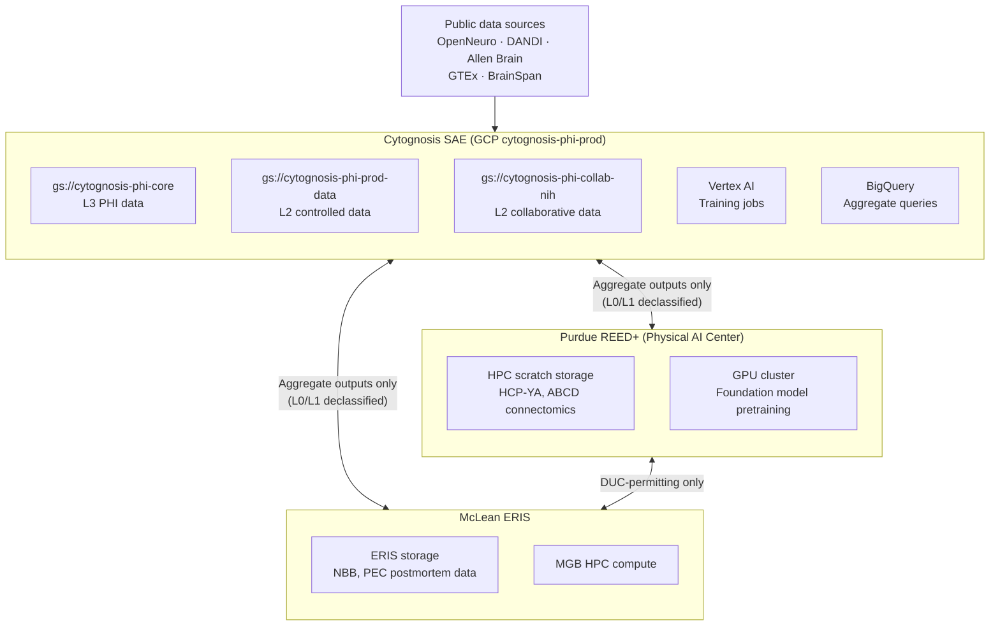

# Neuroverse — Infrastructure & Data Environment
**Last updated**: 2026-05-22 | **Owner**: Shahin Mohammadi

---

## Architecture Overview

Neuroverse data analysis occurs in three environments that must not exchange raw data
outside DUC-specified terms. Each environment is an independent **Secure Analysis
Environment (SAE)**.



---

## Cytognosis Secure Analysis Environment (SAE)

### GCP Project Structure

| Project | ID | Purpose | PHI Level |
|---|---|---|---|
| `cytognosis-infrastructure` | primary management | DNS, services, CI/CD, audit logging | None |
| `cytognosis-phi-prod` | **SAE** | All controlled-access data processing and storage | L2 + L3 |
| `cytognosis-phi-staging` | pre-production testing | DUC workflow testing without real data | None (synthetic only) |
| `cytognosis-phi-dev` | development | Schema development, pipeline testing | None |
| `cytognosis-data` | analytics | Non-PHI analytics, public data lake | L0/L1 |

### Storage Architecture (phi-prod)

| Bucket | Data Tier | Contents | CMEK | Versioning |
|---|---|---|---|---|
| `gs://cytognosis-phi-core` | L3 — PHI | Direct identifiers (clinical EHR) | ⏳ At first ingest | ⏳ At first ingest |
| `gs://cytognosis-phi-prod-data` | L2 — Controlled | NDA/Synapse DUC data (WGS, scRNA-seq, MRI) | ⏳ At first ingest | ⏳ At first ingest |
| `gs://cytognosis-phi-collab-nih` | L2 — Controlled | Collaborative controlled data shared with partners | ⏳ At first ingest | ⏳ At first ingest |
| `gs://cytognosis-audit-7yr` | Audit | Cloud Audit Logs — **locked 2026-05-22** | No (audit cannot use CMEK) | N/A (retention-locked) |

All buckets are in `us-central1`. Data does not leave this region without explicit
configuration.

### Per-DUC IAM Pattern

Each controlled-access dataset gets its own IAM group. This prevents cross-DUC data
leakage — a researcher approved for NBB cannot access PEC data via the same credentials.

```
DUC: nda-nbb
  IAM group: neuroverse-duc-nda-nbb@cytognosis.org
  Bucket access: gs://cytognosis-phi-prod-data/nbb/** (objectViewer)
  Members: Shahin, Brad (when added), any named Approved User per DUC amendment
```

Full provisioning pattern: [duc-iam-pattern.md](../../data-strategy/compliance/duc-iam-pattern.md)

### Compute Architecture

| Use Case | Resource | Notes |
|---|---|---|
| ETL / preprocessing | Cloud Run (CPU) | fMRIPrep, PLINK2, GROBID — spot instances |
| Foundation model training | Vertex AI + GPU | A100 or H100 depending on model scale |
| Knowledge graph inference | Neo4j on `cytohost` | Persistent; always-on |
| Interactive analysis | Vertex AI Workbench | Per-researcher, per-DUC |

> Confidential Compute (AMD SEV-SNP) will be enabled on Vertex AI jobs that touch
> Tier 3 (L3/PHI) data. See [deferred-controls.md](../../data-strategy/compliance/deferred-controls.md) §Control 5.

---

## Partner Environments

### Purdue REED+ (Ananth Grama / Physical AI Center)

REED+ is Purdue's restricted research computing environment, analogous to an SAE.
It hosts Neuroverse's connectomics track (HCP, ABCD, UK Biobank MRI).

| Detail | Value |
|---|---|
| Environment | Purdue REED+ |
| GPU resources | Physical AI Center GPU cluster |
| Primary cohorts | HCP-YA, ABCD, UK Biobank MRI |
| Data transfer | DUC-permitting only; aggregate outputs to Cytognosis SAE |
| Access provisioning | Purdue ITaP + PI (Ananth) approval |

**Open questions (for Ananth):**
1. Is the Physical AI Center GPU cluster inside REED+ or general-purpose?
2. What is the cost structure (per compute hour, per storage TB)?
3. Standard onboarding path for external-institution students into REED+?

### McLean ERIS (Brad Ruzicka / MGB)

ERIS (Enterprise Research Infrastructure and Services) is MGB's research computing
environment. It hosts Neuroverse's molecular genomics track (NBB, PEC).

| Detail | Value |
|---|---|
| Environment | McLean ERIS (MGB-managed) |
| Primary cohorts | NBB postmortem WGS, PsychENCODE |
| Data transfer | Brad's HBTRC standing; aggregate outputs to Cytognosis SAE |
| Access provisioning | Brad adds researchers via MGB IRB process |

**Open questions (for Brad):**
1. What is MGB's operational path for SMART IRB reliance on North Star?
2. Are there MGB-specific restrictions on transferring L0/L1 aggregate outputs to Cytognosis SAE?
3. What is the operational scope and cost of ERIS use for this project?

---

## Cross-Institution Authorization Model

A researcher may access Neuroverse data when **all five** conditions are satisfied:

1. Formally affiliated with a participating institution (Cytognosis, Purdue, MGB).
2. Named on the Neuroverse IRB protocol at their home institution.
3. Named on each relevant DUC/DAA/DUA as an Internal Approved User.
4. Completed required training (CITI or equivalent + NIH GDS Code of Conduct).
5. Credentialed account in the relevant environment (SAE, REED+, ERIS).

### Common Access Patterns

| Person | Affiliation | Works in | Access scope |
|---|---|---|---|
| Shahin (PI) | Cytognosis | Cytognosis SAE | All datasets, all classifications ≤L3 |
| Brad (Site PI) | MGB | ERIS + Cytognosis SAE (joint work) | Genomic and single-cell datasets; L0/L1 outputs from imaging |
| Ananth (Site PI) | Purdue | REED+ + Cytognosis SAE (joint work) | Connectomics datasets; L0/L1 outputs from molecular |
| Cytognosis researcher | Cytognosis | Cytognosis SAE | Per DUC inclusion + personnel record |
| Brad's lab member | MGB | ERIS primary; Cytognosis SAE requires explicit add | Per DUC inclusion |
| Ananth's student | Purdue | REED+ primary; Cytognosis SAE requires explicit add | Per DUC inclusion |

### What Is Prohibited

- Routing data through personal Google Drive, Dropbox, or any unmanaged storage.
- Cross-institution student provisioning that bypasses the partner institution's IRB.
- Transferring raw controlled data between environments without DUC permission.
- Using controlled data to train generative AI models without NIH approval (2025 GDS).
- Access by individuals at institutions in NIH-designated countries of concern.

---

## Service Agreements Required

| Agreement | Parties | Status |
|---|---|---|
| SMART IRB Joinder | Cytognosis → SMART network | ⏳ Pending FWA |
| North Star IRB Support Agreement | Cytognosis + North Star | ✅ Executed |
| Data Use MOU: Cytognosis ↔ Purdue | Both institutions | ⏳ Drafted by Duane |
| Data Use MOU: Cytognosis ↔ McLean/MGB | Both institutions | ⏳ Drafted by Duane |
| Google BAA | Cytognosis + GCP | ✅ Accepted 2025-09-01 |
| Per-cohort DUCs / DAAs / DUAs | Per dataset | ⏳ Pending FWA + IRB |

---

## Infrastructure Provisioning Sequence

When ready to ingest first controlled-access data:

```bash
# 1. Activate CMEK on phi-prod buckets
bash scripts/provision/activate-cmek.sh --duc nda-nbb --kms-keyring duc-nda-nbb

# 2. Enable object versioning
gcloud storage buckets update gs://cytognosis-phi-prod-data --versioning
gcloud storage buckets update gs://cytognosis-phi-core --versioning

# 3. Provision DUC-specific IAM group and bucket prefix
bash scripts/provision/provision-duc-access.sh \
  --duc nda-nbb \
  --approved-users shahin@cytognosis.org,brad.ruzicka@mgh.harvard.edu

# 4. Enable VPC Service Controls perimeter
# (see deferred-controls.md §Control 2)
```
