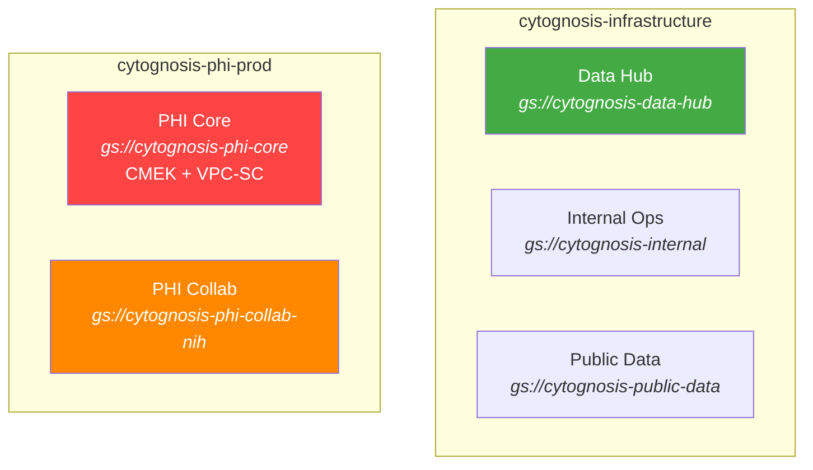

# HIPAA Compliance Overview

> ADHD-friendly quick reference. For full details, see the [compliance docs](file:///home/mohammadi/repos/cytognosis/infrastructure/docs/data-strategy/compliance/).

## Current Status: Pre-Operational

Cytognosis has **not yet ingested any PHI**. All current datasets are either public (T1) or licensed academic (T3). The HIPAA infrastructure exists but is not yet active.

## GCP Security Architecture

## What's Implemented vs Planned

| Control | Status | Notes |
|---------|--------|-------|
| Project isolation (PHI vs non-PHI) | ✅ Done | `cytognosis-phi-prod` separate project |
| CMEK encryption at rest | ⏳ Verify | Check KMS key status on PHI buckets |
| Uniform bucket access | ⏳ Verify | Should be enabled on all buckets |
| Bucket versioning | ⏳ Configuring | Enabling on data-hub, phi-core, phi-collab |
| VPC Service Controls | ⏳ Planned | Not yet configured |
| Audit logging | ⏳ Verify | Check data access logs enabled |
| De-identification pipeline | 📋 Planned | DLP API + Healthcare API |
| BAA with Google | 📋 Needed | Required before PHI ingestion |
| NIST 800-171 self-assessment | 📋 Needed | Required for DUC submissions |

## When Do We Need Full HIPAA?

Before ingesting **any** T4 (Restricted/PHI) data:
1. Complete NIST 800-171 self-assessment
2. Sign BAA with Google Cloud
3. Enable VPC Service Controls on phi-prod
4. Verify CMEK on all PHI buckets
5. Enable audit logging for all data access
6. Deploy de-identification pipeline
7. Train all personnel with PHI access

## Related Docs

- [Data Governance Policy](file:///home/mohammadi/repos/cytognosis/infrastructure/docs/data-strategy/compliance/data-governance-policy.md)
- [HIPAA Status](file:///home/mohammadi/repos/cytognosis/infrastructure/docs/data-strategy/compliance/HIPAA-STATUS.md)
- [Technical Infrastructure](file:///home/mohammadi/repos/cytognosis/infrastructure/docs/data-strategy/TECHNICAL_DATA_INFRASTRUCTURE.md)
