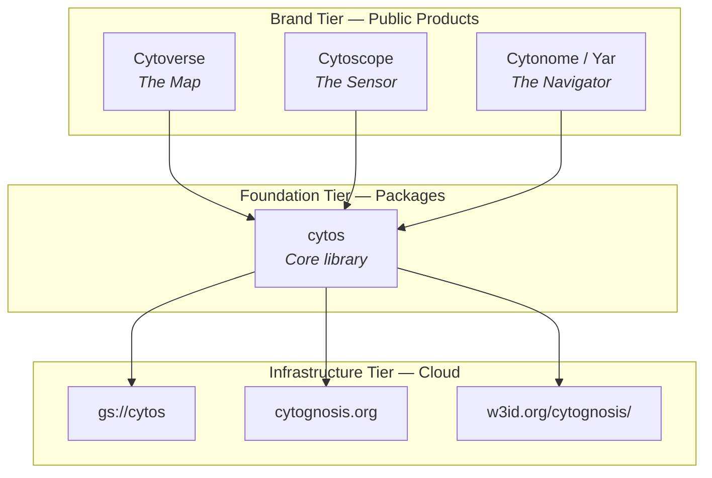
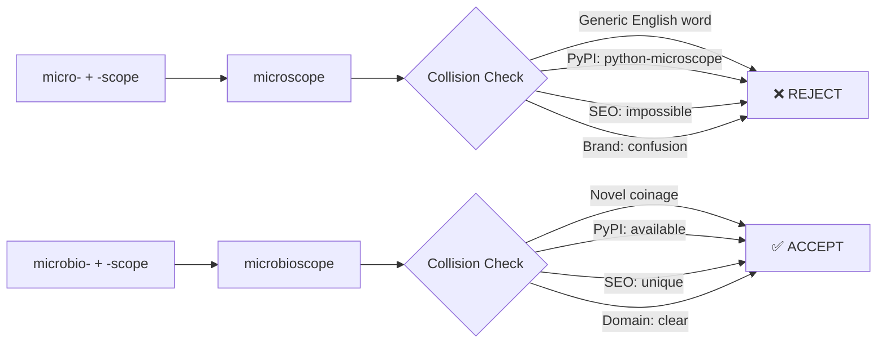
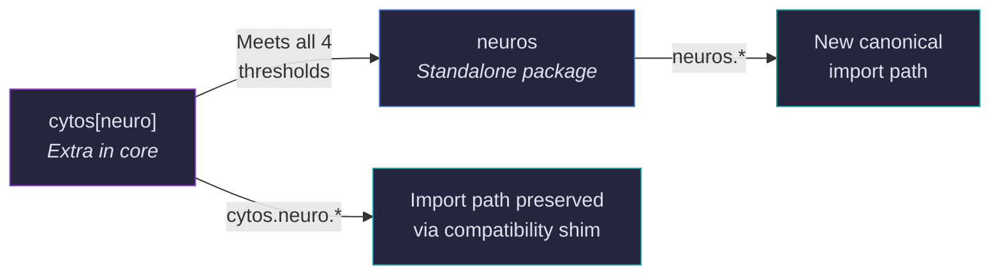
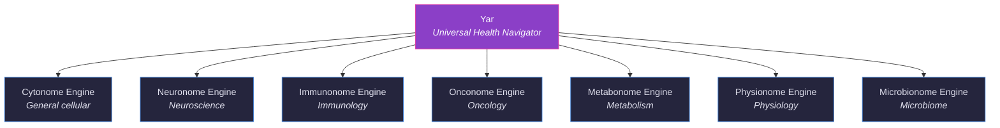
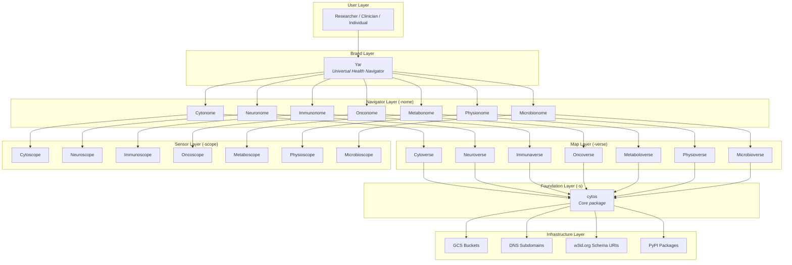

# Domain Vertical Naming Analysis

**Cytognosis Foundation**
**Research Document — Phase 0 Infrastructure Planning**
**Date:** 2025-05-24
**Status:** Draft for Review
**Author:** Infrastructure Planning Team

---

## Table of Contents

1. [Executive Summary](#executive-summary)
2. [Prior Art & Conventions](#prior-art--conventions)
3. [Current Platform Architecture](#current-platform-architecture)
4. [Greek/Latin Root Analysis](#greeklatin-root-analysis)
5. [Evaluation of Proposed Names](#evaluation-of-proposed-names)
6. [PyPI Collision Audit](#pypi-collision-audit)
7. [The Microscope Problem](#the-microscope-problem)
8. [Cytonome Identity Question](#cytonome-identity-question)
9. [Architecture: One Package vs Many](#architecture-one-package-vs-many)
10. [Recommended Final Naming Scheme](#recommended-final-naming-scheme)
11. [Alternatives for Collision Cases](#alternatives-for-collision-cases)
12. [Navigator & Dashboard Naming](#navigator--dashboard-naming)
13. [Infrastructure: Repos, URIs, Namespaces](#infrastructure-repos-uris-namespaces)
14. [DNS Strategy](#dns-strategy)
15. [GCP Bucket Strategy](#gcp-bucket-strategy)
16. [Package Registry Reservations](#package-registry-reservations)
17. [Brand Coherence](#brand-coherence)
18. [Pronunciation Guide](#pronunciation-guide)
19. [Risk Assessment](#risk-assessment)
20. [Final Recommendation](#final-recommendation)
21. [Open Questions](#open-questions)

---

## Executive Summary

Cytognosis is expanding from a single-domain cellular intelligence platform into a **multi-domain health intelligence ecosystem**. Each biomedical vertical (neuroscience, immunology, oncology, metabolism, physiology, microbiome) requires its own data schemas, ontology mappings, sensor configurations, and AI models, while sharing a common infrastructure backbone.

The platform's three brand-tier components provide the architectural blueprint for this expansion:

| Tier | Component | Metaphor | Function |
|------|-----------|----------|----------|
| **Map** | Cytoverse | "The Map" | AI health coordinate system, data model, ontology graph |
| **Sensor** | Cytoscope | "The Sensor" | Programmable continuous biosensing, data acquisition |
| **Navigator** | Cytonome | "The Navigator" | On-device causal AI engine (<5mW), inference & action |

This document analyzes naming conventions for extending these three tiers across seven biomedical domains, evaluates linguistic fitness, audits namespace collisions, and recommends a final naming scheme with infrastructure implications.

> [!IMPORTANT]
> The naming decisions made here will propagate into repository names, Python package names, DNS subdomains, GCP bucket names, schema URIs, and brand materials. Changing names after public release is extremely costly. This analysis aims to get it right the first time.

### Key Outcomes

1. **Greek combining-form convention** is confirmed as the naming system
2. **`neuros`** replaces `psychos` for the neuroscience vertical (collision + connotation)
3. **Hybrid architecture** (one `cytos` core package with domain extras) is recommended
4. **Seven domain verticals** are defined with complete naming across all tiers
5. **Immediate reservation** of all names on PyPI, GCP, and DNS is critical

---

## Prior Art & Conventions

### Four-Tier Naming Register

The Cytognosis naming system follows a four-tier register that maps organizational concepts to progressively more technical identifiers:

```
┌─────────────────────────────────────────────────────────────┐
│  Tier 1: BRAND         │  Cytognosis, Cytoverse, Yar       │
│  Tier 2: FOUNDATION    │  cytos, neuros, immunos            │
│  Tier 3: INFRASTRUCTURE│  gs://cytos, cytos.cytognosis.org  │
│  Tier 4: SCALE         │  cytos[neuro], import cytos.neuro  │
└─────────────────────────────────────────────────────────────┘
```

| Tier | Purpose | Audience | Example |
|------|---------|----------|---------|
| Brand | Public-facing product names | Users, press, funders | Cytoverse, Neuroscope |
| Foundation | Python packages, CLI tools | Developers, researchers | `cytos`, `neuros` |
| Infrastructure | Cloud resources, DNS, URIs | DevOps, platform team | `gs://neuros`, `neuro.cytognosis.org` |
| Scale | Import paths, extras, modules | Contributors, integrators | `cytos[neuro]`, `from cytos.neuro import ...` |

### Greek Combining-Form Convention

All Cytognosis names derive from **Greek (or Latin) combining forms** suffixed with the platform tier marker:

- **-verse** → the data universe / coordinate system (Map tier)
- **-scope** → the observation instrument (Sensor tier)
- **-nome** → the systematic body of knowledge / governance (Navigator tier)
- **-s** → the foundation package (plural form, echoing the Greek convention of naming fields as plurals: physics, mathematics, genomics)

### Committed Neuro* Scale Repos

The neuroscience vertical already has committed repository names in the organizational GitHub:

- `neuros` — foundation package (schemas, ontology mappings)
- `neuroverse` — coordinate system and data model
- `neuroscope` — sensor configuration and data acquisition
- `neuronome` — on-device inference engine

These names set the precedent for all subsequent domain verticals and confirm the Greek combining-form convention as canonical.

---

## Current Platform Architecture

The established stack provides the template that each domain vertical replicates:



### Brand-Tier Components

| Component | Status | Description |
|-----------|--------|-------------|
| **Cytoverse** | Active development | AI health coordinate system mapping personalized health states across multi-omic dimensions |
| **Cytoscope** | Design phase | Programmable continuous biosensing platform for real-time molecular monitoring |
| **Cytonome (Yar)** | Architecture phase | On-device causal AI engine operating at <5mW for edge inference and health navigation |

> [!NOTE]
> "Yar" is the user-facing product name for the Navigator tier. The `-nome` suffix names (Cytonome, Neuronome, etc.) are engineering-internal identifiers for the domain-specific inference engines. Both names coexist: Yar is the brand, Cytonome is the architecture.

---

## Greek/Latin Root Analysis

Each domain vertical derives its naming from a classical combining form. Understanding the etymology ensures names are linguistically sound, culturally appropriate, and semantically precise.

| Root | Origin | Etymology | Meaning | Domain |
|------|--------|-----------|---------|--------|
| **cyto-** | Greek | κύτος (*kýtos*) | "hollow vessel, cell" | General / Cellular |
| **neuro-** | Greek | νεῦρον (*neûron*) | "sinew, nerve" | Neuroscience |
| **psycho-** | Greek | ψυχή (*psychḗ*) | "soul, mind, breath" | Psychology/Psychiatry |
| **immuno-** | Latin | *immunis* | "exempt, free from" | Immunology |
| **onco-** | Greek | ὄγκος (*ónkos*) | "mass, bulk, tumor" | Oncology |
| **metabo-** | Greek | μεταβολή (*metabolḗ*) | "change, transformation" | Metabolism |
| **physio-** | Greek | φύσις (*phýsis*) | "nature, natural order" | Physiology |
| **micro-** | Greek | μικρός (*mikrós*) | "small" | Microbiome |
| **microbio-** | Greek | μικρός + βίος (*mikrós + bíos*) | "small life" | Microbiome (extended) |

> [!WARNING]
> **`immuno-` is Latin, not Greek.** While most roots in the Cytognosis naming system derive from ancient Greek, `immunis` is a Latin adjective meaning "exempt" or "free from service/tax." This is a common misconception. The combining form `immuno-` entered scientific nomenclature via Latin medical tradition. This does not disqualify it, as the `-verse/-scope/-nome` suffixes are themselves modern coinages that blend freely across classical languages, but accuracy in documentation matters.

### Combining Form Productivity

Some roots combine more naturally with the tier suffixes than others:

| Root + Suffix | -verse | -scope | -nome | -s |
|---------------|--------|--------|-------|-----|
| cyto- | ✅ Cytoverse | ✅ Cytoscope | ✅ Cytonome | ✅ cytos |
| neuro- | ✅ Neuroverse | ✅ Neuroscope | ✅ Neuronome | ✅ neuros |
| immuno- | ✅ Immunoverse | ✅ Immunoscope | ✅ Immunonome | ✅ immunos |
| onco- | ✅ Oncoverse | ✅ Oncoscope | ✅ Onconome | ✅ oncos |
| metabo- | ⚠️ Metaboloverse | ✅ Metaboscope | ✅ Metabonome | ✅ metabos |
| physio- | ✅ Physioverse | ✅ Physioscope | ✅ Physionome | ✅ physios |
| microbio- | ⚠️ Microbioverse | ⚠️ Microbioscope | ⚠️ Microbionome | ✅ microbios |

> [!NOTE]
> The ⚠️ markers indicate names that are phonetically heavier (4+ syllables) but remain linguistically valid. "Metaboloverse" and "Microbioverse" are long but unambiguous. The alternative "Metaboverse" collides with an existing tool (see [PyPI Collision Audit](#pypi-collision-audit)).

---

## Evaluation of Proposed Names

Each candidate name is evaluated across seven dimensions on a 1–5 scale:

### Evaluation Dimensions

1. **Linguistic Validity** — Does the combining form follow established scientific nomenclature?
2. **Pronounceability** — Can a non-specialist say it correctly on first attempt?
3. **Memorability** — Does it stick after one hearing?
4. **Brandability** — Does it work in marketing materials, slide decks, grant proposals?
5. **Collision Risk** — Are there existing projects, companies, or packages with the same name?
6. **Consistency** — Does it follow the established Cytognosis naming pattern?
7. **Domain Clarity** — Does the name immediately signal which biomedical domain it serves?

### Foundation Package Scores (`-s` names)

| Name | Ling. | Pronoun. | Memor. | Brand. | Collis. | Consist. | Domain | **Avg** |
|------|-------|----------|--------|--------|---------|----------|--------|---------|
| `cytos` | 5 | 5 | 5 | 5 | 5 | 5 | 5 | **5.0** |
| `neuros` | 5 | 5 | 5 | 5 | 5 | 5 | 5 | **5.0** |
| `immunos` | 5 | 4 | 4 | 4 | 5 | 5 | 5 | **4.6** |
| `oncos` | 5 | 5 | 5 | 4 | 5 | 5 | 5 | **4.9** |
| `metabos` | 5 | 4 | 4 | 4 | 5 | 5 | 5 | **4.6** |
| `physios` | 5 | 5 | 5 | 4 | 5 | 5 | 5 | **4.9** |
| `microbios` | 5 | 3 | 3 | 3 | 5 | 5 | 5 | **4.1** |
| ~~`psychos`~~ | 5 | 5 | 5 | 1 | 1 | 5 | 4 | ~~**3.7**~~ |
| ~~`micros`~~ | 3 | 5 | 5 | 2 | 1 | 5 | 2 | ~~**3.3**~~ |

### Map Tier Scores (`-verse` names)

| Name | Ling. | Pronoun. | Memor. | Brand. | Collis. | Consist. | Domain | **Avg** |
|------|-------|----------|--------|--------|---------|----------|--------|---------|
| Cytoverse | 5 | 5 | 5 | 5 | 5 | 5 | 5 | **5.0** |
| Neuroverse | 5 | 5 | 5 | 5 | 4 | 5 | 5 | **4.9** |
| Immunoverse | 5 | 4 | 4 | 4 | 2 | 5 | 5 | **4.1** |
| Immunaverse | 4 | 4 | 4 | 4 | 5 | 4 | 5 | **4.3** |
| Oncoverse | 5 | 5 | 5 | 4 | 3 | 5 | 5 | **4.6** |
| Metaboloverse | 5 | 3 | 3 | 3 | 5 | 5 | 5 | **4.1** |
| Physioverse | 5 | 5 | 5 | 4 | 5 | 5 | 5 | **4.9** |
| Microbioverse | 5 | 3 | 3 | 3 | 5 | 5 | 5 | **4.1** |

### Sensor Tier Scores (`-scope` names)

| Name | Ling. | Pronoun. | Memor. | Brand. | Collis. | Consist. | Domain | **Avg** |
|------|-------|----------|--------|--------|---------|----------|--------|---------|
| Cytoscope | 5 | 5 | 5 | 5 | 5 | 5 | 5 | **5.0** |
| Neuroscope | 5 | 5 | 5 | 5 | 4 | 5 | 5 | **4.9** |
| Immunoscope | 5 | 4 | 4 | 4 | 4 | 5 | 5 | **4.4** |
| Oncoscope | 5 | 5 | 5 | 4 | 4 | 5 | 5 | **4.7** |
| Metaboscope | 5 | 4 | 4 | 4 | 5 | 5 | 5 | **4.6** |
| Physioscope | 5 | 5 | 5 | 4 | 5 | 5 | 5 | **4.9** |
| Microbioscope | 5 | 3 | 3 | 3 | 5 | 5 | 5 | **4.1** |
| ~~Microscope~~ | 5 | 5 | 5 | 1 | 1 | 5 | 1 | ~~**3.3**~~ |

---

## PyPI Collision Audit

A systematic audit of PyPI (Python Package Index) for all candidate names. Each entry documents the existing package, its purpose, download volume, and the recommended action.

### Critical Collisions (REJECT)

#### `psychos` — ❌ TAKEN + Negative Connotation

```
Package:    psychos
Status:     TAKEN on PyPI
Maintainer: Active (behavioral science community)
Purpose:    Behavioral experiment library for psychology research
Downloads:  Low-moderate
```

**Decision: REJECT.** Two independent disqualifying factors:

1. **Namespace collision** — An active, maintained package exists
2. **Cultural connotation** — "Psychos" has strong negative connotations in English (slang for "psychopaths"). Unusable in grant proposals, press releases, or any public-facing context. Imagine the headline: "Cytognosis launches Psychos for mental health monitoring."

**Replacement:** Use `neuros` (see [Call 1](#call-1-use-neuros-for-the-neurosciencepsychiatry-vertical))

#### `microscope` — ❌ TAKEN + Generic Term

```
Package:    microscope (python-microscope)
Status:     TAKEN on PyPI
Maintainer: Active (microscopy hardware community)
Purpose:    Python-Microscope — hardware control for microscopy devices
Downloads:  Moderate (active scientific community)
Repository: github.com/python-microscope/microscope
```

**Decision: REJECT.** Three disqualifying factors:

1. **Namespace collision** — Active, well-maintained package with community backing
2. **Generic term** — "Microscope" is a common English word with strong existing meaning
3. **SEO impossibility** — Would never rank in search results against the physical instrument

**Replacement:** Use `microbioscope` (see [The Microscope Problem](#the-microscope-problem))

### Moderate Collisions (CAUTION)

#### `metaboverse` — ⚠️ TAKEN

```
Package:    metaboverse
Status:     TAKEN on PyPI
Maintainer: Active (Jordan Berg lab, University of Utah)
Purpose:    Metabolic network analysis and visualization tool
Downloads:  Low
Repository: github.com/Metaboverse/Metaboverse
Publication: Published in Cell Reports Methods (2023)
```

**Decision: Use `metaboloverse` instead.** The collision is with a published, citable tool in the metabolomics space, which is exactly our target domain. Using the full combining form `metabolo-` (from μεταβολή) avoids the collision while being more etymologically precise.

#### `immunoverse` — ⚠️ IN USE

```
Package:    immunoverse
Status:     Name in use (R/Bioconductor ecosystem)
Maintainer: Active research group
Purpose:    Tumor antigen analysis pipeline for immunogenomics
Context:    Published workflow for neoantigen prediction
```

**Decision: Use `immunaverse` or qualify with Cytognosis prefix.** The collision is in the R ecosystem, not PyPI directly, but the name has published associations. `Immunaverse` uses the Latin stem `immuna-` (from *immunis*) instead of the combining form `immuno-`, creating a distinct name while preserving the immunology association.

#### `oncoverse` — ⚠️ IN USE (Moderate Risk)

```
Package:    oncoverse
Status:     Name in use
Maintainer: Romanian National Oncology Initiative
Purpose:    National oncology data platform (Romania)
Context:    Government-funded healthcare initiative
```

**Decision: Proceed with caution.** The Romanian initiative operates in a different context (national healthcare vs. open-source tooling) and a different language ecosystem. The collision risk is moderate. Monitor for conflicts and be prepared to qualify as `cyto-oncoverse` if needed.

### Available Names (CLEAR)

| Name | PyPI Status | npm Status | Notes |
|------|------------|------------|-------|
| `immunos` | ✅ Available | ✅ Available | Clean namespace |
| `oncos` | ✅ Available | ✅ Available | Clean namespace |
| `metabos` | ✅ Available | ✅ Available | Clean namespace |
| `physios` | ✅ Available | ✅ Available | Clean namespace |
| `neuros` | ✅ Available | ✅ Available | Clean namespace |
| `microbios` | ✅ Available | ✅ Available | Clean namespace |
| `cytos` | ✅ Available | ✅ Available | Clean namespace |

> [!CAUTION]
> All available names should be **reserved immediately** on PyPI with placeholder packages. Names on PyPI are first-come-first-served, and the scientific Python ecosystem is growing rapidly. A two-week delay could result in a lost name. See [Package Registry Reservations](#package-registry-reservations).

---

## The Microscope Problem

The microbiome sensor tier presents a unique and unfixable naming challenge.

### Why `microscope` Cannot Work



The word "microscope" is one of the most well-known scientific instruments in human history. No amount of branding, SEO optimization, or qualifier prefixing can overcome the semantic weight of a word that every child learns in elementary school.

### The Solution: `microbioscope`

Extending the root from `micro-` to `microbio-` (Greek: μικρός + βίος, "small life") solves the problem completely:

| Criterion | `microscope` | `microbioscope` |
|-----------|-------------|-----------------|
| Unique on PyPI | ❌ | ✅ |
| SEO-viable | ❌ | ✅ |
| Domain-specific | ❌ (too generic) | ✅ (microbiome) |
| Pronounceable | ✅ | ✅ (5 syllables) |
| Pattern-consistent | ✅ | ✅ |
| Etymologically sound | ✅ | ✅ |

This extends consistently to the other tiers:

- `microbios` (foundation)
- `microbioverse` (map)
- `microbioscope` (sensor)
- `microbionome` (navigator)

> [!TIP]
> The `microbio-` prefix also provides better **domain clarity** than bare `micro-`. When a researcher sees "Microbioverse," they immediately think "microbiome data platform." When they see "Microverse," they think of Rick and Morty.

---

## Cytonome Identity Question

### Should We Keep the `-nome` Suffix?

The Navigator tier uses the `-nome` suffix, derived from the Greek νόμος (*nómos*, "law, custom, governance") and related to νομή (*nomḗ*, "distribution, management"). This is the same root that gives us:

- **genome** (γένος + νόμος → "gene governance")
- **biome** (βίος + νόμος → "life governance")
- **metronome** (μέτρον + νόμος → "measure governance")

The `-nome` suffix is etymologically sound for a system that **governs inference and decision-making** on health data. It is the "law-giver" tier, the component that takes the Map (data) and Sensor (observations) and produces actionable governance of health state.

**Decision: Keep `-nome`.** The etymology is precise, the pattern is productive across all domains, and the suffix is distinctive enough to avoid collisions.

### Yar Stays as the Product Name

"Yar" is the user-facing brand name for the Navigator/Dashboard product. It is:

- Short, memorable, distinctive
- Already in use in brand materials and planning documents
- Not a Greek combining form (intentionally), which differentiates the product brand from the engineering infrastructure

The relationship between Yar and the `-nome` names is:

```
Yar (product brand, user-facing)
├── Cytonome   (general cellular navigator engine)
├── Neuronome  (neuroscience navigator engine)
├── Immunonome (immunology navigator engine)
├── Onconome   (oncology navigator engine)
├── Metabonome (metabolism navigator engine)
├── Physionome (physiology navigator engine)
└── Microbionome (microbiome navigator engine)
```

> [!NOTE]
> Yar is the **universal dashboard**. A user opens Yar, and Yar routes to the appropriate `-nome` engine based on the data domain. The `-nome` names are for engineers building domain-specific inference pipelines. End users only ever see "Yar."

---

## Architecture: One Package vs Many

A critical architectural decision: should each domain vertical be a separate Python package, or should everything live in a single monorepo package with domain extras?

### Option A: Separate Packages (One Per Domain)

```
pip install cytos
pip install neuros
pip install immunos
pip install oncos
```

**Pros:**
- Clean dependency isolation
- Independent release cycles
- Clear ownership boundaries
- Smaller install footprint per domain

**Cons:**
- Massive maintenance burden for a small team
- Version synchronization nightmare
- Duplicated CI/CD infrastructure
- Users must know which package to install
- Early domains will be tiny packages with 2-3 modules

### Option B: Monolith (Everything in `cytos`)

```
pip install cytos
# Everything included, all domains
```

**Pros:**
- Single install, single version
- Shared infrastructure and utilities
- Simplest CI/CD
- Easiest for new contributors

**Cons:**
- Bloated install for single-domain users
- All domains coupled to same release cycle
- Import namespace pollution
- Harder to manage domain-specific dependencies

### Option C: Hybrid — `cytos` Core + Domain Extras (RECOMMENDED)

```
pip install cytos              # Core only
pip install cytos[neuro]       # Core + neuroscience schemas/adapters
pip install cytos[immuno]      # Core + immunology schemas/adapters
pip install cytos[all]         # Everything
```

**Pros:**
- Single package, optional domains
- Clean dependency management via extras
- Users install only what they need
- Shared core infrastructure
- Single CI/CD pipeline
- Natural graduation path to separate packages

**Cons:**
- Extras can get complex with many domains
- All domains share one release cycle (mitigated by semver)

### Graduation Criteria

A domain vertical graduates from a `cytos` extra to a standalone package when it meets **all four** thresholds:

| Criterion | Threshold | Rationale |
|-----------|-----------|-----------|
| Contributors | ≥ 2 dedicated contributors | Sustainable maintenance capacity |
| Schemas | ≥ 5 domain-specific schemas | Sufficient complexity to justify separation |
| Code size | ≥ 100KB of domain code | Non-trivial codebase |
| Adapters | ≥ 3 external adapters | Integration surface area warrants independence |



> [!IMPORTANT]
> **Recommendation: Option C (Hybrid).** Start with `cytos` as the single package with domain extras. Graduate domains to standalone packages as they mature. This minimizes early maintenance overhead while preserving the namespace for future independence.

### Import Namespace Design

```python
# Core imports (always available)
from cytos.core import Schema, Ontology, Pipeline
from cytos.io import readers, writers

# Domain-specific imports (require extras)
from cytos.neuro import NeuroSchema, EEGAdapter
from cytos.immuno import ImmunoSchema, FlowCytometryAdapter
from cytos.onco import OncoSchema, TumorBoardAdapter

# After graduation to standalone package
from neuros import NeuroSchema, EEGAdapter
from neuros.adapters import MNEAdapter, BIDSAdapter
```

---

## Recommended Final Naming Scheme

The complete naming matrix for all seven domain verticals across all four tiers:

| Domain | Foundation (`-s`) | Map (`-verse`) | Sensor (`-scope`) | Navigator (`-nome`) |
|--------|-------------------|----------------|--------------------|---------------------|
| **General** | `cytos` | Cytoverse | Cytoscope | Cytonome (Yar) |
| **Neuroscience** | `neuros` | Neuroverse | Neuroscope | Neuronome |
| **Immunology** | `immunos` | Immunoverse / Immunaverse¹ | Immunoscope | Immunonome |
| **Oncology** | `oncos` | Oncoverse² | Oncoscope | Onconome |
| **Metabolism** | `metabos` | Metaboloverse³ | Metaboscope | Metabonome |
| **Physiology** | `physios` | Physioverse | Physioscope | Physionome |
| **Microbiome** | `microbios` | Microbioverse | Microbioscope | Microbionome |

**Notes:**

¹ `Immunaverse` is the collision-safe alternative if `Immunoverse` conflicts with the R/Bioconductor `immunoverse` package. Use `Immunaverse` by default.

² `Oncoverse` has moderate collision risk with the Romanian national oncology initiative. Monitor and qualify if needed.

³ `Metaboloverse` uses the full combining form to avoid collision with the existing `Metaboverse` tool (published in Cell Reports Methods, 2023).

### Visual Pattern Test

All names should feel like siblings in a family. Reading them together should produce a sense of systematic, deliberate design:

```
cytos    · neuros    · immunos    · oncos    · metabos    · physios    · microbios
Cytoverse · Neuroverse · Immunaverse · Oncoverse · Metaboloverse · Physioverse · Microbioverse
Cytoscope · Neuroscope · Immunoscope · Oncoscope · Metaboscope   · Physioscope · Microbioscope
Cytonome  · Neuronome  · Immunonome  · Onconome  · Metabonome    · Physionome  · Microbionome
```

> [!TIP]
> Read each row aloud. The rhythmic consistency confirms the naming system works. Each name shares the suffix cadence while the prefix immediately signals the biomedical domain.

---

## Alternatives for Collision Cases

### `immunaverse` vs `immunoverse`

| Criterion | `immunoverse` | `immunaverse` |
|-----------|--------------|---------------|
| Etymology | immuno- + verse (standard combining form) | immuna- + verse (Latin stem variant) |
| Collision | ⚠️ R/Bioconductor package exists | ✅ No known collision |
| Precedent | "Immunoverse" is published in literature | Novel coinage |
| Pronunciation | im-MYOO-no-verse (5 syl.) | im-MYOO-na-verse (5 syl.) |
| **Recommendation** | Avoid unless R collision is acceptable | **Use by default** |

### `metaboloverse` vs `metaboverse`

| Criterion | `metaboverse` | `metaboloverse` |
|-----------|--------------|-----------------|
| Etymology | metabo- + verse (truncated) | metabolo- + verse (full combining form) |
| Collision | ❌ Published tool (Cell Rep Methods 2023) | ✅ No known collision |
| Syllables | 5 | 6 |
| **Recommendation** | ❌ Reject (collision) | **Use** |

### `microbioscope` vs `microscope`

| Criterion | `microscope` | `microbioscope` |
|-----------|-------------|-----------------|
| Etymology | micro- + scope | microbio- + scope |
| Collision | ❌ Common English word + PyPI package | ✅ No known collision |
| Domain clarity | ❌ (generic) | ✅ (microbiome-specific) |
| **Recommendation** | ❌ Reject (unfixable) | **Use** |

### `neuros` vs `psychos`

| Criterion | `psychos` | `neuros` |
|-----------|----------|---------|
| Domain fit | Psychology/psychiatry specific | Neuroscience (broader, encompasses psych) |
| Collision | ❌ PyPI package exists | ✅ Available |
| Connotation | ❌ "Psychos" = extremely negative | ✅ Neutral/positive |
| Scope | Narrow (mind/behavior only) | Broad (brain, nerves, cognition, behavior) |
| **Recommendation** | ❌ Reject (collision + connotation) | **Use** |

### `microbios` vs `micros`

| Criterion | `micros` | `microbios` |
|-----------|---------|-------------|
| Domain clarity | ❌ (micro = small, not microbiome) | ✅ (microbio = small life = microbiome) |
| Collision risk | ⚠️ Generic term, likely taken | ✅ Available |
| Consistency | ⚠️ Doesn't match other root lengths | ✅ Matches pattern |
| **Recommendation** | ❌ Reject (ambiguous) | **Use** |

---

## Navigator & Dashboard Naming

### Yar: The Universal Navigator

Yar is the user-facing product name for the Navigator/Dashboard tier. It operates as the unified interface across all domain verticals:



### Naming Audience Matrix

| Name | Audience | Context |
|------|----------|---------|
| **Yar** | End users, press, funders | "Open Yar to see your health dashboard" |
| **Cytonome** | Engineers, architecture docs | "Cytonome processes the general cellular inference pipeline" |
| **Neuronome** | Domain engineers, API docs | "Neuronome integrates EEG and fMRI data streams" |
| **Immunonome** | Domain engineers, API docs | "Immunonome runs the flow cytometry analysis pipeline" |

The `-nome` names are for people building and extending the platform. The Yar name is for people using it.

---

## Infrastructure: Repos, URIs, Namespaces

### Repository Naming

All repositories follow the foundation-tier naming convention:

| Domain | Repository | GitHub Path |
|--------|-----------|-------------|
| General | `cytos` | `cytognosis/cytos` |
| Neuroscience | `neuros` | `cytognosis/neuros` |
| Immunology | `immunos` | `cytognosis/immunos` |
| Oncology | `oncos` | `cytognosis/oncos` |
| Metabolism | `metabos` | `cytognosis/metabos` |
| Physiology | `physios` | `cytognosis/physios` |
| Microbiome | `microbios` | `cytognosis/microbios` |

> [!NOTE]
> Under the hybrid architecture (Option C), the domain repos initially serve as **schema and documentation** repositories only. The actual Python code lives in `cytos` as extras until the domain graduates to a standalone package. The repos are reserved to prevent namespace squatting and to provide domain-specific issue tracking, documentation, and community spaces.

### Schema URIs

All Cytognosis schemas use persistent identifiers through [w3id.org](https://w3id.org):

```
https://w3id.org/cytognosis/              → Core ontology
https://w3id.org/cytognosis/neuro/        → Neuroscience schemas
https://w3id.org/cytognosis/immuno/       → Immunology schemas
https://w3id.org/cytognosis/onco/         → Oncology schemas
https://w3id.org/cytognosis/metabo/       → Metabolism schemas
https://w3id.org/cytognosis/physio/       → Physiology schemas
https://w3id.org/cytognosis/microbio/     → Microbiome schemas
```

The w3id.org system provides:
- **Persistence** — URIs resolve even if our infrastructure changes
- **Content negotiation** — JSON-LD, Turtle, HTML based on Accept headers
- **Community trust** — w3id.org is maintained by the W3C Permanent Identifier Community Group

### Python Import Namespaces

Phase 1 (hybrid, `cytos` extras):

```python
import cytos                        # Core
from cytos.neuro import schemas     # Neuroscience
from cytos.immuno import schemas    # Immunology
from cytos.onco import schemas      # Oncology
from cytos.metabo import schemas    # Metabolism
from cytos.physio import schemas    # Physiology
from cytos.microbio import schemas  # Microbiome
```

Phase 2 (graduated standalone packages):

```python
import neuros                       # Standalone neuroscience
from neuros import schemas
from neuros.adapters import mne, bids

# Backward compatibility shim in cytos
from cytos.neuro import schemas     # Still works, delegates to neuros
```

---

## DNS Strategy

Domain verticals map to subdomains of `cytognosis.org`:

| Subdomain | Purpose | Content |
|-----------|---------|---------|
| `cytognosis.org` | Main site | Organization homepage, mission, team |
| `docs.cytognosis.org` | Documentation | Unified documentation hub |
| `neuro.cytognosis.org` | Neuroscience portal | Domain-specific docs, schemas, demos |
| `immuno.cytognosis.org` | Immunology portal | Domain-specific docs, schemas, demos |
| `onco.cytognosis.org` | Oncology portal | Domain-specific docs, schemas, demos |
| `metabo.cytognosis.org` | Metabolism portal | Domain-specific docs, schemas, demos |
| `physio.cytognosis.org` | Physiology portal | Domain-specific docs, schemas, demos |
| `microbio.cytognosis.org` | Microbiome portal | Domain-specific docs, schemas, demos |
| `api.cytognosis.org` | API gateway | Unified API endpoint |
| `yar.cytognosis.org` | Navigator app | Yar web application |

### DNS Configuration

```yaml
# Cloudflare DNS records (example)
# All domain subdomains point to the same Cloud Run service
# with path-based routing

records:
  - type: CNAME
    name: neuro
    content: cytognosis.org
    proxied: true
  - type: CNAME
    name: immuno
    content: cytognosis.org
    proxied: true
  - type: CNAME
    name: onco
    content: cytognosis.org
    proxied: true
  - type: CNAME
    name: metabo
    content: cytognosis.org
    proxied: true
  - type: CNAME
    name: physio
    content: cytognosis.org
    proxied: true
  - type: CNAME
    name: microbio
    content: cytognosis.org
    proxied: true
```

> [!TIP]
> Start by reserving all subdomains as CNAME records pointing to the main site. As domain verticals mature, each subdomain can be routed to its own Cloud Run service or documentation deployment.

---

## GCP Bucket Strategy

Google Cloud Storage buckets are globally unique and first-come-first-served. Reserve all domain-specific buckets immediately.

### Buckets to Reserve

| Bucket Name | Purpose | Storage Class | Region |
|-------------|---------|---------------|--------|
| `gs://cytos` | Core platform data, shared schemas | Standard | us-west1 |
| `gs://neuros` | Neuroscience domain data | Standard | us-west1 |
| `gs://immunos` | Immunology domain data | Standard | us-west1 |
| `gs://oncos` | Oncology domain data | Standard | us-west1 |
| `gs://metabos` | Metabolism domain data | Standard | us-west1 |
| `gs://physios` | Physiology domain data | Standard | us-west1 |
| `gs://microbios` | Microbiome domain data | Standard | us-west1 |

### Bucket Configuration

```bash
#!/bin/bash
# Reserve all domain buckets with uniform bucket-level access
set -euo pipefail

PROJECT="cytognosis-platform"
REGION="us-west1"
BUCKETS=(cytos neuros immunos oncos metabos physios microbios)

for bucket in "${BUCKETS[@]}"; do
    echo "Creating bucket: gs://${bucket}"
    gcloud storage buckets create "gs://${bucket}" \
        --project="${PROJECT}" \
        --location="${REGION}" \
        --uniform-bucket-level-access \
        --public-access-prevention \
        --default-storage-class=STANDARD \
        --labels="domain=${bucket},project=cytognosis" \
        2>/dev/null || echo "  Bucket gs://${bucket} already exists or name taken"
done
```

> [!CAUTION]
> GCS bucket names are **globally unique across all of Google Cloud**. If another GCP project has already claimed `gs://neuros`, we cannot use that name. Run the reservation script immediately and document any names that are unavailable. Fallback pattern: `gs://cytognosis-neuros`, `gs://cytognosis-immunos`, etc.

---

## Package Registry Reservations

### PyPI Reservation Strategy

Reserve all package names on PyPI with minimal placeholder packages:

```python
# pyproject.toml template for reservation
[project]
name = "neuros"  # Replace per domain
version = "0.0.1.dev0"
description = "Cytognosis neuroscience domain — coming soon"
readme = "README.md"
license = {text = "Apache-2.0"}
requires-python = ">=3.11"
authors = [
    {name = "Cytognosis Foundation", email = "engineering@cytognosis.org"}
]
classifiers = [
    "Development Status :: 1 - Planning",
    "Intended Audience :: Science/Research",
    "License :: OSI Approved :: Apache Software License",
    "Programming Language :: Python :: 3",
    "Topic :: Scientific/Engineering :: Bio-Informatics",
]

[project.urls]
Homepage = "https://cytognosis.org"
Repository = "https://github.com/cytognosis/neuros"
```

### Packages to Reserve

| Package | PyPI Name | Status | Priority |
|---------|-----------|--------|----------|
| `cytos` | `cytos` | Reserve NOW | 🔴 Critical |
| `neuros` | `neuros` | Reserve NOW | 🔴 Critical |
| `immunos` | `immunos` | Reserve NOW | 🟡 High |
| `oncos` | `oncos` | Reserve NOW | 🟡 High |
| `metabos` | `metabos` | Reserve NOW | 🟡 High |
| `physios` | `physios` | Reserve NOW | 🟢 Medium |
| `microbios` | `microbios` | Reserve NOW | 🟢 Medium |

### Reservation Script

```bash
#!/bin/bash
# Reserve all domain packages on PyPI
set -euo pipefail

PACKAGES=(cytos neuros immunos oncos metabos physios microbios)
TEMPLATE_DIR="$(mktemp -d)"

for pkg in "${PACKAGES[@]}"; do
    echo "=== Reserving ${pkg} ==="
    PKG_DIR="${TEMPLATE_DIR}/${pkg}"
    mkdir -p "${PKG_DIR}/src/${pkg}"

    # Create minimal package
    cat > "${PKG_DIR}/src/${pkg}/__init__.py" << EOF
"""Cytognosis ${pkg} domain — coming soon.

See https://cytognosis.org for more information.
"""
__version__ = "0.0.1.dev0"
EOF

    cat > "${PKG_DIR}/pyproject.toml" << EOF
[build-system]
requires = ["hatchling"]
build-backend = "hatchling.build"

[project]
name = "${pkg}"
version = "0.0.1.dev0"
description = "Cytognosis ${pkg} domain — under development"
license = {text = "Apache-2.0"}
requires-python = ">=3.11"
authors = [{name = "Cytognosis Foundation", email = "engineering@cytognosis.org"}]
classifiers = ["Development Status :: 1 - Planning"]

[project.urls]
Homepage = "https://cytognosis.org"
EOF

    cat > "${PKG_DIR}/README.md" << EOF
# ${pkg}

Part of the [Cytognosis](https://cytognosis.org) cellular intelligence platform.

This package is under active development. Stay tuned.
EOF

    # Build and upload
    cd "${PKG_DIR}"
    uv build
    uv publish --token "${PYPI_TOKEN}"
    cd -
done

rm -rf "${TEMPLATE_DIR}"
echo "All packages reserved."
```

---

## Brand Coherence

### Visual Pattern Test

A naming system achieves brand coherence when all names feel like siblings, as if they were born from the same linguistic family. The Cytognosis naming system passes this test.

**Row Consistency (Same Tier, Different Domains):**

```
Foundation:  cytos · neuros · immunos · oncos · metabos · physios · microbios
             ━━━━━   ━━━━━━   ━━━━━━━   ━━━━━   ━━━━━━━   ━━━━━━━   ━━━━━━━━
             All end in -s, all 2-4 syllables, all Greek/Latin roots
```

```
Map:         Cytoverse · Neuroverse · Immunaverse · Oncoverse · Metaboloverse · Physioverse · Microbioverse
             ━━━━━━━━━   ━━━━━━━━━━   ━━━━━━━━━━━   ━━━━━━━━━   ━━━━━━━━━━━━━   ━━━━━━━━━━━   ━━━━━━━━━━━━━
             All end in -verse, all 4-6 syllables
```

**Column Consistency (Same Domain, Different Tiers):**

```
Neuroscience:  neuros → Neuroverse → Neuroscope → Neuronome
               ━━━━━━   ━━━━━━━━━━   ━━━━━━━━━━   ━━━━━━━━━
               Same root, different suffixes, clear tier distinction
```

### Syllable Budget Analysis

Shorter names are easier to type, say, and remember. The syllable budget for each tier:

| Tier | Target | Range | Outliers |
|------|--------|-------|----------|
| Foundation (`-s`) | 2-3 syllables | 2 (cytos) — 4 (microbios) | `microbios` (4) is acceptable |
| Map (`-verse`) | 4-5 syllables | 4 (Cytoverse) — 6 (Metaboloverse) | `Metaboloverse` (6), `Microbioverse` (6) |
| Sensor (`-scope`) | 4-5 syllables | 4 (Cytoscope) — 6 (Microbioscope) | `Microbioscope` (6) |
| Navigator (`-nome`) | 4-5 syllables | 4 (Cytonome) — 6 (Microbionome) | `Microbionome` (6) |

> [!NOTE]
> The microbiome domain consistently hits the 6-syllable ceiling. This is the inherent cost of using the full `microbio-` combining form, which is necessary to avoid the catastrophic `micro-` → `microscope` collision. The extra syllable is a worthwhile trade for namespace safety and domain clarity.

### Tier Consistency Check

Every domain must have exactly four names, one per tier. No domain should skip a tier or have an irregular name:

| Domain | `-s` | `-verse` | `-scope` | `-nome` | Complete? |
|--------|------|----------|----------|---------|-----------|
| General | ✅ | ✅ | ✅ | ✅ | ✅ |
| Neuroscience | ✅ | ✅ | ✅ | ✅ | ✅ |
| Immunology | ✅ | ✅ | ✅ | ✅ | ✅ |
| Oncology | ✅ | ✅ | ✅ | ✅ | ✅ |
| Metabolism | ✅ | ✅ | ✅ | ✅ | ✅ |
| Physiology | ✅ | ✅ | ✅ | ✅ | ✅ |
| Microbiome | ✅ | ✅ | ✅ | ✅ | ✅ |

---

## Pronunciation Guide

Correct pronunciation prevents fragmentation in verbal communication. All names follow standard English pronunciation of Greek/Latin combining forms.

### Foundation Tier (`-s`)

| Name | IPA | Syllables | Stress |
|------|-----|-----------|--------|
| cytos | /ˈsaɪ.toʊz/ | 2 | **CY**-tos |
| neuros | /ˈnjʊə.roʊz/ | 2 | **NEU**-ros |
| immunos | /ɪˈmjuː.noʊz/ | 3 | i-**MU**-nos |
| oncos | /ˈɒŋ.koʊz/ | 2 | **ON**-cos |
| metabos | /mɛˈtæb.oʊz/ | 3 | me-**TAB**-os |
| physios | /ˈfɪz.i.oʊz/ | 3 | **PHYS**-i-os |
| microbios | /maɪ.kroʊˈbaɪ.oʊz/ | 4 | my-cro-**BI**-os |

### Map Tier (`-verse`)

| Name | IPA | Syllables | Stress |
|------|-----|-----------|--------|
| Cytoverse | /ˈsaɪ.toʊ.vɜːrs/ | 4 | **CY**-to-verse |
| Neuroverse | /ˈnjʊə.roʊ.vɜːrs/ | 4 | **NEU**-ro-verse |
| Immunaverse | /ɪˈmjuː.nə.vɜːrs/ | 5 | i-**MU**-na-verse |
| Oncoverse | /ˈɒŋ.koʊ.vɜːrs/ | 4 | **ON**-co-verse |
| Metaboloverse | /mɛˈtæb.ə.loʊ.vɜːrs/ | 6 | me-**TAB**-o-lo-verse |
| Physioverse | /ˈfɪz.i.oʊ.vɜːrs/ | 5 | **PHYS**-i-o-verse |
| Microbioverse | /maɪ.kroʊˈbaɪ.oʊ.vɜːrs/ | 6 | my-cro-**BI**-o-verse |

### Sensor Tier (`-scope`)

| Name | IPA | Syllables | Stress |
|------|-----|-----------|--------|
| Cytoscope | /ˈsaɪ.toʊ.skoʊp/ | 4 | **CY**-to-scope |
| Neuroscope | /ˈnjʊə.roʊ.skoʊp/ | 4 | **NEU**-ro-scope |
| Immunoscope | /ɪˈmjuː.noʊ.skoʊp/ | 5 | i-**MU**-no-scope |
| Oncoscope | /ˈɒŋ.koʊ.skoʊp/ | 4 | **ON**-co-scope |
| Metaboscope | /mɛˈtæb.oʊ.skoʊp/ | 5 | me-**TAB**-o-scope |
| Physioscope | /ˈfɪz.i.oʊ.skoʊp/ | 5 | **PHYS**-i-o-scope |
| Microbioscope | /maɪ.kroʊˈbaɪ.oʊ.skoʊp/ | 6 | my-cro-**BI**-o-scope |

### Navigator Tier (`-nome`)

| Name | IPA | Syllables | Stress |
|------|-----|-----------|--------|
| Cytonome | /ˈsaɪ.toʊ.noʊm/ | 4 | **CY**-to-nome |
| Neuronome | /ˈnjʊə.roʊ.noʊm/ | 4 | **NEU**-ro-nome |
| Immunonome | /ɪˈmjuː.noʊ.noʊm/ | 5 | i-**MU**-no-nome |
| Onconome | /ˈɒŋ.koʊ.noʊm/ | 4 | **ON**-co-nome |
| Metabonome | /mɛˈtæb.oʊ.noʊm/ | 5 | me-**TAB**-o-nome |
| Physionome | /ˈfɪz.i.oʊ.noʊm/ | 5 | **PHYS**-i-o-nome |
| Microbionome | /maɪ.kroʊˈbaɪ.oʊ.noʊm/ | 6 | my-cro-**BI**-o-nome |

---

## Risk Assessment

### Risk Matrix

| # | Risk | Likelihood | Impact | Mitigation |
|---|------|-----------|--------|------------|
| 1 | PyPI name squatted before reservation | **High** | **Critical** | Reserve all names within 48 hours of this document's approval |
| 2 | GCS bucket names unavailable | **Medium** | **High** | Check availability immediately; fallback to `cytognosis-<domain>` prefix |
| 3 | `Oncoverse` trademark conflict with Romanian initiative | **Low** | **Medium** | Monitor; prepare `cyto-oncoverse` fallback; different geographic/legal context |
| 4 | `Immunaverse` confused with `Immunoverse` in citations | **Medium** | **Low** | Consistent branding, always cite with Cytognosis qualifier |
| 5 | Microbiome names too long for CLI ergonomics | **Low** | **Low** | Provide short aliases: `mbio` for `microbios`, `mbscope` for `microbioscope` |
| 6 | Contributors confused by hybrid architecture | **Medium** | **Medium** | Clear CONTRIBUTING.md with architecture diagrams; onboarding docs |
| 7 | Domain extras bloat `cytos` before graduation | **Low** | **Medium** | Enforce graduation criteria; lazy imports; optional dependencies |
| 8 | Schema URI namespace conflicts at w3id.org | **Very Low** | **High** | Register `w3id.org/cytognosis/` early; w3id has namespace governance |
| 9 | Pronunciation fragmentation across teams | **Medium** | **Low** | Pronunciation guide in onboarding; audio recordings in docs |
| 10 | Brand dilution from too many sub-brands | **Medium** | **Medium** | Yar remains the single user-facing brand; `-nome` names are engineering-only |
| 11 | Future domain vertical doesn't fit Greek convention | **Low** | **Low** | Most biomedical domains have Greek/Latin roots; evaluate on a case-by-case basis |

### Risk Heat Map

```
         │ Low Impact │ Med Impact │ High Impact │ Critical  │
─────────┼────────────┼────────────┼─────────────┼───────────┤
Very Low │            │            │     R8      │           │
Low      │   R5, R11  │   R7       │             │           │
Medium   │   R4, R9   │   R6, R10  │     R2      │           │
High     │            │            │             │    R1     │
```

> [!WARNING]
> **Risk 1 (PyPI squatting) is the highest-priority risk.** The scientific Python ecosystem is growing rapidly, and short, memorable package names are increasingly scarce. Every day of delay increases the probability that a name is claimed. The reservation script in [Package Registry Reservations](#package-registry-reservations) should be executed within 48 hours of document approval.

---

## Final Recommendation

### Three Big Calls

#### Call 1: Use `neuros` for the Neuroscience/Psychiatry Vertical

**Reject `psychos`. Use `neuros`.**

The neuroscience vertical encompasses both neuroscience (brain, nerves, neural circuits) and psychiatry/psychology (cognition, behavior, mental health). The `neuro-` root is the correct umbrella:

- ✅ `neuros` is available on PyPI
- ✅ `neuro-` encompasses both neuroscience and neuropsychiatry
- ✅ No negative connotations
- ✅ Already committed in repo naming (`neuros`, `neuroverse`, `neuroscope`, `neuronome`)
- ❌ `psychos` is taken on PyPI
- ❌ `psychos` has catastrophic connotations in English
- ❌ `psycho-` is narrower than `neuro-` (mind only, not full nervous system)

#### Call 2: One `cytos` with Domain Extras (Hybrid Architecture)

**Start with a single package. Graduate domains when they mature.**

```
# Day 1: Everything in cytos
pip install cytos[neuro,immuno]

# Year 2+: Graduated domains
pip install neuros
pip install cytos[immuno]  # Still an extra until graduation
```

The hybrid architecture minimizes early maintenance burden while preserving the namespace for future independence. The graduation criteria (≥2 contributors, ≥5 schemas, ≥100KB code, ≥3 adapters) ensure domains only separate when they have sufficient mass to justify the overhead.

#### Call 3: Reserve All Names NOW, Deploy as Domains Mature

**Action items (within 48 hours):**

1. **PyPI:** Publish placeholder packages for `cytos`, `neuros`, `immunos`, `oncos`, `metabos`, `physios`, `microbios`
2. **GCS:** Create buckets `gs://cytos`, `gs://neuros`, `gs://immunos`, `gs://oncos`, `gs://metabos`, `gs://physios`, `gs://microbios` (with `gs://cytognosis-<domain>` fallbacks)
3. **DNS:** Add CNAME records for `neuro.cytognosis.org`, `immuno.cytognosis.org`, `onco.cytognosis.org`, `metabo.cytognosis.org`, `physio.cytognosis.org`, `microbio.cytognosis.org`
4. **GitHub:** Create repositories `cytognosis/neuros`, `cytognosis/immunos`, `cytognosis/oncos`, `cytognosis/metabos`, `cytognosis/physios`, `cytognosis/microbios`
5. **w3id.org:** Register `w3id.org/cytognosis/` namespace with domain subdirectories

### Complete Naming Reference Card

```
┌──────────────────────────────────────────────────────────────────────────────────────┐
│                     CYTOGNOSIS DOMAIN VERTICAL NAMING SCHEME                        │
├──────────────┬───────────┬────────────────┬─────────────────┬───────────────────────┤
│ Domain       │ Found.    │ Map (-verse)   │ Sensor (-scope) │ Nav. (-nome)          │
├──────────────┼───────────┼────────────────┼─────────────────┼───────────────────────┤
│ General      │ cytos     │ Cytoverse      │ Cytoscope       │ Cytonome (Yar)        │
│ Neuroscience │ neuros    │ Neuroverse     │ Neuroscope      │ Neuronome             │
│ Immunology   │ immunos   │ Immunaverse    │ Immunoscope     │ Immunonome            │
│ Oncology     │ oncos     │ Oncoverse      │ Oncoscope       │ Onconome              │
│ Metabolism   │ metabos   │ Metaboloverse  │ Metaboscope     │ Metabonome            │
│ Physiology   │ physios   │ Physioverse    │ Physioscope     │ Physionome            │
│ Microbiome   │ microbios │ Microbioverse  │ Microbioscope   │ Microbionome          │
├──────────────┼───────────┼────────────────┼─────────────────┼───────────────────────┤
│ DNS          │ —         │ <dom>.cyto…org │ —               │ yar.cytognosis.org    │
│ GCS          │ gs://<f>  │ —              │ —               │ —                     │
│ Schema       │ —         │ w3id.org/…/<d> │ —               │ —                     │
│ PyPI         │ <found>   │ —              │ —               │ —                     │
└──────────────┴───────────┴────────────────┴─────────────────┴───────────────────────┘
```

---

## Open Questions

The following items require further discussion and decision-making:

### 1. Immunoverse vs Immunaverse — Final Call

The collision with the R/Bioconductor `immunoverse` package is in a different language ecosystem. Is cross-ecosystem collision acceptable, or should we default to `Immunaverse` as recommended?

**Leaning:** Use `Immunaverse` by default. The cost of a unique name is one changed vowel. The cost of collision is perpetual confusion in literature citations.

### 2. Oncoverse — Monitor or Preemptively Rename?

The Romanian national oncology initiative "Oncoverse" operates in a different context (government healthcare vs. open-source tooling). Should we proactively rename to avoid any future conflict, or monitor and react?

**Leaning:** Keep `Oncoverse` for now. Monitor the Romanian initiative. Prepare `cyto-oncoverse` as a fallback. The contexts are sufficiently different that coexistence is likely viable.

### 3. CLI Aliases for Long Names

Should the microbiome domain have short CLI aliases?

```bash
# Full form
cytos microbio analyze ...

# Short alias
cytos mbio analyze ...
```

**Leaning:** Yes, provide aliases but document the full form as canonical. CLI aliases are a user convenience, not a naming decision.

### 4. When to Start Domain Graduation

Should the graduation criteria be evaluated quarterly, semi-annually, or on-demand?

**Leaning:** On-demand, triggered by domain maintainers. The criteria are objective enough that any core contributor can evaluate them. Quarterly reviews add unnecessary process.

### 5. Additional Domains

Are there biomedical domains not covered by the initial seven that should be reserved?

Candidates to consider:
- **Cardio-** (cardiovascular) → `cardios`, Cardioverse, Cardioscope, Cardionome
- **Hemo-/Hemato-** (blood/hematology) → `hematos`, Hematoverse, Hematoscope, Hematonome
- **Dermato-** (skin/dermatology) → `dermatos`, Dermatoverse, Dermatoscope¹, Dermatonome
- **Nephro-** (kidney) → `nephros`, Nephroverse, Nephroscope², Nephronome
- **Hepato-** (liver) → `hepatos`, Hepatoverse, Hepatoscope, Hepatonome

¹ "Dermatoscope" is an existing medical instrument. Same collision class as "microscope."
² "Nephroscope" is an existing medical instrument used in kidney surgery.

**Leaning:** Reserve only the initial seven. Additional domains can be evaluated when there is active research demand. Premature namespace reservation without development intent sends the wrong signal to the community.

### 6. Internationalization

Should names have localized variants for non-English-speaking research communities? For example, in Japanese scientific literature, would "ニューロバース" (Nyūrobāsu) or a different transliteration be used?

**Leaning:** Not at this stage. English is the lingua franca of scientific computing. Localized names can be added to documentation and marketing materials later without affecting the technical namespace.

---

## Appendix: Full Architecture Diagram



---

*Document version: 1.0.0*
*Last updated: 2025-05-24*
*Next review: Upon completion of Phase 0 infrastructure reservation*
*Owner: Cytognosis Foundation — Infrastructure Planning*
