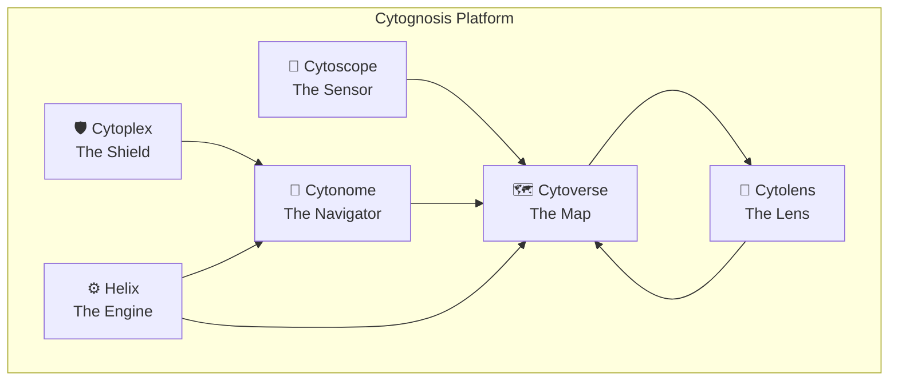

# Naming Resolution: Domain Verticals, Cytoplex, and Cytolens

> **Status**: Draft (awaiting user review)
> **Date**: 2026-05-25
> **Author**: @antigravity
> **Audience**: Founder, engineering leads
> **Tags**: `naming`, `branding`, `architecture`, `domain-verticals`

## TL;DR

- **Psych over Neuro for product names**: `cytos[psych]` extra, products = **Psychoverse** / **Psychoscope**
- **Metabolism**: `cytos[metab]` extra, products = **Metaboloverse** (collision-safe) / **Metaboscope**
- **Endocrine**: `cytos[endocrine]` extra, products = **Hormoverse** / **Hormoscope** (from Greek *hormōn*)
- **CAP → Cytoplex**: From Latin *plexus* (braided network). The Shield.
- **CytoExplorer → Cytolens** (recommended): The Lens through which you view the Cytoverse. Alternatives: Cytoatlas, Cytosight.

---

## 1. Domain Vertical Naming

> [!IMPORTANT]
> The user proposes using `psych` (not `neuro`) as the domain extra, with `psychoverse`/`psychoscope` as product names. This reverses the earlier ADR-005 decision that favored `neuros`.

### 1.1 Psych vs. Neuro

| Criterion | psych- (ψυχή = mind/soul) | neuro- (νεῦρον = nerve) |
|-----------|--------------------------|------------------------|
| **Scope** | Holistic: mind, cognition, behavior, consciousness | Reductionist: nervous system hardware |
| **Alignment with Cytognosis** | Whole-person health; intercepting disease at the experiential level | Biological substrate; data-first |
| **Product naming** | Psychoverse, Psychoscope | Neuroverse, Neuroscope |
| **Founder resonance** | 37-year neuropsychiatric diagnostic odyssey | Neuroscience background |
| **Connotation risk** | "psycho-" as prefix in compounds is standard medical usage (psychotherapy, psychometrics, psychophysiology) | None |
| **Package naming** | cytos[psych] ✅ | cytos[neuro] ✅ |
| **If graduated** | ⚠️ "psychos" collides on PyPI + catastrophic English connotation | "neuros" is clean |

**Resolution**: Use `psych` for the **package extra** and `Psycho-` for **product names**. If the module ever graduates to a standalone package, use `cytopsych` (not `psychos`). The code-level imports can remain `cytos.neuro.*` for technical clarity while the user-facing product names use the more holistic `Psycho-` prefix.

> [!NOTE]
> **Why is "psycho-" as a prefix OK?**
> The negative connotation of "psycho" only exists in isolation (as a noun or adjective). As a combining form/prefix, it's universally understood as "relating to the mind" in medical and scientific contexts: psychotherapy, psychosomatic, psychopharmacology, psychometrics. No health professional would mistake "Psychoscope" for anything other than "instrument for viewing the mind."

### 1.2 Metabolism: Alternatives to metabolo-

The user correctly identifies that `metabolo-` is too long (5 syllables as a prefix). The shorter `metabo-` is preferred.

| Option | -verse | -scope | Collision? | Assessment |
|--------|--------|--------|------------|------------|
| **metabo-** | Metaboverse | Metaboscope | ⚠️ Metaboverse is a published viz tool (Cell Rep Methods, 2023) | Best prefix, but -verse collides |
| **metabolo-** | Metaboloverse | Metaboloscope | ✅ None | Collision-safe but too long |
| **tropho-** (nourishment) | Trophoverse | Trophoscope | ✅ None | Too obscure, wrong semantic frame |
| **zymo-** (enzyme/ferment) | Zymoverse | Zymoscope | ✅ None | Too narrow (enzymes only) |

**Resolution**:
- Extra: `cytos[metab]`
- Package if graduated: `metabos`
- Products: **Metaboscope** ✅ (no collision) + **Metaboloverse** (5 syllables, but collision-safe) OR accept **Metaboverse** (the published tool is very niche, low confusion risk)

> [!WARNING]
> The Metaboverse collision is with a small academic visualization tool, not a commercial product. The risk is low, but for maximum safety, use the full `Metaboloverse` form.

### 1.3 Endocrine/Hormonal: New Vertical

The user wants a separate endocrine vertical. Key challenge: "endoscope" is one of the most recognized medical instruments in the world.

| Root | Origin | -verse | -scope | Collision? |
|------|--------|--------|--------|------------|
| **endo-** | Greek *endon* (within) | Endoverse | ❌ **Endoscope** = collision | Unusable for -scope |
| **hormono-** | Greek *hormōn* (impulse) | Hormonoverse | Hormonoscope | Too long |
| **hormo-** | Shortened *hormōn* | **Hormoverse** | **Hormoscope** | ✅ None |
| **crino-** | Greek *krinein* (secrete) | Crinoverse | Crinoscope | Too obscure |

**Resolution**:
- Extra: `cytos[endocrine]`
- Package if graduated: **hormos** (from Greek *hormōn* = "impulse, stimulus"; also means "necklace/chain" in Greek)
- Products: **Hormoverse** ✅ + **Hormoscope** ✅

> [!TIP]
> The Greek word *hormōn* (ὁρμῶν) literally means "setting in motion." This aligns beautifully with Cytognosis's mission of detecting health changes *before* they manifest. Hormones are the body's signaling system that sets biological processes in motion.

### 1.4 Microbiology: Confirmed

User confirmed `microbio-` works. Products: **Microbioverse**, **Microbioscope**. "Not the sexiest branding-wise, but works."

### 1.5 Disease-Area Verticals (Oncology)

> [!NOTE]
> The user asks whether disease-area names like `oncoverse`/`oncoscope` break the naming convention (which is system-based, not disease-based).

**Assessment**: The naming convention is `{domain}-verse`, where domain can be a **biological system** (neuro, cardio, immuno) OR a **disease area** (onco). Oncology IS a coherent domain with its own data types, models, and analysis patterns. The pattern is not broken; it's extended.

**Collision**: "Oncoverse" has a minor collision with a Romanian oncology initiative. Monitored, with `cyto-oncoverse` as fallback.

### 1.6 Updated Naming Matrix

| System | Root | Extra | Package (grad.) | -verse | -scope | Status |
|--------|------|-------|-----------------|--------|--------|--------|
| **Core** | cyto- | *(core)* | cytos | Cytoverse | Cytoscope | ✅ Established |
| **Neuro/Mental** | psych- | psych | cytopsych* | **Psychoverse** | **Psychoscope** | 🔄 Updated |
| **Immune** | immuno- | immune | immunos | Immunaverse | Immunoscope | ✅ From naming doc |
| **Cancer** | onco- | onco | oncos | Oncoverse | Oncoscope | ✅ From naming doc |
| **Metabolism** | metabo- | metab | metabos | Metaboloverse† | Metaboscope | 🔄 Updated |
| **Endocrine** | hormo- | endocrine | hormos | **Hormoverse** | **Hormoscope** | 🆕 New |
| **Microbial** | microbio- | microbio | microbios | Microbioverse | Microbioscope | ✅ Confirmed |
| **Cardiac** | cardio- | cardio | cardios | Cardioverse | Cardioscope‡ | ⏳ Reserved |
| **Physiology** | physio- | physio | physios | Physioverse | Physioscope | ⏳ Reserved |

\* If graduated; otherwise stays as `cytos[psych]`
† Collision-safe form of Metaboverse (published tool, 2023)
‡ Minor collision with medical device brand

---

## 2. CAP → Cytoplex

> [!IMPORTANT]
> The user proposes renaming CAP (Compassionate AI Protocol) to either **Cytoplex/Cytoplexus** or **Cytonectin**. Research conclusively eliminates Cytonectin.

### 2.1 Cytonectin: Eliminated

**Nectin is a major active drug target.** The nectin protein family (Nectin-1 through Nectin-4) are cell adhesion molecules. Nectin-4 is specifically the target of **enfortumab vedotin (Padcev)**, an FDA-approved antibody-drug conjugate for bladder cancer with $3B+ annual revenue. Multiple companies (Pfizer/Seagen, Bicycle Therapeutics, Aktis Oncology) are in active clinical trials targeting Nectin-4.

Using "Cytonectin" for a safety protocol would cause severe confusion with an established and actively researched protein family.

### 2.2 Cytoplex: Recommended ✅

| Criterion | Assessment |
|-----------|-----------|
| **Etymology** | *kytos* (cell) + *plexus* (braid, network) = "cellular safety network" |
| **Biological resonance** | Anatomical plexuses (brachial, solar, choroid) are nerve networks. Safety as a woven neural net. |
| **Syllable count** | 3 (cy-to-plex), matches Cytoverse/Cytoscope/Cytonome |
| **Collision check** | ✅ No biotech or product collision |
| **Connotation** | Interwoven, structural, foundational. Evokes "complex" (sophisticated). |
| **Package name** | `cytoplex` (pip install cytoplex) |
| **CLI** | `cytoplex validate`, `cytoplex guard` |
| **Guard class** | `PlexGuard` (replacing `CapLiteGuard`) |

### 2.3 Alternative Considered: Greek/Latin Guard Roots

| Name | Root | Assessment |
|------|------|-----------|
| Aegis | Greek *aigis* (divine shield) | Overused in AI safety (AEGIS frameworks, datasets) |
| Phylax | Greek *phylax* (guard/sentry) | Strong but hard to pronounce |
| Aspis | Greek *aspis* (shield) | Conflicts with snake genus |
| Custos | Latin *custos* (guardian) | Too formal, not "Cyto-" family |

**Verdict**: **Cytoplex** is the strongest option. It belongs to the `Cyto-` family, has the right syllable count, and the "braided safety net" metaphor is uniquely compelling for a health AI safety protocol.

### 2.4 Renaming Impact

```
cap/                    → cytoplex/
CapLiteGuard            → PlexGuard
CAPGuard protocol       → CytoplexGuard
cytognosis-cap package  → cytoplex
CAP v0.1 docs          → Cytoplex docs
```

---

## 3. CytoExplorer → Cytolens (Recommended)

> [!IMPORTANT]
> CytoExplorer is the placeholder name for the knowledge graph visualization and search tool built on Sigma.js + Meilisearch. The user wants to finalize the product name.

### 3.1 Candidates

| Name | Etymology | Metaphor | Syllables | Collision | Assessment |
|------|-----------|----------|-----------|-----------|------------|
| **Cytolens** | *kytos* + lens | Focused viewing instrument | 3 | ✅ None | **Recommended**. Completes the GPS metaphor. |
| **Cytoatlas** | *kytos* + *atlas* | Comprehensive reference map | 4 | ⚠️ "Atlas" generic | Strong alternative. Evokes browsable reference. |
| **Cytosight** | *kytos* + sight | Vision, insight | 3 | ⚠️ Sounds like "Cytosite" | Good meaning but phonetic ambiguity |
| **Cytonexus** | *kytos* + *nexus* | Connection hub | 4 | ⚠️ Google Nexus echo | Too generic/tech for bio brand |
| **Cytograph** | *kytos* + *graph* | Cell graph | 3 | ⚠️ Obscure medical instrument | Collision with historical term |

### 3.2 Why Cytolens

**The GPS metaphor completion:**

| Component | Role | Metaphor |
|-----------|------|----------|
| Cytoverse | AI health mapping system | **The Map** |
| Cytoscope | Programmable biosensors | **The Sensor** |
| Cytonome | On-device causal AI navigator | **The Navigator** |
| Cytoplex | AI safety/ethics protocol | **The Shield** |
| **Cytolens** | Knowledge graph explorer | **The Lens** |
| Helix | Foundation AI model | **The Engine** |

You look *through* the Lens to see the Map. The Lens focuses, magnifies, and reveals structure in the data. It connects to the "light-in-darkness" design motif (lenses focus light) and the scientific instruments motif (microscope lens, telescope lens).

### 3.3 Cytoatlas as Alternative

If the user prefers a more "authoritative reference" feel over "focused instrument," Cytoatlas is the strongest alternative. An atlas is comprehensive, browsable, and authoritative. The Human Cell Atlas project uses "atlas" to great effect.

---

## 4. Updated Platform Architecture



---

## 5. Action Items

### Immediate (This Sprint)
- [ ] Update `org/plans/research/domain-vertical-naming.md` with revised matrix
- [ ] Update `org/plans/architecture-decisions.md` ADR-005 with psych- note
- [ ] Reserve `cytoplex` on PyPI (placeholder package)
- [ ] Reserve `cytolens` on PyPI (placeholder package)
- [ ] Add `hormoverse.cytognosis.org` to DNS reservation list
- [ ] Update branding skill references with new names

### Near-Term (Phase 3)
- [ ] Rename CAP directory/module to cytoplex across all repos
- [ ] Update CapLiteGuard → PlexGuard
- [ ] Rename CytoExplorer references to Cytolens
- [ ] Update Phase 3A/3B architecture plans with new names

### Deferred
- [ ] Metabolism -verse product name: accept Metaboloverse or risk Metaboverse
- [ ] Endocrine package graduation timing
- [ ] CLI aliases for long domain names

---

## Appendix: Pronunciation Guide

| Name | IPA | Stress |
|------|-----|--------|
| Psychoverse | /ˈsaɪ.koʊ.vɜːrs/ | **PSY**-co-verse |
| Psychoscope | /ˈsaɪ.koʊ.skoʊp/ | **PSY**-co-scope |
| Hormoverse | /ˈhɔːr.moʊ.vɜːrs/ | **HOR**-mo-verse |
| Hormoscope | /ˈhɔːr.moʊ.skoʊp/ | **HOR**-mo-scope |
| Cytoplex | /ˈsaɪ.toʊ.plɛks/ | **CY**-to-plex |
| Cytolens | /ˈsaɪ.toʊ.lɛnz/ | **CY**-to-lens |
| Metaboloverse | /mɛˌtæb.oʊˈloʊ.vɜːrs/ | me-TAB-o-**LO**-verse |
| Metaboscope | /mɛˈtæb.oʊ.skoʊp/ | me-**TAB**-o-scope |

## Appendix: Collision Registry

| Name | Type | Details | Mitigation |
|------|------|---------|------------|
| Metaboverse | Published tool | Cell Reports Methods, 2023 | Use Metaboloverse (full form) |
| Endoscope | Medical instrument | Universal recognition | Use Hormoscope instead |
| Cardioscope | Medical device | Commercial product | Monitor; Cardioview as fallback |
| Oncoverse | Initiative | Romanian oncology network | Monitor; cyto-oncoverse as fallback |
| Nectin | Protein family | FDA-approved drug target (Padcev) | ❌ Eliminated Cytonectin |
| Psychos | English word | Negative connotation + PyPI collision | Use cytopsych if graduated |
