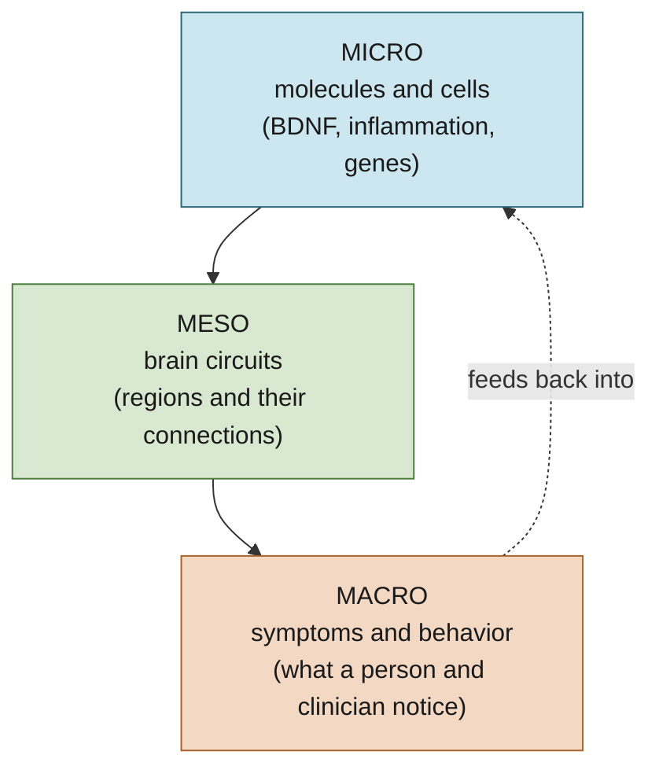
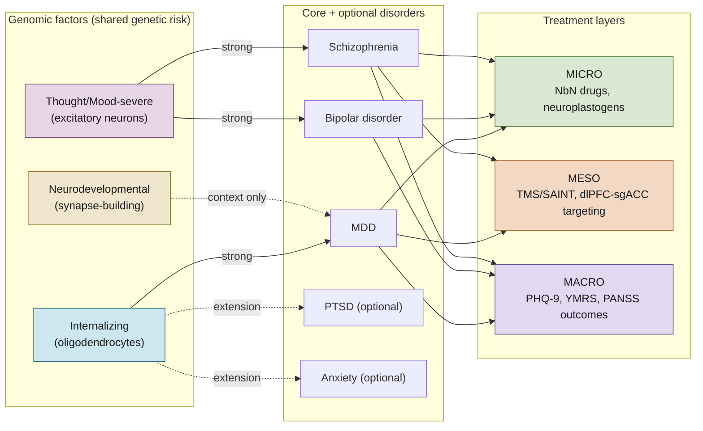

# Mental Health Biotypes: A Friendly Guide

> **Status**: Active
> **Date**: 2026-07-16
> **Author**: Shahin Mohammadi
> **Audience**: Shahin, internal team
> **Tags**: `research`, `biotyping`, `neuro`
> **Reading time**: about 12 minutes

## BLUF

A **biotype** is a biologically defined subgroup of a mental health condition, built from measurable
signals in the brain and body instead of just a symptom checklist. We already have solid evidence
that depression, bipolar disorder, and schizophrenia can each be broken into a handful of these
subgroups, and that the subgroups line up across three scales, molecules, brain circuits, and
symptoms, in ways that point toward better-matched treatment. Nothing here is a cure or a
breakthrough; it is a map that is getting more precise over time.

**If you only read one thing:** Section 2 (the three scales) and Section 4 (the disorder table) are
the load-bearing parts; everything else is context and vocabulary support.

---

## 1. What is a biotype, in plain language?

Think about "fever." A fever is one symptom, but it can come from a virus, a bacterial infection, an
autoimmune flare, or an infected wound. Same symptom, different underlying cause, different
treatment. **A biotype is the underlying cause layer for a mental health symptom.**

Right now, psychiatry mostly diagnoses by symptom checklist (the DSM). Two people with the same
"major depression" diagnosis can have almost opposite biology, one with a low-reward, flat-affect
profile and one with a high-anxiety, high-rumination profile. Biotyping is the effort to find and
name those underlying groups so treatment can target the actual mechanism, not just the label.

**Key term, bolded once:** we call this move from "one label" to "many measurable subtypes"
**dimensional psychiatry**. Instead of a yes/no box, each person sits somewhere on a set of
continuous dials.

---

## 2. The three scales: micro, meso, macro

Biology shows up at different zoom levels. We organize everything into three scales, borrowed
straight from how a doctor might work up any illness: cells and molecules first, then organ-level
circuits, then the whole-person symptom picture.

| Scale | Plain-language meaning | Example signal | Example tool to measure it |
|---|---|---|---|
| **Micro** (molecular / cellular) | What's happening inside cells and in blood chemistry | Low BDNF (a "plant food" for brain connections); inflammation markers like CRP | Blood draw, postmortem tissue study |
| **Meso** (connectomic / circuit) | How brain regions talk to each other | Two brain regions that are usually "out of sync" becoming more in sync, or vice versa | Brain scan (fMRI), EEG cap |
| **Macro** (symptom / phenotype) | What the person and clinician actually observe | Low mood, poor sleep, racing thoughts | Questionnaires (PHQ-9, GAD-7, PANSS) |

**Why this matters:** a treatment can act at any of the three scales. A drug acts at the molecular
level, brain stimulation acts at the circuit level, and therapy acts most directly at the symptom
level, but a good biotype map shows how a change at one scale should show up at the others. That
alignment is what makes a biotype useful instead of just descriptive.

---

## 3. The genomic-factor idea, simplified

Genes do not cause "depression" or "schizophrenia" one disorder at a time. A large 2025 study
(Grotzinger and colleagues, *Nature*, using data on more than a million people across 14 psychiatric
conditions) found that most of the shared genetic risk clusters into about **five broad factors**,
not fourteen separate piles. Think of these factors as five overlapping "genetic weather systems"
that different disorders sit inside.

| Factor (plain name) | Disorders mostly inside it | The cell type it leans on | One-line intuition |
|---|---|---|---|
| **Thought/Mood-severe** | Schizophrenia, bipolar disorder | Excitatory neurons (the brain's "gas pedal" cells) | Shared risk for psychosis and mania |
| **Internalizing** | Depression, PTSD, anxiety | Oligodendrocytes (the brain's "insulation" cells) | Shared risk for low mood, fear, worry |
| **Neurodevelopmental** | Autism, ADHD, Tourette | Synapse-building programs in developing neurons | Shared risk for early-life brain wiring differences |
| *(extended)* Compulsive/eating | OCD, anorexia, Tourette | Synapse and interneuron genes | Shared risk for rigid, repetitive patterns |
| *(extended)* Substance-use | Alcohol, opioid, nicotine, cannabis use disorders | Reward and metabolism genes | Shared risk across addictive substances |

We use the first three as the core scope for the figure in this dossier (they cover our three flagship
disorders below) and treat the other two as available extensions, not required additions.

---

## 4. Three disorders, one shared map: MDD, BD, SZ

| | Major depression (MDD) | Bipolar disorder (BD) | Schizophrenia (SZ) |
|---|---|---|---|
| **Genomic factor home** | Internalizing | Thought/Mood-severe (shared with SZ) | Thought/Mood-severe (shared with BD) |
| **A micro-level story** | Low BDNF that recovers as mood improves; inflammation markers up in a subset | BDNF drops in both mania and depression, recovers in stable periods | Excitatory-neuron and interneuron signaling changes; strongest inflammation-adjacent signal of the three |
| **A meso-level story** | Two brain regions (subgenual ACC and dorsolateral prefrontal cortex) lose their normal "opposite" relationship; this predicts who responds to brain stimulation | Similar circuit disruption to depression during depressive episodes, with additional reward-circuit swings during mania | Thalamus loses its normal balance between "sensory" and "thinking" brain regions |
| **A macro-level story** | Measured by PHQ-9; low mood, low interest, sleep and appetite change | Measured by YMRS (mania) and depression scales; mood swings between poles | Measured by PANSS; hallucinations, disorganized thought, reduced motivation |
| **A treatment example tied to biology** | Targeted brain stimulation (see Section 5) for people with the strongest "opposite circuit" signature | Mood stabilizers that steady the excitatory-neuron signaling | Antipsychotics that dial down dopamine signaling in the reward circuit |

**On PTSD and anxiety:** both fit the same Internalizing genomic factor as depression and share much
of its circuit story (an overactive fear-detection region, the amygdala, not being calmed down
properly by the prefrontal cortex). We treat them as optional extensions of the same map rather than
separate work.

---

## 5. How biology connects to treatment: the three layers again, with real examples

This is the same micro/meso/macro idea from Section 2, but now populated with real treatments so it
feels concrete rather than abstract.

| Layer | What a treatment looks like | Real example |
|---|---|---|
| **Micro** | A molecule that restores a specific signaling pathway | Ketamine and psilocybin both work partly by binding a receptor called TrkB, which restores the brain's ability to grow new connections (its "plasticity"). This is the mechanism behind a modern drug-naming system called **NbN** (Neuroscience-based Nomenclature), which classifies medicines by what they do biologically instead of by old category names like "antidepressant." |
| **Meso** | A brain-stimulation protocol aimed at a specific circuit | **SAINT** (an accelerated TMS protocol) targets the exact spot in the prefrontal cortex that is most "out of sync" with the subgenual ACC in each person; in trials, about 79 percent of people with hard-to-treat depression went into remission. This only works because we know the circuit-level biotype to aim at. |
| **Macro** | A symptom scale used to check whether treatment is working | PHQ-9 for depression, GAD-7 for anxiety, PANSS for psychosis. These are the "did it work" instruments, and they map back onto the same genomic factors (Section 3) through a formal crosswalk we already have (RDoC and HiTOP systems, explained below). |

**A note on the ARPA-H EVIDENT program (context, not a pitch):** EVIDENT is a federal program
($139.4M, announced April 2026) that funds exactly this kind of work, objective biomarkers for
matching people to neuroplastogens (drugs like ketamine and psilocybin), brain stimulation, and
digital therapeutics. Our biotype map is the mechanistic backbone for that kind of measurement.

---

## 6. Disorders on the genomic-factor map (simplified)

This diagram shows how the three core disorders (plus the two optional extensions) relate to the
genomic factors and connect down to real treatment targets. It is a simplified relationship diagram,
not a precise statistical plot; the formal, plottable version lives in `figures/universal_dimensional_map_v1.mmd`.

---

## 7. Jargon glossary (every term used above, explained once)

| Term | Plain meaning |
|---|---|
| **BDNF / TrkB** | BDNF is like plant food for brain connections; TrkB is the receptor it plugs into to make new connections grow |
| **RDoC** | A framework from NIMH that organizes mental health by function (threat response, reward, thinking) instead of by diagnosis label |
| **HiTOP** | A framework built from statistics on symptom surveys that groups conditions into spectra (like "Internalizing" for depression/anxiety/PTSD) |
| **Crosswalk** | A lookup table that lets you translate between two systems, in our case between DSM symptom checklists, RDoC, and HiTOP |
| **Connectome / connectomic** | The map of how brain regions are wired to and talk with each other |
| **dlPFC, sgACC, amygdala, DMN** | Specific brain regions; see `NEUROANATOMY_GUIDE.md` for one-paragraph plain-language cards on each |
| **NbN** | Neuroscience-based Nomenclature, a system that names psychiatric drugs by biological mechanism instead of old category names |
| **Neuroplastogen** | A substance (ketamine, psilocybin, and similar) that restores the brain's capacity to form new connections |
| **Confidence rating (HIGH/MEDIUM/LOW)** | How well-replicated a finding is; HIGH means it has shown up across multiple independent studies, not just one |

---

## 8. What is genuinely still open (said plainly)

- Some famous early biotype findings did not hold up when other labs tried to repeat them (a
  well-known 2017 four-biotype depression paper failed to replicate in 2019). We treat that as a
  reminder to trust the well-replicated findings more than the exciting ones, not as a reason to stop.
- Most micro-level (molecular) findings are strongest as a group average, not yet as a reliable
  single-person test. This is an active area, not a solved one.
- The mapping between "textbook brain region names" and "the exact functional area a study found" is
  sometimes approximate. That is flagged everywhere it happens in the underlying canon docs.
- This document intentionally leaves out one piece of Cytognosis's own confidential science (a
  genome-based method for measuring these axes without a brain scan). That piece stays internal and
  is not part of this educational or the grant-ready document.
