# Addendum: Four Deep Dives
### Companion to `multimodal_coembedding_review_2025_2026.md`

> **Topics:**
> 1. Is FGW really necessary when patients are paired? Alternatives for comparing pairwise distance matrices on the same objects.
> 2. Cross-attention done right for foundation models.
> 3. Mixture-of-Experts transformers with modality-specific experts.
> 4. Multimodal causal representation learning and SCMs.

---

## Q1. FGW vs the right tool when patients are already paired

### 1.1 The sharp question
You correctly noticed the tension: FGW (and GW more broadly) is designed to *discover* correspondences between distributions in different spaces. When the correspondence is **already known** (same patient across modalities), you are paying for machinery you do not need. The "transport plan" you would solve for has a known answer (the identity permutation, up to noise).

So the right question becomes: **how do I compare or align two pairwise-distance/Gram matrices defined on the same set of objects?**

This is exactly the setup of **Representational Similarity Analysis (RSA)** in cognitive neuroscience and **Centered Kernel Alignment (CKA)** in deep learning. The good news: there is a rich, simple toolbox here, and you almost never need GW.

### 1.2 The taxonomy of "compare two distance matrices on same objects"

```mermaid
flowchart TB
    Root["You have D1, D2 (or K1, K2) on same N patients"]:::root

    Root --> A["A. Direct distance/kernel comparison"]:::fam
    Root --> B["B. Embedding-level alignment"]:::fam
    Root --> C["C. Graph-Laplacian regularization"]:::fam
    Root --> D["D. Statistical correlation tests"]:::fam
    Root --> E["E. OT/GW (only when you want extras)"]:::fam

    A --> A1["Frobenius: ||D1-D2||_F^2"]
    A --> A2["Centered Kernel Alignment (CKA)"]
    A --> A3["RV coefficient"]
    A --> A4["HSIC (kernel independence)"]
    A --> A5["Spectral / eigenvalue spectrum match"]

    B --> B1["Procrustes (orthogonal alignment)"]
    B --> B2["Generalized Procrustes (>2 views)"]
    B --> B3["CCA / Deep CCA / KCCA"]
    B --> B4["MUSE / shared Laplacian eigenvectors"]

    C --> C1["Cross-Laplacian regularizer"]
    C --> C2["SNF-style cross-diffusion"]
    C --> C3["Manifold alignment penalty"]

    D --> D1["Mantel test"]
    D --> D2["Distance correlation (dCor)"]
    D --> D3["Partial Mantel (controlling covariates)"]

    E --> E1["GW barycenter (consensus computation)"]
    E --> E2["Unbalanced GW (handle partial pairing)"]
    E --> E3["FGW only when correspondence noisy"]

    classDef root fill:#1f2937,stroke:#111827,color:#fff,font-weight:bold
    classDef fam fill:#3b82f6,stroke:#1e40af,color:#fff
```

### 1.3 The methods, ranked for your use case

#### A. Centered Kernel Alignment (CKA), the modern default

Given Gram matrices $K_1 = X_1 X_1^T$ and $K_2 = X_2 X_2^T$ (or RBF kernels) on the same $N$ patients:

$$\text{CKA}(K_1, K_2) = \frac{\text{HSIC}(K_1, K_2)}{\sqrt{\text{HSIC}(K_1, K_1) \cdot \text{HSIC}(K_2, K_2)}}$$

where HSIC is the Hilbert-Schmidt Independence Criterion:
$$\text{HSIC}(K_1, K_2) = \frac{1}{(N-1)^2} \text{tr}(K_1 H K_2 H), \quad H = I - \tfrac{1}{N}\mathbf{1}\mathbf{1}^T$$

| Property | Value |
|---|---|
| Range | [0, 1] |
| Invariance | Orthogonal transforms, isotropic scaling |
| Sensitivity to dim | None (works across different d's) |
| Differentiable | Yes (great as a loss) |
| Cost | $O(N^2)$ per pair |
| What it captures | Whether the *relational geometry* matches |

**Use as a loss:** $\mathcal{L}_{\text{CKA}} = -\text{CKA}(K^{(m)}_{\text{latent}}, K^{(m)}_{\text{input}})$ for each modality, plus $-\text{CKA}(K^{(m)}_{\text{latent}}, K^{(m')}_{\text{latent}})$ between latent representations across modalities to encourage cross-modal geometric agreement.

This is **the closest thing to "FGW for paired data"** while being trivial to implement.

#### B. RV coefficient (the original, Robert and Escoufier 1976)

$$\text{RV}(X_1, X_2) = \frac{\text{tr}(X_1 X_1^T X_2 X_2^T)}{\sqrt{\text{tr}((X_1 X_1^T)^2) \cdot \text{tr}((X_2 X_2^T)^2)}}$$

CKA with linear kernels is essentially RV after centering. RV has decades of use in chemometrics and ecology. Statistically interpretable.

#### C. Distance correlation (Székely et al., 2007)

Like Pearson correlation but on distance matrices. Detects non-linear dependencies. Zero iff independent (unlike Pearson).

$$\text{dCor}^2(X, Y) = \frac{\nu^2(X, Y)}{\sqrt{\nu^2(X, X) \nu^2(Y, Y)}}$$

where $\nu^2$ is the squared distance covariance computed from doubly-centered distance matrices.

| When to prefer dCor over CKA |
|---|
| You want a statistical test (it has known asymptotics) |
| You suspect non-linear dependencies that linear/RBF kernels miss |
| You want a single scalar of "are these views informative about each other?" |

#### D. Procrustes alignment (when you can embed to a common dim)

Embed each modality to dim $d$ first (e.g., via per-modality VAE or PCA), then solve:
$$\min_{R \in O(d)} \| Z_1 - Z_2 R \|_F^2$$

Closed form via SVD of $Z_1^T Z_2$. Generalized Procrustes extends to $M > 2$ views.

| Pros | Cons |
|---|---|
| Closed-form, fast | Requires same latent dim |
| Gives you an explicit alignment $R$ | Only handles rotations/reflections (rigid) |
| Differentiable variants exist | Less powerful than CKA at capturing non-rigid distortions |

#### E. Graph Laplacian / SNF-style cross-regularization

Build a kNN graph $G^{(m)}$ per modality. Use the Laplacian $L^{(m)}$ as a regularizer pulling the latent to be smooth on each graph:
$$\mathcal{L}_{\text{Lap}} = \sum_m \text{tr}(Z^T L^{(m)} Z) = \sum_m \sum_{ij} W^{(m)}_{ij} \| z_i - z_j \|^2$$

This is **cheap, differentiable, and strong**. SNF first fuses the graphs (cross-diffusion) and then regularizes a single $L^{\text{fused}}$, which is even better.

#### F. Mantel test (when you want a p-value, not a loss)

Pearson correlation between the upper triangles of $D_1$ and $D_2$, with significance computed by permutation. Useful for **sanity-checking** that two modalities have non-trivially correlated patient-geometry before you start optimizing.

#### G. Frobenius norm of (centered) distance/kernel matrices

The simplest: $\|H D_1 H - H D_2 H\|_F^2$. Works, but unbounded and not scale-invariant. CKA is the normalized version. Use Frobenius for ablations and CKA for production.

### 1.4 Side-by-side: what changes if you have known pairing

| Setting | OT/GW machinery needed? | Recommended tool |
|---|---|---|
| **Paired patients, same scale modalities** | No | CKA, Procrustes, Laplacian reg |
| **Paired patients, modalities in different spaces** | No | **CKA + cross-Laplacian** |
| **Unpaired (SCOT, single-cell)** | Yes | GW / FGW |
| **Partially paired (mosaic cohort)** | Sometimes | Unbalanced FGW for the unpaired part, CKA for the paired part |
| **You want a consensus that is itself a distribution** | Yes | OT/GW barycenter |
| **You want to pull each modality toward a shared latent** | No | Laplacian reg + InfoNCE |
| **Modalities have very different cardinalities (e.g., a connectome graph vs gene expression)** | Yes (intra-domain dist matters) | CKA on patient-level summary, FGW only if you go to node-level alignment |

### 1.5 So when *do* you actually want GW/FGW?

You want full GW machinery only in these cases:
1. **Computing barycenters in incomparable spaces.** GW barycenter gives you a *distribution* on a structured space, not just an embedding. If your "consensus" should itself live on a graph or simplex with structure, GW barycenter is the right tool.
2. **Sub-patient correspondence.** If you want cell-level or region-level alignment within a patient (e.g., aligning cells across scRNA and scATAC for the same patient), GW works at that finer granularity.
3. **Robust to permutation noise.** If pairing is approximate (data quality, deduplication artifacts), unbalanced FGW handles partial misalignment gracefully.

For the patient-level co-embedding you described, **CKA plus cross-Laplacian regularization replaces FGW** with no real loss. This simplifies the architecture meaningfully.

### 1.6 Updated recommendation for your stack

**Replace** the FGW barycenter regularizer in Section 7 of the main doc with:

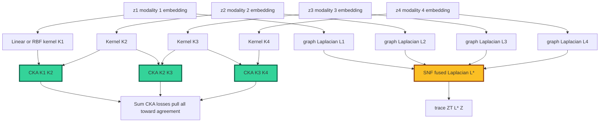

**New total loss:**
$$\mathcal{L} = \mathcal{L}_{\text{recon}} + \beta \mathcal{L}_{\text{KL}} + \lambda_c \mathcal{L}_{\text{InfoNCE}} + \lambda_g \big( \underbrace{-\sum_{m \ne m'} \text{CKA}(K^{(m)}, K^{(m')})}_{\text{geometry alignment}} + \underbrace{\text{tr}(Z^T L^{\text{SNF-fused}} Z)}_{\text{manifold smoothness}} \big) + \lambda_a \mathcal{L}_{\text{archetypal}}$$

Keep GW *only* for the barycenter computation if you want a consensus that is itself a graph/distribution. For everything else, CKA plus Laplacian is faster, simpler, and just as principled.

---

## Q2. Cross-Attention Done Right for Foundation Models

### 2.1 The core patterns
There are five canonical ways cross-attention shows up in modern multimodal foundation models. Pick by your compute budget and modality count.

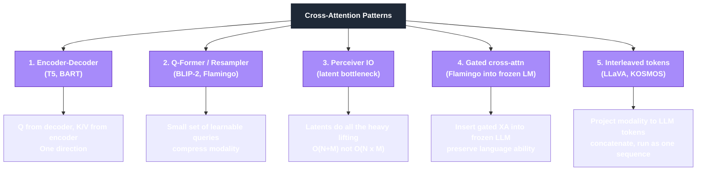

### 2.2 Why cross-attention is hard at scale
The naive cross-attention between modality $a$ ($N$ tokens) and modality $b$ ($M$ tokens) has compute and memory of $O(NM \cdot d)$. For a patient foundation model where:
- scRNA: $\sim 10^4$ cells × $10^4$ genes
- Connectome: $\sim 10^3$ regions, $\sim 10^6$ edges
- Imaging: $\sim 10^4$ patches per scan
- Multiple visits per patient

You **cannot** do dense cross-attention between all of these. The whole game is **bottlenecking**.

### 2.3 Pattern 1: Q-Former / Perceiver Resampler, your bread and butter

This is the most copied design in 2024-2025 multimodal models. A small set of learnable query tokens (typically 32 to 256) cross-attends to the modality embeddings, producing a fixed-size compressed representation.

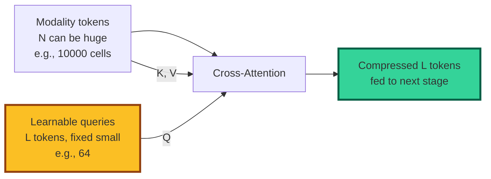

**Properties:**
- Compute: $O(L \cdot N \cdot d)$ instead of $O(N^2 \cdot d)$.
- Linear in modality size $N$.
- $L$ controls the information bottleneck (force the model to compress).
- Works for any modality with enough tokens.

**Best examples to study:**
- **BLIP-2 Q-Former** (Li et al., ICML 2023): 32 learnable queries, two-stage training (representation learning then generation).
- **Flamingo Perceiver Resampler** (Alayrac et al., NeurIPS 2022): 64 latents per video frame.
- **Med-PaLM M** (Tu et al., 2023): adapts BLIP-2 style to medical imaging + clinical notes.
- **Masked Omics Modeling** (arXiv 2508.00969, 2025): Perceiver-based fusion of WSI patches + omics.

**Recipe for your patient foundation model:**

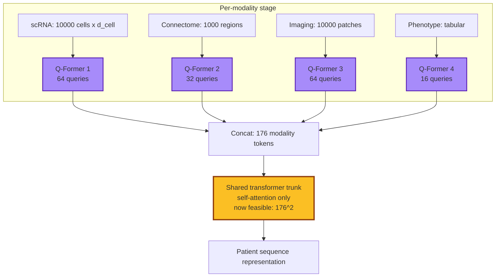

### 2.4 Pattern 2: Perceiver IO, the symmetric version

Same idea but the latents are **shared across modalities**. All modalities cross-attend into the same latent set; the latents then self-attend.

| Pros | Cons |
|---|---|
| Single shared latent set means natural fusion | Heavy on the latents (need to be expressive) |
| Linear in input size for any modality | Less modality-specific specialization |
| Excellent for "fuse anything" use cases | Worse at modality-specific generation |

**Use Perceiver IO when:** all modalities should be treated symmetrically, no clear primary modality, and you need to scale to many modalities.

**Use stacked Q-Formers when:** you have a clear primary modality (e.g., scRNA), you want modality-specific experts, or you want to bolt onto a frozen LLM trunk.

### 2.5 Pattern 3: Gated cross-attention into frozen backbone (Flamingo style)

When you want to attach a new modality to a *pretrained* LLM without destroying its language ability:

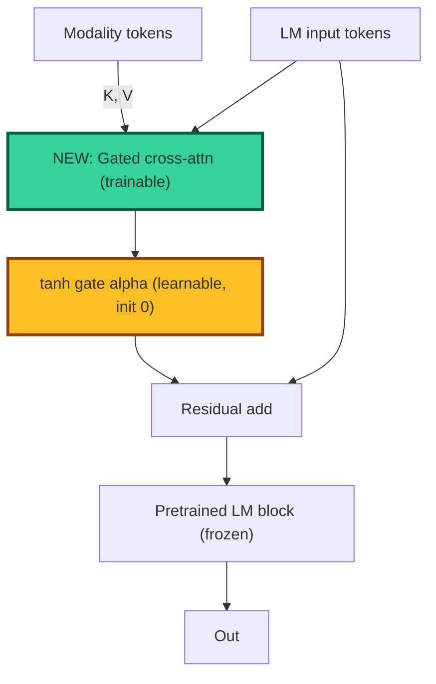

The **tanh gate initialized at zero** ensures the new layer starts as identity, so the LM's pretrained behavior is preserved at init. Training gradually opens the gate.

**Why this matters for biomedical foundation models:** you can take a pretrained model like LLaMA, BiomedLM, or Gemma and bolt on cross-attention to scRNA tokens (from scGPT/Geneformer), connectome tokens (from a GNN encoder), etc., **without retraining the language backbone**. Cheap, fast, surprisingly effective.

### 2.6 Pattern 4: Hierarchical cross-attention for long context

When a single modality is too big for one Q-Former pass (e.g., 100k cells per patient):

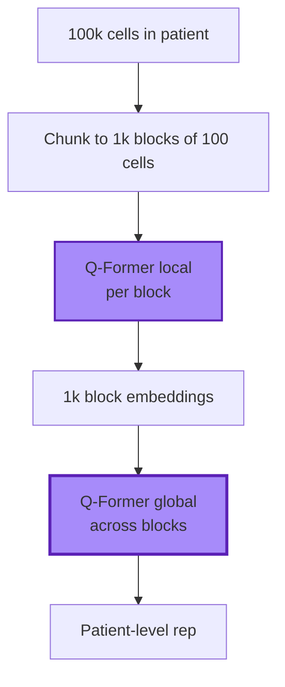

This is the **hierarchical perceiver** trick (Carreira et al., 2022) and shows up in long-video models, long-genome models (HyenaDNA, Caduceus), and scGPT scaling experiments.

### 2.7 Sparse/efficient attention to know

| Variant | Idea | When to use |
|---|---|---|
| **FlashAttention 2/3** | Memory-efficient exact attention | Always (2x to 4x speedup) |
| **Grouped-query attention (GQA)** | Multiple Q heads share K, V | LLM inference speedup |
| **Multi-query (MQA)** | One K, V for all Q heads | Memory-bound serving |
| **Sliding window (Mistral)** | Local + global tokens | Long context |
| **Linear / kernelized (Performer, Linformer)** | Approximate softmax | Very long sequences |
| **Mamba / SSM hybrid** | Replace some attention with state-space | Genomics (HyenaDNA, Caduceus) |

For your patient foundation model: **FlashAttention 2 is required**, **GQA is recommended**, and **hybrid Mamba/Transformer** may be the right call for the genomic modality where sequences are very long.

### 2.8 Cross-attention dos and don'ts for biology

| Do | Do not |
|---|---|
| Tokenize each modality with a domain-aware encoder first (Geneformer for scRNA, GNN for connectome, ViT for imaging) | Flatten a connectome adjacency matrix and feed to a vanilla Transformer (you destroy permutation invariance) |
| Use Q-Formers to compress to fixed token count per modality | Concat all raw tokens and hope self-attention figures it out |
| Train modality encoders separately first, then fuse | Train end-to-end from scratch unless you have $10^6$ samples |
| Add modality-type embeddings to all tokens | Rely on positional embeddings alone to distinguish modality |
| Use gated cross-attention if attaching to a pretrained LM | Fine-tune the whole LM to learn cross-modal from scratch |
| Use hierarchical cross-attention for long modalities | Naively chunk and average |
| Validate that each modality is actually attended to (attention rollout, ablations) | Trust that the model uses all modalities just because the loss decreased |

### 2.9 A reference architecture for "Patient Foundation Model"

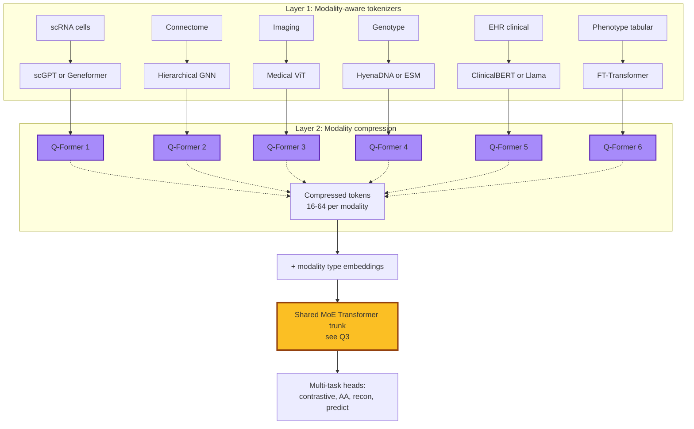

---

## Q3. Mixture-of-Experts Transformers with Modality-Specific Experts

### 3.1 Why MoE matters for multimodal

Vanilla Transformer FFN: every token sees the same FFN weights. **Modality-specific experts:** route tokens to FFNs based on which modality they came from (or have learned routing). Two payoffs:

1. **Parameter efficiency.** Total params can be $10\times$ a dense model with the same compute per token.
2. **Modality specialization.** A "scRNA expert" can become very good at scRNA token statistics without polluting language tokens.

### 3.2 The MoE landscape, organized

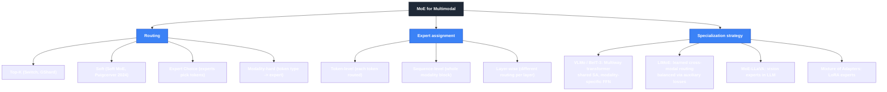

### 3.3 The two core patterns

#### Pattern A: Multiway Transformer (VLMo, BeIT-3), modality-as-expert

Self-attention is **shared**. FFN is **modality-specific** (each modality has its own FFN expert). Simple, hard routing by modality type.

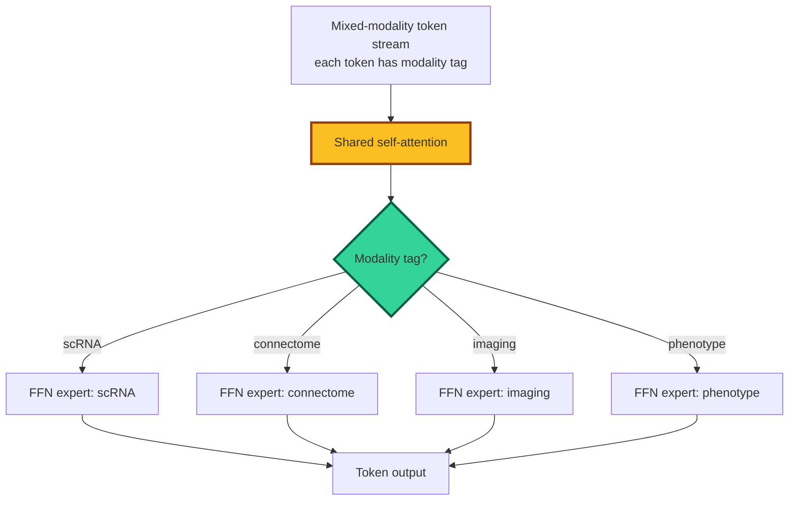

| Pros | Cons |
|---|---|
| Trivial to implement | No conditional cross-modal expertise |
| Each FFN specializes | Cannot learn that some scRNA tokens behave like phenotype tokens |
| Predictable compute | Wastes capacity if one modality dominates |
| Strong at vision-language | One-to-one modality:expert too rigid |

**This is what BeIT-3 and VLMo use, and it works.** Strong default for biomedical patient models.

#### Pattern B: LIMoE-style learned routing, content as expert

Add a router that **learns** which expert to send each token to, regardless of modality. Auxiliary losses balance modality usage.

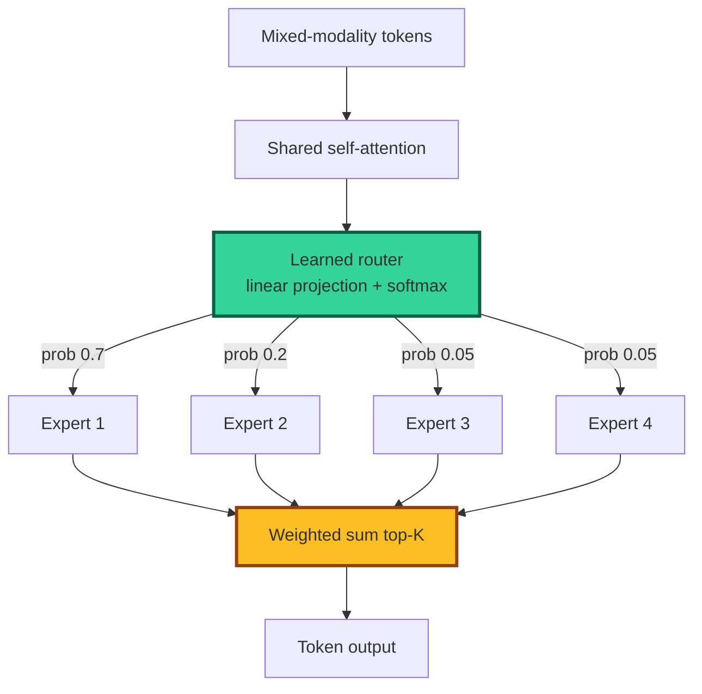

LIMoE (Mustafa et al., NeurIPS 2022) showed this works for vision+language, with experts naturally specializing to **content-aligned clusters** rather than modalities. Some experts handle "object-centric" tokens whether they come from images or text descriptions of objects.

| Pros | Cons |
|---|---|
| More flexible specialization | Routing instability without aux losses |
| Captures cross-modal concepts | Harder to interpret expert semantics |
| Can scale to many experts | Load balancing is tricky |

**The right move for biomedical patient FMs:** start with multiway (VLMo) for stability, then move to LIMoE-style with auxiliary load-balancing losses once data scale supports it.

### 3.4 Soft MoE (Puigcerver et al., ICLR 2024), the new default

Top-K routing has discontinuities and load-imbalance issues. **Soft MoE** uses fully differentiable soft routing via per-slot weighted averages:

$$\tilde{x}_s = \sum_n D_{ns} x_n, \quad y_n = \sum_s C_{ns} \text{Expert}_s(\tilde{x}_s)$$

where $D, C$ are softmax over tokens and slots respectively. Smooth, differentiable, and **outperforms top-K MoE in published benchmarks** with similar compute.

For your patient FM, **Soft MoE in the trunk** is likely better than top-K. Switch to Expert Choice (Zhou et al., NeurIPS 2022) if you need hard sparsity for inference cost.

### 3.5 Expert specialization for biology

Useful expert taxonomies:

| Expert axis | Examples | Comment |
|---|---|---|
| **Modality** | scRNA, connectome, imaging, phenotype, genotype, EHR | Easy, predictable |
| **Scale** | Subcellular, cellular, tissue, organ, organism | Cross-cuts modalities |
| **Time** | Static, longitudinal, intervention | If you have temporal data |
| **Function** | Metabolic, immune, neural, structural | Requires biological priors |
| **Disease axis** | Cancer-relevant, neuro-relevant, ... | Useful if multi-disease cohort |

Mix them: a 32-expert MoE could have 5 modality-hard experts plus 27 learned-routing experts that pick up scale/function specialization.

### 3.6 Implementation cheatsheet

| Library | What it gives you | Notes |
|---|---|---|
| `tutel` (Microsoft) | Fast top-K MoE | Production-grade |
| `megablocks` (Stanford) | Block-sparse MoE | Efficient on GPUs |
| `fairscale` MoE | Simple top-K | Easy starting point |
| `vmoe` (Google) | Soft MoE, V-MoE | Vision-focused |
| `transformers` (HF) | Mixtral, DBRX support | Modern open MoE |
| Custom in PyTorch | When you need modality-hard routing | Couple of hundred lines |

### 3.7 Pitfalls

| Pitfall | Symptom | Fix |
|---|---|---|
| Router collapse | All tokens go to one expert | Add load-balancing aux loss (Switch) or expert capacity limits |
| Modality dominance | Genomics overwhelms phenotype tokens | Stratified sampling, modality-specific learning rates |
| Expert dropout instability | Trained experts get dropped | Lower dropout on routing, warm-start |
| Memory blowup | $E$ experts means $E$ FFNs | Use Mixtral-style sparse activation, gradient checkpointing |
| Inference cost in production | Sparse MoE deployment is hard | Distill to dense at inference time, or use Expert Choice |

### 3.8 Recent reading list

- Switch Transformer (Fedus et al., JMLR 2022)
- LIMoE: Multimodal Contrastive Learning with MoE (Mustafa et al., NeurIPS 2022)
- VLMo: Multiway Transformer (Bao et al., NeurIPS 2022)
- BeIT-3 (Wang et al., 2023)
- Soft MoE (Puigcerver et al., ICLR 2024)
- Expert Choice Routing (Zhou et al., NeurIPS 2022)
- MoE-LLaVA (Lin et al., 2024)
- Mixtral 8x7B (Jiang et al., 2024)
- DeepSeek-MoE (DeepSeek-AI, 2024)
- DBRX (Databricks, 2024)
- BTX: Branch-Train-Mix for MoE from dense models (Sukhbaatar et al., 2024)
- LLaVA-MoLE: MoE adapters for medical (2024-25)

---

## Q4. Multimodal Causal Representation Learning

### 4.1 What "causal" buys you

Standard representation learning gives you statistical structure. **Causal** representation learning aims to recover the underlying **causal generative factors**, with two big payoffs:

1. **Identifiability.** Under conditions, you can prove the latent factors you recover are *the* true latents up to known equivalences (permutation, sign), not just *some* basis that fits the data.
2. **Robustness to interventions.** Models that capture causal mechanisms generalize across distribution shifts, treatments, and counterfactuals where statistical models fail.

For your patient setting: **the same disease state causes correlated changes in genotype, phenotype, scRNA, and connectome**. A causal model factorizes these into shared causal factors (the biology you want) and modality-specific style/noise (measurement artifacts you want to discard).

### 4.2 The mental model

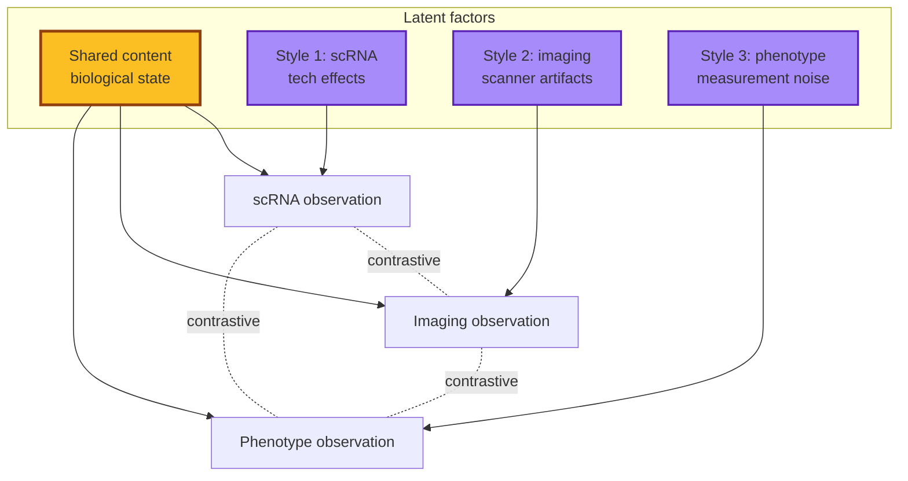

The goal: **isolate Content from Style**. The deep insight (von Kügelgen et al. 2021, Daunhawer et al. 2023): under reasonable assumptions, **multimodal contrastive learning provably does this**.

### 4.3 The identifiability theorems you should know

| Result | Year | Statement (informal) | Why it matters |
|---|---|---|---|
| **iVAE** (Khemakhem et al.) | 2020 | With auxiliary information $u$, ICA-like nonlinear latents are identifiable | Foundational |
| **von Kügelgen et al.** | NeurIPS 2021 | Self-supervised learning with augmentations *provably* separates content from style | Justifies SimCLR-style pretraining |
| **Daunhawer et al.** | ICLR 2023 | Multimodal contrastive learning identifies the *shared* invariant content latents | **Direct result for your setting** |
| **Yao et al. (Multi-View)** | ICLR 2024 | Identifiability under partial observability across views | Mosaic / missing modalities |
| **Squires et al. linear CRL** | 2023 | Linear causal disentanglement is identifiable from interventions | Use treatment data |
| **Brehmer et al. weakly supervised** | NeurIPS 2022 | Pairs of pre/post-intervention identify causal latents | If you have interventions |
| **Lippe CITRIS** | ICML 2022 | Temporal identifiability with intervention targets | If you have longitudinal |

The headline you should internalize: **multimodal alone (without temporal or interventional structure) gives you content-vs-style separation**. Add longitudinal data and you get more (causal direction). Add interventions and you get full causal identifiability under reasonable assumptions.

### 4.4 The Daunhawer 2023 result in plain English

Setup: each modality $X^{(m)}$ is generated as $X^{(m)} = f_m(C, S^{(m)})$ where $C$ is the *shared content* (the biology) and $S^{(m)}$ is *modality-specific style* (the measurement artifact).

**Theorem (informal):** if you train cross-modal InfoNCE between modality pairs, the encoders provably recover $C$ up to a smooth invertible transformation. In other words, **the contrastive head you already plan to use is doing causal disentanglement for free**, under assumptions.

Assumptions worth checking:
- $C$ has bounded support and continuous density.
- Style variables $S^{(m)}$ are *independent* of content $C$ (no common cause).
- Generators $f_m$ are smooth and invertible in $S^{(m)}$.
- Sufficient diversity in observed $C$ values across the dataset.

For your patient cohort: most are reasonable. The "style independent of content" is the one to scrutinize: if scanner type correlates with disease severity (because sicker patients go to specialized centers), you have *confounding* and need extra care.

### 4.5 Practical methods

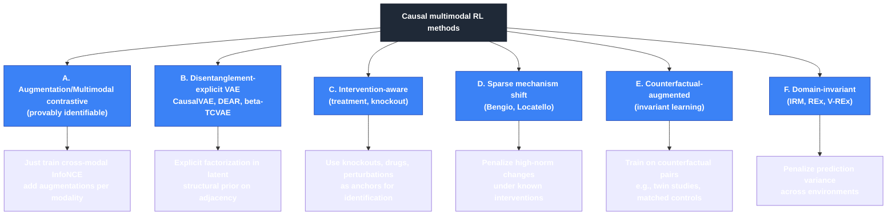

### 4.6 SCM-aware architectures

A Structural Causal Model (SCM) over latents:
$$Z_i = f_i(\text{Pa}(Z_i), N_i), \quad i = 1, \ldots, K$$

with noise variables $N_i$ and parents $\text{Pa}(Z_i)$ in a DAG.

#### CausalVAE (Yang et al., CVPR 2021)
Latent SCM with a learnable adjacency matrix $A$. Latents satisfy $Z = A^T Z + \epsilon$ (linear SCM). Identifiable if you have weak supervision on $A$ or interventional data.

#### DEAR (Disentangled gEnerative cAusal Representation, Shen et al., 2022)
Generative model with an SCM prior over latents, trained via adversarial loss. Stronger nonlinear extensions exist.

#### Multi-view causal (Yao et al., ICLR 2024)
Multiple modalities $X^{(m)}$ each give a partial view of the SCM. Identifiability holds when each latent affects at least two modalities. **This is your setting**.

### 4.7 The sparse mechanism shift hypothesis (Schölkopf, Bengio)

Real-world distribution shifts (treatments, lifestyle changes, mutations) typically alter **few mechanisms** in the SCM, not the whole joint. Operationally:

$$\| \theta_{\text{post}} - \theta_{\text{pre}} \|_0 \ll \dim(\theta)$$

Use this as a regularizer: when you observe pre/post-intervention paired data, the change in the inferred latent should be sparse.

For patient data: pre/post-treatment, before/after diagnosis, twin studies, paired healthy/disease tissue. Each gives you a "soft intervention" where sparsity is biologically motivated.

### 4.8 Putting it together: a causally-informed patient embedding

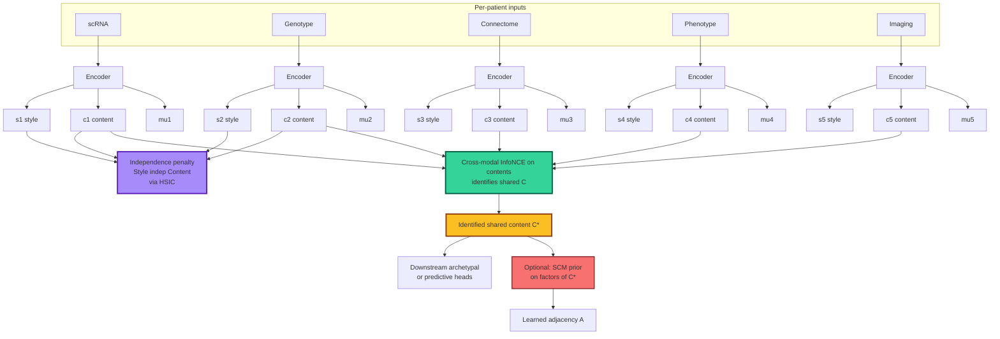

**Loss additions:**
$$\mathcal{L}_{\text{causal}} = \mathcal{L}_{\text{InfoNCE on } C} + \lambda_h \sum_m \text{HSIC}(C_m, S_m) + \lambda_s \, \text{SCM prior or sparsity}$$

The HSIC term enforces independence of style from content, which is **the missing ingredient** to get the Daunhawer identifiability theorem to fire.

### 4.9 When does causal structure pay off for you?

| You have | Causal RL pays off? | Method |
|---|---|---|
| Only paired multimodal observations | Yes (content/style separation) | Daunhawer-style multimodal contrastive + HSIC |
| Longitudinal data | Strong yes | CITRIS-style temporal CRL |
| Intervention/treatment data | Big yes | Brehmer weakly-supervised, Squires linear CRL |
| Twin / matched-pair design | Yes | Counterfactual augmentation |
| Known biological prior structure | Yes | DAG prior in CausalVAE/DEAR |
| Just one timepoint, no interventions | Mild (still get content/style) | Multimodal InfoNCE + HSIC |

### 4.10 Practical recipe (drop-in additions to your stack)

1. **Split each encoder output into $(C_m, S_m)$.** Two heads of the same encoder.
2. **Cross-modal InfoNCE on $C_m$ only.** This is what gives you identifiability.
3. **Independence penalty between $C_m$ and $S_m$** via HSIC or adversarial discriminator.
4. **Reconstruct $X^{(m)}$ from both $C_m$ and $S_m$.** Style is needed for reconstruction but does not leak into the shared content.
5. **Aggregate $C_m$ across modalities** (PoE, MoE, or just average) into the consensus $C^*$.
6. **Use $C^*$ as input to the archetypal head and downstream tasks.**
7. **(If you have interventions/longitudinal:)** add a sparse mechanism shift regularizer between paired pre/post observations.

### 4.11 Recent reading list (causal RL focus)

- Schölkopf et al., **Toward Causal Representation Learning**, IEEE 2021. Position paper.
- Khemakhem et al., **Variational Autoencoders and Nonlinear ICA: A Unifying Framework (iVAE)**, AISTATS 2020.
- von Kügelgen et al., **Self-supervised learning with data augmentations provably isolates content from style**, NeurIPS 2021.
- Daunhawer et al., **Identifiability Results for Multimodal Contrastive Learning**, ICLR 2023.
- Yao et al., **Multi-View Causal Representation Learning with Partial Observability**, ICLR 2024.
- Brehmer et al., **Weakly supervised causal representation learning**, NeurIPS 2022.
- Squires, Yang et al., **Linear Causal Disentanglement via Interventions**, ICML 2023.
- Lippe et al., **CITRIS: Causal Identifiability from Temporal Intervened Sequences**, ICML 2022.
- Yang et al., **CausalVAE**, CVPR 2021.
- Shen et al., **DEAR: Disentangled Generative Causal Representation**, 2022.
- Locatello et al., **Challenging common assumptions in unsupervised learning of disentangled representations**, ICML 2019. (Shows you *cannot* identify factors without inductive bias, motivating multimodal as the bias.)
- Zheng et al., **Identifiability guarantees for causal disentanglement from soft interventions**, NeurIPS 2023.
- Komanduri et al., **From identifiable causal representations to controllable counterfactual generation**, 2024.
- Ahuja et al., **Interventional causal representation learning**, ICML 2023.

---

## How These Four Updates Change the Recommended Architecture

The main-doc Section 7 architecture is updated as follows. **Three concrete swaps:**

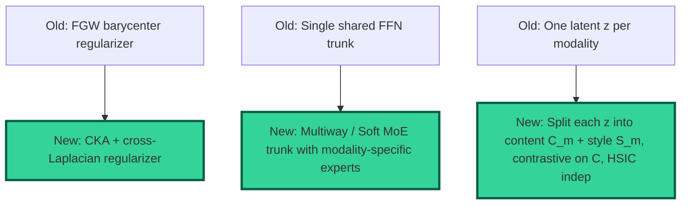

The cross-attention question is more about **scaling** (Q-Formers and Perceiver bottlenecks) than a swap, and you'll use it inside the encoders and trunk.

### Updated total loss (final form)

$$\mathcal{L} = \underbrace{\sum_m \mathcal{L}_{\text{recon}}^{(m)}}_{\text{from }C_m, S_m} + \beta \mathcal{L}_{\text{KL}} + \lambda_c \underbrace{\mathcal{L}_{\text{InfoNCE on } C}}_{\text{paired + identifiability}} + \lambda_h \underbrace{\sum_m \text{HSIC}(C_m, S_m)}_{\text{independence}} + \lambda_g \underbrace{(-\sum_{m \ne m'} \text{CKA}(K^{(m)}_C, K^{(m')}_C) + \text{tr}(C^T L^* C))}_{\text{geometry alignment + manifold}} + \lambda_a \mathcal{L}_{\text{archetypal on }C^*} + \lambda_{\text{moe}} \mathcal{L}_{\text{load-balance}}$$

That is the final stack. Each term has a job, each job is justified, and the total is implementable in stages.

---

## TL;DR for the addendum

| Q | Bottom line |
|---|---|
| **Q1 FGW vs paired** | You do not need FGW for paired patients. Use **CKA + Laplacian regularization**. Reserve GW only for the consensus barycenter, and only if your consensus is itself a structured distribution. |
| **Q2 Cross-attention at scale** | Tokenize each modality with a domain encoder, compress with **Q-Formers (BLIP-2 style)** to fixed-size token sets per modality, fuse in a shared trunk. Use **gated cross-attention** if attaching to a frozen LM. FlashAttention 2 is non-negotiable. |
| **Q3 MoE for multimodal** | Start with **multiway transformer (VLMo / BeIT-3)** for stable modality-as-expert. Move to **Soft MoE (ICLR 2024)** with auxiliary load-balancing once data scale supports it. Modality-hard plus learned routing is a strong combo. |
| **Q4 Causal multimodal** | **Split latent into content $C_m$ + style $S_m$ per modality. Apply InfoNCE only on $C_m$. Add HSIC$(C_m, S_m)$ independence.** This makes the Daunhawer 2023 identifiability theorem fire and gets you content-vs-style disentanglement essentially for free. Add longitudinal/interventional data later for full causal identification. |

*Document version 1.0 (addendum). Companion to the main review.*
