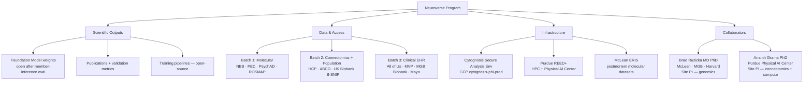

# Neuroverse Program
**A Cytognosis Foundation research program**
**Collaborators**: McLean Hospital / Mass General Brigham · Purdue University
**Status**: Active — pre-data-ingestion, IRB protocol in progress
**Last updated**: 2026-05-22

---

## What Is Neuroverse?

Neuroverse is Cytognosis Foundation's first major scientific program. It builds a
**continuous, multimodal, individual-level coordinate system for the human brain and psyche**
— the first instantiation of the Cytoverse GPS-for-Health framework applied to psychiatry
and neurodegeneration.

The scientific thesis: psychiatric and neurodegenerative conditions share overlapping
genetic, neural, and behavioral structure. Current categorical diagnoses impose
artificial boundaries on this continuum. A foundation model trained on a broad
aggregation of modalities can learn a continuous coordinate system in which:

1. Cross-disorder relationships are structurally encoded (not imposed).
2. Within-disorder heterogeneity (biotypes) is recoverable across modalities.
3. Individual trajectories under treatment are trackable.

Neuroverse is the map. Cytonome is the sensor that places a person on it.

---

## Program Structure

---

## Three-Level Validation Framework

The Neuroverse coordinate system must satisfy three independent scientific claims.
Satisfying all three is the acceptance criterion.

| Level | Claim | Key Datasets | Primary Metrics |
|---|---|---|---|
| **1 — Transdiagnostic** | Recovers cross-disorder relationships from RDoC/HiTOP/PGC structure | NBB, PEC, PsychAD, ROSMAP, B-SNIP | Procrustes alignment vs HiTOP spectra; disorder dendrogram cophenetic correlation |
| **2 — Within-disorder biotypes** | Recovers published biotypes across modalities (e.g., Drysdale depression, Clementz psychosis) | B-SNIP, ROSMAP, PEC, ABCD | ARI/NMI vs published biotype labels; cross-modality biotype transfer AUC |
| **3 — Treatment dynamics** | Individual coordinate shifts are interpretable and track intervention response | Longitudinal ABCD, dense-sample clinical cohorts | Cohen's d pre/post; responder vs non-responder AUC; ICC for coordinate stability |

---

## Program Contacts

| Role | Person | Institution | Contact |
|---|---|---|---|
| Principal Investigator | Shahin Mohammadi, PhD | Cytognosis Foundation | mohammadi@cytognosis.org |
| Site PI — Genomics & Single-Cell | Brad Ruzicka, MD PhD | McLean Hospital / MGB / Harvard | via mohammadi@cytognosis.org |
| Site PI — Connectomics & Compute | Ananth Grama, PhD | Purdue University (Physical AI Center) | via mohammadi@cytognosis.org |

---

## Documents in This Section

**Program and operations**

| Doc | Purpose |
|---|---|
| [datasets-cohorts.md](datasets-cohorts.md) | Full cohort table: modalities, access routes, DUC status, data tiers |
| [infrastructure.md](infrastructure.md) | Secure Analysis Environment design, inter-institutional access patterns |
| [action-plan.md](action-plan.md) | IRB, DUC submission sequence, onboarding flow, roadmap |
| [pipeline-report-v0.md](pipeline-report-v0.md) | First real-data phenotype projection and archetypal-analysis run (the micro-to-meso bridge) |

**Science foundation** (consolidated 2026-07-01; framing for [03-Products/Cytoverse](../../03-Products/Cytoverse/science-foundation.md))

| Doc | Purpose |
|---|---|
| [neurobehavioral-phenotype-feature-space.md](neurobehavioral-phenotype-feature-space.md) | Six-layer neurobehavioral phenotype feature space; the Cytognosis continuous axis |
| [cdisc-qrs-instrument-reference.md](cdisc-qrs-instrument-reference.md) | CDISC QRS instrument vocabulary and four-identifier harmonization strategy |
| [multimodal-coembedding-methods-review.md](multimodal-coembedding-methods-review.md) | 2025-2026 methods review; ranked co-embedding architecture recommendation |
| [multimodal-coembedding-addendum.md](multimodal-coembedding-addendum.md) | Four deep-dive updates (FGW, cross-attention, MoE, causal representation) |
| [master-dataset-curation.md](master-dataset-curation.md) | Master dataset curation narrative (data table in `datasets/curations/master/`) |
| [fmri-methods-review.md](fmri-methods-review.md) | fMRI methods literature review (converted from the original .docx) |

**Methods and standards**

| Doc | Purpose |
|---|---|
| [neuroimaging-python-stack-defaults.md](neuroimaging-python-stack-defaults.md) | Org-wide Python package defaults for neuroimaging and electrophysiology |
| [schema-survey/](schema-survey/README.md) | Survey of how to represent body, sensors, data, and models (SOSA chain); canonical copy |

> Consolidation navigation for this project lives in `~/Claude/Projects/Science and Platform/00-CONSOLIDATION/INDEX.md`.

---

## Related Sections

| Section | Why it's related |
|---|---|
| [Data Strategy](../../data-strategy/README.md) | Governance, HIPAA, DMP, DUA templates that apply to Neuroverse |
| [HIPAA Status](../../06-Operations/data-strategy/compliance/HIPAA-STATUS.md) | Compliance controls for PHI handling |
| [NIH GDS Requirements](../../06-Operations/data-strategy/compliance/nih-gds-requirements.md) | DUC obligations, NIST 800-171, generative AI restrictions |
| [Reproducibility Strategy](../../reproducibility/README.md) | How Neuroverse runs emit FAIR RO-Crates |
| [Dataset Catalog](../../04-Engineering/infrastructure/data-strategy/dataset-catalog.md) | Broader public dataset catalog (Neuroverse is a subset) |

---

## Current Status (as of 2026-05-22)

| Milestone | Status |
|---|---|
| Scientific strategy documented | ✅ Done |
| Collaborator MOUs (Cytognosis–Purdue, Cytognosis–McLean) | ⏳ Drafted by Duane; not yet signed |
| North Star IRB Support Agreement | ✅ Executed |
| SMART IRB Joinder (Cytognosis as relying institution) | ⏳ Pending FWA issuance |
| FWA (Federal Wide Assurance) from OHRP | ⏳ Application in progress |
| Secure Analysis Environment (GCP phi-prod) | ✅ Provisioned (empty) |
| First DUC submitted (NBB) | ⏳ Pending FWA + IRB |
| First data ingested | ⏳ Pending first DUC approval |
| Foundation model training begins | ⏳ Pending sufficient multi-cohort data |
