> **Status:** Active · **Date:** 2026-05-06 (authored), 2026-07-01 (canonicalized) · **Author:** Cytognosis Foundation
> **Canonical home:** `05-Research/neuroverse/multimodal-coembedding-methods-review.md` · **Consolidated from:** `Science and Platform/multimodal_coembedding_review_2025_2026.md`.
> **Companion:** [multimodal-coembedding-addendum.md](multimodal-coembedding-addendum.md) (four deep-dive updates; read together).

# Multimodal Co-Embedding for Multi-Scale Patient Data
### A 2025-2026 Methods Review, Tailored to Paired Cross-Scale Patient Integration

> **Built for:** Cytognosis-style platforms where each individual has many views (phenotypic, genotypic, single-cell/omic, connectomic, imaging, EHR) and the goal is one consistent geometry that respects biological scale and patient identity.
>
> **Reading mode:** Skim Section 0 (TL;DR), then jump to Section 7 (recommendation) or Section 8 (decision tree). The rest is reference material organized for non-linear reading.

---

## 0. TL;DR / One-Page Cheat Sheet

### What you actually want
You want **N+1 patient embeddings** (one per modality plus a consensus) where:
1. **Pairing is preserved.** Same patient lives in nearby positions across views.
2. **Metric structure is preserved.** Pairwise relationships within a modality are not destroyed by integration.
3. **Modality contribution is interpretable.** You can ask "what does genotype add over phenotype?"
4. **Scale heterogeneity is respected.** Connectomics is graphs, genomics is counts, phenotype is mixed tabular, etc.
5. **Missing modalities are OK.** Real cohorts will not have every view for every patient.

### The 30-second recommendation

| Rank | Architecture | Why | Effort |
|------|--------------|-----|--------|
| 1 | **Hybrid: PoE-VAE backbone + cross-modal contrastive head + Fused-Gromov-Wasserstein regularizer + archetypal projection head (consensus = FGW barycenter)** | Combines the best of generative joint posterior, paired-sample contrastive, metric-preserving OT, and interpretable consensus geometry | High (3 to 6 months) |
| 2 | **MOFA+ / MOFA-FLEX with archetypal post-hoc + SNF graph regularizer** | Fast, interpretable, handles missing modalities natively, well-tested | Low (weeks) |
| 3 | **Cross-attention fusion transformer on per-modality encoders, with contrastive pretraining** | Best raw representation power if you have the scale and want to plug into LLM/foundation-model ecosystem | Very high |

**My pick:** Start with #2 to get a working baseline this quarter, then evolve toward #1. Treat #3 as a research direction once data scale justifies it. Details in Section 7.

### Decision shortcuts
- **Need it fast and interpretable?** MOFA+ first, then add SNF or barycenter on top.
- **Have lots of paired patients (N > 1k) and want SOTA representation?** Go contrastive plus PoE-VAE.
- **Modalities live in genuinely incomparable spaces (e.g., connectome graphs vs. expression)?** You need GW or FGW, not Wasserstein.
- **Want biology-first interpretability with extreme phenotypes?** Archetypal analysis (MIDAA-style), with FGW barycenter as the consensus.
- **Mostly want a single shared latent for downstream prediction?** Cross-attention transformer plus contrastive head.

---

## 1. Document Map

**Skim path for ADHD brain:** 0 → 7 → 8 → 9. Come back for the rest.

**Deep path:** 2 → 3 → 4 → 5 → 6 → 7.

---

## 2. Your Problem, Formalized

### 2.1 What you have
For each patient $i \in \{1, \ldots, N\}$, you have data across $M$ modalities:

$$\{X^{(m)}_i\}_{m=1}^{M}, \quad \text{e.g., } m \in \{\text{phenotype, genotype, scOmics, connectome, imaging}\}$$

**Critical distinguishing feature:** samples are **paired at the patient level**. This is *not* the SCOT setting (which aligns unpaired single cells across modalities). Pairing dramatically simplifies the problem because you do not need to *learn* the assignment, only the *geometry*.

### 2.2 What you want

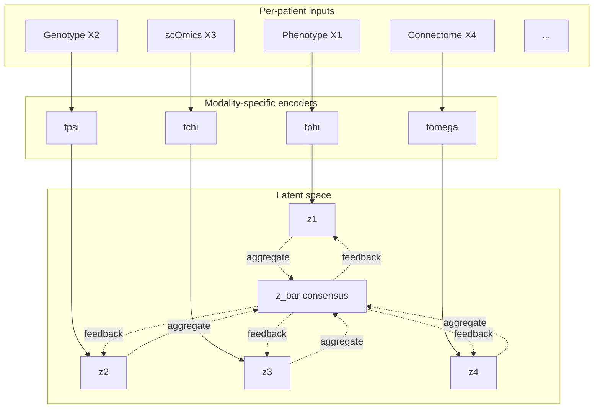

You want the embeddings to satisfy three properties simultaneously:

| Property | Plain English | Math idiom |
|---|---|---|
| **Pairing alignment** | Same patient lives near itself across modalities | $\|z^{(m)}_i - z^{(m')}_i\| \ll \|z^{(m)}_i - z^{(m)}_{j \ne i}\|$ |
| **Metric preservation** | Pairwise distances within a modality are not destroyed | $d^{(m)}(i,j)$ in latent ≈ $d^{(m)}(i,j)$ in input |
| **Consensus coherence** | $\bar{z}_i$ is a faithful average of $\{z^{(m)}_i\}_m$ | $\bar{z}_i \in \arg\min \sum_m \lambda_m D(z^{(m)}_i, \bar{z}_i)$ |

The third one is the **N+1 view** you described, and is exactly an **OT/GW barycenter problem**.

### 2.3 The hidden constraints

| Constraint | Implication |
|---|---|
| Modalities at different scales (cell vs network vs whole-body) | Input encoders need to be different (GNN, Transformer, MLP, etc.) |
| Different statistical types (counts, continuous, binary, graphs) | Need likelihoods/decoders or scale-invariant losses |
| Patients are samples, not cells (small N) | Risk of overfitting: contrastive needs care, foundation models likely overkill |
| Missing modalities for some patients | Need PoE/MoE-style aggregation that gracefully handles missingness |
| Interpretability matters (clinical/regulatory) | Favor archetypal, factor-analytic, or attention-explained methods |
| Clinical heterogeneity is the *signal* | Do not over-regularize toward a single mode; preserve extremes |

---

## 3. The Big-Picture Taxonomy

### 3.1 Six families of methods

```mermaid
flowchart TB
    Root["Multimodal Patient Co-Embedding"]:::root

    Root --> A["A. Similarity / Network<br/>Fusion (geometry-only)"]:::fam
    Root --> B["B. Optimal Transport<br/>(metric matching)"]:::fam
    Root --> C["C. Latent-Variable<br/>Generative (VAE family)"]:::fam
    Root --> D["D. Matrix Factorization<br/>(MOFA, LIGER)"]:::fam
    Root --> E["E. Archetypal Analysis<br/>(extreme-point geometry)"]:::fam
    Root --> F["F. Contrastive<br/>(paired alignment)"]:::fam
    Root --> G["G. Attention / Transformer<br/>(token fusion)"]:::fam

    A --> A1[SNF, NEMO, ANF]
    A --> A2[Graph fusion + clustering]

    B --> B1[Wasserstein, same space]
    B --> B2[Gromov-Wasserstein, diff spaces]
    B --> B3[Fused GW, both at once]
    B --> B4[Barycenters, consensus]
    B --> B5[GENOT, neural OT 2024-25]

    C --> C1[PoE-VAE, Multigrate]
    C --> C2[MoE-VAE, MMVAE]
    C --> C3[MoPoE, mixture of PoE]
    C --> C4[Barycentric VAE 2024]
    C --> C5[MultiVI, totalVI]

    D --> D1[MOFA, MOFA+]
    D --> D2[MOFA-FLEX, scMOFA]
    D --> D3[LIGER, online iNMF]
    D --> D4[StabMap, mosaic]

    E --> E1[Linear AA, ParTI]
    E --> E2[AAnet, scAAnet]
    E --> E3[MIDAA 2025]
    E --> E4[Multi-task Pareto AA]

    F --> F1[CLIP-style cross-modal]
    F --> F2[Concerto, scCLIP]
    F --> F3[CLCLSA, CMME 2024-25]
    F --> F4[Triplet/InfoNCE]

    G --> G1[Cross-attention fusion]
    G --> G2[Perceiver IO, MMformer]
    G --> G3[MLLMs medical 2025]
    G --> G4[Mixture of Experts MoE Transf]

    classDef root fill:#1f2937,stroke:#111827,color:#fff,font-weight:bold
    classDef fam fill:#3b82f6,stroke:#1e40af,color:#fff
```

### 3.2 What each family fundamentally optimizes

| Family | Core objective | Native consensus mechanism | Handles incomparable spaces? |
|---|---|---|---|
| A. Similarity fusion | Combine kernels/graphs, no shared embedding | Fused affinity matrix | Yes (only needs intra-modality similarities) |
| B. Optimal transport | Match distributions across spaces | Wasserstein/GW barycenter | **Yes** (GW family) |
| C. VAE generative | Maximize joint ELBO across modalities | PoE / MoE posterior product | Yes, if shared latent |
| D. Matrix factorization | Decompose each modality with shared factors | The shared factor matrix itself | Yes, all share factor space |
| E. Archetypal analysis | Find extreme convex hull, encode as simplex | Shared archetype matrix | Yes, all share simplex |
| F. Contrastive | Pull positives, push negatives | Average / projection head | Yes, projects to shared space |
| G. Attention fusion | Token-level cross-modal interaction | Fused attention output | Yes, with appropriate tokenization |

### 3.3 Quick taxonomy by your priorities

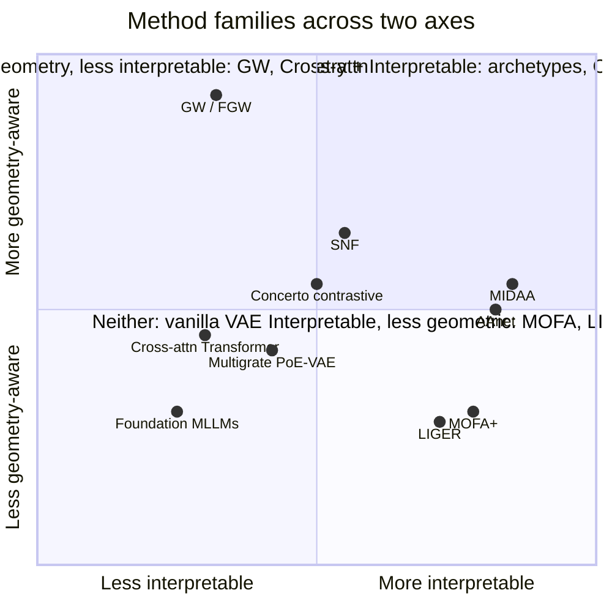

---

## 4. Method Families: Deep Dive

> Every section follows the same template: **What it does → Math sketch → Architecture diagram → When to use → Recent variants → Strengths/weaknesses for your case.**

---

### 4.A Similarity / Network Fusion (SNF and friends)

#### What it does
Build a similarity graph (kNN/Gaussian kernel) per modality, then fuse them iteratively into one consensus graph. No shared latent, just a fused affinity matrix used downstream for clustering, ranking, or label propagation.

#### Math sketch
For each modality $m$, build $W^{(m)}$ (patient-by-patient similarity). Fuse via cross-diffusion:

$$P^{(m)}_{t+1} = S^{(m)} \cdot \left( \frac{1}{M-1} \sum_{m' \ne m} P^{(m')}_{t} \right) \cdot (S^{(m)})^{T}$$

After convergence, average $\{P^{(m)}\}$ to get the fused similarity.

#### Architecture diagram

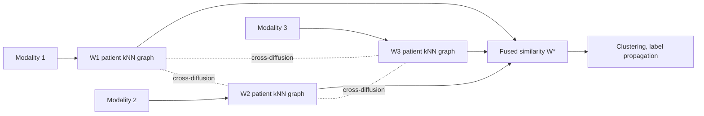

#### When to use
- You only care about pairwise patient similarity, not actual embeddings.
- You want a quick baseline that handles arbitrary distance metrics per modality.
- You have small N where geometry-only is enough.

#### Recent variants
- **NEMO** (Rappoport & Shamir, 2019): closed-form fusion, no iteration.
- **ANF** (Affinity Network Fusion): variance-weighted.
- **Diffusion-augmented SNF** with manifold learning post-fusion.
- **Graph contrastive extensions** that learn embeddings from the fused graph (graph-NN style).

#### Strengths/weaknesses for your case

| Pros | Cons |
|---|---|
| Simple, fast, no training | No actual embedding (only pairwise) |
| Great as a **regularizer** for deeper methods | Cannot generate new patient predictions |
| Trivially handles arbitrary input types | Loses fine geometry inside a cluster |
| Robust baseline for sanity checks | No N+1 consensus *embedding*, only similarity |

**Verdict:** Useful as a **regularizer** ("encourage neighbors in fused SNF graph to be neighbors in latent space") and as a **baseline**. Not your main solution.

---

### 4.B Optimal Transport: W, GW, FGW, Barycenters

#### What it does
Treats each modality as a probability distribution and finds a transport plan that aligns them. Two flavors:

1. **Wasserstein (same space):** assumes embeddings live in a common space; minimizes ground cost.
2. **Gromov-Wasserstein (different spaces):** matches *pairwise relationships*, not points. This is what SCOT, scSAGA, and moscot use.

#### Math sketch
**Wasserstein:**
$$W_p(\mu, \nu) = \min_{\pi \in \Pi(\mu, \nu)} \int c(x, y)^p \, d\pi(x, y)$$

**Gromov-Wasserstein:** given intra-domain distances $C^{(1)}, C^{(2)}$,
$$\text{GW}^2 = \min_{\pi} \sum_{i,j,k,l} | C^{(1)}_{ij} - C^{(2)}_{kl} |^2 \, \pi_{ik} \pi_{jl}$$

**Fused GW (FGW):** combines feature cost (Wasserstein) and structure cost (GW),
$$\text{FGW} = \min_{\pi} (1-\alpha)\langle M, \pi \rangle + \alpha \sum_{ijkl} | C^{(1)}_{ij} - C^{(2)}_{kl} |^2 \pi_{ik}\pi_{jl}$$

**FGW barycenter:** find a "central" graph/embedding minimizing weighted FGW to each modality.

#### Architecture diagram (your N+1 setup)

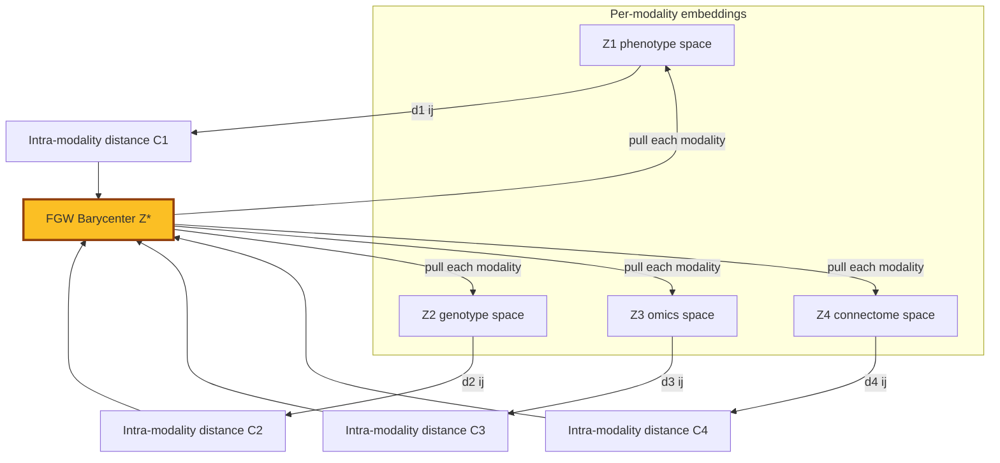

This is exactly your **"barycenter as anchor"** idea operationalized.

#### Why GW (not W) for you
Your modalities have **fundamentally different geometries** (a connectome graph, a gene-expression manifold, a phenotype tabular space). Wasserstein needs a *shared* ground metric. Gromov-Wasserstein only needs *intra-modality* distances. The induced metric structure is what gets matched.

But: **you have paired samples**. So pure unsupervised GW (which has to discover the assignment) is overkill. The right move is **GW with the patient identity as an anchor**, i.e., constrain the transport plan $\pi$ so $\pi_{ii} > \pi_{ij}$ for $j \ne i$ (or use FGW with feature cost = 0 for matched patients).

#### Recent variants worth knowing

| Method | Year | What is new | Why care |
|---|---|---|---|
| **moscot** (Klein et al., Nature) | 2025 | Atlas-scale OT/GW across time, space, modality | Gold standard scalable OT for biology |
| **scSAGA** (sampled GW) | 2026 (preprint) | kNN-graph + on-demand geodesic + sampled GW | Memory-efficient, paired or unpaired |
| **GENOT** (entropic GW flow matching) | 2024 | Neural OT solver, generates samples from transport | Generative version of OT |
| **Sliced FGW / Low-rank GW** | 2024-25 | Linear-time scalable approximations | Practical for N > 10k |
| **Unbalanced FGW** | 2023-25 | Allows mass creation/destruction | Robust to outliers, missing data |
| **Semi-relaxed GW** | 2023 | Only one marginal fixed | Useful for label propagation |

#### Strengths/weaknesses for your case

| Pros | Cons |
|---|---|
| **Handles incomparable spaces natively** | Quadratic cost in N (need low-rank/sliced for scale) |
| Geometry-preserving, metric-aware | Pure unsupervised version ignores your pairing |
| Barycenter is a principled consensus | Implementation more complex than VAE/factor methods |
| Strong recent biology track record | Hyperparameters (entropic reg, $\alpha$ in FGW) sensitive |
| Composable as a *regularizer* on top of any encoder | Not generative on its own |

**Verdict:** **GW/FGW barycenter is the cleanest formalization of your "anchor for cross-modal pulling" idea.** Use it as a *regularizer* on top of learned embeddings, not as a standalone method. See Section 7 for how this fits.

---

### 4.C Latent Variable / VAE Family (PoE, MoE, MoPoE, Barycentric)

#### What it does
Each modality has its own encoder $q_\phi^{(m)}(z | x^{(m)})$. The joint posterior over $z$ given all modalities is constructed by combining the unimodal posteriors. Three main fusion rules:

| Rule | Formula | Behavior |
|---|---|---|
| **Product of Experts (PoE)** | $q(z\|x_{1:M}) \propto \prod_m q(z\|x_m)$ | "AND" logic, sharp consensus, but one bad expert can poison |
| **Mixture of Experts (MoE)** | $q(z\|x_{1:M}) = \frac{1}{M}\sum_m q(z\|x_m)$ | "OR" logic, tolerant to disagreement |
| **MoPoE** | Hybrid, mixture over PoE subsets | Best of both, more parameters |

A 2024 AAAI paper showed **all three are special cases of Wasserstein barycenters** of the unimodal posteriors. So even VAEs reduce to OT under the hood.

#### Architecture diagram (PoE-VAE / Multigrate-style)

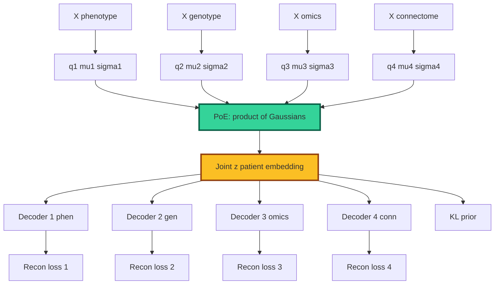

#### Math sketch (PoE for Gaussian posteriors)
If each $q_m(z|x_m) = \mathcal{N}(\mu_m, \Sigma_m)$, the PoE consensus is closed-form Gaussian:
$$\Sigma^{-1} = \sum_m \Sigma_m^{-1}, \quad \mu = \Sigma \sum_m \Sigma_m^{-1} \mu_m$$

This is a **precision-weighted average**: noisy modalities (large $\Sigma_m$) contribute less. Beautiful for handling missingness: drop the term for any missing modality, recompute.

#### Recent variants

| Method | Year | What is new |
|---|---|---|
| **Multigrate** (Lotfollahi et al.) | 2022 | PoE-VAE for multi-omics, paired/mosaic |
| **MultiVI** (Ashuach et al.) | 2023 | scvi-tools integration, single-cell joint RNA+ATAC+protein |
| **MoPoE-VAE** (Sutter et al.) | 2021 | Mixture over all PoE subsets (handles arbitrary missingness) |
| **MIDAS** (Yu et al.) | 2024-25 | Mosaic integration with disentangled latents |
| **Multimodal VAE: A Barycentric View** (AAAI) | 2025 | Unifies PoE/MoE/MoPoE as Wasserstein barycenters |
| **CardioVAE, Multimodal mmVAE** | 2024 | Tri-stream pretraining for clinical multimodal |
| **Diffusion-VAE multimodal** | 2024-25 | Replace decoder with diffusion for sharper generation |

#### Strengths/weaknesses for your case

| Pros | Cons |
|---|---|
| **Natural handling of missing modalities** (just drop expert) | KL regularization can collapse modality-specific info |
| Generative (can impute missing modalities) | Posterior collapse for weak modalities |
| Closed-form Gaussian PoE is fast | Hard to enforce geometry preservation without aux losses |
| Modality-specific decoders use proper likelihoods | "AND" logic of PoE can be too strict if modalities disagree |
| Plays well with archetypal head, contrastive head | Tuning $\beta$ in $\beta$-VAE is a black art |

**Verdict:** **Strong backbone candidate for your system.** Multigrate-style PoE-VAE gives you a free joint posterior for free that handles missingness. Add modality-specific likelihoods (NB for counts, Gaussian for continuous, GNN-based for connectomes). Use **MoPoE** if modalities frequently disagree.

---

### 4.D Matrix Factorization (MOFA, LIGER, StabMap)

#### What it does
Decompose each modality matrix $X^{(m)}$ into a shared factor matrix $Z$ and modality-specific weights $W^{(m)}$:
$$X^{(m)} \approx Z W^{(m)}$$

The shared $Z$ is the consensus patient embedding. Sparsity priors on $W^{(m)}$ make factors interpretable.

#### Architecture diagram

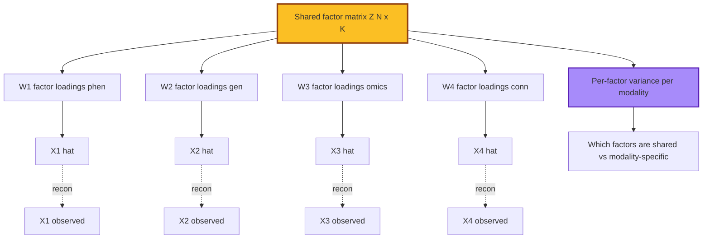

#### Why MOFA is great for your case
The **variance decomposition per factor per modality** is exactly the interpretability story you want. You can ask: "Factor 7 captures something that lives in genotype and phenotype but not connectome." This is hard to get from any other family without effort.

#### Recent variants

| Method | Year | What is new |
|---|---|---|
| **MOFA+** (Argelaguet et al.) | 2020 | Multi-group, sparse |
| **MOFA-FLEX** | 2024-25 | Flexible likelihoods, GPU |
| **scMOFA / MEFISTO** | 2022-23 | Spatial/temporal factors |
| **LIGER + online iNMF** (Welch lab) | 2019, 2021 | NMF with shared/specific factor split |
| **StabMap** (Marioni lab) | 2023 | Mosaic integration via reference factor anchoring |
| **Cobolt** | 2021-23 | Multimodal joint NMF for paired/unpaired |

#### Strengths/weaknesses for your case

| Pros | Cons |
|---|---|
| **Most interpretable family** by far | Linear (cannot capture nonlinear interactions) |
| Handles missing modalities natively | Limited expressive power |
| Variance decomposition per factor per modality | Factors not always biologically clean without priors |
| Fast and well-tested | Does not use pairing structure beyond shared $Z$ |
| Works at small N | No native consensus other than $Z$ itself (which is fine for you) |

**Verdict:** **The fastest path to a working baseline.** MOFA+ in week 1, then evolve. Run it even if you plan to go deeper, as a sanity check and an interpretability layer.

---

### 4.E Archetypal Analysis (Linear AA, AAnet, MIDAA)

#### What it does
Find $K$ **extreme points** (archetypes) on the convex hull of your data. Every sample is a convex combination of archetypes:
$$x_i \approx \sum_{k=1}^{K} \alpha_{ik} A_k, \quad \alpha_{ik} \ge 0, \sum_k \alpha_{ik} = 1$$

Archetypes themselves are convex combinations of data points:
$$A_k = \sum_{i} \beta_{ki} x_i, \quad \beta_{ki} \ge 0, \sum_i \beta_{ki} = 1$$

Geometrically: the archetypes are the **vertices of the simplex** that best wraps the data. Biologically: they are the **specialist phenotypes / Pareto-optimal task-performers**.

#### Why it matters for biology (Pareto / multi-task evolutionary theory)
Following Shoval et al. (Science 2012) and the cellular archetypes work (PNAS 2025), spatial ecotypes (Nature 2026), topographical mutagenesis (bioRxiv 2026), and AAnet (Cancer Discovery 2025), biological data routinely sits on a low-dimensional simplex whose vertices are **specialist tasks**. The interior of the simplex represents trade-offs (jacks-of-all-trades). This is a profound generative model for *why* biology is low-dimensional.

#### Architecture diagram (deep AA / MIDAA-style)

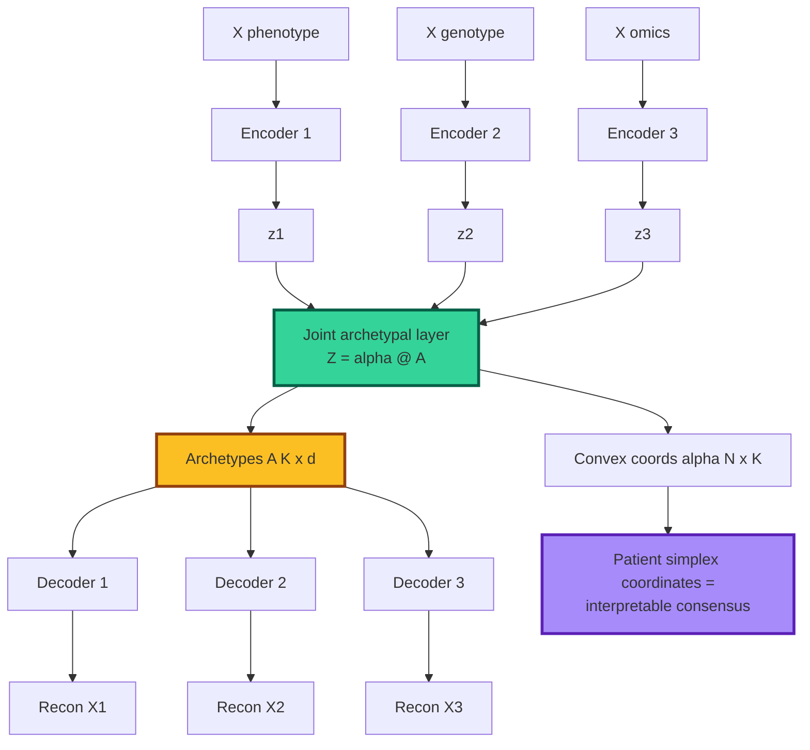

#### Why archetypal is exceptional for your N+1 problem
The **simplex coordinates $\alpha_i$** are *the* consensus embedding. They are:
- **Bounded** ($\alpha \in \Delta^{K-1}$), making them comparable across patients.
- **Interpretable** (each axis = a biological task).
- **Naturally hierarchical** (you can plot them on a simplex).
- **Compatible with archetypal-evolution theory** (Pareto fronts).

#### MIDAA in particular
MIDAA (Milite, Caravagna, Sottoriva, *Genome Biology* 2025) is the most relevant recent reference. It does deep AA on multi-omics with biology-aware likelihoods (NB for counts, Bernoulli for methylation, etc.). The cyclic optimization you described, where each modality is updated while pulling toward an aggregate, is essentially the MIDAA training loop.

#### Recent variants

| Method | Year | What is new |
|---|---|---|
| **ParTI / ParTI++** (Hart et al.) | 2015-17 | Statistical test for archetypes, Pareto inference |
| **AAnet** (Burkhardt et al.) | 2024-25 | Neural archetypal autoencoder, spatial extensions |
| **scAAnet** | 2023 | Single-cell archetypal AE |
| **MIDAA** | 2025 | Multi-omic deep AA, biological priors |
| **Hyperbolic AA** | 2024 | Archetypes in hyperbolic space (hierarchies) |
| **Causal AA** | 2024-25 | Archetypes constrained by SCM |

#### Strengths/weaknesses for your case

| Pros | Cons |
|---|---|
| **Most interpretable advanced method** | Number of archetypes K is a critical hyperparameter |
| Aligned with biological/evolutionary theory | Simplex assumption may not hold for all data |
| Bounded simplex coords are great for downstream | Can be unstable in high dim without regularization |
| Natural "extreme phenotype" interpretation | No native handling of missing modalities (need to add) |
| Archetype matrix is the consensus | Hard to scale beyond ~50 archetypes |

**Verdict:** **Excellent fit for your interpretability and N+1 needs.** Use MIDAA-style as the **head** on top of a PoE-VAE backbone. The archetype matrix is your consensus.

---

### 4.F Contrastive Learning (CLIP-style, Triplet, InfoNCE)

#### What it does
Learn embeddings such that **positive pairs** (same patient across modalities, or biologically related patients) are close, and **negative pairs** (different patients) are far. The InfoNCE loss is the canonical objective:

$$\mathcal{L}_{\text{InfoNCE}} = -\log \frac{\exp(\text{sim}(z^{(1)}_i, z^{(2)}_i) / \tau)}{\sum_j \exp(\text{sim}(z^{(1)}_i, z^{(2)}_j) / \tau)}$$

#### Architecture diagram (CLIP-style for paired patients)

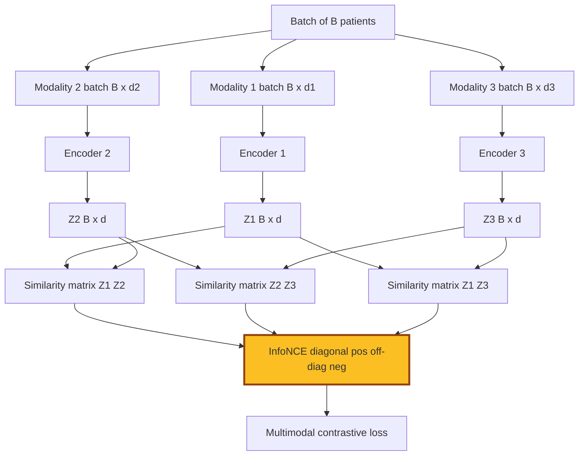

#### The "group-level positives" idea you mentioned
Vanilla InfoNCE treats only patient $i$ across modalities as the positive. You can extend to **supervised contrastive** (Khosla et al., NeurIPS 2020) where any patient with the same label (e.g., disease subtype) is also a positive. This is the natural way to incorporate group-level info.

For your setting, useful positive sets include:
- Same patient across modalities (default).
- Same patient at different timepoints.
- Patients in the same disease subtype.
- Patients with similar archetype simplex coords (semi-supervised bootstrap).

#### Recent variants

| Method | Year | What is new |
|---|---|---|
| **CLIP** (OpenAI) | 2021 | Cross-modal contrastive, vision-text |
| **Concerto** | 2022 | Contrastive multimodal single-cell |
| **scCLIP / scMM-CL** | 2023-24 | Single-cell adaptations |
| **CLCLSA** | 2023 | Cross-omics linked + self-attention |
| **CMME (Contrastive Multi-Modal Encoder)** | 2025 | Emphasizes weak modality contribution |
| **MarbliX** | 2025 | WSI + immunogenomics binary codes via triplet |
| **Cross-modal cancer survival** | 2025 | Alignment + contrastive for survival |

#### Strengths/weaknesses for your case

| Pros | Cons |
|---|---|
| **Directly leverages pairing** (this is its core assumption) | Needs reasonable batch size for InfoNCE (>32 patients) |
| Modality-agnostic encoders | No native consensus (need projection head or post-hoc avg) |
| Strong empirical track record | Negatives can be tricky for small cohorts |
| Easy to combine with other losses | Does not preserve metric structure unless you add it |
| Plays well with archetypal/AA heads | Risk of representation collapse |

**Verdict:** **Critical loss to include given your paired data.** Use as an *auxiliary loss* on top of PoE-VAE or MOFA, not standalone. With small N, use **supervised contrastive** with disease/subtype labels and **archetype-similarity-based positives** to enrich the positive set.

---

### 4.G Cross-Attention / Transformers / Foundation Models

#### What it does
Tokenize each modality, then let one modality attend to another via cross-attention. Output is a fused token sequence whose pooled representation is the joint embedding.

For modality $a$ attending to modality $b$:
$$\text{Attn}(Q_a, K_b, V_b) = \text{softmax}\left( \frac{Q_a K_b^T}{\sqrt{d}} \right) V_b$$

#### Architecture diagram (cross-attention fusion)

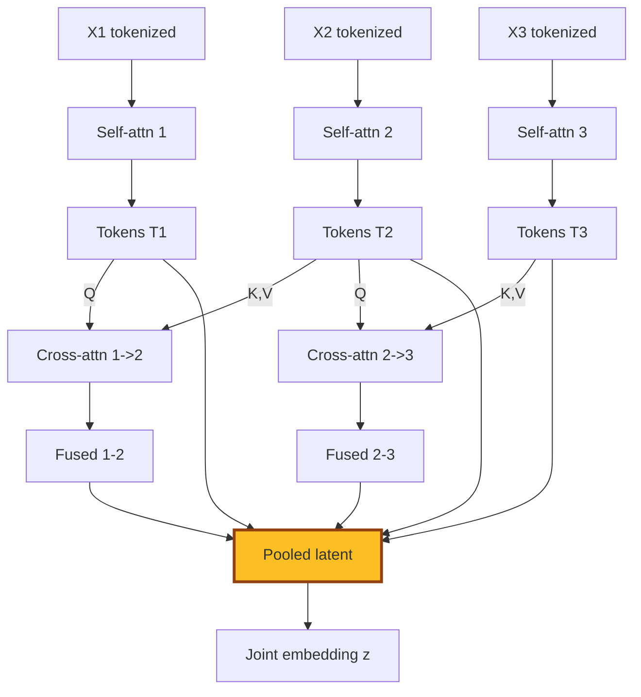

#### Perceiver-style alternative (great for your case)
Perceiver IO uses a small set of latent tokens that **cross-attend to every modality**. This decouples compute from input size, which is essential for connectome graphs and high-dim genomics.

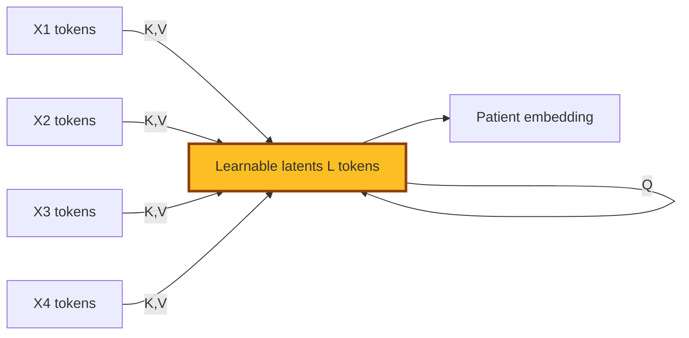

#### Recent variants

| Method | Year | What is new |
|---|---|---|
| **Perceiver IO** (DeepMind) | 2021 | Modality-agnostic with latent bottleneck |
| **scGPT, Geneformer, scFoundation** | 2023-24 | Single-cell foundation models |
| **Med-PaLM M, BiomedGPT** | 2023-24 | Multimodal medical LLMs |
| **CT-CLIP, RadCLIP** | 2024-25 | Imaging + report contrastive |
| **MMformer, MM-MoE Transformers** | 2024-25 | Mixture-of-experts cross-modal |
| **Masked Omics Modeling** (arXiv 2508.00969) | 2025 | Histology + omics with Perceiver fusion |
| **Multimodal MLLMs for clinical** | 2025-26 | Patient-as-document representation |

#### Strengths/weaknesses for your case

| Pros | Cons |
|---|---|
| **Most expressive** family | Needs large data; risk of overfitting at patient scale |
| Natural for sequence/imaging modalities | Black-box without careful interpretability tooling |
| Foundation-model integration possible | Compute and memory cost |
| Cross-attention scores give some attribution | Hard to enforce metric preservation |
| Can plug in pretrained encoders (Geneformer, etc.) | Less interpretable than AA/MOFA |

**Verdict:** **Use selectively.** Cross-attention is great for *within* a modality (e.g., attending across cells inside one patient's scRNA), and as a fusion mechanism in a small Perceiver-style block. Do not build the whole architecture as a transformer unless you have N > 10k patients or use heavy pretraining.

---

## 5. The 2025-2026 Frontier

Things that are *new since 2024* and worth your attention:

### 5.1 Headline recent papers

| Paper / Method | Venue | What is new | Relevance to you |
|---|---|---|---|
| **MIDAA** (Milite et al.) | Genome Biology 2025 | Deep AA for multi-omics with biology-aware likelihoods | **High** (your archetypal head) |
| **moscot** (Klein et al.) | Nature 2025 | Atlas-scale OT/GW unified framework | **High** (your OT regularizer) |
| **Multimodal VAE: Barycentric View** (Hwang et al.) | AAAI 2025 | Unifies PoE/MoE/MoPoE as Wasserstein barycenters | **High** (theoretical bridge) |
| **Benchmarking single-cell multi-modal** (Nature Methods 2025) | NM 2025 | 40 algorithms, paired/unpaired/mosaic | High (decision-making) |
| **scSAGA** (sampled GW) | bioRxiv 2026 | Memory-efficient GW with kNN + geodesics | Medium (if you go OT-heavy) |
| **CMME** (contrastive multi-omics encoder) | 2025 | Weak-modality-aware contrastive | Medium |
| **MarbliX** (multimodal pathology + immunogenomics) | 2025 | Triplet contrastive, binary codes | Medium |
| **GENOT** (entropic Gromov-Wasserstein flow matching) | Apple ML 2024 | Neural OT solver, generative | Medium |
| **MIDAS mosaic integration** | 2024-25 | Disentangled latents for incomplete modalities | High if you have lots of missingness |
| **Spatial ecotypes** (Nature 2026) | Nature 2026 | Archetypes in spatial context | Conceptual inspiration |
| **AAnet for spatial heterogeneity** (Cancer Discovery 2025) | CD 2025 | Continuum of cell states via AA | Conceptual inspiration |
| **Topographical archetypes of mutagenesis** (bioRxiv 2026) | bioRxiv 2026 | Mutagenesis archetypes | Conceptual inspiration |

### 5.2 Macro trends

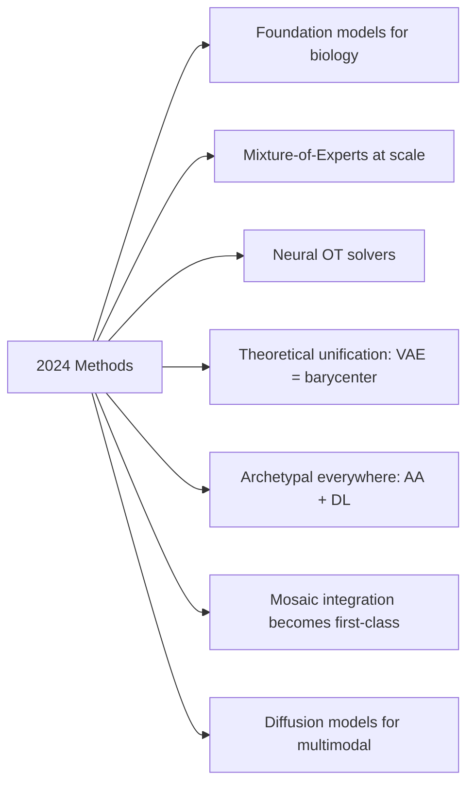

**The big shift:** people stopped treating multimodal as "fuse the embeddings" and started treating it as **principled distribution alignment**, often through OT. The barycenter view of VAEs (AAAI 2025) cemented the math: PoE-VAE, MoE-VAE, and OT barycenter are the *same* thing under different divergences.

### 5.3 Things to watch
- **Diffusion-based multimodal generators.** Replace VAE decoder with diffusion for sharper imputation.
- **Causal multimodal representation.** Enforcing SCM-style invariances across modalities.
- **Hyperbolic multimodal embeddings.** When biology has hierarchies (e.g., taxonomy, lineage).
- **Mixture-of-Experts transformers** with modality-specific experts (parameter-efficient cross-modal).
- **Patient-as-document foundation models.** All modalities serialized into a "patient passport" sequence, fed to an LLM.

---

## 6. Side-by-Side Comparison Matrix

### 6.1 Method scoring on your 7 criteria

Scoring: 0 = poor, 1 = fair, 2 = good, 3 = excellent.

| Method | Pairing-aware | Geometry preserving | Handles missing | Interpretable | Scales to N=10k | Native consensus | Plays with archetypes |
|---|---|---|---|---|---|---|---|
| SNF | 2 | 3 | 2 | 1 | 2 | 1 | 1 |
| GW / FGW | 1 (need anchor) | 3 | 2 | 1 | 1 (low-rank: 2) | 3 (barycenter) | 2 |
| PoE-VAE (Multigrate) | 3 | 1 (add aux loss) | 3 | 1 | 3 | 3 (joint posterior) | 3 |
| MoE-VAE / MoPoE | 3 | 1 | 3 | 1 | 3 | 2 | 2 |
| MOFA+ | 2 | 1 | 3 | 3 | 3 | 3 (factor matrix) | 2 |
| LIGER / iNMF | 2 | 1 | 2 | 3 | 3 | 3 | 2 |
| Linear AA | 2 | 2 | 1 | 3 | 3 | 3 (archetypes) | self |
| MIDAA | 3 | 2 | 2 | 3 | 2 | 3 | self |
| Concerto / CLIP-style | 3 | 1 | 2 | 1 | 3 | 1 | 2 |
| Supervised contrastive | 3 | 1 | 2 | 1 | 3 | 1 | 2 |
| Cross-attn Transformer | 2 | 1 | 2 | 1 | 2 | 2 | 1 |
| Perceiver IO | 2 | 1 | 3 | 1 | 3 | 2 | 1 |
| **Hybrid PoE-VAE + FGW + AA + Contrastive (recommended)** | **3** | **3** | **3** | **3** | **2-3** | **3** | **3** |

### 6.2 Compute requirements

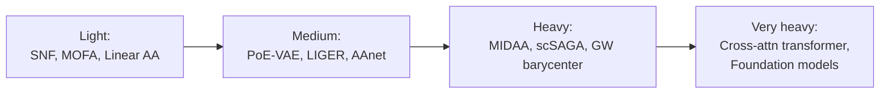

For N up to ~5k patients, anything except foundation-model approaches is feasible on a single GPU.

---

## 7. Recommended Architecture for Your System

### 7.1 The pitch

Build a **hybrid architecture** with four pillars:

1. **Modality-specific encoders** (right tool per scale).
2. **PoE-VAE backbone** for principled joint posterior and free missingness handling.
3. **Two regularizers** that enforce your stated geometric goals:
   - Cross-modal **contrastive loss** (uses pairing).
   - **FGW barycenter alignment** (preserves metric structure, gives consensus anchor).
4. **Archetypal projection head** (interpretable N+1 consensus, biologically motivated).

### 7.2 Architecture diagram

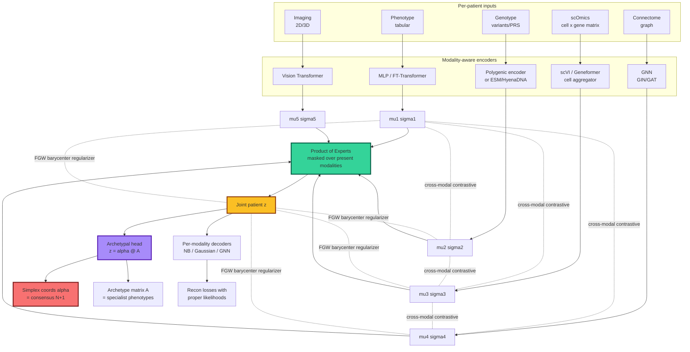

### 7.3 The total loss (the recipe)

$$\mathcal{L} = \underbrace{\sum_{m \in \text{present}} \mathcal{L}_{\text{recon}}^{(m)}}_{\text{reconstruction}} + \beta \underbrace{\text{KL}(q_\phi(z|x) \| p(z))}_{\text{ELBO regularizer}} + \lambda_c \underbrace{\sum_{m \ne m'} \mathcal{L}_{\text{InfoNCE}}^{(m, m')}}_{\text{paired contrastive}} + \lambda_g \underbrace{\sum_{m} \text{FGW}(C^{(m)}, C^{(\bar z)})}_{\text{geometry preserving}} + \lambda_a \underbrace{\| z - \alpha A \|^2 + \text{simplex priors}}_{\text{archetypal head}}$$

### 7.4 Why this combination

| Concern | Mechanism that addresses it |
|---|---|
| Missing modalities | PoE masks over present modalities (drop term, recompute mean/precision) |
| Pairing not exploited | InfoNCE positive = same patient across modalities |
| Metric structure destroyed | FGW barycenter penalty preserves intra-modality distances |
| No interpretable consensus | Archetypal head with simplex coords |
| Modality-specific stats | Proper likelihoods (NB for counts, Gaussian for continuous, etc.) |
| Disagreement between modalities | $\beta$-VAE plus MoPoE option if PoE too sharp |
| Scale heterogeneity | Modality-aware encoders (GNN for connectome, etc.) |

### 7.5 Cyclic training schedule (echoes MIDAA / your description)

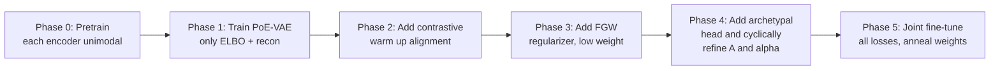

### 7.6 Variants if you want simpler

- **Minimal viable v0:** MOFA+ on all modalities. Get $Z$. Run linear AA on $Z$. Done.
- **v0.5:** Add SNF graph regularization to MOFA's $Z$.
- **v1:** PoE-VAE backbone with contrastive loss only (drop FGW for now).
- **v2:** Add FGW barycenter regularizer.
- **v3:** Full architecture with archetypal head.

Each version gives you a useful product. Aim for v0 in 2 weeks, v1 in 2 months, v2 in 4 months, v3 in 6 months.

---

## 8. Decision Tree for Your Setting

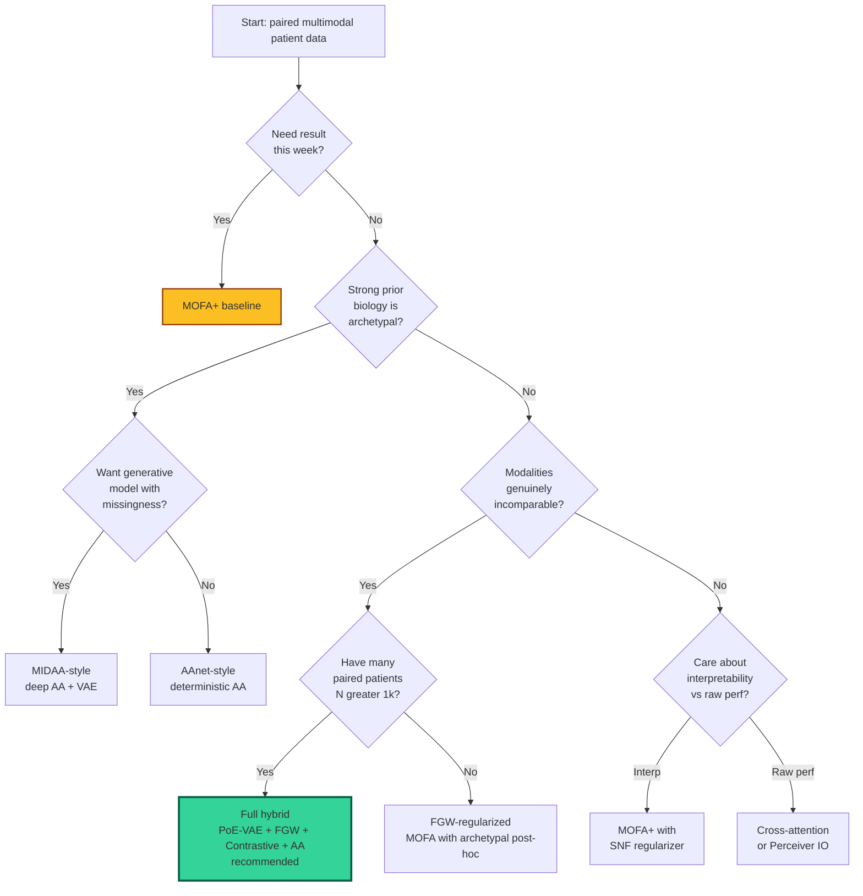

---

## 9. Implementation Roadmap

### 9.1 Quarterly plan

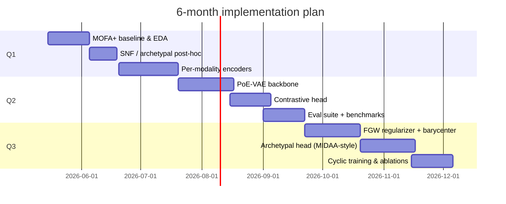

### 9.2 Stack (reference implementations)

| Component | Library / repo | Notes |
|---|---|---|
| MOFA+ | `mofapy2`, `MOFA2` R | Drop-in baseline |
| SNF | `SNFtool` R, `snfpy` | Graph fusion |
| OT / GW / FGW | `POT` (Python OT), `moscot`, `ott-jax` | Sliced/low-rank for scale |
| PoE-VAE | `Multigrate` (scvi-tools), custom PyTorch | scvi family is well-tested |
| Multimodal VAE general | `mhvae`, `multimodal-vae-public` | MoPoE implementations |
| Archetypal | `py_pcha`, `archetypes`, `MIDAA` | MIDAA for deep AA |
| Contrastive | `pytorch-metric-learning`, custom | Easy to roll your own |
| GNN (connectome) | `PyTorch Geometric`, `DGL` | GIN/GAT/GCN baselines |
| Single-cell encoders | `scvi-tools`, `Geneformer`, `scGPT` | Pretrained options |
| Tabular encoders | `pytorch-frame`, FT-Transformer | For phenotype |

### 9.3 Evaluation strategy

You need three buckets of metrics:

| Bucket | What it measures | Examples |
|---|---|---|
| **Geometry** | Distance preservation, mixing | k-NN preservation, trustworthiness, kBET, iLISI |
| **Pairing** | Cross-modal alignment | FOSCTTM (fraction of same cell tied to true match) |
| **Downstream task** | Predictive utility | Survival C-index, subtype classification AUC |
| **Interpretability** | Stability, biological coherence | Pathway enrichment in archetypes, factor stability |

**Run the Nature Methods 2025 benchmarking pipeline** (if applicable) on your data to position your method against the 40 algorithms they tested.

---

## 10. Pitfalls & Gotchas

### 10.1 Things that will bite you

| Trap | Symptom | Fix |
|---|---|---|
| **Posterior collapse** in PoE-VAE | Latent ignores some modalities | Anneal $\beta$, add modality-specific KL, use MoPoE |
| **Modal disagreement → sharp PoE** poisoning | One bad modality dominates | Use MoPoE or learnable expert weights |
| **InfoNCE degenerates** at small batch | Loss plateau, no learning | Increase batch size, use SupCon with extra positives |
| **Archetype K** chosen poorly | Either trivial or unstable | Use ParTI elbow, AIC/BIC, biological validation |
| **FGW too aggressive** | Loses modality-specific structure | Anneal $\lambda_g$, start at 0 and ramp |
| **Pairing leakage** in contrastive | Trivial alignment in encoder | Use linear projection head, tau temperature |
| **Connectome encoder** too expressive | GNN memorizes patient identity | Strong regularization, dropout, pooling |
| **Patient identity** as confounder | Embeddings cluster by site/batch | Add adversarial site classifier or HSIC |

### 10.2 Things people forget

- **Calibrate likelihood scales.** A 20k-gene NB log-likelihood will dwarf a 100-feature Gaussian. Normalize per-modality recon weights.
- **Use modality dropout during training.** Random masking forces robustness to missingness at test time.
- **Track per-modality KL.** A modality with KL near 0 is being ignored.
- **Archetypes are not centroids.** They are *extremes*. Sample a clinically heterogeneous cohort to get meaningful archetypes.
- **Pairing != batch.** If patient $i$ has all modalities, do not put it in different minibatches per modality during contrastive training.
- **Connectome graphs have permutation invariance.** Use GNN, not flatten + MLP.

### 10.3 Sanity checks before claiming success
1. Hold out a patient. Predict their missing modality from the others. Compare to per-modality mean baseline.
2. Permute patient IDs between modalities. Cross-modal alignment should drop to chance.
3. Cluster $\bar z$ (or $\alpha$) and check biological coherence (pathway enrichment, clinical labels).
4. Verify archetypes are interpretable (use ParTI-style task assignment).

---

## 11. References (anchored to recent and key work)

### Core methods
- Wang et al. **Similarity Network Fusion**. Nature Methods 2014.
- Argelaguet et al. **MOFA / MOFA+**. Genome Biology 2018, 2020.
- Welch et al. **LIGER**. Cell 2019. Online iNMF, Nature Biotech 2021.
- Lotfollahi et al. **Multigrate**. bioRxiv 2022.
- Ashuach et al. **MultiVI**. Nature Methods 2023.
- Demetci et al. **SCOT** (Gromov-Wasserstein). bioRxiv 2020. *J Comput Biol* 2022.
- Sutter et al. **MoPoE-VAE**. ICLR 2021.
- Shi et al. **MMVAE**. NeurIPS 2019.
- Cutler & Breiman. **Archetypal Analysis**. Technometrics 1994.
- Khosla et al. **Supervised Contrastive Learning**. NeurIPS 2020.
- Radford et al. **CLIP**. ICML 2021.
- Jaegle et al. **Perceiver / Perceiver IO**. ICML 2021, ICLR 2022.

### 2024-2026 work that matters most
- Milite, Caravagna, Sottoriva. **MIDAA: Deep Archetypal Analysis for multi-omics**. *Genome Biology* 26: 90 (2025). [paper](https://link.springer.com/article/10.1186/s13059-025-03530-9), [code](https://github.com/sottorivalab/midaa)
- Klein et al. **moscot: optimal transport unified framework**. *Nature* (2025). [paper](https://www.nature.com/articles/s41586-024-08453-2)
- Hwang et al. **Multimodal Variational Autoencoder: A Barycentric View**. *AAAI 2025*. [paper](https://arxiv.org/abs/2412.20487)
- Benchmarking single-cell multi-modal data integrations. *Nature Methods* (2025). [paper](https://www.nature.com/articles/s41592-025-02737-9)
- Multitask benchmarking of single-cell multimodal omics integration methods. *Nature Methods* (2025). [paper](https://www.nature.com/articles/s41592-025-02856-3)
- scSAGA: Single-cell Sampled Gromov-Wasserstein. *bioRxiv* (2026). [paper](https://www.biorxiv.org/content/10.64898/2026.03.26.714573v1)
- GENOT: Entropic (Gromov) Wasserstein Flow Matching for genomics. *Apple ML* (2024).
- CLCLSA: Cross-omics linked embedding with contrastive + self-attention. (2023).
- CMME: A deep contrastive multi-modal encoder for multi-omics. *Sci Direct* (2025).
- MIDAS: Mosaic integration with disentanglement. (2024-25).
- Masked Omics Modeling for histopathology + omics. *arXiv 2508.00969* (2025).

### Archetypal / Pareto biology
- Shoval et al. **Evolutionary Trade-Offs and Pareto Optimality**. *Science* 2012. [paper](https://www.science.org/doi/10.1126/science.1217405)
- Adler et al. **Cellular archetypes**. *PNAS* (2025). [paper](https://www.pnas.org/doi/10.1073/pnas.2530194123)
- **Spatial ecotypes for tumor microenvironment**. *Nature* (2026). [paper](https://www.nature.com/articles/s41586-026-10452-4)
- **Topographical archetypes of somatic mutagenesis in cancer**. *bioRxiv* (2026). [paper](https://www.biorxiv.org/content/10.64898/2026.04.18.719374v1)
- **AAnet for spatial intratumoral heterogeneity**. *Cancer Discovery* 15(10): 2139 (2025).

---

## 12. Appendix: Quick Math Reference

### A. PoE Gaussian product (closed form)
$$\Sigma^{-1} = \sum_m \Sigma_m^{-1}, \quad \mu = \Sigma \sum_m \Sigma_m^{-1} \mu_m$$

### B. InfoNCE contrastive
$$\mathcal{L} = -\frac{1}{B} \sum_{i=1}^B \log \frac{e^{z_i^{(a)} \cdot z_i^{(b)} / \tau}}{\sum_{j=1}^B e^{z_i^{(a)} \cdot z_j^{(b)} / \tau}}$$

### C. Gromov-Wasserstein
$$\text{GW}^2(\mu, \nu, C^a, C^b) = \min_{\pi \in \Pi(\mu, \nu)} \sum_{i,j,k,l} | C^a_{ij} - C^b_{kl} |^2 \pi_{ik}\pi_{jl}$$

### D. Fused Gromov-Wasserstein
$$\text{FGW}_\alpha = \min_\pi (1-\alpha) \langle M, \pi \rangle + \alpha \sum_{ijkl} | C^a_{ij} - C^b_{kl} |^2 \pi_{ik}\pi_{jl}$$

### E. Archetypal Analysis
$$\min_{A, \alpha, \beta} \| X - \alpha A \|^2 \quad \text{s.t.} \quad A = \beta X, \quad \alpha \in \Delta^{K-1}, \quad \beta_k \in \Delta^{N-1}$$

### F. FGW Barycenter (your N+1 anchor)
$$\bar{z} = \arg\min_{z} \sum_m \lambda_m \, \text{FGW}(C^{(m)}, C^{(z)}, M^{(m, z)})$$

---

## 13. Final Heuristic Summary (refrigerator-magnet version)

1. **Start with MOFA+** to get an interpretable baseline this month.
2. **Add a PoE-VAE** (Multigrate) when you want a generative joint posterior with missingness.
3. **Add a contrastive loss** because you have paired data and you should use it.
4. **Add an FGW barycenter regularizer** to preserve cross-modal geometry, because Wasserstein cannot handle the fact that your modalities live in different spaces.
5. **Add an archetypal head** for an interpretable N+1 consensus that aligns with multi-task evolutionary theory.
6. **Cyclic training** alternating modalities with the consensus, à la MIDAA / your description.
7. **Validate** with hold-one-modality-out, permutation tests, archetype interpretability.

The whole architecture is a **principled stack** rather than a kitchen sink: each loss has a specific job, and removing any one of them costs you a specific property in your wishlist.

---

*Document version 1.0. Ping for revisions.*
