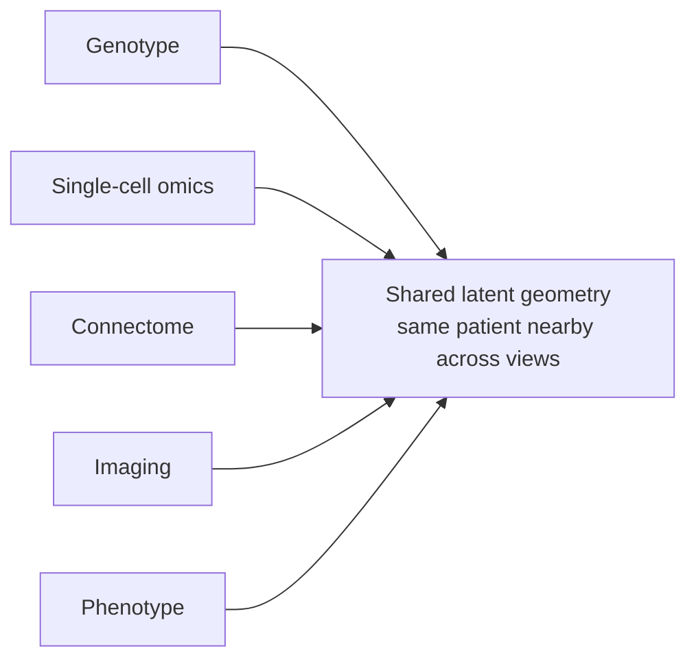

# Multimodal co-embedding (readable)

> **Status:** Active · **Date:** 2026-07-01 · **Variant:** readable (ADHD-friendly). **Technical sources:** [methods review](multimodal-coembedding-methods-review.md) + [addendum](multimodal-coembedding-addendum.md).
> **Reading time:** ~3 minutes.

> [!IMPORTANT]
> **If you only read one thing:** One patient is seen from many angles (genes, single-cell omics, connectome, imaging, behavior). The goal is **one shared geometry** where the same patient sits in the same place across every view. Start with **MOFA+** (fast, interpretable); the best architecture is a **hybrid PoE-VAE + contrastive + archetypal** head.

## The setup

Patients are **paired**: the same person appears in every modality. That single fact simplifies everything.

## The recommendations

| Question | Answer |
|---|---|
| Fastest interpretable start? | **MOFA+** (weeks) |
| Best full architecture? | **PoE-VAE backbone + cross-modal contrastive loss + archetypal projection head** (3 to 6 months) |
| Missing modalities? | Handled natively by **Product-of-Experts masking** |
| Interpretable anchors? | **Archetypal analysis** (extreme-phenotype corners, not abstract dimensions) |

## What the addendum changed

> [!TIP]
> Because patients are already paired, you **do not need full optimal transport (FGW)** to discover correspondences. Simpler **CKA** (Centered Kernel Alignment) compares whether two modalities share the same relational geometry, works as a differentiable training loss, and is the modern default. Procrustes and Mantel tests are fallbacks.

The four addendum deep-dives: **Q1** FGW is overkill when paired (use CKA); **Q2** cross-attention needs careful masking to avoid modality-identity leakage; **Q3** mixture-of-experts gives each modality a specialist sub-network; **Q4** causal (SCM) models enable interventional queries such as "what would this connectome look like if the polygenic risk changed".

## Why it matters for Cytoverse
This is how the [phenotype coordinate system](neurobehavioral-phenotype-feature-space.md) gets learned across modalities into one geometry, the geometry Cytoverse places a person on. See [science-foundation](../../03-Products/Cytoverse/science-foundation.md).

> [!WARNING]
> Causal multimodal models are powerful but data-hungry; treat Q4 as a direction, not a near-term default.
