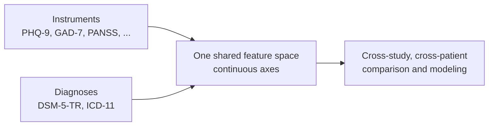

# Neurobehavioral phenotype feature space (readable)

> **Status:** Active · **Date:** 2026-07-01 · **Variant:** readable (ADHD-friendly). **Technical source:** [neurobehavioral-phenotype-feature-space.md](neurobehavioral-phenotype-feature-space.md).
> **Reading time:** ~3 minutes.

> [!IMPORTANT]
> **If you only read one thing:** Cytognosis needs a **stable, shared set of axes** for the brain and psyche, the way RNA-seq needs a fixed gene list before you can compare samples. No existing ontology covers every domain we need, so the design **stacks six layers** into one feature space, and every feature carries a **five-part ID** so any model can query it at any resolution.

## The problem in one picture

Different studies use different questionnaires and different diagnostic labels. Projecting all of them onto **one continuous axis set** makes them comparable.

## The six-layer stack

| Layer | Role | Anchored by |
|---|---|---|
| Metamodel | Formal scaffolding | BFO / IAO |
| Function scaffold | WHO-blessed mid-grain | ICF |
| Upper mental types | Mind and emotion categories | MF / MFOEM |
| Mid constructs | Dimensional and mechanistic | **HiTOP** (dimensional), **RDoC** (mechanistic) |
| Clinical leaves | Named signs and symptoms | HPO, SNOMED CT |
| Operational items | The actual question or test | PROMIS, CDISC QRS |

> [!TIP]
> Rules of thumb: **HiTOP** is the best dimensional backbone, **RDoC** is the best neuroscience anchor, **ICF** is the WHO scaffold that ties them together.

## Why it matters for Cytoverse

- Diagnoses (DSM-5-TR, ICD-11) become **reconstructable as combinations of features**, bridging the categorical and dimensional views.
- The axes are the coordinate system Cytoverse places a person on. See [science-foundation](../../03-Products/Cytoverse/science-foundation.md).
- It pairs with the [instrument reference](cdisc-qrs-instrument-reference.md) (what each questionnaire measures) and the [co-embedding review](multimodal-coembedding-methods-review.md) (how the geometry is learned across modalities).

> [!WARNING]
> **Honest gap:** this six-layer stack does not exist as a public resource. Cytognosis has to curate it. The design doc is a specification, not a finished ontology.
