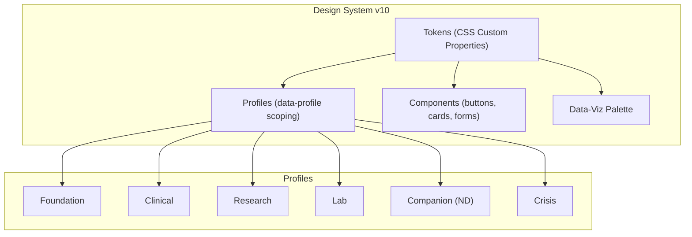
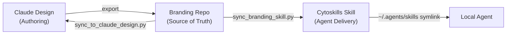
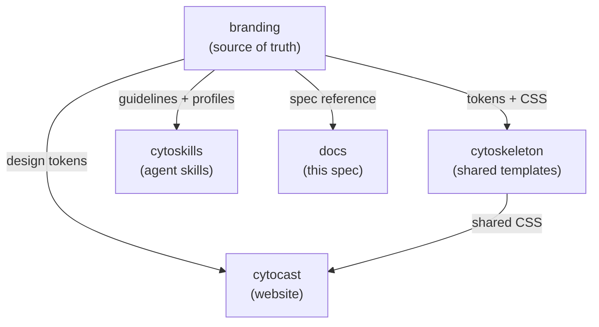

# Cytognosis Design System v10.1.0 — Technical Specification

> **Status**: Active · **Version**: 10.1.0 · **Last synced**: 2026-05-19
> **Claude Design project**: [`db29365a-e44f-4ca8-a947-3b669bdb7264`](https://claude.ai/design/p/db29365a-e44f-4ca8-a947-3b669bdb7264)

## 1. Overview

The Cytognosis Design System defines the visual identity, interaction patterns, and token architecture for all Cytognosis Foundation surfaces. It covers the public website, patient-facing applications, research workbenches, developer tools, cognitive support companions, and health crisis overlays.

The system uses CSS custom properties as its token layer, fluorophore-derived colors as its palette foundation, and a profile-scoping mechanism (`data-profile`) to adapt typography, color emphasis, and interaction patterns to each surface's audience.

### 1.1 Design Principles

| Principle | Description |
|-----------|-------------|
| Scientific Clarity | Visuals convey trust, precision, and rigor |
| Human-Centered | Accessibility and inclusivity come first |
| Fluorophore-Derived | Every color traces to a real dye wavelength |
| Profile-Scoped | One system, six surfaces, each tuned to its reader |
| Sync-First | Three canonical locations stay in lockstep |

### 1.2 Architecture Diagram



## 2. Profile System

The design system defines six profiles. Each profile scopes under `[data-profile="<name>"]` in CSS, so a single page can mix profiles (for example, a research app with a foundation-styled marketing header).

### 2.1 Profile Matrix

| Profile | Surface | Type Stack | Palette Emphasis | Voice | Touch Target |
|---------|---------|-----------|-----------------|-------|-------------|
| **Foundation** | cytognosis.org, social, decks | Inter, Newsreader, JetBrains Mono | Signature triad gradient | Visionary, hopeful | 44px |
| **Clinical** | Patient/consumer app | Inter, Source Serif Pro, JetBrains Mono | Muted 300-shade pastels | Calm, reassuring | 44px |
| **Research** | Cytoverse workbench, dashboards | IBM Plex Sans, IBM Plex Mono | Indigo + magenta alert | Precise, neutral | 44px |
| **Lab** | CLI, editor, dev docs, logs | Recursive (one family, all axes) | Violet-300 on ink | Technical, playful | 44px |
| **Companion** | Yar, health companions, ND support | Lexend, Atkinson Hyperlegible Mono | Muted 300-shade, calming | Supportive, gentle | 48px |
| **Crisis** | Health alerts, anomaly notifications | Inter, JetBrains Mono | High-contrast coral accent | Direct, clear | 56px |

### 2.2 Profile Scoping

Apply a profile to any HTML element using the `data-profile` attribute:

```html
<!-- Single profile page -->
<body data-profile="foundation">...</body>

<!-- Mixed profiles on one page -->
<header data-profile="foundation">...</header>
<main data-profile="research">...</main>

<!-- Crisis overlay on any profile -->
<dialog data-profile="crisis">...</dialog>
```

Tokens cascade within each scope. Fonts and palette emphasis re-bind automatically.

### 2.3 Foundation Profile

The public face of the brand. Reads at poster scale; carries aspiration.

- Signature gradient (azure → violet → indigo, 135°) for hero washes and primary CTAs
- Magenta is attention accent only, never in the identity triad
- Headings 40–52px, letter-spacing -0.02em, weight 800
- Body 16–17px, line-height 1.6

### 2.4 Clinical Profile

Someone just opened this because their biomarkers drifted. Typography recedes.

- Emphasis shade uses the muted 300-scale (violet-300, azure-300)
- Coral reserved for alerts that genuinely need attention; magenta never appears
- Headings 22–30px, weight 600
- Body 15–16px, line-height 1.65
- Backgrounds are warm off-white (`#F5F5FA`, `#FAF7FF`), never pure white

### 2.5 Research Profile

Scientists scan tables, skim log output, inspect model internals.

- IBM Plex Sans + Plex Mono share metrics for jitter-free table alignment
- Dark ink (`#13131F`, `#1C1C2E`) reduces glare across 8-hour sessions
- Indigo (`#5145A8`) is default emphasis; magenta (`#E0309E`) flags anomalies
- Tabular numerals on every numeric cell (`.tabular`)

### 2.6 Lab Profile

`cytoctl`, the cytognosis-dusk terminal theme, dev docs, log streams.

- Recursive covers display, body, and mono in one variable font file
- Axes: `CASL` 0–1, `MONO` 0–1, `slnt` -15–0, `wght` 300–700
- Default: `CASL 0.25, MONO 0, slnt 0, wght 430`
- `.code` flips `MONO` to 1; `.q` pushes `CASL` to 0.9 and `slnt` to -8

### 2.7 Companion Profile (ADHD/ND)

Neurodiversity-first surface for daily cognitive support. See §9 for full ADHD/ND extension details.

- Lexend font for validated reading fluency improvement
- Motion disabled by default (opt-in via `data-motion="enabled"`)
- Maximum content width 65ch to prevent line-tracking loss
- Generous spacing: line-height 1.7, paragraph spacing 1.5em
- Gamification tokens for dopamine-supportive micro-rewards
- Density control via `data-density` attribute (compact, comfortable, spacious)

### 2.8 Crisis Profile

High-urgency surface for health alerts and situations requiring immediate attention.

- Single-action focus: one primary CTA per screen
- All non-essential UI chrome stripped away
- No animations, no transitions, no distractions
- Coral as urgency accent (never red, never magenta)
- Touch targets at 56px minimum for stressed motor control
- Severity levels: low (azure-300), medium (amber), high (coral), critical (bright coral)
- Can layer on top of any other profile as an overlay

## 3. Token Architecture

All tokens are CSS custom properties defined in `:root` and overridden per profile scope. The canonical token file is `design-system/tokens/design-tokens.css` (310 lines, 157+ variables).

### 3.1 Token Categories

| Category | Prefix | Example | Count |
|----------|--------|---------|-------|
| Color (palette) | `--cg-<hue>-<shade>` | `--cg-violet-600` | ~60 |
| Color (semantic) | `--fg-*`, `--bg-*`, `--border-*` | `--fg-1`, `--bg-2` | ~12 |
| Color (brand) | `--brand-*`, `--link*` | `--brand-primary` | ~6 |
| Gradient | `--cg-gradient-*` | `--cg-gradient-signature` | 6 |
| Typography | `--font-*`, `--text-*` | `--font-display`, `--text-h1` | ~20 |
| Spacing | `--space-*` | `--space-md` | 8 |
| Radius | `--radius-*` | `--radius-lg` | 6 |
| Shadow | `--shadow-*` | `--shadow-glow-violet` | 7 |
| Motion | `--dur-*`, `--ease-*` | `--dur-base` | 6 |
| Glass | `--glass-*` | `--glass-bg` | 3 |
| Semantic state | `--success`, `--warning`, etc. | `--error` | 4 |

### 3.2 Token Naming Convention

```
--cg-<category>-<modifier>

Examples:
  --cg-violet-600      palette: hue + shade (50–950)
  --cg-gradient-signature  gradient: name
  --fg-1               semantic foreground: level (1=stark, 4=disabled)
  --bg-2               semantic background: level (1=deepest, 4=card)
  --font-display       typography: role
  --text-h1            typography: scale step
  --space-md           spacing: t-shirt size
  --radius-lg          radius: t-shirt size
  --shadow-glow-violet shadow: type + hue
  --dur-base           motion: speed
  --glass-bg           glass: property
```

### 3.3 Canonical CSS Files

| File | Location | Purpose | Size |
|------|----------|---------|------|
| `design-tokens.css` | `design-system/tokens/` | All `:root` tokens | 12KB |
| `cytognosis-tokens.css` | `web/css/` | Mirror of design-tokens.css | 12KB |
| `brand-variables.css` | `web/css/` | Extended brand variables | 14KB |
| `profiles.css` | `design-system/profiles/` | Foundation, Clinical, Research, Lab | 6KB |
| `companion.css` | `design-system/profiles/` | Companion (ND) profile | 9KB |
| `crisis.css` | `design-system/profiles/` | Crisis profile | 7KB |
| `base.css` | `web/css/` | Foundation styles | 7KB |
| `styles.css` | `web/css/` | Full stylesheet | 21KB |

## 4. Color System

Every color in the Cytognosis palette derives from a real fluorescent dye emission wavelength. This anchors the visual identity in the same cellular biology the platform studies.

### 4.1 Identity Palette

| Token | Hex | Fluorophore Source | Wavelength | Role |
|-------|-----|--------------------|-----------|------|
| `--cg-violet-600` | `#8B3FC7` | DAPI | 461nm | **Primary brand**, signature violet |
| `--cg-azure-600` | `#3B7DD6` | Alexa Fluor 488 | 488nm | The Patient, data, input |
| `--cg-indigo-500` | `#5145A8` | UV excitation dye | 358nm | The Pioneer, AI, depth |
| `--cg-teal-600` | `#14A3A3` | GFP | 509nm | Biological harmony, success |
| `--cg-coral-600` | `#F26355` | MitoTracker | 576nm | Human warmth, hope |
| `--cg-magenta-600` | `#E0309E` | Rhodamine | 565nm | **Attention accent only** |

### 4.2 Shade Scale

Each hue provides an 11-step shade scale (50, 100, 200, 300, 400, 500, 600, 700, 800, 900, 950):

- **50–200**: Tints for backgrounds and subtle fills
- **300**: Daily-use token for muted emphasis
- **400–500**: Mid-range for interactive states
- **600**: Main brand shade (primary reference)
- **700–950**: Shades for text, borders, deep backgrounds

### 4.3 Neutral System

All neutrals carry an indigo undertone (hue ~240). Never use pure gray.

| Token | Hex | Name | Usage |
|-------|-----|------|-------|
| `--cg-abyss` | `#0A0A14` | Abyss | Page background (dark) |
| `--cg-deep` | `#13131F` | Deep | Content area background |
| `--cg-neutral-950` | `#1A1A2E` | Deep Night | Sidebar |
| `--cg-neutral-900` | `#1E1E32` | Rich Night | Panels |
| `--cg-neutral-800` | `#262640` | Bold Night | Editor |
| `--cg-neutral-700` | `#303050` | Core Night | Cards |
| `--cg-neutral-600` | `#3D3D5C` | Lite Night | Borders |
| `--cg-neutral-500` | `#50506E` | Mist Night | Muted text |
| `--cg-neutral-400` | `#A8A8C0` | Mist Day | Light muted |
| `--cg-neutral-300` | `#C4C4D8` | Lite Day | Light borders |
| `--cg-neutral-200` | `#E0E0ED` | Soft Day | Body text (light) |
| `--cg-neutral-100` | `#F0F0F7` | Pale Day | Light panels |
| `--cg-neutral-50` | `#F8F8FC` | Ghost Day | Light page bg |

### 4.4 Gradient System

| Token | Definition | Semantic |
|-------|-----------|----------|
| `--cg-gradient-signature` | `linear-gradient(135deg, #3B7DD6 0%, #8B3FC7 50%, #5145A8 100%)` | The Patient to Pioneer journey |
| `--cg-gradient-innovation` | `linear-gradient(135deg, #14A3A3 0%, #3B7DD6 50%, #8B3FC7 100%)` | Discovery path |
| `--cg-gradient-vitality` | `linear-gradient(135deg, #8B3FC7 0%, #F26355 50%, #B580E6 100%)` | Life force |
| `--cg-gradient-data` | `linear-gradient(135deg, #3B7DD6 0%, #5145A8 50%, #6B5DC7 100%)` | Data flow |
| `--cg-gradient-alert` | `linear-gradient(135deg, #E0309E 0%, #F26355 100%)` | Attention |
| `--cg-gradient-page` | `linear-gradient(180deg, #0A0A14 0%, #13131F 100%)` | Page wash |

### 4.5 Semantic Color Tokens

| Token | Value | Usage |
|-------|-------|-------|
| `--fg-1` | `#F8F8FC` | Headings on dark |
| `--fg-2` | `#E0E0ED` | Body text on dark |
| `--fg-3` | `#A6ADC8` | Muted text |
| `--fg-4` | `#50506E` | Disabled, divider text |
| `--bg-1` | `var(--cg-abyss)` | Page background |
| `--bg-2` | `var(--cg-neutral-900)` | Panel |
| `--bg-3` | `var(--cg-neutral-800)` | Elevated surface |
| `--bg-4` | `var(--cg-neutral-700)` | Card |
| `--success` | `#10B981` | Success state |
| `--warning` | `#F59E0B` | Warning state |
| `--error` | `#EF4444` | Error state |
| `--info` | `var(--cg-azure-600)` | Informational |

### 4.6 Glassmorphism

```css
--glass-bg:     rgba(30, 30, 50, 0.50);
--glass-border: rgba(255, 255, 255, 0.10);
--glass-blur:   blur(12px);
```

Use glassmorphism for elevated UI elements: modals, floating panels, toolbar overlays. Apply `backdrop-filter: var(--glass-blur)` with the glass background and border tokens.

## 5. Typography System

### 5.1 Font Stacks

The system provides three primary stacks plus accessibility alternates:

| Role | Token | Default Stack | Profile Override |
|------|-------|--------------|-----------------|
| Display/Headings | `--font-display` | Inter, system-ui, sans-serif | Recursive (Lab), Lexend (Companion) |
| Body | `--font-body` | Inter, system-ui, sans-serif | IBM Plex Sans (Research), Lexend (Companion) |
| Accent/Editorial | `--font-accent` | Newsreader, Source Serif Pro, serif | Source Serif Pro (Clinical), Recursive (Lab) |
| Code | `--font-code` | JetBrains Mono, Fira Code, monospace | IBM Plex Mono (Research), Atkinson Hyperlegible Mono (Companion) |
| Documentation | `--font-docs` | Lexend, Inter, sans-serif | Used in companion, docs surfaces |
| Accessibility | `--font-a11y` | Atkinson Hyperlegible, Inter, sans-serif | On-demand for vision accessibility |

### 5.2 Alternate Stacks

| Category | Alt 1 | Alt 2 |
|----------|-------|-------|
| Display + Body | General Sans (warmer, distinctive) | IBM Plex Sans (computational, clinical) |
| Accent | Source Serif Pro (medical-journal) | Recursive (same-family mono + accent) |
| Code | Fira Code (familiar ligatures) | Recursive Mono (pairs with Recursive accent) |

### 5.3 Type Scale

The system uses a major third scale (ratio 1.250):

| Token | Rem | Pixels | Usage |
|-------|-----|--------|-------|
| `--text-h1` | 3.052rem | 48.8px | Primary headings |
| `--text-h2` | 2.441rem | 39.0px | Section headings |
| `--text-h3` | 1.953rem | 31.2px | Sub-sections |
| `--text-h4` | 1.563rem | 25.0px | Card titles |
| `--text-h5` | 1.25rem | 20px | Minor headings |
| `--text-h6` | 1rem | 16px | Label headings |
| `--text-body-lg` | 1.125rem | 18px | Lead paragraphs |
| `--text-body` | 1rem | 16px | Body text |
| `--text-body-sm` | 0.875rem | 14px | Small body |
| `--text-caption` | 0.75rem | 12px | Captions, metadata |

### 5.4 Typography Rules

- Headings: `font-weight: 700`, `letter-spacing: -0.02em` (h1), `-0.015em` (h2)
- Body: `line-height: 1.6`, max-width `75ch`
- Blockquotes: accent font, italic, violet-300, left border in violet-600
- Code: `0.875em` relative size, azure-300 on bg-3 for inline, bg-2 for blocks
- `prefers-reduced-motion`: all durations collapse to 0.01ms

## 6. Spacing and Layout

### 6.1 Spacing Scale (8px base)

| Token | Value | Usage |
|-------|-------|-------|
| `--space-xs` | 4px | Tight gaps, icon padding |
| `--space-sm` | 8px | Inline spacing, small gaps |
| `--space-md` | 16px | Standard paragraph margin, card padding |
| `--space-lg` | 24px | Section gaps |
| `--space-xl` | 32px | Large section gaps |
| `--space-2xl` | 48px | Page section separators |
| `--space-3xl` | 64px | Hero section spacing |
| `--space-4xl` | 96px | Full-page vertical rhythm |

### 6.2 Border Radius

| Token | Value | Usage |
|-------|-------|-------|
| `--radius-sm` | 4px | Inline code, badges |
| `--radius-md` | 8px | Buttons, inputs |
| `--radius-lg` | 12px | Cards |
| `--radius-xl` | 16px | Modals, panels |
| `--radius-2xl` | 20px | Hero cards |
| `--radius-pill` | 9999px | Pill buttons, tags |

### 6.3 Shadow System

| Token | Value | Usage |
|-------|-------|-------|
| `--shadow-sm` | `0 1px 2px rgba(26,26,46,0.05)` | Subtle elevation |
| `--shadow-md` | `0 4px 6px rgba(26,26,46,0.10)` | Cards |
| `--shadow-lg` | `0 10px 15px rgba(26,26,46,0.15)` | Dropdowns |
| `--shadow-xl` | `0 20px 25px rgba(26,26,46,0.20)` | Modals |
| `--shadow-glow-violet` | `0 0 40px rgba(202,160,240,0.30)` | Brand glow |
| `--shadow-glow-indigo` | `0 0 40px rgba(81,69,168,0.30)` | AI/data glow |
| `--shadow-glow-magenta` | `0 0 30px rgba(224,48,158,0.20)` | Alert glow |

### 6.4 Motion Tokens

| Token | Value | Usage |
|-------|-------|-------|
| `--dur-fast` | 150ms | Hover states, toggles |
| `--dur-base` | 250ms | Standard transitions |
| `--dur-slow` | 350ms | Panel slides |
| `--dur-slower` | 500ms | Page transitions |
| `--ease-in` | `cubic-bezier(0.4, 0, 1, 1)` | Entering elements |
| `--ease-out` | `cubic-bezier(0, 0, 0.2, 1)` | Exiting elements |
| `--ease-in-out` | `cubic-bezier(0.4, 0, 0.2, 1)` | Standard easing |

## 7. Component Layer

Components live in `design-system/components/` and `web/css/components/`. They consume tokens from the base layer and adapt to profile scopes.

### 7.1 Component Categories

| Category | Components |
|----------|-----------|
| Actions | Buttons (primary, secondary, ghost, danger), links, CTAs |
| Containers | Cards, panels, dialogs, modals, banners |
| Data Display | Tables, badges, status indicators, progress bars |
| Forms | Inputs, selects, checkboxes, radio buttons |
| Navigation | Nav bars, tabs, breadcrumbs, sidebars |
| Feedback | Alerts, toasts, tooltips, loading indicators |

### 7.2 Data Visualization

The data-viz palette lives in `design-system/data-viz/` and `profiles/dataviz.css`. It provides:

- Sequential ramps (indigo → magenta for severity)
- Categorical palettes (6 and 12-color sets)
- Diverging scales
- Heatmap colors
- Accessibility-safe color combinations

## 8. Sync Protocol

The design system has three canonical locations that must stay synchronized:



### 8.1 Three Canonical Locations

| Location | Role | Path |
|----------|------|------|
| **Claude Design** | Interactive authoring environment | `claude.ai/design/p/db29365a-...` |
| **Branding Repo** | Version-controlled source of truth | `cytognosis/branding` |
| **Cytoskills Skill** | Operational delivery for AI agents | `cytoskills/skills/cytognosis/cytognosis-branding` |

### 8.2 Sync Scripts

| Script | Location | Direction |
|--------|----------|-----------|
| `sync_from_claude_design.py` | `branding/scripts/` | Claude Design → Branding Repo |
| `sync_to_claude_design.py` | `branding/scripts/` | Branding Repo → Claude Design |
| `claude_design_diff.py` | `branding/scripts/` | Drift detection (all three locations) |
| `sync_branding_skill.py` | `cytoskills/scripts/` | Branding Repo → Cytoskills Skill |

### 8.3 Sync Workflow

1. Export changed files from Claude Design
2. Run `sync_from_claude_design.py --input <export-dir>`
3. Run `sync_branding_skill.py --verbose` (optionally with `--local`)
4. Commit to both repos
5. Run `sync_to_claude_design.py` to close the loop
6. Verify with `claude_design_diff.py`

### 8.4 Mapping Rules (sync_branding_skill.py)

| Source (branding repo) | Destination (skill references) |
|------------------------|-------------------------------|
| `guidelines/01_*.md` through `guidelines/12_*.md` | `references/01_*.md` through `references/12_*.md` |
| `guidelines/ACCESSIBILITY.md` | `references/accessibility.md` |
| `design-system/profiles/README.md` | `references/profiles.md` |
| `design-system/profiles/companion.css` (comment header) | `references/companion-profile.md` (generated) |
| `design-system/profiles/crisis.css` (comment header) | `references/crisis-profile.md` (generated) |

### 8.5 Drift Detection

The CI workflow `claude-design-drift.yml` runs automatically on every push to `main`. Run manual checks with:

```bash
cd ~/repos/cytognosis/branding
python3 scripts/claude_design_diff.py
# Should report zero critical differences
```

## 9. ADHD/ND Extensions

Two profiles specifically address neurodivergent users: Companion and Crisis. These profiles follow evidence-based design principles from Chen, Meng & Nie (2026), Blue Lin (CHI 2024), Miller's Law, Sweller's Cognitive Load Theory, and Paivio's Dual Coding Theory.

### 9.1 Companion Profile Design Principles

| Principle | Implementation |
|-----------|---------------|
| Reduce cognitive load | Progressive disclosure, generous spacing |
| Calming palette | Muted 300-shade scale, no saturated accents |
| Motion-safe default | All animations disabled; opt-in via `data-motion="enabled"` |
| Reading fluency | Lexend font (validated improvement in reading speed) |
| Dopamine support | Gamification tokens for micro-rewards (streaks, achievements) |
| Line tracking | Max content width 65ch |
| No pure extremes | Never pure black or pure white backgrounds |
| Font choice | User-selectable: Lexend, Inter, Atkinson, OpenDyslexic |
| Density control | `data-density` attribute: compact (1.0), comfortable (1.2), spacious (1.5) |

### 9.2 Companion Cognitive Signal Colors

| Signal | Token | Color | Purpose |
|--------|-------|-------|---------|
| Focus | `--cg-signal-focus` | `#9BC5F7` (azure-300) | Attention tracking |
| Energy | `--cg-signal-energy` | `#F0A0C8` (magenta-300) | Energy level |
| Mood | `--cg-signal-mood` | `#CAA0F0` (violet-300) | Emotional state |
| Sleep | `--cg-signal-sleep` | `#7FE8E8` (teal-300) | Rest quality |
| Stress | `--cg-signal-stress` | `#F0A080` (coral-300) | Stress indicator |

### 9.3 Crisis Profile Design Principles

| Principle | Implementation |
|-----------|---------------|
| Maximum clarity | High contrast, large typography (18px minimum) |
| Single-action focus | One primary CTA per screen |
| Strip distractions | Hide all decorative elements, badges, avatars |
| Zero motion | All animations and transitions disabled via `!important` |
| Warm urgency | Coral accent (never red, never magenta) |
| Motor accommodation | Touch targets at 56px for stressed motor control |
| Overlay-capable | Can layer on any profile as `<dialog>` or banner |

### 9.4 Crisis Severity Scale

| Level | Token | Color | Usage |
|-------|-------|-------|-------|
| Low | `--cg-crisis-low` | `#9BC5F7` (azure-300) | Informational alerts |
| Medium | `--cg-crisis-medium` | `#E8C040` (amber) | Caution notices |
| High | `--cg-crisis-high` | `#F26355` (coral) | Urgent actions |
| Critical | `--cg-crisis-critical` | `#FF6B6B` (bright coral) | Emergency states |

## 10. Asset Inventory

### 10.1 Asset Manifest

Assets are managed through `assets/manifest.yaml` and stored in the branding repo:

| Asset Package | Version | Path | Contents |
|--------------|---------|------|----------|
| cytognosis-icons | 1.0.0 | `assets/icons/` | 14 core SVGs, 10 style variants (solid, gradient, wireframe, glassmorphism, therapeutic, biorender, duotone) |
| cytognosis-fonts | 1.0.0 | `assets/fonts/` | Inter (primary), NERD font variants for terminal |
| cytognosis-logos | 1.0.0 | `assets/logos/` | Official logos in SVG + PNG, wordmarks, marks, dark/light variants |
| cytognosis-design-system | 10.0.0 | `design-system/` | Tokens, components, profiles, data-viz kit, previews |
| cytognosis-templates | 1.0.0 | `templates/` | Slide deck, email signature, document templates |

### 10.2 Logo System

| Variant | Format | Usage |
|---------|--------|-------|
| Primary wordmark | SVG, PNG | Website headers, documents |
| Mark only | SVG, PNG | Favicons, small contexts |
| Dark variant | SVG, PNG | Dark backgrounds |
| Light variant | SVG, PNG | Light backgrounds |
| Archive versions | SVG, PNG | Historical reference |

### 10.3 Icon System

Icon style: Phosphor Icons, outlined, 2px stroke. The icon library provides 14 core icons across 10 style variants:

- Solid, Gradient, Wireframe
- Glassmorphism, Therapeutic
- BioRender, Duotone
- And three additional stylistic variants

### 10.4 Product Visual Identity

| Product | Visual Treatment | Primary Color |
|---------|-----------------|---------------|
| Cytoverse (The Map) | Network topology, coordinate grids | Azure `#3B7DD6` |
| Cytoscope (The Sensor) | Waveform patterns, signal traces | Teal `#14A3A3` |
| Cytonome (The Navigator) | Decision trees, flow paths | Violet `#8B3FC7` |
| Yar (Companion) | Organic shapes, calming gradients | Violet-300 `#CAA0F0` |

## 11. Relationship to Other Repos



| Repo | Relationship | What Flows |
|------|-------------|-----------|
| **cytoskeleton** | Downstream consumer | Shared tokens via `templates/shared/css/`. Uses `nox -s diff` for drift detection. |
| **cytocast** | Downstream consumer | Design tokens for the website. CSS custom properties and component styles. |
| **cytoskills** | Downstream mirror | Branding skill references for AI agents. Synced via `sync_branding_skill.py`. |
| **docs** | Documentation home | This spec document. Design decisions and ADRs. |

## 12. Brand Guidelines

The branding repo contains a 12-section brand book in `guidelines/`:

| Section | File | Topic |
|---------|------|-------|
| 01 | `01_brand_foundation.md` | Mission, vision, values |
| 02 | `02_voice_and_tone.md` | Voice rules, tone by audience |
| 03 | `03_logo.md` | Logo system and usage |
| 04 | `04_color_system.md` | Full color specification |
| 05 | `05_typography.md` | Font stacks and type scale |
| 06 | `06_iconography.md` | Icon system and usage |
| 07 | `07_imagery.md` | Photography and illustration |
| 08 | `08_motion.md` | Animation and transition rules |
| 09 | `09_layout.md` | Grid, spacing, responsive |
| 10 | `10_templates.md` | Document and deck templates |
| 11 | `11_accessibility.md` | WCAG compliance, ND support |
| 12 | `12_dataviz.md` | Data visualization palette |

A concatenated version exists as `MASTER_GUIDELINES.md` (67KB).

## 13. Accessibility Requirements

| Requirement | Standard | Implementation |
|-------------|----------|---------------|
| Color contrast (body) | WCAG AAA (7:1) | Indigo-tinted neutrals on dark bg |
| Color contrast (large text) | WCAG AA (4.5:1) | All heading/body combinations tested |
| Touch target | 44px minimum (48px Companion, 56px Crisis) | CSS min-height/min-width |
| Focus indicators | 3px visible ring, 3–4px offset | `outline` with `outline-offset` |
| Reduced motion | `prefers-reduced-motion: reduce` | All durations → 0.01ms |
| Font readability | Validated accessibility fonts | Lexend, Atkinson Hyperlegible available |
| Content width | Max 65–75ch | Prevents line-tracking loss |
| Keyboard navigation | Full tab order | Semantic HTML + focus management |

## Appendix A: Quick Reference Card

```
Design System:    v10.1.0
Last synced:      2026-05-19
Claude Design:    db29365a-e44f-4ca8-a947-3b669bdb7264

Primary violet:   #8B3FC7  (DAPI, 461nm)
Primary azure:    #3B7DD6  (Alexa Fluor, 488nm)
Primary indigo:   #5145A8  (UV, 358nm)

Font display:     Inter
Font accent:      Newsreader
Font code:        JetBrains Mono
Font a11y:        Lexend, Atkinson Hyperlegible

Dark bg:          #0A0A14 (abyss) → #13131F (deep)
Gradient:         azure → violet → indigo @ 135°

Profiles:         Foundation, Clinical, Research,
                  Lab, Companion, Crisis
```
