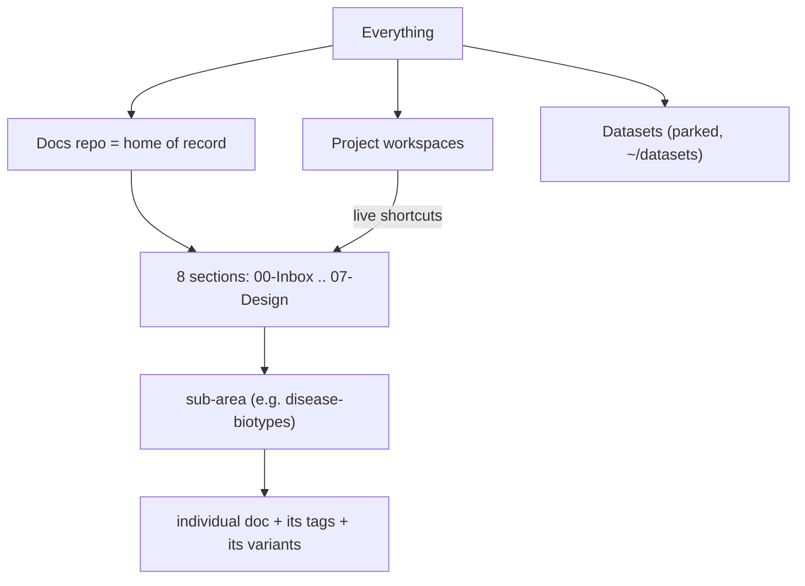

# Master Catalog — Everything We Have and Where It Lives

> **Status**: Active
> **Date**: 2026-07-10
> **Author**: @shahin
> **Audience**: stakeholders, engineers, operators
> **Tags**: `inventory`, `catalog`, `taxonomy`, `provenance`, `knowledge-management`
> **Variants**: Technical (this doc) - Readable (`06-Operations/inventory/simple/MASTER-CATALOG.md`, links back here) - Agent (n/a)

> [!NOTE]
> **TL;DR**: This is the single map of every document and asset across the docs home of record and all project workspaces: what each is, how it is grouped and multi-tagged, and where it previously lived so nothing is lost. Counts are auto-generated by `build_catalog.py`; re-run it any time to refresh. As of 2026-07-10 we track **3,758 live files** plus **7,485 archived prior locations**.

> **Reading time**: ~6 min. **If you only read one thing**: the docs repo is the home of record with 8 sections; every live file is in `catalog.tsv` with its group, type, variant, and tags; every moved or removed file is in `provenance-archives.tsv`; re-run `build_catalog.py` to regenerate all counts.

---

## 1. What this catalog is (and its parts)

| File | What it is | Edit by hand? |
|------|-----------|:-------------:|
| `MASTER-CATALOG.md` (this doc) | The human map: structure, taxonomy, provenance, how to iterate | Yes (prose) |
| `catalog.tsv` | One row per live file: root, section, type, variant, tags, title, path | No (generated) |
| `catalog-tables.md` | Auto-generated tally tables (live numbers) | No (generated) |
| `catalog-summary.json` | Machine summary of the tallies | No (generated) |
| `provenance-archives.tsv` | Every file inside the safety archives = where things previously lived | No (generated) |
| `build_catalog.py` | The re-runnable engine; re-run after any move or re-tag | Yes (to refine rules) |

> [!TIP]
> To refresh after changes, run `build_catalog.py`. It rewrites the TSV, JSON, and tables. This doc's prose stays; only the snapshot numbers in Section 2 may drift, so trust `catalog-tables.md` for live counts.

## 2. Snapshot (auto-generated 2026-07-10)

- **Live files tracked**: 3,758 (docs home 974; project workspaces 2,784).
- **Standardized headers**: 286 of 1,805 markdown files (16 percent). The remainder is the reformat runway.
- **Archived prior locations**: 7,485 across 15 safety archives. Rollback tag: `pre-promotion-2026-07-10`.
- **Datasets** (parked outside the repos): 190 MB, 251 files at `https://github.com/cytognosis/datasets/tree/main/cytognosis`.

**By root (home of record vs project workspaces):**

| Root | Files |
|------|------:|
| project:Science and Platform | 1912 |
| docs (home of record) | 974 |
| project:Grants | 580 |
| project:Website | 163 |
| project:Refactor | 63 |
| project:Infrastructure and Tooling | 28 |
| project:Yar | 20 |
| project:Cytos | 12 |
| project:Cytognosis | 4 |
| project:Operations | 1 |
| project:Strategic Planning | 1 |

**Docs repo by section:**

| Section | Files | Holds |
|---------|------:|-------|
| 04-Engineering | 355 | cytos, schemas + ontologies (incl. the tag ontology), yar engineering |
| 02-Funding | 188 | reusable-blocks slot-library, 76 funder profiles (Area D) |
| 03-Products | 154 | Cytonome, Yar product specs (Area C) |
| 01-Strategy | 117 | numbered master-plan chapters, landscape docs (Area D narrative) |
| 05-Research | 104 | foundational: disease-biotypes (Area A), dimensional psych axes (Area B), cytoverse |
| 06-Operations | 38 | communications, audits, data-strategy, this inventory |
| 00-Inbox | 6 | intake, not yet placed |
| 07-Design | 5 | design-system pointers (design-system chat owns the merge; do not touch) |

> [!NOTE]
> **Why Science and Platform is the largest pile (101):** it holds the design-system assets (images, diagrams, generated files). A separate design-system chat owns that merge, so this catalog lists it for completeness but we do not modify it here.

## 3. Structural hierarchy (where things live)

There are two kinds of place, and one rule:

- **Docs repo = home of record** at `https://github.com/cytognosis/docs`, organized into 8 sections (`00-Inbox` ... `07-Design`). Obsidian mirrors this 1:1 and holds the readable twins.
- **Project workspaces** at `~/Claude/Projects/*` = where work happens. Each reaches its canonical docs through a `_context/` folder of live shortcuts. **Edit in the repo, never in `_context`.**

## 4. Multi-tag taxonomy (how things are labeled)

Grouping (Section 3) says WHERE a file sits. Tagging says WHAT it is, across three independent axes, so one file can carry several tags and roll up in more than one view. The canonical vocabulary is `04-Engineering/cytos/schemas-ontologies/tagging-ontology.md`.

| Axis | Question it answers | Vocabulary | Example value |
|------|--------------------|-----------|---------------|
| **use_case** | What kind of work is this? | `cso:` (SWEBOK / Wikidata coding use-cases) | `cso:Documentation` |
| **org_function** | Which business function owns it? | APQC PCF code + ArchiMate type | `apqc 8.0`, `archimate:BusinessFunction` |
| **domain** | What subject area? | `cso:` + GitHub topics | `cso:KnowledgeGraph`, `knowledge-management` |

- **Multi-tagging**: a doc may hold multiple values per axis (e.g., a grant doc is `use_case: grant` + `domain: neuroscience` + `org_function: 3.0 market/sell`).
- **Hierarchical rollup**: child tags roll up to parents (Obsidian `parent/child` notation), so counts aggregate cleanly.
- **Document type** (adr, module-spec, funding-profile, research, etc.) is a separate, single-valued facet inferred from filename prefix or section; see `catalog.tsv`.

## 5. Variant model (paired versions)

Per the doc skill (v5.6.0):

- **Technical** variant lives in the docs repo under a clean base filename (no suffix).
- **Readable** twin lives in the Obsidian vault under the **same filename** and **must link back** to the technical original. Technical and readable are **always paired**, linked **both ways** in the header `Variants:` line.
- **Agent** variant is a `_prompt.md` only for a true hand-off; it is a **skill or repo seed** to guide coding/research/planning, not a reading companion.

> [!WARNING]
> **Pending migration (Step 3):** the catalog still finds in-repo suffix files that break this rule: `.technical` (5), `.readable` (24), `.simple` (23), and `.agent`/`_prompt` (24). These get migrated to the rule above (technical keeps the clean name; readable moves to Obsidian; agent kept only where a real hand-off exists). Track in `catalog.tsv` (filter `variant`).

## 6. Provenance and safety (nothing is lost)

- **Rollback tag**: `pre-promotion-2026-07-10` in the docs repo restores the pre-consolidation state.
- **Safety archives**: 15 tarballs in `~/Claude/Projects/Refactor/_safety-archives/` capture everything removed or moved. Their full file lists are flattened into `provenance-archives.tsv` (7,485 rows) so any prior path is searchable.
- **Rules in force**: back up and verify before any destructive step; byte-identical (hash) proof before deleting a duplicate; never delete unique content; archive-over-delete (SUPERSEDED banner + move to `_archive/`).

| Archive | Files | What it captured |
|---------|------:|------------------|
| Science-and-Platform (placement + finalizeA) | 1946 + 1947 | Science/Platform dedup + sweep |
| Grants (placement + finalizeA) | 1384 + 1358 | Grants dedup + sweep |
| already-canonical-sweep | 380 | project copies removed after promotion |
| Strategic-Planning | 133 | strategy dedup |
| projects-docs-already-in-docsrepo | 148 | pre-existing docs-repo copies |
| Infrastructure/Yar/Cytos/Cytognosis + xproject-moves | rest | remaining dedup + cross-project moves |

## 7. How to iterate (this is a living map)

1. Move or re-tag files (following the safety rules and the variant model).
2. Re-run `build_catalog.py` to regenerate `catalog.tsv`, `catalog-tables.md`, and the JSON.
3. Adjust the grouping/tagging rules in `build_catalog.py` (the `infer_type`, `infer_variant`, PRUNE sets) as the taxonomy matures.
4. Revise Sections 3 to 5 here when the structure changes; re-verify counts against `catalog-tables.md`.

## 8. Open grouping questions (revise as we go)

- **636 files typed `other` and 996 `diagram/asset`** need finer tags; most sit in Science and Platform. Candidate for a dedicated asset sub-taxonomy.
- **Only 16 percent of markdown has a standard header.** The four-area reformat (Areas A to D) will lift this; the catalog measures progress each run.
- **Project vs section names differ** (e.g., project `Grants` vs section `02-Funding`). Kept intentionally; the mapping is via `_context/`, not renames.

## 9. Maintenance

- **Regenerate**: `python3 06-Operations/inventory/build_catalog.py`
- **Last verified**: 2026-07-10
- **Revisit when**: after each consolidation area completes, or any bulk move.
